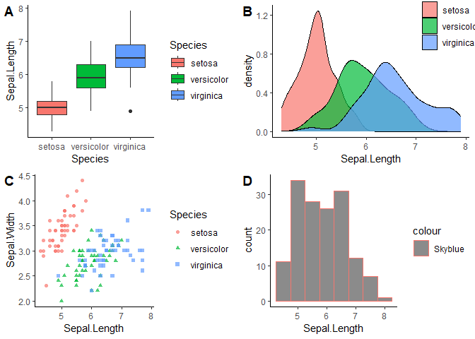

# Introduction

Statistics is a branch of mathematics that deals with the collection,
analysis, interpretation, presentation, and organization of data. It
provides tools and techniques for making sense of complex data sets and
drawing meaningful conclusions from them.

Statistics is used in a wide range of fields, from business and
economics to social sciences, engineering, and medicine. It plays a
vital role in decision-making, helping us to understand patterns,
trends, and relationships in data, and make informed judgments based on
that information.

Some of the key concepts in statistics include measures of central
tendency (such as mean, median, and mode), measures of variability (such
as standard deviation), probability distributions, hypothesis testing,
and regression analysis. Understanding these concepts can help us to
make sense of data and draw accurate conclusions from it.

In summary, statistics provides us with a powerful set of tools for
analyzing data and making informed decisions based on that information.
It is an essential tool for anyone working with data, and is widely used
in many different fields.

## Descriptive and Inferential Statistics

Descriptive statistics and inferential statistics are two branches of
statistics that are used to analyze and interpret data.

Descriptive statistics involves summarizing and describing the
characteristics of a sample or population without making any inferences
or conclusions beyond the data itself. It involves using measures such
as measures of central tendency (e.g. mean, median, mode) and measures
of dispersion (e.g. standard deviation, range) to summarize the data.
Descriptive statistics are often used to provide a general overview of a
dataset, to identify patterns and trends, and to summarize key features
of the data.

Inferential statistics, on the other hand, involves making conclusions
and inferences about a population based on a sample of data. Inferential
statistics use probability theory and statistical methods to estimate
population parameters and test hypotheses about the population.
Inferential statistics are used to make predictions about the population
based on the data from a sample, and to determine the statistical
significance of the findings.

In summary, descriptive statistics is used to describe and summarize the
characteristics of a sample or population, while inferential statistics
is used to make inferences and conclusions about a population based on
data from a sample. Both branches of statistics are important in data
analysis and interpretation, and they complement each other in providing
a comprehensive understanding of the data.

## Sample and population

Sample and population are two terms used in statistics to refer to
groups of individuals or objects.

A population is the entire group of individuals or objects that we want
to study or make inferences about. It is a well-defined group that
exhibits certain characteristics of interest to the researcher. For
example, the population of interest might be all college students in a
particular country or all employees working in a particular company.

A sample, on the other hand, is a subset of the population that is
selected for study or analysis. The sample is selected in a way that it
is representative of the population and allows us to make inferences
about the population. For example, if the population of interest is all
college students in a particular country, a sample might be a randomly
selected group of 100 college students from different colleges across
the country.

The main difference between population and sample is that the population
includes all the individuals or objects of interest, whereas the sample
includes only a subset of the population. In most cases, it is not
feasible or practical to collect data from the entire population, so we
select a sample that is representative of the population and use
statistical methods to make inferences about the population based on the
sample data.

It is important to ensure that the sample is representative of the
population in order to make valid inferences. The process of selecting a
representative sample is called sampling, and it is a crucial step in
the research process.
