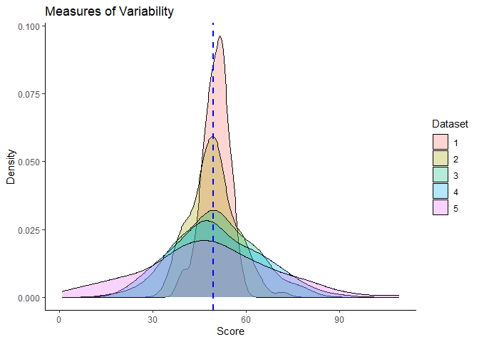

# Numerical measures

Numerical measures are summary statistics that are used to describe the
characteristics of a dataset. They provide information about the central
tendency, variability, and distribution of the data.

## Measures of Central Tendency

Measures of central tendency are numerical measures that describe the
center of a dataset. The three commonly used measures of central
tendency are:

### Mean

-   The mean is the arithmetic average of a dataset.
-   It is calculated by summing all the values in the dataset and
    dividing by the number of observations.
-   The mean is a good measure of central tendency for datasets that are
    **normally distributed or approximately symmetric**.
-   However, the **mean can be influenced by outliers and extreme
    values**, which can skew the results.

$$\huge\frac{1}{n}\sum\_\\ xi$$

-   ∑ = Summation (Adding all observations)
-   n = Number of observations
-   xi = Individual observation

Example: Find the mean of the set {5, 1, 3, 7, 9}.

-   Total number of observation is 5. Hence, n is 5
-   Summation of all observation is (5 + 1 + 3 + 7 + 9) = 25
-   Mean = 25/5 = 5

**Hands on in R**

Suppose we have a vector of numbers representing the test scores of a
group of students:

    test_scores <- c(85, 72, 90, 68, 93, 80, 77, 88)

To calculate the mean of these test scores in R, we can use the `mean()`
function:

-Syntax: `mean(x, na.rm = FALSE)`

na.rm is used to remove the missing values from the input vector.

    mean_score <- mean(test_scores)
    print(mean_score)

    ## [1] 81.625

Therefore, the mean test score of these students is 81.625.

### Median

-   The median is the middle value in a dataset when the values are
    arranged in order.
-   It is **less sensitive to outliers than the mean** and is a good
    measure of central tendency for datasets that are skewed or have
    outliers.
-   The median divides the dataset into two equal parts, with 50% of the
    observations above and 50% below the median.
-   Calculation of median also depends on if the observations are odd or
    even.

**ODD number of observations**: - Arrange the observations from smallest
to largest number. - To calculate median value for odd number of
observation, we have to identify middle location. - Observation located
at middle location is will be considered as median value.

$$\huge\frac{n + 1}{2}$$
 - n = Number of observations

Example: Find the median of the set {5, 1, 3, 7, 9}.

1.  Arrange the numbers in order: {1, 3, 5, 7, 9}.
2.  Identify the middle number: Total number of observation is 5. Hence,
    (5+1)/2 is 3. It means value located at 3rd observation is median
    value.
3.  Hence, 5 is the median value. Therefore, the median of the set {5,
    1, 3, 7, 9} is 5.

**Even number of observations**: - Arrange the observations from
smallest to largest number. - To calculate median value for even number
of observation, we have to identify middle location, here two middle
locations. - Then, we take the average of both values located at the
middle.

$$\huge location\left(\frac{n}{2}, \frac{n}{2}+{1}\right)$$
 - n = Number of observations

Example: Find the median of the set {5, 1, 3, 7, 9, 11}.

1.  Arrange the numbers in order: {1, 3, 5, 7, 9, 11}.
2.  Identify the middle number: Total number of observation is 6. Hence,
    6/2 & (6/2) + 1 location. Here, it average of values located at 3rd
    and 4th number.
3.  Third value is 5 and fourth is 7. So, (5+7)/2 = 6
4.  Hence, 6 is the median value. Therefore, the median of the set {5,
    1, 3, 7, 9, 11} is 6.

**Hands on in R**

Suppose we have a vector of numbers representing the ages of a group of
individuals:

    ages <- c(25, 30, 35, 40, 45, 50, 55)

To calculate the median of these ages in R, you can use the `median()`
function as follows:

-Syntax: `median(x, na.rm = FALSE)`

na.rm is used to remove the missing values from the input vector.

    median_age <- median(ages)
    print(median_age)

    ## [1] 40

Therefore, the median age of this group of individuals is 40.

### Mode

-   The mode is the value that occurs most frequently in a dataset.
-   It is a good measure of central tendency for datasets with a single
    peak or mode.
-   However, it is not always meaningful for datasets with multiple
    modes or no clear mode.

Example: Find the mode of the set {5, 1, 3, 5, 9}.

1.  Identify the most frequent number.
2.  Here, 5 is present twice in the given set. Hence, mode is 5

**Hands on in R**

Suppose we have a vector of numbers representing the test scores of a
group of students:

    test_scores <- c(85, 72, 90, 68, 93, 80, 77, 88, 85)

    score_table <- table(test_scores)
    mode <- as.numeric(names(score_table)[score_table == max(score_table)])
    print(mode)

    ## [1] 85

Let’s break down this code:

1- table(test\_scores) generates a frequency table for the test\_scores
vector, which counts the occurrences of each unique value.

2- max(score\_table) finds the maximum frequency in the table.

3- names(score\_table)\[score\_table == max(score\_table)\] extracts the
value(s) with the maximum frequency from the frequency table.

4- as.numeric(…) converts the result to a numeric value.

The variable mode will store the mode(s) of the test scores. Note that
there can be multiple modes if multiple values have the same highest
frequency.

## Measures of Dispersion

Measures of dispersion, also known as measures of variability or
measures of spread, are statistical measures that provide information
about the spread or distribution of a dataset. They quantify how much
individual data points deviate from the central tendency of the dataset,
such as the mean or median.

