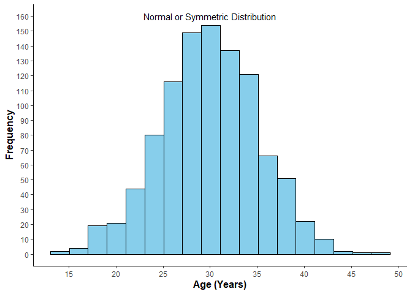
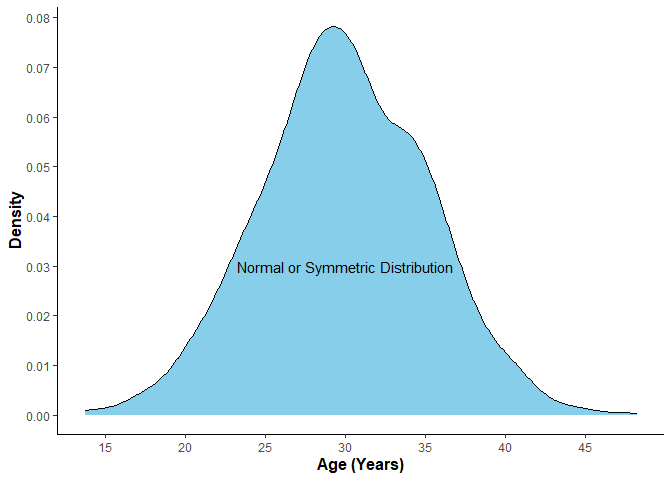
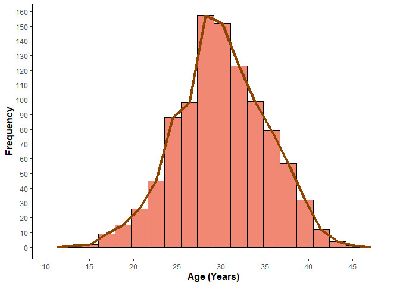
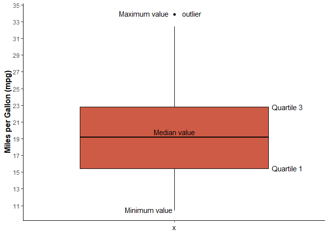
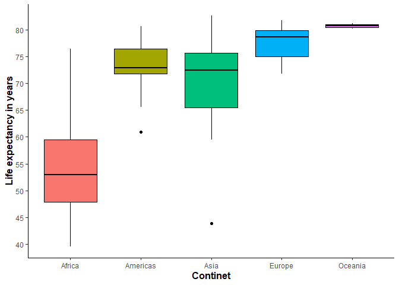
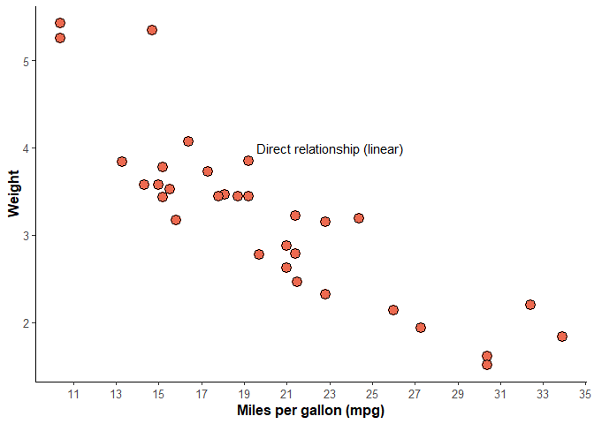
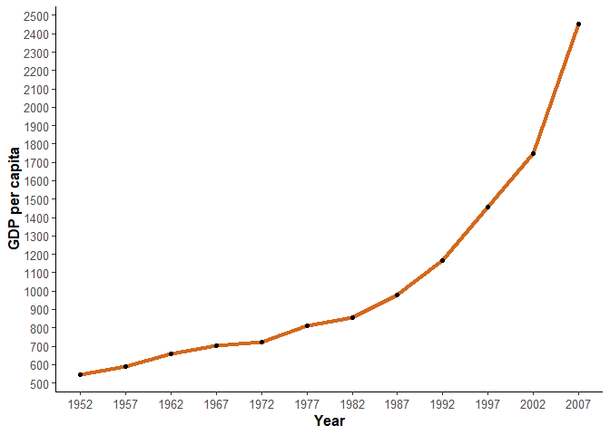
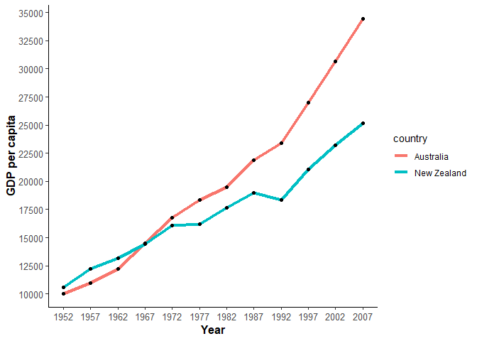
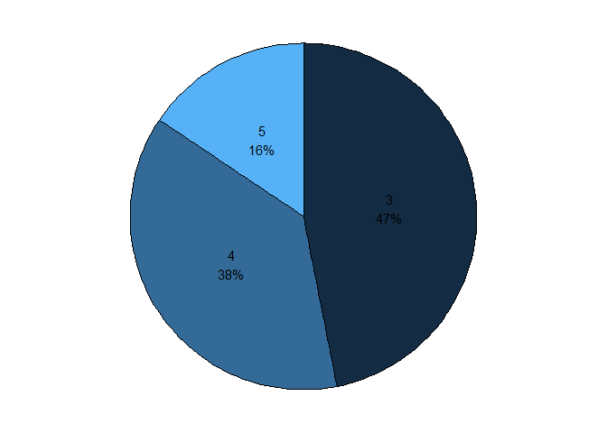

# Graphs

Graphs play a crucial role in statistics as they help visualize data,
identify patterns, and communicate insights effectively. Here are some
commonly used graphs in statistics:

    library(ggplot2) # for data visualization
    library(tidyr)
    library(gapminder)

## Bar Chart

A bar chart displays the distribution of categorical or discrete data.
It consists of bars, where the height represents the frequency or
proportion of each category. Bar charts are are effective in presenting
comparisons between different categories or data points. They are
especially useful when working with discrete data or when showcasing
data that doesn’t have a continuous range..

-   We are using mtcars dataset
-   Before doing visualization a basic exploration of data is must

<!-- -->

    knitr::kable(head(mtcars), caption = "Table 1: The first 6 rows of mtcars dataset")

<table style="width:100%;">
<caption>Table 1: The first 6 rows of mtcars dataset</caption>
<colgroup>
<col style="width: 26%" />
<col style="width: 7%" />
<col style="width: 5%" />
<col style="width: 7%" />
<col style="width: 5%" />
<col style="width: 7%" />
<col style="width: 8%" />
<col style="width: 8%" />
<col style="width: 4%" />
<col style="width: 4%" />
<col style="width: 7%" />
<col style="width: 7%" />
</colgroup>
<thead>
<tr class="header">
<th style="text-align: left;"></th>
<th style="text-align: right;">mpg</th>
<th style="text-align: right;">cyl</th>
<th style="text-align: right;">disp</th>
<th style="text-align: right;">hp</th>
<th style="text-align: right;">drat</th>
<th style="text-align: right;">wt</th>
<th style="text-align: right;">qsec</th>
<th style="text-align: right;">vs</th>
<th style="text-align: right;">am</th>
<th style="text-align: right;">gear</th>
<th style="text-align: right;">carb</th>
</tr>
</thead>
<tbody>
<tr class="odd">
<td style="text-align: left;">Mazda RX4</td>
<td style="text-align: right;">21.0</td>
<td style="text-align: right;">6</td>
<td style="text-align: right;">160</td>
<td style="text-align: right;">110</td>
<td style="text-align: right;">3.90</td>
<td style="text-align: right;">2.620</td>
<td style="text-align: right;">16.46</td>
<td style="text-align: right;">0</td>
<td style="text-align: right;">1</td>
<td style="text-align: right;">4</td>
<td style="text-align: right;">4</td>
</tr>
<tr class="even">
<td style="text-align: left;">Mazda RX4 Wag</td>
<td style="text-align: right;">21.0</td>
<td style="text-align: right;">6</td>
<td style="text-align: right;">160</td>
<td style="text-align: right;">110</td>
<td style="text-align: right;">3.90</td>
<td style="text-align: right;">2.875</td>
<td style="text-align: right;">17.02</td>
<td style="text-align: right;">0</td>
<td style="text-align: right;">1</td>
<td style="text-align: right;">4</td>
<td style="text-align: right;">4</td>
</tr>
<tr class="odd">
<td style="text-align: left;">Datsun 710</td>
<td style="text-align: right;">22.8</td>
<td style="text-align: right;">4</td>
<td style="text-align: right;">108</td>
<td style="text-align: right;">93</td>
<td style="text-align: right;">3.85</td>
<td style="text-align: right;">2.320</td>
<td style="text-align: right;">18.61</td>
<td style="text-align: right;">1</td>
<td style="text-align: right;">1</td>
<td style="text-align: right;">4</td>
<td style="text-align: right;">1</td>
</tr>
<tr class="even">
<td style="text-align: left;">Hornet 4 Drive</td>
<td style="text-align: right;">21.4</td>
<td style="text-align: right;">6</td>
<td style="text-align: right;">258</td>
<td style="text-align: right;">110</td>
<td style="text-align: right;">3.08</td>
<td style="text-align: right;">3.215</td>
<td style="text-align: right;">19.44</td>
<td style="text-align: right;">1</td>
<td style="text-align: right;">0</td>
<td style="text-align: right;">3</td>
<td style="text-align: right;">1</td>
</tr>
<tr class="odd">
<td style="text-align: left;">Hornet Sportabout</td>
<td style="text-align: right;">18.7</td>
<td style="text-align: right;">8</td>
<td style="text-align: right;">360</td>
<td style="text-align: right;">175</td>
<td style="text-align: right;">3.15</td>
<td style="text-align: right;">3.440</td>
<td style="text-align: right;">17.02</td>
<td style="text-align: right;">0</td>
<td style="text-align: right;">0</td>
<td style="text-align: right;">3</td>
<td style="text-align: right;">2</td>
</tr>
<tr class="even">
<td style="text-align: left;">Valiant</td>
<td style="text-align: right;">18.1</td>
<td style="text-align: right;">6</td>
<td style="text-align: right;">225</td>
<td style="text-align: right;">105</td>
<td style="text-align: right;">2.76</td>
<td style="text-align: right;">3.460</td>
<td style="text-align: right;">20.22</td>
<td style="text-align: right;">1</td>
<td style="text-align: right;">0</td>
<td style="text-align: right;">3</td>
<td style="text-align: right;">1</td>
</tr>
</tbody>
</table>

Table 1: The first 6 rows of mtcars dataset

    table(mtcars$cyl)

    ## 
    ##  4  6  8 
    ## 11  7 14

-   11 vehicles have 4 cylinders, 7 vehicles have 6 cylinders and 14
    vehicles have 8 cylinders

<!-- -->

    ggplot(mtcars, aes(x = factor(cyl), fill=as.factor(cyl))) +
      geom_bar(size=1, color = "black")+
      geom_text(stat='count', aes(label=..count..), vjust=-0.5)+
      labs(x = "Cylinders in car", y = "Total count of cylinders")+
      ylim(0, 15)+
      theme_classic()+
      theme(legend.position = 'none', axis.title.x = element_text(size = 12,
                                                                  color = 'darkblue',
                                                                  face = "bold",
                                                                  angle = 0),
            axis.title.y = element_text(size = 12,
                                        color = 'darkblue',
                                        face = "bold",
                                        angle = 90))

Figure 5.1: Bar chart representing total count of cylinders

## Grouped Bar Chart

A grouped bar chart is a type of chart that visually represents and
compares multiple categories or groups across different variables. It
consists of rectangular bars that are grouped together, with each group
representing a specific category or group, and the bars within each
group representing different variables.Grouped bar charts are useful for
visualizing and comparing data when you want to show the relationship
between multiple variables across different categories or groups. They
are particularly effective in displaying data that has distinct
categories and discrete values.

    # Create the grouped bar chart
    ggplot(mtcars, aes(x = as.factor(cyl), fill = as.factor(am))) +
      geom_bar(position = "dodge", color = "black") +
      geom_text(stat='count', aes(label=..count..), position = position_dodge(width = 0.9), vjust=-0.5, size = 3)+
      labs(x = "Number of Cylinders", y = "Count by transmission", fill = "Transmission") +
      scale_fill_manual(values = c("skyblue", "plum"), labels = c("Automatic", "Manual")) +
      theme_classic()+
       theme(axis.title.x = element_text(size = 12,
                                         color = 'darkblue',
                                         face = "bold",
                                         angle = 0),
             axis.title.y = element_text(size = 12,
                                         color = 'darkblue',
                                         face = "bold",
                                         angle = 90))

Figure 5.2: Grouped bar chart examining the difference in cylinder based
on transmission

## Stacked Bar Chart

A stacked bar chart, also known as a stacked bar graph, is a type of
chart that represents multiple categories or data points as a series of
horizontal bars stacked on top of each other. It visually shows the
composition of each category by dividing each bar into segments that
represent different subcategories or components.

Stacked bar charts are useful for visualizing the composition or
distribution of data within different categories. They allow you to
easily compare the relative contributions of different subcategories or
components to the overall total. Stacked bar charts are particularly
effective in showing the relationship between parts and the whole, and
they can be used to analyze data in various fields such as sales, market
share, and demographic distributions.

    # Create the stacked bar chart
    ggplot(mtcars, aes(x = as.factor(cyl), fill = as.factor(gear))) +
      geom_bar(position = "fill", color = "black") +
      geom_text(
        aes(label = scales::percent(..count../tapply(..count.., ..x.., sum)[..x..])),
        stat = "count",
        position = position_fill(vjust = 0.5),
        size = 4
      ) +
      labs(x = "Number of Cylinders", y = "Proportion of vehicles by gear", fill = "Gear") +
      scale_fill_manual(values = c("skyblue", "red", "purple"), labels = c("3", "4", "5")) +
      theme_classic()+
      theme(axis.title.x = element_text(size = 12,
                                         color = 'darkblue',
                                         face = "bold",
                                         angle = 0),
             axis.title.y = element_text(size = 12,
                                         color = 'darkblue',
                                         face = "bold",
                                         angle = 90))

Figure 5.3: Stacked bar chart examining the proportion of gears based on
cylinder

    # Create the stacked bar chart for count
    ggplot(mtcars, aes(x = as.factor(cyl), fill = as.factor(gear))) +
      geom_bar(color = "black") +
      labs(x = "Number of Cylinders", y = "Count", fill = "Gear") +
      theme_classic()+
      theme(axis.title.x = element_text(size = 12,
                                         color = 'black',
                                         face = "bold",
                                         angle = 0),
             axis.title.y = element_text(size = 12,
                                         color = 'black',
                                         face = "bold",
                                         angle = 90))

Figure 5.4: Stacked bar chart examining the count of gears based on
cylinder

## Histogram

A histogram displays the distribution of continuous or discrete data. It
consists of bars where the height represents the frequency or proportion
of data falling within each interval. Histograms help identify the shape
(e.g., symmetric, skewed), central tendency, and variability of a
dataset.

    # Generate normally distributed random data for age
    set.seed(1)
    age_data <- rnorm(1000, mean = 30, sd = 5)

    # Create the normally distributed histogram for age
    ggplot(data.frame(age = age_data), aes(x = age)) +
      geom_histogram(bins = 18, color = "black", fill = "skyblue") +
      labs(x = "Age (Years)", y = "Frequency") +
      annotate("text", x=30, y=160, label= "Normal or Symmetric Distribution")+
      scale_x_continuous(breaks = seq(5, 50, 5))+
      scale_y_continuous(breaks = seq(0, 170, 10))+
      theme_classic()+
      theme(axis.title.x = element_text(size = 12,
                                         color = 'black',
                                         face = "bold",
                                         angle = 0),
             axis.title.y = element_text(size = 12,
                                         color = 'black',
                                         face = "bold",
                                         angle = 90))

Figure 5.5: Histogram to see the distribution of Age variable

-   Histograms can also be used to compare categorical variables using
    continuous data.

<!-- -->

    #make this example reproducible
    set.seed(1)

    #create data frame
    df <- data.frame(Gender = c(rep('Male', 1000), rep('Female', 1000) ),
                       Age = c(rnorm(1000, mean=35, sd=5),
                                 rnorm(1000, mean=23, sd=5)))

    #plot multiple histograms
    ggplot(df, aes(x=Age, fill=Gender)) +
      geom_histogram( color = "black", color='#e9ecef', alpha=0.3, position='identity', bins = 28)+
      labs(x = "Age (Years)", y = "Frequency")+
      scale_x_continuous(breaks = seq(5, 60, 5))+
      scale_y_continuous(breaks = seq(0, 160, 10))+
      theme_classic()+
        theme(axis.title.x = element_text(size = 12,
                                         color = 'black',
                                         face = "bold",
                                         angle = 0),
             axis.title.y = element_text(size = 12,
                                         color = 'black',
                                         face = "bold",
                                         angle = 90))

5.6: Histogram comparing age distribution between males and females

## Density plot

A density plot, also known as a kernel density plot, is a graphical
representation of the probability density function (PDF) of a continuous
random variable. It is used to visualize the distribution of data in a
smooth and continuous manner. They are particularly useful when dealing
with continuous variables or comparing distributions across different
groups or conditions.

    age_data <- rnorm(1000, mean = 30, sd = 5)

    # Create the density plot for age
    ggplot(data.frame(age = age_data), aes(x = age)) +
      geom_density(color = "black", fill = "skyblue") +
      labs(x = "Age (Years)", y = "Density") +
      annotate("text", x = 30, y = 0.03, label = "Normal or Symmetric Distribution") +
      scale_x_continuous(breaks = seq(5, 50, 5)) +
      scale_y_continuous(breaks = seq(0, 0.10, 0.01)) +
      theme_classic() +
      theme(
        axis.title.x = element_text(size = 12,
                                         color = 'black',
                                         face = "bold",
                                         angle = 0),
             axis.title.y = element_text(size = 12,
                                         color = 'black',
                                         face = "bold",
                                         angle = 90))

Figure 5.7: Density plot to see the distribution of Age variable

## Frequency Polygon

A frequency polygon is a graphical representation of the frequency
distribution of a dataset. It is created by connecting the midpoints of
the tops of the bars in a histogram or by plotting the frequencies at
specific points along the x-axis. A frequency polygon is a graphical
tool that represents the frequency distribution of a dataset using
connected line segments, providing a visual depiction of the shape and
pattern of the data distribution.

    age_data <- rnorm(1000, mean = 30, sd = 5)

    # Create the histogram and frequency polygon plot for age
    ggplot(data.frame(age = age_data), aes(x = age)) +
      geom_histogram(bins = 18, color = "black", fill = "coral2", alpha = 0.8) +
      geom_freqpoly(size = 1.5, color = "darkorange4", fill = NA, bins = 18) +
      labs(x = "Age (Years)", y = "Frequency") +
      scale_x_continuous(breaks = seq(5, 50, 5)) +
      scale_y_continuous(breaks = seq(0, 170, 10)) +
      theme_classic() +
      theme(
        axis.title.x = element_text(size = 12, color = 'black', face = "bold", angle = 0),
        axis.title.y = element_text(size = 12, color = 'black', face = "bold", angle = 90)
      )

Figure 5.8: Frequency polygon plot to see the distribution of Age
variable

## Box and Whisker plot

A box plot, also known as a box-and-whisker plot, provides a visual
summary of the distribution of continuous data. It displays the median,
quartiles, and outliers of the dataset. Box plots are useful for
comparing distributions, identifying skewness, and detecting potential
outliers. Box plot also provides 5 data points summary:

-   Minimum
-   Quartile 1 (25th percentile value)
-   Quartile 2 (Median or 50th percentile value)
-   Quartile 3 (75th percentile value)
-   Maximum

<!-- -->

    # Create the box plot for mpg
    ggplot(mtcars, aes(x = "", y = mpg)) +
      geom_boxplot(color = "black", fill = "coral3") +
      scale_y_continuous(breaks = seq(5, 40, 2))+
      labs(y = "Miles per Gallon (mpg)") +
      annotate("text", x = 1.07, y = 34, label = "outlier") +
      annotate("text", x = 1.45, y = 22.8, label = "Quartile 3") +
      annotate("text", x = 1.45, y = 15.5, label = "Quartile 1") +
      annotate("text", x = 1, y = 19.8, label = "Median value") +
      annotate("text", x = 0.90, y = 10.5, label = "Minimum value") +
      annotate("text", x = 0.88, y = 34, label = "Maximum value") +
      theme_classic() +
      theme(
        axis.text.x = element_blank(),
        axis.title.y = element_text(size = 12, color = "black", face = "bold", angle = 90)
      )

Figure 5.9: Box and Whisker plot to see the distribution of miles per
gallon variable

    knitr::kable(head(gapminder), caption = "Table 2: The first 6 rows of gapminder dataset")

<table>
<caption>Table 2: The first 6 rows of gapminder dataset</caption>
<thead>
<tr class="header">
<th style="text-align: left;">country</th>
<th style="text-align: left;">continent</th>
<th style="text-align: right;">year</th>
<th style="text-align: right;">lifeExp</th>
<th style="text-align: right;">pop</th>
<th style="text-align: right;">gdpPercap</th>
</tr>
</thead>
<tbody>
<tr class="odd">
<td style="text-align: left;">Afghanistan</td>
<td style="text-align: left;">Asia</td>
<td style="text-align: right;">1952</td>
<td style="text-align: right;">28.801</td>
<td style="text-align: right;">8425333</td>
<td style="text-align: right;">779.4453</td>
</tr>
<tr class="even">
<td style="text-align: left;">Afghanistan</td>
<td style="text-align: left;">Asia</td>
<td style="text-align: right;">1957</td>
<td style="text-align: right;">30.332</td>
<td style="text-align: right;">9240934</td>
<td style="text-align: right;">820.8530</td>
</tr>
<tr class="odd">
<td style="text-align: left;">Afghanistan</td>
<td style="text-align: left;">Asia</td>
<td style="text-align: right;">1962</td>
<td style="text-align: right;">31.997</td>
<td style="text-align: right;">10267083</td>
<td style="text-align: right;">853.1007</td>
</tr>
<tr class="even">
<td style="text-align: left;">Afghanistan</td>
<td style="text-align: left;">Asia</td>
<td style="text-align: right;">1967</td>
<td style="text-align: right;">34.020</td>
<td style="text-align: right;">11537966</td>
<td style="text-align: right;">836.1971</td>
</tr>
<tr class="odd">
<td style="text-align: left;">Afghanistan</td>
<td style="text-align: left;">Asia</td>
<td style="text-align: right;">1972</td>
<td style="text-align: right;">36.088</td>
<td style="text-align: right;">13079460</td>
<td style="text-align: right;">739.9811</td>
</tr>
<tr class="even">
<td style="text-align: left;">Afghanistan</td>
<td style="text-align: left;">Asia</td>
<td style="text-align: right;">1977</td>
<td style="text-align: right;">38.438</td>
<td style="text-align: right;">14880372</td>
<td style="text-align: right;">786.1134</td>
</tr>
</tbody>
</table>

Table 2: The first 6 rows of gapminder dataset

-   Box plot can also be used to compare multiple categories and a good
    visualization for T test and ANOVA analysis

<!-- -->

    gap_2007 <- gapminder %>% 
      dplyr::filter(year==2007)

    ggplot(gap_2007, aes(x = continent, y = lifeExp, fill = continent))+
      geom_boxplot(color="black")+
      labs(x = "Continet", y = "Life expectancy in years")+
      scale_y_continuous(breaks = seq(30, 90, 5))+
      theme_classic()+ 
      theme(
        axis.title.x = element_text(size = 12,
                                         color = 'black',
                                         face = "bold",
                                         angle = 0),
             axis.title.y = element_text(size = 12,
                                         color = 'black',
                                         face = "bold",
                                         angle = 90), legend.position = "none")

5.10: Box plot used to compare continents based on life expectancy

## Scatter plot

A scatter plot shows the relationship between two continuous variables.
Each data point is represented as a point on the graph, allowing for the
identification of patterns, trends, and the strength of the association
between the variables. Scatter plots are commonly used in correlation
analysis.

    # Create the scatter plot for mpg and weight
    ggplot(mtcars, aes(x = mpg, y = wt)) +
      geom_point(color= "black", fill = "coral2", size = 4, shape = 21) +
      labs(x = "Miles per gallon (mpg)", y = "Weight") +
      scale_x_continuous(breaks = seq(5, 40, 2))+
      scale_y_continuous(breaks = seq(1, 7, 1))+
      annotate("text", x = 23, y = 4, label = "Direct relationship (linear)") +
      theme_classic() +
      theme(
        axis.title = element_text(size = 12, color = "black", face = "bold"),
        axis.text = element_text(size = 10),
        legend.position = "none"
      )

Figure 5.11: Scatter plot to see the relationship between miles per
gallon and weight column

    # Create the scatter plot for mpg and weight
    ggplot(mtcars, aes(x = hp, y = wt)) +
      geom_point(color= "black", fill = "skyblue", size = 3, shape = 23) +
      labs(x = "Horse power", y = "Weight") +
      scale_x_continuous(breaks = seq(50, 500, 50))+
      scale_y_continuous(breaks = seq(0.0, 6.0, 1.0))+
      annotate("text", x = 200, y = 2.5, label = "Inverse relationship (linear)") +
      theme_classic() +
      theme(
        axis.title = element_text(size = 12, color = "black", face = "bold"),
        axis.text = element_text(size = 10),
        legend.position = "none"
      )

Figure 5.12: Scatter plot to see the relationship between horse power
and weight

    gdp_2007 <- gapminder %>% 
      dplyr::filter(year == 2007)

    ggplot(gdp_2007, aes(x = gdpPercap, y = lifeExp, shape = continent, color = continent))+
      geom_point(size = 1.5)+
      labs(x = "GDP per Capita in 2007", y = "Life expectancy in 2007")+
      scale_x_continuous(breaks = seq(0, 60000, 5000))+
      scale_y_continuous(breaks = seq(30, 90, 5))+
      annotate("text", x = 25000, y = 67, label = "Non-linear relationship") +
      theme_classic()+
      theme(
        axis.title = element_text(size = 12, color = "black", face = "bold"),
        axis.text = element_text(size = 10))

5.13 Scatter plot to see the relationship between GDP per capita and
Life Expectancy in 2007 by continent

## Line Chart

A line chart displays the relationship between two continuous variables
over time or any other ordered variable. It shows the trend, patterns,
and changes in the data over a specific period. Line charts are commonly
used in time series analysis and tracking variables over time.

    # Filter data for a specific country (e.g., United States)
    country_data <- gapminder %>% 
      dplyr::filter(country == "India")

    # Create the line chart
    ggplot(country_data, aes(x = year, y = gdpPercap)) +
      geom_line(color = "chocolate", size = 1.5) +
      geom_point()+
      labs(x = "Year", y = "GDP per capita") +
      scale_x_continuous(breaks = seq(1952, 2007, 5))+
      scale_y_continuous(breaks = seq(100, 3000, 100))+
      theme_classic() +
      theme(
        axis.title = element_text(size = 12, color = "black", face = "bold"),
        axis.text = element_text(size = 10),
        legend.position = "none"
      )

Figure 5.14: Line chart showing the trend in GDP per capita in India
from 1952 till 2007

    # Filter data for a specific country (e.g., United States)
    continent_data <- gapminder %>% 
      dplyr::filter(continent == "Oceania")

    # Create the line chart
    ggplot(continent_data, aes(x = year, y = gdpPercap, color = country)) +
      geom_line(size = 1.5) +
      geom_point(color = "black",)+
      labs(x = "Year", y = "GDP per capita") +
      scale_x_continuous(breaks = seq(1952, 2007, 5))+
      scale_y_continuous(breaks = seq(0, 40000, 2500))+
      theme_classic() +
      theme(
        axis.title = element_text(size = 12, color = "black", face = "bold"),
        axis.text = element_text(size = 10)
      )

Figure 5.15: Line chart comparing the trend in GDP per capita between
Austrailia and New Zeland from 1952 till 2007

## Pie Chart

A pie chart represents the composition of a whole in terms of its parts.
It is a circular graph where each slice (or sector) represents a
category, and the angle of the slice corresponds to the proportion of
that category. Pie charts are useful for displaying proportions and
relative contributions of different categories.

    mtcars$gear <- as.factor(mtcars$gear)
    plotdata <- mtcars %>%
     dplyr::count(gear) %>%
      dplyr::arrange(desc(gear)) %>%
      dplyr::mutate(prop = round(n*100/sum(n), 1),
             lab.ypos = cumsum(prop) - 0.5*prop)

    plotdata$label <- paste0(plotdata$gear, "\n",
                             round(plotdata$prop), "%")

    ggplot(plotdata, aes(x = "", y = prop, fill = gear)) +
      geom_bar(width = 1, stat = "identity",  color = "black") +
      scale_fill_brewer(palette="Dark2") +
      geom_text(aes(y = lab.ypos, label = label), 
                color = "black") +
      coord_polar("y", start = 0,  direction = -1) +
      theme_void() +
      theme(legend.position = "FALSE")

Figure 5.16: Pie chart showing the distribution of number of gears

