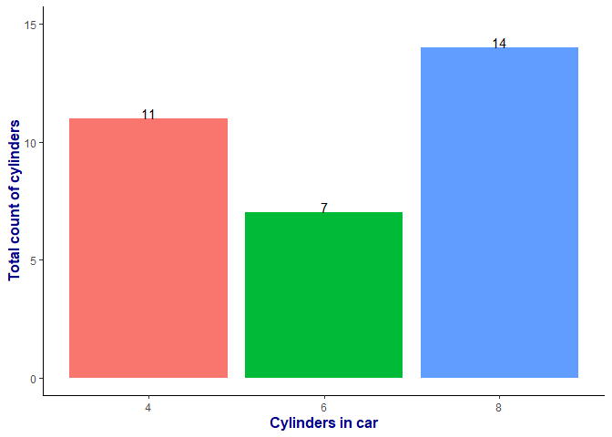
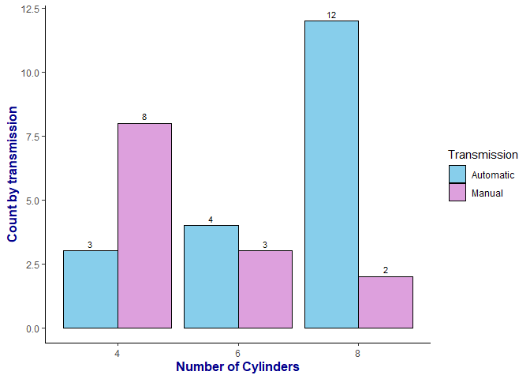
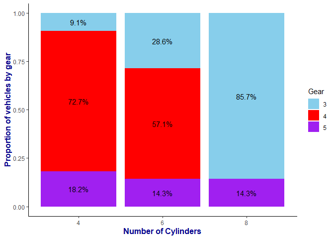
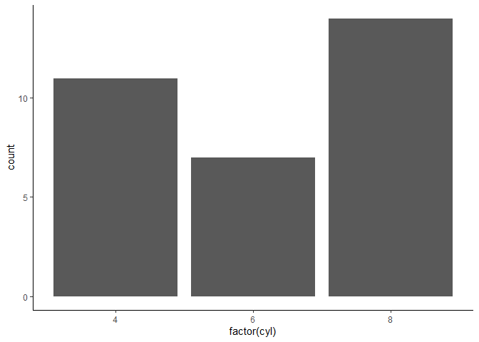

# Graphs

Graphs play a crucial role in statistics as they help visualize data,
identify patterns, and communicate insights effectively. Here are some
commonly used graphs in statistics:

## Bar Chart

A bar chart displays the distribution of categorical or discrete data.
It consists of bars, where the height represents the frequency or
proportion of each category. Bar charts are are effective in presenting
comparisons between different categories or data points. They are
especially useful when working with discrete data or when showcasing
data that doesn’t have a continuous range..

-   We are using mtcars dataset
-   Before doing visualization a basic exploration of data is must

<table style="width:100%;">
<caption>Table 1: The first 6 rows of mtcars dataset</caption>
<colgroup>
<col style="width: 26%" />
<col style="width: 7%" />
<col style="width: 5%" />
<col style="width: 7%" />
<col style="width: 5%" />
<col style="width: 7%" />
<col style="width: 8%" />
<col style="width: 8%" />
<col style="width: 4%" />
<col style="width: 4%" />
<col style="width: 7%" />
<col style="width: 7%" />
</colgroup>
<thead>
<tr class="header">
<th style="text-align: left;"></th>
<th style="text-align: right;">mpg</th>
<th style="text-align: right;">cyl</th>
<th style="text-align: right;">disp</th>
<th style="text-align: right;">hp</th>
<th style="text-align: right;">drat</th>
<th style="text-align: right;">wt</th>
<th style="text-align: right;">qsec</th>
<th style="text-align: right;">vs</th>
<th style="text-align: right;">am</th>
<th style="text-align: right;">gear</th>
<th style="text-align: right;">carb</th>
</tr>
</thead>
<tbody>
<tr class="odd">
<td style="text-align: left;">Mazda RX4</td>
<td style="text-align: right;">21.0</td>
<td style="text-align: right;">6</td>
<td style="text-align: right;">160</td>
<td style="text-align: right;">110</td>
<td style="text-align: right;">3.90</td>
<td style="text-align: right;">2.620</td>
<td style="text-align: right;">16.46</td>
<td style="text-align: right;">0</td>
<td style="text-align: right;">1</td>
<td style="text-align: right;">4</td>
<td style="text-align: right;">4</td>
</tr>
<tr class="even">
<td style="text-align: left;">Mazda RX4 Wag</td>
<td style="text-align: right;">21.0</td>
<td style="text-align: right;">6</td>
<td style="text-align: right;">160</td>
<td style="text-align: right;">110</td>
<td style="text-align: right;">3.90</td>
<td style="text-align: right;">2.875</td>
<td style="text-align: right;">17.02</td>
<td style="text-align: right;">0</td>
<td style="text-align: right;">1</td>
<td style="text-align: right;">4</td>
<td style="text-align: right;">4</td>
</tr>
<tr class="odd">
<td style="text-align: left;">Datsun 710</td>
<td style="text-align: right;">22.8</td>
<td style="text-align: right;">4</td>
<td style="text-align: right;">108</td>
<td style="text-align: right;">93</td>
<td style="text-align: right;">3.85</td>
<td style="text-align: right;">2.320</td>
<td style="text-align: right;">18.61</td>
<td style="text-align: right;">1</td>
<td style="text-align: right;">1</td>
<td style="text-align: right;">4</td>
<td style="text-align: right;">1</td>
</tr>
<tr class="even">
<td style="text-align: left;">Hornet 4 Drive</td>
<td style="text-align: right;">21.4</td>
<td style="text-align: right;">6</td>
<td style="text-align: right;">258</td>
<td style="text-align: right;">110</td>
<td style="text-align: right;">3.08</td>
<td style="text-align: right;">3.215</td>
<td style="text-align: right;">19.44</td>
<td style="text-align: right;">1</td>
<td style="text-align: right;">0</td>
<td style="text-align: right;">3</td>
<td style="text-align: right;">1</td>
</tr>
<tr class="odd">
<td style="text-align: left;">Hornet Sportabout</td>
<td style="text-align: right;">18.7</td>
<td style="text-align: right;">8</td>
<td style="text-align: right;">360</td>
<td style="text-align: right;">175</td>
<td style="text-align: right;">3.15</td>
<td style="text-align: right;">3.440</td>
<td style="text-align: right;">17.02</td>
<td style="text-align: right;">0</td>
<td style="text-align: right;">0</td>
<td style="text-align: right;">3</td>
<td style="text-align: right;">2</td>
</tr>
<tr class="even">
<td style="text-align: left;">Valiant</td>
<td style="text-align: right;">18.1</td>
<td style="text-align: right;">6</td>
<td style="text-align: right;">225</td>
<td style="text-align: right;">105</td>
<td style="text-align: right;">2.76</td>
<td style="text-align: right;">3.460</td>
<td style="text-align: right;">20.22</td>
<td style="text-align: right;">1</td>
<td style="text-align: right;">0</td>
<td style="text-align: right;">3</td>
<td style="text-align: right;">1</td>
</tr>
</tbody>
</table>

Table 1: The first 6 rows of mtcars dataset

    ## 
    ##  4  6  8 
    ## 11  7 14

-   11 vehicles have 4 cylinders, 7 vehicles have 6 cylinders and 14
    vehicles have 8 cylinders

Figure 5.1: Bar chart representing total count of cylinders

## Grouped Bar Chart

A grouped bar chart is a type of chart that visually represents and
compares multiple categories or groups across different variables. It
consists of rectangular bars that are grouped together, with each group
representing a specific category or group, and the bars within each
group representing different variables.Grouped bar charts are useful for
visualizing and comparing data when you want to show the relationship
between multiple variables across different categories or groups. They
are particularly effective in displaying data that has distinct
categories and discrete values.

Figure 5.2: Grouped bar chart examining the difference in cylinder based
on transmission

## Stacked Bar Chart

A stacked bar chart, also known as a stacked bar graph, is a type of
chart that represents multiple categories or data points as a series of
horizontal bars stacked on top of each other. It visually shows the
composition of each category by dividing each bar into segments that
represent different subcategories or components.

Stacked bar charts are useful for visualizing the composition or
distribution of data within different categories. They allow you to
easily compare the relative contributions of different subcategories or
components to the overall total. Stacked bar charts are particularly
effective in showing the relationship between parts and the whole, and
they can be used to analyze data in various fields such as sales, market
share, and demographic distributions.

Figure 5.3: Stacked bar chart examining the proportion of gears based on
cylinder

Figure 5.4: Stacked bar chart examining the count of gears based on
cylinder

## Pie Chart

A pie chart represents the composition of a whole in terms of its parts.
It is a circular graph where each slice (or sector) represents a
category, and the angle of the slice corresponds to the proportion of
that category. Pie charts are useful for displaying proportions and
relative contributions of different categories.

## Histogram

A histogram displays the distribution of continuous or discrete data. It
consists of bars where the height represents the frequency or proportion
of data falling within each interval. Histograms help identify the shape
(e.g., symmetric, skewed), central tendency, and variability of a
dataset.

## Frequency Polygon

## Density plot

## Stem and Leaf plot

## Box plot

A box plot, also known as a box-and-whisker plot, provides a visual
summary of the distribution of continuous data. It displays the median,
quartiles, and outliers of the dataset. Box plots are useful for
comparing distributions, identifying skewness, and detecting potential
outliers.

## Scatter plot

A scatter plot shows the relationship between two continuous variables.
Each data point is represented as a point on the graph, allowing for the
identification of patterns, trends, and the strength of the association
between the variables. Scatter plots are commonly used in correlation
analysis.

## Bubble plot

## Line Chart

A line chart displays the relationship between two continuous variables
over time or any other ordered variable. It shows the trend, patterns,
and changes in the data over a specific period. Line charts are commonly
used in time series analysis and tracking variables over time.
