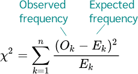

# Chi-squared test

The chi-squared test (χ² test) is a statistical hypothesis test that is
used to determine if there is a significant association between two
categorical variables. The test is used to determine whether the
observed frequencies of the categories in the sample differ
significantly from the expected frequencies based on a theoretical
distribution.

The test works by comparing the observed frequencies to the expected
frequencies that would be obtained if the null hypothesis were true. The
null hypothesis in this case is that there is no association between the
two variables.

The test statistic for the chi-squared test is the sum of the squared
differences between the observed and expected frequencies, divided by
the expected frequencies. The resulting value is compared to a
chi-squared distribution with degrees of freedom equal to the number of
categories minus one.

If the calculated value of the chi-squared test statistic is larger than
the critical value from the chi-squared distribution with the
appropriate degrees of freedom, then the null hypothesis is rejected,
and it can be concluded that there is a significant association between
the two variables. On the other hand, if the calculated value is smaller
than the critical value, then the null hypothesis is not rejected, and
it can be concluded that there is no significant association between the
two variables.

The chi-squared test is commonly used in fields such as biology,
psychology, social sciences, and marketing research, among others, to
analyze and interpret categorical data.

## Application of the Chi-squared test

1- Independence test: The chi-squared test of independence is used to
determine if there is a significant association between two categorical
variables. To illustrate this, let’s consider an example.

Suppose we are interested in whether there is an association between
gender and favorite ice cream flavor. We survey a group of 100 people
and ask them to choose their favorite ice cream flavor from vanilla,
chocolate, and strawberry, and also ask for their gender. The data we
collect is shown in the table below:

<table>
<thead>
<tr class="header">
<th></th>
<th>Vanilla</th>
<th>Chocolate</th>
<th>Strawberry</th>
<th>Total</th>
</tr>
</thead>
<tbody>
<tr class="odd">
<td>Male</td>
<td>20</td>
<td>30</td>
<td>10</td>
<td>60</td>
</tr>
<tr class="even">
<td>Female</td>
<td>25</td>
<td>10</td>
<td>5</td>
<td>40</td>
</tr>
<tr class="odd">
<td>Total</td>
<td>45</td>
<td>40</td>
<td>15</td>
<td>100</td>
</tr>
</tbody>
</table>

We want to determine whether there is an association between gender and
favorite ice cream flavor. To do this, we can perform a chi-squared test
of independence. The null hypothesis is that there is no association
between the two variables, while the alternative hypothesis is that
there is an association.

The first step is to calculate the expected frequencies for each cell
under the assumption that the null hypothesis is true. To do this, we
can use the formula:

Expected frequency = (row total \* column total) / grand total

For example, the expected frequency for the first cell (male-vanilla)
is:

Expected frequency = (60 \* 45) / 100 = 27

We can calculate the expected frequencies for all the cells and fill in
the table below:

2- Distribution test: Are the observed values of two categorical
variables equal to the expected values? One question could be, is one of
the three video streaming services Netflix, Amazon, and hotstar
subscribed to above average?

3- Homogeneity test: Are two or more samples from the same population?
One question could be whether the subscription frequencies of the three
video streaming services Netflix, Amazon and Disney differ in different
age groups.

# Reference:

<https://datatab.net/tutorial/chi-square-test>
