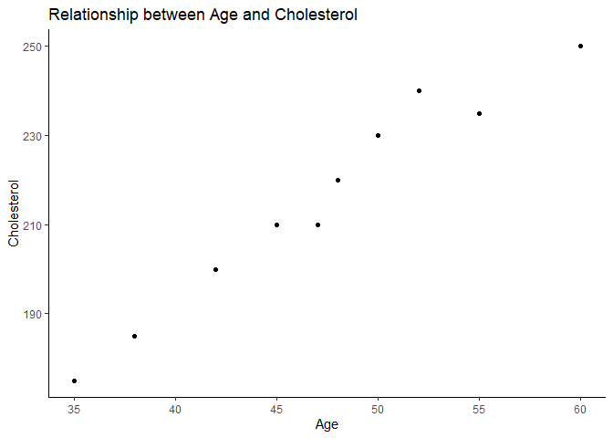
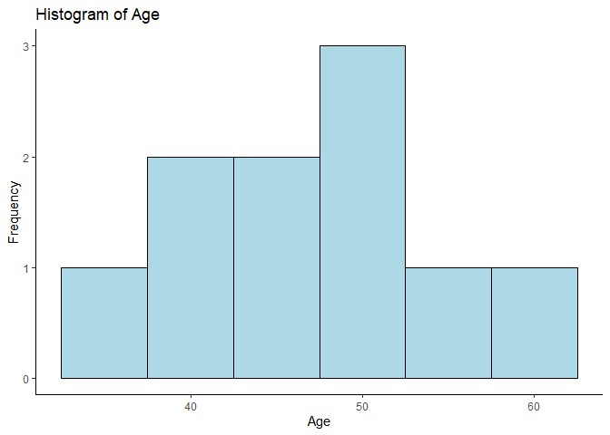
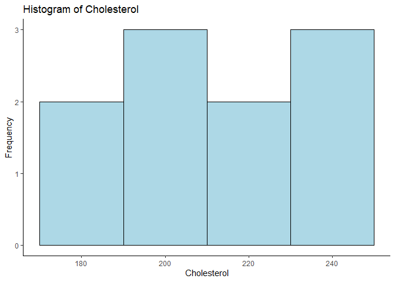
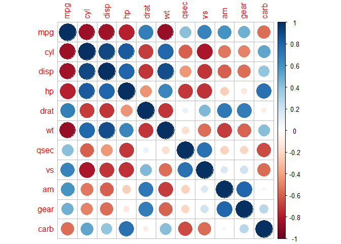
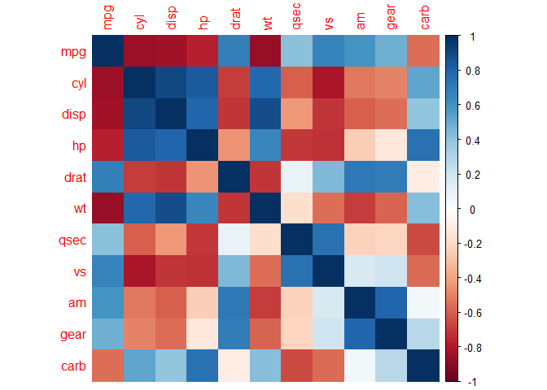

# Correlation

Correlation analysis is a statistical method used to examine the
strength and direction of the relationship between two continuous
variables. The most commonly used correlation coefficient is **Pearson’s
correlation coefficient**, which measures the linear relationship
between two variables. Pearson’s correlation coefficient, denoted by
“r,” takes on values between -1 and 1, where a value of -1 indicates a
perfect negative correlation, a value of 0 indicates no correlation, and
a value of 1 indicates a perfect positive correlation.

To perform a correlation analysis, we first need to collect data on the
two variables of interest. Once we have the data, we can calculate the
correlation coefficient using R.

For example, suppose we want to examine the relationship between a
person’s age and their cholesterol level. We collect data on 100
individuals and obtain the following data:

<table>
<thead>
<tr class="header">
<th>Age (in years)</th>
<th>Cholesterol Level (in mg/dL)</th>
</tr>
</thead>
<tbody>
<tr class="odd">
<td>45</td>
<td>210</td>
</tr>
<tr class="even">
<td>38</td>
<td>185</td>
</tr>
<tr class="odd">
<td>52</td>
<td>240</td>
</tr>
<tr class="even">
<td>60</td>
<td>250</td>
</tr>
<tr class="odd">
<td>35</td>
<td>175</td>
</tr>
<tr class="even">
<td>42</td>
<td>200</td>
</tr>
<tr class="odd">
<td>48</td>
<td>220</td>
</tr>
<tr class="even">
<td>55</td>
<td>235</td>
</tr>
<tr class="odd">
<td>50</td>
<td>230</td>
</tr>
<tr class="even">
<td>47</td>
<td>210</td>
</tr>
</tbody>
</table>

## Pearson Correlation Coefficient

Pearson correlation is a statistical technique used to measure the
strength and direction of the linear relationship between two continuous
variables. It assumes that both variables are normally distributed and
have a linear relationship. The Pearson correlation coefficient (r)
ranges from -1 to +1, where a value of -1 indicates a perfect negative
correlation, 0 indicates no correlation, and +1 indicates a perfect
positive correlation.

There are a few assumptions that must be met in order to use Pearson
correlation:

**1. Normality:** Both variables should be normally distributed. You can
check for normality using a histogram, a Q-Q plot, or a normal
probability plot.

**2. Linearity:** The relationship between the two variables should be
linear. You can check for linearity by creating a scatter plot of the
two variables and visually inspecting the plot to see if there is a
linear relationship.

**3. Level of measurement:** Both variables should be continuous.

**4. Realted pairs:** Each observation in the dataset should have a pair
of values.

**5. No outliers:** here should be no extreme outliers in the dataset.

**6. Independence:** The observations should be independent of each
other. This means that there should be no relationship between the
observations that could influence the correlation coefficient.

If these assumptions are not met, the results of the Pearson correlation
may be biased or misleading. If the normality assumption is not met, you
may need to transform the data or use a nonparametric correlation
technique such as **Spearman’s rank correlation**. If the independence
assumption is not met, you may need to use a different statistical
technique or account for the non-independence using a mixed-effects
model or other appropriate method.

    # Check for normality
    ggplot(mydata, aes(x = age)) +
      geom_histogram(binwidth = 5, fill = "lightblue", color = "black") +
      labs(title = "Histogram of Age", x = "Age", y = "Frequency")+
      theme_classic()

    ggplot(mydata, aes(x = cholesterol)) +
      geom_histogram(binwidth = 20,fill = "lightblue", color = "black") +
      labs(title = "Histogram of Cholesterol", x = "Cholesterol", y = "Frequency")+
      theme_classic()

    # Shapiro-Wilk normality test for mpg
    #H0: data are normally distributed
    shapiro.test(mydata$age) 

    ## 
    ##  Shapiro-Wilk normality test
    ## 
    ## data:  mydata$age
    ## W = 0.99077, p-value = 0.9977

p value is 0.9977 which is greater than 0.05. Hence, null hypothesis is
true

    # Shapiro-Wilk normality test for wt
    shapiro.test(mydata$cholesterol)

    ## 
    ##  Shapiro-Wilk normality test
    ## 
    ## data:  mydata$cholesterol
    ## W = 0.96909, p-value = 0.8823

p value is 0.8823 which is greater than 0.05. Hence, null hypothesis is
true

    # Check for linearity
    ggplot(mydata, aes(x = age, y = cholesterol)) + 
      geom_point() + 
      labs(title = "Relationship between Age and Cholesterol", x = "Age", y = "Cholesterol")+
      theme_classic()

    # Calculate Pearson correlation coefficient
    cor(mydata$age, mydata$cholesterol) #default Perason's

    ## [1] 0.9792846

Correlation value is 0.98 Hence, there is a strong positive correlation
between age and cholesterol level

    cor(mydata$age, mydata$cholesterol, method="pearson") #specify the method

    ## [1] 0.9792846

Correlation value is 0.98 Hence, there is a strong positive correlation
between age and cholesterol level

    cor(mydata$age, mydata$cholesterol, method="pearson",use = "complete.obs")

    ## [1] 0.9792846

    #in case of NAs being present, specify complete.obs

Correlation value is 0.98 Hence, there is a strong positive correlation
between age and cholesterol level

    #is my correlation statistically significant?
    #Ho=there is no association between the two variables
    cor.test(mydata$age, mydata$cholesterol)

    ## 
    ##  Pearson's product-moment correlation
    ## 
    ## data:  mydata$age and mydata$cholesterol
    ## t = 13.679, df = 8, p-value = 7.858e-07
    ## alternative hypothesis: true correlation is not equal to 0
    ## 95 percent confidence interval:
    ##  0.9119540 0.9952539
    ## sample estimates:
    ##       cor 
    ## 0.9792846

Correlation value is 0.98 Hence, there is a strong positive correlation
between age and cholesterol level. P value is 7.858e-07. Hence,
relationship is also statistically significant. Confidence interval is
between 0.9119540 and 0.9952539.

    library(corrplot)

    ## corrplot 0.92 loaded

    corr1<-cor(mtcars) # compute multiple correlations for mtcars dataset
    corr1

    ##             mpg        cyl       disp         hp        drat         wt
    ## mpg   1.0000000 -0.8521620 -0.8475514 -0.7761684  0.68117191 -0.8676594
    ## cyl  -0.8521620  1.0000000  0.9020329  0.8324475 -0.69993811  0.7824958
    ## disp -0.8475514  0.9020329  1.0000000  0.7909486 -0.71021393  0.8879799
    ## hp   -0.7761684  0.8324475  0.7909486  1.0000000 -0.44875912  0.6587479
    ## drat  0.6811719 -0.6999381 -0.7102139 -0.4487591  1.00000000 -0.7124406
    ## wt   -0.8676594  0.7824958  0.8879799  0.6587479 -0.71244065  1.0000000
    ## qsec  0.4186840 -0.5912421 -0.4336979 -0.7082234  0.09120476 -0.1747159
    ## vs    0.6640389 -0.8108118 -0.7104159 -0.7230967  0.44027846 -0.5549157
    ## am    0.5998324 -0.5226070 -0.5912270 -0.2432043  0.71271113 -0.6924953
    ## gear  0.4802848 -0.4926866 -0.5555692 -0.1257043  0.69961013 -0.5832870
    ## carb -0.5509251  0.5269883  0.3949769  0.7498125 -0.09078980  0.4276059
    ##             qsec         vs          am       gear        carb
    ## mpg   0.41868403  0.6640389  0.59983243  0.4802848 -0.55092507
    ## cyl  -0.59124207 -0.8108118 -0.52260705 -0.4926866  0.52698829
    ## disp -0.43369788 -0.7104159 -0.59122704 -0.5555692  0.39497686
    ## hp   -0.70822339 -0.7230967 -0.24320426 -0.1257043  0.74981247
    ## drat  0.09120476  0.4402785  0.71271113  0.6996101 -0.09078980
    ## wt   -0.17471588 -0.5549157 -0.69249526 -0.5832870  0.42760594
    ## qsec  1.00000000  0.7445354 -0.22986086 -0.2126822 -0.65624923
    ## vs    0.74453544  1.0000000  0.16834512  0.2060233 -0.56960714
    ## am   -0.22986086  0.1683451  1.00000000  0.7940588  0.05753435
    ## gear -0.21268223  0.2060233  0.79405876  1.0000000  0.27407284
    ## carb -0.65624923 -0.5696071  0.05753435  0.2740728  1.00000000

    corrplot(corr1)

    corrplot(corr1, method="color")

