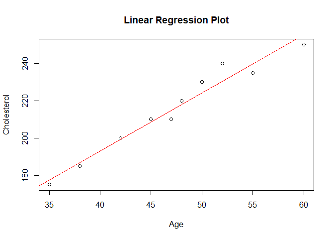

# Linear regression

Linear regression is a statistical technique used to analyze the linear
relationship between a continuous dependent variable and one or more
numerical or categorical independent variables. It is a commonly used
method in data analysis and modeling to predict the value of the
dependent variable based on the values of the independent variables.

In this particular example, you can calculate the cholesterol level of a
person if you know his/her age:

**y = a+bx1**

\*\*Cholesterol = a + b\*age + e\*\*

where `y` is the response variable, `age` is the predictor variable, `a`
is the intercept, and `b` is the slope coefficient.

In a **simple linear regression**, there is only one independent
variable and one dependent variable. The relationship between the two
variables is represented by a straight line, which is fitted to the data
using the least squares method. The slope of the line represents the
change in the dependent variable for a unit change in the independent
variable, while the intercept represents the value of the dependent
variable when the independent variable is zero.

### Simple linear regression in R

    # Create a linear regression model
    model <- lm(cholesterol ~ age, data = mydata)

    # Plot the data and the regression line
    plot(mydata$age, mydata$cholesterol, xlab = "Age", ylab = "Cholesterol", main = "Linear Regression Plot")
    abline(model, col = "red")

**Multiple linear regression** is an extension of simple linear
regression and is used when there are two or more independent variables.
In this case, the relationship between the dependent variable and the
independent variables is represented by a plane or hyperplane.

The main objective of linear regression is to find the line or plane
that best fits the data. This is done by minimizing the sum of the
squared differences between the observed values of the dependent
variable and the values predicted by the model.

Linear regression is widely used in various fields such as economics,
finance, social sciences, engineering, and medical research. It can be
used for prediction, forecasting, and trend analysis. It is also used
for hypothesis testing and to assess the strength of the relationship
between variables.
