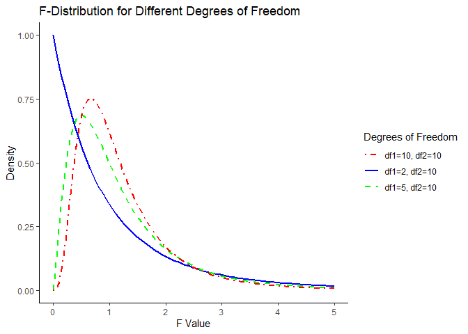
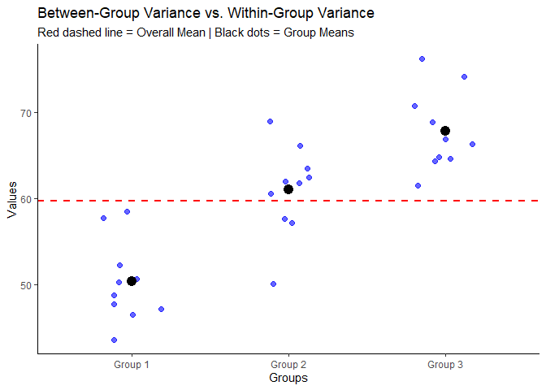

# Analysis of Variance (ANOVA)

**Analysis of Variance (ANOVA)** is a **statistical method used to
compare the means of three or more groups** to determine if at least one
of the group means is significantly different from the others. It
extends the t-test, which is limited to comparing only **two groups**.

The ANOVA test is based on **F-distribution** and is used when:

-   There are three or more independent groups.
-   The dependent variable is continuous (e.g., height, weight, test
    scores).
-   The independent variable is categorical (e.g., different treatments,
    different education levels).

## History of ANOVA

-   **Developed by Ronald A. Fisher** in the 1920s as a method to
    analyze agricultural experiments.
-   Fisher introduced the **F-test**, which is used in ANOVA to test if
    group variances are significantly different.
-   Over time, ANOVA became a key method in medical research,
    psychology, economics, and genetics.

### F-Distribution:

The **F-distribution** is a probability distribution used mainly in
**ANOVA** and **regression analysis**. It helps us compare **variability
between multiple groups** and determine if the differences between them
are statistically significant.

-   Is **positively skewed** (as F-values are always positive).
-   Depends on **two degrees of freedom**:
    -   **df₁** (numerator): Number of groups minus 1.
    -   **df₂** (denominator): Total number of observations minus the
        number of groups.

#### F-Distribution for Different Degrees of Freedom

#### Graph Interpretation

-   The **red line (df1=2, df2=10)** has a higher peak and is more
    skewed.
-   The **blue dashed line (df1=5, df2=10)** is closer to normal.
-   The **green dot-dashed line (df1=10, df2=10)** is even closer to a
    normal shape.
-   As **degrees of freedom increase, the F-distribution becomes more
    symmetric**.

Imagine we are a teacher, and we have three different classes of
students. You want to check:

-   Are the average scores of these classes significantly different?
-   Or are the differences just due to random variation?

To do this, you compare:

1.  **Between-Group Variance (Difference Between Classes)**: How much do
    the class averages differ from each other?
2.  **Within-Group Variance (Difference Within Each Class)**: How much
    do individual students in the same class differ from each other?

The F-statistic is the ratio of these two:

$$
\large F = \frac{(Between \\Group \\Variance)}{(Within \\Group  \\Variance)}
$$

-   If F statistics is large → The groups are likely different.
-   If F statistics is small → The groups are likely similar.

#### Visualize “Between-Group Variance vs. Within-Group Variance”

#### Graph Interpretation

-   **Blue dots**: Individual data points for each group (students’
    scores).
-   **Black dots**: Mean of each group (average class score).
-   **Red dashed line**: Overall mean across all groups.
-   **Between-Group Variance**: The difference between **group means**
    (black dots).
-   **Within-Group Variance**: The spread of blue dots **within each
    group**.

### When to Use ANOVA?

-   **Comparing More than Two Groups**: If you have **two groups**, a
    **t-test** is sufficient. If you have **three or more groups**,
    ANOVA is needed.
-   **Checking for Variability in Data**: ANOVA determines whether
    **between-group variability** is greater than **within-group
    variability**.
-   **Experimental Studies**: Used when testing the effect of different
    treatments, such as different drugs in clinical trials.

#### Difference Between ANOVA and T-Test

<table>
<colgroup>
<col style="width: 33%" />
<col style="width: 33%" />
<col style="width: 33%" />
</colgroup>
<thead>
<tr class="header">
<th style="text-align: left;">Feature</th>
<th style="text-align: left;">T-Test</th>
<th style="text-align: left;">ANOVA</th>
</tr>
</thead>
<tbody>
<tr class="odd">
<td style="text-align: left;">Groups compared</td>
<td style="text-align: left;">Compares two groups only</td>
<td style="text-align: left;">Compares three or more groups</td>
</tr>
<tr class="even">
<td style="text-align: left;">Test used</td>
<td style="text-align: left;">Uses <strong>t-statistic</strong></td>
<td style="text-align: left;">Uses <strong>F-statistics</strong></td>
</tr>
<tr class="odd">
<td style="text-align: left;">Hypothesis</td>
<td style="text-align: left;">Tests if two means are different</td>
<td style="text-align: left;">Tests if <strong>at least one
mean</strong> is different among multiple groups</td>
</tr>
<tr class="even">
<td style="text-align: left;">Distribution used</td>
<td style="text-align: left;"><strong>t-distribution</strong></td>
<td style="text-align: left;"><strong>F-distribution</strong></td>
</tr>
<tr class="odd">
<td style="text-align: left;">Application</td>
<td style="text-align: left;">Used for simple comparison</td>
<td style="text-align: left;">Used for complex models (multiple gropus,
factorial desing)</td>
</tr>
</tbody>
</table>

## Types of ANOVA

### 1. One-Way ANOVA

-   **Compares means across three or more independent groups.**
-   **Example**: Comparing **average exam scores** among students from
    **three different schools**.

### 2. Two-Way ANOVA

-   **Compares means across two categorical independent variables.**
-   **Example**: Studying the effect of **diet (vegetarian
    vs. non-vegetarian)** and **exercise (yes vs. no)** on **weight
    loss**.

### 3. Repeated Measures ANOVA

-   **Compares means of the same subjects under different conditions**.
-   **Example**: Measuring **blood pressure** in **patients before,
    during, and after** taking a new medication.

### 4. MANOVA (Multivariate ANOVA)

-   **Compares means for multiple dependent variables simultaneously.**
-   **Example**: Studying the effect of **teaching methods** on
    **student performance (math score, reading score, and science
    score)**.

#### Reference:

-   Montgomery, D. C. (2017). Design and Analysis of Experiments (9th
    ed.). Wiley.
-   Ott, R. L., & Longnecker, M. (2015). An Introduction to Statistical
    Methods and Data Analysis (7th ed.). Cengage Learning.
-   Winer, B. J., Brown, D. R., & Michels, K. M. (1991). Statistical
    Principles in Experimental Design (3rd ed.). McGraw-Hill.
-   NIST/SEMATECH e-Handbook on ANOVA
    <https://www.itl.nist.gov/div898/handbook/prc/section4/prc4.htm>
-   Penn State Online Course (STAT 502: ANOVA and Experimental Design)
    <https://online.stat.psu.edu/stat502/>
-   SPSS ANOVA Guide (IBM SPSS Documentation)
    <https://www.ibm.com/docs/en/spss-statistics/28.0.0?topic=tests-analysis-variance-anova>

[⬅ Back to Home](../index.md)
