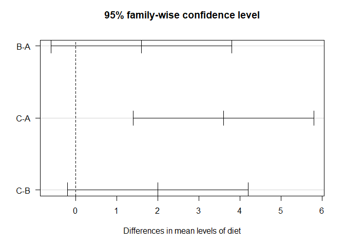
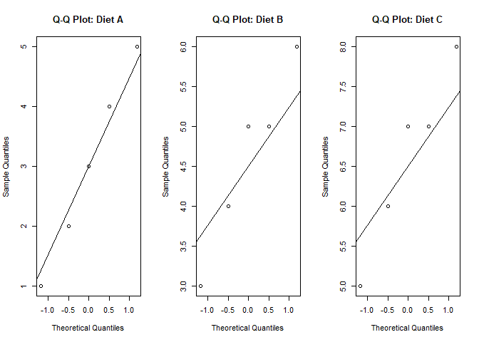

# One-Way ANOVA

**One-Way Analysis of Variance (ANOVA)** is a statistical method used
**to compare the means of three or more independent groups** to
determine if at least one group mean is significantly different from the
others.

-   To **test whether the means of three or more independent groups are
    significantly different**.
-   Helps determine whether **variation among groups is greater than
    variation within groups**.

#### Why Do We Use One-Way ANOVA?

-   **T-test limitation**: A **t-test** can only compare two groups. If
    we compare multiple groups using t-tests, it increases the risk of
    **Type I error** (false positives).
-   **ANOVA handles multiple groups simultaneously** while maintaining
    statistical integrity.

## Assumptions of One-Way ANOVA

### 1. Independence:

-   Observations must be independent within and across groups.

### 2. Normality:

-   The dependent variable should be **normally distributed** in each
    group.

### 3. Homogeneity of Variance (Homoskedasticity):

-   Variances should be **equal** across groups (can be tested using
    Levene’s Test).

## One-Way ANOVA Formula

### Total Variance

ANOVA splits the total variation in data into two components:

#### 1. Between-group variance (explained variance)

#### 2. Within-group variance (unexplained variance)

$$
\large \text{Total Varaince} = Between-Group \\Variance \\+ \\Within-Group  \\Variance
$$

#### Key Formulas

#### 1. Total Sum of Squares (SST)

$$
\Large SST = \underset{i=1}{\sum}^{k} \underset{j=1}{\sum}^{ni} \\(X{ij} \\- \bar{X}{total} )^2
$$

Where:

-   *k* = number of groups
-   ni = number of observations in group
-   Xij = observation in group *i*, *j*
-   *X̄*total = overall mean

#### 2. Between-Group Sum of Squares (SSB)

$$
\Large SSB = \underset{i=1}{\sum}^{k} \\n{i}  \\(\bar X{i} \\- \bar{X}{total} )^2
$$

-   *X̄*i = mean of group *i*

#### 3. Within-Gorup Sum of Squares (SSW)

$$
\Large SSW = \underset{i=1}{\sum}^{k} \underset{j=1}{\sum}^{ni} \\(X{ij} \\- \bar{X}{i} )^2
$$

#### 4. Degrees of Freedom

-   df between groups = *k* − 1
-   df within groups = *N* − *k*
-   df total = *n* − 1
    -   Where n is the total number of observations

#### 5. Mean Square Between

$$
\Large MSB = \frac{SSB}{df {\scriptstyle between}}
$$

#### 5. Mean Square Between

$$
\Large MSB = \frac{SSB}{df {\scriptstyle between}}
$$

#### 6. Mean Square Within

$$
\Large MSW = \frac{SSW}{df {\scriptstyle within}}
$$

#### 7. F-statistics

$$
\Large F = \frac{MSB}{MSW}
$$

-   If *F* **is significantly large**, we reject the null hypothesis
    *H*0 and conclude that **at least one group mean is different**.

#### 8. Post-Hoc Analysis

After finding a significant **F-statistic** in One-Way ANOVA, we need to
determine **which specific groups differ** from each other. This is done
using **post-hoc tests** (multiple comparison tests). \* ANOVA tells us
only that at least one group is different, but it does not tell us which
groups are different. \* Multiple Comparisons Problem: If we perform
multiple t-tests between each pair, the risk of Type I error increases.
\* Post-hoc tests adjust for multiple comparisons to maintain
statistical integrity.

#### Common Post-Hoc tests

<table>
<colgroup>
<col style="width: 33%" />
<col style="width: 33%" />
<col style="width: 33%" />
</colgroup>
<thead>
<tr class="header">
<th style="text-align: left;">Test</th>
<th style="text-align: left;">Purpose</th>
<th style="text-align: left;">Assumption</th>
</tr>
</thead>
<tbody>
<tr class="odd">
<td style="text-align: left;"><strong>Tukey’s HSD (Honest Significant
Difference)</strong></td>
<td style="text-align: left;">Compares all pairs, controls type 1
error</td>
<td style="text-align: left;">Assumes equal variance</td>
</tr>
<tr class="even">
<td style="text-align: left;"><strong>Bonferroni
correction</strong></td>
<td style="text-align: left;">Adjusts significance level to reduce type
1 error</td>
<td style="text-align: left;">Conservative method</td>
</tr>
<tr class="odd">
<td style="text-align: left;"><strong>Scheffe’s test</strong></td>
<td style="text-align: left;">Suitable for unequal sample sizes</td>
<td style="text-align: left;">Robust</td>
</tr>
<tr class="even">
<td style="text-align: left;"><strong>Dunnett’s test</strong></td>
<td style="text-align: left;">Compares each group to a control
group</td>
<td style="text-align: left;">Controls type 1 error</td>
</tr>
<tr class="odd">
<td style="text-align: left;">Games-Howell Test</td>
<td style="text-align: left;">Used when variances are unequal</td>
<td style="text-align: left;">Does not assume equal variance</td>
</tr>
</tbody>
</table>

#### 9. Example

A researcher wants to test whether three different diets (A, B, C)
result in different weight loss. The weight loss (in kg) after 6 weeks
is recorded for each diet:

<table>
<thead>
<tr class="header">
<th style="text-align: left;">Diet</th>
<th style="text-align: left;">Weight loss</th>
</tr>
</thead>
<tbody>
<tr class="odd">
<td style="text-align: left;">A</td>
<td style="text-align: left;">2</td>
</tr>
<tr class="even">
<td style="text-align: left;">A</td>
<td style="text-align: left;">3</td>
</tr>
<tr class="odd">
<td style="text-align: left;">A</td>
<td style="text-align: left;">5</td>
</tr>
<tr class="even">
<td style="text-align: left;">A</td>
<td style="text-align: left;">1</td>
</tr>
<tr class="odd">
<td style="text-align: left;">A</td>
<td style="text-align: left;">4</td>
</tr>
<tr class="even">
<td style="text-align: left;">B</td>
<td style="text-align: left;">3</td>
</tr>
<tr class="odd">
<td style="text-align: left;">B</td>
<td style="text-align: left;">5</td>
</tr>
<tr class="even">
<td style="text-align: left;">B</td>
<td style="text-align: left;">4</td>
</tr>
<tr class="odd">
<td style="text-align: left;">B</td>
<td style="text-align: left;">6</td>
</tr>
<tr class="even">
<td style="text-align: left;">B</td>
<td style="text-align: left;">5</td>
</tr>
<tr class="odd">
<td style="text-align: left;">C</td>
<td style="text-align: left;">6</td>
</tr>
<tr class="even">
<td style="text-align: left;">C</td>
<td style="text-align: left;">7</td>
</tr>
<tr class="odd">
<td style="text-align: left;">C</td>
<td style="text-align: left;">8</td>
</tr>
<tr class="even">
<td style="text-align: left;">C</td>
<td style="text-align: left;">5</td>
</tr>
<tr class="odd">
<td style="text-align: left;">C</td>
<td style="text-align: left;">7</td>
</tr>
</tbody>
</table>

## Step 1: Calculate Group means

$$
\large \bar{X{\scriptstyle A}} = \frac{2+3+5+1+4} {5} = 3
$$

$$
\large \bar{X{\scriptstyle B}} = \frac{3+5+4+6+5} {5} = 4.6
$$

$$
\large \bar{X{\scriptstyle C}} = \frac{6+7+8+5+7} {5} = 6.6
$$

## Step 2: Calculate Overall Mean

$$
\large \bar{X{\scriptstyle Total}} = \frac{(2+3+5+1+4)+(3+5+4+6+5)+(6+7+8+5+7)} {15} = 4.73
$$

## Step 3: Compute SST, SSB, SSW

### Compute SSB

$$
SSB = \underset{i=1}{\sum}^{k} \\n{i}  \\(\bar X{\scriptstyle i} \\- \bar{X}{\scriptstyle total} )^2
$$

Substituting values:

#### For group A:

$$
\large 5(3 - 4.73)^2 = 14.96
$$

#### For group B:

$$
\large 5(4.6 - 4.73)^2 = 0.09
$$

#### For group C:

$$
\large 5(6.6 - 4.73)^2 = 17.49
$$

#### TOTAL SSB:

$$
\large SSB = 14.96 + 0.09 + 17.49 = 32.54
$$

### Compute SSW

$$
SSW = \underset{i=1}{\sum}^{k} \underset{j=1}{\sum}^{ni} \\(X{ij} \\- \bar{X}{i} )^2
$$

Substituting values:

#### For Group A

$$
\large (2−3)^2 + (3−3)^2 + (5−3)^2 + (1−3)^2 + (4−3)^2 = 10
$$

#### For Group B

$$
\large (3−4.6)^2 + (5−4.6)^2 + (4−4.6)^2 + (6−4.6)^2 + (5−4.6)^2 = 5.20
$$

#### For Group C

$$
\large (6−6.6)^2 + (7−6.6)^2 + (8−6.6)^2 + (5−6.6)^2 + (7−6.6)^2 = 5.20
$$

#### TOTAL SSW

$$
\large SSW = 10+5.2+5.2=20.4
$$

### Compute SST

$$
SST = \underset{i=1}{\sum}^{k} \underset{j=1}{\sum}^{ni} \\(X{ij} \\- \bar{X}{total} )^2
$$

Substituting values:

#### For Group A:

$$
\large (2 − 4.73)^2 + (3 − 4.73)^2 + (5 − 4.73)^2 + (1 − 4.73)^2 + (4 − 4.73)^2 = 24.95
$$

#### For Group B:

$$
\large (3 − 4.73)^2 + (5 − 4.73)^2 + (4 − 4.73)^2 + (6 − 4.73)^2 + (5 − 4.73)^2 = 5.27
$$

#### For Group C:

$$
\large (6 − 4.73)^2 + (7 − 4.73)^2 + (8 − 4.73)^2 + (5 − 4.73)^2 + (7 − 4.73)^2 = 22.67
$$

#### TOTAL SST

$$
\large SST = 24.95+5.27+22.67 = 52.89
$$

## Step 4: Compute Degrees of Freedom

$$
\large df{\scriptstyle between} = k - 1 = 3 - 1 = 2
$$

$$
\large df{\scriptstyle within} = N - k = 15 - 3 = 12
$$

## Step 5: Compute MSB and MSW

$$
\large MSB = \frac{SSB}{df {\scriptstyle between}} = \frac{32.54}{2} = 16.27
$$

$$
\large MSW = \frac{SSW}{df {\scriptstyle within}} = \frac{20.4}{12} = 1.70 
$$

## Step 6: Compute F statistics

$$
\large F = \frac{16.27}{1.70} = 9.57
$$

#### Performing One-Way ANOVA in R

    ##             Df Sum Sq Mean Sq F value  Pr(>F)   
    ## diet         2  32.53   16.27   9.569 0.00328 **
    ## Residuals   12  20.40    1.70                   
    ## ---
    ## Signif. codes:  0 '***' 0.001 '**' 0.01 '*' 0.05 '.' 0.1 ' ' 1

## Step 6: Critical F value comparion

For a significance level *α* = 0.05 with *d**f*1 = 1 with *d**f*1 = 12,
the critical value from an F-distribution table is approximately
**3.89**.

Since the computed F-statistic **(≈ 9.57)** is much greater than the
critical value (3.89), we **reject the null hypothesis**. This indicates
that at least one group mean is significantly different from the others.

## Step 7: Tukey’s HSD Post-Hoc Test Results

The test compares all possible pairs of diet groups to identify which
ones have significant differences in weight loss.

#### Tukey’s HSD Test in R

    ##   Tukey multiple comparisons of means
    ##     95% family-wise confidence level
    ## 
    ## Fit: aov(formula = weight_loss ~ diet, data = data)
    ## 
    ## $diet
    ##     diff        lwr      upr     p adj
    ## B-A  1.6 -0.5999767 3.799977 0.1699323
    ## C-A  3.6  1.4000233 5.799977 0.0024446
    ## C-B  2.0 -0.1999767 4.199977 0.0762244

#### Interpretation

-   If p-value &lt; 0.05, the difference is statistically significant.
-   The confidence interval (CI) should not contain zero for
    significance.
-   Groups with significant differences mean their diets result in
    different weight loss effects.

<table>
<thead>
<tr class="header">
<th style="text-align: left;">Group1</th>
<th style="text-align: left;">Group2</th>
<th style="text-align: left;">meandiff</th>
<th style="text-align: left;">padj</th>
</tr>
</thead>
<tbody>
<tr class="odd">
<td style="text-align: left;">A</td>
<td style="text-align: left;">B</td>
<td style="text-align: left;">1.6</td>
<td style="text-align: left;">0.1699</td>
</tr>
<tr class="even">
<td style="text-align: left;">A</td>
<td style="text-align: left;">C</td>
<td style="text-align: left;">3.6</td>
<td style="text-align: left;">0.0024</td>
</tr>
<tr class="odd">
<td style="text-align: left;">B</td>
<td style="text-align: left;">C</td>
<td style="text-align: left;">2.0</td>
<td style="text-align: left;">0.0762</td>
</tr>
</tbody>
</table>

#### Key Insights from Tukey’s HSD Test:

#### A vs B:

-   Mean Difference = 1.6, p = 0.1699
-   Since **p &gt; 0.05, no significant difference** between Diet A and
    Diet B.

#### A vs C:

-   Mean Difference = 3.6, p = 0.0024
-   Since **p &lt; 0.05, significant difference between Diet A and Diet
    C**.
-   Diet C leads to significantly higher weight loss than Diet A.

#### B vs C:

-   Mean Difference = 2.0, p = 0.0762
-   Since **p &gt; 0.05, no significant difference** between Diet B and
    Diet C.

#### Conclusion

-   **Diet C is significantly different from Diet A** in terms of weight
    loss.
-   Diets A and B are **not significantly** different.
-   Diets B and C are not significantly different, but there is a slight
    trend toward significance.

This means Diet C leads to significantly higher weight loss compared to
Diet A, but there is no clear evidence that Diet B and C differ
significantly.

#### Checking ANOVA Assumptions in R

To validate the assumptions of One-Way ANOVA, we need to check:

#### 1. Normality (Shapiro-Wilk Test & Q-Q Plot)

    ## Loading required package: carData

    ## 
    ##  Shapiro-Wilk normality test
    ## 
    ## data:  subset(data, diet == "A")$weight_loss
    ## W = 0.98676, p-value = 0.9672

    ## 
    ##  Shapiro-Wilk normality test
    ## 
    ## data:  subset(data, diet == "B")$weight_loss
    ## W = 0.96086, p-value = 0.814

    ## 
    ##  Shapiro-Wilk normality test
    ## 
    ## data:  subset(data, diet == "C")$weight_loss
    ## W = 0.96086, p-value = 0.814

#### Q-Q Plot for Visual Check

#### 2. Homogeneity of Variance (Levene’s Test)

    ## Levene's Test for Homogeneity of Variance (center = median)
    ##       Df F value Pr(>F)
    ## group  2   0.381 0.6912
    ##       12

#### 3. Independence (Study Design - No direct test)

-   Ensure independence through study design (random sampling, no
    repeated measures, different subjects in each group).

#### References

-   Montgomery, D.C. (2017). Design and Analysis of Experiments. Wiley.
-   Fisher, R.A. (1925). Statistical Methods for Research Workers.
    Oliver & Boyd.
-   Online: Penn State ANOVA Course
    (<https://online.stat.psu.edu/stat502/>)

[⬅ Back to Home](../ANOVA.md)
