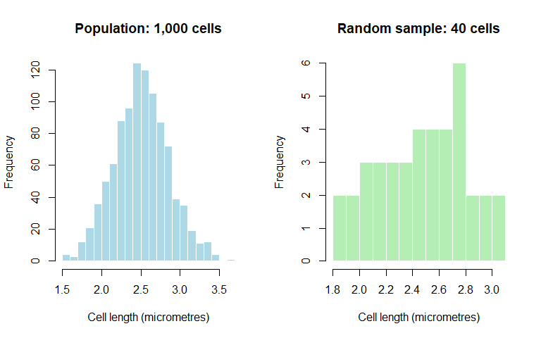
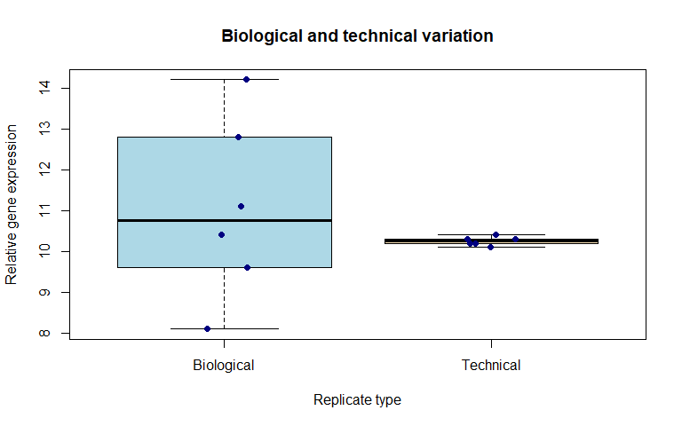
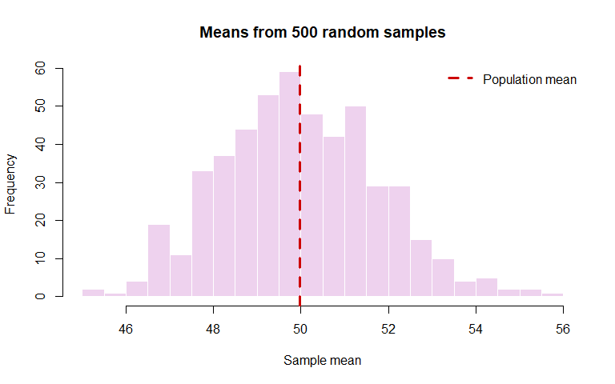
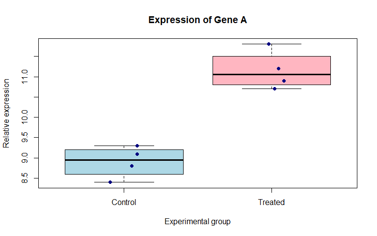

Chapter 1: What Is Biostatistics?
================
Sandeep Singh

- [1. Introduction](#1-introduction)
- [2. Learning Objectives](#2-learning-objectives)
- [3. Why Do We Need Biostatistics?](#3-why-do-we-need-biostatistics)
  - [3.1 From observation to evidence](#31-from-observation-to-evidence)
- [4. A First Biological Dataset](#4-a-first-biological-dataset)
- [5. Population and Sample](#5-population-and-sample)
  - [5.1 Population](#51-population)
  - [5.2 Sample](#52-sample)
  - [5.3 Why sample selection matters](#53-why-sample-selection-matters)
  - [5.4 Visualizing a population and a sample in
    R](#54-visualizing-a-population-and-a-sample-in-r)
- [6. Observation, Variable and
  Value](#6-observation-variable-and-value)
  - [6.1 Observation](#61-observation)
  - [6.2 Variable](#62-variable)
  - [6.3 Value](#63-value)
  - [6.4 A simple way to remember](#64-a-simple-way-to-remember)
- [7. Parameters and Statistics](#7-parameters-and-statistics)
  - [7.1 Parameter](#71-parameter)
  - [7.2 Statistic](#72-statistic)
  - [7.3 Example: mean DNA-fragment
    length](#73-example-mean-dna-fragment-length)
- [8. Descriptive and Inferential
  Statistics](#8-descriptive-and-inferential-statistics)
  - [8.1 Descriptive statistics](#81-descriptive-statistics)
  - [8.2 Inferential statistics](#82-inferential-statistics)
  - [8.3 Description and inference work
    together](#83-description-and-inference-work-together)
- [9. Biological Variation and Technical
  Variation](#9-biological-variation-and-technical-variation)
  - [9.1 Biological variation](#91-biological-variation)
  - [9.2 Technical variation](#92-technical-variation)
  - [9.3 Biological and technical
    replicates](#93-biological-and-technical-replicates)
  - [9.4 Comparing variation in R](#94-comparing-variation-in-r)
- [10. Types of Questions in
  Biostatistics](#10-types-of-questions-in-biostatistics)
  - [10.1 Description](#101-description)
  - [10.2 Comparison](#102-comparison)
  - [10.3 Association](#103-association)
  - [10.4 Prediction](#104-prediction)
  - [10.5 Time-to-event analysis](#105-time-to-event-analysis)
  - [10.6 Genetic association](#106-genetic-association)
- [11. Turning a Biological Question into a Statistical
  Question](#11-turning-a-biological-question-into-a-statistical-question)
  - [11.1 The PICO framework](#111-the-pico-framework)
- [12. Outcome, Predictor and
  Covariate](#12-outcome-predictor-and-covariate)
  - [12.1 Outcome variable](#121-outcome-variable)
  - [12.2 Predictor variable](#122-predictor-variable)
  - [12.3 Covariate](#123-covariate)
- [13. Variation, Chance and
  Uncertainty](#13-variation-chance-and-uncertainty)
  - [13.1 A simulation of sampling
    variation](#131-a-simulation-of-sampling-variation)
- [14. Statistical Significance Is Not the Whole
  Story](#14-statistical-significance-is-not-the-whole-story)
- [15. Association Is Not Necessarily
  Causation](#15-association-is-not-necessarily-causation)
- [16. A Beginner-Friendly Bioinformatics
  Example](#16-a-beginner-friendly-bioinformatics-example)
  - [16.1 Summarize each group](#161-summarize-each-group)
  - [16.2 Visualize the observations](#162-visualize-the-observations)
- [17. The Biostatistical Workflow](#17-the-biostatistical-workflow)
  - [Step 1: Define the research
    question](#step-1-define-the-research-question)
  - [Step 2: Choose an appropriate study
    design](#step-2-choose-an-appropriate-study-design)
  - [Step 3: Plan the data collection](#step-3-plan-the-data-collection)
  - [Step 4: Inspect and clean the
    data](#step-4-inspect-and-clean-the-data)
  - [Step 5: Explore and describe the
    data](#step-5-explore-and-describe-the-data)
  - [Step 6: Select an appropriate statistical
    method](#step-6-select-an-appropriate-statistical-method)
  - [Step 7: Check assumptions and model
    fit](#step-7-check-assumptions-and-model-fit)
  - [Step 8: Quantify the effect and
    uncertainty](#step-8-quantify-the-effect-and-uncertainty)
  - [Step 9: Interpret the result
    biologically](#step-9-interpret-the-result-biologically)
  - [Step 10: Report the analysis
    reproducibly](#step-10-report-the-analysis-reproducibly)
- [18. What R Contributes to
  Biostatistics](#18-what-r-contributes-to-biostatistics)
- [19. Common Beginner Mistakes](#19-common-beginner-mistakes)
  - [Mistake 1: Treating the sample as the
    population](#mistake-1-treating-the-sample-as-the-population)
  - [Mistake 2: Believing a larger sample removes every
    problem](#mistake-2-believing-a-larger-sample-removes-every-problem)
  - [Mistake 3: Starting with a statistical
    test](#mistake-3-starting-with-a-statistical-test)
  - [Mistake 4: Reporting only a
    p-value](#mistake-4-reporting-only-a-p-value)
  - [Mistake 5: Confusing technical replicates with biological
    replicates](#mistake-5-confusing-technical-replicates-with-biological-replicates)
  - [Mistake 6: Assuming association proves
    causation](#mistake-6-assuming-association-proves-causation)
  - [Mistake 7: Trusting software output without checking the
    data](#mistake-7-trusting-software-output-without-checking-the-data)
- [20. Chapter Summary](#20-chapter-summary)
- [21. Check Your Understanding](#21-check-your-understanding)
  - [Question 1](#question-1)
  - [Question 2](#question-2)
  - [Question 3](#question-3)
  - [Question 4](#question-4)
  - [Question 5](#question-5)
- [22. Practice with R](#22-practice-with-r)
  - [Exercise 1: Describe a biological
    sample](#exercise-1-describe-a-biological-sample)
  - [Exercise 2: Summarize binary
    outcomes](#exercise-2-summarize-binary-outcomes)
  - [Exercise 3: Work with groups](#exercise-3-work-with-groups)
  - [Exercise 4: Identify dataset
    components](#exercise-4-identify-dataset-components)
- [23. Mini-Project: From a Biological Question to a Data
  Plan](#23-mini-project-from-a-biological-question-to-a-data-plan)
- [24. Glossary](#24-glossary)
- [25. References and Further
  Reading](#25-references-and-further-reading)
- [26. Reproducibility Information](#26-reproducibility-information)

# 1. Introduction

Biology is full of variation.

Two plants of the same species may have different heights. Two patients
receiving the same treatment may respond differently. The number of
sequencing reads assigned to a gene may vary between samples. Even
repeated measurements of the same biological sample may not be exactly
identical.

**Biostatistics** gives us a systematic way to understand this variation
and use biological data to answer questions.

In simple words:

> **Biostatistics is the application of statistical reasoning and
> methods to questions in biology, medicine, public health, genetics and
> related sciences.**

Biostatistics is not only a collection of formulas. It is a way of
thinking about evidence.

It helps us decide:

- what data should be collected;
- how the data should be summarized;
- whether an observed pattern may be real or may have occurred by
  chance;
- how certain or uncertain our conclusion is; and
- whether the conclusion is supported by the study design and data.

------------------------------------------------------------------------

# 2. Learning Objectives

After completing this chapter, you should be able to:

1.  explain biostatistics in plain language;
2.  distinguish a **population** from a **sample**;
3.  identify observations, variables and values in a dataset;
4.  distinguish a **parameter** from a **statistic**;
5.  explain descriptive and inferential statistics;
6.  distinguish biological variation from technical variation;
7.  convert a biological question into a statistical question;
8.  recognize the role of uncertainty in scientific conclusions;
9.  perform a few simple summaries and plots in R; and
10. describe the main stages of a biostatistical investigation.

------------------------------------------------------------------------

# 3. Why Do We Need Biostatistics?

Suppose a researcher gives a new nutrient treatment to 10 plants. Eight
plants grow taller after treatment.

Can the researcher immediately conclude that the treatment works?

Not necessarily. Several questions must be considered:

- How much taller did the plants grow?
- What normally happens to similar plants without the treatment?
- Were the treated and untreated plants grown under similar conditions?
- Was the sample large enough?
- Could the difference have occurred because of natural variation?
- Were height measurements taken accurately?
- Were any plants excluded from the analysis?

Biostatistics helps organize these questions and evaluate the evidence.

## 3.1 From observation to evidence

A visible difference is not automatically convincing evidence.

For example, imagine that the mean expression of a gene is 12 units in a
control group and 15 units in a treated group. The difference is 3
units. However, that difference cannot be interpreted properly without
knowing:

- the number of samples;
- the variability among samples;
- the quality of the measurements;
- the study design; and
- the statistical uncertainty around the estimated difference.

Therefore, a useful statistical analysis considers both:

1.  **the size of the observed effect**, and
2.  **the uncertainty surrounding that effect**.

------------------------------------------------------------------------

# 4. A First Biological Dataset

Consider a small seed-germination experiment. Twenty seeds are divided
into two groups:

- 10 seeds receive standard water;
- 10 seeds receive a nutrient solution.

The researcher records whether each seed germinates.

``` r
seed_data <- data.frame(
  seed_id = paste0("S", 1:20),
  treatment = rep(c("Water", "Nutrient"), each = 10),
  germinated = c(
    "Yes", "Yes", "No", "Yes", "No",
    "Yes", "No", "Yes", "No", "Yes",
    "Yes", "Yes", "Yes", "No", "Yes",
    "Yes", "Yes", "Yes", "No", "Yes"
  )
)

print(seed_data)
```

    ##    seed_id treatment germinated
    ## 1       S1     Water        Yes
    ## 2       S2     Water        Yes
    ## 3       S3     Water         No
    ## 4       S4     Water        Yes
    ## 5       S5     Water         No
    ## 6       S6     Water        Yes
    ## 7       S7     Water         No
    ## 8       S8     Water        Yes
    ## 9       S9     Water         No
    ## 10     S10     Water        Yes
    ## 11     S11  Nutrient        Yes
    ## 12     S12  Nutrient        Yes
    ## 13     S13  Nutrient        Yes
    ## 14     S14  Nutrient         No
    ## 15     S15  Nutrient        Yes
    ## 16     S16  Nutrient        Yes
    ## 17     S17  Nutrient        Yes
    ## 18     S18  Nutrient        Yes
    ## 19     S19  Nutrient         No
    ## 20     S20  Nutrient        Yes

Each row represents one seed. Each column records a characteristic of
the seed.

We can count germinated and non-germinated seeds in each group.

``` r
germination_table <- table(
  seed_data$treatment,
  seed_data$germinated
)

germination_table
```

    ##           
    ##            No Yes
    ##   Nutrient  2   8
    ##   Water     4   6

We can also calculate the proportion of seeds that germinated.

``` r
germination_proportion <- aggregate(
  germinated ~ treatment,
  data = transform(
    seed_data,
    germinated = germinated == "Yes"
  ),
  FUN = mean
)

germination_proportion$percentage <-
  100 * germination_proportion$germinated

germination_proportion
```

<div class="kable-table">

| treatment | germinated | percentage |
|:----------|-----------:|-----------:|
| Nutrient  |        0.8 |         80 |
| Water     |        0.6 |         60 |

</div>

The nutrient group has a higher observed germination percentage. At this
stage, this is a **description of the sample**. It is not yet proof that
the nutrient solution causes better germination in the wider population
of seeds.

This distinction is one of the most important ideas in biostatistics.

------------------------------------------------------------------------

# 5. Population and Sample

## 5.1 Population

A **population** is the complete group about which we want to draw a
conclusion.

Examples include:

- all patients with type 2 diabetes in a region;
- all laboratory mice of a particular strain;
- all cells belonging to a defined cell type;
- all sequencing reads produced in an experiment;
- all people carrying a particular genetic variant; or
- all plants of a species grown under specified conditions.

The population must be defined carefully. “All patients” is usually too
vague. A better definition might be:

> All adults with type 2 diabetes attending government hospitals in
> Delhi during 2026.

## 5.2 Sample

A **sample** is the smaller group that is actually observed or measured.

Researchers generally study a sample because observing an entire
population may be too expensive, too slow, unethical or impossible.

| Research context | Population of interest | Possible sample |
|----|----|----|
| Plant biology | All plants of a variety grown under drought conditions | 80 plants grown in an experiment |
| Clinical research | All eligible patients with a disease | 250 patients recruited from three hospitals |
| Genomics | All individuals in a target ancestry group | 5,000 genotyped participants |
| RNA sequencing | All biological specimens satisfying the study criteria | 24 tissue samples selected for sequencing |

## 5.3 Why sample selection matters

A large sample is not automatically a good sample. If the sample differs
systematically from the target population, the study may produce a
biased conclusion.

For example, a study intended to represent all adults may not be
representative if it includes only young university students. Increasing
the number of students does not remove this selection problem.

> **Sample size affects precision, but sampling quality affects
> validity.**

## 5.4 Visualizing a population and a sample in R

The following example creates a hypothetical population of 1,000
bacterial cell lengths and selects a random sample of 40 cells.

``` r
population_lengths <- rnorm(
  n = 1000,
  mean = 2.5,
  sd = 0.35
)

sample_lengths <- sample(
  population_lengths,
  size = 40,
  replace = FALSE
)

par(mfrow = c(1, 2))

hist(
  population_lengths,
  breaks = 25,
  col = "lightblue",
  border = "white",
  main = "Population: 1,000 cells",
  xlab = "Cell length (micrometres)"
)

hist(
  sample_lengths,
  breaks = 10,
  col = "darkseagreen2",
  border = "white",
  main = "Random sample: 40 cells",
  xlab = "Cell length (micrometres)"
)
```

<div class="figure" style="text-align: center">


<p class="caption">

A hypothetical population of bacterial cell lengths and a random sample
drawn from it.
</p>

</div>

``` r
par(mfrow = c(1, 1))
```

The sample resembles the population, but it is not identical to it. A
different random sample would produce slightly different values. This is
called **sampling variation**.

------------------------------------------------------------------------

# 6. Observation, Variable and Value

These three terms describe the structure of a dataset.

## 6.1 Observation

An **observation** is the unit being studied. It is usually represented
by one row of a dataset.

Depending on the study, an observation may be:

- one patient;
- one plant;
- one mouse;
- one tissue sample;
- one gene;
- one genetic variant; or
- one measurement occasion.

## 6.2 Variable

A **variable** is a characteristic recorded for each observation. It is
usually represented by one column.

Examples include:

- age;
- treatment group;
- blood pressure;
- disease status;
- genotype;
- gene-expression count; or
- sequencing-quality score.

## 6.3 Value

A **value** is the particular entry recorded for one variable in one
observation.

In the seed dataset:

- `S3` is a value of the variable `seed_id`;
- `Water` is a value of the variable `treatment`; and
- `No` is a value of the variable `germinated`.

## 6.4 A simple way to remember

| Dataset component | Meaning                         | Usually represented by |
|-------------------|---------------------------------|------------------------|
| Observation       | The unit being studied          | One row                |
| Variable          | A characteristic being recorded | One column             |
| Value             | The recorded entry              | One cell               |

------------------------------------------------------------------------

# 7. Parameters and Statistics

The words **parameter** and **statistic** are related, but they do not
mean the same thing.

## 7.1 Parameter

A **parameter** is a numerical characteristic of a population.

Examples include:

- the true mean haemoglobin level of all eligible patients;
- the true proportion of resistant bacteria in a hospital;
- the true minor allele frequency of a variant in a population; or
- the true mean expression of a gene under a specified condition.

Population parameters are usually unknown because the entire population
is rarely measured.

## 7.2 Statistic

A **statistic** is a numerical value calculated from a sample.

Examples include:

- the sample mean;
- the sample standard deviation;
- the sample proportion;
- a sample odds ratio; or
- a regression coefficient estimated from sample data.

We use a sample statistic to estimate an unknown population parameter.

| Quantity | Population | Sample |
|----|----|----|
| Mean | Parameter, often written as $\mu$ | Statistic, often written as $\bar{x}$ |
| Standard deviation | Parameter, often written as $\sigma$ | Statistic, often written as $s$ |
| Proportion | Parameter, often written as $p$ | Statistic, often written as $\hat{p}$ |

## 7.3 Example: mean DNA-fragment length

Suppose five DNA fragments have lengths of 180, 195, 205, 210 and 220
base pairs.

``` r
fragment_length <- c(180, 195, 205, 210, 220)

mean(fragment_length)
```

    ## [1] 202

``` r
sd(fragment_length)
```

    ## [1] 15.24795

These values describe the observed sample. They are not automatically
the true population mean and population standard deviation.

------------------------------------------------------------------------

# 8. Descriptive and Inferential Statistics

## 8.1 Descriptive statistics

**Descriptive statistics** summarize the data that were observed.

Common descriptive methods include:

- counts and percentages;
- mean, median and mode;
- range, variance and standard deviation;
- tables; and
- graphs.

For the seed experiment, reporting that 80% of nutrient-treated seeds
and 60% of water-treated seeds germinated is descriptive.

## 8.2 Inferential statistics

**Inferential statistics** use sample data to learn about a larger
population or process.

Inferential methods help us:

- estimate unknown population quantities;
- quantify uncertainty using confidence intervals;
- test hypotheses;
- compare groups;
- study associations; and
- build statistical models.

For the seed experiment, asking whether the nutrient solution improves
germination beyond what might occur through random variation is an
inferential question.

## 8.3 Description and inference work together

Inference should not begin before the data have been described and
checked. A statistical test cannot rescue incorrect data, poor
measurements or a badly designed study.

------------------------------------------------------------------------

# 9. Biological Variation and Technical Variation

Variation is expected in biological research, but not all variation has
the same origin.

## 9.1 Biological variation

**Biological variation** represents real differences among biological
units.

Examples include differences among:

- patients;
- animals;
- plants;
- tissue samples;
- cell populations; or
- independently grown cultures.

Such variation can arise from genetics, age, sex, environment, disease
severity and many other biological factors.

## 9.2 Technical variation

**Technical variation** is introduced by measurement or laboratory
procedures.

Examples include variation caused by:

- pipetting;
- instruments;
- reagent lots;
- sequencing runs;
- library preparation;
- image-analysis settings; or
- data-processing pipelines.

## 9.3 Biological and technical replicates

A **biological replicate** is an independently sampled biological unit.
A **technical replicate** is a repeated measurement of the same
biological material.

| Replicate type | Example | What it mainly measures |
|----|----|----|
| Biological replicate | RNA from five different patients | Biological variability among patients |
| Technical replicate | The same RNA sample measured three times | Measurement or laboratory variability |

Ten technical measurements of one patient do not provide information
equivalent to measurements from ten independent patients.

## 9.4 Comparing variation in R

``` r
biological_expression <- c(8.1, 10.4, 12.8, 9.6, 14.2, 11.1)
technical_expression <- c(10.2, 10.3, 10.1, 10.4, 10.2, 10.3)

expression_data <- data.frame(
  expression = c(
    biological_expression,
    technical_expression
  ),
  replicate_type = rep(
    c("Biological", "Technical"),
    each = 6
  )
)

boxplot(
  expression ~ replicate_type,
  data = expression_data,
  col = c("lightblue", "wheat"),
  ylab = "Relative gene expression",
  xlab = "Replicate type",
  main = "Biological and technical variation"
)

stripchart(
  expression ~ replicate_type,
  data = expression_data,
  vertical = TRUE,
  method = "jitter",
  pch = 19,
  col = "navy",
  add = TRUE
)
```

<div class="figure" style="text-align: center">


<p class="caption">

Technical replicates usually vary less than independent biological
samples.
</p>

</div>

The example is deliberately simplified. In real experiments, biological
and technical variability may occur together and may require a more
advanced statistical model.

------------------------------------------------------------------------

# 10. Types of Questions in Biostatistics

Before selecting a statistical method, we must know what question is
being asked.

## 10.1 Description

**Question:** What is happening in the observed data?

Example: What is the median age of patients in the study?

## 10.2 Comparison

**Question:** Do two or more groups differ?

Example: Is mean gene expression different between treated and untreated
cells?

## 10.3 Association

**Question:** Are two variables related?

Example: Is body mass associated with fasting glucose concentration?

## 10.4 Prediction

**Question:** Can one or more variables predict an outcome?

Example: Can clinical measurements predict whether a patient will
respond to treatment?

## 10.5 Time-to-event analysis

**Question:** How long does it take for an event to occur?

Example: How long do patients remain free of disease recurrence?

## 10.6 Genetic association

**Question:** Is a genetic variant associated with a phenotype?

Example: Is the number of effect alleles at a variant associated with
disease risk?

These questions require different data structures and different
statistical methods. Choosing a method only because it is familiar is
not good statistical practice.

------------------------------------------------------------------------

# 11. Turning a Biological Question into a Statistical Question

Consider the broad question:

> Does fertilizer improve plant growth?

This question is not yet sufficiently precise. We must define:

- the plant species;
- the fertilizer and dose;
- the comparison group;
- the definition of growth;
- the duration of follow-up;
- the experimental unit; and
- the target population.

A clearer biological question is:

> Among six-week-old tomato plants grown under the same greenhouse
> conditions, does four weeks of fertilizer treatment increase final
> plant height compared with water alone?

This can be translated into a statistical question:

> What is the difference in mean final height between fertilizer-treated
> and water-treated tomato plants, and how uncertain is that estimated
> difference?

## 11.1 The PICO framework

For clinical and experimental questions, the PICO framework is often
useful:

| Component | Meaning                  | Plant example                       |
|-----------|--------------------------|-------------------------------------|
| P         | Population               | Six-week-old tomato plants          |
| I         | Intervention or exposure | Fertilizer treatment                |
| C         | Comparison               | Water alone                         |
| O         | Outcome                  | Final plant height after four weeks |

For observational studies, the “I” may represent an exposure rather than
an intervention.

------------------------------------------------------------------------

# 12. Outcome, Predictor and Covariate

## 12.1 Outcome variable

The **outcome** is the main variable we want to explain, compare or
predict.

Examples:

- final plant height;
- disease status;
- blood pressure;
- bacterial colony count;
- gene-expression level; or
- survival time.

The outcome is also called the **response** or **dependent variable**.

## 12.2 Predictor variable

A **predictor** is a variable used to explain or predict the outcome.

Examples:

- treatment group;
- age;
- drug dose;
- environmental exposure; or
- allele dosage.

Predictors may also be called **explanatory variables**, **independent
variables** or **features**, depending on the field.

## 12.3 Covariate

A **covariate** is a variable included in an analysis because it may
explain some outcome variation or influence the estimated association.

Age, sex, experimental batch and genetic principal components are common
examples, but whether a variable should be adjusted for depends on the
scientific question and study design.

------------------------------------------------------------------------

# 13. Variation, Chance and Uncertainty

Suppose two independent studies estimate the effect of the same
treatment. One study reports an improvement of 3.2 units, while another
reports an improvement of 2.6 units.

The studies do not necessarily contradict one another. Their results may
differ because they used different random samples.

Biostatistics does not eliminate uncertainty. It measures and
communicates uncertainty.

Important tools for this purpose include:

- standard errors;
- confidence intervals;
- probability models;
- hypothesis tests; and
- sensitivity analyses.

These tools will be developed gradually in later chapters.

## 13.1 A simulation of sampling variation

The following simulation repeatedly selects 30 observations from the
same population. Each sample produces a slightly different mean.

``` r
population <- rnorm(
  n = 100000,
  mean = 50,
  sd = 10
)

sample_means <- replicate(
  n = 500,
  expr = mean(sample(population, size = 30))
)

hist(
  sample_means,
  breaks = 20,
  col = "thistle2",
  border = "white",
  main = "Means from 500 random samples",
  xlab = "Sample mean"
)

abline(
  v = mean(population),
  col = "red3",
  lwd = 3,
  lty = 2
)

legend(
  "topright",
  legend = "Population mean",
  col = "red3",
  lwd = 3,
  lty = 2,
  bty = "n"
)
```

<div class="figure" style="text-align: center">


<p class="caption">

Sample means vary from sample to sample even when all samples come from
the same population.
</p>

</div>

Most sample means are close to the population mean, but they are not
identical. Later chapters will explain how sample size and variability
determine the amount of uncertainty.

------------------------------------------------------------------------

# 14. Statistical Significance Is Not the Whole Story

Scientific interpretation should not depend only on whether a p-value is
below a chosen threshold.

A complete interpretation should consider:

- the estimated effect size;
- the confidence interval;
- the sample size;
- the study design;
- possible bias and confounding;
- data quality;
- biological plausibility;
- consistency with other evidence; and
- whether the result can be reproduced.

A very small biological effect may be statistically detectable in an
extremely large study. A potentially important effect may remain
uncertain in a very small study.

Therefore:

> **Statistical significance and biological importance are not the same
> thing.**

------------------------------------------------------------------------

# 15. Association Is Not Necessarily Causation

If two variables are associated, changes in one do not necessarily cause
changes in the other.

Suppose patients with severe disease receive a stronger medicine and
also have poorer outcomes. A simple analysis may find that stronger
medicine is associated with poorer outcomes. It would be incorrect to
conclude immediately that the medicine caused the poor outcomes. Disease
severity may influence both treatment choice and outcome.

This third variable is a possible **confounder**.

Establishing causation requires careful study design, appropriate
analysis and scientific reasoning. A statistical model alone cannot
prove causation.

------------------------------------------------------------------------

# 16. A Beginner-Friendly Bioinformatics Example

Suppose a researcher measures the expression of one gene in four control
samples and four treated samples.

``` r
gene_expression <- data.frame(
  sample_id = paste0("Sample_", 1:8),
  group = rep(c("Control", "Treated"), each = 4),
  expression = c(8.4, 9.1, 8.8, 9.3, 11.2, 10.7, 11.8, 10.9)
)

gene_expression
```

<div class="kable-table">

| sample_id | group   | expression |
|:----------|:--------|-----------:|
| Sample_1  | Control |        8.4 |
| Sample_2  | Control |        9.1 |
| Sample_3  | Control |        8.8 |
| Sample_4  | Control |        9.3 |
| Sample_5  | Treated |       11.2 |
| Sample_6  | Treated |       10.7 |
| Sample_7  | Treated |       11.8 |
| Sample_8  | Treated |       10.9 |

</div>

## 16.1 Summarize each group

``` r
mean_summary <- aggregate(
  expression ~ group,
  data = gene_expression,
  FUN = mean
)

sd_summary <- aggregate(
  expression ~ group,
  data = gene_expression,
  FUN = sd
)

n_summary <- aggregate(
  expression ~ group,
  data = gene_expression,
  FUN = length
)

group_summary <- data.frame(
  group = mean_summary$group,
  sample_size = n_summary$expression,
  mean_expression = mean_summary$expression,
  standard_deviation = sd_summary$expression
)

group_summary
```

<div class="kable-table">

| group   | sample_size | mean_expression | standard_deviation |
|:--------|------------:|----------------:|-------------------:|
| Control |           4 |            8.90 |          0.3915780 |
| Treated |           4 |           11.15 |          0.4795832 |

</div>

## 16.2 Visualize the observations

``` r
boxplot(
  expression ~ group,
  data = gene_expression,
  col = c("lightblue", "lightpink"),
  ylab = "Relative expression",
  xlab = "Experimental group",
  main = "Expression of Gene A"
)

stripchart(
  expression ~ group,
  data = gene_expression,
  vertical = TRUE,
  method = "jitter",
  pch = 19,
  col = "navy",
  add = TRUE
)
```

<div class="figure" style="text-align: center">


<p class="caption">

Expression values for one hypothetical gene in control and treated
samples.
</p>

</div>

The treated samples have higher observed expression in this small
dataset. However, several questions remain:

- Are the samples biologically independent?
- Was treatment assigned randomly?
- Is the difference large enough to be biologically important?
- How uncertain is the estimated difference?
- Were many genes examined?
- Could experimental batch explain the difference?

This example shows why computation is only one part of biostatistics.
The researcher must also understand the design, data-generating process
and scientific context.

------------------------------------------------------------------------

# 17. The Biostatistical Workflow

A reliable analysis generally follows a sequence.

## Step 1: Define the research question

State the population, exposure or intervention, comparison and outcome.

## Step 2: Choose an appropriate study design

Decide who or what will be measured, how groups will be formed and when
measurements will occur.

## Step 3: Plan the data collection

Define variables, measurement methods, quality-control procedures and
sample-size requirements.

## Step 4: Inspect and clean the data

Check data types, missing values, duplicates, impossible values and
inconsistencies.

## Step 5: Explore and describe the data

Use tables, summary statistics and graphs before formal modelling.

## Step 6: Select an appropriate statistical method

The method should match the question, outcome type, study design and
assumptions.

## Step 7: Check assumptions and model fit

Examine whether the method describes the data reasonably well.

## Step 8: Quantify the effect and uncertainty

Report estimates, confidence intervals and other appropriate
measures—not only p-values.

## Step 9: Interpret the result biologically

Connect the statistical output to the original scientific question
without overstating the conclusion.

## Step 10: Report the analysis reproducibly

Record the data-processing decisions, R code, software versions, tables,
figures and limitations.

------------------------------------------------------------------------

# 18. What R Contributes to Biostatistics

R is useful because it can support an entire statistical workflow:

- importing and cleaning data;
- calculating numerical summaries;
- producing statistical graphics;
- performing statistical tests;
- fitting models;
- simulating data;
- analysing genomic and transcriptomic datasets; and
- generating reproducible reports.

However, R does not decide whether a study is well designed or whether a
conclusion is scientifically justified. It performs the instructions
provided by the analyst.

> **Correct R code can still produce a misleading scientific conclusion
> if the question, data or statistical method is inappropriate.**

------------------------------------------------------------------------

# 19. Common Beginner Mistakes

## Mistake 1: Treating the sample as the population

The observed sample is used to learn about the population, but the two
are not identical.

## Mistake 2: Believing a larger sample removes every problem

Large samples can improve precision, but they do not automatically
remove selection bias, confounding or measurement error.

## Mistake 3: Starting with a statistical test

The research question, study design and variable types should be
understood before choosing a test.

## Mistake 4: Reporting only a p-value

An analysis should also report the estimated effect, uncertainty and
biological interpretation.

## Mistake 5: Confusing technical replicates with biological replicates

Repeatedly measuring the same specimen does not create new independent
biological samples.

## Mistake 6: Assuming association proves causation

Confounding, bias and reverse causation may produce associations without
direct causal effects.

## Mistake 7: Trusting software output without checking the data

Statistical software will often return a result even when the data or
method is inappropriate.

------------------------------------------------------------------------

# 20. Chapter Summary

In this chapter, you learned that:

- biostatistics applies statistical reasoning to biological and
  health-related questions;
- a population is the complete group of interest, while a sample is the
  group actually observed;
- observations, variables and values form the basic structure of a
  dataset;
- a parameter describes a population, while a statistic is calculated
  from a sample;
- descriptive statistics summarize observed data;
- inferential statistics use sample data to learn about a population or
  process;
- biological and technical variation have different meanings;
- statistical analysis must account for variation, chance and
  uncertainty;
- statistical significance is not equivalent to biological importance;
- association alone does not establish causation; and
- R is a powerful analytical tool, but scientific reasoning must guide
  its use.

------------------------------------------------------------------------

# 21. Check Your Understanding

## Question 1

A researcher measures blood pressure in 150 adults selected from a city.
The aim is to understand blood pressure among all adults living in that
city.

1.  What is the population?
2.  What is the sample?
3.  What is the main variable?

## Question 2

Twenty independently grown bacterial cultures are used to estimate
antibiotic resistance. Each culture is measured twice by the same
instrument.

1.  How many biological replicates are present?
2.  How many measurements are present?
3.  Why should the 40 measurements not be treated as 40 independent
    biological replicates?

## Question 3

The mean expression of a gene in 12 tissue samples is 7.8 units.

1.  Is 7.8 a parameter or a statistic?
2.  What population quantity might it be estimating?

## Question 4

A study finds that coffee consumption is associated with lower disease
risk.

1.  Does this result prove that coffee prevents the disease?
2.  Name two other explanations for the association.

## Question 5

Classify each question as **descriptive**, **comparative**,
**associational** or **predictive**.

1.  What percentage of sequenced samples passed quality control?
2.  Is mean cell size different between treated and untreated cultures?
3.  Is age related to systolic blood pressure?
4.  Can gene-expression measurements predict treatment response?

------------------------------------------------------------------------

# 22. Practice with R

## Exercise 1: Describe a biological sample

``` r
plant_height <- c(12.1, 13.5, 11.8, 14.2, 12.9, 13.1, 15.0, 12.4)
```

Use R to find:

1.  the number of plants;
2.  the mean height;
3.  the median height;
4.  the standard deviation; and
5.  the minimum and maximum heights.

## Exercise 2: Summarize binary outcomes

``` r
infection_status <- c(
  "Positive", "Negative", "Negative", "Positive",
  "Negative", "Negative", "Positive", "Negative"
)
```

Use `table()` to count positive and negative samples. Then use
`prop.table()` to calculate their proportions.

## Exercise 3: Work with groups

``` r
bacterial_data <- data.frame(
  treatment = rep(c("Control", "Antibiotic"), each = 5),
  colony_count = c(82, 91, 87, 95, 85, 31, 28, 35, 24, 30)
)
```

1.  Calculate the mean colony count in each group.
2.  Create a boxplot comparing the groups.
3.  Describe the result in one sentence without claiming more than the
    data show.

## Exercise 4: Identify dataset components

For `bacterial_data`, identify:

1.  the observations;
2.  the variables;
3.  one value of each variable;
4.  the outcome variable; and
5.  the predictor variable.

------------------------------------------------------------------------

# 23. Mini-Project: From a Biological Question to a Data Plan

Choose one of the following questions:

1.  Does salt exposure affect seed germination?
2.  Does a treatment change bacterial colony count?
3.  Is gene expression different between healthy and diseased tissue?
4.  Is sequencing quality associated with read length?

For your selected question, write:

1.  the target population;
2.  the proposed sample;
3.  the observational or experimental unit;
4.  the outcome variable;
5.  the main predictor or group variable;
6.  two possible sources of biological variation;
7.  two possible sources of technical variation;
8.  one appropriate descriptive table;
9.  one appropriate figure; and
10. one limitation that should be considered.

Do not select a formal statistical test yet. The aim is to understand
the scientific question and data structure before choosing a method.

------------------------------------------------------------------------

# 24. Glossary

| Term | Beginner-friendly meaning |
|----|----|
| Biostatistics | The use of statistical reasoning and methods to answer biological and health-related questions |
| Population | The complete group about which we want to learn |
| Sample | The smaller group that is actually observed |
| Observation | One unit represented in a dataset |
| Variable | A characteristic recorded for each observation |
| Value | The recorded entry for one variable and one observation |
| Parameter | A numerical characteristic of a population |
| Statistic | A numerical value calculated from a sample |
| Descriptive statistics | Methods used to summarize observed data |
| Inferential statistics | Methods used to learn about a population from a sample |
| Biological replicate | An independently sampled biological unit |
| Technical replicate | A repeated measurement of the same biological material |
| Outcome | The main variable being explained, compared or predicted |
| Predictor | A variable used to explain or predict the outcome |
| Covariate | An additional variable included in an analysis |
| Bias | A systematic process that moves results away from the truth |
| Confounder | A variable that can distort an observed exposure–outcome relationship |
| Uncertainty | The lack of complete certainty in an estimate or conclusion |

------------------------------------------------------------------------

# 25. References and Further Reading

1.  Rosner B. *Fundamentals of Biostatistics*. 8th ed. Boston, MA:
    Cengage Learning; 2015.

2.  Motulsky H. *Intuitive Biostatistics: A Nonmathematical Guide to
    Statistical Thinking*. 4th ed. New York, NY: Oxford University
    Press; 2018.

3.  Pagano M, Gauvreau K. *Principles of Biostatistics*. 2nd ed. Pacific
    Grove, CA: Duxbury; 2000.

4.  Diez DM, Barr CD, Çetinkaya-Rundel M. *OpenIntro Statistics*. 4th
    ed. OpenIntro; 2019. Available from:
    <https://www.openintro.org/book/os/>

5.  Wickham H, Çetinkaya-Rundel M, Grolemund G. *R for Data Science:
    Import, Tidy, Transform, Visualize, and Model Data*. 2nd
    ed. Sebastopol, CA: O’Reilly Media; 2023. Available from:
    <https://r4ds.hadley.nz/>

6.  R Core Team. *R: A Language and Environment for Statistical
    Computing*. Vienna, Austria: R Foundation for Statistical Computing.
    Available from: <https://www.R-project.org/>

7.  Altman DG, Bland JM. Statistics notes: absence of evidence is not
    evidence of absence. *BMJ*. 1995;311:485.
    <doi:10.1136/bmj.311.7003.485>.

8.  Wasserstein RL, Lazar NA. The ASA statement on p-values: context,
    process, and purpose. *The American Statistician*.
    2016;70(2):129–133. <doi:10.1080/00031305.2016.1154108>.

------------------------------------------------------------------------

# 26. Reproducibility Information

The examples in this chapter use either small hypothetical datasets or
simulated data created for teaching. They are not intended to support
real biological or clinical conclusions.

``` r
sessionInfo()
```

    ## R version 4.5.3 (2026-03-11 ucrt)
    ## Platform: x86_64-w64-mingw32/x64
    ## Running under: Windows 11 x64 (build 26200)
    ## 
    ## Matrix products: default
    ##   LAPACK version 3.12.1
    ## 
    ## locale:
    ## [1] LC_COLLATE=English_United States.utf8 
    ## [2] LC_CTYPE=English_United States.utf8   
    ## [3] LC_MONETARY=English_United States.utf8
    ## [4] LC_NUMERIC=C                          
    ## [5] LC_TIME=English_United States.utf8    
    ## 
    ## time zone: Asia/Calcutta
    ## tzcode source: internal
    ## 
    ## attached base packages:
    ## [1] stats     graphics  grDevices utils     datasets  methods   base     
    ## 
    ## loaded via a namespace (and not attached):
    ##  [1] compiler_4.5.3    fastmap_1.2.0     cli_3.6.6         tools_4.5.3      
    ##  [5] htmltools_0.5.9   rstudioapi_0.19.0 yaml_2.3.12       rmarkdown_2.31   
    ##  [9] knitr_1.51        xfun_0.57         digest_0.6.39     rlang_1.2.0      
    ## [13] evaluate_1.0.5
