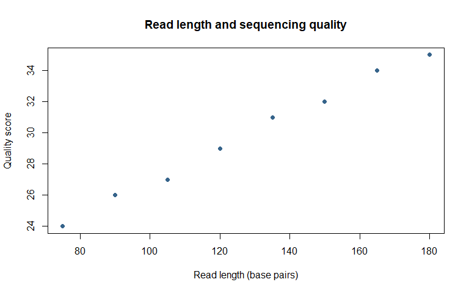
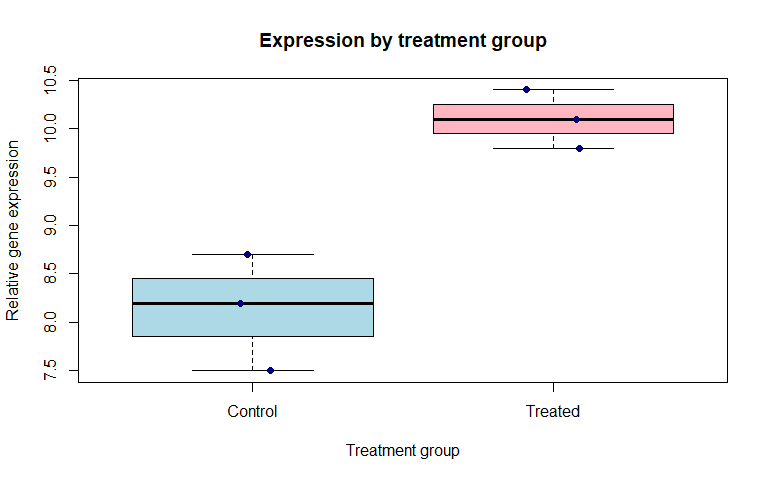
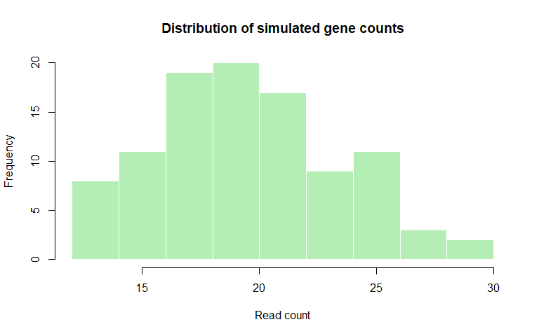
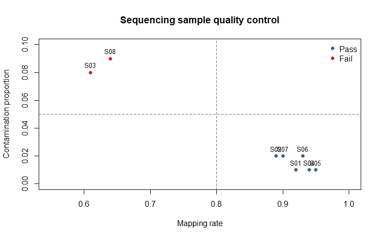

Chapter 2: Essential R for Biostatistics
================
Sandeep Singh

- [1. Introduction](#1-introduction)
- [2. Learning Objectives](#2-learning-objectives)
- [3. R and RStudio Are Not the Same
  Thing](#3-r-and-rstudio-are-not-the-same-thing)
  - [3.1 R](#31-r)
  - [3.2 RStudio](#32-rstudio)
- [4. Console, Script and
  Environment](#4-console-script-and-environment)
  - [4.1 The console](#41-the-console)
  - [4.2 An R script](#42-an-r-script)
  - [4.3 The environment](#43-the-environment)
- [5. Understanding Basic R Syntax](#5-understanding-basic-r-syntax)
  - [5.1 R is case-sensitive](#51-r-is-case-sensitive)
  - [5.2 Comments](#52-comments)
  - [5.3 Parentheses, brackets and
    braces](#53-parentheses-brackets-and-braces)
- [6. Objects and Assignment](#6-objects-and-assignment)
  - [6.1 Why use `<-`?](#61-why-use--)
  - [6.2 Naming objects](#62-naming-objects)
- [7. R as a Calculator](#7-r-as-a-calculator)
  - [7.1 Order of operations](#71-order-of-operations)
  - [7.2 A biological calculation](#72-a-biological-calculation)
- [8. Functions and Arguments](#8-functions-and-arguments)
  - [8.1 Named arguments](#81-named-arguments)
  - [8.2 Functions can return values](#82-functions-can-return-values)
  - [8.3 Getting help](#83-getting-help)
- [9. Vectors: The Foundation of R](#9-vectors-the-foundation-of-r)
  - [9.1 Creating a vector with `c()`](#91-creating-a-vector-with-c)
  - [9.2 Examining a vector](#92-examining-a-vector)
  - [9.3 Vectorized calculations](#93-vectorized-calculations)
  - [9.4 Combining vectors in
    calculations](#94-combining-vectors-in-calculations)
  - [9.5 Recycling warning](#95-recycling-warning)
- [10. Basic Data Types](#10-basic-data-types)
  - [10.1 Numeric data](#101-numeric-data)
  - [10.2 Integer data](#102-integer-data)
  - [10.3 Character data](#103-character-data)
  - [10.4 Logical data](#104-logical-data)
  - [10.5 Special numeric values](#105-special-numeric-values)
- [11. Coercion: When R Changes a Data
  Type](#11-coercion-when-r-changes-a-data-type)
  - [11.1 Explicit conversion](#111-explicit-conversion)
- [12. Selecting Values from a
  Vector](#12-selecting-values-from-a-vector)
  - [12.1 Selecting by position](#121-selecting-by-position)
  - [12.2 Excluding positions](#122-excluding-positions)
  - [12.3 Selecting a range](#123-selecting-a-range)
  - [12.4 Selecting with a logical
    condition](#124-selecting-with-a-logical-condition)
  - [12.5 Named vectors](#125-named-vectors)
- [13. Comparison and Logical
  Operators](#13-comparison-and-logical-operators)
- [14. Missing Values](#14-missing-values)
  - [14.1 Detecting missing values](#141-detecting-missing-values)
  - [14.2 Missing values affect
    calculations](#142-missing-values-affect-calculations)
  - [14.3 Do not compare missing values with
    `==`](#143-do-not-compare-missing-values-with-)
  - [14.4 Zero is not automatically
    missing](#144-zero-is-not-automatically-missing)
- [15. Factors: Representing
  Categories](#15-factors-representing-categories)
  - [15.1 Reference levels matter](#151-reference-levels-matter)
  - [15.2 Ordered factors](#152-ordered-factors)
- [16. Matrices](#16-matrices)
  - [16.1 Matrix dimensions](#161-matrix-dimensions)
  - [16.2 Selecting matrix values](#162-selecting-matrix-values)
- [17. Data Frames](#17-data-frames)
  - [17.1 Selecting columns](#171-selecting-columns)
  - [17.2 Selecting rows](#172-selecting-rows)
  - [17.3 Selecting rows with
    conditions](#173-selecting-rows-with-conditions)
  - [17.4 Adding a column](#174-adding-a-column)
- [18. Inspecting a Dataset Before
  Analysis](#18-inspecting-a-dataset-before-analysis)
  - [18.1 What these functions tell
    us](#181-what-these-functions-tell-us)
  - [18.2 Useful inspection questions](#182-useful-inspection-questions)
- [19. Basic Summary Functions](#19-basic-summary-functions)
  - [19.1 Counting categories](#191-counting-categories)
  - [19.2 Calculating proportions](#192-calculating-proportions)
  - [19.3 Summarizing by group](#193-summarizing-by-group)
- [20. Importing Data](#20-importing-data)
  - [20.1 CSV files](#201-csv-files)
  - [20.2 Tab-separated files](#202-tab-separated-files)
  - [20.3 Immediately inspect imported
    data](#203-immediately-inspect-imported-data)
  - [20.4 Relative and absolute paths](#204-relative-and-absolute-paths)
- [21. Exporting Data and Results](#21-exporting-data-and-results)
- [22. Basic Figures in R](#22-basic-figures-in-r)
  - [22.1 Scatterplot](#221-scatterplot)
  - [22.2 Boxplot with individual
    observations](#222-boxplot-with-individual-observations)
  - [22.3 Histogram](#223-histogram)
- [23. Packages](#23-packages)
  - [23.1 Installing a package](#231-installing-a-package)
  - [23.2 Loading a package](#232-loading-a-package)
  - [23.3 Installation versus loading](#233-installation-versus-loading)
  - [23.4 Function conflicts](#234-function-conflicts)
- [24. Errors, Warnings and Messages](#24-errors-warnings-and-messages)
  - [24.1 Error](#241-error)
  - [24.2 Warning](#242-warning)
  - [24.3 Message](#243-message)
  - [24.4 A practical debugging
    sequence](#244-a-practical-debugging-sequence)
- [25. Reproducible R Scripts](#25-reproducible-r-scripts)
  - [25.1 Recommended script order](#251-recommended-script-order)
  - [25.2 Use a random seed](#252-use-a-random-seed)
  - [25.3 Avoid manual changes to analysed
    data](#253-avoid-manual-changes-to-analysed-data)
  - [25.4 Test from a clean session](#254-test-from-a-clean-session)
- [26. R Markdown and GitHub
  Markdown](#26-r-markdown-and-github-markdown)
  - [26.1 YAML header](#261-yaml-header)
  - [26.2 R code chunks](#262-r-code-chunks)
  - [26.3 Important chunk options](#263-important-chunk-options)
  - [26.4 Knitting the document](#264-knitting-the-document)
- [27. Integrated Case Study: Biological Sample Quality
  Control](#27-integrated-case-study-biological-sample-quality-control)
  - [27.1 Inspect the dataset](#271-inspect-the-dataset)
  - [27.2 Define transparent quality-control
    rules](#272-define-transparent-quality-control-rules)
  - [27.3 Count passed and failed
    samples](#273-count-passed-and-failed-samples)
  - [27.4 Select samples that passed](#274-select-samples-that-passed)
  - [27.5 Visualize the two QC
    measurements](#275-visualize-the-two-qc-measurements)
- [28. Common Beginner Mistakes](#28-common-beginner-mistakes)
  - [Mistake 1: Using an object before creating
    it](#mistake-1-using-an-object-before-creating-it)
  - [Mistake 2: Confusing `<-` and `==`](#mistake-2-confusing---and-)
  - [Mistake 3: Ignoring uppercase and lowercase
    differences](#mistake-3-ignoring-uppercase-and-lowercase-differences)
  - [Mistake 4: Forgetting quotation marks around
    text](#mistake-4-forgetting-quotation-marks-around-text)
  - [Mistake 5: Comparing missing values with
    `== NA`](#mistake-5-comparing-missing-values-with--na)
  - [Mistake 6: Assuming imported columns have correct data
    types](#mistake-6-assuming-imported-columns-have-correct-data-types)
  - [Mistake 7: Treating zero as automatically
    missing](#mistake-7-treating-zero-as-automatically-missing)
  - [Mistake 8: Installing packages every time a script
    runs](#mistake-8-installing-packages-every-time-a-script-runs)
  - [Mistake 9: Using absolute paths throughout a
    project](#mistake-9-using-absolute-paths-throughout-a-project)
  - [Mistake 10: Clearing errors without reading
    them](#mistake-10-clearing-errors-without-reading-them)
  - [Mistake 11: Trusting an analysis that works only in an old
    environment](#mistake-11-trusting-an-analysis-that-works-only-in-an-old-environment)
- [29. Chapter Summary](#29-chapter-summary)
- [30. Check Your Understanding](#30-check-your-understanding)
  - [Question 1](#question-1)
  - [Question 2](#question-2)
  - [Question 3](#question-3)
  - [Question 4](#question-4)
  - [Question 5](#question-5)
  - [Question 6](#question-6)
  - [Question 7](#question-7)
  - [Question 8](#question-8)
- [31. Practice with R](#31-practice-with-r)
  - [Exercise 1: Create biological
    objects](#exercise-1-create-biological-objects)
  - [Exercise 2: Work with a vector](#exercise-2-work-with-a-vector)
  - [Exercise 3: Work with missing
    data](#exercise-3-work-with-missing-data)
  - [Exercise 4: Create a factor](#exercise-4-create-a-factor)
  - [Exercise 5: Explore a data frame](#exercise-5-explore-a-data-frame)
  - [Exercise 6: Find and correct
    problems](#exercise-6-find-and-correct-problems)
- [32. Mini-Project: Build and Explore a Small Biological
  Dataset](#32-mini-project-build-and-explore-a-small-biological-dataset)
- [33. Glossary](#33-glossary)
- [34. References and Further
  Reading](#34-references-and-further-reading)
- [35. Reproducibility Information](#35-reproducibility-information)

# 1. Introduction

Biostatistics is not learned by reading formulas alone. We must also
work with data, calculate summaries, produce figures and examine whether
our results make biological sense.

R is a programming language and statistical environment designed for
these tasks. It is widely used in statistics, epidemiology, genetics,
genomics, bioinformatics and data science.

In this chapter, we will learn only the R foundations needed for the
statistical chapters that follow. Every important idea will be
introduced using simple biological examples.

No previous programming knowledge is required.

> **The objective is not to memorize every R command. The objective is
> to understand how data are represented and how instructions are given
> to R.**

------------------------------------------------------------------------

# 2. Learning Objectives

After completing this chapter, you should be able to:

1.  explain the difference between R and RStudio;
2.  use the console and an R script appropriately;
3.  create and name R objects;
4.  perform basic arithmetic and use functions;
5.  create, inspect and subset vectors;
6.  recognize numeric, character and logical data;
7.  work with missing values;
8.  create factors, matrices and data frames;
9.  inspect and summarize a biological dataset;
10. import and export simple tabular files;
11. produce basic statistical figures;
12. understand packages, errors and warnings;
13. write reproducible R code; and
14. understand how R Markdown generates a GitHub Markdown chapter.

------------------------------------------------------------------------

# 3. R and RStudio Are Not the Same Thing

Beginners often use the words **R** and **RStudio** as if they mean the
same thing. They do not.

## 3.1 R

R is the language and computational engine that performs the analysis.

R can:

- calculate means and standard deviations;
- perform statistical tests;
- fit regression models;
- generate figures;
- simulate biological data;
- analyse genetic and genomic datasets; and
- create reproducible reports.

## 3.2 RStudio

RStudio is an integrated development environment, commonly called an
**IDE**. It provides a convenient interface for working with R.

RStudio normally contains four main panes:

| Pane | Main purpose |
|----|----|
| Source | Write and save scripts or R Markdown files |
| Console | Run R commands and view immediate output |
| Environment/History | Inspect created objects and previous commands |
| Files/Plots/Packages/Help | Browse files, view figures, manage packages and read documentation |

You can think of R as the **engine** and RStudio as the **dashboard**
used to control the engine.

------------------------------------------------------------------------

# 4. Console, Script and Environment

## 4.1 The console

The console is useful for quick calculations and experiments.

``` r
12 + 8
```

    ## [1] 20

The console executes a command immediately after you press Enter.
However, commands typed only in the console are easy to lose and
difficult to reproduce.

## 4.2 An R script

An R script is a plain-text file normally saved with the extension `.R`.

Use a script when you want to:

- save your analysis;
- run the analysis again;
- correct or improve your code;
- share the workflow; or
- document how a result was produced.

In RStudio, a selected line can usually be run with **Ctrl + Enter** on
Windows or Linux and **Command + Enter** on macOS.

## 4.3 The environment

The R environment contains the objects created during the current
session.

``` r
gene_name <- "TP53"
sample_count <- 24
mean_expression <- 8.7
```

The objects `gene_name`, `sample_count` and `mean_expression` now exist
in memory.

Use `ls()` to list objects in the current environment.

``` r
ls()
```

    ## [1] "gene_name"       "mean_expression" "sample_count"

An object exists only after the code that creates it has been executed.

------------------------------------------------------------------------

# 5. Understanding Basic R Syntax

Syntax means the rules used to write instructions in a programming
language.

## 5.1 R is case-sensitive

R treats uppercase and lowercase letters as different.

``` r
gene <- "BRCA1"
Gene <- "BRCA2"

gene
```

    ## [1] "BRCA1"

``` r
Gene
```

    ## [1] "BRCA2"

The objects `gene` and `Gene` are separate objects.

## 5.2 Comments

A comment begins with `#`. R does not execute text appearing after `#`
on the same line.

``` r
# Store the number of biological samples
n_samples <- 12

# Calculate twice the number of samples
2 * n_samples
```

    ## [1] 24

Comments should explain the reason for an analytical decision, not
merely repeat obvious code.

Less useful comment:

``` r
# Calculate the mean
mean(expression)
```

More useful comment:

``` r
# Summarize expression after excluding measurements that failed quality control
mean(expression_qc_pass)
```

## 5.3 Parentheses, brackets and braces

These symbols have different purposes:

| Symbol | Common use |
|----|----|
| `()` | Supply arguments to a function |
| `[]` | Select elements from an object |
| `{}` | Group several instructions, especially inside functions or conditions |

We will use parentheses and brackets frequently in this chapter. Braces
will become more important when programming concepts are introduced
later.

------------------------------------------------------------------------

# 6. Objects and Assignment

An **object** is a named place where R stores information.

The assignment operator `<-` stores the value on its right inside the
object named on its left.

``` r
patient_age <- 46
gene_symbol <- "CYP2C19"
treatment_response <- TRUE

patient_age
```

    ## [1] 46

``` r
gene_symbol
```

    ## [1] "CYP2C19"

``` r
treatment_response
```

    ## [1] TRUE

Read the first instruction as:

> Store the value 46 in an object called `patient_age`.

## 6.1 Why use `<-`?

R also permits `=` in many assignment situations, but `<-` clearly
distinguishes object assignment from named function arguments. This book
will use `<-` consistently.

## 6.2 Naming objects

Good object names describe their contents.

``` r
control_expression <- 7.8
treated_expression <- 10.2
```

Recommended practices:

- use meaningful names;
- use lowercase letters;
- separate words with underscores;
- avoid spaces;
- avoid beginning a name with a number; and
- avoid names such as `data`, `mean`, `c`, `T` and `F` that may hide
  existing R functions or constants.

| Poor name | Better name       |
|-----------|-------------------|
| `x`       | `gene_expression` |
| `a1`      | `patient_age`     |
| `my data` | `clinical_data`   |
| `mean`    | `mean_glucose`    |

Short names such as `x` and `y` are acceptable in small mathematical
examples, but meaningful names are safer in real analyses.

------------------------------------------------------------------------

# 7. R as a Calculator

R supports standard arithmetic operations.

| Operation        | R operator | Example   |
|------------------|------------|-----------|
| Addition         | `+`        | `5 + 3`   |
| Subtraction      | `-`        | `5 - 3`   |
| Multiplication   | `*`        | `5 * 3`   |
| Division         | `/`        | `5 / 3`   |
| Exponentiation   | `^`        | `5^2`     |
| Remainder        | `%%`       | `5 %% 3`  |
| Integer division | `%/%`      | `5 %/% 3` |

``` r
5 + 3
```

    ## [1] 8

``` r
5 - 3
```

    ## [1] 2

``` r
5 * 3
```

    ## [1] 15

``` r
5 / 3
```

    ## [1] 1.666667

``` r
5^2
```

    ## [1] 25

``` r
5 %% 3
```

    ## [1] 2

``` r
5 %/% 3
```

    ## [1] 1

## 7.1 Order of operations

R follows the usual mathematical order of operations. Use parentheses
when they make the intended calculation clearer.

``` r
5 + 2 * 3
```

    ## [1] 11

``` r
(5 + 2) * 3
```

    ## [1] 21

## 7.2 A biological calculation

Suppose 18 of 24 tissue samples pass quality control.

``` r
passed_samples <- 18
total_samples <- 24

qc_pass_percentage <-
  (passed_samples / total_samples) * 100

qc_pass_percentage
```

    ## [1] 75

The result is a percentage because the proportion was multiplied by 100.

------------------------------------------------------------------------

# 8. Functions and Arguments

A **function** is a reusable instruction that performs a task.

The general structure is:

``` r
function_name(argument_1, argument_2)
```

For example, `sqrt()` calculates a square root.

``` r
sqrt(144)
```

    ## [1] 12

The value `144` is an **argument** supplied to the function.

## 8.1 Named arguments

Some functions accept several arguments. Naming them makes code easier
to understand.

``` r
round(x = 3.14159, digits = 2)
```

    ## [1] 3.14

## 8.2 Functions can return values

The result of a function can be stored in an object.

``` r
rounded_value <- round(x = 3.14159, digits = 2)
rounded_value
```

    ## [1] 3.14

## 8.3 Getting help

Use `?` or `help()` to open the documentation for a function.

``` r
?mean
help(mean)
```

If you do not know the exact function name, use `help.search()`.

``` r
help.search("standard deviation")
```

R documentation may feel difficult initially. Focus first on:

- **Usage** — how the function is written;
- **Arguments** — what information the function accepts;
- **Value** — what the function returns; and
- **Examples** — working demonstrations.

------------------------------------------------------------------------

# 9. Vectors: The Foundation of R

A **vector** is a one-dimensional collection of values of the same basic
type.

Vectors are fundamental because many biological measurements can be
represented as a series of values.

Examples include:

- patient ages;
- plant heights;
- gene-expression values;
- DNA-fragment lengths;
- treatment labels; and
- quality-control outcomes.

## 9.1 Creating a vector with `c()`

The `c()` function combines values.

``` r
plant_height <- c(12.1, 13.4, 11.8, 14.2, 12.9)
gene_names <- c("TP53", "BRCA1", "EGFR", "APOE")
qc_pass <- c(TRUE, TRUE, FALSE, TRUE)

plant_height
```

    ## [1] 12.1 13.4 11.8 14.2 12.9

``` r
gene_names
```

    ## [1] "TP53"  "BRCA1" "EGFR"  "APOE"

``` r
qc_pass
```

    ## [1]  TRUE  TRUE FALSE  TRUE

## 9.2 Examining a vector

``` r
length(plant_height)
```

    ## [1] 5

``` r
class(plant_height)
```

    ## [1] "numeric"

``` r
typeof(plant_height)
```

    ## [1] "double"

``` r
str(plant_height)
```

    ##  num [1:5] 12.1 13.4 11.8 14.2 12.9

These functions answer different questions:

| Function   | Question answered                    |
|------------|--------------------------------------|
| `length()` | How many elements are present?       |
| `class()`  | How does R treat the object?         |
| `typeof()` | How is the object stored internally? |
| `str()`    | What is its compact structure?       |

## 9.3 Vectorized calculations

R can perform the same calculation on every element without an explicit
loop.

Suppose DNA-fragment lengths are recorded in base pairs and we want
their lengths in kilobases.

``` r
fragment_bp <- c(850, 1200, 1750, 2300)
fragment_kb <- fragment_bp / 1000

fragment_kb
```

    ## [1] 0.85 1.20 1.75 2.30

This is called a **vectorized operation**.

## 9.4 Combining vectors in calculations

``` r
control_expression <- c(7.2, 7.8, 8.1, 7.5)
treated_expression <- c(9.4, 10.1, 9.8, 10.3)

expression_difference <-
  treated_expression - control_expression

expression_difference
```

    ## [1] 2.2 2.3 1.7 2.8

R subtracts corresponding elements. This calculation makes sense only if
the two vectors have compatible lengths and correctly aligned
observations.

## 9.5 Recycling warning

If vector lengths differ, R may repeat values from the shorter vector.
This is called **recycling** and can cause unnoticed errors.

``` r
c(10, 20, 30, 40) + c(1, 2)
```

    ## [1] 11 22 31 42

R repeats `1, 2` to obtain `1, 2, 1, 2`.

Avoid relying on recycling unless it is deliberate and obvious.

------------------------------------------------------------------------

# 10. Basic Data Types

## 10.1 Numeric data

Numeric values include decimal measurements.

``` r
body_temperature <- c(36.8, 37.1, 36.6)
typeof(body_temperature)
```

    ## [1] "double"

## 10.2 Integer data

Integers are whole numbers stored using an `L` suffix when created
explicitly.

``` r
mutation_count <- c(4L, 7L, 2L)
typeof(mutation_count)
```

    ## [1] "integer"

## 10.3 Character data

Character values are text enclosed in quotation marks.

``` r
tissue_type <- c("Blood", "Liver", "Brain")
typeof(tissue_type)
```

    ## [1] "character"

## 10.4 Logical data

Logical values are `TRUE` or `FALSE`.

``` r
sample_passed_qc <- c(TRUE, FALSE, TRUE)
typeof(sample_passed_qc)
```

    ## [1] "logical"

Do not place quotation marks around logical values. `TRUE` is logical,
while `"TRUE"` is character text.

## 10.5 Special numeric values

R also recognizes:

- `Inf` for positive infinity;
- `-Inf` for negative infinity; and
- `NaN` for an undefined numerical result.

``` r
1 / 0
```

    ## [1] Inf

``` r
0 / 0
```

    ## [1] NaN

These values are different from missing data, which are represented by
`NA`.

------------------------------------------------------------------------

# 11. Coercion: When R Changes a Data Type

A basic vector can contain only one underlying data type. If different
types are combined, R converts them to a common type.

``` r
mixed_values <- c(25, "Blood", TRUE)

mixed_values
```

    ## [1] "25"    "Blood" "TRUE"

``` r
typeof(mixed_values)
```

    ## [1] "character"

All values become character text because character data can represent
the other entries.

This can happen accidentally during data import. A numeric laboratory
column may become character if one entry contains text such as
`"not measured"`.

## 11.1 Explicit conversion

Common conversion functions include:

- `as.numeric()`;
- `as.integer()`;
- `as.character()`;
- `as.logical()`; and
- `as.factor()`.

``` r
read_count_text <- c("120", "145", "98")
read_count_numeric <- as.numeric(read_count_text)

read_count_numeric
```

    ## [1] 120 145  98

``` r
typeof(read_count_numeric)
```

    ## [1] "double"

Always inspect values before converting them. A conversion warning may
indicate that some entries cannot be converted safely.

------------------------------------------------------------------------

# 12. Selecting Values from a Vector

Selection is also called **indexing** or **subsetting**.

``` r
gene_expression <- c(8.2, 7.6, 10.4, 9.1, 11.3)
```

## 12.1 Selecting by position

``` r
gene_expression[1]
```

    ## [1] 8.2

``` r
gene_expression[3]
```

    ## [1] 10.4

``` r
gene_expression[c(1, 3, 5)]
```

    ## [1]  8.2 10.4 11.3

R positions begin at 1, not 0.

## 12.2 Excluding positions

``` r
gene_expression[-2]
```

    ## [1]  8.2 10.4  9.1 11.3

This returns all elements except the second.

## 12.3 Selecting a range

``` r
gene_expression[2:4]
```

    ## [1]  7.6 10.4  9.1

## 12.4 Selecting with a logical condition

``` r
gene_expression > 9
```

    ## [1] FALSE FALSE  TRUE  TRUE  TRUE

``` r
gene_expression[gene_expression > 9]
```

    ## [1] 10.4  9.1 11.3

The first instruction creates logical values. The second uses those
logical values to retain only measurements greater than 9.

## 12.5 Named vectors

``` r
expression_by_gene <- c(
  TP53 = 8.2,
  BRCA1 = 7.6,
  EGFR = 10.4,
  APOE = 9.1
)

expression_by_gene["EGFR"]
```

    ## EGFR 
    ## 10.4

Names can make small vectors easier to interpret.

------------------------------------------------------------------------

# 13. Comparison and Logical Operators

Logical conditions are essential for filtering data and defining groups.

| Meaning | Operator | Example |
|----|----|----|
| Equal to | `==` | `status == "Case"` |
| Not equal to | `!=` | `status != "Case"` |
| Greater than | `>` | `age > 50` |
| Less than | `<` | `age < 50` |
| Greater than or equal to | `>=` | `quality >= 30` |
| Less than or equal to | `<=` | `quality <= 30` |
| AND | `&` | `age > 40 & status == "Case"` |
| OR | `\|` | `status == "Case" \| status == "Control"` |
| NOT | `!` | `!qc_pass` |
| Included in a set | `%in%` | `gene %in% c("TP53", "EGFR")` |

``` r
sample_quality <- c(35, 28, 41, 19, 33)

sample_quality >= 30
```

    ## [1]  TRUE FALSE  TRUE FALSE  TRUE

``` r
sample_quality[sample_quality >= 30]
```

    ## [1] 35 41 33

Use `==` when comparing values. A single `<-` assigns a value and does
not test equality.

------------------------------------------------------------------------

# 14. Missing Values

Missing information is represented by `NA`.

``` r
glucose <- c(92, 105, NA, 110, 98)
glucose
```

    ## [1]  92 105  NA 110  98

## 14.1 Detecting missing values

``` r
is.na(glucose)
```

    ## [1] FALSE FALSE  TRUE FALSE FALSE

``` r
sum(is.na(glucose))
```

    ## [1] 1

``` r
anyNA(glucose)
```

    ## [1] TRUE

## 14.2 Missing values affect calculations

``` r
mean(glucose)
```

    ## [1] NA

``` r
mean(glucose, na.rm = TRUE)
```

    ## [1] 101.25

The argument `na.rm = TRUE` tells R to remove missing values for that
calculation.

It does not permanently delete the missing entries from the dataset.

## 14.3 Do not compare missing values with `==`

Incorrect:

``` r
glucose == NA
```

    ## [1] NA NA NA NA NA

Correct:

``` r
is.na(glucose)
```

    ## [1] FALSE FALSE  TRUE FALSE FALSE

## 14.4 Zero is not automatically missing

A zero can be a valid biological measurement.

Examples include:

- zero detected colonies;
- zero copies of an effect allele;
- zero observed adverse events; or
- zero sequencing reads for a feature.

Whether zero represents a valid measurement or an encoded missing value
depends on the data documentation and scientific context.

------------------------------------------------------------------------

# 15. Factors: Representing Categories

A **factor** represents categorical data with a defined set of possible
categories called **levels**.

``` r
treatment <- factor(
  c("Control", "Treated", "Control", "Treated")
)

treatment
```

    ## [1] Control Treated Control Treated
    ## Levels: Control Treated

``` r
levels(treatment)
```

    ## [1] "Control" "Treated"

## 15.1 Reference levels matter

In many statistical models, one category becomes the reference group.

``` r
treatment <- relevel(treatment, ref = "Control")
levels(treatment)
```

    ## [1] "Control" "Treated"

This makes `Control` the reference level.

## 15.2 Ordered factors

Some categories have a meaningful order.

``` r
disease_severity <- factor(
  c("Mild", "Severe", "Moderate", "Mild"),
  levels = c("Mild", "Moderate", "Severe"),
  ordered = TRUE
)

disease_severity
```

    ## [1] Mild     Severe   Moderate Mild    
    ## Levels: Mild < Moderate < Severe

Although the levels are ordered, the distance between `Mild` and
`Moderate` is not automatically numerical.

------------------------------------------------------------------------

# 16. Matrices

A **matrix** is a two-dimensional structure in which every value has the
same basic type.

Matrices are common in bioinformatics. A gene-expression matrix may
contain genes in rows and samples in columns.

``` r
expression_matrix <- matrix(
  c(
    8.1, 7.9, 10.2,
    6.5, 6.8, 9.4
  ),
  nrow = 2,
  byrow = TRUE
)

rownames(expression_matrix) <- c("Gene_A", "Gene_B")
colnames(expression_matrix) <- c(
  "Control_1",
  "Control_2",
  "Treated_1"
)

expression_matrix
```

    ##        Control_1 Control_2 Treated_1
    ## Gene_A       8.1       7.9      10.2
    ## Gene_B       6.5       6.8       9.4

## 16.1 Matrix dimensions

``` r
dim(expression_matrix)
```

    ## [1] 2 3

``` r
nrow(expression_matrix)
```

    ## [1] 2

``` r
ncol(expression_matrix)
```

    ## [1] 3

## 16.2 Selecting matrix values

Matrices use `[row, column]` indexing.

``` r
expression_matrix[1, 2]
```

    ## [1] 7.9

``` r
expression_matrix["Gene_B", "Treated_1"]
```

    ## [1] 9.4

``` r
expression_matrix[1, ]
```

    ## Control_1 Control_2 Treated_1 
    ##       8.1       7.9      10.2

``` r
expression_matrix[, 3]
```

    ## Gene_A Gene_B 
    ##   10.2    9.4

Leaving the column position empty selects every column. Leaving the row
position empty selects every row.

------------------------------------------------------------------------

# 17. Data Frames

A **data frame** is a two-dimensional table in which different columns
may contain different data types.

This makes data frames suitable for clinical and biological datasets.

``` r
sample_data <- data.frame(
  sample_id = c("S01", "S02", "S03", "S04", "S05", "S06"),
  tissue = c("Blood", "Blood", "Liver", "Liver", "Blood", "Liver"),
  treatment = c("Control", "Treated", "Control", "Treated", "Control", "Treated"),
  expression = c(8.2, 10.1, 7.5, 9.8, 8.7, 10.4),
  qc_pass = c(TRUE, TRUE, FALSE, TRUE, TRUE, TRUE),
  stringsAsFactors = FALSE
)

print(sample_data)
```

    ##   sample_id tissue treatment expression qc_pass
    ## 1       S01  Blood   Control        8.2    TRUE
    ## 2       S02  Blood   Treated       10.1    TRUE
    ## 3       S03  Liver   Control        7.5   FALSE
    ## 4       S04  Liver   Treated        9.8    TRUE
    ## 5       S05  Blood   Control        8.7    TRUE
    ## 6       S06  Liver   Treated       10.4    TRUE

Each row is one biological sample. Each column is one variable.

## 17.1 Selecting columns

The `$` operator selects a column by name.

``` r
sample_data$expression
```

    ## [1]  8.2 10.1  7.5  9.8  8.7 10.4

Columns can also be selected with brackets.

``` r
sample_data[, "expression"]
```

    ## [1]  8.2 10.1  7.5  9.8  8.7 10.4

``` r
print(sample_data[, c("sample_id", "expression")])
```

    ##   sample_id expression
    ## 1       S01        8.2
    ## 2       S02       10.1
    ## 3       S03        7.5
    ## 4       S04        9.8
    ## 5       S05        8.7
    ## 6       S06       10.4

## 17.2 Selecting rows

``` r
print(sample_data[1, ])
```

    ##   sample_id tissue treatment expression qc_pass
    ## 1       S01  Blood   Control        8.2    TRUE

``` r
print(sample_data[1:3, ])
```

    ##   sample_id tissue treatment expression qc_pass
    ## 1       S01  Blood   Control        8.2    TRUE
    ## 2       S02  Blood   Treated       10.1    TRUE
    ## 3       S03  Liver   Control        7.5   FALSE

## 17.3 Selecting rows with conditions

``` r
print(sample_data[sample_data$qc_pass, ])
```

    ##   sample_id tissue treatment expression qc_pass
    ## 1       S01  Blood   Control        8.2    TRUE
    ## 2       S02  Blood   Treated       10.1    TRUE
    ## 4       S04  Liver   Treated        9.8    TRUE
    ## 5       S05  Blood   Control        8.7    TRUE
    ## 6       S06  Liver   Treated       10.4    TRUE

``` r
print(sample_data[
  sample_data$treatment == "Treated" &
    sample_data$qc_pass,
])
```

    ##   sample_id tissue treatment expression qc_pass
    ## 2       S02  Blood   Treated       10.1    TRUE
    ## 4       S04  Liver   Treated        9.8    TRUE
    ## 6       S06  Liver   Treated       10.4    TRUE

## 17.4 Adding a column

``` r
sample_data$expression_high <-
  sample_data$expression >= 9

print(sample_data)
```

    ##   sample_id tissue treatment expression qc_pass expression_high
    ## 1       S01  Blood   Control        8.2    TRUE           FALSE
    ## 2       S02  Blood   Treated       10.1    TRUE            TRUE
    ## 3       S03  Liver   Control        7.5   FALSE           FALSE
    ## 4       S04  Liver   Treated        9.8    TRUE            TRUE
    ## 5       S05  Blood   Control        8.7    TRUE           FALSE
    ## 6       S06  Liver   Treated       10.4    TRUE            TRUE

The comparison creates `TRUE` or `FALSE` for each row.

------------------------------------------------------------------------

# 18. Inspecting a Dataset Before Analysis

Never begin a statistical analysis without first inspecting the dataset.

``` r
print(head(sample_data))
```

    ##   sample_id tissue treatment expression qc_pass expression_high
    ## 1       S01  Blood   Control        8.2    TRUE           FALSE
    ## 2       S02  Blood   Treated       10.1    TRUE            TRUE
    ## 3       S03  Liver   Control        7.5   FALSE           FALSE
    ## 4       S04  Liver   Treated        9.8    TRUE            TRUE
    ## 5       S05  Blood   Control        8.7    TRUE           FALSE
    ## 6       S06  Liver   Treated       10.4    TRUE            TRUE

``` r
print(tail(sample_data))
```

    ##   sample_id tissue treatment expression qc_pass expression_high
    ## 1       S01  Blood   Control        8.2    TRUE           FALSE
    ## 2       S02  Blood   Treated       10.1    TRUE            TRUE
    ## 3       S03  Liver   Control        7.5   FALSE           FALSE
    ## 4       S04  Liver   Treated        9.8    TRUE            TRUE
    ## 5       S05  Blood   Control        8.7    TRUE           FALSE
    ## 6       S06  Liver   Treated       10.4    TRUE            TRUE

``` r
dim(sample_data)
```

    ## [1] 6 6

``` r
nrow(sample_data)
```

    ## [1] 6

``` r
ncol(sample_data)
```

    ## [1] 6

``` r
names(sample_data)
```

    ## [1] "sample_id"       "tissue"          "treatment"       "expression"     
    ## [5] "qc_pass"         "expression_high"

``` r
str(sample_data)
```

    ## 'data.frame':    6 obs. of  6 variables:
    ##  $ sample_id      : chr  "S01" "S02" "S03" "S04" ...
    ##  $ tissue         : chr  "Blood" "Blood" "Liver" "Liver" ...
    ##  $ treatment      : chr  "Control" "Treated" "Control" "Treated" ...
    ##  $ expression     : num  8.2 10.1 7.5 9.8 8.7 10.4
    ##  $ qc_pass        : logi  TRUE TRUE FALSE TRUE TRUE TRUE
    ##  $ expression_high: logi  FALSE TRUE FALSE TRUE FALSE TRUE

``` r
summary(sample_data)
```

    ##   sample_id            tissue           treatment           expression    
    ##  Length:6           Length:6           Length:6           Min.   : 7.500  
    ##  Class :character   Class :character   Class :character   1st Qu.: 8.325  
    ##  Mode  :character   Mode  :character   Mode  :character   Median : 9.250  
    ##                                                           Mean   : 9.117  
    ##                                                           3rd Qu.:10.025  
    ##                                                           Max.   :10.400  
    ##   qc_pass        expression_high
    ##  Mode :logical   Mode :logical  
    ##  FALSE:1         FALSE:3        
    ##  TRUE :5         TRUE :3        
    ##                                 
    ##                                 
    ## 

## 18.1 What these functions tell us

| Function    | Information provided          |
|-------------|-------------------------------|
| `head()`    | First observations            |
| `tail()`    | Last observations             |
| `dim()`     | Number of rows and columns    |
| `nrow()`    | Number of rows                |
| `ncol()`    | Number of columns             |
| `names()`   | Column names                  |
| `str()`     | Structure and data types      |
| `summary()` | Basic summary of every column |

## 18.2 Useful inspection questions

Before analysis, ask:

- Does each row represent the intended observational unit?
- Are column names understandable?
- Are numeric variables stored as numeric?
- Are categories spelled consistently?
- Are missing values represented correctly?
- Are measurement units documented?
- Are any values biologically impossible?
- Are sample identifiers unique?

------------------------------------------------------------------------

# 19. Basic Summary Functions

``` r
expression_values <- sample_data$expression

length(expression_values)
```

    ## [1] 6

``` r
mean(expression_values)
```

    ## [1] 9.116667

``` r
median(expression_values)
```

    ## [1] 9.25

``` r
sd(expression_values)
```

    ## [1] 1.158303

``` r
var(expression_values)
```

    ## [1] 1.341667

``` r
min(expression_values)
```

    ## [1] 7.5

``` r
max(expression_values)
```

    ## [1] 10.4

``` r
range(expression_values)
```

    ## [1]  7.5 10.4

``` r
quantile(expression_values)
```

    ##     0%    25%    50%    75%   100% 
    ##  7.500  8.325  9.250 10.025 10.400

These functions describe the observed sample. Later chapters will
explain their statistical meaning and appropriate use in detail.

## 19.1 Counting categories

``` r
table(sample_data$tissue)
```

    ## 
    ## Blood Liver 
    ##     3     3

``` r
table(sample_data$treatment)
```

    ## 
    ## Control Treated 
    ##       3       3

``` r
table(sample_data$treatment, sample_data$qc_pass)
```

    ##          
    ##           FALSE TRUE
    ##   Control     1    2
    ##   Treated     0    3

## 19.2 Calculating proportions

``` r
prop.table(table(sample_data$tissue))
```

    ## 
    ## Blood Liver 
    ##   0.5   0.5

## 19.3 Summarizing by group

``` r
mean_by_treatment <- aggregate(
  expression ~ treatment,
  data = sample_data,
  FUN = mean
)

print(mean_by_treatment)
```

    ##   treatment expression
    ## 1   Control   8.133333
    ## 2   Treated  10.100000

The output reports the sample mean in each treatment group. It does not
by itself establish a treatment effect.

------------------------------------------------------------------------

# 20. Importing Data

Biological data are often stored in CSV or tab-separated text files.

## 20.1 CSV files

A comma-separated values file can be imported with `read.csv()`.

``` r
clinical_data <- read.csv(
  "data/clinical_data.csv",
  stringsAsFactors = FALSE
)
```

## 20.2 Tab-separated files

``` r
expression_data <- read.delim(
  "data/gene_expression.tsv",
  stringsAsFactors = FALSE
)
```

## 20.3 Immediately inspect imported data

``` r
dim(clinical_data)
names(clinical_data)
str(clinical_data)
head(clinical_data)
summary(clinical_data)
```

Successful import does not guarantee correct import. Always check the
dimensions, column names, data types and example values.

## 20.4 Relative and absolute paths

An absolute path describes the complete location of a file on one
computer. A relative path describes a file location relative to the
project directory.

Absolute path:

``` r
"C:/Users/Student/Desktop/project/data/clinical_data.csv"
```

Relative path:

``` r
"data/clinical_data.csv"
```

Relative paths are preferable because they make a project easier to move
and share.

> **Place data, scripts and outputs inside a clearly organized project
> and use relative paths whenever possible.**

------------------------------------------------------------------------

# 21. Exporting Data and Results

Use `write.csv()` to save a data frame as a CSV file.

``` r
write.csv(
  sample_data,
  "outputs/clean_sample_data.csv",
  row.names = FALSE
)
```

The argument `row.names = FALSE` prevents R from writing row numbers as
an additional column.

Do not overwrite raw data with cleaned or transformed data. A safer
structure is:

``` text
project/
├── data_raw/
├── data_clean/
├── scripts/
├── figures/
└── reports/
```

Raw data should remain unchanged. Corrections and transformations should
be performed through documented code.

------------------------------------------------------------------------

# 22. Basic Figures in R

Statistical graphics allow us to see patterns that may be hidden in
numerical summaries.

## 22.1 Scatterplot

Suppose we measure sequencing read length and quality score for eight
reads.

``` r
read_length <- c(75, 90, 105, 120, 135, 150, 165, 180)
quality_score <- c(24, 26, 27, 29, 31, 32, 34, 35)
```

``` r
plot(
  x = read_length,
  y = quality_score,
  pch = 19,
  col = "steelblue4",
  xlab = "Read length (base pairs)",
  ylab = "Quality score",
  main = "Read length and sequencing quality"
)
```

<div class="figure" style="text-align: center">


<p class="caption">

A scatterplot showing the relationship between sequencing read length
and quality score in a hypothetical dataset.
</p>

</div>

Each point represents one sequencing read. The plot shows an increasing
pattern in this hypothetical example, but it does not establish
causation.

## 22.2 Boxplot with individual observations

``` r
boxplot(
  expression ~ treatment,
  data = sample_data,
  col = c("lightblue", "lightpink"),
  xlab = "Treatment group",
  ylab = "Relative gene expression",
  main = "Expression by treatment group"
)

stripchart(
  expression ~ treatment,
  data = sample_data,
  vertical = TRUE,
  method = "jitter",
  pch = 19,
  col = "navy",
  add = TRUE
)
```

<div class="figure" style="text-align: center">


<p class="caption">

Gene-expression values in control and treated biological samples.
</p>

</div>

Showing individual observations is especially useful when the sample is
small.

## 22.3 Histogram

``` r
simulated_gene_counts <- rpois(
  n = 100,
  lambda = 20
)
```

``` r
hist(
  simulated_gene_counts,
  breaks = 12,
  col = "darkseagreen2",
  border = "white",
  xlab = "Read count",
  main = "Distribution of simulated gene counts"
)
```

<div class="figure" style="text-align: center">


<p class="caption">

Distribution of 100 hypothetical gene read counts simulated from a
Poisson distribution.
</p>

</div>

The Poisson distribution will be explained in a later chapter. Here, the
example simply demonstrates how `hist()` displays the distribution of
numerical values.

------------------------------------------------------------------------

# 23. Packages

Base R contains many functions, but additional functions are distributed
in **packages**.

A package may contain:

- functions;
- example datasets;
- documentation;
- tutorials; and
- supporting code.

## 23.1 Installing a package

A package normally needs to be installed only once for a particular R
installation.

``` r
install.packages("ggplot2")
```

## 23.2 Loading a package

A package must usually be loaded in each new R session before its
functions are used.

``` r
library(ggplot2)
```

## 23.3 Installation versus loading

| Command | Purpose | Typical frequency |
|----|----|----|
| `install.packages()` | Downloads and installs a package | Usually once |
| `library()` | Makes an installed package available | Each new session or script |

Do not place `install.packages()` inside an analysis script that will be
run repeatedly. Record required packages separately and load them near
the beginning of the script.

## 23.4 Function conflicts

Different packages may contain functions with the same name. The `::`
operator identifies the package explicitly.

``` r
dplyr::filter(sample_data, qc_pass)
stats::filter
```

Package conflicts are not always errors, but they should be recognized
and managed deliberately.

------------------------------------------------------------------------

# 24. Errors, Warnings and Messages

R communicates different kinds of information.

## 24.1 Error

An error means the requested operation could not be completed.

``` r
mean(gene_expresion)
```

If the correct object is `gene_expression`, this code fails because the
name is misspelled.

## 24.2 Warning

A warning means R completed the operation but detected a possible
problem.

``` r
as.numeric(c("10", "not_measured", "12"))
```

R converts valid numbers but warns that `"not_measured"` cannot be
converted numerically.

## 24.3 Message

A message provides information about an operation. It does not
necessarily indicate a problem.

## 24.4 A practical debugging sequence

When code fails:

1.  read the complete error message;
2.  identify the line or chunk that failed;
3.  check object and column names;
4.  inspect the object with `str()`;
5.  confirm that earlier code was executed;
6.  simplify the problem to the smallest failing example;
7.  read the function documentation; and
8.  rerun the script from a clean session after correcting the problem.

Do not repeatedly change unrelated lines without understanding the
error.

------------------------------------------------------------------------

# 25. Reproducible R Scripts

A reproducible script should produce the same result when run again with
the same inputs and software environment.

## 25.1 Recommended script order

``` r
# 1. Project description
# 2. Load required packages
# 3. Import data
# 4. Inspect and clean data
# 5. Create derived variables
# 6. Perform analysis
# 7. Generate tables and figures
# 8. Save outputs
# 9. Record session information
```

## 25.2 Use a random seed

Random operations may produce different results each time. `set.seed()`
makes a simulation reproducible.

``` r
set.seed(42)
sample(1:100, size = 5)
```

    ## [1] 49 65 25 74 18

``` r
set.seed(42)
sample(1:100, size = 5)
```

    ## [1] 49 65 25 74 18

Both samples are identical because the same seed was set immediately
before each operation.

## 25.3 Avoid manual changes to analysed data

If a value must be corrected, document the correction in code.

``` r
laboratory_value <- c(12.4, 13.1, 131, 12.8)

# Correct a confirmed decimal-entry error documented in the laboratory log
laboratory_value[3] <- 13.1

laboratory_value
```

    ## [1] 12.4 13.1 13.1 12.8

Such corrections should be made only when supported by source
documentation. An unusual value should not be changed merely because it
looks inconvenient.

## 25.4 Test from a clean session

A script may appear to work because required objects remain in the
environment from earlier work.

Before sharing or publishing an analysis:

1.  restart R;
2.  open the project;
3.  run the complete script from the first line; and
4.  confirm that every required output is reproduced.

------------------------------------------------------------------------

# 26. R Markdown and GitHub Markdown

An R Markdown file usually has the extension `.Rmd`. It combines:

- explanatory text;
- headings and lists;
- mathematical notation;
- R code; and
- results generated by that code.

## 26.1 YAML header

The YAML header appears at the beginning of an R Markdown file.

``` yaml
---
title: "Chapter title"
output:
  github_document:
    toc: true
---
```

It controls the document title and output format.

## 26.2 R code chunks

An executable R chunk has this structure:

```` markdown

``` r
mean(c(10, 12, 14))
```

```
## [1] 12
```
````

Chunk names should be unique and descriptive.

## 26.3 Important chunk options

| Option            | Meaning                                    |
|-------------------|--------------------------------------------|
| `echo = TRUE`     | Show the R code                            |
| `echo = FALSE`    | Run the code but hide it                   |
| `eval = FALSE`    | Show the code but do not run it            |
| `include = FALSE` | Run the code but hide both code and output |
| `message = FALSE` | Hide package messages                      |
| `warning = FALSE` | Hide warnings in the rendered document     |
| `fig.cap`         | Add a figure caption                       |

Warnings should be hidden only after the analyst understands why they
occur.

## 26.4 Knitting the document

When the chapter is knitted:

1.  R starts with the instructions in the Rmd file;
2.  code chunks are executed in order;
3.  results and figures are generated;
4.  explanatory text and output are combined; and
5.  a Markdown file is created for GitHub.

If one chunk fails, later chunks may not run. Therefore, code order and
object creation matter.

------------------------------------------------------------------------

# 27. Integrated Case Study: Biological Sample Quality Control

Suppose a small sequencing study contains eight biological samples.

``` r
qc_data <- data.frame(
  sample_id = paste0("S", sprintf("%02d", 1:8)),
  group = rep(c("Control", "Treated"), each = 4),
  mapped_reads_million = c(42, 38, 19, 45, 51, 48, 44, 21),
  mapping_rate = c(0.92, 0.89, 0.61, 0.94, 0.95, 0.93, 0.90, 0.64),
  contamination = c(0.01, 0.02, 0.08, 0.01, 0.01, 0.02, 0.02, 0.09),
  stringsAsFactors = FALSE
)

print(qc_data)
```

    ##   sample_id   group mapped_reads_million mapping_rate contamination
    ## 1       S01 Control                   42         0.92          0.01
    ## 2       S02 Control                   38         0.89          0.02
    ## 3       S03 Control                   19         0.61          0.08
    ## 4       S04 Control                   45         0.94          0.01
    ## 5       S05 Treated                   51         0.95          0.01
    ## 6       S06 Treated                   48         0.93          0.02
    ## 7       S07 Treated                   44         0.90          0.02
    ## 8       S08 Treated                   21         0.64          0.09

## 27.1 Inspect the dataset

``` r
dim(qc_data)
```

    ## [1] 8 5

``` r
names(qc_data)
```

    ## [1] "sample_id"            "group"                "mapped_reads_million"
    ## [4] "mapping_rate"         "contamination"

``` r
str(qc_data)
```

    ## 'data.frame':    8 obs. of  5 variables:
    ##  $ sample_id           : chr  "S01" "S02" "S03" "S04" ...
    ##  $ group               : chr  "Control" "Control" "Control" "Control" ...
    ##  $ mapped_reads_million: num  42 38 19 45 51 48 44 21
    ##  $ mapping_rate        : num  0.92 0.89 0.61 0.94 0.95 0.93 0.9 0.64
    ##  $ contamination       : num  0.01 0.02 0.08 0.01 0.01 0.02 0.02 0.09

``` r
summary(qc_data)
```

    ##   sample_id            group           mapped_reads_million  mapping_rate   
    ##  Length:8           Length:8           Min.   :19.00        Min.   :0.6100  
    ##  Class :character   Class :character   1st Qu.:33.75        1st Qu.:0.8275  
    ##  Mode  :character   Mode  :character   Median :43.00        Median :0.9100  
    ##                                        Mean   :38.50        Mean   :0.8475  
    ##                                        3rd Qu.:45.75        3rd Qu.:0.9325  
    ##                                        Max.   :51.00        Max.   :0.9500  
    ##  contamination   
    ##  Min.   :0.0100  
    ##  1st Qu.:0.0100  
    ##  Median :0.0200  
    ##  Mean   :0.0325  
    ##  3rd Qu.:0.0350  
    ##  Max.   :0.0900

## 27.2 Define transparent quality-control rules

For this teaching example, suppose a sample passes if:

- mapping rate is at least 0.80; and
- contamination is no greater than 0.05.

``` r
qc_data$qc_pass <-
  qc_data$mapping_rate >= 0.80 &
  qc_data$contamination <= 0.05

print(qc_data)
```

    ##   sample_id   group mapped_reads_million mapping_rate contamination qc_pass
    ## 1       S01 Control                   42         0.92          0.01    TRUE
    ## 2       S02 Control                   38         0.89          0.02    TRUE
    ## 3       S03 Control                   19         0.61          0.08   FALSE
    ## 4       S04 Control                   45         0.94          0.01    TRUE
    ## 5       S05 Treated                   51         0.95          0.01    TRUE
    ## 6       S06 Treated                   48         0.93          0.02    TRUE
    ## 7       S07 Treated                   44         0.90          0.02    TRUE
    ## 8       S08 Treated                   21         0.64          0.09   FALSE

These thresholds are hypothetical. Real thresholds must be justified
using the assay, protocol and study context.

## 27.3 Count passed and failed samples

``` r
table(qc_data$qc_pass)
```

    ## 
    ## FALSE  TRUE 
    ##     2     6

``` r
prop.table(table(qc_data$qc_pass))
```

    ## 
    ## FALSE  TRUE 
    ##  0.25  0.75

## 27.4 Select samples that passed

``` r
qc_passed_data <- qc_data[qc_data$qc_pass, ]
print(qc_passed_data)
```

    ##   sample_id   group mapped_reads_million mapping_rate contamination qc_pass
    ## 1       S01 Control                   42         0.92          0.01    TRUE
    ## 2       S02 Control                   38         0.89          0.02    TRUE
    ## 4       S04 Control                   45         0.94          0.01    TRUE
    ## 5       S05 Treated                   51         0.95          0.01    TRUE
    ## 6       S06 Treated                   48         0.93          0.02    TRUE
    ## 7       S07 Treated                   44         0.90          0.02    TRUE

## 27.5 Visualize the two QC measurements

``` r
qc_colours <- ifelse(
  qc_data$qc_pass,
  "steelblue4",
  "firebrick3"
)

plot(
  x = qc_data$mapping_rate,
  y = qc_data$contamination,
  pch = 19,
  col = qc_colours,
  xlab = "Mapping rate",
  ylab = "Contamination proportion",
  main = "Sequencing sample quality control",
  xlim = c(0.55, 1.00),
  ylim = c(0.00, 0.10)
)

abline(v = 0.80, lty = 2, col = "gray40")
abline(h = 0.05, lty = 2, col = "gray40")

text(
  x = qc_data$mapping_rate,
  y = qc_data$contamination,
  labels = qc_data$sample_id,
  pos = 3,
  cex = 0.8
)

legend(
  "topright",
  legend = c("Pass", "Fail"),
  col = c("steelblue4", "firebrick3"),
  pch = 19,
  bty = "n"
)
```

<div class="figure" style="text-align: center">


<p class="caption">

Mapping rate and contamination for eight hypothetical sequencing
samples. Dashed lines represent the teaching QC thresholds.
</p>

</div>

This case study combines objects, vectors, logical conditions, data
frames, subsetting, summaries and visualization.

------------------------------------------------------------------------

# 28. Common Beginner Mistakes

## Mistake 1: Using an object before creating it

Run code in a logical order from top to bottom.

## Mistake 2: Confusing `<-` and `==`

- `<-` assigns a value;
- `==` compares two values.

## Mistake 3: Ignoring uppercase and lowercase differences

`sample_data` and `Sample_Data` are different names.

## Mistake 4: Forgetting quotation marks around text

Use `"Control"`, not `Control`, unless `Control` is an existing object.

## Mistake 5: Comparing missing values with `== NA`

Use `is.na()`.

## Mistake 6: Assuming imported columns have correct data types

Use `str()` immediately after import.

## Mistake 7: Treating zero as automatically missing

Determine its meaning from the variable definition and scientific
context.

## Mistake 8: Installing packages every time a script runs

Install once and load when needed.

## Mistake 9: Using absolute paths throughout a project

Use a project and relative paths.

## Mistake 10: Clearing errors without reading them

The error message often contains the most useful clue.

## Mistake 11: Trusting an analysis that works only in an old environment

Restart R and run the complete script from the beginning.

------------------------------------------------------------------------

# 29. Chapter Summary

In this chapter, you learned that:

- R performs computations, while RStudio provides an interface for
  working with R;
- scripts preserve analyses more reliably than console-only work;
- objects store values and are usually created with `<-`;
- functions perform reusable operations using arguments;
- vectors are the foundation of many R operations;
- numeric, character and logical values behave differently;
- R may coerce mixed values to a common type;
- brackets and logical conditions select data;
- missing values must be detected with `is.na()`;
- factors represent categories;
- matrices store one data type in two dimensions;
- data frames store variables of different types in a table;
- data should be inspected before analysis;
- relative paths make projects portable;
- figures reveal patterns that summaries alone may hide;
- packages extend R;
- errors and warnings should be read, not ignored; and
- R Markdown combines code, results and explanation in a reproducible
  chapter.

------------------------------------------------------------------------

# 30. Check Your Understanding

## Question 1

Explain the difference between R and RStudio using the
engine-and-dashboard analogy.

## Question 2

What is the difference between `<-` and `==`?

## Question 3

Identify the type of each value:

1.  `42`
2.  `42L`
3.  `"42"`
4.  `TRUE`
5.  `NA`

## Question 4

Why does the following vector become character?

``` r
c(12.4, "missing", 13.1)
```

## Question 5

What is wrong with this expression?

``` r
glucose[glucose == NA]
```

## Question 6

Explain the meaning of each part of this expression:

``` r
sample_data[sample_data$qc_pass, ]
```

## Question 7

Why should a researcher use relative paths instead of repeatedly writing
a complete path such as `C:/Users/...`?

## Question 8

What is the difference between installing and loading a package?

------------------------------------------------------------------------

# 31. Practice with R

## Exercise 1: Create biological objects

Create objects containing:

1.  the gene name `APOE`;
2.  a sample size of 48;
3.  a mean expression value of 7.35; and
4.  a logical value showing that quality control passed.

Print all four objects.

## Exercise 2: Work with a vector

``` r
fragment_length <- c(185, 210, 195, 240, 225, 205)
```

Use R to:

1.  count the fragments;
2.  calculate the mean length;
3.  select the first and fourth values;
4.  select fragments longer than 210 base pairs; and
5.  convert the lengths to kilobases.

## Exercise 3: Work with missing data

``` r
protein_level <- c(4.2, NA, 5.1, 4.8, NA, 5.5)
```

Use R to:

1.  identify missing values;
2.  count missing values;
3.  calculate the mean using the available measurements; and
4.  select only non-missing measurements.

## Exercise 4: Create a factor

Create a factor from:

``` r
c("Low", "High", "Medium", "Low", "High")
```

Set the levels in the order `Low`, `Medium`, `High` and make it an
ordered factor.

## Exercise 5: Explore a data frame

``` r
patient_data <- data.frame(
  patient_id = paste0("P", 1:6),
  group = c("Control", "Control", "Control", "Treatment", "Treatment", "Treatment"),
  biomarker = c(5.2, 5.6, 5.4, 7.1, 6.8, 7.4),
  responder = c(FALSE, FALSE, TRUE, TRUE, TRUE, TRUE),
  stringsAsFactors = FALSE
)
```

Use R to:

1.  inspect its structure;
2.  report its dimensions;
3.  select the biomarker column;
4.  select treatment-group patients;
5.  count responders and non-responders;
6.  calculate mean biomarker level by group; and
7.  create a boxplot with individual observations.

## Exercise 6: Find and correct problems

Identify the error in each instruction.

``` r
Gene_name <- TP53

mean(c(5.2, 6.1, NA, 5.8))

sample_status[sample_status == NA]

clinical data <- read.csv("data/clinical.csv")

sample_data$Treatment == "Control"
```

------------------------------------------------------------------------

# 32. Mini-Project: Build and Explore a Small Biological Dataset

Create a data frame containing at least 10 biological samples and the
following variables:

- sample identifier;
- experimental group;
- tissue type;
- one numerical measurement;
- one binary quality-control outcome; and
- one variable containing at least one missing value.

Then:

1.  inspect the dataset with `str()`, `dim()`, `names()` and
    `summary()`;
2.  count samples in each experimental group;
3.  count missing values in each relevant variable;
4.  calculate the mean and median of the numerical measurement;
5.  calculate the mean separately for each group;
6.  select only samples that passed quality control;
7.  create one informative figure;
8.  write two sentences describing the observed data; and
9.  explain one limitation of the dataset.

Do not perform a formal hypothesis test yet.

------------------------------------------------------------------------

# 33. Glossary

| Term | Beginner-friendly meaning |
|----|----|
| R | A language and environment for statistical computing |
| RStudio | An interface used to write, run and organize R work |
| Console | The area where commands are executed immediately |
| Script | A saved text file containing R instructions |
| Environment | The objects currently stored in memory |
| Object | A named structure that stores information |
| Assignment | Storing a value in an object, usually with `<-` |
| Function | A reusable instruction that performs a task |
| Argument | Information supplied to a function |
| Vector | A one-dimensional collection of values of one basic type |
| Coercion | Conversion of values to a common data type |
| Indexing | Selecting values by position, name or condition |
| Factor | A structure used to represent categorical values |
| Matrix | A two-dimensional structure containing one basic data type |
| Data frame | A rectangular table whose columns may have different types |
| Missing value | An unavailable or unrecorded value represented by `NA` |
| Package | A collection of R functions, documentation and related resources |
| Relative path | A file location described relative to the project directory |
| R Markdown | A document that combines text, R code and generated results |
| Reproducibility | The ability to recreate an analysis from its inputs and code |

------------------------------------------------------------------------

# 34. References and Further Reading

1.  R Core Team. *R: A Language and Environment for Statistical
    Computing*. Vienna, Austria: R Foundation for Statistical Computing.
    Available from: <https://www.R-project.org/>

2.  Wickham H, Grolemund G. *R for Data Science: Import, Tidy,
    Transform, Visualize, and Model Data*. Sebastopol, CA: O’Reilly
    Media; 2017. Available from: <https://r4ds.had.co.nz/>

3.  Wickham H, Çetinkaya-Rundel M, Grolemund G. *R for Data Science:
    Import, Tidy, Transform, Visualize, and Model Data*. 2nd
    ed. Sebastopol, CA: O’Reilly Media; 2023. Available from:
    <https://r4ds.hadley.nz/>

4.  Grolemund G. *Hands-On Programming with R*. Sebastopol, CA: O’Reilly
    Media; 2014. Available from:
    <https://rstudio-education.github.io/hopr/>

5.  Wickham H. *Advanced R*. 2nd ed. Boca Raton, FL: CRC Press; 2019.
    Available from: <https://adv-r.hadley.nz/>

6.  Xie Y, Allaire JJ, Grolemund G. *R Markdown: The Definitive Guide*.
    Boca Raton, FL: CRC Press; 2018. Available from:
    <https://bookdown.org/yihui/rmarkdown/>

7.  Xie Y, Dervieux C, Riederer E. *R Markdown Cookbook*. Boca Raton,
    FL: CRC Press; 2020. Available from:
    <https://bookdown.org/yihui/rmarkdown-cookbook/>

8.  Gentleman R, Carey VJ, Bates DM, et al. Bioconductor: open software
    development for computational biology and bioinformatics. *Genome
    Biology*. 2004;5:R80. <doi:10.1186/gb-2004-5-10-r80>.

9.  Rosner B. *Fundamentals of Biostatistics*. 8th ed. Boston, MA:
    Cengage Learning; 2015.

------------------------------------------------------------------------

# 35. Reproducibility Information

The datasets in this chapter are hypothetical or simulated for teaching.
They should not be used to support biological or clinical conclusions.

``` r
sessionInfo()
```

    ## R version 4.5.3 (2026-03-11 ucrt)
    ## Platform: x86_64-w64-mingw32/x64
    ## Running under: Windows 11 x64 (build 26200)
    ## 
    ## Matrix products: default
    ##   LAPACK version 3.12.1
    ## 
    ## locale:
    ## [1] LC_COLLATE=English_United States.utf8 
    ## [2] LC_CTYPE=English_United States.utf8   
    ## [3] LC_MONETARY=English_United States.utf8
    ## [4] LC_NUMERIC=C                          
    ## [5] LC_TIME=English_United States.utf8    
    ## 
    ## time zone: Asia/Calcutta
    ## tzcode source: internal
    ## 
    ## attached base packages:
    ## [1] stats     graphics  grDevices utils     datasets  methods   base     
    ## 
    ## loaded via a namespace (and not attached):
    ##  [1] compiler_4.5.3    fastmap_1.2.0     cli_3.6.6         tools_4.5.3      
    ##  [5] htmltools_0.5.9   rstudioapi_0.19.0 yaml_2.3.12       rmarkdown_2.31   
    ##  [9] knitr_1.51        xfun_0.57         digest_0.6.39     rlang_1.2.0      
    ## [13] evaluate_1.0.5
