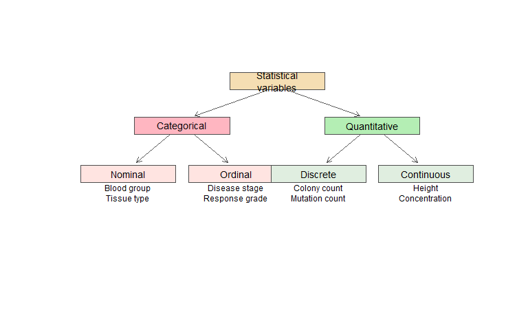
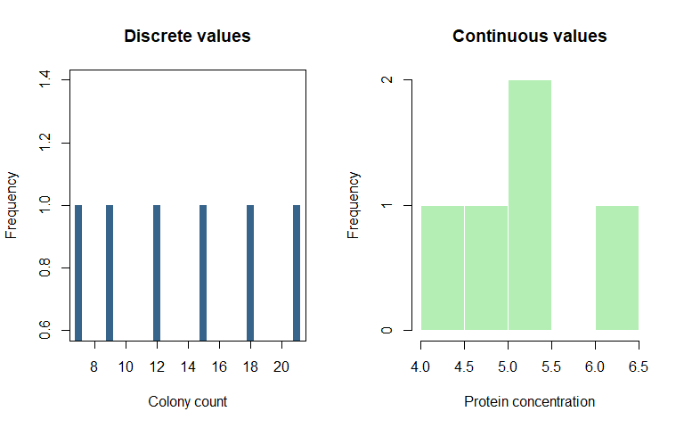
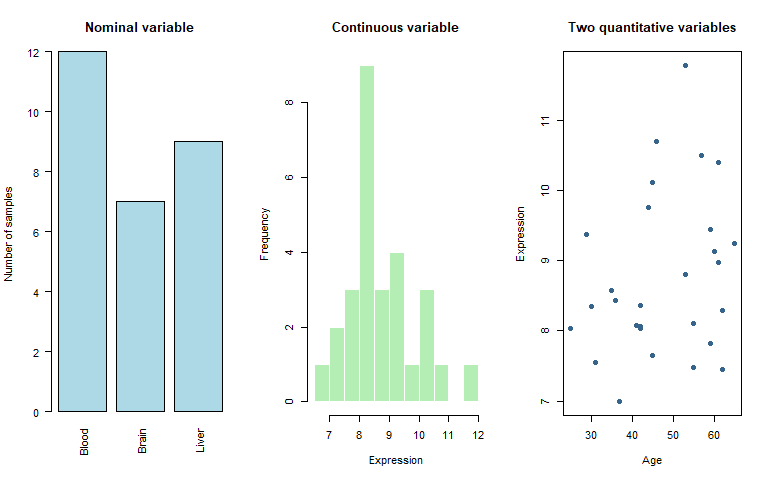
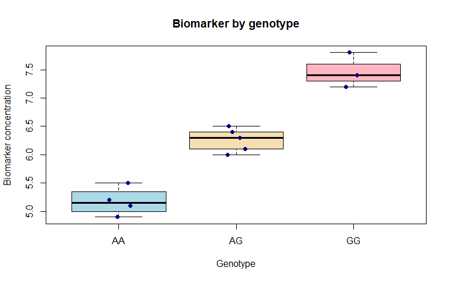

Chapter 3: Variables and Measurement Scales
================
Sandeep Singh

- [1. Introduction](#1-introduction)
- [2. Learning Objectives](#2-learning-objectives)
- [3. What Is a Variable?](#3-what-is-a-variable)
  - [3.1 Variable versus value](#31-variable-versus-value)
  - [3.2 A constant is not varying in the observed
    data](#32-a-constant-is-not-varying-in-the-observed-data)
- [4. The Two Broad Families of
  Variables](#4-the-two-broad-families-of-variables)
- [5. Categorical Variables](#5-categorical-variables)
  - [5.1 Numerical codes can still represent
    categories](#51-numerical-codes-can-still-represent-categories)
- [6. Nominal Variables](#6-nominal-variables)
  - [6.1 Binary nominal variables](#61-binary-nominal-variables)
  - [6.2 Representing nominal variables in
    R](#62-representing-nominal-variables-in-r)
- [7. Ordinal Variables](#7-ordinal-variables)
  - [7.1 Creating an ordered factor in
    R](#71-creating-an-ordered-factor-in-r)
  - [7.2 Why coding order matters](#72-why-coding-order-matters)
- [8. Quantitative Variables](#8-quantitative-variables)
- [9. Discrete Variables](#9-discrete-variables)
  - [9.1 Count variables have special statistical
    behaviour](#91-count-variables-have-special-statistical-behaviour)
  - [9.2 A count vector in R](#92-a-count-vector-in-r)
- [10. Continuous Variables](#10-continuous-variables)
  - [10.1 Measurement precision](#101-measurement-precision)
  - [10.2 A continuous vector in R](#102-a-continuous-vector-in-r)
- [11. Discrete Versus Continuous: A Visual
  Comparison](#11-discrete-versus-continuous-a-visual-comparison)
- [12. Levels of Measurement](#12-levels-of-measurement)
- [13. Nominal Scale](#13-nominal-scale)
- [14. Ordinal Scale](#14-ordinal-scale)
- [15. Interval Scale](#15-interval-scale)
- [16. Ratio Scale](#16-ratio-scale)
- [17. Variable Type and Measurement Scale Are Related but
  Different](#17-variable-type-and-measurement-scale-are-related-but-different)
- [18. Identifiers Are Labels, Not
  Measurements](#18-identifiers-are-labels-not-measurements)
- [19. Special Outcome Types in
  Biostatistics](#19-special-outcome-types-in-biostatistics)
  - [19.1 Continuous outcome](#191-continuous-outcome)
  - [19.2 Binary outcome](#192-binary-outcome)
  - [19.3 Multicategory nominal
    outcome](#193-multicategory-nominal-outcome)
  - [19.4 Ordinal outcome](#194-ordinal-outcome)
  - [19.5 Count outcome](#195-count-outcome)
  - [19.6 Time-to-event outcome](#196-time-to-event-outcome)
- [20. A Variable’s Role in a Study](#20-a-variables-role-in-a-study)
  - [20.1 Outcome](#201-outcome)
  - [20.2 Predictor](#202-predictor)
  - [20.3 Exposure](#203-exposure)
  - [20.4 Covariate](#204-covariate)
  - [20.5 Example](#205-example)
- [21. Confounders and Effect
  Modifiers](#21-confounders-and-effect-modifiers)
  - [21.1 Confounder](#211-confounder)
  - [21.2 Effect modifier](#212-effect-modifier)
- [22. Statistical Meaning Versus R Storage
  Type](#22-statistical-meaning-versus-r-storage-type)
  - [22.1 Correcting representation in
    R](#221-correcting-representation-in-r)
- [23. Genetic Variables](#23-genetic-variables)
  - [23.1 Genotype as a nominal
    category](#231-genotype-as-a-nominal-category)
  - [23.2 Genotype as allele dosage](#232-genotype-as-allele-dosage)
  - [23.3 Imputed dosage](#233-imputed-dosage)
  - [23.4 Other genetic variables](#234-other-genetic-variables)
- [24. Bioinformatics and Omics
  Variables](#24-bioinformatics-and-omics-variables)
  - [24.1 Raw RNA-seq counts](#241-raw-rna-seq-counts)
  - [24.2 Normalized expression](#242-normalized-expression)
  - [24.3 Variant annotations](#243-variant-annotations)
  - [24.4 Quality-control variables](#244-quality-control-variables)
- [25. Proportions, Percentages and
  Rates](#25-proportions-percentages-and-rates)
  - [25.1 Proportion](#251-proportion)
  - [25.2 Percentage](#252-percentage)
  - [25.3 Rate](#253-rate)
- [26. Dates, Time and Repeated
  Measurements](#26-dates-time-and-repeated-measurements)
  - [26.1 Repeated measurements](#261-repeated-measurements)
- [27. Choosing Summaries Based on Variable
  Type](#27-choosing-summaries-based-on-variable-type)
  - [27.1 One dataset, different
    summaries](#271-one-dataset-different-summaries)
- [28. Choosing Figures Based on Variable
  Type](#28-choosing-figures-based-on-variable-type)
- [29. Units and Transformations](#29-units-and-transformations)
  - [29.1 Store units in metadata, not inside every numeric
    cell](#291-store-units-in-metadata-not-inside-every-numeric-cell)
  - [29.2 Transformations change
    scale](#292-transformations-change-scale)
- [30. Missing Values and Special
  Codes](#30-missing-values-and-special-codes)
  - [30.1 Missingness should not become a category
    accidentally](#301-missingness-should-not-become-a-category-accidentally)
- [31. Build a Data Dictionary Before
  Analysis](#31-build-a-data-dictionary-before-analysis)
- [32. Integrated Case Study: A Small Pharmacogenomic
  Dataset](#32-integrated-case-study-a-small-pharmacogenomic-dataset)
  - [32.1 Inspect the imported-style
    structure](#321-inspect-the-imported-style-structure)
  - [32.2 Correct the R
    representations](#322-correct-the-r-representations)
  - [32.3 Derive G-allele dosage](#323-derive-g-allele-dosage)
  - [32.4 Summarize variables
    appropriately](#324-summarize-variables-appropriately)
  - [32.5 Visualize genotype and
    biomarker](#325-visualize-genotype-and-biomarker)
  - [32.6 Identify variable roles for one
    question](#326-identify-variable-roles-for-one-question)
- [33. Common Beginner Mistakes](#33-common-beginner-mistakes)
  - [Mistake 1: Treating every number as
    quantitative](#mistake-1-treating-every-number-as-quantitative)
  - [Mistake 2: Treating ordered categories as equally
    spaced](#mistake-2-treating-ordered-categories-as-equally-spaced)
  - [Mistake 3: Confusing integer storage with count
    data](#mistake-3-confusing-integer-storage-with-count-data)
  - [Mistake 4: Ignoring units](#mistake-4-ignoring-units)
  - [Mistake 5: Treating normalized expression as raw count
    data](#mistake-5-treating-normalized-expression-as-raw-count-data)
  - [Mistake 6: Assuming genotype codes prove a genetic
    model](#mistake-6-assuming-genotype-codes-prove-a-genetic-model)
  - [Mistake 7: Using alphabetical order for ordinal
    categories](#mistake-7-using-alphabetical-order-for-ordinal-categories)
  - [Mistake 8: Treating a missing-value code as a real
    measurement](#mistake-8-treating-a-missing-value-code-as-a-real-measurement)
  - [Mistake 9: Treating zero as automatically
    missing](#mistake-9-treating-zero-as-automatically-missing)
  - [Mistake 10: Selecting a statistical test before identifying the
    outcome
    type](#mistake-10-selecting-a-statistical-test-before-identifying-the-outcome-type)
- [34. Chapter Summary](#34-chapter-summary)
- [35. Check Your Understanding](#35-check-your-understanding)
  - [Question 1](#question-1)
  - [Question 2](#question-2)
  - [Question 3](#question-3)
  - [Question 4](#question-4)
  - [Question 5](#question-5)
  - [Question 6](#question-6)
  - [Question 7](#question-7)
  - [Question 8](#question-8)
  - [Question 9](#question-9)
- [36. Practice with R](#36-practice-with-r)
  - [Exercise 1: Correct variable
    representations](#exercise-1-correct-variable-representations)
  - [Exercise 2: Classify genetic
    variables](#exercise-2-classify-genetic-variables)
  - [Exercise 3: Summaries by variable
    type](#exercise-3-summaries-by-variable-type)
  - [Exercise 4: Identify variable
    roles](#exercise-4-identify-variable-roles)
  - [Exercise 5: Interpret coding
    decisions](#exercise-5-interpret-coding-decisions)
- [37. Mini-Project: Create a Biological Data
  Dictionary](#37-mini-project-create-a-biological-data-dictionary)
- [38. Glossary](#38-glossary)
- [39. References and Further
  Reading](#39-references-and-further-reading)
- [40. Reproducibility Information](#40-reproducibility-information)

# 1. Introduction

Before calculating a mean, drawing a graph or selecting a statistical
test, we must understand what each variable represents.

Consider the following biological measurements:

- blood group;
- disease severity;
- patient age;
- number of bacterial colonies;
- genotype;
- RNA-sequencing read count; and
- time until disease recurrence.

These variables do not contain the same kind of information. A method
suitable for age may be inappropriate for blood group. A graph suitable
for gene-expression counts may be misleading for disease stage.

This leads to a fundamental rule:

> **The meaning of a variable should determine how it is summarized,
> visualized and analysed.**

In this chapter, we will classify biological variables, represent them
correctly in R and connect variable type with later statistical
decisions.

------------------------------------------------------------------------

# 2. Learning Objectives

After completing this chapter, you should be able to:

1.  explain what a statistical variable represents;
2.  distinguish categorical and quantitative variables;
3.  distinguish nominal and ordinal variables;
4.  distinguish discrete and continuous variables;
5.  explain nominal, ordinal, interval and ratio measurement scales;
6.  identify binary, count and time-to-event outcomes;
7.  distinguish outcome, predictor, exposure and covariate roles;
8.  explain confounding and effect modification at an introductory
    level;
9.  classify common genetic, genomic and bioinformatics variables;
10. distinguish statistical meaning from R storage type;
11. code categorical and ordered variables correctly in R;
12. select suitable summaries and figures based on variable type; and
13. create a data dictionary for a biological dataset.

------------------------------------------------------------------------

# 3. What Is a Variable?

A **variable** is a characteristic that can differ across observations
or measurement occasions.

Examples include:

- age differing among patients;
- height differing among plants;
- genotype differing among individuals;
- expression differing among tissue samples;
- colony count differing among culture plates; and
- blood pressure changing across follow-up visits.

## 3.1 Variable versus value

Consider three biological samples:

``` r
sample_data <- data.frame(
  sample_id = c("S01", "S02", "S03"),
  tissue = c("Blood", "Liver", "Blood"),
  expression = c(8.2, 10.5, 7.9),
  qc_pass = c(TRUE, TRUE, FALSE),
  stringsAsFactors = FALSE
)

print(sample_data)
```

    ##   sample_id tissue expression qc_pass
    ## 1       S01  Blood        8.2    TRUE
    ## 2       S02  Liver       10.5    TRUE
    ## 3       S03  Blood        7.9   FALSE

In this dataset:

- `tissue` is a variable;
- `Blood` is one possible value of `tissue`;
- `expression` is a variable; and
- `8.2` is one observed expression value.

## 3.2 A constant is not varying in the observed data

If every sample was sequenced using the same instrument, the instrument
does not vary within that dataset. It may still be important metadata,
but it cannot explain differences among those particular samples.

Whether something is a variable therefore depends partly on the dataset
and study design.

------------------------------------------------------------------------

# 4. The Two Broad Families of Variables

Variables are commonly divided into two broad families:

1.  **categorical variables**, which describe groups or labels; and
2.  **quantitative variables**, which express numerical amounts.

``` r
plot.new()
plot.window(xlim = c(0, 10), ylim = c(0, 10))

draw_box <- function(x, y, label, width = 2.3, height = 0.9,
                     colour = "lightblue") {
  rect(
    xleft = x - width / 2,
    ybottom = y - height / 2,
    xright = x + width / 2,
    ytop = y + height / 2,
    col = colour,
    border = "gray30",
    lwd = 1.5
  )
  text(x, y, labels = label, cex = 0.9)
}

draw_arrow <- function(x0, y0, x1, y1) {
  arrows(
    x0 = x0,
    y0 = y0,
    x1 = x1,
    y1 = y1,
    length = 0.08,
    lwd = 1.4,
    col = "gray35"
  )
}

draw_box(5.0, 9.0, "Statistical\nvariables", colour = "wheat")
draw_box(2.7, 6.7, "Categorical", colour = "lightpink")
draw_box(7.3, 6.7, "Quantitative", colour = "darkseagreen2")
draw_box(1.4, 4.2, "Nominal", colour = "mistyrose")
draw_box(4.0, 4.2, "Ordinal", colour = "mistyrose")
draw_box(6.0, 4.2, "Discrete", colour = "honeydew2")
draw_box(8.6, 4.2, "Continuous", colour = "honeydew2")

draw_arrow(4.7, 8.5, 3.0, 7.2)
draw_arrow(5.3, 8.5, 7.0, 7.2)
draw_arrow(2.4, 6.2, 1.6, 4.8)
draw_arrow(3.0, 6.2, 3.8, 4.8)
draw_arrow(7.0, 6.2, 6.2, 4.8)
draw_arrow(7.6, 6.2, 8.4, 4.8)

text(1.4, 3.25, "Blood group\nTissue type", cex = 0.78)
text(4.0, 3.25, "Disease stage\nResponse grade", cex = 0.78)
text(6.0, 3.25, "Colony count\nMutation count", cex = 0.78)
text(8.6, 3.25, "Height\nConcentration", cex = 0.78)
```

<div class="figure" style="text-align: center">


<p class="caption">

A basic classification of statistical variables. Binary and count
variables are discussed separately because they are especially important
in biostatistics.
</p>

</div>

This classification is useful, but real biological variables sometimes
require more careful thought. For example, a genotype can be treated as
a category or encoded as allele dosage for a specific genetic model.

------------------------------------------------------------------------

# 5. Categorical Variables

A **categorical variable** places observations into groups or
categories.

Examples include:

- tissue type;
- disease status;
- treatment group;
- blood group;
- bacterial species;
- smoking status; and
- genotype category.

Categorical values may be written as text or numerical codes. The codes
do not automatically make the variable quantitative.

## 5.1 Numerical codes can still represent categories

Suppose blood groups are coded as:

- 1 = A;
- 2 = B;
- 3 = AB; and
- 4 = O.

Calculating the mean of 1, 2, 3 and 4 would not produce a meaningful
“average blood group.” The numbers are only labels.

> **A variable is not quantitative merely because it is stored using
> numbers.**

------------------------------------------------------------------------

# 6. Nominal Variables

A **nominal variable** contains categories that do not have a natural
order.

Examples include:

- blood group: A, B, AB, O;
- tissue type: blood, liver, brain;
- bacterial species;
- treatment group;
- genotype categories such as AA, AG and GG; and
- study centre.

We can ask whether two observations belong to the same category, but we
cannot say that one category is greater than another.

## 6.1 Binary nominal variables

A categorical variable with exactly two categories is called **binary**
or **dichotomous**.

Examples include:

- disease present or absent;
- treatment responder or non-responder;
- mutation detected or not detected;
- sample passed or failed quality control; and
- event occurred or censored.

Binary variables are particularly important because they are analysed
using methods such as proportion tests and logistic regression.

## 6.2 Representing nominal variables in R

``` r
tissue <- factor(
  c("Blood", "Liver", "Brain", "Blood", "Liver")
)

tissue
```

    ## [1] Blood Liver Brain Blood Liver
    ## Levels: Blood Brain Liver

``` r
levels(tissue)
```

    ## [1] "Blood" "Brain" "Liver"

``` r
table(tissue)
```

    ## tissue
    ## Blood Brain Liver 
    ##     2     1     2

The order in which factor levels are displayed does not imply a
scientific ranking.

------------------------------------------------------------------------

# 7. Ordinal Variables

An **ordinal variable** contains categories with a meaningful order.

Examples include:

- disease stage I, II, III and IV;
- pain severity: mild, moderate and severe;
- treatment response: none, partial and complete;
- tumour grade; and
- sequencing-quality category: poor, acceptable and good.

The categories can be ranked, but the distances between them are not
assumed to be equal.

The difference between `Mild` and `Moderate` is not necessarily the same
as the difference between `Moderate` and `Severe`.

## 7.1 Creating an ordered factor in R

``` r
disease_stage <- factor(
  c("Stage II", "Stage I", "Stage III", "Stage II"),
  levels = c("Stage I", "Stage II", "Stage III", "Stage IV"),
  ordered = TRUE
)

disease_stage
```

    ## [1] Stage II  Stage I   Stage III Stage II 
    ## Levels: Stage I < Stage II < Stage III < Stage IV

``` r
levels(disease_stage)
```

    ## [1] "Stage I"   "Stage II"  "Stage III" "Stage IV"

Specifying the levels prevents R from arranging them alphabetically.

## 7.2 Why coding order matters

Incorrect:

``` r
factor(c("Low", "High", "Medium"))
```

    ## [1] Low    High   Medium
    ## Levels: High Low Medium

R uses alphabetical level order unless told otherwise.

Correct:

``` r
factor(
  c("Low", "High", "Medium"),
  levels = c("Low", "Medium", "High"),
  ordered = TRUE
)
```

    ## [1] Low    High   Medium
    ## Levels: Low < Medium < High

------------------------------------------------------------------------

# 8. Quantitative Variables

A **quantitative variable** represents a numerical amount for which
arithmetic has scientific meaning.

Examples include:

- age;
- height;
- body mass;
- glucose concentration;
- number of bacterial colonies;
- sequencing depth; and
- time to disease recurrence.

Quantitative variables are often divided into **discrete** and
**continuous** variables.

------------------------------------------------------------------------

# 9. Discrete Variables

A **discrete variable** takes separate, countable values.

Count variables are the most common discrete variables in biology.

Examples include:

- number of bacterial colonies;
- number of mutations;
- number of hospital admissions;
- number of treatment responses;
- number of sequencing reads assigned to a gene; and
- number of effect alleles: 0, 1 or 2.

Values between adjacent counts are not possible. A culture plate can
have 20 or 21 colonies, but not 20.4 colonies.

## 9.1 Count variables have special statistical behaviour

Counts are often:

- non-negative;
- right-skewed;
- dominated by small values;
- affected by exposure time or sequencing depth; and
- more variable than expected under a simple Poisson model.

Therefore, counts may require Poisson or negative-binomial methods
rather than methods designed for normally distributed continuous
measurements.

## 9.2 A count vector in R

``` r
colony_count <- c(12L, 18L, 7L, 21L, 15L, 9L)

colony_count
```

    ## [1] 12 18  7 21 15  9

``` r
typeof(colony_count)
```

    ## [1] "integer"

``` r
mean(colony_count)
```

    ## [1] 13.66667

``` r
var(colony_count)
```

    ## [1] 28.66667

The statistical meaning comes from the fact that these values count
colonies. The R storage type `integer` is helpful but is not the
complete statistical description.

------------------------------------------------------------------------

# 10. Continuous Variables

A **continuous variable** can, in principle, take any value within a
range.

Examples include:

- height;
- body mass;
- blood pressure;
- temperature;
- time;
- biomarker concentration; and
- normalized gene-expression measurements.

A person’s measured height may be recorded as 170 cm, 170.2 cm or 170.24
cm depending on instrument precision.

## 10.1 Measurement precision

Continuous variables appear rounded in datasets because instruments have
limited precision.

A laboratory value recorded to one decimal place is still conceptually
continuous even though only certain displayed values appear in the file.

## 10.2 A continuous vector in R

``` r
protein_concentration <- c(4.21, 5.18, 4.76, 6.02, 5.44)

protein_concentration
```

    ## [1] 4.21 5.18 4.76 6.02 5.44

``` r
typeof(protein_concentration)
```

    ## [1] "double"

------------------------------------------------------------------------

# 11. Discrete Versus Continuous: A Visual Comparison

``` r
colony_frequency <- table(colony_count)

par(mfrow = c(1, 2))

plot(
  x = as.numeric(names(colony_frequency)),
  y = as.numeric(colony_frequency),
  type = "h",
  lwd = 8,
  lend = 1,
  col = "steelblue4",
  xlab = "Colony count",
  ylab = "Frequency",
  main = "Discrete values"
)

hist(
  protein_concentration,
  breaks = 5,
  col = "darkseagreen2",
  border = "white",
  xlab = "Protein concentration",
  main = "Continuous values"
)
```

<div class="figure" style="text-align: center">


<p class="caption">

Discrete colony counts and continuous protein concentrations require
different graphical representations.
</p>

</div>

``` r
par(mfrow = c(1, 1))
```

The left panel displays frequencies at distinct counts. The right panel
groups continuous measurements into intervals.

------------------------------------------------------------------------

# 12. Levels of Measurement

Another classification describes what comparisons and mathematical
operations are meaningful.

The four traditional measurement scales are:

1.  nominal;
2.  ordinal;
3.  interval; and
4.  ratio.

These levels were formalized by S. S. Stevens in 1946. They are useful
teaching tools, although real scientific measurements sometimes do not
fit perfectly into a single category.

| Scale    | Ordered? | Equal intervals? | Meaningful true zero? | Example           |
|----------|---------:|-----------------:|----------------------:|-------------------|
| Nominal  |       No |               No |                    No | Blood group       |
| Ordinal  |      Yes |      Not assumed |                    No | Disease stage     |
| Interval |      Yes |              Yes |                    No | Temperature in °C |
| Ratio    |      Yes |              Yes |                   Yes | Body mass         |

------------------------------------------------------------------------

# 13. Nominal Scale

The nominal scale identifies categories without ranking them.

Permitted interpretations include:

- same category;
- different category;
- frequency; and
- proportion.

Appropriate summaries include counts, percentages and the mode.

The mean and standard deviation are not meaningful for category codes.

------------------------------------------------------------------------

# 14. Ordinal Scale

The ordinal scale ranks categories but does not guarantee equal
distances.

Appropriate summaries may include:

- counts and percentages;
- median category;
- cumulative proportions; and
- selected rank-based methods.

Whether means should be reported for ordinal scores depends on the
measurement instrument, assumptions and scientific convention. The
underlying category structure should never be forgotten.

------------------------------------------------------------------------

# 15. Interval Scale

An interval-scale variable has ordered values with equal numerical
intervals but no meaningful absolute zero.

The standard example is temperature in degrees Celsius.

The difference between 20°C and 30°C equals the difference between 30°C
and 40°C. However, 40°C is not “twice as hot” as 20°C because 0°C is not
the complete absence of thermal energy.

For interval variables:

- addition and subtraction are meaningful;
- means and standard deviations can be meaningful; but
- ratios should not be interpreted literally.

------------------------------------------------------------------------

# 16. Ratio Scale

A ratio-scale variable has:

- ordered values;
- equal intervals; and
- a meaningful zero representing absence of the measured quantity.

Examples include:

- body mass;
- height or length;
- elapsed time;
- concentration when zero represents none detected under the measurement
  definition;
- colony count; and
- read count.

If one DNA fragment is 1,000 base pairs and another is 500 base pairs,
the first is twice as long as the second.

Ratio interpretations require scientifically valid measurements. A zero
produced by a detection limit or processing rule may not represent
complete biological absence.

------------------------------------------------------------------------

# 17. Variable Type and Measurement Scale Are Related but Different

The terms are sometimes mixed together, so it helps to separate them.

| Question | Classification |
|----|----|
| Does the variable contain categories or numerical amounts? | Categorical versus quantitative |
| If categorical, do categories have an order? | Nominal versus ordinal |
| If quantitative, are possible values countable or continuous? | Discrete versus continuous |
| Which comparisons and arithmetic operations are meaningful? | Nominal, ordinal, interval or ratio scale |

Examples:

| Variable          | Broad type   | More specific type | Measurement scale |
|-------------------|--------------|--------------------|-------------------|
| Blood group       | Categorical  | Nominal            | Nominal           |
| Disease stage     | Categorical  | Ordinal            | Ordinal           |
| Temperature in °C | Quantitative | Continuous         | Interval          |
| Colony count      | Quantitative | Discrete count     | Ratio             |
| Body mass         | Quantitative | Continuous         | Ratio             |

------------------------------------------------------------------------

# 18. Identifiers Are Labels, Not Measurements

Identifiers may look numerical but should not be analysed as quantities.

Examples include:

- patient ID `10025`;
- sample ID `2048`;
- chromosome labels;
- postal codes; and
- database record numbers.

``` r
patient_id <- c("1001", "1002", "1003")
```

Storing identifiers as character data helps prevent accidental
calculations such as a meaningless mean patient ID.

Identifiers should generally be unique, stable and free of personally
identifying information in analytical datasets.

------------------------------------------------------------------------

# 19. Special Outcome Types in Biostatistics

The outcome type strongly influences the statistical method.

## 19.1 Continuous outcome

Examples:

- blood pressure;
- plant height;
- biomarker concentration; and
- normalized expression.

## 19.2 Binary outcome

Examples:

- disease present or absent;
- responder or non-responder; and
- sample passed or failed.

## 19.3 Multicategory nominal outcome

Examples:

- disease subtype A, B or C;
- tissue of origin; and
- bacterial species.

## 19.4 Ordinal outcome

Examples:

- mild, moderate or severe disease;
- tumour stage; and
- ordered treatment response.

## 19.5 Count outcome

Examples:

- mutation count;
- colony count;
- number of hospital admissions; and
- RNA-seq read count.

## 19.6 Time-to-event outcome

A time-to-event outcome contains at least two pieces of information:

1.  follow-up time; and
2.  whether the event occurred.

``` r
survival_data <- data.frame(
  patient_id = c("P01", "P02", "P03", "P04"),
  follow_up_months = c(8, 12, 6, 15),
  event = c(1, 0, 1, 0)
)

print(survival_data)
```

    ##   patient_id follow_up_months event
    ## 1        P01                8     1
    ## 2        P02               12     0
    ## 3        P03                6     1
    ## 4        P04               15     0

Here, `event = 1` means the event occurred and `event = 0` means the
observation was censored. The zero does not mean zero follow-up or “no
patient.”

Time-to-event data require special methods because not every participant
experiences the event during observation.

------------------------------------------------------------------------

# 20. A Variable’s Role in a Study

Variable **type** describes the form of information. Variable **role**
describes how it is used in a particular research question.

The same variable may have different roles in different studies.

## 20.1 Outcome

The **outcome** is the main variable being explained, compared or
predicted.

Examples include disease status, blood pressure, expression level and
survival time.

## 20.2 Predictor

A **predictor** is a variable used to explain or predict the outcome.

Examples include age, treatment, genotype and environmental exposure.

## 20.3 Exposure

An **exposure** is a predictor representing a condition, behaviour,
intervention or environmental factor of scientific interest.

Examples include smoking, drug treatment, radiation exposure and diet.

## 20.4 Covariate

A **covariate** is an additional variable included in an analysis
because it may explain variation, improve precision or help address
confounding.

Examples include age, sex, study centre, experimental batch and genetic
principal components.

## 20.5 Example

Research question:

> Is CYP2C19 metabolizer status associated with response to clopidogrel
> after accounting for age and sex?

| Variable | Role | Type |
|----|----|----|
| Treatment response | Outcome | Binary or another defined response type |
| CYP2C19 metabolizer status | Main predictor | Categorical ordinal/nominal depending analysis |
| Age | Covariate | Quantitative continuous |
| Sex variable | Covariate | Categorical nominal |

The exact coding and interpretation must be defined before analysis.

------------------------------------------------------------------------

# 21. Confounders and Effect Modifiers

These concepts will be developed in later chapters, but beginners should
recognize the distinction.

## 21.1 Confounder

A **confounder** is a variable that can distort the estimated
relationship between an exposure and an outcome.

In a causal interpretation, a confounder is commonly a cause of, or
otherwise precedes, both the exposure and outcome. It should not be a
consequence of the exposure.

Example:

Suppose older patients are more likely to receive one treatment and are
also more likely to experience the outcome. Age may confound the
observed treatment–outcome association.

Not every variable associated with both exposure and outcome should
automatically be adjusted for. Study design and causal reasoning are
required.

## 21.2 Effect modifier

An **effect modifier** is a variable across whose levels the
exposure–outcome association differs.

Example:

A drug may reduce blood pressure more strongly in one age group than
another. Age may modify the treatment effect.

Confounding is generally something we try to control when estimating an
effect. Effect modification is usually a scientific result to describe
and interpret.

------------------------------------------------------------------------

# 22. Statistical Meaning Versus R Storage Type

This is a crucial distinction.

R may store an object as:

- `numeric`;
- `integer`;
- `character`;
- `logical`; or
- `factor`.

Biostatistics classifies a variable according to what it means
scientifically.

``` r
example_data <- data.frame(
  patient_id = c(1001, 1002, 1003),
  disease_code = c(0, 1, 1),
  disease_stage = c("II", "I", "III"),
  biomarker = c(5.2, 6.1, 5.8)
)

str(example_data)
```

    ## 'data.frame':    3 obs. of  4 variables:
    ##  $ patient_id   : num  1001 1002 1003
    ##  $ disease_code : num  0 1 1
    ##  $ disease_stage: chr  "II" "I" "III"
    ##  $ biomarker    : num  5.2 6.1 5.8

R stores `patient_id` and `disease_code` numerically. Statistically:

- `patient_id` is an identifier;
- `disease_code` is binary categorical; and
- `biomarker` is quantitative continuous.

## 22.1 Correcting representation in R

``` r
example_data$patient_id <-
  as.character(example_data$patient_id)

example_data$disease_code <- factor(
  example_data$disease_code,
  levels = c(0, 1),
  labels = c("Absent", "Present")
)

example_data$disease_stage <- factor(
  example_data$disease_stage,
  levels = c("I", "II", "III", "IV"),
  ordered = TRUE
)

str(example_data)
```

    ## 'data.frame':    3 obs. of  4 variables:
    ##  $ patient_id   : chr  "1001" "1002" "1003"
    ##  $ disease_code : Factor w/ 2 levels "Absent","Present": 1 2 2
    ##  $ disease_stage: Ord.factor w/ 4 levels "I"<"II"<"III"<..: 2 1 3
    ##  $ biomarker    : num  5.2 6.1 5.8

Correct representation helps R produce suitable summaries and model
interpretations.

------------------------------------------------------------------------

# 23. Genetic Variables

Genetic data illustrate why variable classification depends on the
analytical question.

## 23.1 Genotype as a nominal category

For a variant with alleles A and G, genotypes may be:

- AA;
- AG; and
- GG.

As labels, these are nominal categories.

``` r
genotype <- factor(
  c("AA", "AG", "GG", "AG", "AA"),
  levels = c("AA", "AG", "GG")
)

table(genotype)
```

    ## genotype
    ## AA AG GG 
    ##  2  2  1

## 23.2 Genotype as allele dosage

Under an additive genetic model, the number of G alleles can be coded
as:

- AA = 0;
- AG = 1; and
- GG = 2.

``` r
allele_dosage <- c(0, 1, 2, 1, 0)
allele_dosage
```

    ## [1] 0 1 2 1 0

This encoding represents a particular model: each additional effect
allele is assumed to contribute a constant change on the model’s chosen
scale.

The coding does not prove that the biological effect is additive.

## 23.3 Imputed dosage

Imputed allele dosage may contain values such as 0.08, 0.94 or 1.87
because it represents an expected allele count under genotype
uncertainty.

``` r
imputed_dosage <- c(0.08, 0.94, 1.87, 1.12)
```

It is stored as continuous numeric data, but its meaning remains
expected allele dosage bounded approximately between 0 and 2.

## 23.4 Other genetic variables

| Variable | Common statistical form |
|----|----|
| Genotype label | Nominal categorical |
| Allele dosage | Quantitative predictor under a specified model |
| Minor allele count | Discrete count |
| Minor allele frequency | Proportion between 0 and 1 |
| Case-control status | Binary categorical |
| Quantitative phenotype | Often continuous |
| Genetic principal component | Continuous covariate |
| Family ID | Nominal cluster identifier |

------------------------------------------------------------------------

# 24. Bioinformatics and Omics Variables

## 24.1 Raw RNA-seq counts

Raw RNA-seq expression values are counts of reads or fragments assigned
to features.

They are:

- discrete;
- non-negative;
- influenced by library size; and
- commonly overdispersed.

They should not automatically be analysed as normally distributed
continuous measurements.

## 24.2 Normalized expression

Normalized expression measures such as counts per million, transcripts
per million or transformed values may be stored as continuous numbers.

However, normalization changes the scale and interpretation. Different
methods serve different purposes, and normalized values are not
interchangeable with raw counts.

## 24.3 Variant annotations

| Annotation | Variable type |
|----|----|
| Chromosome | Nominal label |
| Genomic position | Quantitative coordinate |
| Reference/alternate allele | Nominal category |
| Functional consequence | Nominal category |
| Pathogenicity category | Often ordinal or nominal depending definition |
| Allele frequency | Proportion |
| CADD-like score | Quantitative score whose scale requires documentation |

## 24.4 Quality-control variables

| QC variable            | Variable type                             |
|------------------------|-------------------------------------------|
| Total read count       | Discrete count                            |
| Mapping rate           | Proportion                                |
| Contamination estimate | Proportion                                |
| Pass/fail status       | Binary categorical                        |
| Sequencing batch       | Nominal categorical                       |
| Mean coverage          | Quantitative, often treated as continuous |

The meaning, unit and processing history should be recorded in a data
dictionary.

------------------------------------------------------------------------

# 25. Proportions, Percentages and Rates

These quantities are related but should not be confused.

## 25.1 Proportion

A proportion has a numerator contained within its denominator.

``` r
responders <- 18
total_patients <- 24

response_proportion <- responders / total_patients
response_proportion
```

    ## [1] 0.75

## 25.2 Percentage

A percentage is a proportion multiplied by 100.

``` r
response_percentage <- 100 * response_proportion
response_percentage
```

    ## [1] 75

## 25.3 Rate

A rate includes an amount of time, person-time, area, sequence length or
another exposure unit.

Examples include:

- infections per 1,000 person-days;
- mutations per megabase; and
- sequencing errors per million bases.

Rates can exceed 1, whereas proportions must lie between 0 and 1.

------------------------------------------------------------------------

# 26. Dates, Time and Repeated Measurements

Calendar dates and elapsed times are different.

``` r
collection_date <- as.Date(
  c("2026-01-10", "2026-01-15", "2026-01-20")
)

collection_date
```

    ## [1] "2026-01-10" "2026-01-15" "2026-01-20"

``` r
collection_date[3] - collection_date[1]
```

    ## Time difference of 10 days

The difference between dates produces elapsed time.

## 26.1 Repeated measurements

If the same patient is measured at baseline, month 3 and month 6, the
observations are not independent.

A repeated-measures dataset normally needs:

- subject identifier;
- time variable;
- outcome measurement; and
- relevant treatment or exposure variables.

``` r
repeated_data <- data.frame(
  patient_id = rep(c("P01", "P02"), each = 3),
  visit_month = rep(c(0, 3, 6), times = 2),
  biomarker = c(8.2, 7.6, 7.1, 9.1, 8.7, 8.4)
)

print(repeated_data)
```

    ##   patient_id visit_month biomarker
    ## 1        P01           0       8.2
    ## 2        P01           3       7.6
    ## 3        P01           6       7.1
    ## 4        P02           0       9.1
    ## 5        P02           3       8.7
    ## 6        P02           6       8.4

The patient identifier is nominal, visit month is quantitative time, and
biomarker is a continuous outcome.

------------------------------------------------------------------------

# 27. Choosing Summaries Based on Variable Type

| Variable type | Common summaries | Common displays |
|----|----|----|
| Nominal categorical | Count, proportion, percentage, mode | Bar chart |
| Ordinal categorical | Count, cumulative proportion, median category | Ordered bar chart |
| Continuous, approximately symmetric | Mean, standard deviation | Histogram, density plot, boxplot |
| Continuous, skewed | Median, interquartile range | Histogram, boxplot, violin plot |
| Count | Count distribution, mean, variance, rate if exposure applies | Bar chart, histogram |
| Binary | Number and proportion in each category | Bar chart |
| Time-to-event | Events, follow-up distribution, survival estimates | Kaplan–Meier curve |

This is a starting guide, not a mechanical rule. Distribution shape,
study design and scientific purpose also matter.

## 27.1 One dataset, different summaries

``` r
teaching_data <- data.frame(
  tissue = factor(c("Blood", "Blood", "Liver", "Brain", "Liver", "Blood")),
  stage = factor(
    c("I", "II", "II", "III", "I", "II"),
    levels = c("I", "II", "III", "IV"),
    ordered = TRUE
  ),
  age = c(34, 51, 46, 62, 40, 55),
  mutation_count = c(2L, 5L, 3L, 8L, 1L, 6L),
  response = factor(c("No", "Yes", "Yes", "No", "Yes", "Yes"))
)

table(teaching_data$tissue)
```

    ## 
    ## Blood Brain Liver 
    ##     3     1     2

``` r
table(teaching_data$stage)
```

    ## 
    ##   I  II III  IV 
    ##   2   3   1   0

``` r
mean(teaching_data$age)
```

    ## [1] 48

``` r
sd(teaching_data$age)
```

    ## [1] 10.17841

``` r
mean(teaching_data$mutation_count)
```

    ## [1] 4.166667

``` r
var(teaching_data$mutation_count)
```

    ## [1] 6.966667

``` r
prop.table(table(teaching_data$response))
```

    ## 
    ##        No       Yes 
    ## 0.3333333 0.6666667

------------------------------------------------------------------------

# 28. Choosing Figures Based on Variable Type

``` r
plot_data <- data.frame(
  tissue = factor(rep(c("Blood", "Brain", "Liver"), c(12, 7, 9))),
  expression = c(
    rnorm(12, 8.0, 0.8),
    rnorm(7, 10.0, 1.0),
    rnorm(9, 9.0, 0.9)
  ),
  age = round(runif(28, 25, 70))
)

par(mfrow = c(1, 3))

barplot(
  table(plot_data$tissue),
  col = "lightblue",
  ylab = "Number of samples",
  main = "Nominal variable",
  las = 2
)

hist(
  plot_data$expression,
  breaks = 8,
  col = "darkseagreen2",
  border = "white",
  xlab = "Expression",
  main = "Continuous variable"
)

plot(
  plot_data$age,
  plot_data$expression,
  pch = 19,
  col = "steelblue4",
  xlab = "Age",
  ylab = "Expression",
  main = "Two quantitative variables"
)
```

<div class="figure" style="text-align: center">


<p class="caption">

Different variable types require different plots: category frequencies,
a continuous distribution and the relationship between two quantitative
variables.
</p>

</div>

``` r
par(mfrow = c(1, 1))
```

Common mismatches include using a bar chart for individual continuous
values or using a histogram for unordered categories.

------------------------------------------------------------------------

# 29. Units and Transformations

A numerical value is incomplete without its unit and measurement
definition.

Compare:

- glucose = 100 mg/dL;
- glucose = 5.55 mmol/L.

The numbers differ because the units differ.

## 29.1 Store units in metadata, not inside every numeric cell

Problematic:

``` r
c("100 mg/dL", "95 mg/dL", "110 mg/dL")
```

This becomes character text.

Prefer a numeric column plus a documented unit:

``` r
glucose_mg_dl <- c(100, 95, 110)
```

The unit appears in the variable name or, preferably, in a separate data
dictionary.

## 29.2 Transformations change scale

Log transformation may make a right-skewed biological variable easier to
model.

``` r
raw_expression <- c(1, 2, 5, 10, 50, 100)
log2_expression <- log2(raw_expression + 1)

data.frame(
  raw_expression = raw_expression,
  log2_expression = round(log2_expression, 3)
)
```

<div class="kable-table">

| raw_expression | log2_expression |
|---------------:|----------------:|
|              1 |           1.000 |
|              2 |           1.585 |
|              5 |           2.585 |
|             10 |           3.459 |
|             50 |           5.672 |
|            100 |           6.658 |

</div>

The transformed variable has a different interpretation. The
transformation and any added constant must be reported.

------------------------------------------------------------------------

# 30. Missing Values and Special Codes

Missing data should be represented as `NA` in R.

Some datasets use special codes such as:

- `-9`;
- `999`;
- `Unknown`;
- an empty string; or
- a period.

These codes must be converted carefully using the data documentation.

``` r
height_cm <- c(170, 165, -9, 182, 176)

height_cm[height_cm == -9] <- NA
height_cm
```

    ## [1] 170 165  NA 182 176

Never assume that every unusual value is missing. For a temperature
measurement, `-9` may be scientifically valid.

## 30.1 Missingness should not become a category accidentally

`"Unknown"` may mean that a category was not recorded. Treating it as a
genuine biological category without justification can distort analysis.

------------------------------------------------------------------------

# 31. Build a Data Dictionary Before Analysis

A **data dictionary** documents what every variable means.

At minimum, it should contain:

- variable name;
- plain-language description;
- observational unit;
- statistical type;
- R representation;
- possible values or units;
- missing-value codes;
- derivation or calculation; and
- quality-control rules.

``` r
data_dictionary <- data.frame(
  variable = c(
    "patient_id",
    "treatment",
    "age_years",
    "disease_stage",
    "genotype",
    "read_count",
    "response"
  ),
  description = c(
    "Study-specific patient identifier",
    "Assigned treatment group",
    "Age at recruitment",
    "Clinical disease stage",
    "Observed genotype at the target variant",
    "Reads assigned to the target gene",
    "Clinical response at week 12"
  ),
  statistical_type = c(
    "Nominal identifier",
    "Nominal categorical",
    "Continuous ratio",
    "Ordinal categorical",
    "Nominal categorical",
    "Discrete count",
    "Binary categorical"
  ),
  unit_or_levels = c(
    "Unique text",
    "Control; Treatment",
    "Years",
    "I; II; III; IV",
    "AA; AG; GG",
    "Reads",
    "No; Yes"
  ),
  stringsAsFactors = FALSE
)

print(data_dictionary)
```

    ##        variable                             description    statistical_type
    ## 1    patient_id       Study-specific patient identifier  Nominal identifier
    ## 2     treatment                Assigned treatment group Nominal categorical
    ## 3     age_years                      Age at recruitment    Continuous ratio
    ## 4 disease_stage                  Clinical disease stage Ordinal categorical
    ## 5      genotype Observed genotype at the target variant Nominal categorical
    ## 6    read_count       Reads assigned to the target gene      Discrete count
    ## 7      response            Clinical response at week 12  Binary categorical
    ##       unit_or_levels
    ## 1        Unique text
    ## 2 Control; Treatment
    ## 3              Years
    ## 4     I; II; III; IV
    ## 5         AA; AG; GG
    ## 6              Reads
    ## 7            No; Yes

A data dictionary reduces ambiguity and prevents accidental misuse of
numerical codes.

------------------------------------------------------------------------

# 32. Integrated Case Study: A Small Pharmacogenomic Dataset

Consider a hypothetical study examining whether genotype is associated
with treatment response.

``` r
pgx_data <- data.frame(
  patient_id = paste0("P", sprintf("%02d", 1:12)),
  age_years = c(45, 52, 61, 39, 57, 48, 66, 42, 55, 50, 63, 46),
  sex_recorded = c(
    "Female", "Male", "Male", "Female", "Female", "Male",
    "Male", "Female", "Male", "Female", "Female", "Male"
  ),
  disease_stage = c("II", "III", "II", "I", "III", "II",
                    "III", "I", "II", "II", "III", "I"),
  genotype = c("AA", "AG", "GG", "AA", "AG", "AG",
               "GG", "AA", "AG", "AA", "GG", "AG"),
  read_depth = c(42L, 38L, 51L, 29L, 44L, 47L,
                 55L, 33L, 41L, 36L, 58L, 45L),
  biomarker = c(5.2, 6.1, 7.4, 4.9, 6.5, 6.0,
                7.8, 5.1, 6.3, 5.5, 7.2, 6.4),
  response = c("No", "Yes", "Yes", "No", "Yes", "Yes",
               "Yes", "No", "Yes", "No", "Yes", "Yes"),
  stringsAsFactors = FALSE
)

print(pgx_data)
```

    ##    patient_id age_years sex_recorded disease_stage genotype read_depth
    ## 1         P01        45       Female            II       AA         42
    ## 2         P02        52         Male           III       AG         38
    ## 3         P03        61         Male            II       GG         51
    ## 4         P04        39       Female             I       AA         29
    ## 5         P05        57       Female           III       AG         44
    ## 6         P06        48         Male            II       AG         47
    ## 7         P07        66         Male           III       GG         55
    ## 8         P08        42       Female             I       AA         33
    ## 9         P09        55         Male            II       AG         41
    ## 10        P10        50       Female            II       AA         36
    ## 11        P11        63       Female           III       GG         58
    ## 12        P12        46         Male             I       AG         45
    ##    biomarker response
    ## 1        5.2       No
    ## 2        6.1      Yes
    ## 3        7.4      Yes
    ## 4        4.9       No
    ## 5        6.5      Yes
    ## 6        6.0      Yes
    ## 7        7.8      Yes
    ## 8        5.1       No
    ## 9        6.3      Yes
    ## 10       5.5       No
    ## 11       7.2      Yes
    ## 12       6.4      Yes

## 32.1 Inspect the imported-style structure

``` r
str(pgx_data)
```

    ## 'data.frame':    12 obs. of  8 variables:
    ##  $ patient_id   : chr  "P01" "P02" "P03" "P04" ...
    ##  $ age_years    : num  45 52 61 39 57 48 66 42 55 50 ...
    ##  $ sex_recorded : chr  "Female" "Male" "Male" "Female" ...
    ##  $ disease_stage: chr  "II" "III" "II" "I" ...
    ##  $ genotype     : chr  "AA" "AG" "GG" "AA" ...
    ##  $ read_depth   : int  42 38 51 29 44 47 55 33 41 36 ...
    ##  $ biomarker    : num  5.2 6.1 7.4 4.9 6.5 6 7.8 5.1 6.3 5.5 ...
    ##  $ response     : chr  "No" "Yes" "Yes" "No" ...

Several categorical variables are currently stored as character text. We
can define them explicitly.

## 32.2 Correct the R representations

``` r
pgx_data$patient_id <- as.character(pgx_data$patient_id)

pgx_data$sex_recorded <- factor(pgx_data$sex_recorded)

pgx_data$disease_stage <- factor(
  pgx_data$disease_stage,
  levels = c("I", "II", "III", "IV"),
  ordered = TRUE
)

pgx_data$genotype <- factor(
  pgx_data$genotype,
  levels = c("AA", "AG", "GG")
)

pgx_data$response <- factor(
  pgx_data$response,
  levels = c("No", "Yes")
)

str(pgx_data)
```

    ## 'data.frame':    12 obs. of  8 variables:
    ##  $ patient_id   : chr  "P01" "P02" "P03" "P04" ...
    ##  $ age_years    : num  45 52 61 39 57 48 66 42 55 50 ...
    ##  $ sex_recorded : Factor w/ 2 levels "Female","Male": 1 2 2 1 1 2 2 1 2 1 ...
    ##  $ disease_stage: Ord.factor w/ 4 levels "I"<"II"<"III"<..: 2 3 2 1 3 2 3 1 2 2 ...
    ##  $ genotype     : Factor w/ 3 levels "AA","AG","GG": 1 2 3 1 2 2 3 1 2 1 ...
    ##  $ read_depth   : int  42 38 51 29 44 47 55 33 41 36 ...
    ##  $ biomarker    : num  5.2 6.1 7.4 4.9 6.5 6 7.8 5.1 6.3 5.5 ...
    ##  $ response     : Factor w/ 2 levels "No","Yes": 1 2 2 1 2 2 2 1 2 1 ...

## 32.3 Derive G-allele dosage

``` r
pgx_data$g_allele_dosage <-
  c(AA = 0, AG = 1, GG = 2)[as.character(pgx_data$genotype)]

print(pgx_data[, c("genotype", "g_allele_dosage")])
```

    ##    genotype g_allele_dosage
    ## 1        AA               0
    ## 2        AG               1
    ## 3        GG               2
    ## 4        AA               0
    ## 5        AG               1
    ## 6        AG               1
    ## 7        GG               2
    ## 8        AA               0
    ## 9        AG               1
    ## 10       AA               0
    ## 11       GG               2
    ## 12       AG               1

The dosage is derived from genotype using an explicitly documented
coding rule.

## 32.4 Summarize variables appropriately

``` r
table(pgx_data$sex_recorded)
```

    ## 
    ## Female   Male 
    ##      6      6

``` r
table(pgx_data$disease_stage)
```

    ## 
    ##   I  II III  IV 
    ##   3   5   4   0

``` r
table(pgx_data$genotype)
```

    ## 
    ## AA AG GG 
    ##  4  5  3

``` r
prop.table(table(pgx_data$response))
```

    ## 
    ##        No       Yes 
    ## 0.3333333 0.6666667

``` r
mean(pgx_data$age_years)
```

    ## [1] 52

``` r
sd(pgx_data$age_years)
```

    ## [1] 8.559949

``` r
median(pgx_data$biomarker)
```

    ## [1] 6.2

``` r
quantile(pgx_data$biomarker, probs = c(0.25, 0.75))
```

    ##   25%   75% 
    ## 5.425 6.675

## 32.5 Visualize genotype and biomarker

``` r
boxplot(
  biomarker ~ genotype,
  data = pgx_data,
  col = c("lightblue", "wheat", "lightpink"),
  xlab = "Genotype",
  ylab = "Biomarker concentration",
  main = "Biomarker by genotype"
)

stripchart(
  biomarker ~ genotype,
  data = pgx_data,
  vertical = TRUE,
  method = "jitter",
  pch = 19,
  col = "navy",
  add = TRUE
)
```

<div class="figure" style="text-align: center">


<p class="caption">

Biomarker measurements by genotype in a small hypothetical
pharmacogenomic dataset.
</p>

</div>

The figure describes the observed sample. It does not establish a
genotype effect, and the dataset is far too small for a reliable
pharmacogenomic conclusion.

## 32.6 Identify variable roles for one question

Research question:

> Is G-allele dosage associated with treatment response after accounting
> for age and the recorded sex variable?

| Variable | Role | Statistical type |
|----|----|----|
| `response` | Outcome | Binary categorical |
| `g_allele_dosage` | Main predictor | Quantitative dosage under an additive model |
| `age_years` | Covariate | Quantitative continuous |
| `sex_recorded` | Covariate | Nominal categorical |

The variable `disease_stage` may also require consideration based on the
study design and causal question. It should not be added automatically
without scientific reasoning.

------------------------------------------------------------------------

# 33. Common Beginner Mistakes

## Mistake 1: Treating every number as quantitative

Patient IDs and category codes may be numerical labels.

## Mistake 2: Treating ordered categories as equally spaced

The difference between disease stages is not automatically constant.

## Mistake 3: Confusing integer storage with count data

An integer can be a category code, while a count may sometimes be stored
as a decimal-valued numeric object after processing.

## Mistake 4: Ignoring units

A value of 100 has no scientific meaning without knowing what was
measured and in which unit.

## Mistake 5: Treating normalized expression as raw count data

Normalization and transformation change the scale and statistical
interpretation.

## Mistake 6: Assuming genotype codes prove a genetic model

Coding genotypes as 0, 1 and 2 imposes an additive model; it does not
demonstrate additivity.

## Mistake 7: Using alphabetical order for ordinal categories

Define factor levels explicitly.

## Mistake 8: Treating a missing-value code as a real measurement

Convert documented missing codes to `NA`.

## Mistake 9: Treating zero as automatically missing

Zero may represent a valid count, dosage or measurement.

## Mistake 10: Selecting a statistical test before identifying the outcome type

Begin with the research question, observational unit and variable
definitions.

------------------------------------------------------------------------

# 34. Chapter Summary

In this chapter, you learned that:

- variables describe characteristics that differ across observations or
  occasions;
- categorical variables represent groups, while quantitative variables
  represent numerical amounts;
- nominal categories have no natural order;
- ordinal categories have an order but not necessarily equal spacing;
- discrete variables take countable values;
- continuous variables can theoretically take any value within a range;
- interval scales have equal intervals but no meaningful absolute zero;
- ratio scales support meaningful ratios because they have a meaningful
  zero;
- identifiers are labels even when written as numbers;
- binary, count and time-to-event outcomes require different statistical
  approaches;
- variable type and variable role are different concepts;
- confounders and effect modifiers have different scientific meanings;
- R storage type does not determine statistical meaning;
- genotype may be represented categorically or coded as dosage under a
  specified model;
- raw RNA-seq counts differ from normalized or transformed expression;
- units, transformations and missing-value codes must be documented; and
- a data dictionary should be created before formal analysis.

------------------------------------------------------------------------

# 35. Check Your Understanding

## Question 1

Classify each variable as nominal categorical, ordinal categorical,
discrete quantitative or continuous quantitative:

1.  blood group;
2.  disease stage;
3.  number of bacterial colonies;
4.  body mass;
5.  treatment-response status; and
6.  number of effect alleles.

## Question 2

Why is the mean of numerically coded blood groups not meaningful?

## Question 3

Explain the difference between discrete and continuous variables using
one biological example of each.

## Question 4

Why is temperature measured in degrees Celsius an interval-scale rather
than ratio-scale variable?

## Question 5

A dataset stores disease status as 0 and 1. R reports that the column is
numeric. What is its statistical type?

## Question 6

Explain why coding genotypes as 0, 1 and 2 represents a modelling
assumption.

## Question 7

What two variables are required to represent a basic time-to-event
outcome?

## Question 8

Distinguish a confounder from an effect modifier.

## Question 9

Why should raw RNA-seq counts not automatically be analysed in the same
way as log-transformed normalized expression?

------------------------------------------------------------------------

# 36. Practice with R

## Exercise 1: Correct variable representations

``` r
exercise_data <- data.frame(
  sample_id = c(101, 102, 103, 104, 105),
  disease = c(0, 1, 1, 0, 1),
  severity = c("Moderate", "Severe", "Mild", "Moderate", "Severe"),
  biomarker = c(4.2, 6.1, 5.4, 4.8, 6.5)
)
```

1.  Convert `sample_id` to character.
2.  Convert `disease` to a factor labelled `Absent` and `Present`.
3.  Convert `severity` to an ordered factor with levels `Mild`,
    `Moderate`, `Severe`.
4.  Inspect the corrected dataset with `str()`.

## Exercise 2: Classify genetic variables

For each variable, state its statistical type and likely R
representation:

1.  chromosome;
2.  genomic position;
3.  genotype label;
4.  imputed allele dosage;
5.  minor allele frequency;
6.  case-control status; and
7.  genetic principal component 1.

## Exercise 3: Summaries by variable type

``` r
biology_data <- data.frame(
  tissue = c("Blood", "Liver", "Blood", "Brain", "Liver", "Blood"),
  stage = c("I", "II", "II", "III", "I", "II"),
  age = c(32, 45, 51, 60, 39, 55),
  mutation_count = c(1L, 4L, 3L, 7L, 2L, 5L),
  response = c("Yes", "No", "Yes", "No", "Yes", "Yes"),
  stringsAsFactors = FALSE
)
```

1.  Create appropriate factors.
2.  Produce a frequency table for tissue.
3.  Produce an ordered frequency table for stage.
4.  Calculate the mean and standard deviation of age.
5.  Calculate the mean and variance of mutation count.
6.  Calculate the response proportions.
7.  Choose an appropriate figure for each variable.

## Exercise 4: Identify variable roles

Research question:

> Is treatment associated with biomarker concentration after accounting
> for baseline age?

Identify:

1.  the outcome;
2.  the main predictor or exposure;
3.  the covariate; and
4.  the statistical type of each variable.

## Exercise 5: Interpret coding decisions

A researcher replaces genotypes AA, AG and GG with 0, 1 and 2.

1.  What does each number represent?
2.  Which genetic model is suggested by this coding?
3.  Does the coding prove that the true effect is additive?
4.  How could the genotype be represented without imposing this
    one-degree-of-freedom additive trend?

------------------------------------------------------------------------

# 37. Mini-Project: Create a Biological Data Dictionary

Imagine a study investigating whether a genetic variant is associated
with antibiotic-treatment response.

Design a data dictionary containing at least the following variables:

- patient identifier;
- age;
- treatment group;
- bacterial species;
- infection severity;
- genotype;
- effect-allele dosage;
- bacterial colony count;
- treatment response;
- follow-up time; and
- event status.

For every variable, record:

1.  variable name;
2.  scientific description;
3.  observational unit;
4.  statistical type;
5.  R representation;
6.  unit or permitted categories;
7.  missing-value representation;
8.  whether it is measured or derived; and
9.  its role in one clearly stated research question.

Then select three variables and create suitable R summaries or figures.

------------------------------------------------------------------------

# 38. Glossary

| Term | Beginner-friendly meaning |
|----|----|
| Variable | A characteristic that can differ across observations or occasions |
| Categorical variable | A variable that assigns observations to groups |
| Quantitative variable | A variable representing a numerical amount |
| Nominal variable | Categories without a natural order |
| Ordinal variable | Ordered categories without assumed equal spacing |
| Binary variable | A categorical variable with two categories |
| Discrete variable | A quantitative variable with separate countable values |
| Count variable | A discrete variable recording the number of events or items |
| Continuous variable | A variable that can theoretically take any value in a range |
| Interval scale | Equal numerical intervals without a meaningful absolute zero |
| Ratio scale | Equal intervals with a meaningful zero |
| Identifier | A label used to distinguish observations |
| Outcome | The main variable being explained, compared or predicted |
| Predictor | A variable used to explain or predict an outcome |
| Exposure | A predictor representing a condition, behaviour or intervention of interest |
| Covariate | An additional variable included in an analysis |
| Confounder | A variable that can distort an exposure–outcome relationship |
| Effect modifier | A variable across whose levels an association or effect differs |
| Allele dosage | The observed or expected number of copies of an allele |
| Time-to-event outcome | Follow-up time combined with event or censoring status |
| Data dictionary | Documentation describing every variable and its coding |

------------------------------------------------------------------------

# 39. References and Further Reading

1.  Stevens SS. On the theory of scales of measurement. *Science*.
    1946;103(2684):677–680. <doi:10.1126/science.103.2684.677>.

2.  Rosner B. *Fundamentals of Biostatistics*. 8th ed. Boston, MA:
    Cengage Learning; 2015.

3.  Motulsky H. *Intuitive Biostatistics: A Nonmathematical Guide to
    Statistical Thinking*. 4th ed. New York, NY: Oxford University
    Press; 2018.

4.  Kirkwood BR, Sterne JAC. *Essential Medical Statistics*. 2nd
    ed. Malden, MA: Blackwell Science; 2003.

5.  Altman DG. *Practical Statistics for Medical Research*. London:
    Chapman & Hall; 1991.

6.  Vittinghoff E, Glidden DV, Shiboski SC, McCulloch CE. *Regression
    Methods in Biostatistics: Linear, Logistic, Survival, and Repeated
    Measures Models*. 2nd ed. New York, NY: Springer; 2012.

7.  R Core Team. *R: A Language and Environment for Statistical
    Computing*. Vienna, Austria: R Foundation for Statistical Computing.
    Available from: <https://www.R-project.org/>

8.  Wickham H, Çetinkaya-Rundel M, Grolemund G. *R for Data Science:
    Import, Tidy, Transform, Visualize, and Model Data*. 2nd
    ed. Sebastopol, CA: O’Reilly Media; 2023. Available from:
    <https://r4ds.hadley.nz/>

9.  Anders S, McCarthy DJ, Chen Y, et al. Count-based differential
    expression analysis of RNA sequencing data using R and Bioconductor.
    *Nature Protocols*. 2013;8:1765–1786. <doi:10.1038/nprot.2013.099>.

10. Balding DJ. A tutorial on statistical methods for population
    association studies. *Nature Reviews Genetics*. 2006;7:781–791.
    <doi:10.1038/nrg1916>.

------------------------------------------------------------------------

# 40. Reproducibility Information

All datasets in this chapter are hypothetical or simulated for teaching.
They are not intended to support biological, clinical or pharmacogenomic
conclusions.

``` r
sessionInfo()
```

    ## R version 4.5.3 (2026-03-11 ucrt)
    ## Platform: x86_64-w64-mingw32/x64
    ## Running under: Windows 11 x64 (build 26200)
    ## 
    ## Matrix products: default
    ##   LAPACK version 3.12.1
    ## 
    ## locale:
    ## [1] LC_COLLATE=English_United States.utf8 
    ## [2] LC_CTYPE=English_United States.utf8   
    ## [3] LC_MONETARY=English_United States.utf8
    ## [4] LC_NUMERIC=C                          
    ## [5] LC_TIME=English_United States.utf8    
    ## 
    ## time zone: Asia/Calcutta
    ## tzcode source: internal
    ## 
    ## attached base packages:
    ## [1] stats     graphics  grDevices utils     datasets  methods   base     
    ## 
    ## loaded via a namespace (and not attached):
    ##  [1] compiler_4.5.3    fastmap_1.2.0     cli_3.6.6         tools_4.5.3      
    ##  [5] htmltools_0.5.9   rstudioapi_0.19.0 yaml_2.3.12       rmarkdown_2.31   
    ##  [9] knitr_1.51        xfun_0.57         digest_0.6.39     rlang_1.2.0      
    ## [13] evaluate_1.0.5
