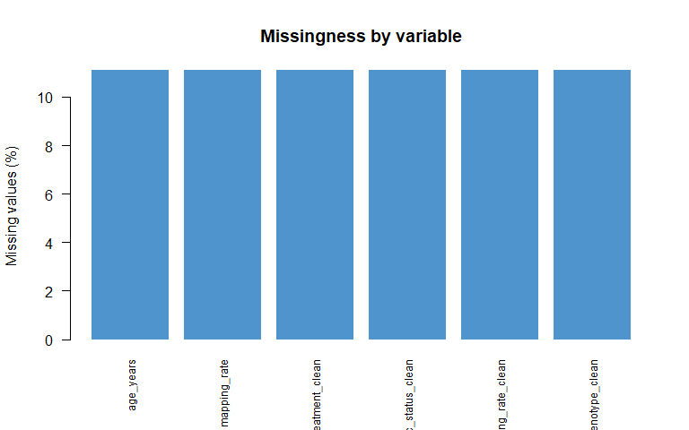
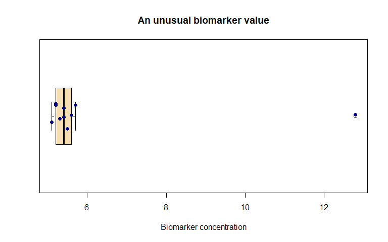
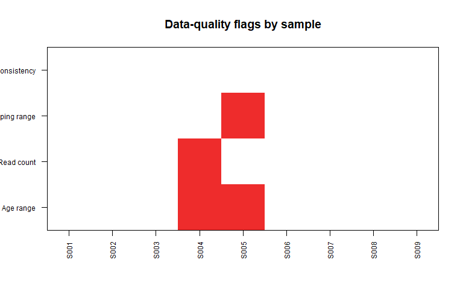

Chapter 4: Data Quality and Data Preparation
================
Sandeep Singh

- [1. Introduction](#1-introduction)
- [2. Learning Objectives](#2-learning-objectives)
- [3. What Does Data Quality Mean?](#3-what-does-data-quality-mean)
  - [3.1 Fitness for purpose](#31-fitness-for-purpose)
- [4. Raw, Cleaned and Analysis-Ready
  Data](#4-raw-cleaned-and-analysis-ready-data)
  - [4.1 Raw data](#41-raw-data)
  - [4.2 Cleaned data](#42-cleaned-data)
  - [4.3 Analysis-ready data](#43-analysis-ready-data)
  - [4.4 Never overwrite the raw file](#44-never-overwrite-the-raw-file)
- [5. Begin with the Observational
  Unit](#5-begin-with-the-observational-unit)
  - [5.1 Define a candidate key](#51-define-a-candidate-key)
- [6. A Deliberately Messy Biological
  Dataset](#6-a-deliberately-messy-biological-dataset)
- [7. Preserve the Original Object](#7-preserve-the-original-object)
- [8. First Structural Inspection](#8-first-structural-inspection)
  - [8.1 Questions to ask immediately](#81-questions-to-ask-immediately)
  - [8.2 Check column names](#82-check-column-names)
- [9. Create a Data Dictionary and Validation
  Rules](#9-create-a-data-dictionary-and-validation-rules)
- [10. Exact Duplicate Rows](#10-exact-duplicate-rows)
  - [10.1 Display every member of a duplicate
    group](#101-display-every-member-of-a-duplicate-group)
  - [10.2 Should exact duplicates be
    removed?](#102-should-exact-duplicates-be-removed)
- [11. Duplicated Identifiers](#11-duplicated-identifiers)
  - [11.1 Duplicate does not always mean
    error](#111-duplicate-does-not-always-mean-error)
- [12. Standardizing Text Categories](#12-standardizing-text-categories)
  - [12.1 Remove leading and trailing
    spaces](#121-remove-leading-and-trailing-spaces)
  - [12.2 Standardize capitalization](#122-standardize-capitalization)
  - [12.3 Recode using explicit
    mappings](#123-recode-using-explicit-mappings)
  - [12.4 Identify unmapped values](#124-identify-unmapped-values)
- [13. Impossible and Implausible
  Values](#13-impossible-and-implausible-values)
  - [13.1 Range checks](#131-range-checks)
  - [13.2 Flag first, correct later](#132-flag-first-correct-later)
- [14. Unit Inconsistency](#14-unit-inconsistency)
  - [14.1 Compare suspicious values with source
    information](#141-compare-suspicious-values-with-source-information)
  - [14.2 Record measurement units
    explicitly](#142-record-measurement-units-explicitly)
- [15. Documented Missing-Value
  Codes](#15-documented-missing-value-codes)
  - [15.1 Do not confuse zero with
    missing](#151-do-not-confuse-zero-with-missing)
- [16. Missingness Assessment](#16-missingness-assessment)
  - [16.1 Count missing values by
    variable](#161-count-missing-values-by-variable)
  - [16.2 Calculate missing
    percentages](#162-calculate-missing-percentages)
  - [16.3 Visualize missingness](#163-visualize-missingness)
  - [16.4 Missingness patterns matter](#164-missingness-patterns-matter)
- [17. Complete Cases](#17-complete-cases)
- [18. Logic and Cross-Variable
  Checks](#18-logic-and-cross-variable-checks)
  - [18.1 QC consistency check](#181-qc-consistency-check)
- [19. Dates and Formats](#19-dates-and-formats)
  - [19.1 Parse known formats
    explicitly](#191-parse-known-formats-explicitly)
  - [19.2 Ambiguous dates](#192-ambiguous-dates)
- [20. Outliers Versus Errors](#20-outliers-versus-errors)
  - [20.1 Visual inspection](#201-visual-inspection)
  - [20.2 IQR rule as a flag](#202-iqr-rule-as-a-flag)
  - [20.3 Appropriate responses to an
    outlier](#203-appropriate-responses-to-an-outlier)
- [21. Biological and Technical
  Replicates](#21-biological-and-technical-replicates)
  - [21.1 Biological replicate](#211-biological-replicate)
  - [21.2 Technical replicate](#212-technical-replicate)
  - [21.3 Why accidental averaging can be
    harmful](#213-why-accidental-averaging-can-be-harmful)
- [22. Wide and Long Data Formats](#22-wide-and-long-data-formats)
  - [22.1 Wide format](#221-wide-format)
  - [22.2 Long format](#222-long-format)
  - [22.3 Tidy-data principle](#223-tidy-data-principle)
- [23. Joining Datasets Safely](#23-joining-datasets-safely)
  - [23.1 Check keys before merging](#231-check-keys-before-merging)
  - [23.2 Check row counts and unmatched
    IDs](#232-check-row-counts-and-unmatched-ids)
- [24. Quality-Control Flags Versus
  Deletion](#24-quality-control-flags-versus-deletion)
  - [24.1 Visualize the flag matrix](#241-visualize-the-flag-matrix)
- [25. Data Cleaning Log](#25-data-cleaning-log)
- [26. Do Not Hide Data Problems](#26-do-not-hide-data-problems)
- [27. Constructing the Cleaned
  Dataset](#27-constructing-the-cleaned-dataset)
  - [27.1 Copy the working data](#271-copy-the-working-data)
  - [27.2 Apply only verified handling
    decisions](#272-apply-only-verified-handling-decisions)
  - [27.3 Convert categories to
    factors](#273-convert-categories-to-factors)
  - [27.4 Inspect the cleaned
    structure](#274-inspect-the-cleaned-structure)
- [28. Build an Analysis-Ready
  Dataset](#28-build-an-analysis-ready-dataset)
  - [28.1 Define inclusion explicitly](#281-define-inclusion-explicitly)
  - [28.2 Record exclusion reasons](#282-record-exclusion-reasons)
  - [28.3 Select required columns and
    observations](#283-select-required-columns-and-observations)
  - [28.4 Final checks](#284-final-checks)
- [29. Before-and-After Quality
  Summary](#29-before-and-after-quality-summary)
- [30. Saving Data Safely](#30-saving-data-safely)
- [31. A Reproducible Data-Preparation
  Workflow](#31-a-reproducible-data-preparation-workflow)
- [32. Common Beginner Mistakes](#32-common-beginner-mistakes)
  - [Mistake 1: Overwriting raw data](#mistake-1-overwriting-raw-data)
  - [Mistake 2: Removing every duplicate
    ID](#mistake-2-removing-every-duplicate-id)
  - [Mistake 3: Removing outliers
    automatically](#mistake-3-removing-outliers-automatically)
  - [Mistake 4: Guessing corrections](#mistake-4-guessing-corrections)
  - [Mistake 5: Treating zero as
    missing](#mistake-5-treating-zero-as-missing)
  - [Mistake 6: Converting all incomplete rows to complete
    cases](#mistake-6-converting-all-incomplete-rows-to-complete-cases)
  - [Mistake 7: Ignoring category
    spelling](#mistake-7-ignoring-category-spelling)
  - [Mistake 8: Merging without checking key
    uniqueness](#mistake-8-merging-without-checking-key-uniqueness)
  - [Mistake 9: Mixing biological and technical
    replicates](#mistake-9-mixing-biological-and-technical-replicates)
  - [Mistake 10: Cleaning without a
    log](#mistake-10-cleaning-without-a-log)
  - [Mistake 11: Hiding exclusions](#mistake-11-hiding-exclusions)
- [33. Chapter Summary](#33-chapter-summary)
- [34. Check Your Understanding](#34-check-your-understanding)
  - [Question 1](#question-1)
  - [Question 2](#question-2)
  - [Question 3](#question-3)
  - [Question 4](#question-4)
  - [Question 5](#question-5)
  - [Question 6](#question-6)
  - [Question 7](#question-7)
  - [Question 8](#question-8)
  - [Question 9](#question-9)
  - [Question 10](#question-10)
- [35. Practice with R](#35-practice-with-r)
  - [Exercise 1: Find exact
    duplicates](#exercise-1-find-exact-duplicates)
  - [Exercise 2: Standardize
    categories](#exercise-2-standardize-categories)
  - [Exercise 3: Perform range checks](#exercise-3-perform-range-checks)
  - [Exercise 4: Assess missingness](#exercise-4-assess-missingness)
  - [Exercise 5: Check a merge](#exercise-5-check-a-merge)
  - [Exercise 6: Reshape repeated
    measurements](#exercise-6-reshape-repeated-measurements)
- [36. Mini-Project: Clean a Small Omics Metadata
  Table](#36-mini-project-clean-a-small-omics-metadata-table)
- [37. Glossary](#37-glossary)
- [38. References and Further
  Reading](#38-references-and-further-reading)
- [39. Reproducibility Information](#39-reproducibility-information)

# 1. Introduction

Statistical results are trustworthy only when the data entering the
analysis are sufficiently accurate, clearly defined and appropriate for
the research question.

A dataset may contain:

- duplicated records;
- misspelled categories;
- impossible ages;
- undocumented missing-value codes;
- measurements recorded in different units;
- incorrect sample identifiers;
- laboratory batch problems; or
- observations that do not belong to the intended study population.

R will often analyse such data without knowing that anything is
scientifically wrong.

This gives us a fundamental principle:

> **Data cleaning is not the process of making data look better. It is
> the process of detecting, investigating, documenting and appropriately
> handling data-quality problems.**

The goal is not to create a perfect-looking dataset. The goal is to
create an analysis-ready dataset while preserving the evidence needed to
understand every decision.

------------------------------------------------------------------------

# 2. Learning Objectives

After completing this chapter, you should be able to:

1.  explain data quality in biological research;
2.  distinguish raw, cleaned and analysis-ready data;
3.  identify the observational unit of a dataset;
4.  check dimensions, names, storage types and category values;
5.  identify exact duplicates and duplicated identifiers;
6.  distinguish duplicate records from legitimate repeated measurements;
7.  standardize inconsistent text categories;
8.  detect impossible and implausible values;
9.  identify undocumented missing-value codes;
10. distinguish outliers from data errors;
11. perform range, logic and cross-variable checks;
12. investigate unit and date inconsistencies;
13. summarize and visualize missingness;
14. distinguish biological and technical replicates during data
    preparation;
15. understand wide and long data formats;
16. document changes in a cleaning log; and
17. construct an analysis-ready dataset reproducibly in R.

------------------------------------------------------------------------

# 3. What Does Data Quality Mean?

Data quality is not a single number. It has several dimensions.

| Dimension | Beginner-friendly question |
|----|----|
| Accuracy | Does the recorded value agree with the source or measurement? |
| Completeness | Are required values present? |
| Consistency | Are the same definitions and codes used throughout? |
| Validity | Does the value follow the permitted format, range and rules? |
| Uniqueness | Are unintended duplicate records present? |
| Timeliness | Was the information collected at the appropriate time? |
| Traceability | Can we determine where the value came from and how it changed? |

A dataset can perform well in one dimension and poorly in another. For
example, every field may be complete but recorded in inconsistent units.

## 3.1 Fitness for purpose

Quality also depends on the intended analysis.

A sequencing dataset may be suitable for estimating common-variant
allele frequencies but unsuitable for analysing rare variants if depth
is too low. A clinical dataset may contain accurate hospital
measurements but still fail to represent the target population.

Therefore, data quality should be evaluated relative to:

- the research question;
- the study design;
- the measurement process; and
- the planned statistical analysis.

------------------------------------------------------------------------

# 4. Raw, Cleaned and Analysis-Ready Data

## 4.1 Raw data

**Raw data** are the original data received from an instrument,
database, laboratory or data-collection system.

Examples include:

- an instrument export;
- a sequencing run report;
- an electronic case-report form export;
- genotype calls; or
- a laboratory measurement file.

Raw data should normally be preserved unchanged.

## 4.2 Cleaned data

**Cleaned data** contain documented corrections or standardized
representations.

Examples include:

- converting documented missing codes to `NA`;
- standardizing category spelling;
- converting dates into one format; and
- correcting an entry after verifying it against the source record.

## 4.3 Analysis-ready data

**Analysis-ready data** contain the observations and variables needed
for a specific analysis, with appropriate types, coding and exclusions.

One cleaned master dataset may produce several analysis-ready datasets
because different research questions require different populations,
outcomes or time points.

## 4.4 Never overwrite the raw file

A safe project structure is:

``` text
project/
├── data_raw/
├── data_intermediate/
├── data_clean/
├── scripts/
├── figures/
├── tables/
└── reports/
```

Every cleaned dataset should be reproducible from the raw data and code.

------------------------------------------------------------------------

# 5. Begin with the Observational Unit

Before checking individual values, ask:

> What does one row represent?

Possible observational units include:

- one patient;
- one biological sample;
- one sequencing library;
- one gene;
- one genetic variant;
- one culture plate;
- one follow-up visit; or
- one measurement from one assay run.

If one row represents one patient, repeated patient IDs may indicate
duplicates or repeated visits. If one row represents one visit, repeated
patient IDs are expected.

## 5.1 Define a candidate key

A **key** is one variable or a combination of variables that should
uniquely identify a row.

Examples:

| Observational unit         | Possible key                 |
|----------------------------|------------------------------|
| One patient                | `patient_id`                 |
| One patient visit          | `patient_id + visit_date`    |
| One biospecimen            | `sample_id`                  |
| One gene per sample        | `sample_id + gene_id`        |
| One variant per individual | `individual_id + variant_id` |

Duplicate checking is meaningful only after the expected key has been
defined.

------------------------------------------------------------------------

# 6. A Deliberately Messy Biological Dataset

The following hypothetical dataset contains several quality problems. It
is intentionally small so that each problem can be inspected manually.

``` r
raw_sample_data <- data.frame(
  sample_id = c(
    "S001", "S002", "S003", "S003", "S004",
    "S005", "S006", "S007", "S008", "S009"
  ),
  patient_id = c(
    "P01", "P02", "P03", "P03", "P04",
    "P05", "P06", "P07", "P08", "P09"
  ),
  age_years = c(45, 52, 61, 61, -4, 150, 39, NA, 57, 48),
  treatment = c(
    "Control", " treated ", "Control", "Control", "Treatment",
    "CONTROL", "Treated", "Treatmnt", "control", "Treated"
  ),
  tissue = c(
    "Blood", "blood", "Liver", "Liver", "Brain",
    "Brain ", "BLOOD", "Liver", "Blood", "Brain"
  ),
  genotype = c(
    "AA", "AG", "GG", "GG", "AG",
    "--", "AA", "AG", "GG", "AA"
  ),
  read_count = c(
    1250000, 1480000, 980000, 980000, -10,
    1750000, 0, 1320000, 1600000, 1410000
  ),
  mapping_rate = c(
    0.92, 0.89, 0.94, 0.94, 0.88,
    92, 0.61, 0.91, NA, 0.93
  ),
  qc_status = c(
    "Pass", "PASS", "Pass", "Pass", "pass",
    "Pass", "Fail", "Passed", "Unknown", "Pass"
  ),
  collection_date = c(
    "2026-01-05", "2026/01/07", "2026-01-08", "2026-01-08",
    "05-01-2026", "2026-01-10", "2026-01-11", "2026-13-01",
    "", "2026-01-15"
  ),
  stringsAsFactors = FALSE
)

print(raw_sample_data)
```

    ##    sample_id patient_id age_years treatment tissue genotype read_count
    ## 1       S001        P01        45   Control  Blood       AA    1250000
    ## 2       S002        P02        52  treated   blood       AG    1480000
    ## 3       S003        P03        61   Control  Liver       GG     980000
    ## 4       S003        P03        61   Control  Liver       GG     980000
    ## 5       S004        P04        -4 Treatment  Brain       AG        -10
    ## 6       S005        P05       150   CONTROL Brain        --    1750000
    ## 7       S006        P06        39   Treated  BLOOD       AA          0
    ## 8       S007        P07        NA  Treatmnt  Liver       AG    1320000
    ## 9       S008        P08        57   control  Blood       GG    1600000
    ## 10      S009        P09        48   Treated  Brain       AA    1410000
    ##    mapping_rate qc_status collection_date
    ## 1          0.92      Pass      2026-01-05
    ## 2          0.89      PASS      2026/01/07
    ## 3          0.94      Pass      2026-01-08
    ## 4          0.94      Pass      2026-01-08
    ## 5          0.88      pass      05-01-2026
    ## 6         92.00      Pass      2026-01-10
    ## 7          0.61      Fail      2026-01-11
    ## 8          0.91    Passed      2026-13-01
    ## 9            NA   Unknown                
    ## 10         0.93      Pass      2026-01-15

Potential issues include:

- an exact duplicate row;
- ages outside the plausible study range;
- extra spaces and inconsistent capitalization;
- a misspelled treatment label;
- a special genotype code;
- a negative read count;
- a mapping rate recorded on a different scale;
- inconsistent QC categories; and
- several date formats.

The presence of a suspicious value does not tell us how it should be
corrected. Investigation comes before editing.

------------------------------------------------------------------------

# 7. Preserve the Original Object

When exploring problems, create a separate working object.

``` r
working_data <- raw_sample_data
```

This does not replace the need to preserve the original file on disk,
but it prevents accidental changes to the in-session raw object.

Useful names include:

- `raw_data`;
- `working_data`;
- `clean_data`; and
- `analysis_data`.

Avoid repeatedly replacing an object called simply `data`, because it
becomes difficult to know which processing stage it represents.

------------------------------------------------------------------------

# 8. First Structural Inspection

``` r
dim(working_data)
```

    ## [1] 10 10

``` r
names(working_data)
```

    ##  [1] "sample_id"       "patient_id"      "age_years"       "treatment"      
    ##  [5] "tissue"          "genotype"        "read_count"      "mapping_rate"   
    ##  [9] "qc_status"       "collection_date"

``` r
str(working_data)
```

    ## 'data.frame':    10 obs. of  10 variables:
    ##  $ sample_id      : chr  "S001" "S002" "S003" "S003" ...
    ##  $ patient_id     : chr  "P01" "P02" "P03" "P03" ...
    ##  $ age_years      : num  45 52 61 61 -4 150 39 NA 57 48
    ##  $ treatment      : chr  "Control" " treated " "Control" "Control" ...
    ##  $ tissue         : chr  "Blood" "blood" "Liver" "Liver" ...
    ##  $ genotype       : chr  "AA" "AG" "GG" "GG" ...
    ##  $ read_count     : num  1250000 1480000 980000 980000 -10 1750000 0 1320000 1600000 1410000
    ##  $ mapping_rate   : num  0.92 0.89 0.94 0.94 0.88 92 0.61 0.91 NA 0.93
    ##  $ qc_status      : chr  "Pass" "PASS" "Pass" "Pass" ...
    ##  $ collection_date: chr  "2026-01-05" "2026/01/07" "2026-01-08" "2026-01-08" ...

``` r
print(head(working_data))
```

    ##   sample_id patient_id age_years treatment tissue genotype read_count
    ## 1      S001        P01        45   Control  Blood       AA    1250000
    ## 2      S002        P02        52  treated   blood       AG    1480000
    ## 3      S003        P03        61   Control  Liver       GG     980000
    ## 4      S003        P03        61   Control  Liver       GG     980000
    ## 5      S004        P04        -4 Treatment  Brain       AG        -10
    ## 6      S005        P05       150   CONTROL Brain        --    1750000
    ##   mapping_rate qc_status collection_date
    ## 1         0.92      Pass      2026-01-05
    ## 2         0.89      PASS      2026/01/07
    ## 3         0.94      Pass      2026-01-08
    ## 4         0.94      Pass      2026-01-08
    ## 5         0.88      pass      05-01-2026
    ## 6        92.00      Pass      2026-01-10

``` r
summary(working_data)
```

    ##   sample_id          patient_id          age_years       treatment        
    ##  Length:10          Length:10          Min.   : -4.00   Length:10         
    ##  Class :character   Class :character   1st Qu.: 45.00   Class :character  
    ##  Mode  :character   Mode  :character   Median : 52.00   Mode  :character  
    ##                                        Mean   : 56.56                     
    ##                                        3rd Qu.: 61.00                     
    ##                                        Max.   :150.00                     
    ##                                        NA's   :1                          
    ##     tissue            genotype           read_count       mapping_rate  
    ##  Length:10          Length:10          Min.   :    -10   Min.   : 0.61  
    ##  Class :character   Class :character   1st Qu.: 980000   1st Qu.: 0.89  
    ##  Mode  :character   Mode  :character   Median :1285000   Median : 0.92  
    ##                                        Mean   :1076999   Mean   :11.00  
    ##                                        3rd Qu.:1462500   3rd Qu.: 0.94  
    ##                                        Max.   :1750000   Max.   :92.00  
    ##                                                          NA's   :1      
    ##   qc_status         collection_date   
    ##  Length:10          Length:10         
    ##  Class :character   Class :character  
    ##  Mode  :character   Mode  :character  
    ##                                       
    ##                                       
    ##                                       
    ## 

## 8.1 Questions to ask immediately

- Does the number of rows match expectations?
- Does each row represent the intended unit?
- Are all required columns present?
- Are column names unique?
- Are numeric variables stored as numeric?
- Are categorical variables stored consistently?
- Did character values force a numeric column to become text?
- Are there unexpected missing values?

## 8.2 Check column names

``` r
names(working_data)
```

    ##  [1] "sample_id"       "patient_id"      "age_years"       "treatment"      
    ##  [5] "tissue"          "genotype"        "read_count"      "mapping_rate"   
    ##  [9] "qc_status"       "collection_date"

``` r
anyDuplicated(names(working_data))
```

    ## [1] 0

Duplicate column names can cause ambiguous selections and should be
resolved using the source documentation.

------------------------------------------------------------------------

# 9. Create a Data Dictionary and Validation Rules

Cleaning decisions should be based on documented expectations.

``` r
validation_rules <- data.frame(
  variable = c(
    "sample_id", "age_years", "treatment", "tissue",
    "genotype", "read_count", "mapping_rate", "qc_status"
  ),
  expected_type = c(
    "Unique text", "Numeric", "Categorical", "Categorical",
    "Categorical", "Non-negative count", "Proportion", "Categorical"
  ),
  permitted_values_or_range = c(
    "Unique and non-missing",
    "18 to 100 years",
    "Control; Treated",
    "Blood; Brain; Liver",
    "AA; AG; GG; missing",
    "0 or greater",
    "0 to 1",
    "Pass; Fail; missing"
  ),
  stringsAsFactors = FALSE
)

print(validation_rules)
```

    ##       variable      expected_type permitted_values_or_range
    ## 1    sample_id        Unique text    Unique and non-missing
    ## 2    age_years            Numeric           18 to 100 years
    ## 3    treatment        Categorical          Control; Treated
    ## 4       tissue        Categorical       Blood; Brain; Liver
    ## 5     genotype        Categorical       AA; AG; GG; missing
    ## 6   read_count Non-negative count              0 or greater
    ## 7 mapping_rate         Proportion                    0 to 1
    ## 8    qc_status        Categorical       Pass; Fail; missing

These rules are hypothetical. In real work they must come from the
protocol, codebook, instrument documentation and scientific team.

------------------------------------------------------------------------

# 10. Exact Duplicate Rows

An **exact duplicate** occurs when every recorded value in one row
matches another row.

``` r
duplicated(working_data)
```

    ##  [1] FALSE FALSE FALSE  TRUE FALSE FALSE FALSE FALSE FALSE FALSE

``` r
sum(duplicated(working_data))
```

    ## [1] 1

``` r
print(working_data[duplicated(working_data), ])
```

    ##   sample_id patient_id age_years treatment tissue genotype read_count
    ## 4      S003        P03        61   Control  Liver       GG     980000
    ##   mapping_rate qc_status collection_date
    ## 4         0.94      Pass      2026-01-08

The first occurrence is not marked by `duplicated()`. Later repeated
copies are marked `TRUE`.

## 10.1 Display every member of a duplicate group

``` r
duplicate_from_top <- duplicated(working_data)
duplicate_from_bottom <- duplicated(working_data, fromLast = TRUE)

print(working_data[
  duplicate_from_top | duplicate_from_bottom,
])
```

    ##   sample_id patient_id age_years treatment tissue genotype read_count
    ## 3      S003        P03        61   Control  Liver       GG     980000
    ## 4      S003        P03        61   Control  Liver       GG     980000
    ##   mapping_rate qc_status collection_date
    ## 3         0.94      Pass      2026-01-08
    ## 4         0.94      Pass      2026-01-08

## 10.2 Should exact duplicates be removed?

Only after confirming that they are unintended duplicate records.

Two identical rows may represent:

- accidental double entry;
- the same record imported twice;
- two genuine observations that happen to have identical measured
  values; or
- a dataset lacking a necessary identifier.

If the duplicate is confirmed as accidental:

``` r
working_data <- working_data[!duplicated(working_data), ]
rownames(working_data) <- NULL

dim(working_data)
```

    ## [1]  9 10

The reason and number of removed rows should be recorded.

------------------------------------------------------------------------

# 11. Duplicated Identifiers

An identifier can be duplicated even when the complete rows are
different.

``` r
duplicated(working_data$sample_id)
```

    ## [1] FALSE FALSE FALSE FALSE FALSE FALSE FALSE FALSE FALSE

``` r
working_data$sample_id[duplicated(working_data$sample_id)]
```

    ## character(0)

After removal of the confirmed exact duplicate, no sample IDs should be
duplicated in this example.

## 11.1 Duplicate does not always mean error

Repeated patient IDs may be valid when the dataset contains:

- repeated visits;
- multiple tissue samples;
- technical replicates;
- multiple sequencing libraries; or
- longitudinal measurements.

The correct key might therefore be a combination such as:

``` r
patient_id + visit_date + sample_id
```

Never delete repeated IDs until the observational unit and expected key
are understood.

------------------------------------------------------------------------

# 12. Standardizing Text Categories

Text categories can differ because of capitalization, spaces or
spelling.

``` r
sort(unique(working_data$treatment))
```

    ## [1] " treated " "control"   "Control"   "CONTROL"   "Treated"   "Treatment"
    ## [7] "Treatmnt"

``` r
sort(unique(working_data$tissue))
```

    ## [1] "blood"  "Blood"  "BLOOD"  "Brain"  "Brain " "Liver"

``` r
sort(unique(working_data$qc_status))
```

    ## [1] "Fail"    "pass"    "Pass"    "PASS"    "Passed"  "Unknown"

## 12.1 Remove leading and trailing spaces

``` r
working_data$treatment <- trimws(working_data$treatment)
working_data$tissue <- trimws(working_data$tissue)
working_data$qc_status <- trimws(working_data$qc_status)
```

## 12.2 Standardize capitalization

``` r
working_data$treatment <- tolower(working_data$treatment)
working_data$tissue <- tolower(working_data$tissue)
working_data$qc_status <- tolower(working_data$qc_status)

sort(unique(working_data$treatment))
```

    ## [1] "control"   "treated"   "treatment" "treatmnt"

``` r
sort(unique(working_data$tissue))
```

    ## [1] "blood" "brain" "liver"

``` r
sort(unique(working_data$qc_status))
```

    ## [1] "fail"    "pass"    "passed"  "unknown"

## 12.3 Recode using explicit mappings

``` r
treatment_map <- c(
  control = "Control",
  treated = "Treated",
  treatmnt = "Treated"
)

tissue_map <- c(
  blood = "Blood",
  brain = "Brain",
  liver = "Liver"
)

qc_map <- c(
  pass = "Pass",
  passed = "Pass",
  fail = "Fail",
  unknown = NA_character_
)

working_data$treatment_clean <-
  unname(treatment_map[working_data$treatment])

working_data$tissue_clean <-
  unname(tissue_map[working_data$tissue])

working_data$qc_status_clean <-
  unname(qc_map[working_data$qc_status])

print(working_data[, c(
  "treatment", "treatment_clean",
  "tissue", "tissue_clean",
  "qc_status", "qc_status_clean"
)])
```

    ##   treatment treatment_clean tissue tissue_clean qc_status qc_status_clean
    ## 1   control         Control  blood        Blood      pass            Pass
    ## 2   treated         Treated  blood        Blood      pass            Pass
    ## 3   control         Control  liver        Liver      pass            Pass
    ## 4 treatment            <NA>  brain        Brain      pass            Pass
    ## 5   control         Control  brain        Brain      pass            Pass
    ## 6   treated         Treated  blood        Blood      fail            Fail
    ## 7  treatmnt         Treated  liver        Liver    passed            Pass
    ## 8   control         Control  blood        Blood   unknown            <NA>
    ## 9   treated         Treated  brain        Brain      pass            Pass

The misspelling `treatmnt` is mapped to `Treated` only because the
intended value is assumed to have been verified for this teaching
example.

Unknown or unmapped categories should be investigated, not silently
converted.

## 12.4 Identify unmapped values

``` r
print(working_data[
  is.na(working_data$treatment_clean),
  c("sample_id", "treatment")
])
```

    ##   sample_id treatment
    ## 4      S004 treatment

No unexplained treatment category remains in this example.

------------------------------------------------------------------------

# 13. Impossible and Implausible Values

An **impossible value** cannot occur under the variable definition.

Examples include:

- a negative read count;
- mapping proportion greater than 1;
- collection date before a person’s birth; or
- allele dosage outside its defined range.

An **implausible value** is possible but unusual enough to require
investigation.

Examples might include:

- age 100 in a study expecting younger adults;
- an unusually high biomarker value; or
- sequencing depth far above the rest of the batch.

The distinction depends on context and documentation.

## 13.1 Range checks

``` r
working_data$age_out_of_range <-
  !is.na(working_data$age_years) &
  (working_data$age_years < 18 | working_data$age_years > 100)

working_data$read_count_invalid <-
  !is.na(working_data$read_count) &
  working_data$read_count < 0

working_data$mapping_rate_invalid <-
  !is.na(working_data$mapping_rate) &
  (working_data$mapping_rate < 0 | working_data$mapping_rate > 1)

working_data[
  working_data$age_out_of_range |
    working_data$read_count_invalid |
    working_data$mapping_rate_invalid,
  c(
    "sample_id", "age_years", "read_count", "mapping_rate",
    "age_out_of_range", "read_count_invalid", "mapping_rate_invalid"
  )
]
```

<div class="kable-table">

|  | sample_id | age_years | read_count | mapping_rate | age_out_of_range | read_count_invalid | mapping_rate_invalid |
|:---|:---|---:|---:|---:|:---|:---|:---|
| 4 | S004 | -4 | -10 | 0.88 | TRUE | TRUE | FALSE |
| 5 | S005 | 150 | 1750000 | 92.00 | TRUE | FALSE | TRUE |

</div>

## 13.2 Flag first, correct later

Creating quality flags preserves the original values for investigation.

Do not immediately replace all flagged values with `NA`. Possible
actions include:

- verify against the source;
- correct a confirmed transcription error;
- convert units after verification;
- retain the value with a sensitivity analysis;
- exclude the observation for a specified analysis; or
- set the value to missing when it is confirmed invalid and
  unrecoverable.

------------------------------------------------------------------------

# 14. Unit Inconsistency

The value `92` in `mapping_rate` may represent 92%, whereas other values
are proportions such as 0.92.

This is a likely unit inconsistency, but dividing by 100 automatically
would be unsafe without verification.

## 14.1 Compare suspicious values with source information

For this teaching example, assume the laboratory report confirms that
sample `S005` was recorded as 92% and should be represented as 0.92.

``` r
working_data$mapping_rate_clean <- working_data$mapping_rate

working_data$mapping_rate_clean[
  working_data$sample_id == "S005"
] <- 0.92
```

The correction is targeted to the verified record rather than applied as
a general rule to every value greater than 1.

## 14.2 Record measurement units explicitly

Variable names or data dictionaries should specify whether a measurement
is:

- a proportion from 0 to 1;
- a percentage from 0 to 100;
- a count;
- a concentration; or
- a rate per exposure unit.

------------------------------------------------------------------------

# 15. Documented Missing-Value Codes

Missing data may be encoded as:

- blank text;
- `Unknown`;
- `Not done`;
- `-9`;
- `999`; or
- `--`.

These codes must be identified using the data dictionary.

For this example, assume `--` means the genotype was not called.

``` r
working_data$genotype_clean <- working_data$genotype

working_data$genotype_clean[
  working_data$genotype_clean == "--"
] <- NA

working_data$genotype_clean
```

    ## [1] "AA" "AG" "GG" "AG" NA   "AA" "AG" "GG" "AA"

## 15.1 Do not confuse zero with missing

Sample `S006` has a read count of zero. Zero may mean:

- no reads were assigned;
- sequencing failed;
- a processing rule produced zero; or
- missing data were encoded incorrectly.

The value should not be converted to `NA` without knowing which
interpretation is correct.

------------------------------------------------------------------------

# 16. Missingness Assessment

## 16.1 Count missing values by variable

``` r
missing_count <- colSums(is.na(working_data))
missing_count
```

    ##            sample_id           patient_id            age_years 
    ##                    0                    0                    1 
    ##            treatment               tissue             genotype 
    ##                    0                    0                    0 
    ##           read_count         mapping_rate            qc_status 
    ##                    0                    1                    0 
    ##      collection_date      treatment_clean         tissue_clean 
    ##                    0                    1                    0 
    ##      qc_status_clean     age_out_of_range   read_count_invalid 
    ##                    1                    0                    0 
    ## mapping_rate_invalid   mapping_rate_clean       genotype_clean 
    ##                    0                    1                    1

## 16.2 Calculate missing percentages

``` r
missing_summary <- data.frame(
  variable = names(working_data),
  missing_n = colSums(is.na(working_data)),
  missing_percent = round(
    100 * colMeans(is.na(working_data)),
    digits = 1
  ),
  row.names = NULL
)

print(missing_summary[
  missing_summary$missing_n > 0,
])
```

    ##              variable missing_n missing_percent
    ## 3           age_years         1            11.1
    ## 8        mapping_rate         1            11.1
    ## 11    treatment_clean         1            11.1
    ## 13    qc_status_clean         1            11.1
    ## 17 mapping_rate_clean         1            11.1
    ## 18     genotype_clean         1            11.1

## 16.3 Visualize missingness

``` r
missing_for_plot <- missing_summary[
  missing_summary$missing_n > 0,
]

barplot(
  height = missing_for_plot$missing_percent,
  names.arg = missing_for_plot$variable,
  col = "steelblue3",
  border = NA,
  ylab = "Missing values (%)",
  main = "Missingness by variable",
  las = 2,
  cex.names = 0.75
)
```

<div class="figure" style="text-align: center">


<p class="caption">

Percentage of missing values in variables containing at least one
missing observation after initial recoding.
</p>

</div>

## 16.4 Missingness patterns matter

The overall percentage is not enough. Ask:

- Are entire variables missing for one batch?
- Are outcomes missing more often in one treatment group?
- Are failed sequencing samples missing several downstream measurements?
- Is missingness related to disease severity?

The reason for missingness influences the appropriate statistical
method. Missing-data mechanisms will be discussed in a later dedicated
chapter.

------------------------------------------------------------------------

# 17. Complete Cases

`complete.cases()` identifies rows without any missing values across
selected variables.

``` r
analysis_variables <- c(
  "age_years",
  "treatment_clean",
  "genotype_clean",
  "mapping_rate_clean"
)

complete_for_selected <- complete.cases(
  working_data[, analysis_variables]
)

table(complete_for_selected)
```

    ## complete_for_selected
    ## FALSE  TRUE 
    ##     4     5

Do not automatically discard every incomplete row. Complete-case
analysis can reduce sample size and introduce bias when missingness is
related to observed or unobserved factors.

------------------------------------------------------------------------

# 18. Logic and Cross-Variable Checks

Range checks examine one variable. **Logic checks** compare information
across variables.

Examples include:

- a QC status of `Pass` despite mapping rate below the protocol
  threshold;
- event date earlier than enrolment date;
- follow-up time recorded but no participant ID;
- genotype call present despite a documented assay failure; or
- treatment response recorded before treatment began.

## 18.1 QC consistency check

Assume the teaching protocol requires mapping rate of at least 0.80 for
a pass.

``` r
working_data$qc_mapping_inconsistent <-
  !is.na(working_data$qc_status_clean) &
  !is.na(working_data$mapping_rate_clean) &
  (
    (working_data$qc_status_clean == "Pass" &
       working_data$mapping_rate_clean < 0.80) |
    (working_data$qc_status_clean == "Fail" &
       working_data$mapping_rate_clean >= 0.80)
  )

print(working_data[
  working_data$qc_mapping_inconsistent,
  c("sample_id", "mapping_rate_clean", "qc_status_clean")
])
```

    ## [1] sample_id          mapping_rate_clean qc_status_clean   
    ## <0 rows> (or 0-length row.names)

An inconsistency is a request for investigation. It does not tell us
automatically which field is wrong.

------------------------------------------------------------------------

# 19. Dates and Formats

Dates should be stored as R `Date` objects rather than inconsistent
character strings.

``` r
print(working_data[, c("sample_id", "collection_date")])
```

    ##   sample_id collection_date
    ## 1      S001      2026-01-05
    ## 2      S002      2026/01/07
    ## 3      S003      2026-01-08
    ## 4      S004      05-01-2026
    ## 5      S005      2026-01-10
    ## 6      S006      2026-01-11
    ## 7      S007      2026-13-01
    ## 8      S008                
    ## 9      S009      2026-01-15

Several formats are present, and one value contains an impossible month.

## 19.1 Parse known formats explicitly

We can create a function that attempts the documented formats.

``` r
parse_collection_date <- function(x) {
  x[x == ""] <- NA_character_

  parsed <- as.Date(x, format = "%Y-%m-%d")

  still_missing <- is.na(parsed) & !is.na(x)
  parsed[still_missing] <- as.Date(
    x[still_missing],
    format = "%Y/%m/%d"
  )

  still_missing <- is.na(parsed) & !is.na(x)
  parsed[still_missing] <- as.Date(
    x[still_missing],
    format = "%d-%m-%Y"
  )

  parsed
}

working_data$collection_date_clean <-
  parse_collection_date(working_data$collection_date)

print(working_data[, c(
  "sample_id",
  "collection_date",
  "collection_date_clean"
)])
```

    ##   sample_id collection_date collection_date_clean
    ## 1      S001      2026-01-05            2026-01-05
    ## 2      S002      2026/01/07            2026-01-07
    ## 3      S003      2026-01-08            2026-01-08
    ## 4      S004      05-01-2026            0005-01-20
    ## 5      S005      2026-01-10            2026-01-10
    ## 6      S006      2026-01-11            2026-01-11
    ## 7      S007      2026-13-01                  <NA>
    ## 8      S008                                  <NA>
    ## 9      S009      2026-01-15            2026-01-15

The invalid date remains missing after parsing and should be checked
against the source.

## 19.2 Ambiguous dates

The string `05-01-2026` could mean 5 January or 1 May depending on
convention. Never guess. Use the data-collection specification or source
record.

------------------------------------------------------------------------

# 20. Outliers Versus Errors

An **outlier** is an observation far from most others. An outlier is not
automatically incorrect.

An extreme biological value may represent:

- genuine biological diversity;
- a rare disease subtype;
- a strong treatment response;
- a laboratory artefact;
- sample contamination;
- a unit problem; or
- a transcription error.

## 20.1 Visual inspection

``` r
biomarker <- c(
  5.1, 5.4, 5.3, 5.7, 5.2,
  5.5, 5.6, 5.2, 12.8, 5.4
)
```

``` r
boxplot(
  biomarker,
  horizontal = TRUE,
  col = "wheat",
  xlab = "Biomarker concentration",
  main = "An unusual biomarker value"
)

stripchart(
  biomarker,
  method = "jitter",
  pch = 19,
  col = "navy",
  add = TRUE
)
```

<div class="figure" style="text-align: center">


<p class="caption">

A boxplot can flag an unusual value but cannot determine whether it is a
biological observation or an error.
</p>

</div>

## 20.2 IQR rule as a flag

``` r
q1 <- quantile(biomarker, 0.25)
q3 <- quantile(biomarker, 0.75)
iqr_value <- IQR(biomarker)

lower_limit <- q1 - 1.5 * iqr_value
upper_limit <- q3 + 1.5 * iqr_value

biomarker[
  biomarker < lower_limit |
    biomarker > upper_limit
]
```

    ## [1] 12.8

The 1.5 × IQR rule is a descriptive flag, not a deletion rule.

## 20.3 Appropriate responses to an outlier

- verify the source value;
- inspect laboratory and sample metadata;
- examine whether units differ;
- repeat measurement if scientifically and ethically appropriate;
- use robust summaries or models;
- perform sensitivity analyses with and without the observation; and
- report the decision transparently.

Removing an observation solely because it weakens a desired result is
unacceptable.

------------------------------------------------------------------------

# 21. Biological and Technical Replicates

Data preparation must preserve the replicate structure.

## 21.1 Biological replicate

An independently sampled biological unit, such as:

- a different patient;
- a different animal;
- an independently grown culture; or
- a separate tissue specimen.

## 21.2 Technical replicate

A repeated measurement or processing of the same biological material,
such as:

- repeated qPCR wells;
- repeated instrument readings;
- multiple libraries from one RNA sample; or
- resequencing the same library.

## 21.3 Why accidental averaging can be harmful

Technical replicates may sometimes be summarized, but only according to
a documented procedure. Biological replicates usually should not be
averaged into one observation unless the experimental design explicitly
requires it.

Useful identifiers include:

- `subject_id`;
- `biospecimen_id`;
- `technical_replicate_id`;
- `batch_id`; and
- `measurement_id`.

These identifiers reveal dependency and clustering that later
statistical models must address.

------------------------------------------------------------------------

# 22. Wide and Long Data Formats

## 22.1 Wide format

In wide format, repeated measurements are stored in separate columns.

``` r
wide_biomarker <- data.frame(
  patient_id = c("P01", "P02", "P03"),
  baseline = c(8.2, 9.1, 7.8),
  month_3 = c(7.6, 8.7, 7.4),
  month_6 = c(7.1, 8.4, 7.0)
)

print(wide_biomarker)
```

    ##   patient_id baseline month_3 month_6
    ## 1        P01      8.2     7.6     7.1
    ## 2        P02      9.1     8.7     8.4
    ## 3        P03      7.8     7.4     7.0

## 22.2 Long format

In long format, each row represents one patient-time combination.

``` r
long_biomarker <- reshape(
  wide_biomarker,
  varying = c("baseline", "month_3", "month_6"),
  v.names = "biomarker",
  timevar = "visit",
  times = c("Baseline", "Month 3", "Month 6"),
  direction = "long"
)

rownames(long_biomarker) <- NULL
long_biomarker <- long_biomarker[
  order(long_biomarker$patient_id, long_biomarker$visit),
]

print(long_biomarker)
```

    ##   patient_id    visit biomarker id
    ## 1        P01 Baseline       8.2  1
    ## 4        P01  Month 3       7.6  1
    ## 7        P01  Month 6       7.1  1
    ## 2        P02 Baseline       9.1  2
    ## 5        P02  Month 3       8.7  2
    ## 8        P02  Month 6       8.4  2
    ## 3        P03 Baseline       7.8  3
    ## 6        P03  Month 3       7.4  3
    ## 9        P03  Month 6       7.0  3

Long format is often useful for plotting and repeated-measures models
because the observational unit of each row is explicit.

## 22.3 Tidy-data principle

A commonly used tidy-data structure has:

- one variable per column;
- one observation per row; and
- one type of observational unit per table.

This principle is helpful, but the meaning of “observation” must be
defined scientifically.

------------------------------------------------------------------------

# 23. Joining Datasets Safely

Biological analyses often combine clinical, phenotype and molecular
data.

``` r
phenotype_data <- data.frame(
  patient_id = c("P01", "P02", "P03"),
  age_years = c(45, 52, 61)
)

genotype_data <- data.frame(
  patient_id = c("P01", "P02", "P03"),
  genotype = c("AA", "AG", "GG")
)
```

``` r
combined_data <- merge(
  phenotype_data,
  genotype_data,
  by = "patient_id",
  all = FALSE
)

print(combined_data)
```

    ##   patient_id age_years genotype
    ## 1        P01        45       AA
    ## 2        P02        52       AG
    ## 3        P03        61       GG

## 23.1 Check keys before merging

``` r
anyDuplicated(phenotype_data$patient_id)
```

    ## [1] 0

``` r
anyDuplicated(genotype_data$patient_id)
```

    ## [1] 0

If one table contains duplicate keys, a merge can unexpectedly multiply
rows.

## 23.2 Check row counts and unmatched IDs

``` r
setdiff(phenotype_data$patient_id, genotype_data$patient_id)
```

    ## character(0)

``` r
setdiff(genotype_data$patient_id, phenotype_data$patient_id)
```

    ## character(0)

``` r
nrow(phenotype_data)
```

    ## [1] 3

``` r
nrow(genotype_data)
```

    ## [1] 3

``` r
nrow(combined_data)
```

    ## [1] 3

Never assume that a successful merge is a correct merge.

------------------------------------------------------------------------

# 24. Quality-Control Flags Versus Deletion

Flags keep information about why an observation may require attention.

``` r
working_data$any_basic_problem <-
  working_data$age_out_of_range |
  working_data$read_count_invalid |
  working_data$mapping_rate_invalid |
  working_data$qc_mapping_inconsistent |
  is.na(working_data$treatment_clean) |
  is.na(working_data$tissue_clean)

table(working_data$any_basic_problem)
```

    ## 
    ## FALSE  TRUE 
    ##     7     2

An overall flag can support review, but individual flags should also be
retained so the reason is known.

## 24.1 Visualize the flag matrix

``` r
flag_names <- c(
  "Age range",
  "Read count",
  "Mapping range",
  "QC consistency"
)

flag_matrix <- cbind(
  working_data$age_out_of_range,
  working_data$read_count_invalid,
  working_data$mapping_rate_invalid,
  working_data$qc_mapping_inconsistent
)

flag_matrix[is.na(flag_matrix)] <- FALSE

image(
  x = seq_len(nrow(flag_matrix)),
  y = seq_len(ncol(flag_matrix)),
  z = flag_matrix,
  col = c("white", "firebrick2"),
  xlab = "",
  ylab = "",
  axes = FALSE,
  main = "Data-quality flags by sample"
)

axis(
  side = 1,
  at = seq_len(nrow(flag_matrix)),
  labels = working_data$sample_id,
  las = 2,
  cex.axis = 0.75
)

axis(
  side = 2,
  at = seq_len(ncol(flag_matrix)),
  labels = flag_names,
  las = 2,
  cex.axis = 0.75
)

box()
```

<div class="figure" style="text-align: center">


<p class="caption">

Sample-level quality flags. A coloured cell indicates that a particular
rule was triggered.
</p>

</div>

Flagged observations should proceed to documented review rather than
automatic deletion.

------------------------------------------------------------------------

# 25. Data Cleaning Log

A cleaning log records what changed, why and how.

``` r
cleaning_log <- data.frame(
  step = 1:7,
  issue = c(
    "Exact duplicate row",
    "Inconsistent category spelling",
    "Genotype missing code",
    "Mapping-rate unit inconsistency",
    "Age outside protocol range",
    "Negative read count",
    "Invalid or missing collection date"
  ),
  action = c(
    "Removed one confirmed duplicate after source verification",
    "Standardized using explicit lookup tables",
    "Converted documented -- code to NA",
    "Corrected verified 92% value to 0.92",
    "Flagged; source verification required",
    "Flagged; source verification required",
    "Parsed documented formats and flagged unresolved entries"
  ),
  affected_records = c(
    "Second S003 row",
    "Multiple",
    "S005",
    "S005",
    "S004; S005",
    "S004",
    "S007; S008"
  ),
  stringsAsFactors = FALSE
)

print(cleaning_log)
```

    ##   step                              issue
    ## 1    1                Exact duplicate row
    ## 2    2     Inconsistent category spelling
    ## 3    3              Genotype missing code
    ## 4    4    Mapping-rate unit inconsistency
    ## 5    5         Age outside protocol range
    ## 6    6                Negative read count
    ## 7    7 Invalid or missing collection date
    ##                                                      action affected_records
    ## 1 Removed one confirmed duplicate after source verification  Second S003 row
    ## 2                 Standardized using explicit lookup tables         Multiple
    ## 3                        Converted documented -- code to NA             S005
    ## 4                      Corrected verified 92% value to 0.92             S005
    ## 5                     Flagged; source verification required       S004; S005
    ## 6                     Flagged; source verification required             S004
    ## 7  Parsed documented formats and flagged unresolved entries       S007; S008

A production log should also contain:

- date of change;
- script and code version;
- analyst;
- source used for verification;
- old value;
- new value; and
- approval or review status when required.

------------------------------------------------------------------------

# 26. Do Not Hide Data Problems

Some practices make analysis easier while weakening traceability.

Avoid:

- editing a CSV manually without recording changes;
- deleting rows because they look unusual;
- replacing missing values without justification;
- changing thresholds after seeing the result;
- combining categories merely to obtain significance;
- removing failed samples without reporting the number and reason;
- overwriting the raw dataset; and
- presenting cleaned values without preserving quality flags.

Data preparation is part of the scientific method and should be reported
accordingly.

------------------------------------------------------------------------

# 27. Constructing the Cleaned Dataset

For this teaching example, suppose source review confirms the following:

- the duplicate `S003` row is accidental;
- mapping rate 92 means 92%;
- `--` means genotype not called;
- ages outside 18–100 cannot be verified and should be treated as
  missing;
- the negative read count cannot be verified and should be treated as
  missing; and
- `2026-13-01` is invalid and cannot be recovered.

## 27.1 Copy the working data

``` r
clean_data <- working_data
```

## 27.2 Apply only verified handling decisions

``` r
clean_data$age_years_clean <- clean_data$age_years
clean_data$age_years_clean[
  clean_data$age_out_of_range
] <- NA

clean_data$read_count_clean <- clean_data$read_count
clean_data$read_count_clean[
  clean_data$read_count_invalid
] <- NA
```

The cleaned values are stored in new columns so the original values
remain available for comparison.

## 27.3 Convert categories to factors

``` r
clean_data$treatment_clean <- factor(
  clean_data$treatment_clean,
  levels = c("Control", "Treated")
)

clean_data$tissue_clean <- factor(
  clean_data$tissue_clean,
  levels = c("Blood", "Brain", "Liver")
)

clean_data$genotype_clean <- factor(
  clean_data$genotype_clean,
  levels = c("AA", "AG", "GG")
)

clean_data$qc_status_clean <- factor(
  clean_data$qc_status_clean,
  levels = c("Fail", "Pass")
)
```

## 27.4 Inspect the cleaned structure

``` r
str(clean_data[, c(
  "sample_id",
  "age_years_clean",
  "treatment_clean",
  "tissue_clean",
  "genotype_clean",
  "read_count_clean",
  "mapping_rate_clean",
  "qc_status_clean",
  "collection_date_clean"
)])
```

    ## 'data.frame':    9 obs. of  9 variables:
    ##  $ sample_id            : chr  "S001" "S002" "S003" "S004" ...
    ##  $ age_years_clean      : num  45 52 61 NA NA 39 NA 57 48
    ##  $ treatment_clean      : Factor w/ 2 levels "Control","Treated": 1 2 1 NA 1 2 2 1 2
    ##  $ tissue_clean         : Factor w/ 3 levels "Blood","Brain",..: 1 1 3 2 2 1 3 1 2
    ##  $ genotype_clean       : Factor w/ 3 levels "AA","AG","GG": 1 2 3 2 NA 1 2 3 1
    ##  $ read_count_clean     : num  1250000 1480000 980000 NA 1750000 0 1320000 1600000 1410000
    ##  $ mapping_rate_clean   : num  0.92 0.89 0.94 0.88 0.92 0.61 0.91 NA 0.93
    ##  $ qc_status_clean      : Factor w/ 2 levels "Fail","Pass": 2 2 2 2 2 1 2 NA 2
    ##  $ collection_date_clean: Date, format: "2026-01-05" "2026-01-07" ...

------------------------------------------------------------------------

# 28. Build an Analysis-Ready Dataset

Suppose the planned analysis requires:

- unique samples;
- treatment group;
- tissue;
- genotype;
- mapping rate;
- read count; and
- only samples with confirmed QC pass.

## 28.1 Define inclusion explicitly

``` r
clean_data$include_in_analysis <-
  !is.na(clean_data$qc_status_clean) &
  clean_data$qc_status_clean == "Pass" &
  !clean_data$qc_mapping_inconsistent &
  !is.na(clean_data$treatment_clean) &
  !is.na(clean_data$tissue_clean) &
  !is.na(clean_data$mapping_rate_clean) &
  !is.na(clean_data$read_count_clean)

table(clean_data$include_in_analysis)
```

    ## 
    ## FALSE  TRUE 
    ##     3     6

## 28.2 Record exclusion reasons

``` r
clean_data$exclusion_reason <- NA_character_

clean_data$exclusion_reason[
  is.na(clean_data$qc_status_clean)
] <- "QC status missing"

clean_data$exclusion_reason[
  !is.na(clean_data$qc_status_clean) &
    clean_data$qc_status_clean == "Fail"
] <- "QC failed"

clean_data$exclusion_reason[
  clean_data$qc_mapping_inconsistent
] <- "QC status inconsistent with mapping rule"

clean_data$exclusion_reason[
  is.na(clean_data$read_count_clean)
] <- "Invalid read count"

print(clean_data[
  !clean_data$include_in_analysis,
  c("sample_id", "exclusion_reason")
])
```

    ##   sample_id   exclusion_reason
    ## 4      S004 Invalid read count
    ## 6      S006          QC failed
    ## 8      S008  QC status missing

When several reasons apply, a production workflow should preserve all
reasons rather than allowing later assignments to overwrite earlier
ones. This simplified example reports one primary reason.

## 28.3 Select required columns and observations

``` r
analysis_data <- clean_data[
  clean_data$include_in_analysis,
  c(
    "sample_id",
    "patient_id",
    "age_years_clean",
    "treatment_clean",
    "tissue_clean",
    "genotype_clean",
    "read_count_clean",
    "mapping_rate_clean",
    "collection_date_clean"
  )
]

rownames(analysis_data) <- NULL
print(analysis_data)
```

    ##   sample_id patient_id age_years_clean treatment_clean tissue_clean
    ## 1      S001        P01              45         Control        Blood
    ## 2      S002        P02              52         Treated        Blood
    ## 3      S003        P03              61         Control        Liver
    ## 4      S005        P05              NA         Control        Brain
    ## 5      S007        P07              NA         Treated        Liver
    ## 6      S009        P09              48         Treated        Brain
    ##   genotype_clean read_count_clean mapping_rate_clean collection_date_clean
    ## 1             AA          1250000               0.92            2026-01-05
    ## 2             AG          1480000               0.89            2026-01-07
    ## 3             GG           980000               0.94            2026-01-08
    ## 4           <NA>          1750000               0.92            2026-01-10
    ## 5             AG          1320000               0.91                  <NA>
    ## 6             AA          1410000               0.93            2026-01-15

## 28.4 Final checks

``` r
dim(analysis_data)
```

    ## [1] 6 9

``` r
str(analysis_data)
```

    ## 'data.frame':    6 obs. of  9 variables:
    ##  $ sample_id            : chr  "S001" "S002" "S003" "S005" ...
    ##  $ patient_id           : chr  "P01" "P02" "P03" "P05" ...
    ##  $ age_years_clean      : num  45 52 61 NA NA 48
    ##  $ treatment_clean      : Factor w/ 2 levels "Control","Treated": 1 2 1 1 2 2
    ##  $ tissue_clean         : Factor w/ 3 levels "Blood","Brain",..: 1 1 3 2 3 2
    ##  $ genotype_clean       : Factor w/ 3 levels "AA","AG","GG": 1 2 3 NA 2 1
    ##  $ read_count_clean     : num  1250000 1480000 980000 1750000 1320000 1410000
    ##  $ mapping_rate_clean   : num  0.92 0.89 0.94 0.92 0.91 0.93
    ##  $ collection_date_clean: Date, format: "2026-01-05" "2026-01-07" ...

``` r
anyDuplicated(analysis_data$sample_id)
```

    ## [1] 0

``` r
colSums(is.na(analysis_data))
```

    ##             sample_id            patient_id       age_years_clean 
    ##                     0                     0                     2 
    ##       treatment_clean          tissue_clean        genotype_clean 
    ##                     0                     0                     1 
    ##      read_count_clean    mapping_rate_clean collection_date_clean 
    ##                     0                     0                     1

``` r
summary(analysis_data)
```

    ##   sample_id          patient_id        age_years_clean treatment_clean
    ##  Length:6           Length:6           Min.   :45.00   Control:3      
    ##  Class :character   Class :character   1st Qu.:47.25   Treated:3      
    ##  Mode  :character   Mode  :character   Median :50.00                  
    ##                                        Mean   :51.50                  
    ##                                        3rd Qu.:54.25                  
    ##                                        Max.   :61.00                  
    ##                                        NA's   :2                      
    ##  tissue_clean genotype_clean read_count_clean  mapping_rate_clean
    ##  Blood:2      AA  :2         Min.   : 980000   Min.   :0.8900    
    ##  Brain:2      AG  :2         1st Qu.:1267500   1st Qu.:0.9125    
    ##  Liver:2      GG  :1         Median :1365000   Median :0.9200    
    ##               NA's:1         Mean   :1365000   Mean   :0.9183    
    ##                              3rd Qu.:1462500   3rd Qu.:0.9275    
    ##                              Max.   :1750000   Max.   :0.9400    
    ##                                                                  
    ##  collection_date_clean
    ##  Min.   :2026-01-05   
    ##  1st Qu.:2026-01-07   
    ##  Median :2026-01-08   
    ##  Mean   :2026-01-09   
    ##  3rd Qu.:2026-01-10   
    ##  Max.   :2026-01-15   
    ##  NA's   :1

These checks confirm structure, not scientific validity. The analysis
population and exclusions must still be reviewed against the protocol.

------------------------------------------------------------------------

# 29. Before-and-After Quality Summary

``` r
quality_summary <- data.frame(
  measure = c(
    "Rows",
    "Exact duplicate rows",
    "Age values outside 18–100",
    "Negative read counts",
    "Mapping rates outside 0–1",
    "Missing genotype values after recoding"
  ),
  raw_or_initial = c(
    nrow(raw_sample_data),
    sum(duplicated(raw_sample_data)),
    sum(
      !is.na(raw_sample_data$age_years) &
        (raw_sample_data$age_years < 18 |
           raw_sample_data$age_years > 100)
    ),
    sum(raw_sample_data$read_count < 0, na.rm = TRUE),
    sum(
      raw_sample_data$mapping_rate < 0 |
        raw_sample_data$mapping_rate > 1,
      na.rm = TRUE
    ),
    sum(raw_sample_data$genotype == "--", na.rm = TRUE)
  ),
  cleaned_or_flagged = c(
    nrow(clean_data),
    sum(duplicated(clean_data)),
    sum(is.na(clean_data$age_years_clean)) -
      sum(is.na(clean_data$age_years)),
    sum(is.na(clean_data$read_count_clean)) -
      sum(is.na(clean_data$read_count)),
    sum(
      clean_data$mapping_rate_clean < 0 |
        clean_data$mapping_rate_clean > 1,
      na.rm = TRUE
    ),
    sum(is.na(clean_data$genotype_clean))
  ),
  stringsAsFactors = FALSE
)

print(quality_summary)
```

    ##                                  measure raw_or_initial cleaned_or_flagged
    ## 1                                   Rows             10                  9
    ## 2                   Exact duplicate rows              1                  0
    ## 3              Age values outside 18–100              2                  2
    ## 4                   Negative read counts              1                  1
    ## 5              Mapping rates outside 0–1              1                  0
    ## 6 Missing genotype values after recoding              1                  1

The “cleaned or flagged” column does not mean the data became perfect.
It summarizes how documented problems were represented after processing.

------------------------------------------------------------------------

# 30. Saving Data Safely

The following code is shown but not executed because file locations
differ across projects.

``` r
write.csv(
  clean_data,
  "data_clean/clean_sample_data.csv",
  row.names = FALSE,
  na = ""
)

write.csv(
  analysis_data,
  "data_clean/analysis_ready_data.csv",
  row.names = FALSE,
  na = ""
)

write.csv(
  cleaning_log,
  "reports/data_cleaning_log.csv",
  row.names = FALSE,
  na = ""
)
```

Useful safeguards include:

- keeping raw files read-only when possible;
- using version control for scripts;
- using dated or versioned output filenames;
- recording checksums for important source files;
- avoiding personal identifiers in shared datasets; and
- validating saved outputs by reading them back into a fresh R session.

------------------------------------------------------------------------

# 31. A Reproducible Data-Preparation Workflow

A practical sequence is:

1.  preserve raw files;
2.  define the observational unit and expected key;
3.  load the data without manual edits;
4.  inspect dimensions, names and data types;
5.  compare values with the data dictionary;
6.  check exact duplicates and duplicate keys;
7.  standardize verified category representations;
8.  detect missing-value codes;
9.  perform range and format checks;
10. perform cross-variable logic checks;
11. examine outliers and batch patterns;
12. verify suspicious records against source information;
13. apply documented corrections or flags;
14. construct an analysis-ready dataset for a stated question;
15. record inclusion and exclusion counts;
16. save a cleaning log; and
17. rerun everything from a clean R session.

------------------------------------------------------------------------

# 32. Common Beginner Mistakes

## Mistake 1: Overwriting raw data

Preserve the original data and create new processed outputs.

## Mistake 2: Removing every duplicate ID

Repeated IDs may represent valid visits, samples or replicates.

## Mistake 3: Removing outliers automatically

An outlier flag is not proof of error.

## Mistake 4: Guessing corrections

Do not divide 92 by 100 or change a date merely because the correction
seems obvious. Verify it.

## Mistake 5: Treating zero as missing

Zero may be a valid biological count or dosage.

## Mistake 6: Converting all incomplete rows to complete cases

Automatic complete-case restriction can reduce precision and introduce
bias.

## Mistake 7: Ignoring category spelling

`Control`, `control` and `CONTROL` may represent one group but appear as
three categories.

## Mistake 8: Merging without checking key uniqueness

Duplicate keys can multiply rows unexpectedly.

## Mistake 9: Mixing biological and technical replicates

Preserve identifiers that describe the experimental hierarchy.

## Mistake 10: Cleaning without a log

If a decision cannot be reconstructed, the analysis is not fully
reproducible.

## Mistake 11: Hiding exclusions

Report how many observations were excluded and why.

------------------------------------------------------------------------

# 33. Chapter Summary

In this chapter, you learned that:

- data quality includes accuracy, completeness, consistency, validity,
  uniqueness and traceability;
- raw data should remain unchanged;
- the observational unit and expected key must be defined before
  duplicate checking;
- exact duplicates differ from duplicated identifiers;
- repeated identifiers may represent legitimate longitudinal or
  replicate data;
- text categories should be standardized using explicit, verified
  mappings;
- impossible and implausible values should first be flagged for
  investigation;
- unit inconsistencies should not be corrected by guessing;
- missing-value codes must be identified from documentation;
- zero is not automatically missing;
- missingness percentage alone does not explain why values are absent;
- logic checks compare related variables;
- outliers may be genuine biology or data errors;
- replicate structure should be preserved;
- long and wide formats represent different dataset organizations;
- merge keys must be checked before joining tables;
- quality flags are often safer than immediate deletion;
- every change should be recorded in a cleaning log; and
- analysis-ready datasets should be built for a defined research
  question using reproducible code.

------------------------------------------------------------------------

# 34. Check Your Understanding

## Question 1

Explain the difference between raw, cleaned and analysis-ready data.

## Question 2

Why must the observational unit be defined before checking duplicate
IDs?

## Question 3

Give one example of an exact duplicate and one example of a legitimate
repeated identifier.

## Question 4

Why should a mapping-rate value of 92 not automatically be divided by
100?

## Question 5

Distinguish an impossible value from an implausible value.

## Question 6

Why is an IQR outlier flag not a reason to delete an observation?

## Question 7

What information is lost if biological and technical replicates are not
labelled separately?

## Question 8

Why can a merge produce more rows than either source table?

## Question 9

Why can complete-case analysis introduce bias?

## Question 10

List five items that should appear in a data-cleaning log.

------------------------------------------------------------------------

# 35. Practice with R

## Exercise 1: Find exact duplicates

``` r
duplicate_data <- data.frame(
  sample_id = c("S1", "S2", "S2", "S3"),
  tissue = c("Blood", "Liver", "Liver", "Brain"),
  value = c(5.2, 6.1, 6.1, 4.8)
)
```

1.  Identify exact duplicate rows.
2.  Display all members of the duplicate group.
3.  Remove the repeated copy only after assuming source verification.

## Exercise 2: Standardize categories

``` r
treatment <- c(
  "Control", " control", "CONTROL", "Treated",
  "treated ", "Treatment", "Unknown"
)
```

1.  Remove extra spaces.
2.  Standardize capitalization.
3.  Create an explicit mapping to `Control`, `Treated` and `NA`.
4.  Display any category that remains unmapped.

## Exercise 3: Perform range checks

``` r
range_data <- data.frame(
  age = c(35, 49, -2, 72, 130, NA),
  allele_dosage = c(0, 1, 2, 1.6, 2.4, NA),
  read_count = c(100, 0, 350, -5, 420, 210)
)
```

Create flags for:

1.  age outside 18–100;
2.  dosage outside 0–2; and
3.  negative read counts.

Do not replace the values in this exercise.

## Exercise 4: Assess missingness

``` r
missing_data <- data.frame(
  sample_id = paste0("S", 1:6),
  age = c(42, NA, 51, 39, NA, 60),
  genotype = c("AA", "AG", NA, "GG", "AG", NA),
  expression = c(8.1, 9.4, NA, 7.8, 10.2, 9.7)
)
```

1.  Count missing values by variable.
2.  Calculate missing percentages.
3.  Identify complete cases across `age`, `genotype` and `expression`.
4.  Create a bar plot of missing percentage.

## Exercise 5: Check a merge

Create one phenotype table and one genotype table with at least five
IDs. Include:

- one ID found only in the phenotype table;
- one ID found only in the genotype table; and
- one duplicated ID in one table.

Check key uniqueness and unmatched IDs before merging.

## Exercise 6: Reshape repeated measurements

Create a wide dataset containing baseline, month 3 and month 6 biomarker
values for four patients. Convert it to long format using `reshape()`
and identify the observational unit of each long-format row.

------------------------------------------------------------------------

# 36. Mini-Project: Clean a Small Omics Metadata Table

Create a deliberately messy metadata table containing at least 15
samples and the following variables:

- sample ID;
- patient ID;
- treatment;
- tissue;
- sequencing batch;
- genotype;
- read count;
- mapping rate;
- contamination estimate;
- QC status; and
- collection date.

Introduce at least one example of:

- exact duplication;
- duplicated identifier;
- inconsistent category spelling;
- documented missing-value code;
- impossible value;
- implausible value;
- unit inconsistency;
- invalid date; and
- cross-variable inconsistency.

Then:

1.  define the observational unit and expected key;
2.  create validation rules;
3.  preserve the raw object;
4.  create quality flags;
5.  summarize missingness;
6.  visualize at least two quality problems;
7.  write a cleaning log;
8.  apply only explicitly justified corrections;
9.  state inclusion and exclusion rules;
10. create an analysis-ready dataset; and
11. produce a before-and-after quality summary.

------------------------------------------------------------------------

# 37. Glossary

| Term | Beginner-friendly meaning |
|----|----|
| Raw data | Original data received from a source or instrument |
| Cleaned data | Data containing documented corrections or standardized representations |
| Analysis-ready data | Data prepared for a specific planned analysis |
| Observational unit | What one row represents |
| Key | One variable or combination expected to identify a row uniquely |
| Exact duplicate | A row whose recorded values match another row completely |
| Duplicate identifier | Repeated key value, which may or may not be an error |
| Validation rule | A documented expectation for type, range, format or logic |
| Impossible value | A value that cannot occur under the variable definition |
| Implausible value | A possible but unusual value requiring investigation |
| Outlier | An observation distant from most other observations |
| Quality flag | A variable indicating that a rule was triggered |
| Missing-value code | A special value used to represent unavailable information |
| Complete case | A row with no missing values across selected variables |
| Logic check | A rule comparing related variables |
| Biological replicate | An independently sampled biological unit |
| Technical replicate | A repeated measurement or processing of the same biological material |
| Wide format | Repeated values stored in separate columns |
| Long format | Repeated values stored in separate rows with a time or condition variable |
| Cleaning log | A record of data problems, decisions and changes |
| Traceability | Ability to determine a value’s source and processing history |

------------------------------------------------------------------------

# 38. References and Further Reading

1.  Van den Broeck J, Cunningham SA, Eeckels R, Herbst K. Data cleaning:
    detecting, diagnosing, and editing data abnormalities. *PLoS
    Medicine*. 2005;2(10):e267. <doi:10.1371/journal.pmed.0020267>.

2.  Wickham H. Tidy data. *Journal of Statistical Software*.
    2014;59(10):1–23. <doi:10.18637/jss.v059.i10>.

3.  Broman KW, Woo KH. Data organization in spreadsheets. *The American
    Statistician*. 2018;72(1):2–10. <doi:10.1080/00031305.2017.1375989>.

4.  Wickham H, Çetinkaya-Rundel M, Grolemund G. *R for Data Science:
    Import, Tidy, Transform, Visualize, and Model Data*. 2nd
    ed. Sebastopol, CA: O’Reilly Media; 2023. Available from:
    <https://r4ds.hadley.nz/>

5.  Little RJA, Rubin DB. *Statistical Analysis with Missing Data*. 3rd
    ed. Hoboken, NJ: Wiley; 2019.

6.  Sandve GK, Nekrutenko A, Taylor J, Hovig E. Ten simple rules for
    reproducible computational research. *PLoS Computational Biology*.
    2013;9(10):e1003285. <doi:10.1371/journal.pcbi.1003285>.

7.  Wilkinson MD, Dumontier M, Aalbersberg IJ, et al. The FAIR guiding
    principles for scientific data management and stewardship.
    *Scientific Data*. 2016;3:160018. <doi:10.1038/sdata.2016.18>.

8.  National Academies of Sciences, Engineering, and Medicine.
    *Reproducibility and Replicability in Science*. Washington, DC: The
    National Academies Press; 2019. <doi:10.17226/25303>.

9.  Conesa A, Madrigal P, Tarazona S, et al. A survey of best practices
    for RNA-seq data analysis. *Genome Biology*. 2016;17:13.
    <doi:10.1186/s13059-016-0881-8>.

10. R Core Team. *R: A Language and Environment for Statistical
    Computing*. Vienna, Austria: R Foundation for Statistical Computing.
    Available from: <https://www.R-project.org/>

------------------------------------------------------------------------

# 39. Reproducibility Information

All datasets and validation rules in this chapter are hypothetical and
were created for teaching. They must not be applied directly to real
biological, clinical or sequencing data without study-specific
justification.

``` r
sessionInfo()
```

    ## R version 4.5.3 (2026-03-11 ucrt)
    ## Platform: x86_64-w64-mingw32/x64
    ## Running under: Windows 11 x64 (build 26200)
    ## 
    ## Matrix products: default
    ##   LAPACK version 3.12.1
    ## 
    ## locale:
    ## [1] LC_COLLATE=English_United States.utf8 
    ## [2] LC_CTYPE=English_United States.utf8   
    ## [3] LC_MONETARY=English_United States.utf8
    ## [4] LC_NUMERIC=C                          
    ## [5] LC_TIME=English_United States.utf8    
    ## 
    ## time zone: Asia/Calcutta
    ## tzcode source: internal
    ## 
    ## attached base packages:
    ## [1] stats     graphics  grDevices utils     datasets  methods   base     
    ## 
    ## loaded via a namespace (and not attached):
    ##  [1] compiler_4.5.3    fastmap_1.2.0     cli_3.6.6         tools_4.5.3      
    ##  [5] htmltools_0.5.9   rstudioapi_0.19.0 yaml_2.3.12       rmarkdown_2.31   
    ##  [9] knitr_1.51        xfun_0.57         digest_0.6.39     rlang_1.2.0      
    ## [13] evaluate_1.0.5
