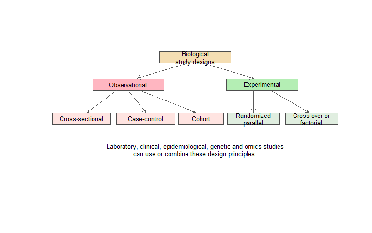
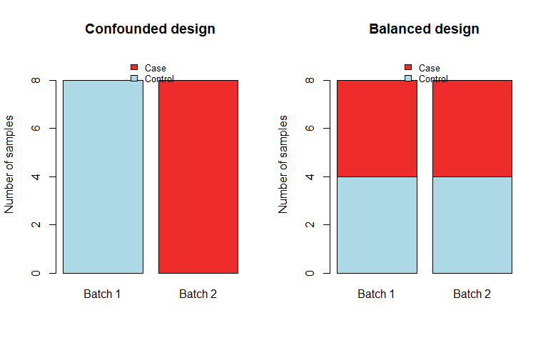
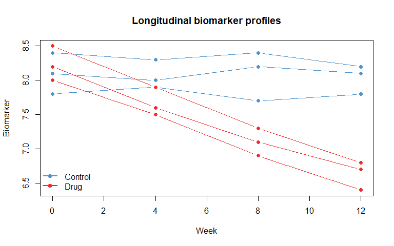
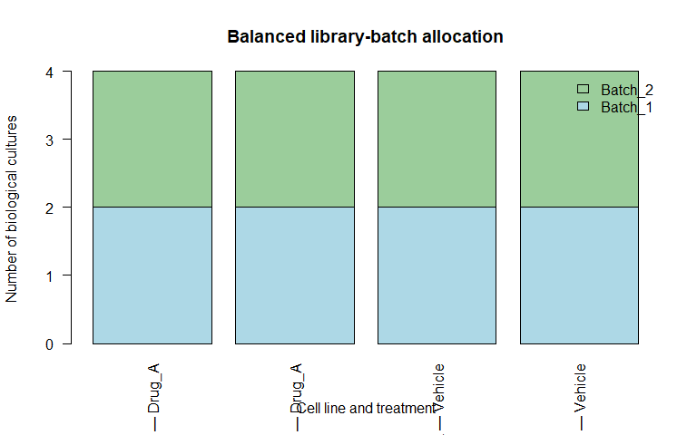

Chapter 5: Study Design in Biological Research
================
Sandeep Singh

- [1. Introduction](#1-introduction)
- [2. Learning Objectives](#2-learning-objectives)
- [3. Start with a Research Question](#3-start-with-a-research-question)
  - [3.1 PICO framework](#31-pico-framework)
  - [3.2 A genetics-oriented
    framework](#32-a-genetics-oriented-framework)
- [4. Study Objective: Description, Association, Prediction or
  Causation?](#4-study-objective-description-association-prediction-or-causation)
  - [4.1 Description](#41-description)
  - [4.2 Association](#42-association)
  - [4.3 Prediction](#43-prediction)
  - [4.4 Causal effect](#44-causal-effect)
- [5. Major Families of Study Design](#5-major-families-of-study-design)
- [6. Observational Studies](#6-observational-studies)
- [7. Cross-Sectional Studies](#7-cross-sectional-studies)
  - [7.1 Strengths](#71-strengths)
  - [7.2 Limitations](#72-limitations)
  - [7.3 Bioinformatics example](#73-bioinformatics-example)
- [8. Case-Control Studies](#8-case-control-studies)
  - [8.1 Strengths](#81-strengths)
  - [8.2 Limitations](#82-limitations)
  - [8.3 Selecting controls](#83-selecting-controls)
  - [8.4 Odds ratio](#84-odds-ratio)
- [9. Cohort Studies](#9-cohort-studies)
  - [9.1 Prospective cohort](#91-prospective-cohort)
  - [9.2 Retrospective cohort](#92-retrospective-cohort)
  - [9.3 Strengths](#93-strengths)
  - [9.4 Limitations](#94-limitations)
- [10. Prospective and Retrospective Are Not Synonyms for Design
  Type](#10-prospective-and-retrospective-are-not-synonyms-for-design-type)
- [11. Experimental and Interventional
  Studies](#11-experimental-and-interventional-studies)
- [12. Randomized Controlled Trials](#12-randomized-controlled-trials)
  - [12.1 Why randomize?](#121-why-randomize)
  - [12.2 Control group](#122-control-group)
  - [12.3 Parallel-group design](#123-parallel-group-design)
  - [12.4 Intention-to-treat
    principle](#124-intention-to-treat-principle)
- [13. Simple Randomization in R](#13-simple-randomization-in-r)
- [14. Allocation Concealment and
  Blinding](#14-allocation-concealment-and-blinding)
  - [14.1 Allocation concealment](#141-allocation-concealment)
  - [14.2 Blinding](#142-blinding)
  - [14.3 Why the distinction matters](#143-why-the-distinction-matters)
- [15. Experimental Unit, Measurement Unit and Analysis
  Unit](#15-experimental-unit-measurement-unit-and-analysis-unit)
  - [15.1 Experimental unit](#151-experimental-unit)
  - [15.2 Measurement unit](#152-measurement-unit)
  - [15.3 Unit of analysis](#153-unit-of-analysis)
  - [15.4 Example: mice in cages](#154-example-mice-in-cages)
- [16. Pseudoreplication](#16-pseudoreplication)
  - [16.1 Illustrative example](#161-illustrative-example)
- [17. Biological and Technical
  Replication](#17-biological-and-technical-replication)
  - [17.1 Biological replicates](#171-biological-replicates)
  - [17.2 Technical replicates](#172-technical-replicates)
  - [17.3 Replicate identifiers](#173-replicate-identifiers)
- [18. Blocking](#18-blocking)
  - [18.1 Blocked randomization in R](#181-blocked-randomization-in-r)
- [19. Batch Effects and Confounding in
  Omics](#19-batch-effects-and-confounding-in-omics)
  - [19.1 Confounded batch design](#191-confounded-batch-design)
  - [19.2 Balanced batch design](#192-balanced-batch-design)
- [20. Randomization in Laboratory
  Workflows](#20-randomization-in-laboratory-workflows)
  - [20.1 Why randomize processing
    order?](#201-why-randomize-processing-order)
  - [20.2 Record the randomization
    plan](#202-record-the-randomization-plan)
- [21. Factorial Designs](#21-factorial-designs)
  - [21.1 Create the design in R](#211-create-the-design-in-r)
- [22. Cross-Over Designs](#22-cross-over-designs)
  - [22.1 Requirements and
    limitations](#221-requirements-and-limitations)
- [23. Repeated-Measures and Longitudinal
  Designs](#23-repeated-measures-and-longitudinal-designs)
  - [23.1 Simulated longitudinal
    profiles](#231-simulated-longitudinal-profiles)
- [24. Before-and-After Designs](#24-before-and-after-designs)
- [25. Clinical Trial Design
  Concepts](#25-clinical-trial-design-concepts)
  - [25.1 Primary outcome](#251-primary-outcome)
  - [25.2 Surrogate outcomes](#252-surrogate-outcomes)
  - [25.3 Multiple outcomes](#253-multiple-outcomes)
- [26. Bias](#26-bias)
  - [26.1 Selection bias](#261-selection-bias)
  - [26.2 Information bias](#262-information-bias)
  - [26.3 Confounding](#263-confounding)
- [27. Matching](#27-matching)
  - [27.1 Risks of matching](#271-risks-of-matching)
- [28. Restriction and
  Stratification](#28-restriction-and-stratification)
  - [28.1 Restriction](#281-restriction)
  - [28.2 Stratification](#282-stratification)
- [29. Population-Based Genetic Association
  Studies](#29-population-based-genetic-association-studies)
  - [29.1 Major design considerations](#291-major-design-considerations)
  - [29.2 Population stratification](#292-population-stratification)
- [30. Family-Based Genetic Designs](#30-family-based-genetic-designs)
  - [30.1 Advantages](#301-advantages)
  - [30.2 Limitations](#302-limitations)
  - [30.3 Trio example](#303-trio-example)
- [31. Omics Study Design](#31-omics-study-design)
  - [31.1 Design questions before generating
    data](#311-design-questions-before-generating-data)
  - [31.2 Avoid sample–batch
    confounding](#312-avoid-samplebatch-confounding)
  - [31.3 Record metadata](#313-record-metadata)
- [32. RNA-Seq Design Example](#32-rna-seq-design-example)
- [33. Single-Cell Study Design](#33-single-cell-study-design)
- [34. Sample Size and Power Begin at the Design
  Stage](#34-sample-size-and-power-begin-at-the-design-stage)
  - [34.1 More samples are not always the only
    solution](#341-more-samples-are-not-always-the-only-solution)
- [35. Generalizability and External
  Validity](#35-generalizability-and-external-validity)
- [36. Preregistration, Protocols and Analysis
  Plans](#36-preregistration-protocols-and-analysis-plans)
- [37. Integrated Case Study: Design an RNA-Seq Drug-Response
  Experiment](#37-integrated-case-study-design-an-rna-seq-drug-response-experiment)
  - [37.1 Biological question](#371-biological-question)
  - [37.2 Study objective](#372-study-objective)
  - [37.3 Experimental units](#373-experimental-units)
  - [37.4 Proposed factors](#374-proposed-factors)
  - [37.5 Create the design in R](#375-create-the-design-in-r)
  - [37.6 Balance library batches](#376-balance-library-batches)
  - [37.7 Randomize processing order](#377-randomize-processing-order)
  - [37.8 Design diagram](#378-design-diagram)
  - [37.9 Prespecified metadata](#379-prespecified-metadata)
  - [37.10 Primary analysis concept](#3710-primary-analysis-concept)
- [38. Study Design Checklist](#38-study-design-checklist)
  - [Scientific question](#scientific-question)
  - [Population and sampling](#population-and-sampling)
  - [Units and dependence](#units-and-dependence)
  - [Comparison and assignment](#comparison-and-assignment)
  - [Bias control](#bias-control)
  - [Technical design](#technical-design)
  - [Analysis planning](#analysis-planning)
- [39. Common Beginner Mistakes](#39-common-beginner-mistakes)
  - [Mistake 1: Choosing a test before defining the
    design](#mistake-1-choosing-a-test-before-defining-the-design)
  - [Mistake 2: Counting technical measurements as biological
    replicates](#mistake-2-counting-technical-measurements-as-biological-replicates)
  - [Mistake 3: Confounding biological group with
    batch](#mistake-3-confounding-biological-group-with-batch)
  - [Mistake 4: Assuming randomization guarantees perfect
    balance](#mistake-4-assuming-randomization-guarantees-perfect-balance)
  - [Mistake 5: Confusing allocation concealment with
    blinding](#mistake-5-confusing-allocation-concealment-with-blinding)
  - [Mistake 6: Using convenient
    controls](#mistake-6-using-convenient-controls)
  - [Mistake 7: Treating association as
    causation](#mistake-7-treating-association-as-causation)
  - [Mistake 8: Ignoring repeated
    measurements](#mistake-8-ignoring-repeated-measurements)
  - [Mistake 9: Matching without planning the
    analysis](#mistake-9-matching-without-planning-the-analysis)
  - [Mistake 10: Recording too little
    metadata](#mistake-10-recording-too-little-metadata)
  - [Mistake 11: Defining exclusions after seeing
    results](#mistake-11-defining-exclusions-after-seeing-results)
  - [Mistake 12: Believing large sample size fixes poor
    design](#mistake-12-believing-large-sample-size-fixes-poor-design)
- [40. Chapter Summary](#40-chapter-summary)
- [41. Check Your Understanding](#41-check-your-understanding)
  - [Question 1](#question-1)
  - [Question 2](#question-2)
  - [Question 3](#question-3)
  - [Question 4](#question-4)
  - [Question 5](#question-5)
  - [Question 6](#question-6)
  - [Question 7](#question-7)
  - [Question 8](#question-8)
  - [Question 9](#question-9)
  - [Question 10](#question-10)
- [42. Practice with R](#42-practice-with-r)
  - [Exercise 1: Create a simple randomization
    schedule](#exercise-1-create-a-simple-randomization-schedule)
  - [Exercise 2: Block by cell line](#exercise-2-block-by-cell-line)
  - [Exercise 3: Diagnose
    pseudoreplication](#exercise-3-diagnose-pseudoreplication)
  - [Exercise 4: Evaluate batch
    allocation](#exercise-4-evaluate-batch-allocation)
  - [Exercise 5: Build a factorial
    design](#exercise-5-build-a-factorial-design)
  - [Exercise 6: Classify designs](#exercise-6-classify-designs)
- [43. Mini-Project: Design a Biological Study Before Collecting
  Data](#43-mini-project-design-a-biological-study-before-collecting-data)
- [44. Glossary](#44-glossary)
- [45. References and Further
  Reading](#45-references-and-further-reading)
- [46. Reproducibility Information](#46-reproducibility-information)

# 1. Introduction

Statistical analysis begins long before data are entered into R.

Researchers must first decide:

- which biological question will be studied;
- who or what belongs to the target population;
- which observations will be collected;
- how comparison groups will be formed;
- when measurements will be taken;
- how biological and technical variation will be handled; and
- which biases could threaten the conclusion.

These decisions form the **study design**.

A sophisticated statistical model cannot fully repair a poorly designed
study. If every treated sample is processed in one sequencing batch and
every control sample in another, treatment and batch are completely
confounded. No later calculation can reliably separate their effects.

> **Good study design creates interpretable evidence. Statistical
> analysis then quantifies that evidence and its uncertainty.**

This chapter introduces the major study designs used in biology,
medicine, epidemiology, genetics and bioinformatics.

------------------------------------------------------------------------

# 2. Learning Objectives

After completing this chapter, you should be able to:

1.  explain why study design comes before statistical testing;
2.  convert a broad biological idea into a focused research question;
3.  distinguish observational and experimental studies;
4.  describe cross-sectional, case-control and cohort designs;
5.  distinguish prospective and retrospective data collection;
6.  explain randomized controlled, laboratory and cross-over
    experiments;
7.  distinguish experimental units, measurement units and analysis
    units;
8.  recognize pseudoreplication;
9.  explain control groups, randomization, allocation concealment and
    blinding;
10. distinguish biological replication from technical replication;
11. use blocking and balanced batch allocation;
12. recognize selection, information and confounding biases;
13. describe repeated-measures and longitudinal designs;
14. compare population-based and family-based genetic designs;
15. identify important design issues in RNA-seq and other omics studies;
16. create a basic randomization schedule in R; and
17. prepare a structured study-design plan before collecting data.

------------------------------------------------------------------------

# 3. Start with a Research Question

A broad topic is not yet a research question.

Broad topic:

> Gene expression and diabetes.

More focused question:

> Among adults with newly diagnosed type 2 diabetes and non-diabetic
> controls, is the expression of Gene X in peripheral blood different
> after accounting for age, recorded sex and sequencing batch?

A well-defined question should clarify:

- the population;
- the main exposure or intervention;
- the comparison;
- the outcome;
- the time frame; and
- the intended interpretation.

## 3.1 PICO framework

The PICO framework is useful for many clinical and experimental
questions.

| Component | Meaning      | Example                                       |
|-----------|--------------|-----------------------------------------------|
| P         | Population   | Adults with hypertension                      |
| I         | Intervention | New antihypertensive drug                     |
| C         | Comparison   | Standard treatment                            |
| O         | Outcome      | Change in systolic blood pressure at 12 weeks |

For observational studies, the `I` is commonly interpreted as an
exposure rather than an assigned intervention.

## 3.2 A genetics-oriented framework

For a genetic association study, specify:

- target population and ancestry context;
- phenotype definition;
- genetic exposure or variant set;
- comparison or coding model;
- covariates;
- relatedness structure; and
- intended population-level interpretation.

------------------------------------------------------------------------

# 4. Study Objective: Description, Association, Prediction or Causation?

The study objective affects the design.

## 4.1 Description

Example:

> What proportion of sequenced samples carries a particular allele?

## 4.2 Association

Example:

> Is allele dosage associated with LDL cholesterol?

## 4.3 Prediction

Example:

> Can clinical and genomic variables predict treatment response in
> future patients?

## 4.4 Causal effect

Example:

> Does the treatment reduce blood pressure compared with standard care?

An association study does not automatically estimate a causal effect.
Prediction can be accurate even when the predictors are not causal. The
intended claim must be specified before choosing the design and
analysis.

------------------------------------------------------------------------

# 5. Major Families of Study Design

Studies are commonly divided into:

1.  **observational studies**, in which the researcher observes
    exposures or characteristics without assigning them; and
2.  **experimental or interventional studies**, in which the researcher
    assigns an intervention or condition.

``` r
plot.new()
plot.window(xlim = c(0, 10), ylim = c(0, 10))

design_box <- function(x, y, label, width = 2.45, height = 0.85,
                       colour = "lightblue") {
  rect(
    x - width / 2,
    y - height / 2,
    x + width / 2,
    y + height / 2,
    col = colour,
    border = "gray30",
    lwd = 1.4
  )
  text(x, y, label, cex = 0.82)
}

design_arrow <- function(x0, y0, x1, y1) {
  arrows(
    x0, y0, x1, y1,
    length = 0.08,
    lwd = 1.3,
    col = "gray35"
  )
}

design_box(5.0, 9.0, "Biological\nstudy designs", colour = "wheat")
design_box(2.7, 7.0, "Observational", colour = "lightpink")
design_box(7.3, 7.0, "Experimental", colour = "darkseagreen2")

design_box(1.1, 4.5, "Cross-sectional", width = 2.0, colour = "mistyrose")
design_box(3.3, 4.5, "Case-control", width = 2.0, colour = "mistyrose")
design_box(5.2, 4.5, "Cohort", width = 1.55, colour = "mistyrose")
design_box(7.0, 4.5, "Randomized\nparallel", width = 1.8, colour = "honeydew2")
design_box(9.0, 4.5, "Cross-over or\nfactorial", width = 1.8, colour = "honeydew2")

design_arrow(4.7, 8.55, 3.0, 7.45)
design_arrow(5.3, 8.55, 7.0, 7.45)

design_arrow(2.3, 6.55, 1.3, 4.95)
design_arrow(2.7, 6.55, 3.3, 4.95)
design_arrow(3.1, 6.55, 5.0, 4.95)

design_arrow(7.0, 6.55, 7.0, 4.95)
design_arrow(7.6, 6.55, 8.9, 4.95)

text(
  5,
  2.25,
  "Laboratory, clinical, epidemiological, genetic and omics studies\ncan use or combine these design principles.",
  cex = 0.82
)
```

<div class="figure" style="text-align: center">


<p class="caption">

A simplified classification of major study designs used in biological
and health research.
</p>

</div>

This diagram is simplified. For example, an omics study may be nested
within a cohort or randomized trial.

------------------------------------------------------------------------

# 6. Observational Studies

In an observational study, the researcher does not assign the primary
exposure.

Examples include studying:

- smoking and lung disease;
- naturally occurring genotypes and disease risk;
- environmental exposure and gene expression;
- diet and cardiovascular outcomes; or
- existing clinical characteristics and survival.

Observational studies can identify patterns and associations, but causal
interpretation requires careful control of confounding, selection and
measurement processes.

The three common designs introduced here are:

- cross-sectional;
- case-control; and
- cohort.

------------------------------------------------------------------------

# 7. Cross-Sectional Studies

A **cross-sectional study** measures exposure and outcome at one time
point or during a short defined period.

Example:

> Measure current obesity status and current blood pressure in a
> community sample.

## 7.1 Strengths

- relatively quick;
- useful for estimating prevalence;
- can measure several variables simultaneously; and
- useful for generating hypotheses.

## 7.2 Limitations

- temporal order may be unclear;
- unsuitable for estimating incidence directly;
- survivor bias may occur; and
- rare or short-duration conditions may be poorly represented.

## 7.3 Bioinformatics example

A cross-sectional transcriptomic study might compare blood-expression
profiles between individuals with and without a disease at recruitment.

If disease status and expression are measured together, it may be
unclear whether expression differences contributed to disease, resulted
from disease or reflected treatment and other factors.

------------------------------------------------------------------------

# 8. Case-Control Studies

A **case-control study** begins by selecting individuals based on
outcome status.

- **Cases** have the outcome or disease.
- **Controls** do not have the outcome under the study definition.

Researchers then compare previous exposures, characteristics or
genotypes.

Example:

> Compare the frequency of a genetic variant between patients with a
> rare adverse drug reaction and suitable controls.

## 8.1 Strengths

- efficient for rare outcomes;
- can examine several exposures;
- often faster than following a large cohort; and
- useful when the disease has a long development period.

## 8.2 Limitations

- cannot directly estimate population risk without additional
  information;
- control selection can introduce serious bias;
- retrospective exposure measurement may be inaccurate; and
- temporal interpretation may remain uncertain.

## 8.3 Selecting controls

Controls should represent the population from which the cases arose with
respect to opportunity for case ascertainment.

Controls should not simply be the most convenient people available.

## 8.4 Odds ratio

Case-control studies commonly estimate an odds ratio. The odds ratio can
approximate a risk ratio under certain rare-outcome conditions, but they
are not generally identical.

------------------------------------------------------------------------

# 9. Cohort Studies

A **cohort study** begins with individuals classified by exposure or
other baseline characteristics and observes outcomes over time.

Example:

> Follow carriers and non-carriers of a genetic risk factor to compare
> disease occurrence.

## 9.1 Prospective cohort

Participants are enrolled before the relevant outcomes occur and
followed forward.

Advantages include planned measurements and clearer temporal ordering.

## 9.2 Retrospective cohort

The cohort and follow-up are reconstructed from existing records.

The direction of reasoning is still from exposure to outcome, even
though the data already exist.

## 9.3 Strengths

- can estimate incidence and risk;
- establishes exposure before outcome more clearly;
- can examine multiple outcomes; and
- supports repeated measurements.

## 9.4 Limitations

- may require long follow-up;
- can be expensive;
- loss to follow-up may bias results;
- inefficient for very rare outcomes; and
- exposures and treatments may change over time.

------------------------------------------------------------------------

# 10. Prospective and Retrospective Are Not Synonyms for Design Type

The terms describe when data are planned and collected relative to the
research process.

| Feature | Prospective | Retrospective |
|----|----|----|
| Data collection | Planned before outcomes or future observations | Uses existing records or stored specimens |
| Control over measurement | Often greater | Limited by existing information |
| Speed | Often slower | Often faster |
| Missing variables | Can be planned | May be unavailable permanently |

A cohort can be prospective or retrospective. A case-control study is
often retrospective regarding exposure information, but nested
case-control studies may be planned within a prospective cohort.

------------------------------------------------------------------------

# 11. Experimental and Interventional Studies

In an experimental study, the researcher assigns a treatment, exposure
or condition.

Examples include:

- assigning plants to fertilizer treatments;
- assigning cell cultures to drug doses;
- randomizing patients to clinical treatments; and
- assigning sequencing libraries to preparation batches.

Assignment provides stronger control over confounding than observation
alone, especially when randomization is implemented correctly.

However, experiments can still suffer from:

- non-adherence;
- missing outcomes;
- measurement bias;
- contamination between groups;
- small sample size;
- batch effects; and
- inappropriate analysis.

------------------------------------------------------------------------

# 12. Randomized Controlled Trials

A **randomized controlled trial** assigns eligible participants to
intervention groups using a random mechanism.

## 12.1 Why randomize?

Randomization aims to make treatment assignment independent of baseline
characteristics, including characteristics that were not measured.

In sufficiently large samples, it tends to create comparable groups on
average. It does not guarantee perfect balance in one particular small
study.

## 12.2 Control group

A control group provides the comparison needed to interpret what would
have happened without the intervention of interest.

Controls may receive:

- placebo;
- standard care;
- no intervention when ethically appropriate; or
- another active treatment.

## 12.3 Parallel-group design

Each participant receives one assigned intervention and is followed over
time.

## 12.4 Intention-to-treat principle

In many randomized trials, participants are analysed according to their
assigned group regardless of adherence. This helps preserve the
protection provided by randomization.

Trial analysis and reporting will be covered in a later
clinical-biostatistics chapter.

------------------------------------------------------------------------

# 13. Simple Randomization in R

Suppose 12 experimental cultures must be assigned equally to control and
drug treatment.

``` r
culture_id <- paste0("C", sprintf("%02d", 1:12))

allocation <- sample(
  rep(c("Control", "Drug"), each = 6)
)

randomization_schedule <- data.frame(
  culture_id = culture_id,
  assigned_group = allocation,
  stringsAsFactors = FALSE
)

randomization_schedule
```

<div class="kable-table">

| culture_id | assigned_group |
|:-----------|:---------------|
| C01        | Control        |
| C02        | Drug           |
| C03        | Drug           |
| C04        | Control        |
| C05        | Control        |
| C06        | Drug           |
| C07        | Control        |
| C08        | Control        |
| C09        | Drug           |
| C10        | Drug           |
| C11        | Control        |
| C12        | Drug           |

</div>

``` r
table(randomization_schedule$assigned_group)
```

    ## 
    ## Control    Drug 
    ##       6       6

`set.seed()` was used in the hidden setup chunk so this teaching
allocation is reproducible.

In a real regulated trial, allocation generation, storage and
concealment require secure procedures beyond running `sample()` in an
analysis script.

------------------------------------------------------------------------

# 14. Allocation Concealment and Blinding

These concepts are related but different.

## 14.1 Allocation concealment

Allocation concealment prevents the upcoming assignment from being known
before enrolment or assignment.

It protects against consciously or unconsciously selecting participants
based on the next treatment.

## 14.2 Blinding

Blinding prevents participants, care providers, outcome assessors or
analysts from knowing assigned treatment when that knowledge could
influence behaviour, measurement or interpretation.

## 14.3 Why the distinction matters

- Allocation concealment acts **before and during assignment**.
- Blinding acts **after assignment**.

A trial can have concealed allocation but no participant blinding, such
as some surgical or behavioural interventions.

In laboratory studies, coded sample labels can help blind technicians
and analysts to biological groups.

------------------------------------------------------------------------

# 15. Experimental Unit, Measurement Unit and Analysis Unit

These units may differ.

## 15.1 Experimental unit

The **experimental unit** is the smallest independent unit that can
receive a treatment assignment.

## 15.2 Measurement unit

The **measurement unit** is the unit on which a measurement is recorded.

## 15.3 Unit of analysis

The **unit of analysis** is the unit treated as independent in the
statistical model.

## 15.4 Example: mice in cages

Suppose four cages each contain five mice, and treatment is added to the
drinking water of an entire cage.

- Treatment is assigned to cages.
- Weight is measured on individual mice.
- The cage is the experimental unit.
- Mice within the same cage are not independent treatment replicates.

Analysing 20 mice as 20 independent treatment assignments would
exaggerate the effective amount of information.

------------------------------------------------------------------------

# 16. Pseudoreplication

**Pseudoreplication** occurs when non-independent measurements are
treated as independent evidence for a treatment effect.

Common examples include:

- several cells measured from one culture treated as independent
  cultures;
- multiple technical wells treated as independent biological samples;
- multiple mice from one treatment-assigned cage treated as independent
  assignments;
- many sequencing reads treated as independent patients; or
- repeated measurements from one participant analysed as different
  participants.

## 16.1 Illustrative example

A researcher uses:

- one control culture; and
- one treated culture.

One hundred cells are measured from each culture.

The study has many measured cells but only one biological culture per
condition. It cannot estimate between-culture biological variability and
does not have 100 independent biological replicates per group.

> **More measurements within one biological unit improve measurement
> precision but do not create new independent biological units.**

------------------------------------------------------------------------

# 17. Biological and Technical Replication

## 17.1 Biological replicates

Biological replicates are independently sampled biological units.

Examples include:

- different patients;
- independently grown cell cultures;
- different animals; or
- distinct tissue specimens.

They help estimate biological variability.

## 17.2 Technical replicates

Technical replicates repeat measurement or processing of the same
biological material.

Examples include:

- repeated qPCR wells;
- repeated instrument readings;
- duplicate libraries from one RNA sample; or
- repeated sequencing of one library.

They help assess technical variability or improve measurement precision.

## 17.3 Replicate identifiers

``` r
replicate_data <- data.frame(
  subject_id = rep(c("P01", "P02", "P03"), each = 2),
  biospecimen_id = rep(c("B01", "B02", "B03"), each = 2),
  technical_replicate = rep(c("R1", "R2"), times = 3),
  expression = c(8.1, 8.3, 9.4, 9.2, 7.8, 7.9)
)

replicate_data
```

<div class="kable-table">

| subject_id | biospecimen_id | technical_replicate | expression |
|:-----------|:---------------|:--------------------|-----------:|
| P01        | B01            | R1                  |        8.1 |
| P01        | B01            | R2                  |        8.3 |
| P02        | B02            | R1                  |        9.4 |
| P02        | B02            | R2                  |        9.2 |
| P03        | B03            | R1                  |        7.8 |
| P03        | B03            | R2                  |        7.9 |

</div>

The six measurements do not represent six independent patients.

------------------------------------------------------------------------

# 18. Blocking

**Blocking** groups similar experimental units before randomization so
that known nuisance variation is distributed across treatment groups.

Potential blocking factors include:

- sex or age category;
- laboratory day;
- cell line;
- plate;
- centre;
- litter; or
- sequencing batch.

Within each block, units are randomized to treatments.

## 18.1 Blocked randomization in R

Suppose eight cultures come from two cell lines.

``` r
blocked_design <- data.frame(
  culture_id = paste0("C", 1:8),
  cell_line = rep(c("Line_A", "Line_B"), each = 4),
  stringsAsFactors = FALSE
)

blocked_design$assigned_group <- unlist(
  lapply(
    split(blocked_design$culture_id, blocked_design$cell_line),
    function(ids) sample(rep(c("Control", "Drug"), each = length(ids) / 2))
  )
)

blocked_design
```

<div class="kable-table">

| culture_id | cell_line | assigned_group |
|:-----------|:----------|:---------------|
| C1         | Line_A    | Drug           |
| C2         | Line_A    | Control        |
| C3         | Line_A    | Drug           |
| C4         | Line_A    | Control        |
| C5         | Line_B    | Control        |
| C6         | Line_B    | Drug           |
| C7         | Line_B    | Drug           |
| C8         | Line_B    | Control        |

</div>

``` r
table(
  blocked_design$cell_line,
  blocked_design$assigned_group
)
```

    ##         
    ##          Control Drug
    ##   Line_A       2    2
    ##   Line_B       2    2

The code balances treatments within each cell line. In a real study,
verify row alignment carefully when creating allocation schedules from
split data.

------------------------------------------------------------------------

# 19. Batch Effects and Confounding in Omics

A **batch effect** is systematic technical variation associated with
processing groups such as:

- sequencing run;
- library-preparation date;
- reagent lot;
- plate;
- laboratory; or
- technician.

Batch effects become especially dangerous when batch is aligned with the
biological comparison.

## 19.1 Confounded batch design

If every control sample is processed in Batch 1 and every case sample in
Batch 2, disease status and batch cannot be separated reliably.

## 19.2 Balanced batch design

Cases and controls should be distributed across batches when possible,
while respecting other constraints.

``` r
confounded <- matrix(
  c(8, 0,
    0, 8),
  nrow = 2,
  byrow = TRUE,
  dimnames = list(
    Group = c("Control", "Case"),
    Batch = c("Batch 1", "Batch 2")
  )
)

balanced <- matrix(
  c(4, 4,
    4, 4),
  nrow = 2,
  byrow = TRUE,
  dimnames = list(
    Group = c("Control", "Case"),
    Batch = c("Batch 1", "Batch 2")
  )
)

par(mfrow = c(1, 2))

barplot(
  confounded,
  beside = FALSE,
  col = c("lightblue", "firebrick2"),
  ylim = c(0, 9),
  ylab = "Number of samples",
  main = "Confounded design",
  legend.text = rownames(confounded),
  args.legend = list(x = "top", bty = "n", cex = 0.8)
)

barplot(
  balanced,
  beside = FALSE,
  col = c("lightblue", "firebrick2"),
  ylim = c(0, 9),
  ylab = "Number of samples",
  main = "Balanced design",
  legend.text = rownames(balanced),
  args.legend = list(x = "top", bty = "n", cex = 0.8)
)
```

<div class="figure" style="text-align: center">


<p class="caption">

A confounded design places each biological group in a different batch. A
balanced design distributes both groups across batches.
</p>

</div>

``` r
par(mfrow = c(1, 1))
```

Statistical batch adjustment can help when biological groups overlap
across batches. It cannot fully recover information that the design
never contained.

------------------------------------------------------------------------

# 20. Randomization in Laboratory Workflows

Randomization can be applied at several stages:

- assigning biological units to treatment;
- assigning samples to plates;
- assigning wells within a plate;
- selecting processing order;
- assigning libraries to sequencing lanes; and
- choosing measurement order.

## 20.1 Why randomize processing order?

Instrument drift or changing reagent performance can create trends over
time. If all controls are measured first and all treated samples later,
processing order can mimic a treatment effect.

## 20.2 Record the randomization plan

The plan should include:

- randomization unit;
- blocking variables;
- allocation ratio;
- random seed or secure generation procedure;
- restrictions used; and
- final schedule.

Randomization should be planned before outcomes are examined.

------------------------------------------------------------------------

# 21. Factorial Designs

A **factorial design** studies two or more experimental factors
simultaneously.

Example:

- Factor 1: drug versus control;
- Factor 2: normal oxygen versus low oxygen.

The design contains four conditions:

| Drug    | Oxygen condition |
|---------|------------------|
| Control | Normal           |
| Drug    | Normal           |
| Control | Low              |
| Drug    | Low              |

A factorial design can estimate:

- the average drug effect;
- the average oxygen effect; and
- whether the drug effect changes under low oxygen, called an
  **interaction**.

## 21.1 Create the design in R

``` r
factorial_design <- expand.grid(
  drug = c("Control", "Drug"),
  oxygen = c("Normal", "Low"),
  replicate = 1:3,
  KEEP.OUT.ATTRS = FALSE,
  stringsAsFactors = FALSE
)

factorial_design
```

<div class="kable-table">

| drug    | oxygen | replicate |
|:--------|:-------|----------:|
| Control | Normal |         1 |
| Drug    | Normal |         1 |
| Control | Low    |         1 |
| Drug    | Low    |         1 |
| Control | Normal |         2 |
| Drug    | Normal |         2 |
| Control | Low    |         2 |
| Drug    | Low    |         2 |
| Control | Normal |         3 |
| Drug    | Normal |         3 |
| Control | Low    |         3 |
| Drug    | Low    |         3 |

</div>

``` r
table(
  factorial_design$drug,
  factorial_design$oxygen
)
```

    ##          
    ##           Low Normal
    ##   Control   3      3
    ##   Drug      3      3

Factorial designs can be more efficient than conducting separate
experiments, but interactions and experimental units must be planned
carefully.

------------------------------------------------------------------------

# 22. Cross-Over Designs

In a **cross-over design**, each participant receives more than one
treatment during different periods.

Example sequence:

- Group 1: Treatment A, washout, Treatment B;
- Group 2: Treatment B, washout, Treatment A.

Each participant can serve as their own control, reducing between-person
variability.

## 22.1 Requirements and limitations

Cross-over designs are most suitable when:

- the condition is stable;
- treatment effects are reversible;
- a sufficient washout period is possible; and
- carry-over effects can be controlled.

They may be inappropriate for curative treatments, rapidly changing
diseases or interventions with lasting effects.

Analysis must account for repeated measurements, period and sequence.

------------------------------------------------------------------------

# 23. Repeated-Measures and Longitudinal Designs

A **repeated-measures design** records the same unit more than once. A
**longitudinal study** follows units over time.

Examples include:

- blood pressure at baseline, week 4 and week 12;
- gene expression before and after treatment;
- tumour size across clinical visits; and
- microbiome composition at multiple time points.

Measurements from the same individual are correlated.

## 23.1 Simulated longitudinal profiles

``` r
longitudinal_data <- data.frame(
  patient_id = rep(paste0("P", 1:6), each = 4),
  treatment = rep(
    rep(c("Control", "Drug"), each = 3),
    each = 4
  ),
  week = rep(c(0, 4, 8, 12), times = 6),
  biomarker = c(
    8.1, 8.0, 8.2, 8.1,
    7.8, 7.9, 7.7, 7.8,
    8.4, 8.3, 8.4, 8.2,
    8.2, 7.6, 7.1, 6.7,
    8.0, 7.5, 6.9, 6.4,
    8.5, 7.9, 7.3, 6.8
  )
)

head(longitudinal_data, 8)
```

<div class="kable-table">

| patient_id | treatment | week | biomarker |
|:-----------|:----------|-----:|----------:|
| P1         | Control   |    0 |       8.1 |
| P1         | Control   |    4 |       8.0 |
| P1         | Control   |    8 |       8.2 |
| P1         | Control   |   12 |       8.1 |
| P2         | Control   |    0 |       7.8 |
| P2         | Control   |    4 |       7.9 |
| P2         | Control   |    8 |       7.7 |
| P2         | Control   |   12 |       7.8 |

</div>

``` r
plot(
  NA,
  xlim = range(longitudinal_data$week),
  ylim = range(longitudinal_data$biomarker),
  xlab = "Week",
  ylab = "Biomarker",
  main = "Longitudinal biomarker profiles"
)

patient_colours <- c(
  rep("steelblue3", 3),
  rep("firebrick2", 3)
)

for (i in seq_along(unique(longitudinal_data$patient_id))) {
  patient_name <- unique(longitudinal_data$patient_id)[i]
  patient_rows <- longitudinal_data$patient_id == patient_name

  lines(
    longitudinal_data$week[patient_rows],
    longitudinal_data$biomarker[patient_rows],
    type = "b",
    pch = 19,
    col = patient_colours[i]
  )
}

legend(
  "bottomleft",
  legend = c("Control", "Drug"),
  col = c("steelblue3", "firebrick2"),
  lwd = 2,
  pch = 19,
  bty = "n"
)
```

<div class="figure" style="text-align: center">


<p class="caption">

Repeated biomarker measurements from the same patients are connected and
are not statistically independent.
</p>

</div>

Later chapters will introduce repeated-measures ANOVA and mixed-effects
models.

------------------------------------------------------------------------

# 24. Before-and-After Designs

A simple before-and-after design measures outcomes before and after an
intervention in the same units.

Advantages:

- each unit serves as its own reference; and
- stable between-unit differences are controlled.

Limitations without a concurrent control group:

- natural time trends;
- regression to the mean;
- changes in measurement;
- seasonal effects;
- co-interventions; and
- spontaneous recovery.

A change after treatment is not necessarily caused by treatment.

------------------------------------------------------------------------

# 25. Clinical Trial Design Concepts

Clinical trials require ethical oversight, prospective protocols and
detailed operational procedures.

Important concepts include:

- eligibility criteria;
- informed consent;
- predefined primary and secondary outcomes;
- comparator choice;
- allocation ratio;
- randomization and concealment;
- blinding;
- adherence;
- adverse-event monitoring;
- follow-up schedule;
- missing-data handling;
- analysis population; and
- trial registration.

## 25.1 Primary outcome

The primary outcome should be specified before data examination because
it guides sample-size planning and the main conclusion.

## 25.2 Surrogate outcomes

A biomarker may respond quickly but may not reliably represent the
clinical outcome that matters to patients. Surrogate validity must be
justified.

## 25.3 Multiple outcomes

Measuring many outcomes increases the opportunity for selective emphasis
and false-positive results. Outcome hierarchy and multiplicity handling
should be planned.

------------------------------------------------------------------------

# 26. Bias

**Bias** is a systematic process that can move an estimate away from the
target truth.

Random error produces variability. Bias produces systematic distortion.

Three broad categories are introduced here.

## 26.1 Selection bias

Selection bias occurs when inclusion, participation, follow-up or
analysis depends on factors related to the exposure and outcome.

Examples:

- controls selected from an inappropriate source population;
- volunteers differing from non-volunteers;
- differential loss to follow-up; or
- omics samples selected because high-quality material was more
  available in one group.

## 26.2 Information bias

Information bias arises from systematic measurement or classification
errors.

Examples:

- cases recalling exposure differently from controls;
- outcome assessors influenced by treatment knowledge;
- one group measured with a different instrument; or
- genotype calling quality differing by phenotype group.

## 26.3 Confounding

Confounding occurs when the exposure–outcome relationship is mixed with
the effect of another factor.

Example:

Age may be related to both treatment selection and clinical outcome.

Randomization can prevent confounding by baseline characteristics on
average. Observational studies require design and analytical strategies
such as restriction, matching, stratification, adjustment or weighting,
each with assumptions and trade-offs.

------------------------------------------------------------------------

# 27. Matching

**Matching** selects comparison observations with similar values of
specified variables.

Examples include matching cases and controls on:

- age;
- recorded sex;
- study centre; or
- ancestry group.

Matching can improve comparability or efficiency, but it creates design
constraints that must be reflected in the analysis.

## 27.1 Risks of matching

- matching on variables unrelated to confounding can reduce efficiency;
- matching on consequences of exposure can introduce bias;
- overmatching can make cases and controls too similar in relevant
  exposure patterns; and
- unmatched analysis can be inappropriate for individually matched data.

Matching is not a substitute for careful causal reasoning.

------------------------------------------------------------------------

# 28. Restriction and Stratification

## 28.1 Restriction

Restriction limits eligibility to one level or range of a variable.

Example:

> Include only participants within one specified ancestry group for an
> initial genetic analysis.

Restriction may reduce confounding but narrows generalizability and
prevents evaluation of the restricted factor.

## 28.2 Stratification

Stratification examines results within levels of a variable.

Example:

> Estimate treatment associations separately for younger and older
> participants.

Stratification can reveal confounding or effect modification, but too
many strata can produce sparse data.

------------------------------------------------------------------------

# 29. Population-Based Genetic Association Studies

Population-based studies compare genotypes or allele dosages across
unrelated or approximately unrelated individuals.

Common designs include:

- case-control GWAS;
- quantitative-trait GWAS;
- population cohort studies; and
- biobank analyses.

## 29.1 Major design considerations

- phenotype definition;
- ancestry and population structure;
- relatedness;
- genotyping platform and batch;
- imputation reference and quality;
- age, sex and other relevant covariates;
- case-control ascertainment;
- sample overlap; and
- replication in independent data.

## 29.2 Population stratification

Allele frequencies and disease risks may differ across ancestry-related
population structure. If structure is associated with both genotype and
phenotype, spurious associations can arise.

Design and analysis may use:

- careful sampling;
- ancestry-aware quality control;
- principal components;
- mixed models; and
- replication across suitable populations.

Genetic ancestry, self-identified race and ethnicity are related in some
contexts but are not interchangeable variables.

------------------------------------------------------------------------

# 30. Family-Based Genetic Designs

Family-based designs include:

- affected sibling pairs;
- parent-offspring trios;
- pedigrees;
- twins; and
- extended families.

## 30.1 Advantages

- useful for studying transmission;
- can be robust to some forms of population stratification;
- allow study of relatedness and inheritance; and
- support rare-disease and linkage analyses.

## 30.2 Limitations

- families may be difficult to recruit;
- observations are correlated;
- missing family members reduce information;
- analyses require specialized methods; and
- results may not generalize beyond ascertained families.

## 30.3 Trio example

A trio contains an affected child and two biological parents.
Transmission-based tests compare transmitted and non-transmitted alleles
from heterozygous parents.

The family ID and relationship structure must be preserved in the
dataset.

------------------------------------------------------------------------

# 31. Omics Study Design

High-dimensional omics studies measure many features simultaneously.

Examples include:

- gene expression;
- DNA methylation;
- chromatin accessibility;
- proteomics;
- metabolomics; and
- single-cell measurements.

## 31.1 Design questions before generating data

- What is the biological unit?
- How many independent biological replicates are available?
- Which covariates and batches require balance?
- Will samples be processed in randomized order?
- Are cases and controls mixed across plates and runs?
- Are technical replicates needed?
- How will low-quality samples be handled?
- Is the primary analysis based on raw counts, normalized values or
  another scale?
- How will multiple testing be addressed?

## 31.2 Avoid sample–batch confounding

Every biological group should overlap with every major technical batch
whenever practical.

## 31.3 Record metadata

Useful metadata include:

- subject ID;
- specimen ID;
- tissue;
- collection time;
- extraction batch;
- library-preparation batch;
- plate and well;
- sequencing lane;
- operator;
- reagent lot; and
- QC metrics.

Unrecorded technical factors cannot be adjusted later.

------------------------------------------------------------------------

# 32. RNA-Seq Design Example

Suppose the aim is to compare gene expression between disease cases and
controls.

A weak design:

- six cases processed on Monday;
- six controls processed on Tuesday;
- one library-preparation batch per group; and
- one sequencing lane per group.

Disease status is confounded with day, library batch and lane.

A stronger design:

- define comparable eligibility criteria;
- collect important covariates;
- distribute cases and controls across preparation batches;
- randomize processing order;
- balance or record relevant demographic and clinical factors;
- use independent biological samples;
- predefine QC rules; and
- preserve raw counts and sample metadata.

Statistical adjustment cannot substitute for overlapping biological
groups across batches.

------------------------------------------------------------------------

# 33. Single-Cell Study Design

Single-cell data contain many cells, but the donor or biological
specimen often remains the main independent biological unit.

Ten thousand cells from one patient do not equal ten thousand
independent patients.

Important design considerations include:

- number of donors;
- cells per donor;
- tissue handling;
- dissociation protocol;
- multiplexing;
- lane and batch allocation;
- donor-level covariates;
- cell-type composition; and
- pseudobulk or mixed-model strategies.

This is another setting in which a very large number of measurements can
coexist with a small biological sample size.

------------------------------------------------------------------------

# 34. Sample Size and Power Begin at the Design Stage

Formal calculations will be covered later, but study planning should
identify:

- primary outcome;
- target effect size;
- expected variability or event rate;
- significance level;
- desired power;
- allocation ratio;
- correlation in repeated measurements;
- clustering;
- anticipated missingness;
- multiple testing; and
- practical constraints.

## 34.1 More samples are not always the only solution

Precision can also improve through:

- better measurement;
- balanced groups;
- blocking;
- paired designs when appropriate;
- reducing batch confounding; and
- collecting strong baseline predictors.

However, no analytical technique creates independent biological
replicates that were never collected.

------------------------------------------------------------------------

# 35. Generalizability and External Validity

**Internal validity** concerns whether the study estimates the intended
relationship correctly within the studied sample.

**External validity** concerns whether results apply to other
populations, settings, times or measurement systems.

A tightly controlled laboratory experiment may have strong internal
validity but limited direct generalizability to humans. A diverse
population cohort may improve generalizability but contain more
uncontrolled variation.

Important questions include:

- Who was eligible?
- Who actually participated?
- Which samples passed QC?
- Which ancestries, ages and disease severities were represented?
- Were major groups excluded by data availability?
- Does the experimental dose resemble real exposure?

Generalization should not exceed the population supported by the design.

------------------------------------------------------------------------

# 36. Preregistration, Protocols and Analysis Plans

A prospective protocol reduces decisions made after seeing the results.

Useful prespecified elements include:

- research question;
- eligibility criteria;
- primary and secondary outcomes;
- exposure and intervention definitions;
- sample-size calculation;
- randomization and blinding;
- QC rules;
- exclusion criteria;
- statistical models;
- covariates;
- interaction tests;
- missing-data strategy;
- multiple-testing correction; and
- sensitivity analyses.

Not every exploratory analysis must be preregistered. Exploratory
analyses should be labelled honestly as exploratory.

------------------------------------------------------------------------

# 37. Integrated Case Study: Design an RNA-Seq Drug-Response Experiment

## 37.1 Biological question

> Does Drug A change gene expression in independently grown human cell
> cultures after 24 hours compared with vehicle control?

## 37.2 Study objective

Estimate the effect of Drug A on gene-expression counts while separating
treatment from cell-line and library-preparation variation.

## 37.3 Experimental units

Independently grown cultures are the experimental units. Multiple wells
or sequencing reads from one culture are not independent biological
treatment replicates.

## 37.4 Proposed factors

- two cell lines;
- two treatments: vehicle and Drug A;
- four biological cultures per cell-line–treatment combination;
- two library-preparation batches; and
- one sequencing library per biological culture.

## 37.5 Create the design in R

``` r
rna_design <- expand.grid(
  cell_line = c("Line_A", "Line_B"),
  treatment = c("Vehicle", "Drug_A"),
  biological_replicate = 1:4,
  KEEP.OUT.ATTRS = FALSE,
  stringsAsFactors = FALSE
)

rna_design$culture_id <- paste0(
  "C",
  sprintf("%02d", seq_len(nrow(rna_design)))
)

rna_design <- rna_design[
  order(
    rna_design$cell_line,
    rna_design$biological_replicate,
    rna_design$treatment
  ),
]

rownames(rna_design) <- NULL
rna_design
```

<div class="kable-table">

| cell_line | treatment | biological_replicate | culture_id |
|:----------|:----------|---------------------:|:-----------|
| Line_A    | Drug_A    |                    1 | C03        |
| Line_A    | Vehicle   |                    1 | C01        |
| Line_A    | Drug_A    |                    2 | C07        |
| Line_A    | Vehicle   |                    2 | C05        |
| Line_A    | Drug_A    |                    3 | C11        |
| Line_A    | Vehicle   |                    3 | C09        |
| Line_A    | Drug_A    |                    4 | C15        |
| Line_A    | Vehicle   |                    4 | C13        |
| Line_B    | Drug_A    |                    1 | C04        |
| Line_B    | Vehicle   |                    1 | C02        |
| Line_B    | Drug_A    |                    2 | C08        |
| Line_B    | Vehicle   |                    2 | C06        |
| Line_B    | Drug_A    |                    3 | C12        |
| Line_B    | Vehicle   |                    3 | C10        |
| Line_B    | Drug_A    |                    4 | C16        |
| Line_B    | Vehicle   |                    4 | C14        |

</div>

## 37.6 Balance library batches

Within each cell line and treatment, two cultures are assigned to each
library batch.

``` r
rna_design$library_batch <- ave(
  rna_design$biological_replicate,
  rna_design$cell_line,
  rna_design$treatment,
  FUN = function(x) sample(rep(c("Batch_1", "Batch_2"), each = 2))
)

table(
  rna_design$cell_line,
  rna_design$treatment,
  rna_design$library_batch
)
```

    ## , ,  = Batch_1
    ## 
    ##         
    ##          Drug_A Vehicle
    ##   Line_A      2       2
    ##   Line_B      2       2
    ## 
    ## , ,  = Batch_2
    ## 
    ##         
    ##          Drug_A Vehicle
    ##   Line_A      2       2
    ##   Line_B      2       2

## 37.7 Randomize processing order

``` r
rna_design$processing_order <- sample(
  seq_len(nrow(rna_design))
)

rna_design <- rna_design[
  order(rna_design$processing_order),
]

rownames(rna_design) <- NULL
rna_design
```

<div class="kable-table">

| cell_line | treatment | biological_replicate | culture_id | library_batch | processing_order |
|:---|:---|---:|:---|:---|---:|
| Line_B | Vehicle | 2 | C06 | Batch_2 | 1 |
| Line_B | Drug_A | 3 | C12 | Batch_2 | 2 |
| Line_B | Vehicle | 1 | C02 | Batch_1 | 3 |
| Line_B | Vehicle | 4 | C14 | Batch_2 | 4 |
| Line_A | Drug_A | 4 | C15 | Batch_2 | 5 |
| Line_B | Drug_A | 2 | C08 | Batch_1 | 6 |
| Line_A | Vehicle | 1 | C01 | Batch_1 | 7 |
| Line_B | Vehicle | 3 | C10 | Batch_1 | 8 |
| Line_A | Drug_A | 2 | C07 | Batch_1 | 9 |
| Line_A | Drug_A | 3 | C11 | Batch_1 | 10 |
| Line_A | Vehicle | 4 | C13 | Batch_2 | 11 |
| Line_B | Drug_A | 1 | C04 | Batch_1 | 12 |
| Line_A | Drug_A | 1 | C03 | Batch_2 | 13 |
| Line_A | Vehicle | 2 | C05 | Batch_1 | 14 |
| Line_A | Vehicle | 3 | C09 | Batch_2 | 15 |
| Line_B | Drug_A | 4 | C16 | Batch_2 | 16 |

</div>

## 37.8 Design diagram

``` r
design_counts <- table(
  interaction(
    rna_design$cell_line,
    rna_design$treatment,
    sep = " — "
  ),
  rna_design$library_batch
)

barplot(
  t(design_counts),
  beside = FALSE,
  col = c("lightblue", "darkseagreen3"),
  ylab = "Number of biological cultures",
  xlab = "Cell line and treatment",
  main = "Balanced library-batch allocation",
  las = 2,
  legend.text = colnames(design_counts),
  args.legend = list(x = "topright", bty = "n")
)
```

<div class="figure" style="text-align: center">


<p class="caption">

Treatment groups are distributed across both cell lines and
library-preparation batches in the planned RNA-seq experiment.
</p>

</div>

## 37.9 Prespecified metadata

The final metadata table should include:

- culture ID;
- cell line;
- treatment;
- biological-replicate number;
- culture start time;
- drug-exposure time;
- RNA extraction batch;
- RNA quality metrics;
- library batch;
- sequencing lane;
- processing order; and
- sample-level QC status.

## 37.10 Primary analysis concept

The later differential-expression model would commonly include treatment
and cell line, and may include library batch when appropriate. Raw read
counts should be retained for count-based methods.

The experiment is hypothetical. Real protocols require biological,
technical and ethical justification.

------------------------------------------------------------------------

# 38. Study Design Checklist

Before collecting data, answer the following.

## Scientific question

- What exactly is being estimated or tested?
- Is the objective descriptive, associational, predictive or causal?
- What is the primary outcome?

## Population and sampling

- What is the target population?
- What are the eligibility criteria?
- How will observations be sampled or recruited?

## Units and dependence

- What is the experimental unit?
- What is the measurement unit?
- What is the unit of analysis?
- Are observations clustered or repeated?

## Comparison and assignment

- What is the control or comparison group?
- Is treatment assigned or observed?
- Can assignment be randomized?
- Is blocking needed?

## Bias control

- Can allocation be concealed?
- Can participants, technicians or assessors be blinded?
- Which selection and measurement biases are plausible?
- Which confounders require design attention?

## Technical design

- Are biological groups distributed across batches?
- Is processing order randomized?
- Are technical and biological replicates labelled?
- Are QC thresholds prespecified?

## Analysis planning

- Is sample size justified?
- Are exclusions predefined?
- How will missing values and multiple testing be handled?
- Which sensitivity analyses are planned?

------------------------------------------------------------------------

# 39. Common Beginner Mistakes

## Mistake 1: Choosing a test before defining the design

The same outcome requires different analysis in independent, paired,
clustered and longitudinal designs.

## Mistake 2: Counting technical measurements as biological replicates

More wells, reads or cells do not automatically create more independent
biological units.

## Mistake 3: Confounding biological group with batch

Statistical adjustment cannot reliably separate factors that never
overlap.

## Mistake 4: Assuming randomization guarantees perfect balance

Random differences remain, especially in small samples.

## Mistake 5: Confusing allocation concealment with blinding

They protect against different biases at different stages.

## Mistake 6: Using convenient controls

Controls must represent an appropriate comparison population.

## Mistake 7: Treating association as causation

Observational associations may reflect confounding, selection or reverse
causation.

## Mistake 8: Ignoring repeated measurements

Measurements from the same unit are correlated.

## Mistake 9: Matching without planning the analysis

Matching changes the design and may require matched methods.

## Mistake 10: Recording too little metadata

Unrecorded batches and processing factors cannot be investigated later.

## Mistake 11: Defining exclusions after seeing results

This can introduce selective analysis and bias.

## Mistake 12: Believing large sample size fixes poor design

Large biased studies can produce precise but wrong conclusions.

------------------------------------------------------------------------

# 40. Chapter Summary

In this chapter, you learned that:

- study design determines what conclusions the data can support;
- research questions should define the population, comparison, outcome
  and intended interpretation;
- observational studies do not assign the primary exposure;
- cross-sectional, case-control and cohort studies answer different
  questions;
- prospective and retrospective describe timing of data planning and
  collection;
- randomized experiments can improve control of baseline confounding;
- allocation concealment and blinding protect against different biases;
- experimental, measurement and analysis units may differ;
- pseudoreplication exaggerates independent information;
- biological and technical replicates serve different purposes;
- blocking controls known nuisance variation;
- omics groups should overlap across technical batches;
- factorial designs study multiple factors and interactions;
- cross-over and longitudinal designs require correlated-data methods;
- selection bias, information bias and confounding are distinct threats;
- population- and family-based genetic studies have different strengths;
- single-cell studies may contain many cells but few independent donors;
- sample-size planning begins with the design; and
- protocols and analysis plans improve transparency and reproducibility.

------------------------------------------------------------------------

# 41. Check Your Understanding

## Question 1

Distinguish observational and experimental studies using one biological
example of each.

## Question 2

Which design is generally efficient for studying a rare adverse drug
reaction: cross-sectional, case-control or cohort? Explain why.

## Question 3

Explain why prospective and cohort are not synonyms.

## Question 4

What is the experimental unit when treatment is assigned to a cage but
outcomes are measured on individual mice?

## Question 5

Why do 10,000 cells from one donor not represent 10,000 independent
biological replicates?

## Question 6

Distinguish allocation concealment from blinding.

## Question 7

Why is placing every case in Batch 1 and every control in Batch 2 a
fundamental design problem?

## Question 8

What is the purpose of blocking?

## Question 9

When may a cross-over design be inappropriate?

## Question 10

Name three design issues that can create false genetic associations.

------------------------------------------------------------------------

# 42. Practice with R

## Exercise 1: Create a simple randomization schedule

Create IDs for 20 independently grown cultures. Randomly assign 10 to
`Control` and 10 to `Drug`. Confirm the group counts.

## Exercise 2: Block by cell line

Create 12 cultures from three cell lines, with four cultures per cell
line. Assign equal numbers within each cell line to `Control` and
`Drug`.

## Exercise 3: Diagnose pseudoreplication

A researcher uses two treated mice and two control mice. Ten tissue
sections are measured from each mouse.

1.  How many biological units are present?
2.  How many measurements are present?
3.  Why would analysing 40 sections as 40 independent animals be
    incorrect?
4.  Which identifiers should the dataset preserve?

## Exercise 4: Evaluate batch allocation

``` r
batch_data <- data.frame(
  sample_id = paste0("S", 1:12),
  group = rep(c("Case", "Control"), each = 6),
  batch = c(rep("Batch_1", 6), rep("Batch_2", 6))
)
```

1.  Create a contingency table of group by batch.
2.  Explain the problem.
3.  Propose a balanced allocation across two batches.
4.  Create the improved allocation in R.

## Exercise 5: Build a factorial design

Use `expand.grid()` to create a design containing:

- two treatments;
- three oxygen concentrations; and
- four biological replicates per combination.

Calculate the total number of experimental units and tabulate the
combinations.

## Exercise 6: Classify designs

Classify each scenario:

1.  Disease cases and controls are selected, and previous exposure is
    compared.
2.  Healthy adults are followed for 10 years from baseline exposure
    assessment.
3.  Current diet and current blood pressure are measured once.
4.  Cell cultures are randomly assigned to drug doses.
5.  Each participant receives treatments A and B in randomized order.

------------------------------------------------------------------------

# 43. Mini-Project: Design a Biological Study Before Collecting Data

Choose one question:

1.  Does salt stress alter plant gene expression?
2.  Is a genetic variant associated with antibiotic-treatment response?
3.  Does a drug change protein expression in cell cultures?
4.  Are microbiome features associated with disease severity?

Prepare a study-design document containing:

1.  focused research question;
2.  objective: descriptive, associational, predictive or causal;
3.  target population;
4.  eligibility criteria;
5.  observational or experimental design;
6.  experimental unit;
7.  measurement unit;
8.  unit of analysis;
9.  exposure or intervention;
10. comparison group;
11. primary outcome;
12. biological and technical replicates;
13. randomization strategy where applicable;
14. blocking factors;
15. blinding strategy;
16. batch-allocation plan;
17. likely confounders and biases;
18. required metadata;
19. preliminary sample-size inputs;
20. QC and exclusion rules; and
21. one R-generated diagram or allocation table.

Do not perform hypothesis testing. The aim is to show that valid
analysis begins with design.

------------------------------------------------------------------------

# 44. Glossary

| Term | Beginner-friendly meaning |
|----|----|
| Study design | The plan connecting a research question to data collection and analysis |
| Observational study | A study in which the primary exposure is observed rather than assigned |
| Experimental study | A study in which a researcher assigns an intervention or condition |
| Cross-sectional study | Exposure and outcome measured at one time or short period |
| Case-control study | Study beginning with outcome-defined cases and controls |
| Cohort study | Study following exposure-defined or baseline-characterized groups toward outcomes |
| Prospective | Data collection planned before future observations occur |
| Retrospective | Study based mainly on existing records, specimens or past information |
| Randomization | Assignment using a random mechanism |
| Allocation concealment | Preventing knowledge of the upcoming assignment before allocation |
| Blinding | Preventing knowledge of assignment after allocation where possible |
| Control group | Comparison group used to interpret the intervention or exposure |
| Experimental unit | Smallest independent unit that receives treatment assignment |
| Measurement unit | Unit on which a measurement is recorded |
| Unit of analysis | Unit treated as independent in the statistical analysis |
| Pseudoreplication | Treating dependent measurements as independent replicates |
| Biological replicate | Independently sampled biological unit |
| Technical replicate | Repeated processing or measurement of the same biological material |
| Blocking | Grouping similar units before randomization to control known variation |
| Batch effect | Systematic technical difference among processing groups |
| Factorial design | Experiment studying multiple factors and their interaction |
| Cross-over design | Design in which each participant receives multiple treatments over periods |
| Confounding | Mixing of an exposure effect with another factor’s influence |
| Selection bias | Systematic distortion caused by selection, participation or follow-up |
| Information bias | Systematic distortion caused by measurement or classification |
| Internal validity | Validity of the conclusion within the studied sample and setting |
| External validity | Applicability of results to other populations or settings |

------------------------------------------------------------------------

# 45. References and Further Reading

1.  Fisher RA. *The Design of Experiments*. Edinburgh: Oliver and Boyd;
    1935.

2.  Rothman KJ, Greenland S, Lash TL. *Modern Epidemiology*. 3rd
    ed. Philadelphia, PA: Lippincott Williams & Wilkins; 2008.

3.  Hulley SB, Cummings SR, Browner WS, Grady DG, Newman TB. *Designing
    Clinical Research*. 4th ed. Philadelphia, PA: Lippincott Williams &
    Wilkins; 2013.

4.  Lazic SE. *Experimental Design for Laboratory Biologists: Maximising
    Information and Improving Reproducibility*. Cambridge: Cambridge
    University Press; 2016.

5.  Schulz KF, Altman DG, Moher D; CONSORT Group. CONSORT 2010
    statement: updated guidelines for reporting parallel group
    randomised trials. *BMJ*. 2010;340:c332. <doi:10.1136/bmj.c332>.

6.  von Elm E, Altman DG, Egger M, et al. The Strengthening the
    Reporting of Observational Studies in Epidemiology (STROBE)
    statement: guidelines for reporting observational studies. *PLoS
    Medicine*. 2007;4(10):e296. <doi:10.1371/journal.pmed.0040296>.

7.  Leek JT, Scharpf RB, Bravo HC, et al. Tackling the widespread and
    critical impact of batch effects in high-throughput data. *Nature
    Reviews Genetics*. 2010;11:733–739. <doi:10.1038/nrg2825>.

8.  Auer PL, Doerge RW. Statistical design and analysis of RNA
    sequencing data. *Genetics*. 2010;185(2):405–416.
    <doi:10.1534/genetics.110.114983>.

9.  Conesa A, Madrigal P, Tarazona S, et al. A survey of best practices
    for RNA-seq data analysis. *Genome Biology*. 2016;17:13.
    <doi:10.1186/s13059-016-0881-8>.

10. Cardon LR, Palmer LJ. Population stratification and spurious allelic
    association. *The Lancet*. 2003;361(9357):598–604.
    <doi:10.1016/S0140-6736(03)12520-2>.

11. Balding DJ. A tutorial on statistical methods for population
    association studies. *Nature Reviews Genetics*. 2006;7:781–791.
    <doi:10.1038/nrg1916>.

12. Bate ST, Clark RA. *The Design and Statistical Analysis of Animal
    Experiments*. Cambridge: Cambridge University Press; 2014.

13. R Core Team. *R: A Language and Environment for Statistical
    Computing*. Vienna, Austria: R Foundation for Statistical Computing.
    Available from: <https://www.R-project.org/>

------------------------------------------------------------------------

# 46. Reproducibility Information

All allocations, datasets and study scenarios in this chapter are
hypothetical and intended for teaching. Real studies require
domain-specific scientific, ethical, regulatory and statistical review.

``` r
sessionInfo()
```

    ## R version 4.5.3 (2026-03-11 ucrt)
    ## Platform: x86_64-w64-mingw32/x64
    ## Running under: Windows 11 x64 (build 26200)
    ## 
    ## Matrix products: default
    ##   LAPACK version 3.12.1
    ## 
    ## locale:
    ## [1] LC_COLLATE=English_United States.utf8 
    ## [2] LC_CTYPE=English_United States.utf8   
    ## [3] LC_MONETARY=English_United States.utf8
    ## [4] LC_NUMERIC=C                          
    ## [5] LC_TIME=English_United States.utf8    
    ## 
    ## time zone: Asia/Calcutta
    ## tzcode source: internal
    ## 
    ## attached base packages:
    ## [1] stats     graphics  grDevices utils     datasets  methods   base     
    ## 
    ## loaded via a namespace (and not attached):
    ##  [1] compiler_4.5.3    fastmap_1.2.0     cli_3.6.6         tools_4.5.3      
    ##  [5] htmltools_0.5.9   rstudioapi_0.19.0 yaml_2.3.12       rmarkdown_2.31   
    ##  [9] knitr_1.51        xfun_0.57         digest_0.6.39     rlang_1.2.0      
    ## [13] evaluate_1.0.5
