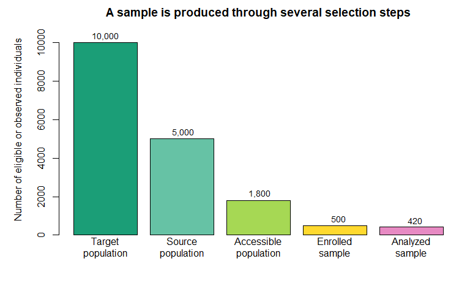
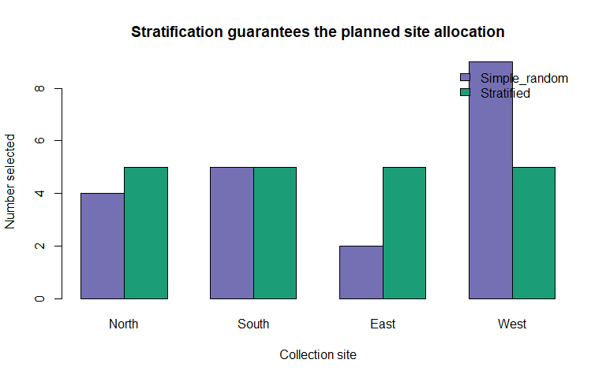
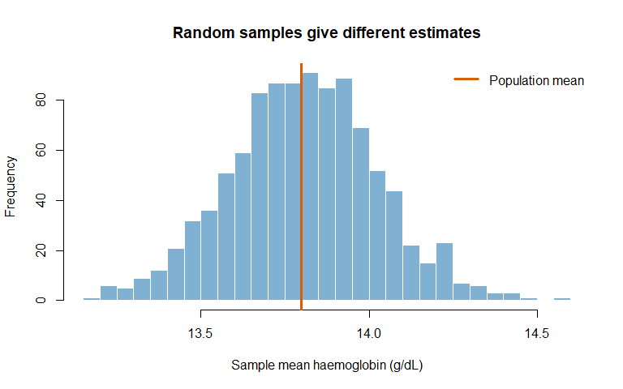
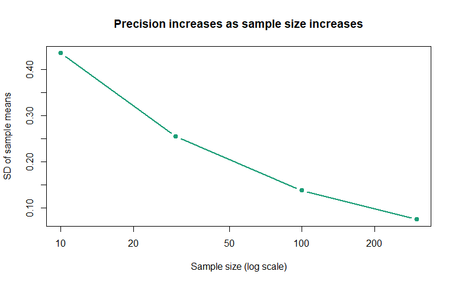
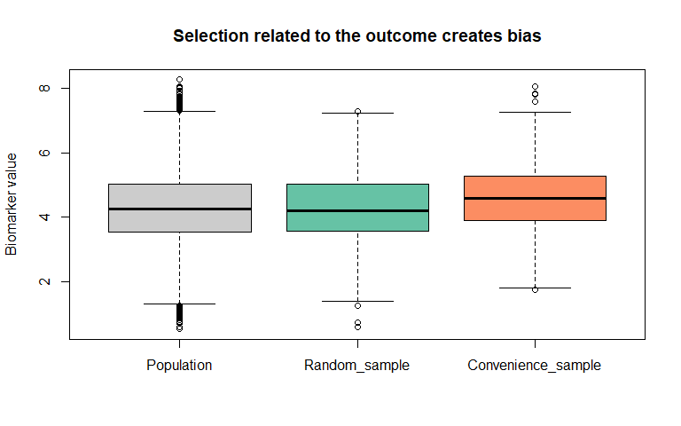

Chapter 6: Populations, Samples and Sampling
================
Sandeep Singh

- [1. Introduction](#1-introduction)
- [2. Learning Objectives](#2-learning-objectives)
- [3. The Population-to-Sample
  Pathway](#3-the-population-to-sample-pathway)
  - [3.1 Eligibility criteria](#31-eligibility-criteria)
- [4. Census, Sample, Parameter and
  Statistic](#4-census-sample-parameter-and-statistic)
  - [4.1 Census versus sample](#41-census-versus-sample)
  - [4.2 Parameter versus statistic](#42-parameter-versus-statistic)
- [5. Units: What Exactly Was
  Sampled?](#5-units-what-exactly-was-sampled)
  - [5.1 The hierarchy in omics data](#51-the-hierarchy-in-omics-data)
- [6. The Sampling Frame](#6-the-sampling-frame)
- [7. Probability and Non-Probability
  Sampling](#7-probability-and-non-probability-sampling)
  - [7.1 Probability sampling](#71-probability-sampling)
  - [7.2 Non-probability sampling](#72-non-probability-sampling)
- [8. Simple Random Sampling](#8-simple-random-sampling)
  - [8.1 Example: selecting serum
    samples](#81-example-selecting-serum-samples)
  - [8.2 With versus without
    replacement](#82-with-versus-without-replacement)
- [9. Systematic Sampling](#9-systematic-sampling)
- [10. Stratified Random Sampling](#10-stratified-random-sampling)
  - [10.1 Proportional and disproportionate
    allocation](#101-proportional-and-disproportionate-allocation)
- [11. Cluster and Multistage
  Sampling](#11-cluster-and-multistage-sampling)
- [12. Sampling Error and Sample-to-Sample
  Variation](#12-sampling-error-and-sample-to-sample-variation)
- [13. Non-Sampling Errors and Bias](#13-non-sampling-errors-and-bias)
  - [13.1 Why more data cannot fix biased
    selection](#131-why-more-data-cannot-fix-biased-selection)
- [14. Representativeness and
  Generalizability](#14-representativeness-and-generalizability)
- [15. Sample Size: A First
  Introduction](#15-sample-size-a-first-introduction)
  - [15.1 Finite population
    correction](#151-finite-population-correction)
- [16. Sampling Weights](#16-sampling-weights)
  - [16.1 Oversampling a small group](#161-oversampling-a-small-group)
- [17. Sampling in Genetics and
  Bioinformatics](#17-sampling-in-genetics-and-bioinformatics)
  - [17.1 Biobank ascertainment](#171-biobank-ascertainment)
  - [17.2 Ancestry representation](#172-ancestry-representation)
  - [17.3 Case-control sampling](#173-case-control-sampling)
  - [17.4 Rare-variant enrichment](#174-rare-variant-enrichment)
  - [17.5 Public bioinformatics
    databases](#175-public-bioinformatics-databases)
- [18. Sampling Biospecimens, Cells and
  Reads](#18-sampling-biospecimens-cells-and-reads)
  - [18.1 Tissue heterogeneity](#181-tissue-heterogeneity)
  - [18.2 Single-cell studies](#182-single-cell-studies)
  - [18.3 Sequencing depth](#183-sequencing-depth)
  - [18.4 Environmental sampling](#184-environmental-sampling)
- [19. Integrated Case Study: Building a Biomarker
  Substudy](#19-integrated-case-study-building-a-biomarker-substudy)
  - [19.1 Research question](#191-research-question)
  - [19.2 Sampling problem](#192-sampling-problem)
  - [19.3 Proposed design](#193-proposed-design)
  - [19.4 Create a simulated frame](#194-create-a-simulated-frame)
  - [19.5 Select 15 per site-condition
    stratum](#195-select-15-per-site-condition-stratum)
  - [19.6 Randomize assay order](#196-randomize-assay-order)
- [20. A Sampling Plan Template](#20-a-sampling-plan-template)
- [21. Reporting a Sample](#21-reporting-a-sample)
- [22. Common Mistakes](#22-common-mistakes)
  - [Mistake 1: Calling a convenience sample
    random](#mistake-1-calling-a-convenience-sample-random)
  - [Mistake 2: Treating every cell or read as
    independent](#mistake-2-treating-every-cell-or-read-as-independent)
  - [Mistake 3: Assuming a large sample is
    representative](#mistake-3-assuming-a-large-sample-is-representative)
  - [Mistake 4: Ignoring the sampling
    frame](#mistake-4-ignoring-the-sampling-frame)
  - [Mistake 5: Oversampling without recording
    probabilities](#mistake-5-oversampling-without-recording-probabilities)
  - [Mistake 6: Removing failed specimens without
    investigation](#mistake-6-removing-failed-specimens-without-investigation)
  - [Mistake 7: Confusing balance with
    prevalence](#mistake-7-confusing-balance-with-prevalence)
- [23. Chapter Summary](#23-chapter-summary)
- [24. Check Your Understanding](#24-check-your-understanding)
- [25. R Exercises](#25-r-exercises)
  - [Exercise 1: Simple random
    sampling](#exercise-1-simple-random-sampling)
  - [Exercise 2: Reproducibility](#exercise-2-reproducibility)
  - [Exercise 3: Stratification](#exercise-3-stratification)
  - [Exercise 4: Sampling variation](#exercise-4-sampling-variation)
  - [Exercise 5: Biased sampling](#exercise-5-biased-sampling)
  - [Exercise 6: Nested data](#exercise-6-nested-data)
  - [Exercise 7: Weights](#exercise-7-weights)
- [26. Mini-Project: Sampling a Genomic Surveillance
  Database](#26-mini-project-sampling-a-genomic-surveillance-database)
- [27. Glossary](#27-glossary)
- [28. References](#28-references)
- [29. Reproducibility Information](#29-reproducibility-information)

# 1. Introduction

Biologists rarely measure every individual, organism, tissue, cell or
sequence that interests them. Instead, they study a **sample** and use
it to learn about a larger **population**.

For example, a researcher may measure fasting glucose in 100 adults to
learn about all adults in a region. A conservation biologist may
genotype 80 fish to study the genetic diversity of an entire lake. A
bioinformatician may analyze tumour samples from a biobank to learn
about a broader patient population.

This creates a central question:

> **Does the sample provide trustworthy information about the population
> we want to understand?**

A very large sample can still give a misleading answer if it was
selected poorly. Sampling design therefore affects the scientific
meaning of every estimate, confidence interval and hypothesis test that
follows.

------------------------------------------------------------------------

# 2. Learning Objectives

After completing this chapter, you should be able to:

1.  distinguish a target, source, accessible and study population;
2.  define a sample, census, sampling frame and eligibility criteria;
3.  distinguish a parameter from a statistic;
4.  identify sampling, observational and experimental units;
5.  explain why cells, reads and technical replicates may not be
    independent samples;
6.  compare probability and non-probability sampling;
7.  perform simple random, systematic, stratified and cluster sampling
    in R;
8.  explain sampling with and without replacement;
9.  distinguish sampling error from non-sampling error;
10. recognize selection, coverage, volunteer, nonresponse and
    survivorship bias;
11. explain representativeness, precision and generalizability;
12. understand the basic roles of sample size, finite population
    correction and sampling weights;
13. identify sampling problems in clinical, ecological, genetic and
    omics research; and
14. design and report a basic biological sampling plan.

------------------------------------------------------------------------

# 3. The Population-to-Sample Pathway

The word **population** must be defined precisely. It does not always
mean all humans or all organisms of a species.

| Term | Meaning | Biology example |
|----|----|----|
| Target population | Group to which the final conclusion is intended to apply | All adults with type 2 diabetes in a country |
| Source population | Population from which eligible participants could arise | Adults with diabetes receiving care in selected hospitals |
| Accessible population | Members who can realistically be reached | Eligible patients attending those hospitals this year |
| Study population | Individuals who meet the protocol and enter the study | Consenting eligible patients who are enrolled |
| Sample analyzed | Observations remaining in the final analysis | Enrolled patients with usable RNA-seq and phenotype data |

Each step may narrow the group. If narrowing is related to both the
biological factor and outcome, bias can occur.

``` r
stages <- c("Target\npopulation", "Source\npopulation", "Accessible\npopulation",
            "Enrolled\nsample", "Analyzed\nsample")
sizes <- c(10000, 5000, 1800, 500, 420)

par(mar = c(5, 5, 2, 1))
barplot(sizes,
        names.arg = stages,
        col = c("#1B9E77", "#66C2A5", "#A6D854", "#FFD92F", "#E78AC3"),
        ylab = "Number of eligible or observed individuals",
        main = "A sample is produced through several selection steps",
        ylim = c(0, 11000))
text(seq(0.7, by = 1.2, length.out = length(sizes)), sizes + 350,
     labels = format(sizes, big.mark = ","), cex = 0.85)
```

<div class="figure" style="text-align: center">


<p class="caption">

From the target population to the analyzed sample. Numbers are
illustrative.
</p>

</div>

## 3.1 Eligibility criteria

**Inclusion criteria** state who may enter. **Exclusion criteria** state
who may not enter.

Example for a transcriptomics study:

- include adults aged 18–70 years with a confirmed diagnosis;
- require a blood sample collected before treatment;
- exclude samples with inadequate RNA integrity;
- exclude participants without essential phenotype information.

Criteria improve consistency, but very restrictive criteria can reduce
generalizability. Excluding low-quality specimens can also create bias
if specimen quality is related to disease severity or collection site.

# 4. Census, Sample, Parameter and Statistic

## 4.1 Census versus sample

A **census** measures every member of a defined finite population. A
**sample** measures only part of it.

A census may be possible for all 120 animals in one breeding facility,
but not for every animal in a species. Even a census of the facility is
only a sample of the broader conceptual population to which researchers
may wish to generalize.

## 4.2 Parameter versus statistic

A **parameter** describes a population. A **statistic** is calculated
from a sample.

| Quantity           | Population parameter | Sample statistic |
|--------------------|----------------------|------------------|
| Mean               | $\mu$                | $\bar{x}$        |
| Standard deviation | $\sigma$             | $s$              |
| Proportion         | $p$                  | $\hat{p}$        |
| Correlation        | $\rho$               | $r$              |

Suppose the true mean haemoglobin concentration of a target population
is $\mu$. We usually do not know $\mu$, so we calculate the sample mean:

$$\bar{x} = \frac{1}{n}\sum_{i=1}^{n}x_i.$$

The statistic $\bar{x}$ is an **estimate** of the unknown parameter
$\mu$.

``` r
# A simulated finite population of haemoglobin measurements (g/dL)
population_hb <- rnorm(5000, mean = 13.8, sd = 1.4)

# We can calculate the parameter only because this population is simulated
population_mean <- mean(population_hb)

# Draw one simple random sample
sample_hb <- sample(population_hb, size = 80, replace = FALSE)
sample_mean <- mean(sample_hb)

data.frame(
  Quantity = c("Population mean (parameter)", "Sample mean (statistic)"),
  Value_g_dL = round(c(population_mean, sample_mean), 2)
)
```

<div class="kable-table">

| Quantity                    | Value_g_dL |
|:----------------------------|-----------:|
| Population mean (parameter) |      13.80 |
| Sample mean (statistic)     |      13.76 |

</div>

Different random samples generally produce different statistics. That
variability is not necessarily a mistake; it is a natural consequence of
observing only part of the population.

# 5. Units: What Exactly Was Sampled?

Biological data often have several levels. Confusing them causes
pseudoreplication and exaggerated certainty.

| Unit | Question it answers | Example |
|----|----|----|
| Sampling unit | What entity could be selected? | A patient selected from a clinic list |
| Experimental unit | What entity independently receives treatment? | A mouse assigned to a diet |
| Observation unit | What entity is measured? | A blood specimen from the mouse |
| Analysis unit | What entity contributes one independent record to the analysis? | Usually the mouse, unless dependence is modeled |

## 5.1 The hierarchy in omics data

Consider an RNA-seq experiment:

- 20 donors are sampled;
- 2 tissue specimens are collected per donor;
- RNA is measured twice per specimen;
- millions of sequencing reads are generated per library.

This study does **not** contain millions of independent human
participants. Reads are nested within libraries, libraries within
specimens and specimens within donors.

> **More measurements per donor can improve measurement precision, but
> they do not replace independent biological replication.**

The same principle applies to single-cell RNA-seq. Ten thousand cells
from each of three donors usually provide three independent donor-level
biological replicates for population-level inference, not 30,000
independent people.

``` r
nested_example <- data.frame(
  Donor = rep(paste0("D", 1:3), each = 4),
  Specimen = rep(rep(c("Blood", "Tissue"), each = 2), times = 3),
  Technical_replicate = rep(1:2, times = 6),
  Expression = round(rnorm(12, mean = rep(c(8.2, 9.1, 7.8), each = 4), sd = 0.25), 2)
)

nested_example
```

<div class="kable-table">

| Donor | Specimen | Technical_replicate | Expression |
|:------|:---------|--------------------:|-----------:|
| D1    | Blood    |                   1 |       8.49 |
| D1    | Blood    |                   2 |       8.71 |
| D1    | Tissue   |                   1 |       8.27 |
| D1    | Tissue   |                   2 |       7.89 |
| D2    | Blood    |                   1 |       8.33 |
| D2    | Blood    |                   2 |       9.12 |
| D2    | Tissue   |                   1 |       9.00 |
| D2    | Tissue   |                   2 |       8.89 |
| D3    | Blood    |                   1 |       7.38 |
| D3    | Blood    |                   2 |       8.13 |
| D3    | Tissue   |                   1 |       7.66 |
| D3    | Tissue   |                   2 |       7.57 |

</div>

# 6. The Sampling Frame

A **sampling frame** is the operational list or mechanism used to
identify selectable units.

Examples include:

- a hospital registry;
- a list of households;
- a map divided into ecological quadrats;
- a biobank catalogue;
- a freezer inventory of biospecimens; or
- a database of sequenced isolates.

The sampling frame and target population are rarely identical.

**Undercoverage** occurs when eligible population members are missing
from the frame. **Overcoverage** occurs when the frame contains
duplicates or ineligible units.

Example: a hospital registry may omit people who have the disease but
lack access to hospital care. A genetic database may overrepresent
people of particular ancestries. Random sampling from an incomplete
frame does not repair the frame’s coverage problem.

# 7. Probability and Non-Probability Sampling

## 7.1 Probability sampling

In a probability sample, each population unit has a known, non-zero
probability of selection. Random selection supports design-based
estimates of uncertainty.

Major methods are:

1.  simple random sampling;
2.  systematic sampling;
3.  stratified random sampling;
4.  cluster sampling; and
5.  multistage sampling.

## 7.2 Non-probability sampling

In non-probability sampling, selection probabilities are unknown.

| Method | Description | Possible biological use | Main limitation |
|----|----|----|----|
| Convenience | Select easily available units | Available archived tissue | Often unrepresentative |
| Consecutive | Enroll every eligible case over a period | Patients attending a clinic | Misses people outside that setting or time |
| Purposive | Select units with desired features | Rare mutation carriers | Investigator judgment drives selection |
| Quota | Fill predefined category totals | Fixed counts by age group | Selection within categories may not be random |
| Snowball | Participants recruit others | Hard-to-reach populations | Network structure affects inclusion |

Non-probability samples can be scientifically valuable, especially for
rare diseases, early discovery and mechanism-focused experiments.
However, their limits must be reported honestly. A large convenience
sample does not automatically represent a population.

# 8. Simple Random Sampling

In a **simple random sample** of size $n$, every possible group of $n$
units has the same chance of selection.

If a finite population contains $N$ units and sampling is without
replacement, each unit has inclusion probability:

$$\pi_i = \frac{n}{N}.$$

## 8.1 Example: selecting serum samples

``` r
serum_frame <- data.frame(
  sample_id = sprintf("S%03d", 1:200),
  site = rep(c("North", "South", "East", "West"), each = 50),
  age_years = round(rnorm(200, mean = 52, sd = 14)),
  biomarker = round(rlnorm(200, meanlog = log(4.5), sdlog = 0.35), 2)
)

head(serum_frame)
```

<div class="kable-table">

| sample_id | site  | age_years | biomarker |
|:----------|:------|----------:|----------:|
| S001      | North |        65 |      4.79 |
| S002      | North |        62 |      5.10 |
| S003      | North |        57 |      3.51 |
| S004      | North |        49 |      4.11 |
| S005      | North |        48 |      2.46 |
| S006      | North |        57 |      4.18 |

</div>

``` r
set.seed(123)
selected_rows <- sample(seq_len(nrow(serum_frame)), size = 20, replace = FALSE)
simple_sample <- serum_frame[selected_rows, ]

simple_sample
```

<div class="kable-table">

|     | sample_id | site  | age_years | biomarker |
|:----|:----------|:------|----------:|----------:|
| 159 | S159      | West  |        64 |     10.05 |
| 179 | S179      | West  |        47 |      2.52 |
| 14  | S014      | North |        60 |      6.37 |
| 195 | S195      | West  |        55 |      4.71 |
| 170 | S170      | West  |        52 |      5.26 |
| 50  | S050      | North |        42 |      3.92 |
| 118 | S118      | East  |        51 |      5.37 |
| 43  | S043      | North |        47 |     10.02 |
| 198 | S198      | West  |        55 |      4.31 |
| 194 | S194      | West  |        52 |      7.67 |
| 153 | S153      | West  |        53 |      4.07 |
| 90  | S090      | South |        53 |      6.95 |
| 91  | S091      | South |        47 |      3.76 |
| 188 | S188      | West  |        17 |      6.10 |
| 185 | S185      | West  |        50 |      3.09 |
| 92  | S092      | South |        70 |      3.62 |
| 137 | S137      | East  |        74 |      6.06 |
| 99  | S099      | South |        51 |      4.84 |
| 72  | S072      | South |        64 |      4.58 |
| 26  | S026      | North |        59 |      7.24 |

</div>

Use `set.seed()` when you want the random selection to be reproducible.
Save the selected identifiers, seed, date and sampling-frame version.

## 8.2 With versus without replacement

- **Without replacement:** a selected unit cannot be selected again.
  This is common when sampling people or specimens.
- **With replacement:** a selected unit is returned and can be selected
  again. This is central to bootstrap methods introduced later.

``` r
sample(1:10, size = 5, replace = FALSE)
```

    ## [1] 7 9 6 3 4

``` r
sample(1:10, size = 15, replace = TRUE)
```

    ##  [1]  1  7  5 10  7  9  9 10  7  5  7  5  6  9  2

# 9. Systematic Sampling

Systematic sampling selects every $k$th unit after a random start. If
$N = 1{,}000$ and $n = 100$, then $k = N/n = 10$.

``` r
N <- nrow(serum_frame)
n <- 20
k <- N / n

set.seed(123)
random_start <- sample(seq_len(k), size = 1)
systematic_rows <- seq(from = random_start, to = N, by = k)
systematic_sample <- serum_frame[systematic_rows, ]

data.frame(random_start = random_start, interval = k,
           selected_n = nrow(systematic_sample))
```

<div class="kable-table">

| random_start | interval | selected_n |
|-------------:|---------:|-----------:|
|            3 |       10 |         20 |

</div>

Systematic sampling is simple, but ordering matters. If the list follows
a repeating pattern that matches the interval, the result can be biased.
Randomize the frame first when its ordering is scientifically
irrelevant.

# 10. Stratified Random Sampling

The population is divided into non-overlapping **strata**, and a random
sample is taken within each stratum.

Useful strata may include:

- clinic or geographic region;
- age category;
- recorded sex;
- ancestry group;
- disease stage;
- sequencing centre; or
- habitat type.

Stratification can ensure representation of small but important groups
and can improve precision when members within a stratum are similar.

## 10.1 Proportional and disproportionate allocation

- **Proportional allocation:** sample the same fraction from each
  stratum.
- **Disproportionate allocation:** deliberately oversample a small or
  important group.

Oversampling is not inherently biased if the design is recorded and
appropriate sampling weights are used for population estimates.

``` r
set.seed(123)

# Select five serum samples independently from every site
stratified_list <- lapply(split(serum_frame, serum_frame$site), function(d) {
  d[sample(seq_len(nrow(d)), size = 5, replace = FALSE), ]
})

stratified_sample <- do.call(rbind, stratified_list)
rownames(stratified_sample) <- NULL

table(stratified_sample$site)
```

    ## 
    ##  East North South  West 
    ##     5     5     5     5

``` r
site_levels <- c("North", "South", "East", "West")
simple_counts <- table(factor(simple_sample$site, levels = site_levels))
stratified_counts <- table(factor(stratified_sample$site, levels = site_levels))

counts <- rbind(Simple_random = as.numeric(simple_counts),
                Stratified = as.numeric(stratified_counts))
colnames(counts) <- site_levels

barplot(counts, beside = TRUE,
        col = c("#7570B3", "#1B9E77"),
        ylab = "Number selected", xlab = "Collection site",
        main = "Stratification guarantees the planned site allocation")
legend("topright", legend = rownames(counts),
       fill = c("#7570B3", "#1B9E77"), bty = "n")
```

<div class="figure" style="text-align: center">


<p class="caption">

Site composition under simple random and stratified sampling.
</p>

</div>

# 11. Cluster and Multistage Sampling

In **cluster sampling**, naturally occurring groups are selected,
followed by all or some units inside those groups.

Examples of clusters include hospitals, villages, schools, litters,
farms and ecological plots.

``` r
set.seed(123)
selected_sites <- sample(unique(serum_frame$site), size = 2, replace = FALSE)
cluster_sample <- serum_frame[serum_frame$site %in% selected_sites, ]

data.frame(
  selected_clusters = paste(selected_sites, collapse = ", "),
  individuals_observed = nrow(cluster_sample)
)
```

<div class="kable-table">

| selected_clusters | individuals_observed |
|:------------------|---------------------:|
| East, West        |                  100 |

</div>

Cluster sampling reduces travel and logistical costs, but individuals
within one cluster often resemble each other. For example, patients at
one hospital share referral practices, and mice in one litter share
genes and environment. The effective information can therefore be less
than that from the same number of independently dispersed individuals.

**Multistage sampling** uses multiple random steps. A national health
study might sample regions, then clinics within regions, then patients
within clinics.

# 12. Sampling Error and Sample-to-Sample Variation

**Sampling error** is the difference between a sample statistic and the
population parameter caused by observing a sample rather than the whole
population.

It is not the same as a data-entry error.

``` r
set.seed(123)
sample_means <- replicate(
  1000,
  mean(sample(population_hb, size = 40, replace = FALSE))
)

hist(sample_means, breaks = 25,
     col = "#80B1D3", border = "white",
     xlab = "Sample mean haemoglobin (g/dL)",
     main = "Random samples give different estimates")
abline(v = population_mean, col = "#D95F02", lwd = 3)
legend("topright", legend = "Population mean",
       col = "#D95F02", lwd = 3, bty = "n")
```

<div class="figure" style="text-align: center">


<p class="caption">

Distribution of mean haemoglobin values from 1,000 random samples.
</p>

</div>

The standard deviation of a statistic across repeated samples is its
**standard error**. For an independent sample mean, it is approximately:

$$SE(\bar{x}) = \frac{\sigma}{\sqrt{n}}.$$

Larger samples usually produce more precise estimates, but larger size
does not remove systematic selection bias.

``` r
set.seed(123)
sample_sizes <- c(10, 30, 100, 300)
sd_of_means <- sapply(sample_sizes, function(n) {
  means <- replicate(1000, mean(sample(population_hb, size = n)))
  sd(means)
})

plot(sample_sizes, sd_of_means, type = "b", pch = 19, lwd = 2,
     col = "#1B9E77", log = "x",
     xlab = "Sample size (log scale)",
     ylab = "SD of sample means",
     main = "Precision increases as sample size increases")
```

<div class="figure" style="text-align: center">


<p class="caption">

Larger samples produce less variable sample means in this simulation.
</p>

</div>

# 13. Non-Sampling Errors and Bias

Non-sampling errors can remain even in a very large study.

| Problem | Meaning | Biological example |
|----|----|----|
| Coverage error | Sampling frame does not match target population | Registry omits untreated cases |
| Selection bias | Inclusion is related to variables under study | Severe cases are more likely to enter a biobank |
| Volunteer bias | Volunteers differ from non-volunteers | Health-conscious participants join a cohort |
| Nonresponse bias | Responders differ from nonresponders | Participants with severe symptoms skip follow-up |
| Survivorship bias | Only surviving or retained units are observed | Studying late-life exposures only among survivors |
| Measurement error | Recorded value differs from true value | Assay calibration drift |
| Processing bias | Laboratory workflow differs systematically by group | All cases sequenced in one batch |

## 13.1 Why more data cannot fix biased selection

The following simulation creates a population in which a disease
biomarker is higher among cases. A convenience mechanism preferentially
selects people with high biomarker values.

``` r
set.seed(123)
N <- 10000
disease <- rbinom(N, size = 1, prob = 0.25)
marker <- rnorm(N, mean = 4 + 1.2 * disease, sd = 1)

population <- data.frame(disease = disease, marker = marker)

# Random sample
random_ids <- sample(seq_len(N), 800)

# High marker values increase the chance of appearing in the convenience sample
selection_score <- plogis(-2 + 0.55 * marker)
convenience_ids <- sample(seq_len(N), 800, prob = selection_score)

boxplot(
  list(Population = population$marker,
       Random_sample = population$marker[random_ids],
       Convenience_sample = population$marker[convenience_ids]),
  col = c("grey80", "#66C2A5", "#FC8D62"),
  ylab = "Biomarker value",
  main = "Selection related to the outcome creates bias"
)
```

<div class="figure" style="text-align: center">


<p class="caption">

A biased convenience sample can misrepresent the population even when it
is large.
</p>

</div>

``` r
data.frame(
  Group = c("Population", "Random sample", "Convenience sample"),
  N = c(N, length(random_ids), length(convenience_ids)),
  Mean_marker = round(c(mean(population$marker),
                        mean(population$marker[random_ids]),
                        mean(population$marker[convenience_ids])), 2)
)
```

<div class="kable-table">

| Group              |     N | Mean_marker |
|:-------------------|------:|------------:|
| Population         | 10000 |        4.29 |
| Random sample      |   800 |        4.29 |
| Convenience sample |   800 |        4.58 |

</div>

# 14. Representativeness and Generalizability

A **representative sample** resembles the target population in the
features relevant to the research question. It does not have to match
the population on every possible characteristic.

**Internal validity** asks whether the study’s conclusion is credible
for the participants studied. **External validity**, or
generalizability, asks whether that conclusion applies to other people,
settings or times.

A carefully controlled cell-line experiment may have strong internal
validity for its model system but limited generalizability to human
patients. This is not a failure if the intended scientific claim is
appropriately narrow.

Before generalizing, compare the sample with the target population on
variables that may change the effect or outcome, such as:

- age and sex distribution;
- ancestry and geographic region;
- disease severity;
- treatment history;
- environmental exposure;
- tissue source and collection method; and
- healthcare access.

# 15. Sample Size: A First Introduction

Sample size affects precision and statistical power, but there is no
universally adequate sample size.

Planning depends on:

- the outcome type and variability;
- the smallest scientifically important effect;
- desired precision;
- acceptable false-positive and false-negative risks;
- study design, clustering and repeated measurements;
- group allocation;
- expected missingness or assay failure; and
- practical and ethical constraints.

For estimating a mean with a desired margin of error $E$, a simple
large-sample approximation is:

$$n \approx \left(\frac{z_{1-\alpha/2}\sigma}{E}\right)^2.$$

This formula is educational, not a replacement for a design-specific
calculation.

``` r
sigma <- 12       # anticipated SD of systolic blood pressure
margin <- 3       # desired half-width in mmHg
z <- qnorm(0.975) # 95% confidence level

n_required <- ceiling((z * sigma / margin)^2)
n_required
```

    ## [1] 62

Formal power and sample-size analysis will be covered after estimation
and hypothesis testing.

## 15.1 Finite population correction

When sampling without replacement from a finite population and the
sample is a substantial fraction of it, the standard error is reduced
by:

$$FPC = \sqrt{\frac{N-n}{N-1}}.$$

``` r
N <- 200
n <- 80
fpc <- sqrt((N - n) / (N - 1))
round(fpc, 3)
```

    ## [1] 0.777

The correction is close to 1 when the sampling fraction $n/N$ is small.

# 16. Sampling Weights

If unit $i$ has inclusion probability $\pi_i$, a basic design weight is:

$$w_i = \frac{1}{\pi_i}.$$

A participant selected with probability 0.10 represents approximately 10
population units, whereas one selected with probability 0.50 represents
approximately 2.

## 16.1 Oversampling a small group

Suppose a population is 80% Group A and 20% Group B, but a study selects
100 people from each group. The unweighted sample is 50% Group B, so an
unweighted population prevalence estimate will generally be distorted.

``` r
weighted_sample <- data.frame(
  group = c(rep("A", 100), rep("B", 100)),
  outcome = c(rep(c(1, 0), c(20, 80)),
              rep(c(1, 0), c(50, 50))),
  weight = c(rep(800 / 100, 100), rep(200 / 100, 100))
)

unweighted_prevalence <- mean(weighted_sample$outcome)
weighted_prevalence <- with(
  weighted_sample,
  weighted.mean(outcome, w = weight)
)

data.frame(
  Estimate = c("Unweighted", "Weighted for population composition"),
  Prevalence = round(c(unweighted_prevalence, weighted_prevalence), 3)
)
```

<div class="kable-table">

| Estimate                            | Prevalence |
|:------------------------------------|-----------:|
| Unweighted                          |       0.35 |
| Weighted for population composition |       0.26 |

</div>

Complex survey analysis requires methods that account for weights,
strata and clusters together. Base-R weighted means alone are not
sufficient for valid standard errors. The `survey` package is commonly
used for this purpose.

``` r
# Optional example; install the survey package before running.
library(survey)

design_object <- svydesign(
  ids = ~1,
  weights = ~weight,
  data = weighted_sample
)

svymean(~outcome, design = design_object)
```

# 17. Sampling in Genetics and Bioinformatics

## 17.1 Biobank ascertainment

Biobank participants may differ from the general population in age,
health, ancestry, geography, education and healthcare use. Associations
estimated within the biobank can still be valuable, but prevalence
estimates and generalization require care.

## 17.2 Ancestry representation

Human genetic studies have historically sampled some ancestry groups
much more heavily than others. Consequences may include:

- less accurate polygenic scores in underrepresented populations;
- incomplete discovery of population-specific or rare variants;
- unequal clinical benefit from genomic research; and
- confounding if genetic ancestry, environment and study recruitment are
  mixed.

Self-identified ethnicity, genetic ancestry and geographic origin are
related but not interchangeable concepts. Record and interpret each
according to the scientific question and with appropriate ethical care.

## 17.3 Case-control sampling

Researchers often deliberately sample people with a disease and controls
without it. This is efficient for rare diseases. However, the fraction
of cases in the sample is created by the design and usually cannot be
interpreted as population disease prevalence.

Case-control sampling can estimate exposure odds ratios under
appropriate assumptions. Control selection is crucial: controls should
represent the exposure distribution of the source population that
produced the cases.

## 17.4 Rare-variant enrichment

Family-based or founder-population studies may enrich rare variants and
improve discovery. Their allele frequencies and effect estimates may not
directly describe other populations.

## 17.5 Public bioinformatics databases

Sequences in public repositories are not always a random sample of all
organisms, patients or infections. Submission may depend on geography,
laboratory capacity, disease severity, surveillance policy and
scientific interest.

Before interpreting a database-derived frequency, ask:

1.  Who or what could enter the database?
2.  Who or what was more likely to be sequenced?
3.  Are repeated sequences from the same outbreak, patient or laboratory
    present?
4.  Which regions or time periods are underrepresented?

# 18. Sampling Biospecimens, Cells and Reads

Sampling occurs at several biological and technical levels.

## 18.1 Tissue heterogeneity

A small biopsy may not represent an entire tumour. Spatially separated
tumour regions can contain different cell populations and mutations. The
target of inference might be the sampled biopsy, the whole tumour or
tumours in a patient population; these are different targets.

## 18.2 Single-cell studies

Cells can be lost differentially during dissociation. Fragile cell types
may appear artificially rare. A large cell count cannot correct the
absence of donors or the selective loss of a cell type.

## 18.3 Sequencing depth

Increasing read depth improves the measurement of a library. Increasing
the number of independent donors improves biological replication. These
investments answer different uncertainty problems.

## 18.4 Environmental sampling

Water, soil and microbiome composition may vary across space, depth,
season and collection method. A composite sample can estimate an average
but may hide local heterogeneity. Record exactly how subsamples were
selected and combined.

# 19. Integrated Case Study: Building a Biomarker Substudy

## 19.1 Research question

Among adults in a four-site cohort, what is the mean inflammatory
biomarker concentration, and does it differ between people with and
without a diagnosed condition?

## 19.2 Sampling problem

Only 120 stored serum samples can be assayed. Site West is smaller than
the others but must be represented because its sample-processing
protocol differs.

## 19.3 Proposed design

1.  Define the target population as eligible adults in the four-site
    cohort.
2.  Use the current specimen inventory as the sampling frame.
3.  Exclude specimens without sufficient volume, while documenting
    exclusions by site and condition.
4.  Stratify by site and condition.
5.  Randomly select within each stratum.
6.  Record each inclusion probability.
7.  Randomize selected specimens across assay plates.
8.  Keep laboratory staff blinded to condition where feasible.

## 19.4 Create a simulated frame

``` r
set.seed(321)
cohort <- data.frame(
  id = sprintf("P%04d", 1:1000),
  site = sample(c("North", "South", "East", "West"), 1000,
                replace = TRUE, prob = c(0.30, 0.30, 0.25, 0.15)),
  condition = sample(c("No", "Yes"), 1000,
                     replace = TRUE, prob = c(0.70, 0.30)),
  sufficient_volume = rbinom(1000, 1, prob = 0.92)
)

eligible_frame <- cohort[cohort$sufficient_volume == 1, ]
table(eligible_frame$site, eligible_frame$condition)
```

    ##        
    ##          No Yes
    ##   East  158  87
    ##   North 192  90
    ##   South 156  78
    ##   West  101  49

## 19.5 Select 15 per site-condition stratum

``` r
set.seed(321)
stratum <- interaction(eligible_frame$site, eligible_frame$condition, drop = TRUE)

selected_parts <- lapply(split(eligible_frame, stratum), function(d) {
  n_select <- min(15, nrow(d))
  chosen <- d[sample(seq_len(nrow(d)), n_select), ]
  chosen$stratum_size <- nrow(d)
  chosen$selection_probability <- n_select / nrow(d)
  chosen$sampling_weight <- 1 / chosen$selection_probability
  chosen
})

selected_biomarker_sample <- do.call(rbind, selected_parts)
rownames(selected_biomarker_sample) <- NULL

selection_summary <- aggregate(
  id ~ site + condition,
  data = selected_biomarker_sample,
  FUN = length
)
names(selection_summary)[names(selection_summary) == "id"] <- "selected_n"
selection_summary
```

<div class="kable-table">

| site  | condition | selected_n |
|:------|:----------|-----------:|
| East  | No        |         15 |
| North | No        |         15 |
| South | No        |         15 |
| West  | No        |         15 |
| East  | Yes       |         15 |
| North | Yes       |         15 |
| South | Yes       |         15 |
| West  | Yes       |         15 |

</div>

This creates balance for subgroup comparisons, but it does not reproduce
the cohort’s natural composition. Population-level means should
therefore use the recorded design information.

## 19.6 Randomize assay order

``` r
set.seed(999)
assay_order <- sample(seq_len(nrow(selected_biomarker_sample)))
selected_biomarker_sample$assay_position <- assay_order

selected_biomarker_sample <- selected_biomarker_sample[
  order(selected_biomarker_sample$assay_position),
]

head(selected_biomarker_sample[, c("id", "site", "condition", "assay_position")], 10)
```

<div class="kable-table">

|     | id    | site  | condition | assay_position |
|:----|:------|:------|:----------|---------------:|
| 65  | P0270 | East  | Yes       |              1 |
| 34  | P0837 | South | No        |              2 |
| 82  | P0299 | North | Yes       |              3 |
| 59  | P0676 | West  | No        |              4 |
| 120 | P0898 | West  | Yes       |              5 |
| 72  | P0766 | East  | Yes       |              6 |
| 16  | P0189 | North | No        |              7 |
| 88  | P0498 | North | Yes       |              8 |
| 25  | P0586 | North | No        |              9 |
| 9   | P0548 | East  | No        |             10 |

</div>

Sampling and laboratory allocation address different risks. Stratified
random sampling controls who enters the substudy; randomized assay order
helps prevent group effects from being confounded with laboratory drift.

# 20. A Sampling Plan Template

Complete this plan before selecting samples.

| Component | Question to answer |
|----|----|
| Research question | What parameter or relationship will be estimated? |
| Target population | To whom or what should the conclusion apply? |
| Sampling frame | What list or mechanism identifies selectable units? |
| Eligibility | What are the inclusion and exclusion criteria? |
| Sampling unit | What entity is selected? |
| Analysis unit | What entity will count as an independent observation? |
| Sampling method | Simple random, stratified, cluster or another method? |
| Sample size | How was the number selected justified? |
| Nonresponse/failure | How will refusal, missingness or assay failure be handled? |
| Design information | Will inclusion probabilities, strata and clusters be recorded? |
| Laboratory workflow | How will specimens be randomized or blocked across batches? |
| Generalizability | Which populations or settings will remain outside the claim? |

# 21. Reporting a Sample

A reproducible report should describe:

- target and source populations;
- recruitment setting and dates;
- sampling frame;
- eligibility criteria;
- sampling method and each sampling stage;
- numbers approached, eligible, enrolled, measured and analyzed;
- reasons for exclusion and missingness;
- stratification, clustering and sampling weights;
- specimen collection, storage and assay procedures;
- differences between analyzed and excluded units; and
- limits on generalizability.

A participant or specimen flow diagram is often useful.

# 22. Common Mistakes

## Mistake 1: Calling a convenience sample random

Randomly assigning treatments does not mean participants were randomly
sampled from a population. **Random sampling** supports generalization;
**random assignment** supports causal comparison within an experiment.

## Mistake 2: Treating every cell or read as independent

Identify the biological hierarchy and the true independent units.

## Mistake 3: Assuming a large sample is representative

Sample size reduces random sampling variability, not systematic
selection bias.

## Mistake 4: Ignoring the sampling frame

Random selection from an incomplete list represents the list, not
automatically the intended population.

## Mistake 5: Oversampling without recording probabilities

Keep stratum population sizes, numbers selected and inclusion
probabilities.

## Mistake 6: Removing failed specimens without investigation

Assay failure may be related to site, tissue quality, disease severity
or collection conditions.

## Mistake 7: Confusing balance with prevalence

A dataset containing equal numbers of cases and controls does not imply
50% population disease prevalence.

# 23. Chapter Summary

- A population is the full group about which a scientific conclusion is
  intended.
- A sample is the subset actually observed.
- A parameter describes a population; a statistic describes a sample.
- Target, source, accessible, enrolled and analyzed populations may
  differ.
- The sampling frame determines who or what can be selected.
- Sampling, experimental, observation and analysis units must be
  identified explicitly.
- Reads, cells and technical replicates are usually nested measurements
  rather than independent donors.
- Probability sampling provides known inclusion probabilities.
- Simple random, systematic, stratified and cluster designs serve
  different scientific and logistical needs.
- Larger samples improve precision but cannot automatically remove
  selection bias.
- Sampling weights may be required after unequal-probability sampling.
- Genetic databases, biobanks and omics datasets reflect how
  participants and specimens entered them.
- Good reporting connects the final analyzed sample back to its intended
  target population.

# 24. Check Your Understanding

1.  What is the difference between a target population and a sampling
    frame?
2.  Why is a statistic not usually identical to its population
    parameter?
3.  What is the analysis unit in a study with five slides from each of
    20 tumours?
4.  How does stratified sampling differ from cluster sampling?
5.  Why might systematic sampling fail when the frame has a repeating
    order?
6.  Can a convenience sample be useful? What limits its interpretation?
7.  Why does increasing sequencing depth not replace additional donors?
8.  What is the difference between sampling error and selection bias?
9.  Why can a case-control sample not directly estimate disease
    prevalence?
10. When might sampling weights be required?

# 25. R Exercises

## Exercise 1: Simple random sampling

Create a data frame representing 500 bacterial isolates. Include isolate
ID, hospital, species and antibiotic resistance status. Select a simple
random sample of 50 isolates.

## Exercise 2: Reproducibility

Run the sample twice without `set.seed()`, then twice with the same
seed. Explain the result.

## Exercise 3: Stratification

From the bacterial-isolate frame, select 10 isolates from each hospital.
Compare hospital counts with those from a simple random sample of the
same total size.

## Exercise 4: Sampling variation

Generate a population of 10,000 normally distributed measurements.
Repeatedly sample $n=10$, $n=50$ and $n=200$. Plot the three
distributions of sample means.

## Exercise 5: Biased sampling

Create a selection probability that increases with the outcome. Compare
the population mean, random-sample mean and biased-sample mean.

## Exercise 6: Nested data

Create data for 10 donors, 2 specimens per donor and 3 technical
replicates per specimen. State the number of donors, specimens,
measurements and independent biological units.

## Exercise 7: Weights

Construct two strata with different population sizes and sampling
fractions. Calculate inclusion probabilities and inverse-probability
weights.

# 26. Mini-Project: Sampling a Genomic Surveillance Database

Imagine a database containing pathogen genomes from four regions and
three years.

Prepare a short analysis that:

1.  defines a target population;
2.  identifies the database as a sampling frame and lists possible
    coverage gaps;
3.  creates a simulated frame with at least 1,000 genomes;
4.  draws a simple random sample;
5.  draws a sample stratified by region and year;
6.  compares the two samples using tables and figures;
7.  identifies the sampling, observation and analysis units;
8.  discusses repeated genomes from the same outbreak;
9.  explains whether raw sample proportions estimate regional pathogen
    prevalence; and
10. provides a reproducible R script with a saved seed.

# 27. Glossary

| Term | Plain-language definition |
|----|----|
| Population | Complete group about which a conclusion is intended |
| Target population | Population to which the final claim should apply |
| Sampling frame | Operational list or mechanism used to select units |
| Sample | Subset of a population that is observed |
| Census | Measurement of every unit in a defined finite population |
| Parameter | Numerical characteristic of a population |
| Statistic | Numerical characteristic calculated from a sample |
| Sampling unit | Entity eligible to be selected |
| Analysis unit | Entity treated as an independent unit in analysis |
| Probability sample | Sample selected using known non-zero probabilities |
| Simple random sample | Design in which every sample of a fixed size is equally likely |
| Stratum | Subgroup sampled independently in stratified sampling |
| Cluster | Naturally grouped set of units selected together or in stages |
| Inclusion probability | Probability that a unit enters the sample |
| Sampling weight | Number indicating how much population representation an observation carries |
| Sampling error | Random difference between a sample estimate and population value |
| Selection bias | Systematic distortion caused by how units enter or remain in a study |
| Generalizability | Extent to which results apply beyond the analyzed sample |
| Pseudoreplication | Treating dependent measurements as independent biological replicates |

# 28. References

1.  Cochran, W. G. (1977). *Sampling Techniques* (3rd ed.). John Wiley &
    Sons.

2.  Lohr, S. L. (2021). *Sampling: Design and Analysis* (3rd ed.).
    Chapman and Hall/CRC.

3.  Levy, P. S., & Lemeshow, S. (2013). *Sampling of Populations:
    Methods and Applications* (4th ed.). Wiley.

4.  Hulley, S. B., Cummings, S. R., Browner, W. S., Grady, D. G., &
    Newman, T. B. (2013). *Designing Clinical Research* (4th ed.).
    Lippincott Williams & Wilkins.

5.  Rothman, K. J., Lash, T. L., & VanderWeele, T. J. (2021). *Modern
    Epidemiology* (4th ed.). Wolters Kluwer.

6.  Fry, A., Littlejohns, T. J., Sudlow, C., et al. (2017). Comparison
    of sociodemographic and health-related characteristics of UK Biobank
    participants with those of the general population. *American Journal
    of Epidemiology*, 186(9), 1026–1034.

7.  Popejoy, A. B., & Fullerton, S. M. (2016). Genomics is failing on
    diversity. *Nature*, 538, 161–164.

8.  Sirugo, G., Williams, S. M., & Tishkoff, S. A. (2019). The missing
    diversity in human genetic studies. *Cell*, 177(1), 26–31.

9.  Lazic, S. E. (2010). The problem of pseudoreplication in
    neuroscientific studies: is it affecting your analysis? *BMC
    Neuroscience*, 11, 5.

10. R Core Team. (2026). *R: A Language and Environment for Statistical
    Computing*. R Foundation for Statistical Computing, Vienna, Austria.

------------------------------------------------------------------------

# 29. Reproducibility Information

``` r
sessionInfo()
```

    ## R version 4.5.3 (2026-03-11 ucrt)
    ## Platform: x86_64-w64-mingw32/x64
    ## Running under: Windows 11 x64 (build 26200)
    ## 
    ## Matrix products: default
    ##   LAPACK version 3.12.1
    ## 
    ## locale:
    ## [1] LC_COLLATE=English_United States.utf8 
    ## [2] LC_CTYPE=English_United States.utf8   
    ## [3] LC_MONETARY=English_United States.utf8
    ## [4] LC_NUMERIC=C                          
    ## [5] LC_TIME=English_United States.utf8    
    ## 
    ## time zone: Asia/Calcutta
    ## tzcode source: internal
    ## 
    ## attached base packages:
    ## [1] stats     graphics  grDevices utils     datasets  methods   base     
    ## 
    ## loaded via a namespace (and not attached):
    ##  [1] compiler_4.5.3    fastmap_1.2.0     cli_3.6.6         tools_4.5.3      
    ##  [5] htmltools_0.5.9   rstudioapi_0.19.0 yaml_2.3.12       rmarkdown_2.31   
    ##  [9] knitr_1.51        xfun_0.57         digest_0.6.39     rlang_1.2.0      
    ## [13] evaluate_1.0.5

> **Next chapter:** Tables and Frequency Distributions
