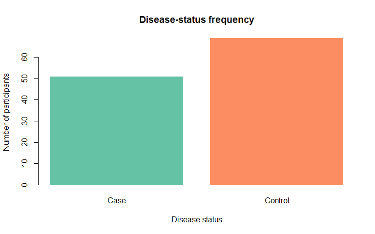
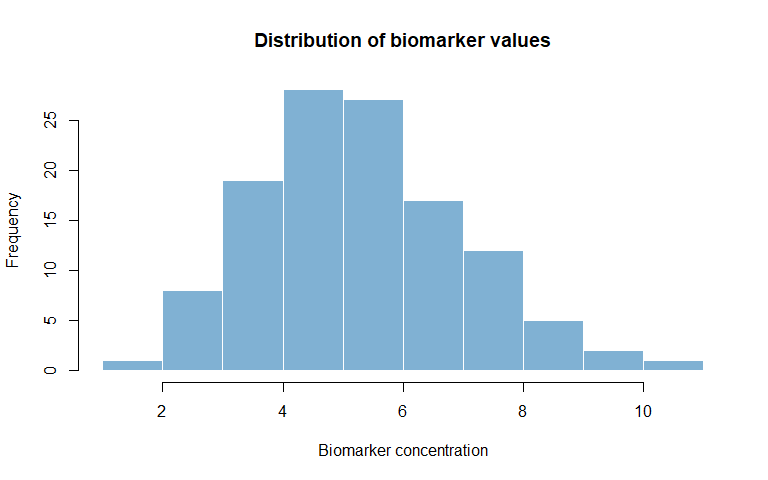
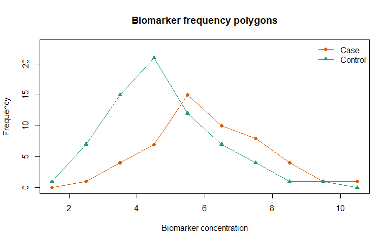
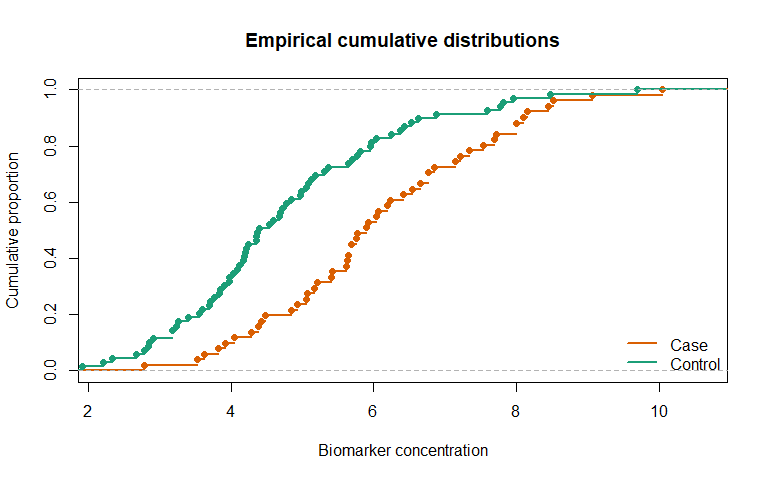
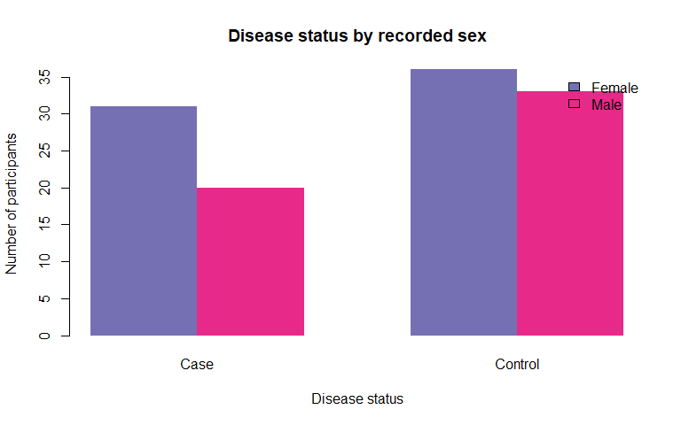
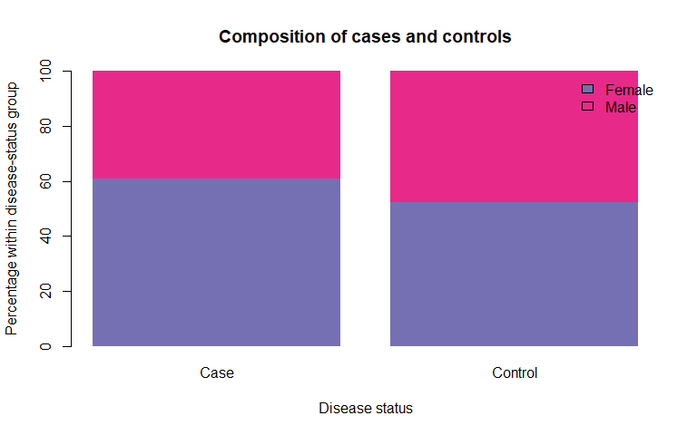
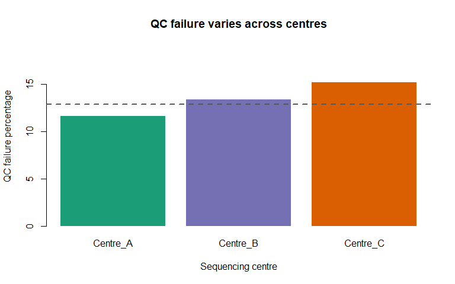

Chapter 7: Tables and Frequency Distributions
================
Sandeep Singh

- [1. Introduction](#1-introduction)
- [2. Learning Objectives](#2-learning-objectives)
- [3. A Small Biological Dataset](#3-a-small-biological-dataset)
- [4. What Is a Frequency
  Distribution?](#4-what-is-a-frequency-distribution)
- [5. One-Way Frequency Tables](#5-one-way-frequency-tables)
  - [5.1 Counts with `table()`](#51-counts-with-table)
  - [5.2 Convert the table to a data
    frame](#52-convert-the-table-to-a-data-frame)
  - [5.3 Relative frequencies and
    percentages](#53-relative-frequencies-and-percentages)
- [6. Category Order and Factors](#6-category-order-and-factors)
  - [6.1 Showing categories with zero
    observations](#61-showing-categories-with-zero-observations)
- [7. Missing Values in Frequency
  Tables](#7-missing-values-in-frequency-tables)
  - [7.1 Missing as a value versus missing as a
    category](#71-missing-as-a-value-versus-missing-as-a-category)
  - [7.2 A complete missingness table](#72-a-complete-missingness-table)
- [8. Cumulative Frequency](#8-cumulative-frequency)
- [9. Numerical Data: Ungrouped Frequency
  Tables](#9-numerical-data-ungrouped-frequency-tables)
- [10. Grouped Frequency
  Distributions](#10-grouped-frequency-distributions)
  - [10.1 Create age groups with
    `cut()`](#101-create-age-groups-with-cut)
  - [10.2 Understanding interval
    boundaries](#102-understanding-interval-boundaries)
- [11. Choosing the Number and Width of
  Classes](#11-choosing-the-number-and-width-of-classes)
  - [11.1 Sturges’ rule](#111-sturges-rule)
  - [11.2 Freedman–Diaconis rule](#112-freedmandiaconis-rule)
- [12. Bar Charts for Categorical
  Data](#12-bar-charts-for-categorical-data)
  - [12.1 Counts or percentages?](#121-counts-or-percentages)
- [13. Histograms for Continuous
  Data](#13-histograms-for-continuous-data)
  - [13.1 Bar chart versus histogram](#131-bar-chart-versus-histogram)
- [14. Frequency Polygon and Cumulative
  Distribution](#14-frequency-polygon-and-cumulative-distribution)
  - [14.1 Empirical cumulative distribution
    function](#141-empirical-cumulative-distribution-function)
- [15. Two-Way Contingency Tables](#15-two-way-contingency-tables)
  - [15.1 Disease status by recorded
    sex](#151-disease-status-by-recorded-sex)
  - [15.2 Add marginal totals](#152-add-marginal-totals)
  - [15.3 Create a contingency table with
    `xtabs()`](#153-create-a-contingency-table-with-xtabs)
- [16. Joint, Row and Column
  Proportions](#16-joint-row-and-column-proportions)
  - [16.1 Joint proportions](#161-joint-proportions)
  - [16.2 Row proportions](#162-row-proportions)
  - [16.3 Column proportions](#163-column-proportions)
- [17. Visualizing a Two-Way Table](#17-visualizing-a-two-way-table)
- [18. Three-Way and Multi-Way
  Tables](#18-three-way-and-multi-way-tables)
- [19. Counts, Proportions, Percentages, Ratios and
  Rates](#19-counts-proportions-percentages-ratios-and-rates)
  - [19.1 Example calculations](#191-example-calculations)
- [20. Genotype and Allele Frequency
  Tables](#20-genotype-and-allele-frequency-tables)
  - [20.1 Genotype frequencies](#201-genotype-frequencies)
  - [20.2 Allele counts](#202-allele-counts)
  - [20.3 Genotype by disease status](#203-genotype-by-disease-status)
- [21. Bioinformatics Count Tables](#21-bioinformatics-count-tables)
  - [21.1 RNA-seq count matrix](#211-rna-seq-count-matrix)
  - [21.2 Variant consequence counts](#212-variant-consequence-counts)
- [22. Zero Counts, Sparse Tables and Small
  Numbers](#22-zero-counts-sparse-tables-and-small-numbers)
- [23. Creating a Clean Summary
  Table](#23-creating-a-clean-summary-table)
  - [23.1 Add a display column](#231-add-a-display-column)
- [24. An Introductory “Table 1”](#24-an-introductory-table-1)
- [25. Integrated Case Study: Sequencing Quality-Control
  Summary](#25-integrated-case-study-sequencing-quality-control-summary)
  - [25.1 Scientific setting](#251-scientific-setting)
  - [25.2 Simulate the sample-level
    data](#252-simulate-the-sample-level-data)
  - [25.3 Overall QC frequency](#253-overall-qc-frequency)
  - [25.4 QC by centre](#254-qc-by-centre)
  - [25.5 QC by disease group and
    batch](#255-qc-by-disease-group-and-batch)
  - [25.6 Plot centre-specific failure
    percentages](#256-plot-centre-specific-failure-percentages)
- [26. Common Mistakes](#26-common-mistakes)
  - [Mistake 1: Reporting percentages without
    counts](#mistake-1-reporting-percentages-without-counts)
  - [Mistake 2: Ignoring missing
    values](#mistake-2-ignoring-missing-values)
  - [Mistake 3: Using the wrong
    denominator](#mistake-3-using-the-wrong-denominator)
  - [Mistake 4: Treating ordinal categories as
    nominal](#mistake-4-treating-ordinal-categories-as-nominal)
  - [Mistake 5: Using overlapping
    intervals](#mistake-5-using-overlapping-intervals)
  - [Mistake 6: Choosing bins to create a desired visual
    impression](#mistake-6-choosing-bins-to-create-a-desired-visual-impression)
  - [Mistake 7: Confusing a bar chart with a
    histogram](#mistake-7-confusing-a-bar-chart-with-a-histogram)
  - [Mistake 8: Treating transcript counts as variant
    counts](#mistake-8-treating-transcript-counts-as-variant-counts)
  - [Mistake 9: Interpreting descriptive differences as
    proof](#mistake-9-interpreting-descriptive-differences-as-proof)
  - [Mistake 10: Calculating prevalence from a case-control
    sample](#mistake-10-calculating-prevalence-from-a-case-control-sample)
- [27. Practical Reporting Checklist](#27-practical-reporting-checklist)
- [28. Chapter Summary](#28-chapter-summary)
- [29. Check Your Understanding](#29-check-your-understanding)
- [30. R Exercises](#30-r-exercises)
  - [Exercise 1: One-way table](#exercise-1-one-way-table)
  - [Exercise 2: Ordered categories](#exercise-2-ordered-categories)
  - [Exercise 3: Missingness](#exercise-3-missingness)
  - [Exercise 4: Grouped ages](#exercise-4-grouped-ages)
  - [Exercise 5: Histogram bins](#exercise-5-histogram-bins)
  - [Exercise 6: Two-way table](#exercise-6-two-way-table)
  - [Exercise 7: Genotype frequencies](#exercise-7-genotype-frequencies)
  - [Exercise 8: Variant annotation](#exercise-8-variant-annotation)
  - [Exercise 9: QC summary function](#exercise-9-qc-summary-function)
  - [Exercise 10: Sparse table](#exercise-10-sparse-table)
- [31. Mini-Project: Pathogen Genomic Surveillance
  Summary](#31-mini-project-pathogen-genomic-surveillance-summary)
- [32. Glossary](#32-glossary)
- [33. References](#33-references)
- [34. Reproducibility Information](#34-reproducibility-information)

# 1. Introduction

Raw biological data are often difficult to understand by looking at
individual rows. A dataset may contain hundreds of patients, thousands
of genes or millions of sequence variants. Before calculating advanced
statistics, we need a compact description of what the data contain.

**Tables** and **frequency distributions** answer basic but essential
questions:

- How many observations belong to each group?
- What percentage of samples passed quality control?
- How are ages or biomarker values distributed?
- Are genotype frequencies different between cases and controls?
- How much data is missing?
- Are some categories rare or absent?

These summaries are usually the first formal step in exploratory data
analysis.

> **A good frequency table converts a column of raw values into a
> scientific summary without hiding the denominator.**

------------------------------------------------------------------------

# 2. Learning Objectives

After completing this chapter, you should be able to:

1.  define frequency, relative frequency, percentage and cumulative
    frequency;
2.  construct one-way frequency tables in R;
3.  preserve biologically meaningful category order using factors;
4.  include and report missing values correctly;
5.  build grouped frequency distributions for numerical data;
6.  select sensible class intervals and understand boundary rules;
7.  distinguish a bar chart from a histogram;
8.  construct two-way and multi-way contingency tables;
9.  calculate joint, row and column proportions;
10. distinguish a count, proportion, percentage, ratio and rate;
11. summarize genotype and allele counts;
12. interpret zero cells and sparse tables;
13. produce publication-ready summary tables with base R; and
14. recognize misleading tabular and graphical summaries.

------------------------------------------------------------------------

# 3. A Small Biological Dataset

We will use a simulated clinical-genomics dataset throughout the
chapter. Each row represents one participant.

``` r
set.seed(123)

n <- 120

clinical_data <- data.frame(
  patient_id = sprintf("P%03d", seq_len(n)),
  disease_status = sample(
    c("Control", "Case"), n, replace = TRUE,
    prob = c(0.58, 0.42)
  ),
  recorded_sex = sample(
    c("Female", "Male"), n, replace = TRUE,
    prob = c(0.53, 0.47)
  ),
  age_years = round(rnorm(n, mean = 51, sd = 14)),
  expression_group = sample(
    c("Low", "Medium", "High", NA), n, replace = TRUE,
    prob = c(0.25, 0.43, 0.27, 0.05)
  ),
  genotype = sample(
    c("AA", "AG", "GG", NA), n, replace = TRUE,
    prob = c(0.48, 0.39, 0.10, 0.03)
  ),
  qc_status = sample(
    c("Pass", "Fail"), n, replace = TRUE,
    prob = c(0.90, 0.10)
  ),
  stringsAsFactors = FALSE
)

# Cases have a modestly higher simulated biomarker value
clinical_data$biomarker <- round(
  rlnorm(
    n,
    meanlog = log(4.5) + 0.18 * (clinical_data$disease_status == "Case"),
    sdlog = 0.32
  ),
  2
)

head(clinical_data)
```

<div class="kable-table">

| patient_id | disease_status | recorded_sex | age_years | expression_group | genotype | qc_status | biomarker |
|:---|:---|:---|---:|:---|:---|:---|---:|
| P001 | Control | Male | 53 | Medium | AA | Pass | 7.95 |
| P002 | Case | Female | 38 | Low | AG | Pass | 5.90 |
| P003 | Control | Female | 44 | Medium | AA | Pass | 4.69 |
| P004 | Case | Female | 47 | High | AA | Pass | 8.09 |
| P005 | Case | Female | 77 | Low | AA | Pass | 4.28 |
| P006 | Control | Male | 42 | Medium | AG | Pass | 3.90 |

</div>

This is **simulated educational data**. It does not describe real
patients and should not be used for clinical conclusions.

# 4. What Is a Frequency Distribution?

A **frequency distribution** shows how observations are distributed
across values or categories.

Suppose 20 tissue samples have the following quality-control results:

- 15 passed;
- 3 failed; and
- 2 were not assessed.

The values 15, 3 and 2 are **absolute frequencies**, usually written as
$f_i$.

If the total number of observations is $n$, the **relative frequency**
of category $i$ is:

$$r_i = \frac{f_i}{n}.$$

The percentage is:

$$p_i = \frac{f_i}{n} \times 100.$$

| QC result    | Frequency | Relative frequency | Percentage |
|--------------|----------:|-------------------:|-----------:|
| Pass         |        15 |               0.75 |        75% |
| Fail         |         3 |               0.15 |        15% |
| Not assessed |         2 |               0.10 |        10% |
| Total        |        20 |               1.00 |       100% |

Always state the denominator. Saying “15 samples passed” has a different
meaning if 20 samples were tested than if 200 were tested.

# 5. One-Way Frequency Tables

A **one-way table** summarizes one categorical variable.

## 5.1 Counts with `table()`

``` r
disease_counts <- table(clinical_data$disease_status)
disease_counts
```

    ## 
    ##    Case Control 
    ##      51      69

`table()` counts how many times each category appears.

## 5.2 Convert the table to a data frame

A data frame is convenient when we want to add proportions or rename
columns.

``` r
disease_frequency <- data.frame(
  Disease_status = names(disease_counts),
  Frequency = as.vector(disease_counts),
  stringsAsFactors = FALSE
)

disease_frequency
```

<div class="kable-table">

| Disease_status | Frequency |
|:---------------|----------:|
| Case           |        51 |
| Control        |        69 |

</div>

## 5.3 Relative frequencies and percentages

``` r
disease_frequency$Proportion <- disease_frequency$Frequency /
  sum(disease_frequency$Frequency)

disease_frequency$Percentage <- 100 * disease_frequency$Proportion

disease_frequency$Proportion <- round(disease_frequency$Proportion, 3)
disease_frequency$Percentage <- round(disease_frequency$Percentage, 1)

disease_frequency
```

<div class="kable-table">

| Disease_status | Frequency | Proportion | Percentage |
|:---------------|----------:|-----------:|-----------:|
| Case           |        51 |      0.425 |       42.5 |
| Control        |        69 |      0.575 |       57.5 |

</div>

The same relative frequencies can be calculated directly:

``` r
prop.table(disease_counts)
```

    ## 
    ##    Case Control 
    ##   0.425   0.575

Do not round values too early. Calculate with full precision, then round
only for display.

# 6. Category Order and Factors

Character categories are often displayed alphabetically. Alphabetical
order is not always scientifically meaningful.

For gene-expression categories, the desired order is usually:

> Low $\rightarrow$ Medium $\rightarrow$ High

Convert the variable to an ordered factor:

``` r
clinical_data$expression_group <- factor(
  clinical_data$expression_group,
  levels = c("Low", "Medium", "High"),
  ordered = TRUE
)

table(clinical_data$expression_group)
```

    ## 
    ##    Low Medium   High 
    ##     34     50     30

The factor levels control the order in tables, models and many plots.

## 6.1 Showing categories with zero observations

If a biologically possible category is absent from a sample, it can
still be useful to display it.

``` r
response <- factor(
  c("Complete", "Partial", "Complete", "Partial"),
  levels = c("Complete", "Partial", "No response")
)

table(response)
```

    ## response
    ##    Complete     Partial No response 
    ##           2           2           0

A zero count means the category was defined but not observed. It does
not prove that the category is impossible in the population.

# 7. Missing Values in Frequency Tables

By default, `table()` excludes `NA` values. This can silently change the
denominator.

``` r
# Default: missing genotypes are not displayed
table(clinical_data$genotype)
```

    ## 
    ## AA AG GG 
    ## 59 49  9

``` r
# Display missing values explicitly
table(clinical_data$genotype, useNA = "ifany")
```

    ## 
    ##   AA   AG   GG <NA> 
    ##   59   49    9    3

The `useNA` argument can be:

- `"no"`: exclude missing values;
- `"ifany"`: display missing values only if they exist; or
- `"always"`: always display an `NA` category.

## 7.1 Missing as a value versus missing as a category

`NA` means the value is unknown or unavailable. The text `"Unknown"` is
an ordinary category. They are not automatically equivalent.

For example:

- a genotype may be missing because the assay failed;
- ancestry may be recorded as “Not reported” because the participant
  chose not to answer;
- a treatment may be “Not applicable” for a control group.

Preserve these distinctions when they matter scientifically.

## 7.2 A complete missingness table

``` r
missing_summary <- data.frame(
  Variable = names(clinical_data),
  Missing_n = vapply(clinical_data, function(x) sum(is.na(x)), integer(1)),
  stringsAsFactors = FALSE
)

missing_summary$Missing_percent <- round(
  100 * missing_summary$Missing_n / nrow(clinical_data),
  1
)

missing_summary
```

<div class="kable-table">

|                  | Variable         | Missing_n | Missing_percent |
|:-----------------|:-----------------|----------:|----------------:|
| patient_id       | patient_id       |         0 |             0.0 |
| disease_status   | disease_status   |         0 |             0.0 |
| recorded_sex     | recorded_sex     |         0 |             0.0 |
| age_years        | age_years        |         0 |             0.0 |
| expression_group | expression_group |         6 |             5.0 |
| genotype         | genotype         |         3 |             2.5 |
| qc_status        | qc_status        |         0 |             0.0 |
| biomarker        | biomarker        |         0 |             0.0 |

</div>

This describes the amount of missingness, not its cause. Patterns and
mechanisms of missing data will be studied later.

# 8. Cumulative Frequency

A **cumulative frequency** is a running total. It is meaningful only
when categories have a natural order.

Consider disease stage I, II, III and IV. Cumulative frequency at stage
II means the number of observations at stage I **or** stage II.

``` r
stage <- factor(
  c("I", "II", "II", "III", "I", "IV", "III", "II", "III", "I"),
  levels = c("I", "II", "III", "IV"),
  ordered = TRUE
)

stage_counts <- table(stage)

stage_distribution <- data.frame(
  Stage = names(stage_counts),
  Frequency = as.vector(stage_counts),
  Cumulative_frequency = cumsum(as.vector(stage_counts)),
  Cumulative_percent = round(100 * cumsum(as.vector(stage_counts)) /
                               sum(stage_counts), 1),
  stringsAsFactors = FALSE
)

stage_distribution
```

<div class="kable-table">

| Stage | Frequency | Cumulative_frequency | Cumulative_percent |
|:------|----------:|---------------------:|-------------------:|
| I     |         3 |                    3 |                 30 |
| II    |         3 |                    6 |                 60 |
| III   |         3 |                    9 |                 90 |
| IV    |         1 |                   10 |                100 |

</div>

Cumulative frequency is not meaningful for unordered categories such as
blood type A, B, AB and O because no natural “up to” order exists.

# 9. Numerical Data: Ungrouped Frequency Tables

For discrete numerical variables with relatively few possible values,
each value can be counted separately.

Example: number of antibiotic-resistant genes found in each bacterial
isolate.

``` r
set.seed(456)
resistance_gene_count <- rpois(80, lambda = 3)

resistance_table <- table(resistance_gene_count)

resistance_distribution <- data.frame(
  Gene_count = as.integer(names(resistance_table)),
  Frequency = as.vector(resistance_table),
  stringsAsFactors = FALSE
)

resistance_distribution$Percentage <- round(
  100 * resistance_distribution$Frequency /
    sum(resistance_distribution$Frequency),
  1
)

resistance_distribution$Cumulative_frequency <- cumsum(
  resistance_distribution$Frequency
)

resistance_distribution
```

<div class="kable-table">

| Gene_count | Frequency | Percentage | Cumulative_frequency |
|-----------:|----------:|-----------:|---------------------:|
|          0 |         3 |        3.8 |                    3 |
|          1 |         9 |       11.2 |                   12 |
|          2 |        22 |       27.5 |                   34 |
|          3 |        19 |       23.8 |                   53 |
|          4 |         9 |       11.2 |                   62 |
|          5 |         8 |       10.0 |                   70 |
|          6 |         8 |       10.0 |                   78 |
|          7 |         1 |        1.2 |                   79 |
|          8 |         1 |        1.2 |                   80 |

</div>

An ungrouped table preserves exact values. It becomes unwieldy when a
variable has many distinct values, such as age, blood pressure or gene
expression.

# 10. Grouped Frequency Distributions

A **grouped frequency distribution** divides numerical values into
intervals called **classes** or **bins**.

Example age groups:

- 18–29 years;
- 30–39 years;
- 40–49 years;
- 50–59 years;
- 60–69 years; and
- 70 years or older.

Each interval has:

- a lower boundary;
- an upper boundary;
- a class width; and
- a frequency.

## 10.1 Create age groups with `cut()`

``` r
age_breaks <- c(-Inf, 29, 39, 49, 59, 69, Inf)
age_labels <- c("18-29", "30-39", "40-49", "50-59", "60-69", "70+")

clinical_data$age_group <- cut(
  clinical_data$age_years,
  breaks = age_breaks,
  labels = age_labels,
  right = TRUE
)

age_counts <- table(clinical_data$age_group, useNA = "ifany")

age_distribution <- data.frame(
  Age_group = names(age_counts),
  Frequency = as.vector(age_counts),
  stringsAsFactors = FALSE
)

age_distribution$Percentage <- round(
  100 * age_distribution$Frequency / sum(age_distribution$Frequency),
  1
)

age_distribution$Cumulative_frequency <- cumsum(age_distribution$Frequency)
age_distribution$Cumulative_percent <- round(
  100 * age_distribution$Cumulative_frequency /
    sum(age_distribution$Frequency),
  1
)

age_distribution
```

<div class="kable-table">

| Age_group | Frequency | Percentage | Cumulative_frequency | Cumulative_percent |
|:----------|----------:|-----------:|---------------------:|-------------------:|
| 18-29     |         3 |        2.5 |                    3 |                2.5 |
| 30-39     |        22 |       18.3 |                   25 |               20.8 |
| 40-49     |        37 |       30.8 |                   62 |               51.7 |
| 50-59     |        29 |       24.2 |                   91 |               75.8 |
| 60-69     |        18 |       15.0 |                  109 |               90.8 |
| 70+       |        11 |        9.2 |                  120 |              100.0 |

</div>

## 10.2 Understanding interval boundaries

With `right = TRUE`, intervals are right-closed. For example, `(29, 39]`
contains values greater than 29 and less than or equal to 39.

With `right = FALSE`, `[30, 40)` contains values greater than or equal
to 30 and less than 40.

``` r
test_ages <- c(29, 30, 39, 40)

data.frame(
  Age = test_ages,
  Right_closed = cut(test_ages, breaks = c(20, 30, 40, 50),
                     right = TRUE, include.lowest = TRUE),
  Left_closed = cut(test_ages, breaks = c(20, 30, 40, 50),
                    right = FALSE, include.lowest = TRUE)
)
```

<div class="kable-table">

| Age | Right_closed | Left_closed |
|----:|:-------------|:------------|
|  29 | \[20,30\]    | \[20,30)    |
|  30 | \[20,30\]    | \[30,40)    |
|  39 | (30,40\]     | \[30,40)    |
|  40 | (30,40\]     | \[40,50\]   |

</div>

State boundary rules clearly. Ambiguous labels such as “20–30” can make
it unclear where age 30 belongs.

# 11. Choosing the Number and Width of Classes

Too few classes hide important structure. Too many classes produce a
noisy summary.

There is no single correct choice, but common rules provide starting
points.

## 11.1 Sturges’ rule

For a sample of size $n$:

$$k = \left\lceil \log_2(n) + 1 \right\rceil,$$

where $k$ is the suggested number of classes.

``` r
n_observations <- sum(!is.na(clinical_data$biomarker))
k_sturges <- ceiling(log2(n_observations) + 1)
k_sturges
```

    ## [1] 8

## 11.2 Freedman–Diaconis rule

The Freedman–Diaconis class width is:

$$h = 2 \times IQR(x) \times n^{-1/3}.$$

It uses the interquartile range and is less sensitive to extreme values
than a rule based on the full range.

``` r
x <- clinical_data$biomarker
x <- x[!is.na(x)]

fd_width <- 2 * IQR(x) / length(x)^(1 / 3)
fd_width
```

    ## [1] 0.9346317

``` r
fd_breaks <- pretty(range(x),
                    n = ceiling(diff(range(x)) / fd_width))
fd_breaks
```

    ##  [1]  1  2  3  4  5  6  7  8  9 10 11

Rules are guides. Class boundaries should also be interpretable.
Clinically meaningful cut-offs may be preferable when the goal is
clinical classification rather than exploring distribution shape.

# 12. Bar Charts for Categorical Data

A bar chart displays category frequencies. Bars are separated because
the categories are distinct.

``` r
barplot(
  disease_counts,
  col = c("#66C2A5", "#FC8D62"),
  border = NA,
  ylab = "Number of participants",
  xlab = "Disease status",
  main = "Disease-status frequency"
)
```

<div class="figure" style="text-align: center">


<p class="caption">

Frequency of simulated disease status. The denominator is 120
participants.
</p>

</div>

## 12.1 Counts or percentages?

Use counts when actual sample size matters. Use percentages when
comparing groups of different sizes. Often the clearest report includes
both:

> Case: 49/120 (40.8%)

Avoid a percentage without its denominator.

# 13. Histograms for Continuous Data

A histogram divides a numerical scale into intervals. Adjacent bars
touch because the intervals are continuous.

``` r
hist(
  clinical_data$biomarker,
  breaks = "FD",
  col = "#80B1D3",
  border = "white",
  xlab = "Biomarker concentration",
  ylab = "Frequency",
  main = "Distribution of biomarker values"
)
```

<div class="figure" style="text-align: center">


<p class="caption">

Histogram of the simulated continuous biomarker values.
</p>

</div>

## 13.1 Bar chart versus histogram

| Feature | Bar chart | Histogram |
|----|----|----|
| Data type | Categorical or discrete | Continuous numerical |
| Horizontal axis | Categories | Numerical intervals |
| Bar order | May be rearranged for nominal data | Must follow numerical order |
| Gaps | Usually present | Usually absent |
| Width meaning | Mostly visual | Represents interval width |
| Main purpose | Compare categories | Show distribution shape |

Do not use a histogram for genotype labels such as `AA`, `AG` and `GG`.
Do not use a categorical bar chart of every unique biomarker value when
the variable is continuous.

# 14. Frequency Polygon and Cumulative Distribution

A **frequency polygon** joins frequencies at class midpoints. It is
useful for comparing multiple distributions.

``` r
common_breaks <- pretty(range(clinical_data$biomarker), n = 8)

case_hist <- hist(
  clinical_data$biomarker[clinical_data$disease_status == "Case"],
  breaks = common_breaks,
  plot = FALSE
)

control_hist <- hist(
  clinical_data$biomarker[clinical_data$disease_status == "Control"],
  breaks = common_breaks,
  plot = FALSE
)

y_max <- max(case_hist$counts, control_hist$counts)

plot(case_hist$mids, case_hist$counts, type = "o", pch = 19,
     col = "#D95F02", ylim = c(0, y_max + 2),
     xlab = "Biomarker concentration", ylab = "Frequency",
     main = "Biomarker frequency polygons")
lines(control_hist$mids, control_hist$counts, type = "o", pch = 17,
      col = "#1B9E77")
legend("topright", legend = c("Case", "Control"),
       col = c("#D95F02", "#1B9E77"), pch = c(19, 17),
       lty = 1, bty = "n")
```

<div class="figure" style="text-align: center">


<p class="caption">

Frequency polygons compare biomarker distributions between cases and
controls.
</p>

</div>

The two groups must use identical class boundaries for a fair
comparison.

## 14.1 Empirical cumulative distribution function

The empirical cumulative distribution function, or ECDF, gives the
proportion of observations less than or equal to each value.

``` r
plot(
  ecdf(clinical_data$biomarker[clinical_data$disease_status == "Case"]),
  col = "#D95F02", lwd = 2,
  xlab = "Biomarker concentration",
  ylab = "Cumulative proportion",
  main = "Empirical cumulative distributions"
)
lines(
  ecdf(clinical_data$biomarker[clinical_data$disease_status == "Control"]),
  col = "#1B9E77", lwd = 2
)
legend("bottomright", legend = c("Case", "Control"),
       col = c("#D95F02", "#1B9E77"), lwd = 2, bty = "n")
```

<div class="figure" style="text-align: center">


<p class="caption">

Empirical cumulative distributions of biomarker values by disease
status.
</p>

</div>

Unlike a histogram, an ECDF does not require choosing bins.

# 15. Two-Way Contingency Tables

A **contingency table**, or cross-tabulation, summarizes two categorical
variables together.

## 15.1 Disease status by recorded sex

``` r
sex_disease_table <- table(
  Recorded_sex = clinical_data$recorded_sex,
  Disease_status = clinical_data$disease_status
)

sex_disease_table
```

    ##             Disease_status
    ## Recorded_sex Case Control
    ##       Female   31      36
    ##       Male     20      33

Each interior cell is a **joint frequency**. For example, the cell at
row `Female` and column `Case` counts participants who satisfy both
conditions.

## 15.2 Add marginal totals

``` r
addmargins(sex_disease_table)
```

    ##             Disease_status
    ## Recorded_sex Case Control Sum
    ##       Female   31      36  67
    ##       Male     20      33  53
    ##       Sum      51      69 120

The final row contains column totals, the final column contains row
totals, and the bottom-right value is the grand total.

## 15.3 Create a contingency table with `xtabs()`

``` r
xtabs(~ recorded_sex + disease_status, data = clinical_data)
```

    ##             disease_status
    ## recorded_sex Case Control
    ##       Female   31      36
    ##       Male     20      33

`xtabs()` is convenient because its formula syntax extends naturally to
more variables.

# 16. Joint, Row and Column Proportions

The denominator changes the scientific question.

## 16.1 Joint proportions

``` r
round(prop.table(sex_disease_table), 3)
```

    ##             Disease_status
    ## Recorded_sex  Case Control
    ##       Female 0.258   0.300
    ##       Male   0.167   0.275

Every cell is divided by the grand total. All cells sum to 1.

Question answered:

> What proportion of all participants belongs to each sex–disease
> combination?

## 16.2 Row proportions

``` r
round(prop.table(sex_disease_table, margin = 1), 3)
```

    ##             Disease_status
    ## Recorded_sex  Case Control
    ##       Female 0.463   0.537
    ##       Male   0.377   0.623

Every row sums to 1.

Question answered:

> Within each recorded-sex group, what proportion are cases and
> controls?

## 16.3 Column proportions

``` r
round(prop.table(sex_disease_table, margin = 2), 3)
```

    ##             Disease_status
    ## Recorded_sex  Case Control
    ##       Female 0.608   0.522
    ##       Male   0.392   0.478

Every column sums to 1.

Question answered:

> Within cases or controls, what proportion belongs to each recorded-sex
> group?

> **Never report “the percentage” without specifying its denominator.**

# 17. Visualizing a Two-Way Table

A grouped bar chart can display a contingency table.

``` r
barplot(
  sex_disease_table,
  beside = TRUE,
  col = c("#7570B3", "#E7298A"),
  border = NA,
  xlab = "Disease status",
  ylab = "Number of participants",
  main = "Disease status by recorded sex"
)
legend(
  "topright",
  legend = rownames(sex_disease_table),
  fill = c("#7570B3", "#E7298A"),
  bty = "n"
)
```

<div class="figure" style="text-align: center">


<p class="caption">

Disease-status counts within recorded-sex groups.
</p>

</div>

For comparing group composition when group sizes differ, a 100% stacked
bar chart may be more informative.

``` r
column_percent <- 100 * prop.table(sex_disease_table, margin = 2)

barplot(
  column_percent,
  col = c("#7570B3", "#E7298A"),
  border = NA,
  xlab = "Disease status",
  ylab = "Percentage within disease-status group",
  main = "Composition of cases and controls",
  ylim = c(0, 100)
)
legend(
  "topright",
  legend = rownames(column_percent),
  fill = c("#7570B3", "#E7298A"),
  bty = "n"
)
```

<div class="figure" style="text-align: center">


<p class="caption">

Each disease-status column sums to 100%.
</p>

</div>

The 100% chart shows composition but hides the difference in group
sample sizes. Counts and percentages serve different purposes.

# 18. Three-Way and Multi-Way Tables

More than two categorical variables can be summarized together.

``` r
three_way <- xtabs(
  ~ recorded_sex + disease_status + qc_status,
  data = clinical_data
)

three_way
```

    ## , , qc_status = Fail
    ## 
    ##             disease_status
    ## recorded_sex Case Control
    ##       Female    2       0
    ##       Male      1       6
    ## 
    ## , , qc_status = Pass
    ## 
    ##             disease_status
    ## recorded_sex Case Control
    ##       Female   29      36
    ##       Male     19      27

The result is a three-dimensional array. `ftable()` displays it in a
flatter layout.

``` r
ftable(three_way)
```

    ##                             qc_status Fail Pass
    ## recorded_sex disease_status                    
    ## Female       Case                        2   29
    ##              Control                     0   36
    ## Male         Case                        1   19
    ##              Control                     6   27

Multi-way tables can become difficult to read, especially when many
cells are empty. Use them to answer a defined question rather than
displaying every possible combination.

# 19. Counts, Proportions, Percentages, Ratios and Rates

These terms are related but not interchangeable.

| Measure | Meaning | Example |
|----|----|----|
| Count | Number of observed events or units | 24 infections |
| Proportion | Numerator is part of denominator | 24 infected among 200 participants = 0.12 |
| Percentage | Proportion multiplied by 100 | 12% infected |
| Ratio | Numerator need not be part of denominator | 24 infected : 176 uninfected |
| Rate | Occurrence per amount of time at risk | 8 infections per 1,000 person-months |

## 19.1 Example calculations

``` r
infected <- 24
participants <- 200
person_months <- 3000

proportion_infected <- infected / participants
percentage_infected <- 100 * proportion_infected
incidence_rate <- infected / person_months * 1000

data.frame(
  Measure = c("Count", "Proportion", "Percentage",
              "Rate per 1,000 person-months"),
  Value = c(infected, proportion_infected,
            percentage_infected, incidence_rate)
)
```

<div class="kable-table">

| Measure                      | Value |
|:-----------------------------|------:|
| Count                        | 24.00 |
| Proportion                   |  0.12 |
| Percentage                   | 12.00 |
| Rate per 1,000 person-months |  8.00 |

</div>

A rate requires a time component or person-time denominator. The
percentage of participants who already have a disease is a prevalence
proportion, not an incidence rate.

# 20. Genotype and Allele Frequency Tables

Genetic data provide an important biological application of frequency
tables.

Suppose a biallelic locus has alleles `A` and `G`, producing genotypes
`AA`, `AG` and `GG`.

## 20.1 Genotype frequencies

``` r
genotype_counts <- table(clinical_data$genotype, useNA = "ifany")
genotype_counts
```

    ## 
    ##   AA   AG   GG <NA> 
    ##   59   49    9    3

For genotype-frequency calculations, missing genotypes should be
excluded from the denominator but reported separately.

``` r
called_genotypes <- clinical_data$genotype[!is.na(clinical_data$genotype)]
called_counts <- table(factor(called_genotypes,
                              levels = c("AA", "AG", "GG")))

genotype_distribution <- data.frame(
  Genotype = names(called_counts),
  Count = as.vector(called_counts),
  Frequency = round(as.vector(prop.table(called_counts)), 3),
  stringsAsFactors = FALSE
)

genotype_distribution
```

<div class="kable-table">

| Genotype | Count | Frequency |
|:---------|------:|----------:|
| AA       |    59 |     0.504 |
| AG       |    49 |     0.419 |
| GG       |     9 |     0.077 |

</div>

## 20.2 Allele counts

Every successfully genotyped diploid individual contributes two alleles.

If $n_{AA}$, $n_{AG}$ and $n_{GG}$ are genotype counts:

$$n_A = 2n_{AA} + n_{AG}$$

$$n_G = 2n_{GG} + n_{AG}.$$

``` r
n_AA <- unname(called_counts["AA"])
n_AG <- unname(called_counts["AG"])
n_GG <- unname(called_counts["GG"])

A_count <- 2 * n_AA + n_AG
G_count <- 2 * n_GG + n_AG
total_alleles <- A_count + G_count

allele_distribution <- data.frame(
  Allele = c("A", "G"),
  Count = c(A_count, G_count),
  Frequency = round(c(A_count, G_count) / total_alleles, 3),
  stringsAsFactors = FALSE
)

allele_distribution
```

<div class="kable-table">

| Allele | Count | Frequency |
|:-------|------:|----------:|
| A      |   167 |     0.714 |
| G      |    67 |     0.286 |

</div>

The two allele frequencies should sum to 1, apart from display rounding.

``` r
sum(allele_distribution$Count / total_alleles)
```

    ## [1] 1

## 20.3 Genotype by disease status

``` r
genotype_disease <- table(
  Genotype = factor(clinical_data$genotype,
                    levels = c("AA", "AG", "GG")),
  Disease_status = clinical_data$disease_status,
  useNA = "no"
)

genotype_disease
```

    ##         Disease_status
    ## Genotype Case Control
    ##       AA   21      38
    ##       AG   25      24
    ##       GG    4       5

``` r
round(100 * prop.table(genotype_disease, margin = 2), 1)
```

    ##         Disease_status
    ## Genotype Case Control
    ##       AA 42.0    56.7
    ##       AG 50.0    35.8
    ##       GG  8.0     7.5

These descriptive differences do not establish genetic association.
Later chapters will introduce chi-squared tests, Fisher’s exact test,
logistic regression, Hardy–Weinberg equilibrium and adjustment for
population structure.

# 21. Bioinformatics Count Tables

The word **count** has different roles in bioinformatics.

## 21.1 RNA-seq count matrix

In an RNA-seq count matrix:

- rows commonly represent genes;
- columns represent biological samples; and
- cells contain reads or fragments assigned to a gene.

``` r
set.seed(789)

rna_counts <- matrix(
  rpois(30, lambda = 40),
  nrow = 6,
  dimnames = list(
    paste0("Gene_", LETTERS[1:6]),
    paste0("Sample_", 1:5)
  )
)

rna_counts
```

    ##        Sample_1 Sample_2 Sample_3 Sample_4 Sample_5
    ## Gene_A       43       44       36       28       44
    ## Gene_B       25       37       36       38       44
    ## Gene_C       44       36       35       45       36
    ## Gene_D       36       36       58       38       31
    ## Gene_E       39       40       33       37       38
    ## Gene_F       26       36       30       42       40

This matrix is not a one-way frequency table of participants. Each entry
is a molecular count produced through a sequencing process. Library
size, gene length, composition and biological variability affect
interpretation.

``` r
data.frame(
  Sample = colnames(rna_counts),
  Total_assigned_reads = colSums(rna_counts),
  stringsAsFactors = FALSE
)
```

<div class="kable-table">

|          | Sample   | Total_assigned_reads |
|:---------|:---------|---------------------:|
| Sample_1 | Sample_1 |                  213 |
| Sample_2 | Sample_2 |                  229 |
| Sample_3 | Sample_3 |                  228 |
| Sample_4 | Sample_4 |                  228 |
| Sample_5 | Sample_5 |                  233 |

</div>

Raw RNA-seq counts should not normally be converted to percentages and
compared naively across samples for differential-expression inference.
Specialized models and normalization are needed.

## 21.2 Variant consequence counts

A simple frequency table is appropriate for summarizing annotated
variant consequences.

``` r
set.seed(987)

variant_consequence <- sample(
  c("Intronic", "Missense", "Synonymous", "Intergenic", "Stop gained"),
  size = 500,
  replace = TRUE,
  prob = c(0.44, 0.15, 0.12, 0.27, 0.02)
)

consequence_counts <- sort(table(variant_consequence), decreasing = TRUE)

consequence_distribution <- data.frame(
  Consequence = names(consequence_counts),
  Count = as.vector(consequence_counts),
  Percentage = round(100 * as.vector(prop.table(consequence_counts)), 1),
  stringsAsFactors = FALSE
)

consequence_distribution
```

<div class="kable-table">

| Consequence | Count | Percentage |
|:------------|------:|-----------:|
| Intronic    |   219 |       43.8 |
| Intergenic  |   139 |       27.8 |
| Missense    |    68 |       13.6 |
| Synonymous  |    67 |       13.4 |
| Stop gained |     7 |        1.4 |

</div>

Counts depend on the annotation rules. A single variant can have
multiple transcript consequences, so specify whether you counted
variants, transcripts or one selected consequence per variant.

# 22. Zero Counts, Sparse Tables and Small Numbers

A **zero cell** means no observations occurred in a category
combination. It may reflect:

- a truly impossible combination;
- a rare event;
- inadequate sample size;
- a category definition problem; or
- missing or filtered observations.

A table is **sparse** when many cells contain small or zero counts.

Sparse tables create problems for some statistical methods. Combining
categories may help only when the combination is scientifically
defensible. Never merge distinct biological categories solely to obtain
a preferred statistical result.

Small counts can also threaten participant privacy. Public reports may
need suppression or aggregation according to institutional and legal
rules.

# 23. Creating a Clean Summary Table

A useful descriptive table reports a count and percentage together.

``` r
frequency_table <- function(x, include_missing = TRUE, digits = 1) {
  use_na <- if (include_missing) "ifany" else "no"
  counts <- table(x, useNA = use_na)
  total <- sum(counts)

  result <- data.frame(
    Category = names(counts),
    N = as.vector(counts),
    Percent = round(100 * as.vector(counts) / total, digits),
    stringsAsFactors = FALSE
  )

  result
}

frequency_table(clinical_data$qc_status)
```

<div class="kable-table">

| Category |   N | Percent |
|:---------|----:|--------:|
| Fail     |   9 |     7.5 |
| Pass     | 111 |    92.5 |

</div>

The function:

1.  receives a vector `x`;
2.  decides whether to include missing values;
3.  counts categories with `table()`;
4.  calculates percentages using the displayed total; and
5.  returns a regular data frame that is safe to print with
    `knitr::kable()`.

## 23.1 Add a display column

``` r
qc_summary <- frequency_table(clinical_data$qc_status)

qc_summary$Display <- paste0(
  qc_summary$N,
  " (",
  format(qc_summary$Percent, nsmall = 1),
  "%)"
)

qc_summary
```

<div class="kable-table">

| Category |   N | Percent | Display     |
|:---------|----:|--------:|:------------|
| Fail     |   9 |     7.5 | 9 ( 7.5%)   |
| Pass     | 111 |    92.5 | 111 (92.5%) |

</div>

Keep numerical count and percentage columns in the analysis dataset. The
combined display column is mainly for a report.

# 24. An Introductory “Table 1”

Clinical and epidemiological reports often begin with a table describing
the sample. It is commonly called **Table 1**.

At this stage, we can create a simple version containing categorical
frequencies and broad numerical summaries. Measures of central tendency
and dispersion will be covered in the next chapters.

``` r
case_data <- clinical_data[clinical_data$disease_status == "Case", ]
control_data <- clinical_data[clinical_data$disease_status == "Control", ]

table_one <- data.frame(
  Characteristic = c(
    "Participants, n",
    "Female, n (%)",
    "QC pass, n (%)",
    "Age, mean",
    "Biomarker, mean"
  ),
  Control = c(
    nrow(control_data),
    sprintf("%d (%.1f%%)",
            sum(control_data$recorded_sex == "Female"),
            100 * mean(control_data$recorded_sex == "Female")),
    sprintf("%d (%.1f%%)",
            sum(control_data$qc_status == "Pass"),
            100 * mean(control_data$qc_status == "Pass")),
    sprintf("%.1f", mean(control_data$age_years)),
    sprintf("%.2f", mean(control_data$biomarker))
  ),
  Case = c(
    nrow(case_data),
    sprintf("%d (%.1f%%)",
            sum(case_data$recorded_sex == "Female"),
            100 * mean(case_data$recorded_sex == "Female")),
    sprintf("%d (%.1f%%)",
            sum(case_data$qc_status == "Pass"),
            100 * mean(case_data$qc_status == "Pass")),
    sprintf("%.1f", mean(case_data$age_years)),
    sprintf("%.2f", mean(case_data$biomarker))
  ),
  stringsAsFactors = FALSE,
  check.names = FALSE
)

table_one
```

<div class="kable-table">

| Characteristic  | Control    | Case       |
|:----------------|:-----------|:-----------|
| Participants, n | 69         | 51         |
| Female, n (%)   | 36 (52.2%) | 31 (60.8%) |
| QC pass, n (%)  | 63 (91.3%) | 48 (94.1%) |
| Age, mean       | 50.1       | 51.4       |
| Biomarker, mean | 4.76       | 6.07       |

</div>

Table 1 is descriptive. It should help readers understand who was
studied. Automatic hypothesis tests in every Table 1 row are often
unhelpful, particularly in randomized trials where any baseline
differences arose by chance.

# 25. Integrated Case Study: Sequencing Quality-Control Summary

## 25.1 Scientific setting

A laboratory sequenced 240 samples across two disease groups, three
centres and four batches. We want to describe QC outcomes before
downstream analysis.

## 25.2 Simulate the sample-level data

``` r
set.seed(246)

qc_data <- data.frame(
  sample_id = sprintf("SEQ%03d", 1:240),
  centre = sample(c("Centre_A", "Centre_B", "Centre_C"),
                  240, replace = TRUE, prob = c(0.40, 0.35, 0.25)),
  disease_group = sample(c("Control", "Case"),
                         240, replace = TRUE),
  batch = sample(paste0("Batch_", 1:4),
                 240, replace = TRUE),
  stringsAsFactors = FALSE
)

# Make failure slightly more common in Centre_C for demonstration
failure_probability <- ifelse(qc_data$centre == "Centre_C", 0.18, 0.07)
qc_data$qc_result <- ifelse(
  rbinom(240, size = 1, prob = failure_probability) == 1,
  "Fail", "Pass"
)

head(qc_data)
```

<div class="kable-table">

| sample_id | centre   | disease_group | batch   | qc_result |
|:----------|:---------|:--------------|:--------|:----------|
| SEQ001    | Centre_B | Control       | Batch_3 | Pass      |
| SEQ002    | Centre_A | Control       | Batch_4 | Pass      |
| SEQ003    | Centre_B | Control       | Batch_1 | Pass      |
| SEQ004    | Centre_A | Control       | Batch_2 | Pass      |
| SEQ005    | Centre_A | Case          | Batch_2 | Pass      |
| SEQ006    | Centre_B | Control       | Batch_2 | Pass      |

</div>

## 25.3 Overall QC frequency

``` r
overall_qc <- frequency_table(qc_data$qc_result)
overall_qc
```

<div class="kable-table">

| Category |   N | Percent |
|:---------|----:|--------:|
| Fail     |  31 |    12.9 |
| Pass     | 209 |    87.1 |

</div>

## 25.4 QC by centre

``` r
qc_by_centre <- table(
  Centre = qc_data$centre,
  QC_result = qc_data$qc_result
)

qc_by_centre
```

    ##           QC_result
    ## Centre     Fail Pass
    ##   Centre_A   13   99
    ##   Centre_B   11   71
    ##   Centre_C    7   39

``` r
round(100 * prop.table(qc_by_centre, margin = 1), 1)
```

    ##           QC_result
    ## Centre     Fail Pass
    ##   Centre_A 11.6 88.4
    ##   Centre_B 13.4 86.6
    ##   Centre_C 15.2 84.8

Row percentages are appropriate because the question is:

> Within each centre, what percentage of samples passed or failed?

## 25.5 QC by disease group and batch

``` r
qc_three_way <- xtabs(
  ~ disease_group + batch + qc_result,
  data = qc_data
)

ftable(qc_three_way)
```

    ##                       qc_result Fail Pass
    ## disease_group batch                      
    ## Case          Batch_1              0   29
    ##               Batch_2              8   28
    ##               Batch_3              6   21
    ##               Batch_4              3   21
    ## Control       Batch_1              5   26
    ##               Batch_2              5   30
    ##               Batch_3              2   23
    ##               Batch_4              2   31

## 25.6 Plot centre-specific failure percentages

``` r
centre_percent <- 100 * prop.table(qc_by_centre, margin = 1)
failure_percent <- centre_percent[, "Fail"]

barplot(
  failure_percent,
  col = c("#1B9E77", "#7570B3", "#D95F02"),
  border = NA,
  ylab = "QC failure percentage",
  xlab = "Sequencing centre",
  main = "QC failure varies across centres",
  ylim = c(0, max(failure_percent) * 1.25)
)
abline(h = mean(qc_data$qc_result == "Fail") * 100,
       lty = 2, lwd = 2, col = "grey35")
```

<div class="figure" style="text-align: center">


<p class="caption">

Simulated sequencing QC failure percentage by centre.
</p>

</div>

This descriptive difference is a signal to investigate. It does not by
itself prove that the centre caused the failures. Sample type, storage,
extraction method or batch allocation might differ between centres.

# 26. Common Mistakes

## Mistake 1: Reporting percentages without counts

“50% failed” could mean 1 of 2 samples or 500 of 1,000. Report both
count and denominator.

## Mistake 2: Ignoring missing values

Default functions may exclude missing values. State whether percentages
use all observations or only non-missing observations.

## Mistake 3: Using the wrong denominator

Row, column and total percentages answer different questions.

## Mistake 4: Treating ordinal categories as nominal

Preserve the biological order of categories such as low, medium and
high.

## Mistake 5: Using overlapping intervals

Age groups “20–30” and “30–40” both appear to contain age 30. Define
boundaries precisely.

## Mistake 6: Choosing bins to create a desired visual impression

Show reasonable alternative widths during exploration. Do not manipulate
bins to exaggerate or hide distribution features.

## Mistake 7: Confusing a bar chart with a histogram

Bar charts summarize categories; histograms summarize numerical
intervals.

## Mistake 8: Treating transcript counts as variant counts

Define exactly what each row or count represents.

## Mistake 9: Interpreting descriptive differences as proof

A frequency table describes the sample. Statistical inference and causal
interpretation require additional design and analysis.

## Mistake 10: Calculating prevalence from a case-control sample

The case-to-control ratio was often fixed by design and does not
estimate population prevalence.

# 27. Practical Reporting Checklist

Before presenting a table, ask:

- What is the observational unit?
- What does one count represent?
- Is the variable nominal, ordinal, discrete or continuous?
- Is the category order meaningful?
- Are all expected categories shown?
- Are missing values visible or explicitly excluded?
- What is the denominator for every percentage?
- Do percentages sum to approximately 100%, allowing for rounding?
- Are class intervals non-overlapping and clearly labelled?
- Are counts so small that privacy or sparse-data problems arise?
- Does the title state the population, variable and relevant time or
  setting?
- Can another researcher reproduce the table from the code?

# 28. Chapter Summary

- Frequency is the number of times a value or category occurs.
- Relative frequency divides a category count by a stated total.
- Percentage is relative frequency multiplied by 100.
- Cumulative frequency is appropriate only for ordered variables.
- `table()` creates frequency and contingency tables in base R.
- `prop.table()` calculates total, row or column proportions.
- `addmargins()` adds totals, while `xtabs()` uses formula notation.
- Factors preserve category order and can show defined zero-count
  categories.
- Missing values must be handled explicitly because they affect
  denominators.
- `cut()` converts continuous values into non-overlapping class
  intervals.
- Bar charts display categories; histograms display continuous
  distributions.
- Counts, proportions, ratios and rates have different meanings.
- Genotype counts can be converted into allele counts for diploid
  samples.
- Omics count matrices require interpretation according to their
  biological and technical units.
- A descriptive table organizes evidence but does not itself establish
  association or causation.

# 29. Check Your Understanding

1.  What is the difference between frequency and relative frequency?
2.  Why should a percentage usually be accompanied by a count?
3.  When is cumulative frequency scientifically meaningful?
4.  How does `table(x, useNA = "ifany")` differ from `table(x)`?
5.  Why would you convert `Low`, `Medium` and `High` to an ordered
    factor?
6.  What does `right = FALSE` mean in `cut()`?
7.  How does a histogram differ from a bar chart?
8.  What question is answered by row percentages in a contingency table?
9.  Why may column percentages answer a different question?
10. What is the difference between a proportion and a rate?
11. How many alleles are contributed by 50 successfully genotyped
    diploid individuals?
12. Why might a variant consequence count depend on transcript
    annotation rules?
13. What could produce a zero cell in a two-way table?
14. Why should frequency-polygon groups use the same class boundaries?
15. Can a QC table prove that a sequencing centre caused failures?
    Explain.

# 30. R Exercises

## Exercise 1: One-way table

Create a vector of 30 blood groups containing `A`, `B`, `AB` and `O`.
Produce counts, proportions and percentages.

## Exercise 2: Ordered categories

Create an ordered factor with the categories `Mild`, `Moderate` and
`Severe`. Build a cumulative frequency table.

## Exercise 3: Missingness

Add five `NA` values to a genotype vector. Compare the results of
`table()` using `useNA = "no"`, `"ifany"` and `"always"`.

## Exercise 4: Grouped ages

Simulate 200 ages. Create clinically meaningful age groups with `cut()`
and report frequency, percentage and cumulative percentage.

## Exercise 5: Histogram bins

Plot the same biomarker data using 5, 10 and 30 breaks and then the
Freedman–Diaconis rule. Explain how binning changes the visual
impression.

## Exercise 6: Two-way table

Create a treatment-by-response table. Calculate joint, row and column
proportions and explain each denominator.

## Exercise 7: Genotype frequencies

For genotype counts `AA = 40`, `AG = 45` and `GG = 15`, calculate
genotype and allele frequencies in R.

## Exercise 8: Variant annotation

Simulate 1,000 variant consequences. Produce a descending table
containing counts and percentages and display it with a bar chart.

## Exercise 9: QC summary function

Modify `frequency_table()` so it adds a final total row without
converting numeric columns to character.

## Exercise 10: Sparse table

Create a 4-by-4 contingency table containing several zero cells.
Identify scientifically defensible and indefensible ways to combine
categories.

# 31. Mini-Project: Pathogen Genomic Surveillance Summary

Create or simulate a sample-level dataset containing at least 500
pathogen genomes with:

- genome ID;
- region;
- collection year;
- host species;
- lineage;
- sequencing platform;
- QC status; and
- at least one variable containing missing values.

Your report should:

1.  define what one row represents;
2.  describe the denominator used in every table;
3.  create one-way frequency tables for region, lineage and QC status;
4.  display missingness counts and percentages;
5.  create collection-year groups if appropriate;
6.  calculate lineage proportions within each region;
7.  calculate QC-failure percentages within each sequencing platform;
8.  create one grouped bar chart and one 100% stacked bar chart;
9.  identify sparse or zero cells;
10. discuss whether database frequencies represent pathogen prevalence;
    and
11. provide reproducible R code and a brief scientific interpretation.

# 32. Glossary

| Term | Plain-language definition |
|----|----|
| Frequency | Number of observations in a value or category |
| Relative frequency | Category frequency divided by the total |
| Percentage | Relative frequency multiplied by 100 |
| Cumulative frequency | Running total across ordered values or classes |
| Frequency distribution | Summary showing how observations are distributed |
| Class interval | Numerical range used to group continuous values |
| Class width | Distance between interval boundaries |
| Contingency table | Table of joint frequencies for categorical variables |
| Joint frequency | Count satisfying a combination of categories |
| Marginal total | Row or column total in a contingency table |
| Row proportion | Cell count divided by its row total |
| Column proportion | Cell count divided by its column total |
| Factor | R data type representing defined categorical levels |
| Histogram | Adjacent-bin display of a numerical distribution |
| Bar chart | Separated-bar display of categorical frequencies |
| ECDF | Proportion of observations less than or equal to each value |
| Proportion | Fraction whose numerator is part of its denominator |
| Ratio | Comparison of two quantities without requiring part-to-whole structure |
| Rate | Event occurrence relative to time at risk |
| Sparse table | Table containing many small or zero cell counts |
| Denominator | Total quantity used to calculate a fraction or rate |

# 33. References

1.  Altman, D. G. (1991). *Practical Statistics for Medical Research*.
    Chapman and Hall.

2.  Kirkwood, B. R., & Sterne, J. A. C. (2003). *Essential Medical
    Statistics* (2nd ed.). Blackwell Science.

3.  Rosner, B. (2016). *Fundamentals of Biostatistics* (8th ed.).
    Cengage Learning.

4.  Agresti, A. (2019). *An Introduction to Categorical Data Analysis*
    (3rd ed.). Wiley.

5.  Freedman, D., & Diaconis, P. (1981). On the histogram as a density
    estimator: $L_2$ theory. *Zeitschrift für Wahrscheinlichkeitstheorie
    und Verwandte Gebiete*, 57, 453–476.

6.  Sturges, H. A. (1926). The choice of a class interval. *Journal of
    the American Statistical Association*, 21(153), 65–66.

7.  Wilkinson, L. (1999). The grammar of graphics. Springer.

8.  Wickham, H. (2016). *ggplot2: Elegant Graphics for Data Analysis*.
    Springer.

9.  McCarthy, D. J., Chen, Y., & Smyth, G. K. (2012). Differential
    expression analysis of multifactor RNA-seq experiments with respect
    to biological variation. *Nucleic Acids Research*, 40(10),
    4288–4297.

10. Love, M. I., Huber, W., & Anders, S. (2014). Moderated estimation of
    fold change and dispersion for RNA-seq data with DESeq2. *Genome
    Biology*, 15, 550.

11. R Core Team. *R: A Language and Environment for Statistical
    Computing*. R Foundation for Statistical Computing, Vienna, Austria.

------------------------------------------------------------------------

# 34. Reproducibility Information

``` r
sessionInfo()
```

    ## R version 4.5.3 (2026-03-11 ucrt)
    ## Platform: x86_64-w64-mingw32/x64
    ## Running under: Windows 11 x64 (build 26200)
    ## 
    ## Matrix products: default
    ##   LAPACK version 3.12.1
    ## 
    ## locale:
    ## [1] LC_COLLATE=English_United States.utf8 
    ## [2] LC_CTYPE=English_United States.utf8   
    ## [3] LC_MONETARY=English_United States.utf8
    ## [4] LC_NUMERIC=C                          
    ## [5] LC_TIME=English_United States.utf8    
    ## 
    ## time zone: Asia/Calcutta
    ## tzcode source: internal
    ## 
    ## attached base packages:
    ## [1] stats     graphics  grDevices utils     datasets  methods   base     
    ## 
    ## loaded via a namespace (and not attached):
    ##  [1] compiler_4.5.3    fastmap_1.2.0     cli_3.6.6         tools_4.5.3      
    ##  [5] htmltools_0.5.9   rstudioapi_0.19.0 yaml_2.3.12       rmarkdown_2.31   
    ##  [9] knitr_1.51        xfun_0.57         digest_0.6.39     rlang_1.2.0      
    ## [13] evaluate_1.0.5

> **Next chapter:** Measures of Central Tendency
