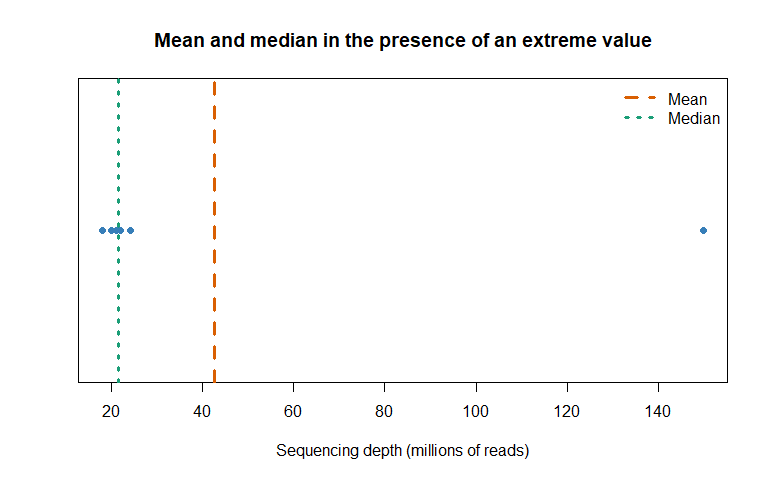
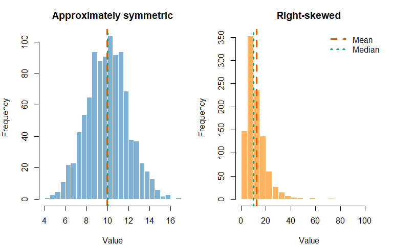
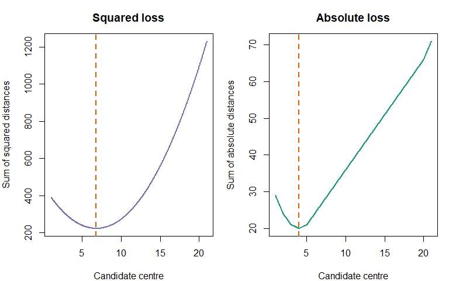
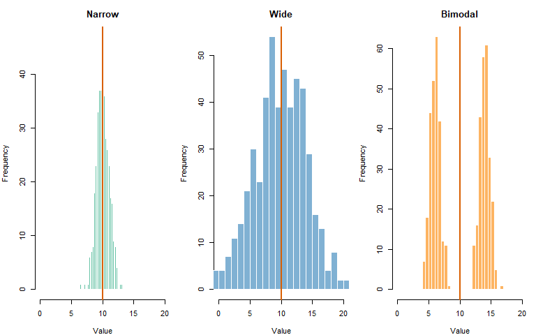
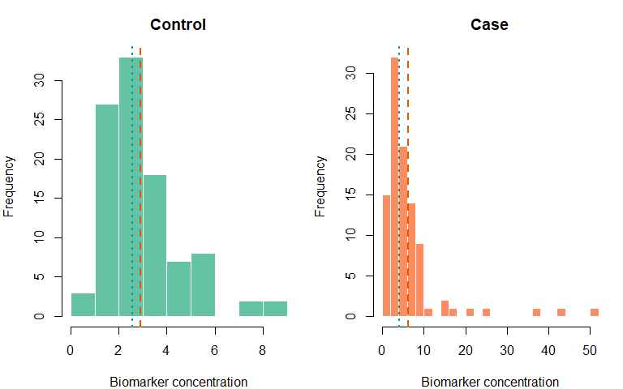

Chapter 8: Measures of Central Tendency
================
Sandeep Singh

- [1. Introduction](#1-introduction)
- [2. Learning Objectives](#2-learning-objectives)
- [3. What Does “Centre” Mean?](#3-what-does-centre-mean)
- [4. The Arithmetic Mean](#4-the-arithmetic-mean)
  - [4.1 Manual calculation](#41-manual-calculation)
  - [4.2 Why the mean is a balancing
    point](#42-why-the-mean-is-a-balancing-point)
  - [4.3 When the arithmetic mean is
    useful](#43-when-the-arithmetic-mean-is-useful)
- [5. Population Mean and Sample
  Mean](#5-population-mean-and-sample-mean)
- [6. The Median](#6-the-median)
  - [6.1 Odd sample size](#61-odd-sample-size)
  - [6.2 Even sample size](#62-even-sample-size)
  - [6.3 What the median tells us](#63-what-the-median-tells-us)
- [7. Mean Versus Median Under an
  Outlier](#7-mean-versus-median-under-an-outlier)
- [8. The Mode](#8-the-mode)
  - [8.1 R does not provide a simple statistical `mode()`
    function](#81-r-does-not-provide-a-simple-statistical-mode-function)
  - [8.2 Unimodal, bimodal and multimodal
    data](#82-unimodal-bimodal-and-multimodal-data)
- [9. How Distribution Shape Affects the
  Centre](#9-how-distribution-shape-affects-the-centre)
  - [9.1 Symmetric distribution](#91-symmetric-distribution)
  - [9.2 Right-skewed distribution](#92-right-skewed-distribution)
  - [9.3 Left-skewed distribution](#93-left-skewed-distribution)
- [10. The Weighted Mean](#10-the-weighted-mean)
  - [10.1 Combining clinic means](#101-combining-clinic-means)
  - [10.2 Weights do not automatically improve an
    analysis](#102-weights-do-not-automatically-improve-an-analysis)
- [11. The Geometric Mean](#11-the-geometric-mean)
  - [11.1 Fold-change example](#111-fold-change-example)
  - [11.2 Restrictions](#112-restrictions)
- [12. Log-Transformed Data and
  Back-Transformation](#12-log-transformed-data-and-back-transformation)
- [13. The Harmonic Mean](#13-the-harmonic-mean)
  - [13.1 Laboratory throughput
    example](#131-laboratory-throughput-example)
  - [13.2 Important condition](#132-important-condition)
- [14. Relationship Among Three
  Means](#14-relationship-among-three-means)
- [15. Trimmed Mean](#15-trimmed-mean)
- [16. Winsorized Mean](#16-winsorized-mean)
- [17. Midrange and Midhinge](#17-midrange-and-midhinge)
- [18. Centre as an Optimization
  Problem](#18-centre-as-an-optimization-problem)
- [19. Central Tendency by Measurement
  Scale](#19-central-tendency-by-measurement-scale)
- [20. Missing Values](#20-missing-values)
- [21. Grouped Data and Approximate
  Means](#21-grouped-data-and-approximate-means)
- [22. Do Not Average Percentages
  Blindly](#22-do-not-average-percentages-blindly)
- [23. Mean of Ratios Versus Ratio of
  Totals](#23-mean-of-ratios-versus-ratio-of-totals)
- [24. Hierarchical Data: Cells Are Nested Within
  Donors](#24-hierarchical-data-cells-are-nested-within-donors)
- [25. Same Centre, Different
  Distributions](#25-same-centre-different-distributions)
- [26. Choosing the Most Appropriate
  Measure](#26-choosing-the-most-appropriate-measure)
- [27. Reporting Central Tendency](#27-reporting-central-tendency)
- [28. Integrated Case Study: Inflammatory Biomarker
  Data](#28-integrated-case-study-inflammatory-biomarker-data)
  - [28.1 Scientific setting](#281-scientific-setting)
  - [28.2 Visual inspection](#282-visual-inspection)
  - [28.3 Build a group-summary
    function](#283-build-a-group-summary-function)
  - [28.4 Summarize each group](#284-summarize-each-group)
  - [28.5 Interpretation](#285-interpretation)
- [29. Common Mistakes](#29-common-mistakes)
  - [Mistake 1: Using “average” without defining
    it](#mistake-1-using-average-without-defining-it)
  - [Mistake 2: Calculating a mean for category
    codes](#mistake-2-calculating-a-mean-for-category-codes)
  - [Mistake 3: Reporting the mean alone for strongly skewed
    data](#mistake-3-reporting-the-mean-alone-for-strongly-skewed-data)
  - [Mistake 4: Deleting extreme values
    automatically](#mistake-4-deleting-extreme-values-automatically)
  - [Mistake 5: Assuming the median is unaffected by
    everything](#mistake-5-assuming-the-median-is-unaffected-by-everything)
  - [Mistake 6: Averaging subgroup means
    equally](#mistake-6-averaging-subgroup-means-equally)
  - [Mistake 7: Averaging percentages without
    denominators](#mistake-7-averaging-percentages-without-denominators)
  - [Mistake 8: Using the geometric mean with zero or negative
    values](#mistake-8-using-the-geometric-mean-with-zero-or-negative-values)
  - [Mistake 9: Treating cells or reads as independent
    participants](#mistake-9-treating-cells-or-reads-as-independent-participants)
  - [Mistake 10: Hiding the analysis
    scale](#mistake-10-hiding-the-analysis-scale)
- [30. Practical Decision Workflow](#30-practical-decision-workflow)
- [31. Chapter Summary](#31-chapter-summary)
- [32. Check Your Understanding](#32-check-your-understanding)
- [33. R Exercises](#33-r-exercises)
  - [Exercise 1: Manual arithmetic
    mean](#exercise-1-manual-arithmetic-mean)
  - [Exercise 2: Odd and even medians](#exercise-2-odd-and-even-medians)
  - [Exercise 3: Multiple modes](#exercise-3-multiple-modes)
  - [Exercise 4: Outlier influence](#exercise-4-outlier-influence)
  - [Exercise 5: Weighted clinic
    result](#exercise-5-weighted-clinic-result)
  - [Exercise 6: Fold changes](#exercise-6-fold-changes)
  - [Exercise 7: Harmonic mean](#exercise-7-harmonic-mean)
  - [Exercise 8: Missing values](#exercise-8-missing-values)
  - [Exercise 9: Grouped-data
    approximation](#exercise-9-grouped-data-approximation)
  - [Exercise 10: Hierarchical
    averaging](#exercise-10-hierarchical-averaging)
- [34. Mini-Project: Central Tendency in Gene-Expression
  Data](#34-mini-project-central-tendency-in-gene-expression-data)
- [35. Glossary](#35-glossary)
- [36. References](#36-references)
- [37. Reproducibility Information](#37-reproducibility-information)

# 1. Introduction

Suppose we measure fasting glucose in 100 participants. Reading all 100
values does not immediately tell us what is typical. A **measure of
central tendency** summarizes the centre of the data using one value.

The three best-known measures are:

- **mean** – the arithmetic average;
- **median** – the middle ordered value; and
- **mode** – the most frequent value or category.

However, biological data create additional questions:

- Should a strongly right-skewed biomarker be summarized by the mean or
  median?
- How should fold changes be averaged?
- How should clinic means be combined when clinics have different sample
  sizes?
- Is the average of thousands of cells a valid summary of donors?
- What happens when a laboratory value is missing or an extreme outlier
  is present?

There is no universally best measure of centre. The correct choice
depends on the variable, distribution, study design and scientific
question.

> **A measure of centre is a model of what “typical” means. It should be
> chosen scientifically, not automatically.**

------------------------------------------------------------------------

# 2. Learning Objectives

After completing this chapter, you should be able to:

1.  explain why biological datasets need a measure of centre;
2.  calculate and interpret the arithmetic mean;
3.  calculate a weighted mean and select appropriate weights;
4.  calculate and interpret the median;
5.  identify one or multiple modes;
6.  compare the effects of skewness and outliers on mean and median;
7.  calculate geometric and harmonic means;
8.  explain when geometric and harmonic means are appropriate;
9.  calculate trimmed and Winsorized means;
10. choose a centre appropriate to nominal, ordinal, interval and ratio
    variables;
11. handle missing values explicitly in R;
12. avoid incorrect averaging of percentages, ratios and subgroup means;
13. recognize hierarchical averaging problems in single-cell and
    repeated-measure data;
14. summarize centre by biological group; and
15. report central tendency with its units, denominator and
    complementary measure of spread.

------------------------------------------------------------------------

# 3. What Does “Centre” Mean?

Consider five expression values:

$$4,\;5,\;5,\;6,\;10.$$

Several definitions of centre are possible:

- the balancing point of all observations;
- the middle value after sorting;
- the most common value;
- a multiplicative average; or
- a centre that reduces the effect of extreme values.

These definitions lead to different measures.

``` r
x <- c(4, 5, 5, 6, 10)

data.frame(
  Statistic = c("Mean", "Median", "Mode"),
  Value = c(mean(x), median(x), 5),
  stringsAsFactors = FALSE
)
```

<div class="kable-table">

| Statistic | Value |
|:----------|------:|
| Mean      |     6 |
| Median    |     5 |
| Mode      |     5 |

</div>

The three values are not competing answers to an identical question.
They describe different aspects of the data.

# 4. The Arithmetic Mean

For observations $x_1, x_2, \ldots, x_n$, the sample arithmetic mean is:

$$\bar{x} = \frac{1}{n}\sum_{i=1}^{n}x_i.$$

In plain language:

1.  add all observed values; and
2.  divide by the number of values.

## 4.1 Manual calculation

Suppose the serum albumin values of five participants are:

$$3.8,\;4.0,\;4.1,\;4.2,\;4.4\text{ g/dL}.$$

``` r
albumin <- c(3.8, 4.0, 4.1, 4.2, 4.4)

sum_albumin <- sum(albumin)
n_albumin <- length(albumin)
manual_mean <- sum_albumin / n_albumin
r_mean <- mean(albumin)

data.frame(
  Calculation = c("Sum", "Number of observations",
                  "Manual mean", "mean() result"),
  Value = c(sum_albumin, n_albumin, manual_mean, r_mean),
  stringsAsFactors = FALSE
)
```

<div class="kable-table">

| Calculation            | Value |
|:-----------------------|------:|
| Sum                    |  20.5 |
| Number of observations |   5.0 |
| Manual mean            |   4.1 |
| mean() result          |   4.1 |

</div>

The mean has the same measurement unit as the original variable. Here,
the mean is reported in g/dL.

## 4.2 Why the mean is a balancing point

Deviations from the mean sum to zero:

$$\sum_{i=1}^{n}(x_i - \bar{x}) = 0.$$

``` r
deviations <- albumin - mean(albumin)

data.frame(
  Albumin = albumin,
  Deviation_from_mean = round(deviations, 3)
)
```

<div class="kable-table">

| Albumin | Deviation_from_mean |
|--------:|--------------------:|
|     3.8 |                -0.3 |
|     4.0 |                -0.1 |
|     4.1 |                 0.0 |
|     4.2 |                 0.1 |
|     4.4 |                 0.3 |

</div>

``` r
sum(deviations)
```

    ## [1] 1.776357e-15

The displayed result may be extremely close to zero rather than exactly
zero because computers store decimal values with finite precision.

## 4.3 When the arithmetic mean is useful

The mean is often appropriate when:

- the variable is quantitative;
- addition and subtraction are scientifically meaningful;
- the distribution is reasonably symmetric;
- extreme observations are absent or scientifically justified; and
- the scientific target is an arithmetic population average.

Examples may include height, normally distributed assay measurements, or
change in blood pressure when the distribution is not severely skewed.

# 5. Population Mean and Sample Mean

The population mean is a parameter, commonly written as $\mu$:

$$\mu = \frac{1}{N}\sum_{i=1}^{N}X_i.$$

The sample mean $\bar{x}$ is a statistic used to estimate $\mu$.

``` r
set.seed(123)

population_values <- rnorm(10000, mean = 120, sd = 15)
sample_values <- sample(population_values, size = 100, replace = FALSE)

data.frame(
  Quantity = c("Population mean", "Sample mean"),
  Value = round(c(mean(population_values), mean(sample_values)), 2),
  stringsAsFactors = FALSE
)
```

<div class="kable-table">

| Quantity        |  Value |
|:----------------|-------:|
| Population mean | 119.96 |
| Sample mean     | 119.91 |

</div>

A different random sample will usually have a different mean. Sampling
distributions and standard errors will be studied later.

# 6. The Median

The **median** is the middle value after sorting the observations.

- For an odd number of observations, it is the single middle value.
- For an even number, it is usually the arithmetic mean of the two
  middle values.

## 6.1 Odd sample size

``` r
odd_values <- c(12, 7, 10, 15, 9)
sorted_odd <- sort(odd_values)

data.frame(
  Original = odd_values,
  Sorted = sorted_odd
)
```

<div class="kable-table">

| Original | Sorted |
|---------:|-------:|
|       12 |      7 |
|        7 |      9 |
|       10 |     10 |
|       15 |     12 |
|        9 |     15 |

</div>

``` r
median(odd_values)
```

    ## [1] 10

The ordered values are 7, 9, 10, 12 and 15. The median is 10.

## 6.2 Even sample size

``` r
even_values <- c(12, 7, 10, 15, 9, 20)
sorted_even <- sort(even_values)
middle_positions <- c(length(even_values) / 2,
                      length(even_values) / 2 + 1)
middle_values <- sorted_even[middle_positions]

data.frame(
  Middle_value = middle_values
)
```

<div class="kable-table">

| Middle_value |
|-------------:|
|           10 |
|           12 |

</div>

``` r
mean(middle_values)
```

    ## [1] 11

``` r
median(even_values)
```

    ## [1] 11

## 6.3 What the median tells us

Approximately half of observations are at or below the median and half
are at or above it. With repeated values, the division need not be
exactly 50% on each strict side.

The median depends on order rather than the numerical distance of
extreme observations. This makes it **robust** to outliers.

# 7. Mean Versus Median Under an Outlier

Consider typical sequencing depths, in millions of reads:

``` r
depth_regular <- c(18, 20, 21, 22, 24)
depth_with_outlier <- c(depth_regular, 150)

centre_comparison <- data.frame(
  Dataset = c("Without extreme value", "With extreme value"),
  Mean = round(c(mean(depth_regular), mean(depth_with_outlier)), 2),
  Median = round(c(median(depth_regular), median(depth_with_outlier)), 2),
  stringsAsFactors = FALSE
)

centre_comparison
```

<div class="kable-table">

| Dataset               | Mean | Median |
|:----------------------|-----:|-------:|
| Without extreme value | 21.0 |   21.0 |
| With extreme value    | 42.5 |   21.5 |

</div>

The extreme library pulls the mean strongly upward, while the median
changes much less.

``` r
stripchart(
  depth_with_outlier,
  method = "stack",
  pch = 19,
  col = "#377EB8",
  xlab = "Sequencing depth (millions of reads)",
  main = "Mean and median in the presence of an extreme value"
)
abline(v = mean(depth_with_outlier), col = "#D95F02", lwd = 3, lty = 2)
abline(v = median(depth_with_outlier), col = "#1B9E77", lwd = 3, lty = 3)
legend(
  "topright",
  legend = c("Mean", "Median"),
  col = c("#D95F02", "#1B9E77"),
  lwd = 3,
  lty = c(2, 3),
  bty = "n"
)
```

<div class="figure" style="text-align: center">


<p class="caption">

An extreme sequencing-depth value changes the mean more than the median.
</p>

</div>

An outlier should not be deleted simply because it changes the mean.
First determine whether it is:

- a data-entry error;
- an assay or instrument failure;
- a valid rare observation;
- a result of a different measurement unit; or
- evidence of a biologically distinct subgroup.

# 8. The Mode

The **mode** is the most frequently observed value or category.

It is the only common measure of central tendency suitable for nominal
categories such as blood group, species or genotype class.

``` r
blood_group <- c("A", "O", "B", "O", "A", "O", "AB", "O", "B")
table(blood_group)
```

    ## blood_group
    ##  A AB  B  O 
    ##  2  1  2  4

The modal blood group is `O`.

## 8.1 R does not provide a simple statistical `mode()` function

In R, `mode()` describes an object’s storage mode; it does **not**
calculate the most frequent value.

``` r
mode(blood_group)
```

    ## [1] "character"

We can write our own statistical-mode function.

``` r
statistical_mode <- function(x, na.rm = TRUE) {
  if (na.rm) {
    x <- x[!is.na(x)]
  }

  if (length(x) == 0) {
    return(NA)
  }

  counts <- table(x)
  modes <- names(counts)[counts == max(counts)]
  modes
}

statistical_mode(blood_group)
```

    ## [1] "O"

## 8.2 Unimodal, bimodal and multimodal data

A dataset may have:

- one mode: **unimodal**;
- two modes: **bimodal**;
- more than two modes: **multimodal**; or
- no useful unique mode.

``` r
genotype_example <- c("AA", "AA", "AG", "AG", "GG")
statistical_mode(genotype_example)
```

    ## [1] "AA" "AG"

The function correctly returns both `AA` and `AG`. A function that
returns only the first maximum would hide the tie.

# 9. How Distribution Shape Affects the Centre

## 9.1 Symmetric distribution

In a perfectly symmetric unimodal distribution, mean and median are
often equal or very similar, and the mode lies near them.

## 9.2 Right-skewed distribution

A long right tail commonly gives:

$$\text{mode} < \text{median} < \text{mean}.$$

Examples include hospital length of stay, many biomarker concentrations,
healthcare costs and raw gene-expression values.

## 9.3 Left-skewed distribution

A long left tail commonly gives:

$$\text{mean} < \text{median} < \text{mode}.$$

These are general patterns, not laws for every dataset.

``` r
set.seed(222)
symmetric_data <- rnorm(1000, mean = 10, sd = 2)
right_skewed_data <- rlnorm(1000, meanlog = log(10), sdlog = 0.65)

par(mfrow = c(1, 2), mar = c(4, 4, 3, 1))

hist(symmetric_data, breaks = 25, col = "#80B1D3", border = "white",
     main = "Approximately symmetric", xlab = "Value")
abline(v = mean(symmetric_data), col = "#D95F02", lwd = 3, lty = 2)
abline(v = median(symmetric_data), col = "#1B9E77", lwd = 3, lty = 3)

hist(right_skewed_data, breaks = 30, col = "#FDB462", border = "white",
     main = "Right-skewed", xlab = "Value")
abline(v = mean(right_skewed_data), col = "#D95F02", lwd = 3, lty = 2)
abline(v = median(right_skewed_data), col = "#1B9E77", lwd = 3, lty = 3)

legend("topright", legend = c("Mean", "Median"),
       col = c("#D95F02", "#1B9E77"), lwd = 3,
       lty = c(2, 3), bty = "n")
```

<div class="figure" style="text-align: center">


<p class="caption">

Mean and median are similar for symmetric data but separate under right
skew.
</p>

</div>

``` r
par(mfrow = c(1, 1))
```

# 10. The Weighted Mean

The ordinary mean gives every observation equal weight. A **weighted
mean** gives observation $i$ a weight $w_i$:

$$\bar{x}_w = \frac{\sum_{i=1}^{n}w_i x_i}{\sum_{i=1}^{n}w_i}.$$

Weights may represent:

- subgroup sample sizes;
- sampling weights;
- inverse uncertainty in meta-analysis;
- exposure time; or
- another scientifically justified contribution.

## 10.1 Combining clinic means

Three clinics report different sample sizes and mean systolic blood
pressures.

``` r
clinic_summary <- data.frame(
  Clinic = c("A", "B", "C"),
  Sample_size = c(20, 80, 200),
  Mean_SBP = c(118, 126, 132),
  stringsAsFactors = FALSE
)

unweighted_mean_of_means <- mean(clinic_summary$Mean_SBP)
patient_weighted_mean <- weighted.mean(
  clinic_summary$Mean_SBP,
  w = clinic_summary$Sample_size
)

clinic_summary
```

<div class="kable-table">

| Clinic | Sample_size | Mean_SBP |
|:-------|------------:|---------:|
| A      |          20 |      118 |
| B      |          80 |      126 |
| C      |         200 |      132 |

</div>

``` r
data.frame(
  Method = c("Unweighted mean of clinic means",
             "Mean weighted by clinic sample size"),
  Mean_SBP = round(c(unweighted_mean_of_means,
                     patient_weighted_mean), 2),
  stringsAsFactors = FALSE
)
```

<div class="kable-table">

| Method                              | Mean_SBP |
|:------------------------------------|---------:|
| Unweighted mean of clinic means     |   125.33 |
| Mean weighted by clinic sample size |   129.47 |

</div>

The weighted result equals the overall individual-level mean if the
clinic means and sizes were calculated from all relevant individuals.

## 10.2 Weights do not automatically improve an analysis

A weight must have a scientific interpretation. Using sequencing depth
as a weight for donor phenotype means, for example, may give technically
deep libraries more influence without solving biological selection or
dependence.

Survey weights, precision weights and frequency weights serve different
purposes and should not be used interchangeably.

# 11. The Geometric Mean

For positive observations $x_1, x_2, \ldots, x_n$, the geometric mean
is:

$$GM = \left(\prod_{i=1}^{n}x_i\right)^{1/n}.$$

It can be calculated more stably on the log scale:

$$GM = \exp\left(\frac{1}{n}\sum_{i=1}^{n}\log x_i\right).$$

The geometric mean is useful when values combine multiplicatively, such
as:

- fold changes;
- growth factors;
- dilution factors;
- titres; and
- some right-skewed positive measurements analyzed on a log scale.

## 11.1 Fold-change example

``` r
fold_changes <- c(0.5, 1, 2, 4)

arithmetic_fc <- mean(fold_changes)
geometric_fc <- exp(mean(log(fold_changes)))

data.frame(
  Measure = c("Arithmetic mean", "Geometric mean"),
  Fold_change = round(c(arithmetic_fc, geometric_fc), 3),
  stringsAsFactors = FALSE
)
```

<div class="kable-table">

| Measure         | Fold_change |
|:----------------|------------:|
| Arithmetic mean |       1.875 |
| Geometric mean  |       1.414 |

</div>

The geometric mean respects reciprocal changes: a two-fold increase and
a two-fold decrease are represented by factors 2 and 0.5, whose
geometric mean is 1.

``` r
exp(mean(log(c(2, 0.5))))
```

    ## [1] 1

``` r
mean(c(2, 0.5))
```

    ## [1] 1.25

## 11.2 Restrictions

The standard geometric mean requires strictly positive values.

- `log(0)` is negative infinity.
- the logarithm of a negative real number is undefined in ordinary
  real-valued analysis.

Adding a pseudocount such as 1 changes the scientific quantity and can
strongly affect results when values are small. Do not add pseudocounts
automatically.

``` r
geometric_mean <- function(x, na.rm = TRUE) {
  if (na.rm) {
    x <- x[!is.na(x)]
  }

  if (length(x) == 0 || any(x <= 0)) {
    return(NA_real_)
  }

  exp(mean(log(x)))
}

geometric_mean(c(2, 4, 8))
```

    ## [1] 4

``` r
geometric_mean(c(0, 2, 4))
```

    ## [1] NA

# 12. Log-Transformed Data and Back-Transformation

For positive right-skewed data, researchers may calculate the arithmetic
mean after taking logarithms and then exponentiate it. The result is a
geometric mean on the original scale.

``` r
set.seed(333)
cytokine <- rlnorm(100, meanlog = log(12), sdlog = 0.7)

log_mean <- mean(log(cytokine))
back_transformed_mean <- exp(log_mean)

data.frame(
  Summary = c("Arithmetic mean on original scale",
              "Median on original scale",
              "Mean on log scale, back-transformed"),
  Value = round(c(mean(cytokine), median(cytokine),
                  back_transformed_mean), 2),
  stringsAsFactors = FALSE
)
```

<div class="kable-table">

| Summary                             | Value |
|:------------------------------------|------:|
| Arithmetic mean on original scale   | 14.66 |
| Median on original scale            | 12.42 |
| Mean on log scale, back-transformed | 11.81 |

</div>

The back-transformed mean of logged observations is not the same as the
arithmetic mean on the original scale. State the scale and
transformation clearly.

For qPCR, Ct values are already on a cycle/log-related scale. Averaging
Ct, $\Delta$Ct, relative expression or fold change answers different
questions. Follow an analysis plan appropriate to the assay rather than
applying a geometric mean mechanically.

# 13. The Harmonic Mean

For positive values, the harmonic mean is:

$$HM = \frac{n}{\sum_{i=1}^{n}\frac{1}{x_i}}.$$

It is useful for averaging rates when each rate applies to an equal
amount of work, distance or another denominator.

## 13.1 Laboratory throughput example

A machine processes one equal-sized batch at 20 samples per hour and
another equal-sized batch at 60 samples per hour.

``` r
rates <- c(20, 60)

arithmetic_rate <- mean(rates)
harmonic_rate <- length(rates) / sum(1 / rates)

data.frame(
  Measure = c("Arithmetic mean", "Harmonic mean"),
  Samples_per_hour = c(arithmetic_rate, harmonic_rate),
  stringsAsFactors = FALSE
)
```

<div class="kable-table">

| Measure         | Samples_per_hour |
|:----------------|-----------------:|
| Arithmetic mean |               40 |
| Harmonic mean   |               30 |

</div>

For two equal batches of 60 samples:

- the first takes $60/20 = 3$ hours;
- the second takes $60/60 = 1$ hour;
- 120 samples take 4 hours;
- the overall rate is $120/4 = 30$ samples per hour.

That is the harmonic mean, not 40.

## 13.2 Important condition

The correct averaging method depends on what is held equal. If time,
rather than workload, is equal at each rate, the arithmetic mean may be
appropriate. Always reconstruct the numerator and denominator of the
scientific rate.

# 14. Relationship Among Three Means

For positive data:

$$HM \leq GM \leq AM,$$

where HM, GM and AM are the harmonic, geometric and arithmetic means.

``` r
positive_values <- c(2, 4, 8, 16)

three_means <- data.frame(
  Mean_type = c("Harmonic", "Geometric", "Arithmetic"),
  Value = c(
    length(positive_values) / sum(1 / positive_values),
    exp(mean(log(positive_values))),
    mean(positive_values)
  ),
  stringsAsFactors = FALSE
)

three_means$Value <- round(three_means$Value, 3)
three_means
```

<div class="kable-table">

| Mean_type  | Value |
|:-----------|------:|
| Harmonic   | 4.267 |
| Geometric  | 5.657 |
| Arithmetic | 7.500 |

</div>

They are equal only when all values are identical.

# 15. Trimmed Mean

A **trimmed mean** removes a specified proportion of the smallest and
largest observations before calculating the mean.

For a 10% trimmed mean, approximately 10% is removed from each tail.

``` r
lab_values <- c(9.8, 10.1, 10.2, 10.3, 10.4,
                10.5, 10.6, 10.8, 11.0, 35.0)

data.frame(
  Measure = c("Mean", "10% trimmed mean", "Median"),
  Value = round(c(
    mean(lab_values),
    mean(lab_values, trim = 0.10),
    median(lab_values)
  ), 2),
  stringsAsFactors = FALSE
)
```

<div class="kable-table">

| Measure          | Value |
|:-----------------|------:|
| Mean             | 12.87 |
| 10% trimmed mean | 10.49 |
| Median           | 10.45 |

</div>

A trimmed mean is a compromise between the efficient arithmetic mean for
well-behaved symmetric data and the robust median.

Trimming should be prespecified or scientifically justified. It is not
permission to remove inconvenient observations.

# 16. Winsorized Mean

Winsorization does not delete tail observations. Instead, it replaces
values below and above chosen limits with the corresponding boundary
values.

``` r
winsorize <- function(x, proportion = 0.10, na.rm = TRUE) {
  if (na.rm) {
    x <- x[!is.na(x)]
  }

  limits <- quantile(
    x,
    probs = c(proportion, 1 - proportion),
    names = FALSE,
    type = 7
  )

  pmin(pmax(x, limits[1]), limits[2])
}

winsorized_values <- winsorize(lab_values, proportion = 0.10)

data.frame(
  Measure = c("Ordinary mean", "10% Winsorized mean"),
  Value = round(c(mean(lab_values), mean(winsorized_values)), 2),
  stringsAsFactors = FALSE
)
```

<div class="kable-table">

| Measure             | Value |
|:--------------------|------:|
| Ordinary mean       | 12.87 |
| 10% Winsorized mean | 10.74 |

</div>

Trimming removes a tail fraction before averaging; Winsorization keeps
the same number of observations but limits extreme values. Both must be
reported transparently.

# 17. Midrange and Midhinge

The **midrange** is the midpoint between the minimum and maximum:

$$\text{Midrange} = \frac{\min(x) + \max(x)}{2}.$$

It is extremely sensitive to outliers and is rarely a primary biological
summary.

The **midhinge** is the midpoint of the first and third quartiles:

$$\text{Midhinge} = \frac{Q_1 + Q_3}{2}.$$

``` r
quartiles <- quantile(lab_values, probs = c(0.25, 0.75), names = FALSE)

data.frame(
  Measure = c("Midrange", "Midhinge"),
  Value = round(c(
    (min(lab_values) + max(lab_values)) / 2,
    mean(quartiles)
  ), 2),
  stringsAsFactors = FALSE
)
```

<div class="kable-table">

| Measure  | Value |
|:---------|------:|
| Midrange | 22.40 |
| Midhinge | 10.49 |

</div>

These measures are useful mainly for understanding alternatives. Mean
and median remain more common in biostatistics.

# 18. Centre as an Optimization Problem

The arithmetic mean and median also have mathematical interpretations.

- The mean minimizes the sum of squared distances.
- The median minimizes the sum of absolute distances.

``` r
loss_data <- c(2, 3, 4, 5, 20)
candidate_centres <- seq(1, 21, by = 0.05)

squared_loss <- sapply(candidate_centres, function(a) {
  sum((loss_data - a)^2)
})

absolute_loss <- sapply(candidate_centres, function(a) {
  sum(abs(loss_data - a))
})

par(mfrow = c(1, 2), mar = c(4, 4, 3, 1))

plot(candidate_centres, squared_loss, type = "l", lwd = 2,
     col = "#7570B3", xlab = "Candidate centre",
     ylab = "Sum of squared distances", main = "Squared loss")
abline(v = mean(loss_data), col = "#D95F02", lwd = 2, lty = 2)

plot(candidate_centres, absolute_loss, type = "l", lwd = 2,
     col = "#1B9E77", xlab = "Candidate centre",
     ylab = "Sum of absolute distances", main = "Absolute loss")
abline(v = median(loss_data), col = "#D95F02", lwd = 2, lty = 2)
```

<div class="figure" style="text-align: center">


<p class="caption">

Squared loss is minimized by the mean; absolute loss is minimized by the
median.
</p>

</div>

``` r
par(mfrow = c(1, 1))
```

This explains why the mean reacts strongly to large deviations: squaring
gives extreme distances much greater influence.

# 19. Central Tendency by Measurement Scale

| Measurement scale | Meaningful common centres | Example |
|----|----|----|
| Nominal | Mode | Blood group, species, genotype label |
| Ordinal | Median, mode | Disease stage, pain category |
| Interval | Mean, median, mode | Temperature in degrees Celsius |
| Ratio | Mean, median, mode; sometimes geometric or harmonic mean | Concentration, age, read depth |

The mean of arbitrary category codes is not meaningful. If `Female = 1`,
`Male = 2` and `Other = 3`, an average of 1.7 is not a biological
centre.

For an ordinal scale, a median category can be meaningful because order
exists, although numerical gaps between categories may not be equal.

# 20. Missing Values

R returns `NA` when the input contains a missing value unless the
function is told how to handle it.

``` r
glucose <- c(92, 101, NA, 110, 97)

mean(glucose)
```

    ## [1] NA

``` r
mean(glucose, na.rm = TRUE)
```

    ## [1] 100

``` r
median(glucose, na.rm = TRUE)
```

    ## [1] 99

`na.rm = TRUE` means “calculate using observed values.” It does not make
the missing data problem disappear.

Always report the number of available observations:

``` r
data.frame(
  Total_records = length(glucose),
  Observed_values = sum(!is.na(glucose)),
  Missing_values = sum(is.na(glucose)),
  Observed_mean = mean(glucose, na.rm = TRUE)
)
```

<div class="kable-table">

| Total_records | Observed_values | Missing_values | Observed_mean |
|--------------:|----------------:|---------------:|--------------:|
|             5 |               4 |              1 |           100 |

</div>

If severely ill participants are more likely to lack a measurement, the
observed mean may be biased. Missing-data mechanisms and methods will be
covered later.

# 21. Grouped Data and Approximate Means

Sometimes only a grouped frequency table is available. We can estimate
the mean using class midpoints:

$$\bar{x}_{grouped} \approx \frac{\sum f_i m_i}{\sum f_i},$$

where $f_i$ is class frequency and $m_i$ is the class midpoint.

``` r
grouped_age <- data.frame(
  Age_group = c("20-29", "30-39", "40-49", "50-59", "60-69"),
  Midpoint = c(24.5, 34.5, 44.5, 54.5, 64.5),
  Frequency = c(12, 24, 31, 22, 11),
  stringsAsFactors = FALSE
)

estimated_mean_age <- weighted.mean(
  grouped_age$Midpoint,
  w = grouped_age$Frequency
)

grouped_age
```

<div class="kable-table">

| Age_group | Midpoint | Frequency |
|:----------|---------:|----------:|
| 20-29     |     24.5 |        12 |
| 30-39     |     34.5 |        24 |
| 40-49     |     44.5 |        31 |
| 50-59     |     54.5 |        22 |
| 60-69     |     64.5 |        11 |

</div>

``` r
estimated_mean_age
```

    ## [1] 44.1

The estimate assumes observations within a class can be represented by
its midpoint. It is less precise than calculating the mean from original
values. Open-ended classes such as “70+” require an additional
assumption and can make the estimate unreliable.

# 22. Do Not Average Percentages Blindly

Suppose two hospitals report infection percentages:

- Hospital A: 2 infections among 10 patients = 20%;
- Hospital B: 90 infections among 1,000 patients = 9%.

The unweighted average of 20% and 9% is 14.5%, but the combined
proportion is based on total events and total patients.

``` r
hospital_data <- data.frame(
  Hospital = c("A", "B"),
  Infections = c(2, 90),
  Patients = c(10, 1000),
  stringsAsFactors = FALSE
)

hospital_data$Percent <- 100 * hospital_data$Infections /
  hospital_data$Patients

unweighted_percent <- mean(hospital_data$Percent)
combined_percent <- 100 * sum(hospital_data$Infections) /
  sum(hospital_data$Patients)

hospital_data
```

<div class="kable-table">

| Hospital | Infections | Patients | Percent |
|:---------|-----------:|---------:|--------:|
| A        |          2 |       10 |      20 |
| B        |         90 |     1000 |       9 |

</div>

``` r
data.frame(
  Method = c("Unweighted average of hospital percentages",
             "Combined infections / combined patients"),
  Percent = round(c(unweighted_percent, combined_percent), 2),
  stringsAsFactors = FALSE
)
```

<div class="kable-table">

| Method                                     | Percent |
|:-------------------------------------------|--------:|
| Unweighted average of hospital percentages |   14.50 |
| Combined infections / combined patients    |    9.11 |

</div>

Reconstruct the numerator and denominator whenever possible. Weighting
subgroup percentages by subgroup denominators gives the combined
percentage.

# 23. Mean of Ratios Versus Ratio of Totals

These answer different questions.

Suppose each sample has target-gene reads and total reads.

``` r
read_data <- data.frame(
  Sample = c("S1", "S2", "S3"),
  Target_reads = c(50, 50, 900),
  Total_reads = c(100, 1000, 10000),
  stringsAsFactors = FALSE
)

read_data$Sample_proportion <- read_data$Target_reads /
  read_data$Total_reads

mean_sample_proportion <- mean(read_data$Sample_proportion)
pooled_proportion <- sum(read_data$Target_reads) /
  sum(read_data$Total_reads)

read_data
```

<div class="kable-table">

| Sample | Target_reads | Total_reads | Sample_proportion |
|:-------|-------------:|------------:|------------------:|
| S1     |           50 |         100 |              0.50 |
| S2     |           50 |        1000 |              0.05 |
| S3     |          900 |       10000 |              0.09 |

</div>

``` r
data.frame(
  Summary = c("Mean of sample proportions", "Ratio of pooled totals"),
  Value = round(c(mean_sample_proportion, pooled_proportion), 4),
  stringsAsFactors = FALSE
)
```

<div class="kable-table">

| Summary                    |  Value |
|:---------------------------|-------:|
| Mean of sample proportions | 0.2133 |
| Ratio of pooled totals     | 0.0901 |

</div>

The mean of sample proportions gives every sample equal influence. The
pooled ratio gives every read equal influence. Neither is automatically
correct; the estimand determines which should be used.

# 24. Hierarchical Data: Cells Are Nested Within Donors

In single-cell RNA-seq, donors may contribute different numbers of
cells. An overall cell-level mean gives donors with more captured cells
more influence.

``` r
cell_summary <- data.frame(
  Donor = c("D1", "D2", "D3"),
  Captured_cells = c(100, 1000, 5000),
  Donor_mean_expression = c(2, 5, 8),
  stringsAsFactors = FALSE
)

equal_donor_mean <- mean(cell_summary$Donor_mean_expression)
cell_weighted_mean <- weighted.mean(
  cell_summary$Donor_mean_expression,
  w = cell_summary$Captured_cells
)

cell_summary
```

<div class="kable-table">

| Donor | Captured_cells | Donor_mean_expression |
|:------|---------------:|----------------------:|
| D1    |            100 |                     2 |
| D2    |           1000 |                     5 |
| D3    |           5000 |                     8 |

</div>

``` r
data.frame(
  Target = c("Mean of donor means",
             "Mean expression across all captured cells"),
  Value = round(c(equal_donor_mean, cell_weighted_mean), 2),
  stringsAsFactors = FALSE
)
```

<div class="kable-table">

| Target                                    | Value |
|:------------------------------------------|------:|
| Mean of donor means                       |  5.00 |
| Mean expression across all captured cells |  7.41 |

</div>

The first estimates a typical donor-level mean if donors are equally
weighted. The second estimates a typical captured cell in this dataset.
These are different scientific targets.

> **Averaging is part of defining the unit of inference.**

The same issue arises with multiple biopsies per patient, technical
replicates per sample and repeated visits per participant.

# 25. Same Centre, Different Distributions

A measure of central tendency cannot describe variability, skewness,
multiple peaks or outliers by itself.

``` r
set.seed(444)

dataset_a <- rnorm(500, mean = 10, sd = 1)
dataset_b <- rnorm(500, mean = 10, sd = 4)
dataset_c <- c(rnorm(250, mean = 6, sd = 0.8),
               rnorm(250, mean = 14, sd = 0.8))

# Shift each simulated dataset to have an exact mean of 10
dataset_a <- dataset_a - mean(dataset_a) + 10
dataset_b <- dataset_b - mean(dataset_b) + 10
dataset_c <- dataset_c - mean(dataset_c) + 10

par(mfrow = c(1, 3), mar = c(4, 4, 3, 1))

hist(dataset_a, breaks = 25, col = "#66C2A5", border = "white",
     main = "Narrow", xlab = "Value", xlim = c(0, 20))
abline(v = mean(dataset_a), col = "#D95F02", lwd = 2)

hist(dataset_b, breaks = 25, col = "#80B1D3", border = "white",
     main = "Wide", xlab = "Value", xlim = c(0, 20))
abline(v = mean(dataset_b), col = "#D95F02", lwd = 2)

hist(dataset_c, breaks = 25, col = "#FDB462", border = "white",
     main = "Bimodal", xlab = "Value", xlim = c(0, 20))
abline(v = mean(dataset_c), col = "#D95F02", lwd = 2)
```

<div class="figure" style="text-align: center">


<p class="caption">

Three datasets can have the same mean but very different distributions.
</p>

</div>

``` r
par(mfrow = c(1, 1))
```

All three means are 10, but the datasets have different biological
implications. Every measure of centre should be accompanied by an
appropriate measure of dispersion and usually a visualization.

# 26. Choosing the Most Appropriate Measure

| Situation | Often useful centre | Reason or caution |
|----|----|----|
| Nominal category | Mode | No meaningful numerical order |
| Ordered severity category | Median or mode | Order exists, gaps may not be equal |
| Symmetric quantitative data | Mean | Uses every magnitude |
| Strongly skewed quantitative data | Median | Resistant to long tails |
| Data with valid extreme observations | Median or robust summary | Mean can be strongly influenced |
| Multiplicative fold changes | Geometric mean | Respects proportional change |
| Positive titres on log scale | Geometric mean | Often aligns with log-normal model |
| Equal-work rates | Harmonic mean | Correctly combines reciprocal time |
| Unequal-size subgroup means | Weighted mean | Weights by subgroup contribution |
| Prespecified robust location | Trimmed mean | Reduces tail influence |

This table provides starting points, not automatic rules. The primary
measure should match the target population quantity and analysis plan.

# 27. Reporting Central Tendency

A good report states:

- the variable;
- the measure of centre;
- its numerical value;
- the measurement unit;
- the number of observed values;
- how missing values were handled;
- whether transformation or weighting was used; and
- an appropriate measure of spread.

Examples:

> Mean systolic blood pressure was 126.4 mmHg among 148 participants
> with observed measurements.

> Median hospital stay was 6 days (interquartile range 3–11; $n=212$).

> The geometric mean antibody titre was 84.2 after analysis on the
> natural-log scale.

Avoid writing only “average = 6.2.” The word *average* can mean mean,
median or another summary.

# 28. Integrated Case Study: Inflammatory Biomarker Data

## 28.1 Scientific setting

We simulate C-reactive protein-like positive biomarker values for
controls and cases. The values are right-skewed, and a small number of
cases have very high values.

``` r
set.seed(555)

n_control <- 100
n_case <- 100

biomarker_data <- data.frame(
  Participant = sprintf("P%03d", 1:(n_control + n_case)),
  Group = rep(c("Control", "Case"), each = 100),
  Biomarker = c(
    rlnorm(n_control, meanlog = log(2.5), sdlog = 0.55),
    rlnorm(n_case, meanlog = log(4.0), sdlog = 0.70)
  ),
  stringsAsFactors = FALSE
)

# Introduce two valid but extreme simulated case values
biomarker_data$Biomarker[c(151, 184)] <- c(38, 52)
biomarker_data$Biomarker <- round(biomarker_data$Biomarker, 2)

head(biomarker_data)
```

<div class="kable-table">

| Participant | Group   | Biomarker |
|:------------|:--------|----------:|
| P001        | Control |      2.09 |
| P002        | Control |      3.30 |
| P003        | Control |      3.07 |
| P004        | Control |      7.06 |
| P005        | Control |      0.94 |
| P006        | Control |      4.07 |

</div>

## 28.2 Visual inspection

``` r
par(mfrow = c(1, 2), mar = c(4, 4, 3, 1))

for (g in c("Control", "Case")) {
  values <- biomarker_data$Biomarker[biomarker_data$Group == g]
  hist(values, breaks = "FD",
       col = if (g == "Control") "#66C2A5" else "#FC8D62",
       border = "white", xlab = "Biomarker concentration",
       main = g)
  abline(v = mean(values), col = "#D95F02", lwd = 2, lty = 2)
  abline(v = median(values), col = "#1B9E77", lwd = 2, lty = 3)
}
```

<div class="figure" style="text-align: center">


<p class="caption">

The simulated biomarker is positive and right-skewed in both groups.
</p>

</div>

``` r
par(mfrow = c(1, 1))
```

## 28.3 Build a group-summary function

``` r
centre_summary <- function(x) {
  x <- x[!is.na(x)]

  data.frame(
    N = length(x),
    Mean = mean(x),
    Median = median(x),
    Geometric_mean = geometric_mean(x),
    Trimmed_mean_10_percent = mean(x, trim = 0.10),
    stringsAsFactors = FALSE
  )
}
```

## 28.4 Summarize each group

``` r
group_parts <- split(biomarker_data$Biomarker, biomarker_data$Group)

summary_list <- lapply(names(group_parts), function(group_name) {
  result <- centre_summary(group_parts[[group_name]])
  result$Group <- group_name
  result
})

biomarker_summary <- do.call(rbind, summary_list)
rownames(biomarker_summary) <- NULL

biomarker_summary <- biomarker_summary[
  , c("Group", "N", "Mean", "Median", "Geometric_mean",
      "Trimmed_mean_10_percent")
]

numeric_columns <- c("Mean", "Median", "Geometric_mean",
                     "Trimmed_mean_10_percent")
biomarker_summary[numeric_columns] <- round(
  biomarker_summary[numeric_columns],
  2
)

biomarker_summary
```

<div class="kable-table">

| Group   |   N | Mean | Median | Geometric_mean | Trimmed_mean_10_percent |
|:--------|----:|-----:|-------:|---------------:|------------------------:|
| Case    | 100 | 6.25 |   4.08 |           4.31 |                     4.6 |
| Control | 100 | 2.91 |   2.58 |           2.54 |                     2.7 |

</div>

## 28.5 Interpretation

The mean is larger than the median and geometric mean, especially among
cases, because high values pull the arithmetic mean upward. This is not
proof that the median is always correct. The choice depends on whether
we want:

- the arithmetic population mean concentration;
- the typical ranked participant;
- a log-scale multiplicative centre; or
- a robust descriptive summary.

For a confirmatory comparison, the measure and statistical model should
be prespecified. Selecting a method only after seeing which produces the
preferred result introduces bias.

# 29. Common Mistakes

## Mistake 1: Using “average” without defining it

Write mean, median, geometric mean or another exact term.

## Mistake 2: Calculating a mean for category codes

Numerical storage does not make nominal categories quantitative.

## Mistake 3: Reporting the mean alone for strongly skewed data

Examine the distribution and provide spread and a figure.

## Mistake 4: Deleting extreme values automatically

Investigate their origin and use predefined QC rules.

## Mistake 5: Assuming the median is unaffected by everything

The median is robust to magnitude extremes, but it still changes with
sampling, selection bias and missingness.

## Mistake 6: Averaging subgroup means equally

If estimating an individual-level overall mean, account for unequal
subgroup sizes.

## Mistake 7: Averaging percentages without denominators

Reconstruct counts or apply justified weights.

## Mistake 8: Using the geometric mean with zero or negative values

Check the domain before taking logarithms.

## Mistake 9: Treating cells or reads as independent participants

Define the biological unit and target of inference before averaging.

## Mistake 10: Hiding the analysis scale

State whether a result is on the original, log, standardized or
back-transformed scale.

# 30. Practical Decision Workflow

Before selecting a measure of centre:

1.  Identify the observational and analysis units.
2.  Identify the measurement scale.
3.  Define the scientific estimand or target quantity.
4.  Inspect missing values and data quality.
5.  Plot the distribution.
6.  Check skewness, outliers and possible subgroups.
7.  Decide whether values combine additively or multiplicatively.
8.  Decide whether observations should have equal or unequal influence.
9.  Calculate the prespecified measure.
10. Report it with sample size, units and dispersion.

# 31. Chapter Summary

- Central tendency describes a representative centre of a distribution.
- The arithmetic mean is the sum divided by the number of observations.
- The mean is a balancing point and is sensitive to extreme values.
- The median is the middle ordered value and is robust to extreme
  magnitudes.
- The mode is the most frequent value and can summarize nominal
  categories.
- A dataset can have multiple modes.
- The weighted mean is appropriate when observations or subgroup means
  have justified unequal contributions.
- The geometric mean summarizes positive multiplicative values and
  equals the exponentiated mean on the log scale.
- The harmonic mean can combine positive rates under specific equal-work
  conditions.
- Trimmed and Winsorized means reduce the influence of tails in
  different ways.
- Missing-value removal changes the analyzed set and does not eliminate
  missing-data bias.
- The average of subgroup percentages is not generally the combined
  percentage.
- Mean of ratios and ratio of totals correspond to different units of
  influence.
- Cell-level and donor-level means answer different biological
  questions.
- A centre cannot describe distribution shape or variability by itself.

# 32. Check Your Understanding

1.  What does the arithmetic mean represent mathematically?
2.  Why do deviations from the mean sum to approximately zero?
3.  How is the median calculated for an even number of observations?
4.  Why is the median less sensitive to a very large value?
5.  Why does R’s `mode()` not calculate the statistical mode?
6.  Can a dataset have more than one mode?
7.  When is a weighted mean necessary for combining subgroup means?
8.  Why is the geometric mean suitable for reciprocal fold changes?
9.  Why is the ordinary geometric mean undefined when a value is zero?
10. Under what condition is the harmonic mean appropriate for rates?
11. How does trimming differ from Winsorization?
12. Why is an average of genotype codes scientifically meaningless?
13. What is the difference between mean of ratios and ratio of totals?
14. Why can an all-cell mean overrepresent one single-cell donor?
15. Why should a centre be reported with a measure of dispersion?

# 33. R Exercises

## Exercise 1: Manual arithmetic mean

Create a vector of seven haemoglobin values. Calculate its mean using
`sum()` and `length()`, then confirm with `mean()`.

## Exercise 2: Odd and even medians

Create vectors with seven and eight observations. Sort them and identify
the value or values used by `median()`.

## Exercise 3: Multiple modes

Modify `statistical_mode()` so it also returns the maximum frequency
along with all modal categories.

## Exercise 4: Outlier influence

Generate 50 normally distributed laboratory measurements. Add one value
20 standard deviations above the mean. Compare mean, median and 10%
trimmed mean before and after.

## Exercise 5: Weighted clinic result

Create five clinics with unequal sample sizes and mean cholesterol
values. Calculate an unweighted mean of clinic means and a
sample-size-weighted mean.

## Exercise 6: Fold changes

Calculate arithmetic and geometric means for `c(0.25, 0.5, 1, 2, 4)`.
Explain which respects reciprocal fold changes.

## Exercise 7: Harmonic mean

Calculate the overall processing rate for three equal-sized batches
processed at 10, 20 and 50 samples per hour.

## Exercise 8: Missing values

Create a biomarker vector containing three `NA` values. Report total
$n$, observed $n$, missing $n$, mean and median.

## Exercise 9: Grouped-data approximation

Create a frequency table for five weight intervals. Estimate the mean
from class midpoints and explain why it is approximate.

## Exercise 10: Hierarchical averaging

Create data for four donors with unequal cell counts and donor means.
Compare the equally weighted donor mean with the cell-count-weighted
mean and define both estimands.

# 34. Mini-Project: Central Tendency in Gene-Expression Data

Create or simulate a dataset containing at least 100 biological samples
with:

- sample ID;
- disease group;
- tissue type;
- batch;
- one positive, right-skewed expression measure;
- several missing values; and
- at least two scientifically valid extreme values.

Your report should:

1.  define the biological and analysis units;
2.  display the expression distribution overall and by disease group;
3.  calculate mean, median, mode if meaningful, geometric mean and 10%
    trimmed mean;
4.  explain how extreme observations affect each measure;
5.  report observed and missing sample sizes;
6.  compare summaries on original and log scales;
7.  calculate group-specific centres;
8.  explain which measure best answers your chosen research question;
9.  include an appropriate measure of dispersion after reading Chapter
    9; and
10. provide reproducible R code and a short scientific interpretation.

# 35. Glossary

| Term | Plain-language definition |
|----|----|
| Central tendency | Numerical description of a distribution’s centre |
| Arithmetic mean | Sum of values divided by their number |
| Population mean | Arithmetic mean of all values in a population |
| Sample mean | Arithmetic mean calculated from a sample |
| Median | Middle ordered value |
| Mode | Most frequent value or category |
| Weighted mean | Mean in which observations have specified unequal influence |
| Geometric mean | Multiplicative centre of positive values |
| Harmonic mean | Reciprocal-based mean useful for specific rate problems |
| Trimmed mean | Mean calculated after removing a proportion from both tails |
| Winsorized mean | Mean after replacing tail values with chosen boundary values |
| Midrange | Midpoint between minimum and maximum |
| Midhinge | Midpoint between first and third quartiles |
| Robust | Relatively resistant to extreme values or assumption violations |
| Outlier | Observation unusually distant from most other values |
| Skewness | Asymmetry of a distribution |
| Unimodal | Having one mode or peak |
| Bimodal | Having two modes or peaks |
| Back-transformation | Returning a transformed summary to the original scale |
| Estimand | Precisely defined population quantity a study aims to estimate |
| Pseudocount | Constant added to values, often before a transformation |

# 36. References

1.  Altman, D. G. (1991). *Practical Statistics for Medical Research*.
    Chapman and Hall.

2.  Kirkwood, B. R., & Sterne, J. A. C. (2003). *Essential Medical
    Statistics* (2nd ed.). Blackwell Science.

3.  Rosner, B. (2016). *Fundamentals of Biostatistics* (8th ed.).
    Cengage Learning.

4.  Bland, M. (2015). *An Introduction to Medical Statistics* (4th ed.).
    Oxford University Press.

5.  Motulsky, H. (2018). *Intuitive Biostatistics: A Nonmathematical
    Guide to Statistical Thinking* (4th ed.). Oxford University Press.

6.  Limpert, E., Stahel, W. A., & Abbt, M. (2001). Log-normal
    distributions across the sciences: keys and clues. *BioScience*,
    51(5), 341–352.

7.  Manikandan, S. (2011). Measures of central tendency: the mean,
    median, and mode. *Journal of Pharmacology & Pharmacotherapeutics*,
    2(2), 140–142.

8.  Tukey, J. W. (1977). *Exploratory Data Analysis*. Addison-Wesley.

9.  Huber, P. J., & Ronchetti, E. M. (2009). *Robust Statistics* (2nd
    ed.). Wiley.

10. Luecken, M. D., & Theis, F. J. (2019). Current best practices in
    single-cell RNA-seq analysis: a tutorial. *Molecular Systems
    Biology*, 15(6), e8746.

11. R Core Team. *R: A Language and Environment for Statistical
    Computing*. R Foundation for Statistical Computing, Vienna, Austria.

------------------------------------------------------------------------

# 37. Reproducibility Information

``` r
sessionInfo()
```

    ## R version 4.5.3 (2026-03-11 ucrt)
    ## Platform: x86_64-w64-mingw32/x64
    ## Running under: Windows 11 x64 (build 26200)
    ## 
    ## Matrix products: default
    ##   LAPACK version 3.12.1
    ## 
    ## locale:
    ## [1] LC_COLLATE=English_United States.utf8 
    ## [2] LC_CTYPE=English_United States.utf8   
    ## [3] LC_MONETARY=English_United States.utf8
    ## [4] LC_NUMERIC=C                          
    ## [5] LC_TIME=English_United States.utf8    
    ## 
    ## time zone: Asia/Calcutta
    ## tzcode source: internal
    ## 
    ## attached base packages:
    ## [1] stats     graphics  grDevices utils     datasets  methods   base     
    ## 
    ## loaded via a namespace (and not attached):
    ##  [1] compiler_4.5.3    fastmap_1.2.0     cli_3.6.6         tools_4.5.3      
    ##  [5] htmltools_0.5.9   rstudioapi_0.19.0 yaml_2.3.12       rmarkdown_2.31   
    ##  [9] knitr_1.51        xfun_0.57         digest_0.6.39     rlang_1.2.0      
    ## [13] evaluate_1.0.5

> **Next chapter:** Measures of Dispersion
