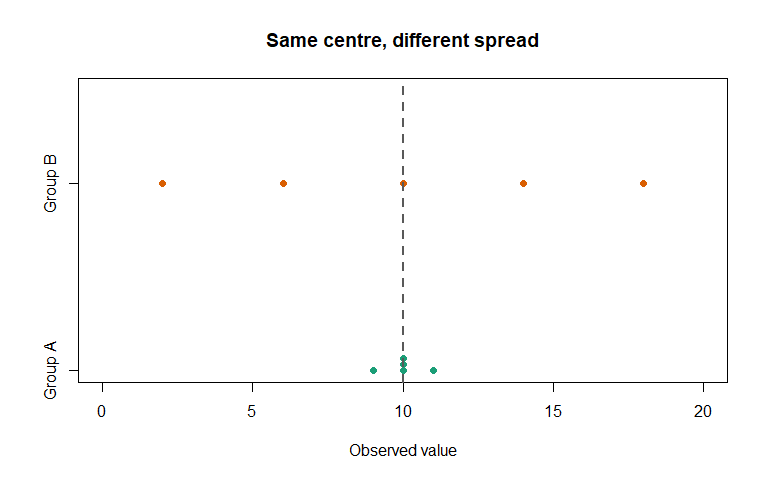
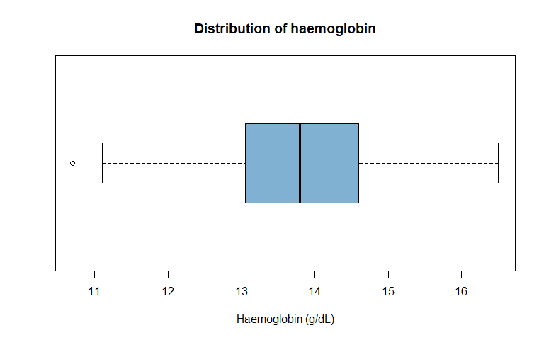
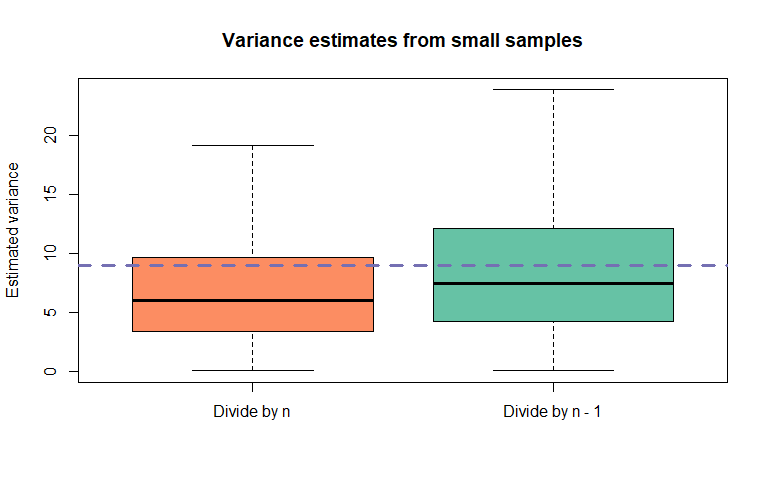
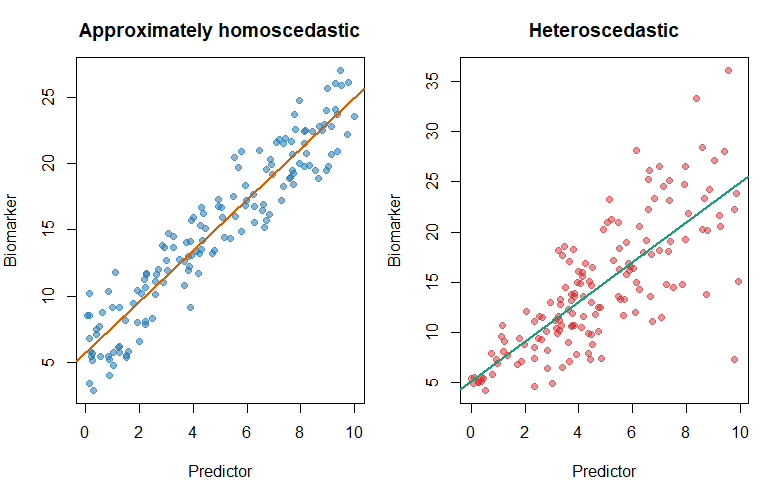
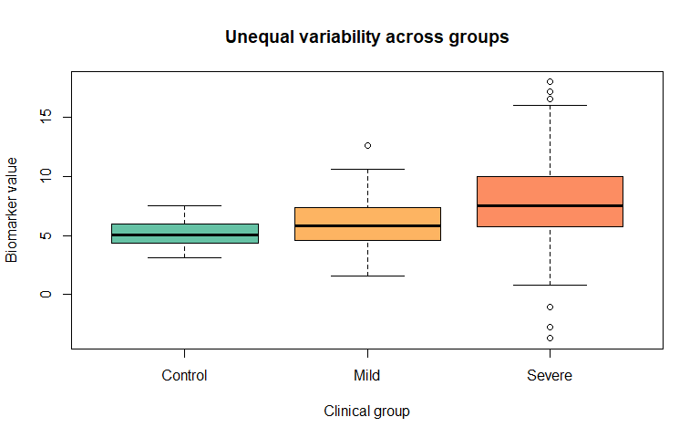
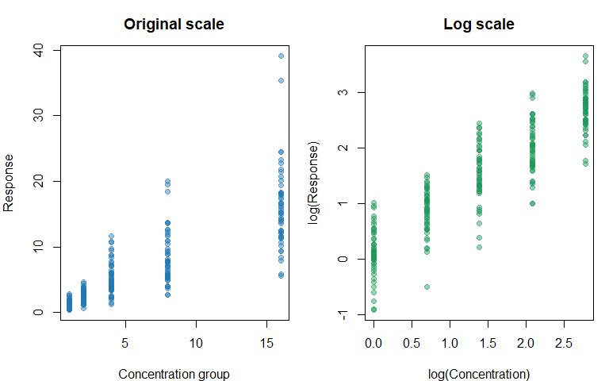
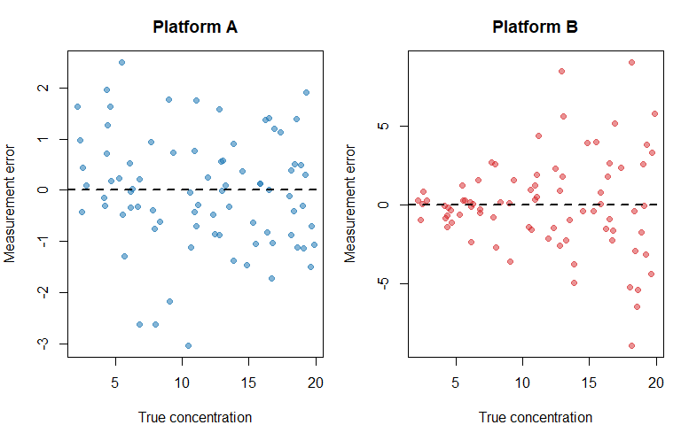

Chapter 9: Measures of Dispersion
================
Sandeep Singh

- [1. Introduction](#1-introduction)
- [2. Learning Objectives](#2-learning-objectives)
- [3. Same Centre, Different Spread](#3-same-centre-different-spread)
- [4. Absolute and Relative Measures of
  Dispersion](#4-absolute-and-relative-measures-of-dispersion)
- [5. The Range](#5-the-range)
  - [5.1 Advantages and limitations](#51-advantages-and-limitations)
- [6. Quantiles and Percentiles](#6-quantiles-and-percentiles)
- [7. The Interquartile Range](#7-the-interquartile-range)
  - [7.1 Reporting median and IQR](#71-reporting-median-and-iqr)
- [8. The Five-Number Summary](#8-the-five-number-summary)
- [9. Boxplots and the IQR Rule](#9-boxplots-and-the-iqr-rule)
- [10. Deviations From the Mean](#10-deviations-from-the-mean)
- [11. Population Variance](#11-population-variance)
- [12. Sample Variance](#12-sample-variance)
- [13. Why Does Sample Variance Divide by n -
  1?](#13-why-does-sample-variance-divide-by-n---1)
- [14. Standard Deviation](#14-standard-deviation)
- [15. The Empirical Rule for Normal-Like
  Data](#15-the-empirical-rule-for-normal-like-data)
- [16. Mean Plus or Minus Standard Deviation Is Not Automatically a
  Reference
  Interval](#16-mean-plus-or-minus-standard-deviation-is-not-automatically-a-reference-interval)
- [17. Variance and Standard Deviation Under Unit
  Changes](#17-variance-and-standard-deviation-under-unit-changes)
- [18. Mean Absolute Deviation and Median Absolute
  Deviation](#18-mean-absolute-deviation-and-median-absolute-deviation)
- [19. Robust Versus Non-Robust
  Dispersion](#19-robust-versus-non-robust-dispersion)
- [20. Coefficient of Variation](#20-coefficient-of-variation)
  - [20.1 Comparing assay precision](#201-comparing-assay-precision)
  - [20.2 When CV is inappropriate](#202-when-cv-is-inappropriate)
- [21. Geometric Standard Deviation](#21-geometric-standard-deviation)
- [22. Standard Deviation Versus Standard
  Error](#22-standard-deviation-versus-standard-error)
- [23. Z-Scores and Standardization](#23-z-scores-and-standardization)
- [24. Homoscedasticity and
  Heteroscedasticity](#24-homoscedasticity-and-heteroscedasticity)
  - [24.1 Homoscedasticity](#241-homoscedasticity)
  - [24.2 Heteroscedasticity](#242-heteroscedasticity)
  - [24.3 Group-specific variances](#243-group-specific-variances)
- [25. Why Heteroscedasticity
  Matters](#25-why-heteroscedasticity-matters)
  - [25.1 Visual assessment before formal
    testing](#251-visual-assessment-before-formal-testing)
- [26. Transformations and
  Dispersion](#26-transformations-and-dispersion)
- [27. Mean–Variance Relationships in Count
  Data](#27-meanvariance-relationships-in-count-data)
  - [27.1 Simulated Poisson counts](#271-simulated-poisson-counts)
  - [27.2 Simulated overdispersed
    counts](#272-simulated-overdispersed-counts)
- [28. Biological and Technical
  Variation](#28-biological-and-technical-variation)
- [29. Within-Subject and Between-Subject
  Variability](#29-within-subject-and-between-subject-variability)
- [30. Pooled Variance: An
  Introduction](#30-pooled-variance-an-introduction)
- [31. Combining Variability Across
  Groups](#31-combining-variability-across-groups)
- [32. Missing Values and Dispersion](#32-missing-values-and-dispersion)
- [33. A Reusable Dispersion
  Function](#33-a-reusable-dispersion-function)
- [34. Integrated Case Study: Comparing Assay
  Variability](#34-integrated-case-study-comparing-assay-variability)
  - [34.1 Scientific setting](#341-scientific-setting)
  - [34.2 Calculate measurement
    errors](#342-calculate-measurement-errors)
  - [34.3 Visualize error against
    concentration](#343-visualize-error-against-concentration)
  - [34.4 Compare low and high concentration
    ranges](#344-compare-low-and-high-concentration-ranges)
- [35. Common Mistakes](#35-common-mistakes)
  - [Mistake 1: Reporting a centre without
    spread](#mistake-1-reporting-a-centre-without-spread)
  - [Mistake 2: Pairing a skewed distribution only with mean and
    SD](#mistake-2-pairing-a-skewed-distribution-only-with-mean-and-sd)
  - [Mistake 3: Calling mean plus or minus SD a confidence
    interval](#mistake-3-calling-mean-plus-or-minus-sd-a-confidence-interval)
  - [Mistake 4: Treating a boxplot point as an
    error](#mistake-4-treating-a-boxplot-point-as-an-error)
  - [Mistake 5: Forgetting that variance uses squared
    units](#mistake-5-forgetting-that-variance-uses-squared-units)
  - [Mistake 6: Using population and sample variance formulas
    interchangeably](#mistake-6-using-population-and-sample-variance-formulas-interchangeably)
  - [Mistake 7: Comparing CVs when means are near
    zero](#mistake-7-comparing-cvs-when-means-are-near-zero)
  - [Mistake 8: Pooling unequal variances
    automatically](#mistake-8-pooling-unequal-variances-automatically)
  - [Mistake 9: Ignoring mean-dependent
    variance](#mistake-9-ignoring-mean-dependent-variance)
  - [Mistake 10: Treating technical replicates as independent biological
    variation](#mistake-10-treating-technical-replicates-as-independent-biological-variation)
- [36. Practical Reporting Guide](#36-practical-reporting-guide)
- [37. Chapter Summary](#37-chapter-summary)
- [38. Check Your Understanding](#38-check-your-understanding)
- [39. R Exercises](#39-r-exercises)
  - [Exercise 1: Range and IQR](#exercise-1-range-and-iqr)
  - [Exercise 2: Outlier influence](#exercise-2-outlier-influence)
  - [Exercise 3: Manual variance](#exercise-3-manual-variance)
  - [Exercise 4: Bessel’s correction](#exercise-4-bessels-correction)
  - [Exercise 5: Empirical rule](#exercise-5-empirical-rule)
  - [Exercise 6: Coefficient of
    variation](#exercise-6-coefficient-of-variation)
  - [Exercise 7: SD versus SE](#exercise-7-sd-versus-se)
  - [Exercise 8: Heteroscedasticity](#exercise-8-heteroscedasticity)
  - [Exercise 9: Count overdispersion](#exercise-9-count-overdispersion)
  - [Exercise 10: Repeated
    measurements](#exercise-10-repeated-measurements)
- [40. Mini-Project: Variability in RNA-seq Quality
  Metrics](#40-mini-project-variability-in-rna-seq-quality-metrics)
- [41. Glossary](#41-glossary)
- [42. References](#42-references)
- [43. Reproducibility Information](#43-reproducibility-information)

# 1. Introduction

Chapter 8 introduced measures of central tendency. A mean or median
tells us where observations are centred, but it does not tell us whether
those observations are tightly clustered or widely scattered.

Consider two groups of gene-expression values:

- Group A: 9, 10, 10, 10, 11
- Group B: 2, 6, 10, 14, 18

Both groups have a mean and median of 10. Their variability is very
different.

Measures of **dispersion**, also called measures of variability or
spread, quantify how far observations differ from one another or from a
centre.

Dispersion matters throughout biology:

- variability in blood pressure can indicate unstable physiological
  control;
- assay variation can reveal poor laboratory precision;
- heterogeneous expression can identify biological subgroups;
- genetic variation differs among populations;
- variability between sequencing batches can indicate technical effects;
  and
- unequal residual variation can violate assumptions of some statistical
  models.

> **A centre without a measure of spread is an incomplete description of
> quantitative data.**

------------------------------------------------------------------------

# 2. Learning Objectives

After completing this chapter, you should be able to:

1.  explain why datasets with the same centre can have different
    variability;
2.  calculate and interpret the range;
3.  calculate quartiles, percentiles and the interquartile range;
4.  calculate population and sample variance manually and with R;
5.  explain why sample variance uses $n-1$;
6.  calculate and interpret the standard deviation;
7.  distinguish standard deviation from standard error;
8.  calculate median absolute deviation and understand R’s scaling
    convention;
9.  calculate and interpret the coefficient of variation;
10. recognize when the coefficient of variation is inappropriate;
11. compare robust and non-robust measures of spread;
12. explain homoscedasticity and heteroscedasticity;
13. recognize mean–variance relationships in count and omics data;
14. distinguish biological from technical variability;
15. summarize within-subject and between-subject variability;
16. standardize observations using z-scores; and
17. report dispersion with an appropriate measure of centre and a
    visualization.

------------------------------------------------------------------------

# 3. Same Centre, Different Spread

``` r
group_a <- c(9, 10, 10, 10, 11)
group_b <- c(2, 6, 10, 14, 18)

data.frame(
  Group = c("A", "B"),
  Mean = c(mean(group_a), mean(group_b)),
  Median = c(median(group_a), median(group_b)),
  Minimum = c(min(group_a), min(group_b)),
  Maximum = c(max(group_a), max(group_b)),
  stringsAsFactors = FALSE
)
```

<div class="kable-table">

| Group | Mean | Median | Minimum | Maximum |
|:------|-----:|-------:|--------:|--------:|
| A     |   10 |     10 |       9 |      11 |
| B     |   10 |     10 |       2 |      18 |

</div>

``` r
stripchart(
  list(`Group A` = group_a, `Group B` = group_b),
  method = "stack",
  pch = 19,
  col = c("#1B9E77", "#D95F02"),
  xlab = "Observed value",
  main = "Same centre, different spread",
  xlim = c(0, 20)
)
abline(v = 10, lty = 2, lwd = 2, col = "grey35")
```

<div class="figure" style="text-align: center">


<p class="caption">

Two datasets can have the same mean and median but very different
dispersion.
</p>

</div>

The mean line alone cannot distinguish these groups. We need numerical
and graphical descriptions of spread.

# 4. Absolute and Relative Measures of Dispersion

**Absolute measures** retain a scale related to the original data.

- Range and IQR use the original measurement unit.
- Standard deviation uses the original unit.
- Variance uses the squared unit.

**Relative measures** describe spread relative to a reference level and
are often unitless.

- Coefficient of variation is standard deviation divided by mean.
- A relative range divides the range by a chosen centre.

Absolute spread is useful within one scale. Relative spread may help
compare measurements with different magnitudes, but only when its
assumptions are appropriate.

# 5. The Range

The range is the difference between the maximum and minimum:

$$\text{Range} = \max(x) - \min(x).$$

``` r
platelet_count <- c(180, 195, 205, 220, 240)

minimum_value <- min(platelet_count)
maximum_value <- max(platelet_count)
manual_range <- maximum_value - minimum_value

data.frame(
  Measure = c("Minimum", "Maximum", "Range"),
  Value = c(minimum_value, maximum_value, manual_range),
  stringsAsFactors = FALSE
)
```

<div class="kable-table">

| Measure | Value |
|:--------|------:|
| Minimum |   180 |
| Maximum |   240 |
| Range   |    60 |

</div>

``` r
range(platelet_count)
```

    ## [1] 180 240

``` r
diff(range(platelet_count))
```

    ## [1] 60

`range()` returns the minimum and maximum. `diff(range(x))` returns
their difference.

## 5.1 Advantages and limitations

The range is:

- easy to calculate;
- easy to explain; and
- useful for data-quality checks and observed limits.

However, it uses only two observations and is highly sensitive to
outliers and sample size. Larger samples have more opportunities to
contain extreme values, so their observed ranges tend to be wider even
when drawn from the same population.

``` r
platelet_with_error <- c(platelet_count, 2400)

data.frame(
  Dataset = c("Original", "With possible unit or entry error"),
  Range = c(diff(range(platelet_count)),
            diff(range(platelet_with_error))),
  stringsAsFactors = FALSE
)
```

<div class="kable-table">

| Dataset                           | Range |
|:----------------------------------|------:|
| Original                          |    60 |
| With possible unit or entry error |  2220 |

</div>

# 6. Quantiles and Percentiles

A **quantile** divides ordered data according to cumulative proportion.
A **percentile** is a quantile expressed on a scale from 0 to 100.

- 25th percentile = first quartile, $Q_1$
- 50th percentile = median, $Q_2$
- 75th percentile = third quartile, $Q_3$

``` r
set.seed(123)
haemoglobin <- round(rnorm(100, mean = 13.7, sd = 1.3), 1)

quantile(
  haemoglobin,
  probs = c(0, 0.10, 0.25, 0.50, 0.75, 0.90, 1)
)
```

    ##     0%    10%    25%    50%    75%    90%   100% 
    ## 10.700 12.300 13.075 13.800 14.600 15.320 16.500

Interpretation:

> The 25th percentile is a value at or below which approximately 25% of
> observations lie.

Quantiles are estimates in a sample. Different software can use
different interpolation rules, especially for small datasets. R’s
`quantile()` offers several `type` choices; the default is `type = 7`.
State the method when exact reproducibility across software matters.

# 7. The Interquartile Range

The **interquartile range** is:

$$IQR = Q_3 - Q_1.$$

It describes the width of the middle 50% of observations.

``` r
quartiles <- quantile(haemoglobin, probs = c(0.25, 0.75), names = FALSE)
manual_iqr <- quartiles[2] - quartiles[1]
r_iqr <- IQR(haemoglobin)

data.frame(
  Measure = c("Q1", "Q3", "Manual IQR", "IQR() result"),
  Value = c(quartiles[1], quartiles[2], manual_iqr, r_iqr),
  stringsAsFactors = FALSE
)
```

<div class="kable-table">

| Measure      |  Value |
|:-------------|-------:|
| Q1           | 13.075 |
| Q3           | 14.600 |
| Manual IQR   |  1.525 |
| IQR() result |  1.525 |

</div>

The IQR is resistant to extreme values because it does not use the
smallest or largest observations directly.

## 7.1 Reporting median and IQR

The median and IQR are commonly reported together for skewed data:

> Median C-reactive protein was 4.8 mg/L (IQR 2.1–9.6).

Be clear about whether parentheses contain:

- the two quartile values, such as `2.1--9.6`; or
- the IQR width, such as `IQR = 7.5`.

# 8. The Five-Number Summary

The five-number summary contains:

1.  minimum;
2.  first quartile;
3.  median;
4.  third quartile; and
5.  maximum.

``` r
fivenum(haemoglobin)
```

    ## [1] 10.70 13.05 13.80 14.60 16.50

``` r
summary(haemoglobin)
```

    ##    Min. 1st Qu.  Median    Mean 3rd Qu.    Max. 
    ##   10.70   13.07   13.80   13.82   14.60   16.50

`fivenum()` and `summary()` may calculate quartiles using slightly
different conventions. For formal reporting, use an explicitly chosen
and documented method.

# 9. Boxplots and the IQR Rule

A standard boxplot displays:

- a box from $Q_1$ to $Q_3$;
- a line at the median;
- whiskers extending to observations within 1.5 IQR of the box; and
- points beyond the whiskers as potential outliers.

The common lower and upper fences are:

$$Q_1 - 1.5(IQR)$$

and

$$Q_3 + 1.5(IQR).$$

``` r
q1 <- quantile(haemoglobin, 0.25, names = FALSE)
q3 <- quantile(haemoglobin, 0.75, names = FALSE)
iqr_value <- IQR(haemoglobin)

lower_fence <- q1 - 1.5 * iqr_value
upper_fence <- q3 + 1.5 * iqr_value

data.frame(
  Fence = c("Lower", "Upper"),
  Value = c(lower_fence, upper_fence),
  stringsAsFactors = FALSE
)
```

<div class="kable-table">

| Fence |   Value |
|:------|--------:|
| Lower | 10.7875 |
| Upper | 16.8875 |

</div>

``` r
boxplot(
  haemoglobin,
  horizontal = TRUE,
  col = "#80B1D3",
  xlab = "Haemoglobin (g/dL)",
  main = "Distribution of haemoglobin"
)
```

<div class="figure" style="text-align: center">


<p class="caption">

A boxplot summarizes the median, IQR, whiskers and potential outliers.
</p>

</div>

A boxplot flag is not proof of an error. It marks an observation
requiring scientific inspection.

# 10. Deviations From the Mean

For observation $x_i$, its deviation from the sample mean is:

$$d_i = x_i - \bar{x}.$$

``` r
expression <- c(4, 6, 8, 10, 12)
expression_mean <- mean(expression)

deviation_table <- data.frame(
  Observation = expression,
  Deviation = expression - expression_mean,
  Squared_deviation = (expression - expression_mean)^2
)

deviation_table
```

<div class="kable-table">

| Observation | Deviation | Squared_deviation |
|------------:|----------:|------------------:|
|           4 |        -4 |                16 |
|           6 |        -2 |                 4 |
|           8 |         0 |                 0 |
|          10 |         2 |                 4 |
|          12 |         4 |                16 |

</div>

``` r
data.frame(
  Quantity = c("Sum of deviations", "Sum of squared deviations"),
  Value = c(
    sum(deviation_table$Deviation),
    sum(deviation_table$Squared_deviation)
  ),
  stringsAsFactors = FALSE
)
```

<div class="kable-table">

| Quantity                  | Value |
|:--------------------------|------:|
| Sum of deviations         |     0 |
| Sum of squared deviations |    40 |

</div>

Positive and negative deviations cancel, so their ordinary sum is zero.
Squaring makes every contribution non-negative and leads to variance.

# 11. Population Variance

If all $N$ population values are observed, population variance is:

$$\sigma^2 = \frac{1}{N}\sum_{i=1}^{N}(X_i - \mu)^2.$$

``` r
population_x <- c(2, 4, 6, 8, 10)
population_mu <- mean(population_x)

population_variance <- sum((population_x - population_mu)^2) /
  length(population_x)

population_variance
```

    ## [1] 8

R’s `var()` does not calculate this population formula. It calculates
sample variance using $n-1$.

# 12. Sample Variance

For a sample of size $n$, the sample variance is:

$$s^2 = \frac{1}{n-1}\sum_{i=1}^{n}(x_i - \bar{x})^2.$$

``` r
sample_x <- c(2, 4, 6, 8, 10)
sample_mean <- mean(sample_x)

sum_squared_deviations <- sum((sample_x - sample_mean)^2)
manual_sample_variance <- sum_squared_deviations /
  (length(sample_x) - 1)
r_sample_variance <- var(sample_x)

data.frame(
  Calculation = c("Sum of squared deviations",
                  "Manual sample variance",
                  "var() result"),
  Value = c(sum_squared_deviations,
            manual_sample_variance,
            r_sample_variance),
  stringsAsFactors = FALSE
)
```

<div class="kable-table">

| Calculation               | Value |
|:--------------------------|------:|
| Sum of squared deviations |    40 |
| Manual sample variance    |    10 |
| var() result              |    10 |

</div>

Variance is expressed in squared units. If expression is measured in
arbitrary units, variance is in squared arbitrary units. This makes
variance useful mathematically but sometimes less intuitive
biologically.

# 13. Why Does Sample Variance Divide by n - 1?

The sample mean is estimated from the same data. Once $n-1$ deviations
are known, the final deviation is fixed because all deviations must sum
to zero. We therefore have $n-1$ independent pieces of deviation
information, called **degrees of freedom**.

Dividing by $n$ tends to underestimate population variance. Dividing by
$n-1$ applies **Bessel’s correction**, making sample variance unbiased
under standard independent random-sampling conditions.

``` r
set.seed(321)

population_sd <- 3
true_variance <- population_sd^2
sample_size <- 5
repetitions <- 10000

variance_using_n <- replicate(repetitions, {
  z <- rnorm(sample_size, mean = 0, sd = population_sd)
  sum((z - mean(z))^2) / sample_size
})

variance_using_n_minus_1 <- replicate(repetitions, {
  z <- rnorm(sample_size, mean = 0, sd = population_sd)
  var(z)
})

comparison <- data.frame(
  Estimator = c("Divide by n", "Divide by n - 1", "True variance"),
  Average_variance = round(c(
    mean(variance_using_n),
    mean(variance_using_n_minus_1),
    true_variance
  ), 3),
  stringsAsFactors = FALSE
)

comparison
```

<div class="kable-table">

| Estimator       | Average_variance |
|:----------------|-----------------:|
| Divide by n     |            7.218 |
| Divide by n - 1 |            8.986 |
| True variance   |            9.000 |

</div>

``` r
boxplot(
  list(`Divide by n` = variance_using_n,
       `Divide by n - 1` = variance_using_n_minus_1),
  col = c("#FC8D62", "#66C2A5"),
  ylab = "Estimated variance",
  main = "Variance estimates from small samples",
  outline = FALSE
)
abline(h = true_variance, col = "#7570B3", lwd = 3, lty = 2)
```

<div class="figure" style="text-align: center">


<p class="caption">

Across repeated samples, division by n underestimates population
variance, while division by n - 1 is unbiased on average.
</p>

</div>

Unbiased does not mean that every sample estimate equals the truth. It
means the estimator’s average across repeated samples equals the
population variance.

# 14. Standard Deviation

The standard deviation is the positive square root of variance:

$$s = \sqrt{s^2}.$$

``` r
manual_sd <- sqrt(var(sample_x))
r_sd <- sd(sample_x)

data.frame(
  Method = c("Square root of variance", "sd() result"),
  Standard_deviation = c(manual_sd, r_sd),
  stringsAsFactors = FALSE
)
```

<div class="kable-table">

| Method                  | Standard_deviation |
|:------------------------|-------------------:|
| Square root of variance |           3.162278 |
| sd() result             |           3.162278 |

</div>

Unlike variance, standard deviation uses the original measurement unit.
It describes the typical scale of deviations around the mean, although
it is not literally the average absolute distance.

The standard deviation:

- uses all observations;
- is sensitive to extreme values;
- is naturally paired with the arithmetic mean; and
- is especially interpretable for approximately symmetric distributions.

# 15. The Empirical Rule for Normal-Like Data

For an approximately normal distribution:

- about 68% of observations lie within $\mu \pm 1\sigma$;
- about 95% lie within $\mu \pm 2\sigma$; and
- about 99.7% lie within $\mu \pm 3\sigma$.

This is called the **68–95–99.7 rule**.

``` r
set.seed(456)
normal_values <- rnorm(100000, mean = 100, sd = 15)
mu <- mean(normal_values)
sigma <- sd(normal_values)

within_sd <- function(k) {
  mean(normal_values >= mu - k * sigma &
         normal_values <= mu + k * sigma)
}

data.frame(
  Interval = c("Mean +/- 1 SD", "Mean +/- 2 SD", "Mean +/- 3 SD"),
  Percent_inside = round(100 * c(within_sd(1),
                                 within_sd(2),
                                 within_sd(3)), 2),
  stringsAsFactors = FALSE
)
```

<div class="kable-table">

| Interval      | Percent_inside |
|:--------------|---------------:|
| Mean +/- 1 SD |          68.20 |
| Mean +/- 2 SD |          95.50 |
| Mean +/- 3 SD |          99.74 |

</div>

Do not apply this rule automatically to strongly skewed, bounded,
discrete or multimodal biological data.

# 16. Mean Plus or Minus Standard Deviation Is Not Automatically a Reference Interval

For normal-like data, mean $\pm$ 1.96 SD contains approximately 95% of
the population distribution. But a clinical **reference interval**
requires careful sampling of an appropriate reference population,
assay-specific procedures and often nonparametric quantiles.

Mean $\pm$ SD is also not a confidence interval for the mean. These
quantities answer different questions:

- SD: spread of individual observations;
- reference interval: expected range for individuals in a defined
  reference population;
- confidence interval: uncertainty in an estimated parameter.

# 17. Variance and Standard Deviation Under Unit Changes

If every observation is multiplied by a constant $a$:

- the mean is multiplied by $a$;
- the standard deviation is multiplied by $|a|$; and
- the variance is multiplied by $a^2$.

``` r
height_cm <- c(160, 168, 172, 175, 182)
height_m <- height_cm / 100

data.frame(
  Scale = c("Centimetres", "Metres"),
  Mean = c(mean(height_cm), mean(height_m)),
  Variance = c(var(height_cm), var(height_m)),
  SD = c(sd(height_cm), sd(height_m)),
  stringsAsFactors = FALSE
)
```

<div class="kable-table">

| Scale       |    Mean | Variance |        SD |
|:------------|--------:|---------:|----------:|
| Centimetres | 171.400 | 66.80000 | 8.1731267 |
| Metres      |   1.714 |  0.00668 | 0.0817313 |

</div>

Changing units changes absolute measures of dispersion. This is one
reason variance should always be reported with context.

# 18. Mean Absolute Deviation and Median Absolute Deviation

The phrase **mean absolute deviation** can refer to the mean of absolute
distances from a chosen centre:

$$\frac{1}{n}\sum_{i=1}^{n}|x_i - \bar{x}|.$$

``` r
mad_data <- c(2, 3, 4, 5, 20)

mean_absolute_deviation <- mean(abs(mad_data - mean(mad_data)))
mean_absolute_deviation
```

    ## [1] 5.28

The **median absolute deviation** is based on the median:

$$MAD_{raw} = \operatorname{median}\left(|x_i - \operatorname{median}(x)|\right).$$

It is robust to extreme values.

``` r
raw_mad <- median(abs(mad_data - median(mad_data)))
r_raw_mad <- mad(mad_data, constant = 1)
r_scaled_mad <- mad(mad_data)

data.frame(
  Measure = c("Manual raw MAD",
              "mad(constant = 1)",
              "R default scaled MAD"),
  Value = c(raw_mad, r_raw_mad, r_scaled_mad),
  stringsAsFactors = FALSE
)
```

<div class="kable-table">

| Measure              |  Value |
|:---------------------|-------:|
| Manual raw MAD       | 1.0000 |
| mad(constant = 1)    | 1.0000 |
| R default scaled MAD | 1.4826 |

</div>

R’s default `mad()` multiplies the raw MAD by approximately 1.4826.
Under normality, this scaled value is comparable to the standard
deviation. Always state whether MAD is raw or scaled.

# 19. Robust Versus Non-Robust Dispersion

``` r
base_values <- c(9, 10, 10, 11, 12)
extreme_values <- c(base_values, 100)

robust_comparison <- data.frame(
  Dataset = c("Without extreme value", "With extreme value"),
  Range = c(diff(range(base_values)), diff(range(extreme_values))),
  IQR = c(IQR(base_values), IQR(extreme_values)),
  SD = c(sd(base_values), sd(extreme_values)),
  Scaled_MAD = c(mad(base_values), mad(extreme_values)),
  stringsAsFactors = FALSE
)

numeric_names <- c("Range", "IQR", "SD", "Scaled_MAD")
robust_comparison[numeric_names] <- round(
  robust_comparison[numeric_names], 2
)

robust_comparison
```

<div class="kable-table">

| Dataset               | Range |  IQR |    SD | Scaled_MAD |
|:----------------------|------:|-----:|------:|-----------:|
| Without extreme value |     3 | 1.00 |  1.14 |       1.48 |
| With extreme value    |    91 | 1.75 | 36.59 |       1.48 |

</div>

The range and SD respond strongly to the extreme observation. IQR and
MAD change less.

| Centre         | Commonly paired dispersion   |
|----------------|------------------------------|
| Mean           | Standard deviation           |
| Median         | IQR or MAD                   |
| Geometric mean | Geometric SD or log-scale SD |

Pairing should also reflect the scientific model, not just a formatting
convention.

# 20. Coefficient of Variation

The coefficient of variation, or CV, expresses standard deviation
relative to the mean:

$$CV = \frac{s}{\bar{x}}.$$

It is often reported as a percentage:

$$CV\% = \frac{s}{\bar{x}} \times 100.$$

``` r
coefficient_of_variation <- function(x, na.rm = TRUE,
                                     as_percent = TRUE) {
  if (na.rm) {
    x <- x[!is.na(x)]
  }

  if (length(x) < 2 || mean(x) == 0) {
    return(NA_real_)
  }

  cv <- sd(x) / mean(x)

  if (as_percent) {
    cv <- 100 * cv
  }

  cv
}

coefficient_of_variation(c(98, 101, 103, 99, 100))
```

    ## [1] 1.919699

## 20.1 Comparing assay precision

``` r
assay_1 <- c(98, 101, 103, 99, 100)
assay_2 <- c(980, 1010, 1030, 990, 1000)

data.frame(
  Assay = c("Assay 1", "Assay 2"),
  Mean = c(mean(assay_1), mean(assay_2)),
  SD = c(sd(assay_1), sd(assay_2)),
  CV_percent = round(c(
    coefficient_of_variation(assay_1),
    coefficient_of_variation(assay_2)
  ), 2),
  stringsAsFactors = FALSE
)
```

<div class="kable-table">

| Assay   |   Mean |        SD | CV_percent |
|:--------|-------:|----------:|-----------:|
| Assay 1 |  100.2 |  1.923538 |       1.92 |
| Assay 2 | 1002.0 | 19.235384 |       1.92 |

</div>

The assays have different absolute scales but similar relative
variation.

## 20.2 When CV is inappropriate

CV is meaningful mainly for ratio-scale variables with a meaningful
zero. It can be misleading when:

- the mean is zero or near zero;
- values can be negative;
- zero is arbitrary, as with degrees Celsius;
- groups differ by an additive shift rather than a multiplicative scale;
  or
- the distribution is severely skewed and the arithmetic mean and SD are
  poor summaries.

For expression values centered around zero after normalization, a CV can
explode or change sign and should generally not be used.

# 21. Geometric Standard Deviation

For positive log-normal-like data, variability may be described on the
log scale. A geometric standard deviation can be defined as:

$$GSD = \exp\left[sd(\log x)\right].$$

``` r
set.seed(654)
titre <- rlnorm(100, meanlog = log(80), sdlog = 0.55)

geometric_mean <- exp(mean(log(titre)))
geometric_sd <- exp(sd(log(titre)))

data.frame(
  Measure = c("Geometric mean", "Geometric SD"),
  Value = round(c(geometric_mean, geometric_sd), 2),
  stringsAsFactors = FALSE
)
```

<div class="kable-table">

| Measure        | Value |
|:---------------|------:|
| Geometric mean | 75.11 |
| Geometric SD   |  1.66 |

</div>

A multiplicative interval one log-SD from the geometric mean is
approximately:

$$\left[\frac{GM}{GSD},\;GM \times GSD\right].$$

``` r
data.frame(
  Lower = geometric_mean / geometric_sd,
  Geometric_mean = geometric_mean,
  Upper = geometric_mean * geometric_sd
)
```

<div class="kable-table">

|    Lower | Geometric_mean |    Upper |
|---------:|---------------:|---------:|
| 45.27195 |       75.10694 | 124.6037 |

</div>

Do not write `geometric mean $\pm$ geometric SD`; geometric spread is
multiplicative, not additive.

# 22. Standard Deviation Versus Standard Error

The standard deviation describes variation among observations. The
standard error of the mean describes uncertainty in the estimated mean.

For independent observations:

$$SE(\bar{x}) = \frac{s}{\sqrt{n}}.$$

``` r
set.seed(777)
small_sample <- rnorm(25, mean = 50, sd = 10)
large_sample <- rnorm(400, mean = 50, sd = 10)

sd_se_comparison <- data.frame(
  Sample = c("n = 25", "n = 400"),
  N = c(length(small_sample), length(large_sample)),
  SD = c(sd(small_sample), sd(large_sample)),
  SE = c(
    sd(small_sample) / sqrt(length(small_sample)),
    sd(large_sample) / sqrt(length(large_sample))
  ),
  stringsAsFactors = FALSE
)

sd_se_comparison[c("SD", "SE")] <- round(
  sd_se_comparison[c("SD", "SE")], 2
)

sd_se_comparison
```

<div class="kable-table">

| Sample  |   N |    SD |   SE |
|:--------|----:|------:|-----:|
| n = 25  |  25 | 10.05 | 2.01 |
| n = 400 | 400 | 10.37 | 0.52 |

</div>

The underlying individual variability is similar, so SD remains around
10. The larger sample estimates its mean more precisely, so SE is
smaller.

> **Use SD to describe participant variability. Use SE or a confidence
> interval to describe precision of an estimated mean.**

Error bars must be labelled clearly. An unlabeled “mean $\pm$ error”
plot is ambiguous.

# 23. Z-Scores and Standardization

A z-score expresses an observation in standard-deviation units from the
mean:

$$z_i = \frac{x_i - \bar{x}}{s}.$$

``` r
gene_expression <- c(4.2, 5.0, 5.5, 6.1, 7.4)

manual_z <- (gene_expression - mean(gene_expression)) /
  sd(gene_expression)
r_z <- as.numeric(scale(gene_expression))

data.frame(
  Expression = gene_expression,
  Manual_z = round(manual_z, 3),
  Scale_z = round(r_z, 3)
)
```

<div class="kable-table">

| Expression | Manual_z | Scale_z |
|-----------:|---------:|--------:|
|        4.2 |   -1.195 |  -1.195 |
|        5.0 |   -0.531 |  -0.531 |
|        5.5 |   -0.116 |  -0.116 |
|        6.1 |    0.382 |   0.382 |
|        7.4 |    1.460 |   1.460 |

</div>

After sample standardization, the z-scores have mean approximately 0 and
sample SD 1.

``` r
data.frame(
  Mean_z = mean(r_z),
  SD_z = sd(r_z)
)
```

<div class="kable-table">

| Mean_z | SD_z |
|-------:|-----:|
|      0 |    1 |

</div>

A z-score of 2 means two sample SDs above the sample mean. It does not
automatically mean “abnormal,” particularly for non-normal data or a
selected sample.

# 24. Homoscedasticity and Heteroscedasticity

These terms describe whether variability is similar across groups or
across fitted values.

## 24.1 Homoscedasticity

**Homoscedasticity** means the conditional variance is approximately
constant.

Example: the spread of residual biomarker values is similar in control,
treatment A and treatment B groups.

## 24.2 Heteroscedasticity

**Heteroscedasticity** means the conditional variance changes.

Examples:

- biomarker variation is larger among severe cases;
- measurement error increases at high concentrations;
- gene counts become more variable as their mean increases; or
- variance differs between treatment groups.

``` r
set.seed(888)

x_homo <- runif(150, 0, 10)
y_homo <- 5 + 2 * x_homo + rnorm(150, sd = 2)

x_hetero <- runif(150, 0, 10)
y_hetero <- 5 + 2 * x_hetero + rnorm(150, sd = 0.5 + 0.7 * x_hetero)
```

``` r
par(mfrow = c(1, 2), mar = c(4, 4, 3, 1))

plot(x_homo, y_homo, pch = 19, col = rgb(0.12, 0.47, 0.71, 0.55),
     xlab = "Predictor", ylab = "Biomarker",
     main = "Approximately homoscedastic")
abline(lm(y_homo ~ x_homo), col = "#D95F02", lwd = 2)

plot(x_hetero, y_hetero, pch = 19, col = rgb(0.84, 0.15, 0.16, 0.50),
     xlab = "Predictor", ylab = "Biomarker",
     main = "Heteroscedastic")
abline(lm(y_hetero ~ x_hetero), col = "#1B9E77", lwd = 2)
```

<div class="figure" style="text-align: center">


<p class="caption">

Homoscedastic data have approximately constant vertical spread;
heteroscedastic data show changing spread.
</p>

</div>

``` r
par(mfrow = c(1, 1))
```

The right panel has a funnel shape: spread grows as the predictor
increases.

## 24.3 Group-specific variances

``` r
set.seed(889)

variance_groups <- data.frame(
  Group = rep(c("Control", "Mild", "Severe"), each = 80),
  Biomarker = c(
    rnorm(80, mean = 5, sd = 1),
    rnorm(80, mean = 6, sd = 2),
    rnorm(80, mean = 8, sd = 4)
  ),
  stringsAsFactors = FALSE
)

group_names <- unique(variance_groups$Group)

group_dispersion <- do.call(rbind, lapply(group_names, function(g) {
  values <- variance_groups$Biomarker[variance_groups$Group == g]
  data.frame(
    Group = g,
    N = length(values),
    Mean = mean(values),
    SD = sd(values),
    Variance = var(values),
    stringsAsFactors = FALSE
  )
}))

group_dispersion[c("Mean", "SD", "Variance")] <- round(
  group_dispersion[c("Mean", "SD", "Variance")], 2
)

group_dispersion
```

<div class="kable-table">

| Group   |   N | Mean |   SD | Variance |
|:--------|----:|-----:|-----:|---------:|
| Control |  80 | 5.12 | 1.02 |     1.04 |
| Mild    |  80 | 6.12 | 2.30 |     5.27 |
| Severe  |  80 | 7.84 | 4.17 |    17.43 |

</div>

``` r
boxplot(
  Biomarker ~ Group,
  data = variance_groups,
  col = c("#66C2A5", "#FDB462", "#FC8D62"),
  ylab = "Biomarker value",
  xlab = "Clinical group",
  main = "Unequal variability across groups"
)
```

<div class="figure" style="text-align: center">


<p class="caption">

The simulated severe group has greater dispersion than the control
group.
</p>

</div>

# 25. Why Heteroscedasticity Matters

Some classical methods assume equal variances across groups or constant
residual variance. If this assumption is strongly violated:

- standard errors may be wrong;
- confidence intervals may have incorrect coverage;
- hypothesis tests may have incorrect false-positive rates; and
- a single pooled SD may misrepresent every group.

Possible responses include:

- inspect and correct data errors;
- model group-specific variances;
- transform the outcome when scientifically appropriate;
- use Welch’s t-test instead of the equal-variance t-test;
- use heteroscedasticity-robust standard errors;
- use generalized linear models for non-normal outcomes; or
- use a distribution that models the mean–variance relationship.

Do not transform data merely to make a plot look nicer. The
transformation changes the scale of interpretation.

## 25.1 Visual assessment before formal testing

Residual-versus-fitted plots and group-specific boxplots are often more
informative than an automatic variance test. Formal tests can have low
power in small samples and detect trivial differences in very large
samples.

Tests such as Levene’s or Brown–Forsythe’s test are generally more
robust than Bartlett’s test when normality is doubtful. These procedures
will be introduced with group-comparison methods.

# 26. Transformations and Dispersion

Many positive biological measurements have variance that increases with
the mean. A log transformation can sometimes stabilize multiplicative
variability.

``` r
set.seed(990)

concentration <- rep(c(1, 2, 4, 8, 16), each = 50)
response <- rlnorm(
  length(concentration),
  meanlog = log(concentration),
  sdlog = 0.45
)

par(mfrow = c(1, 2), mar = c(4, 4, 3, 1))

plot(concentration, response, pch = 19,
     col = rgb(0.12, 0.47, 0.71, 0.45),
     xlab = "Concentration group", ylab = "Response",
     main = "Original scale")

plot(log(concentration), log(response), pch = 19,
     col = rgb(0.10, 0.60, 0.35, 0.45),
     xlab = "log(Concentration)", ylab = "log(Response)",
     main = "Log scale")
```

<div class="figure" style="text-align: center">


<p class="caption">

A log transformation can reduce a mean-dependent spread pattern for
positive multiplicative data.
</p>

</div>

``` r
par(mfrow = c(1, 1))
```

A log transformation requires positive values. Adding a pseudocount to
zero-valued data changes the result and needs justification.

# 27. Mean–Variance Relationships in Count Data

For a Poisson distribution, the theoretical mean and variance are equal:

$$E(Y) = Var(Y) = \lambda.$$

Biological count data often have greater variance than the Poisson model
expects. This is called **overdispersion**.

## 27.1 Simulated Poisson counts

``` r
set.seed(1001)

poisson_counts <- rpois(1000, lambda = 20)

data.frame(
  Mean = mean(poisson_counts),
  Variance = var(poisson_counts),
  Variance_to_mean = var(poisson_counts) / mean(poisson_counts)
)
```

<div class="kable-table">

|   Mean | Variance | Variance_to_mean |
|-------:|---------:|-----------------:|
| 19.845 | 17.19617 |        0.8665241 |

</div>

## 27.2 Simulated overdispersed counts

``` r
set.seed(1002)

negative_binomial_counts <- rnbinom(1000, mu = 20, size = 2)

data.frame(
  Mean = mean(negative_binomial_counts),
  Variance = var(negative_binomial_counts),
  Variance_to_mean = var(negative_binomial_counts) /
    mean(negative_binomial_counts)
)
```

<div class="kable-table">

|   Mean | Variance | Variance_to_mean |
|-------:|---------:|-----------------:|
| 19.431 |   212.74 |         10.94848 |

</div>

RNA-seq differential-expression tools commonly use negative-binomial
models because biological replicate counts often show a mean-dependent
variance exceeding the Poisson expectation.

The variance-to-mean ratio is a descriptive clue, not a complete
diagnostic for complex RNA-seq data. Library size, normalization, design
and gene-specific dispersion must be considered.

# 28. Biological and Technical Variation

Observed variability can arise from several sources.

| Source | Example |
|----|----|
| Between-person biological variation | Genetic background, age, environment |
| Within-person biological variation | Circadian rhythm, disease fluctuation |
| Pre-analytical variation | Collection time, transport, storage |
| Analytical variation | Pipetting, reagent lot, instrument noise |
| Batch variation | Samples processed on different dates or platforms |
| Data-processing variation | Alignment, normalization or filtering choices |

Technical replicates help estimate measurement variability. Biological
replicates help estimate variability among biological units.

``` r
set.seed(1100)

replicate_data <- expand.grid(
  Donor = paste0("D", 1:8),
  Technical_replicate = 1:3,
  stringsAsFactors = FALSE
)

donor_effect <- rnorm(8, mean = 10, sd = 2)
replicate_data$Measurement <- round(
  donor_effect[match(replicate_data$Donor, paste0("D", 1:8))] +
    rnorm(nrow(replicate_data), mean = 0, sd = 0.35),
  2
)

head(replicate_data, 9)
```

<div class="kable-table">

| Donor | Technical_replicate | Measurement |
|:------|--------------------:|------------:|
| D1    |                   1 |       10.37 |
| D2    |                   1 |       10.04 |
| D3    |                   1 |       10.52 |
| D4    |                   1 |        8.15 |
| D5    |                   1 |        8.34 |
| D6    |                   1 |       11.17 |
| D7    |                   1 |        9.21 |
| D8    |                   1 |        9.29 |
| D1    |                   2 |       10.83 |

</div>

The three technical measurements from one donor are dependent. Treating
all 24 measurements as independent biological replicates would
underestimate uncertainty.

# 29. Within-Subject and Between-Subject Variability

Repeated measurements contain multiple variation levels:

- **within-subject variability:** changes or measurement noise within
  the same participant;
- **between-subject variability:** differences among participant-level
  means.

``` r
donor_names <- unique(replicate_data$Donor)

donor_summary <- do.call(rbind, lapply(donor_names, function(d) {
  values <- replicate_data$Measurement[replicate_data$Donor == d]
  data.frame(
    Donor = d,
    Donor_mean = mean(values),
    Within_donor_SD = sd(values),
    stringsAsFactors = FALSE
  )
}))

donor_summary[c("Donor_mean", "Within_donor_SD")] <- round(
  donor_summary[c("Donor_mean", "Within_donor_SD")], 3
)

donor_summary
```

<div class="kable-table">

| Donor | Donor_mean | Within_donor_SD |
|:------|-----------:|----------------:|
| D1    |     10.693 |           0.281 |
| D2    |      9.943 |           0.231 |
| D3    |     10.280 |           0.219 |
| D4    |      8.037 |           0.163 |
| D5    |      7.770 |           0.728 |
| D6    |     10.983 |           0.176 |
| D7    |      9.160 |           0.210 |
| D8    |      9.323 |           0.571 |

</div>

``` r
data.frame(
  Quantity = c("SD of donor means", "Mean within-donor SD"),
  Value = round(c(
    sd(donor_summary$Donor_mean),
    mean(donor_summary$Within_donor_SD)
  ), 3),
  stringsAsFactors = FALSE
)
```

<div class="kable-table">

| Quantity             | Value |
|:---------------------|------:|
| SD of donor means    | 1.177 |
| Mean within-donor SD | 0.322 |

</div>

This simple description does not fully partition variance. Mixed-effects
models and variance-component analysis will later estimate hierarchical
sources more formally.

# 30. Pooled Variance: An Introduction

When independent groups are assumed to share one population variance,
their sample variances can be combined using degrees-of-freedom weights:

$$s_p^2 = \frac{(n_1-1)s_1^2 + (n_2-1)s_2^2}{n_1+n_2-2}.$$

``` r
group_1 <- c(10, 11, 9, 12, 10, 11)
group_2 <- c(14, 13, 15, 16, 14, 15, 13, 16)

n1 <- length(group_1)
n2 <- length(group_2)
s1_sq <- var(group_1)
s2_sq <- var(group_2)

pooled_variance <- ((n1 - 1) * s1_sq + (n2 - 1) * s2_sq) /
  (n1 + n2 - 2)
pooled_sd <- sqrt(pooled_variance)

data.frame(
  Measure = c("Group 1 SD", "Group 2 SD", "Pooled SD"),
  Value = round(c(sd(group_1), sd(group_2), pooled_sd), 3),
  stringsAsFactors = FALSE
)
```

<div class="kable-table">

| Measure    | Value |
|:-----------|------:|
| Group 1 SD | 1.049 |
| Group 2 SD | 1.195 |
| Pooled SD  | 1.137 |

</div>

Pooling is not appropriate merely because a formula exists. It relies on
a scientifically and statistically plausible common-variance assumption.

# 31. Combining Variability Across Groups

The SD of all observations is not generally the weighted average of
group SDs. Total variability contains:

- variation within groups; and
- variation between group means.

``` r
combined_values <- c(group_1, group_2)

data.frame(
  Quantity = c("Overall SD", "Pooled within-group SD",
               "Simple mean of group SDs"),
  Value = round(c(
    sd(combined_values),
    pooled_sd,
    mean(c(sd(group_1), sd(group_2)))
  ), 3),
  stringsAsFactors = FALSE
)
```

<div class="kable-table">

| Quantity                 | Value |
|:-------------------------|------:|
| Overall SD               | 2.326 |
| Pooled within-group SD   | 1.137 |
| Simple mean of group SDs | 1.122 |

</div>

Because the group means differ, the overall SD includes that
between-group separation. Always define whether the target is total
population variability or within-group variability.

# 32. Missing Values and Dispersion

``` r
assay_values <- c(10.2, 10.5, NA, 9.8, 10.1, NA, 10.4)

data.frame(
  Total_n = length(assay_values),
  Observed_n = sum(!is.na(assay_values)),
  Missing_n = sum(is.na(assay_values)),
  SD = sd(assay_values, na.rm = TRUE),
  IQR = IQR(assay_values, na.rm = TRUE),
  MAD = mad(assay_values, na.rm = TRUE)
)
```

<div class="kable-table">

| Total_n | Observed_n | Missing_n |        SD | IQR |     MAD |
|--------:|-----------:|----------:|----------:|----:|--------:|
|       7 |          5 |         2 | 0.2738613 | 0.3 | 0.29652 |

</div>

Using `na.rm = TRUE` calculates variability among observed values. If
extreme or unstable measurements are more likely to fail, observed
dispersion may be underestimated.

# 33. A Reusable Dispersion Function

``` r
dispersion_summary <- function(x, na.rm = TRUE) {
  if (na.rm) {
    x <- x[!is.na(x)]
  }

  if (length(x) < 2) {
    return(data.frame(
      N = length(x), Minimum = NA_real_, Q1 = NA_real_,
      Median = NA_real_, Q3 = NA_real_, Maximum = NA_real_,
      Range = NA_real_, IQR = NA_real_, Variance = NA_real_,
      SD = NA_real_, MAD = NA_real_, CV_percent = NA_real_
    ))
  }

  q <- quantile(x, probs = c(0.25, 0.50, 0.75), names = FALSE)
  cv <- if (mean(x) == 0) NA_real_ else 100 * sd(x) / mean(x)

  data.frame(
    N = length(x),
    Minimum = min(x),
    Q1 = q[1],
    Median = q[2],
    Q3 = q[3],
    Maximum = max(x),
    Range = diff(range(x)),
    IQR = IQR(x),
    Variance = var(x),
    SD = sd(x),
    MAD = mad(x),
    CV_percent = cv
  )
}

dispersion_summary(haemoglobin)
```

<div class="kable-table">

| N | Minimum | Q1 | Median | Q3 | Maximum | Range | IQR | Variance | SD | MAD | CV_percent |
|---:|---:|---:|---:|---:|---:|---:|---:|---:|---:|---:|---:|
| 100 | 10.7 | 13.075 | 13.8 | 14.6 | 16.5 | 5.8 | 1.525 | 1.403309 | 1.184613 | 1.18608 | 8.572973 |

</div>

The function returns a regular data frame with one value per column,
avoiding matrix-column problems during R Markdown table rendering.

# 34. Integrated Case Study: Comparing Assay Variability

## 34.1 Scientific setting

A laboratory compares two assay platforms. Each platform measures the
same type of positive biomarker in 80 independent specimens. Platform B
has variability that increases with concentration.

``` r
set.seed(1200)

n_assay <- 80
true_concentration <- runif(n_assay, min = 2, max = 20)

assay_case <- data.frame(
  Specimen = sprintf("S%03d", 1:n_assay),
  True_concentration = true_concentration,
  Platform_A = true_concentration + rnorm(n_assay, sd = 1.0),
  Platform_B = true_concentration +
    rnorm(n_assay, sd = 0.25 + 0.18 * true_concentration),
  stringsAsFactors = FALSE
)

head(assay_case)
```

<div class="kable-table">

| Specimen | True_concentration | Platform_A | Platform_B |
|:---------|-------------------:|-----------:|-----------:|
| S001     |           5.567747 |   5.083101 |   5.841428 |
| S002     |           9.018876 |  10.791182 |   9.133305 |
| S003     |          10.657680 |   9.538785 |   9.077456 |
| S004     |          11.085057 |  12.837093 |  11.588821 |
| S005     |          10.961794 |  10.536821 |  12.186255 |
| S006     |          12.784680 |  11.902267 |  13.698525 |

</div>

## 34.2 Calculate measurement errors

``` r
assay_case$Error_A <- assay_case$Platform_A -
  assay_case$True_concentration
assay_case$Error_B <- assay_case$Platform_B -
  assay_case$True_concentration

error_summary <- rbind(
  cbind(Platform = "A", dispersion_summary(assay_case$Error_A)),
  cbind(Platform = "B", dispersion_summary(assay_case$Error_B))
)

selected_columns <- c("Platform", "N", "Median", "IQR", "SD", "MAD")
error_summary <- error_summary[, selected_columns]

numeric_columns <- c("Median", "IQR", "SD", "MAD")
error_summary[numeric_columns] <- round(
  error_summary[numeric_columns], 3
)

error_summary
```

<div class="kable-table">

| Platform |   N | Median |   IQR |    SD |   MAD |
|:---------|----:|-------:|------:|------:|------:|
| A        |  80 | -0.022 | 1.324 | 1.109 | 1.046 |
| B        |  80 | -0.065 | 3.038 | 2.978 | 2.201 |

</div>

## 34.3 Visualize error against concentration

``` r
par(mfrow = c(1, 2), mar = c(4, 4, 3, 1))

plot(
  assay_case$True_concentration,
  assay_case$Error_A,
  pch = 19,
  col = rgb(0.12, 0.47, 0.71, 0.55),
  xlab = "True concentration",
  ylab = "Measurement error",
  main = "Platform A"
)
abline(h = 0, lty = 2, lwd = 2)

plot(
  assay_case$True_concentration,
  assay_case$Error_B,
  pch = 19,
  col = rgb(0.84, 0.15, 0.16, 0.50),
  xlab = "True concentration",
  ylab = "Measurement error",
  main = "Platform B"
)
abline(h = 0, lty = 2, lwd = 2)
```

<div class="figure" style="text-align: center">


<p class="caption">

Platform B shows a funnel-shaped error pattern, suggesting
heteroscedasticity.
</p>

</div>

``` r
par(mfrow = c(1, 1))
```

## 34.4 Compare low and high concentration ranges

``` r
assay_case$Concentration_group <- ifelse(
  assay_case$True_concentration < 11,
  "Lower", "Higher"
)

stratum_names <- c("Lower", "Higher")

stratified_error <- do.call(rbind, lapply(stratum_names, function(g) {
  rows <- assay_case$Concentration_group == g

  data.frame(
    Concentration_group = g,
    N = sum(rows),
    SD_Error_A = sd(assay_case$Error_A[rows]),
    SD_Error_B = sd(assay_case$Error_B[rows]),
    stringsAsFactors = FALSE
  )
}))

stratified_error[c("SD_Error_A", "SD_Error_B")] <- round(
  stratified_error[c("SD_Error_A", "SD_Error_B")], 3
)

stratified_error
```

<div class="kable-table">

| Concentration_group |   N | SD_Error_A | SD_Error_B |
|:--------------------|----:|-----------:|-----------:|
| Lower               |  36 |      1.276 |      1.308 |
| Higher              |  44 |      0.967 |      3.855 |

</div>

An overall SD compresses the error structure into one value and can hide
concentration-dependent variability. This is why visualizing dispersion
against the measurement level is important in assay validation.

# 35. Common Mistakes

## Mistake 1: Reporting a centre without spread

A mean of 10 can describe tightly clustered or highly variable
observations.

## Mistake 2: Pairing a skewed distribution only with mean and SD

Inspect the distribution. Median with IQR may be more informative,
though the estimand remains important.

## Mistake 3: Calling mean plus or minus SD a confidence interval

SD describes observations; a confidence interval describes parameter
uncertainty.

## Mistake 4: Treating a boxplot point as an error

It is a potential outlier, not an automatic deletion.

## Mistake 5: Forgetting that variance uses squared units

SD is generally easier to interpret in the original unit.

## Mistake 6: Using population and sample variance formulas interchangeably

R’s `var()` and `sd()` use $n-1$.

## Mistake 7: Comparing CVs when means are near zero

The denominator makes CV unstable or meaningless.

## Mistake 8: Pooling unequal variances automatically

Use a common variance only when scientifically and statistically
plausible.

## Mistake 9: Ignoring mean-dependent variance

Counts and positive biomarkers frequently become more variable as their
means increase.

## Mistake 10: Treating technical replicates as independent biological variation

Identify every level of the measurement hierarchy.

# 36. Practical Reporting Guide

| Data pattern or purpose | Centre | Dispersion | Helpful figure |
|----|----|----|----|
| Approximately symmetric | Mean | SD | Histogram or dot plot |
| Strongly skewed | Median | IQR | Histogram or boxplot |
| Outlier-resistant summary | Median | MAD or IQR | Boxplot plus points |
| Positive multiplicative data | Geometric mean | Geometric SD or log-SD | Log-scale plot |
| Compare relative assay precision | Mean | CV, if valid | CV plot plus raw values |
| Estimate mean precision | Mean | SE or confidence interval | Estimate-and-interval plot |
| Repeated measurements | Subject-specific centre | Within- and between-subject components | Spaghetti or variance-component plot |

Always report:

- units;
- observed sample size;
- missing values;
- transformation;
- grouping;
- whether variability is biological, technical or combined; and
- the exact definition of robust or relative measures.

# 37. Chapter Summary

- Dispersion describes how observations vary around a centre or across
  their range.
- The range uses only the minimum and maximum and is highly sensitive to
  extremes.
- Quantiles divide ordered data by cumulative proportion.
- IQR is $Q_3-Q_1$ and describes the middle 50%.
- Variance averages squared deviations and is expressed in squared
  units.
- Sample variance divides by $n-1$ to correct average downward bias.
- Standard deviation is the square root of variance and uses the
  original unit.
- The 68–95–99.7 rule applies only to approximately normal
  distributions.
- MAD and IQR are robust alternatives to SD and range.
- R’s default `mad()` is scaled by approximately 1.4826.
- CV expresses SD relative to the mean but requires a meaningful ratio
  scale and a mean away from zero.
- SD describes observation variability; SE describes estimator
  precision.
- A z-score expresses distance from the mean in SD units.
- Homoscedasticity means approximately constant conditional variance.
- Heteroscedasticity means variability changes across groups or fitted
  levels.
- Count data can be overdispersed relative to a Poisson model.
- Biological, technical, within-subject and between-subject variation
  must be distinguished.
- Total variation contains both within-group and between-group
  components.

# 38. Check Your Understanding

1.  Why are measures of central tendency insufficient by themselves?
2.  How does sample size affect the expected observed range?
3.  What percentage of observations lies between $Q_1$ and $Q_3$?
4.  Why are IQR and MAD described as robust?
5.  What are the units of variance if the measurement is mg/dL?
6.  Why does sample variance use $n-1$?
7.  What is the difference between an unbiased estimator and an
    error-free estimate?
8.  When is the 68–95–99.7 rule appropriate?
9.  How does R’s default `mad()` differ from the raw MAD?
10. Why is CV misleading when a mean is close to zero?
11. What is the difference between SD and SE?
12. What does a z-score of -2 mean?
13. What visual pattern suggests heteroscedasticity?
14. Why might RNA-seq counts be overdispersed relative to a Poisson
    distribution?
15. Why are three technical replicates from one donor not three
    biological replicates?
16. How does an overall SD differ from a pooled within-group SD?

# 39. R Exercises

## Exercise 1: Range and IQR

Create 20 serum-sodium values. Calculate minimum, maximum, range,
quartiles and IQR manually and with R.

## Exercise 2: Outlier influence

Add one extreme value to the sodium vector. Compare range, SD, IQR and
MAD before and after.

## Exercise 3: Manual variance

For `c(3, 5, 7, 9, 11)`, calculate deviations, squared deviations,
population variance, sample variance and SD.

## Exercise 4: Bessel’s correction

Repeat the $n$ versus $n-1$ simulation using sample sizes 3, 10 and 50.
Describe how bias changes.

## Exercise 5: Empirical rule

Simulate a normal distribution and a strongly skewed distribution.
Calculate the percentages within one, two and three SDs of their means.

## Exercise 6: Coefficient of variation

Compare CVs for two positive assays with different means. Then subtract
a constant that makes one mean close to zero and explain the result.

## Exercise 7: SD versus SE

Simulate samples with $n=10$, 50 and 500 from the same population.
Compare SD and SE.

## Exercise 8: Heteroscedasticity

Simulate three groups with equal means but SDs of 1, 3 and 6. Create a
boxplot and a group-dispersion table.

## Exercise 9: Count overdispersion

Generate Poisson and negative-binomial counts with similar means.
Compare variance-to-mean ratios and histograms.

## Exercise 10: Repeated measurements

Simulate 20 donors with four technical replicates each. Calculate donor
means, within-donor SDs and the SD of donor means.

# 40. Mini-Project: Variability in RNA-seq Quality Metrics

Create or simulate a sample-level RNA-seq QC dataset containing at least
150 libraries with:

- sample ID;
- donor ID;
- disease group;
- sequencing batch;
- total reads;
- mapping percentage;
- duplication percentage;
- RNA integrity number; and
- several missing values and valid extreme observations.

Your report should:

1.  define biological and technical units;
2.  calculate range, IQR, variance, SD, MAD and CV where appropriate;
3.  explain when a CV is not meaningful;
4.  compare dispersion across disease groups and batches;
5.  create histograms, boxplots and scatterplots;
6.  inspect whether variability changes with the mean or measurement
    level;
7.  distinguish technical and biological sources of spread;
8.  compare original and log scales for total reads;
9.  report missingness and explain its possible effect on dispersion;
    and
10. provide a concise biological and quality-control interpretation.

# 41. Glossary

| Term | Plain-language definition |
|----|----|
| Dispersion | Degree to which observations are spread out |
| Range | Maximum minus minimum |
| Quantile | Cut point defined by cumulative data proportion |
| Percentile | Quantile expressed from 0 to 100 |
| Quartile | One of the cut points dividing data into four parts |
| IQR | Difference between third and first quartiles |
| Variance | Average squared deviation using an appropriate denominator |
| Standard deviation | Positive square root of variance |
| Degrees of freedom | Independent information available for estimating variability |
| Bessel’s correction | Use of $n-1$ in sample variance |
| Mean absolute deviation | Mean absolute distance from a chosen centre |
| Median absolute deviation | Median absolute distance from the median |
| Robust measure | Measure relatively resistant to extreme observations |
| Coefficient of variation | SD divided by mean, often expressed as a percentage |
| Standard error | Estimated variability of a statistic across samples |
| Z-score | Distance from the mean measured in SD units |
| Homoscedasticity | Approximately constant conditional variance |
| Heteroscedasticity | Conditional variance that changes across groups or levels |
| Overdispersion | Variability greater than expected under a reference model |
| Technical variation | Variation introduced by measurement or processing |
| Biological variation | Genuine differences among or within biological units |
| Pooled variance | Degrees-of-freedom-weighted within-group variance |
| Geometric SD | Multiplicative spread calculated from log-scale SD |

# 42. References

1.  Altman, D. G. (1991). *Practical Statistics for Medical Research*.
    Chapman and Hall.

2.  Kirkwood, B. R., & Sterne, J. A. C. (2003). *Essential Medical
    Statistics* (2nd ed.). Blackwell Science.

3.  Rosner, B. (2016). *Fundamentals of Biostatistics* (8th ed.).
    Cengage Learning.

4.  Bland, M. (2015). *An Introduction to Medical Statistics* (4th ed.).
    Oxford University Press.

5.  Tukey, J. W. (1977). *Exploratory Data Analysis*. Addison-Wesley.

6.  Huber, P. J., & Ronchetti, E. M. (2009). *Robust Statistics* (2nd
    ed.). Wiley.

7.  Rousseeuw, P. J., & Croux, C. (1993). Alternatives to the median
    absolute deviation. *Journal of the American Statistical
    Association*, 88(424), 1273–1283.

8.  Brown, M. B., & Forsythe, A. B. (1974). Robust tests for the
    equality of variances. *Journal of the American Statistical
    Association*, 69(346), 364–367.

9.  Smyth, G. K. (2004). Linear models and empirical Bayes methods for
    assessing differential expression in microarray experiments.
    *Statistical Applications in Genetics and Molecular Biology*, 3(1),
    Article 3.

10. McCarthy, D. J., Chen, Y., & Smyth, G. K. (2012). Differential
    expression analysis of multifactor RNA-seq experiments with respect
    to biological variation. *Nucleic Acids Research*, 40(10),
    4288–4297.

11. Love, M. I., Huber, W., & Anders, S. (2014). Moderated estimation of
    fold change and dispersion for RNA-seq data with DESeq2. *Genome
    Biology*, 15, 550.

12. R Core Team. *R: A Language and Environment for Statistical
    Computing*. R Foundation for Statistical Computing, Vienna, Austria.

------------------------------------------------------------------------

# 43. Reproducibility Information

``` r
sessionInfo()
```

    ## R version 4.5.3 (2026-03-11 ucrt)
    ## Platform: x86_64-w64-mingw32/x64
    ## Running under: Windows 11 x64 (build 26200)
    ## 
    ## Matrix products: default
    ##   LAPACK version 3.12.1
    ## 
    ## locale:
    ## [1] LC_COLLATE=English_United States.utf8 
    ## [2] LC_CTYPE=English_United States.utf8   
    ## [3] LC_MONETARY=English_United States.utf8
    ## [4] LC_NUMERIC=C                          
    ## [5] LC_TIME=English_United States.utf8    
    ## 
    ## time zone: Asia/Calcutta
    ## tzcode source: internal
    ## 
    ## attached base packages:
    ## [1] stats     graphics  grDevices utils     datasets  methods   base     
    ## 
    ## loaded via a namespace (and not attached):
    ##  [1] compiler_4.5.3    fastmap_1.2.0     cli_3.6.6         tools_4.5.3      
    ##  [5] htmltools_0.5.9   rstudioapi_0.19.0 yaml_2.3.12       rmarkdown_2.31   
    ##  [9] knitr_1.51        xfun_0.57         digest_0.6.39     rlang_1.2.0      
    ## [13] evaluate_1.0.5

> **Next chapter:** Distribution Shape and Outliers
