Chapter 10: Distribution Shape and Outliers
================
Sandeep Singh

- [1. Introduction](#1-introduction)
- [2. Learning Objectives](#2-learning-objectives)
- [3. Distribution Shape: The Big
  Picture](#3-distribution-shape-the-big-picture)
- [4. Common Distribution Shapes](#4-common-distribution-shapes)
  - [4.1 Symmetric unimodal
    distribution](#41-symmetric-unimodal-distribution)
  - [4.2 Right-skewed distribution](#42-right-skewed-distribution)
  - [4.3 Left-skewed distribution](#43-left-skewed-distribution)
  - [4.4 Uniform distribution](#44-uniform-distribution)
  - [4.5 Bimodal or multimodal
    distribution](#45-bimodal-or-multimodal-distribution)
- [5. Discrete, Bounded and Zero-Inflated
  Data](#5-discrete-bounded-and-zero-inflated-data)
  - [5.1 Discrete data](#51-discrete-data)
  - [5.2 Bounded data](#52-bounded-data)
  - [5.3 Zero-inflated data](#53-zero-inflated-data)
- [6. Censoring, Truncation and Detection
  Limits](#6-censoring-truncation-and-detection-limits)
  - [6.1 Censoring](#61-censoring)
  - [6.2 Truncation](#62-truncation)
  - [6.3 Ceiling and floor effects](#63-ceiling-and-floor-effects)
- [7. Histograms: Shape Depends on
  Bins](#7-histograms-shape-depends-on-bins)
- [8. Density Plots](#8-density-plots)
- [9. ECDFs: Shape Without Bins](#9-ecdfs-shape-without-bins)
- [10. Boxplots and Individual
  Points](#10-boxplots-and-individual-points)
- [11. Symmetry and Skewness](#11-symmetry-and-skewness)
  - [11.1 Skewness is not a complete
    description](#111-skewness-is-not-a-complete-description)
- [12. Kurtosis and Tail Weight](#12-kurtosis-and-tail-weight)
- [13. Modality and Mixtures](#13-modality-and-mixtures)
- [14. Heavy Tails Versus Individual
  Outliers](#14-heavy-tails-versus-individual-outliers)
- [15. Q–Q Plots](#15-qq-plots)
- [16. Normality Tests](#16-normality-tests)
  - [16.1 Why p-values are not enough](#161-why-p-values-are-not-enough)
- [17. What Is an Outlier?](#17-what-is-an-outlier)
- [18. Types of Unusual Observations](#18-types-of-unusual-observations)
- [19. Global, Group-Specific and Conditional
  Outliers](#19-global-group-specific-and-conditional-outliers)
  - [19.1 Global outlier](#191-global-outlier)
  - [19.2 Group-specific outlier](#192-group-specific-outlier)
  - [19.3 Conditional outlier](#193-conditional-outlier)
- [20. The IQR Outlier Rule](#20-the-iqr-outlier-rule)
- [21. Z-Score Rule](#21-z-score-rule)
- [22. Robust Z-Scores Using the MAD](#22-robust-z-scores-using-the-mad)
- [23. Comparing Detection Rules](#23-comparing-detection-rules)
- [24. Masking and Swamping](#24-masking-and-swamping)
- [25. Outlier Versus Influential
  Observation](#25-outlier-versus-influential-observation)
  - [25.1 Leave-one-out influence on a
    mean](#251-leave-one-out-influence-on-a-mean)
- [26. Multivariate Outliers](#26-multivariate-outliers)
- [27. Transformations and Distribution
  Shape](#27-transformations-and-distribution-shape)
  - [27.1 Log transformation](#271-log-transformation)
  - [27.2 Square-root transformation](#272-square-root-transformation)
  - [27.3 Rank transformation](#273-rank-transformation)
  - [27.4 Box–Cox and Yeo–Johnson
    families](#274-boxcox-and-yeojohnson-families)
- [28. Transforming Outliers Does Not Decide Their
  Validity](#28-transforming-outliers-does-not-decide-their-validity)
- [29. Outliers in Genome-Wide Association Study
  QC](#29-outliers-in-genome-wide-association-study-qc)
  - [29.1 Heterozygosity outliers](#291-heterozygosity-outliers)
  - [29.2 Principal-component ancestry
    context](#292-principal-component-ancestry-context)
- [30. Outliers in RNA-seq and Other Omics
  Data](#30-outliers-in-rna-seq-and-other-omics-data)
- [31. An Outlier Investigation
  Workflow](#31-an-outlier-investigation-workflow)
- [32. What Should We Do With an
  Outlier?](#32-what-should-we-do-with-an-outlier)
  - [32.1 Practices to avoid](#321-practices-to-avoid)
- [33. Sensitivity Analysis](#33-sensitivity-analysis)
- [34. Winsorization and Trimming](#34-winsorization-and-trimming)
- [35. Integrated Case Study: Multi-Metric Sequencing
  QC](#35-integrated-case-study-multi-metric-sequencing-qc)
  - [35.1 Scientific setting](#351-scientific-setting)
  - [35.2 Examine each distribution](#352-examine-each-distribution)
  - [35.3 Create an auditable flag
    table](#353-create-an-auditable-flag-table)
  - [35.4 Compare IQR and robust z-score
    flags](#354-compare-iqr-and-robust-z-score-flags)
  - [35.5 Add investigation decisions without changing raw
    data](#355-add-investigation-decisions-without-changing-raw-data)
  - [35.6 Sensitivity analysis for mean read
    depth](#356-sensitivity-analysis-for-mean-read-depth)
- [36. A Reusable Shape Summary
  Function](#36-a-reusable-shape-summary-function)
- [37. Reproducible Outlier
  Reporting](#37-reproducible-outlier-reporting)
- [38. Common Mistakes](#38-common-mistakes)
  - [Mistake 1: Defining normality by histogram appearance
    alone](#mistake-1-defining-normality-by-histogram-appearance-alone)
  - [Mistake 2: Treating skewness near zero as proof of
    normality](#mistake-2-treating-skewness-near-zero-as-proof-of-normality)
  - [Mistake 3: Describing kurtosis only as
    peakedness](#mistake-3-describing-kurtosis-only-as-peakedness)
  - [Mistake 4: Applying a three-SD rule to every
    variable](#mistake-4-applying-a-three-sd-rule-to-every-variable)
  - [Mistake 5: Using one global threshold across biological
    subgroups](#mistake-5-using-one-global-threshold-across-biological-subgroups)
  - [Mistake 6: Deleting every boxplot
    point](#mistake-6-deleting-every-boxplot-point)
  - [Mistake 7: Assuming a PCA-separated sample is poor
    quality](#mistake-7-assuming-a-pca-separated-sample-is-poor-quality)
  - [Mistake 8: Transforming data without reporting the
    scale](#mistake-8-transforming-data-without-reporting-the-scale)
  - [Mistake 9: Choosing exclusions after seeing
    p-values](#mistake-9-choosing-exclusions-after-seeing-p-values)
  - [Mistake 10: Reporting only the cleaned
    analysis](#mistake-10-reporting-only-the-cleaned-analysis)
- [39. Practical Shape-and-Outlier
  Checklist](#39-practical-shape-and-outlier-checklist)
- [40. Chapter Summary](#40-chapter-summary)
- [41. Check Your Understanding](#41-check-your-understanding)
- [42. R Exercises](#42-r-exercises)
  - [Exercise 1: Distribution gallery](#exercise-1-distribution-gallery)
  - [Exercise 2: Bin and bandwidth
    choices](#exercise-2-bin-and-bandwidth-choices)
  - [Exercise 3: Skewness and
    kurtosis](#exercise-3-skewness-and-kurtosis)
  - [Exercise 4: Q–Q plots](#exercise-4-qq-plots)
  - [Exercise 5: Normality-test sample
    size](#exercise-5-normality-test-sample-size)
  - [Exercise 6: Outlier rules](#exercise-6-outlier-rules)
  - [Exercise 7: Group-specific
    detection](#exercise-7-group-specific-detection)
  - [Exercise 8: Influence](#exercise-8-influence)
  - [Exercise 9: Transformation](#exercise-9-transformation)
  - [Exercise 10: QC audit trail](#exercise-10-qc-audit-trail)
- [43. Mini-Project: Outlier Assessment in Multi-Omics
  QC](#43-mini-project-outlier-assessment-in-multi-omics-qc)
- [44. Glossary](#44-glossary)
- [45. References](#45-references)
- [46. Reproducibility Information](#46-reproducibility-information)

# 1. Introduction

Measures of central tendency and dispersion summarize important features
of a dataset, but they cannot describe its complete shape.

Two datasets can have the same mean and standard deviation while
differing in:

- symmetry;
- tail length;
- number of peaks;
- gaps;
- boundaries;
- frequency of zeros; and
- unusual observations.

These features influence which summaries, transformations and
statistical models are appropriate.

An observation far from most others is commonly called an **outlier**.
However, “outlier” is a descriptive label, not a diagnosis. An unusual
value may be:

- a typing or unit error;
- a sample swap;
- an instrument failure;
- a genuine rare phenotype;
- a member of a different population;
- an observation from a small but important biological subgroup; or
- an ordinary extreme value expected in a large dataset.

> **Outlier detection identifies observations to investigate. It does
> not automatically identify observations to delete.**

------------------------------------------------------------------------

# 2. Learning Objectives

After completing this chapter, you should be able to:

1.  describe symmetric, skewed, uniform, multimodal and heavy-tailed
    distributions;
2.  distinguish distribution shape from centre and spread;
3.  recognize bounded, discrete, censored and zero-inflated biological
    data;
4.  assess shape using histograms, density plots, ECDFs, boxplots and
    Q–Q plots;
5.  calculate moment-based skewness and excess kurtosis in R;
6.  explain limitations of numerical shape measures;
7.  distinguish an outlier from an influential observation;
8.  identify data errors, technical outliers and valid biological
    extremes;
9.  apply IQR, z-score and robust MAD-based outlier rules;
10. perform outlier detection within scientifically relevant groups;
11. understand masking and swamping;
12. evaluate transformations without hiding the analysis scale;
13. interpret normality tests cautiously;
14. recognize sample-level QC outliers in genomics and bioinformatics;
15. conduct a transparent sensitivity analysis; and
16. create an auditable outlier-investigation report.

------------------------------------------------------------------------

# 3. Distribution Shape: The Big Picture

The **distribution** of a variable describes which values occur and how
frequently they occur.

A useful description of shape considers:

- **location:** where values are centred;
- **spread:** how far values vary;
- **symmetry:** whether left and right sides are similar;
- **modality:** how many peaks are visible;
- **tails:** how frequently extreme values occur;
- **boundaries:** whether values have natural minimum or maximum limits;
- **gaps:** ranges containing few or no observations; and
- **unusual observations:** individual points distant from the main
  pattern.

Do not reduce shape to one number. Graphical and numerical descriptions
should work together.

# 4. Common Distribution Shapes

## 4.1 Symmetric unimodal distribution

A symmetric unimodal distribution has one central peak and approximately
mirror-image sides. The normal distribution is the best-known example,
but symmetry does not guarantee normality.

## 4.2 Right-skewed distribution

A right-skewed, or positively skewed, distribution has a long right
tail. A small number of high observations pull the arithmetic mean
upward.

Biological examples include:

- C-reactive protein;
- hospital length of stay;
- raw transcript counts;
- pathogen load; and
- time until an event when many events occur early.

## 4.3 Left-skewed distribution

A left-skewed, or negatively skewed, distribution has a long left tail.
Examples can occur when most values approach an upper measurement limit,
such as a simple test with many near-perfect scores.

## 4.4 Uniform distribution

In a uniform distribution, values across an interval occur with similar
density. It has no strong central peak.

## 4.5 Bimodal or multimodal distribution

A bimodal distribution has two peaks. It may indicate:

- two biological subpopulations;
- cases mixed with controls;
- two ancestry groups;
- batch effects;
- sex-specific distributions;
- different cell types; or
- measurement rounding or censoring.

A second peak should prompt investigation, not immediate assumption of
one cause.

``` r
set.seed(101)

shape_data <- list(
  Symmetric = rnorm(1500, mean = 0, sd = 1),
  `Right-skewed` = rlnorm(1500, meanlog = 0, sdlog = 0.7),
  `Left-skewed` = -rlnorm(1500, meanlog = 0, sdlog = 0.7),
  Uniform = runif(1500, min = -2, max = 2),
  Bimodal = c(rnorm(750, mean = -2, sd = 0.6),
              rnorm(750, mean = 2, sd = 0.6))
)

par(mfrow = c(2, 3), mar = c(4, 4, 3, 1))

for (shape_name in names(shape_data)) {
  hist(
    shape_data[[shape_name]],
    breaks = 30,
    probability = TRUE,
    col = "#80B1D3",
    border = "white",
    main = shape_name,
    xlab = "Value"
  )
  lines(density(shape_data[[shape_name]]),
        col = "#D95F02", lwd = 2)
}

plot.new()
text(0.5, 0.55, "Shape is more than\nmean and SD", cex = 1.2)
```

<div class="figure" style="text-align: center">

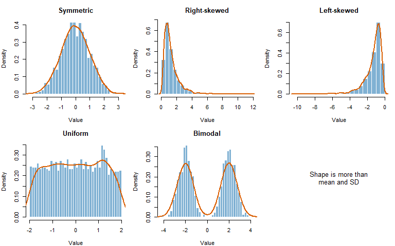
<p class="caption">

Illustrative symmetric, right-skewed, left-skewed, uniform and bimodal
distributions.
</p>

</div>

``` r
par(mfrow = c(1, 1))
```

# 5. Discrete, Bounded and Zero-Inflated Data

Not every variable is continuous or bell-shaped.

## 5.1 Discrete data

Counts take separated values such as 0, 1, 2 and 3. Examples include
mutation counts, colony counts and number of hospital visits.

## 5.2 Bounded data

Some variables cannot cross fixed limits:

- proportions lie between 0 and 1;
- percentages lie between 0 and 100;
- quality scores may have a fixed scale;
- non-negative concentrations cannot be less than zero.

Boundaries can create skewness and prevent a normal distribution even
when no data error exists.

## 5.3 Zero-inflated data

A zero-inflated variable contains more zeros than a simple count model
would predict. Possible reasons include:

- true biological absence;
- values below detection;
- structural zeros from study design;
- dropout or technical failure; or
- a mixture of zero-generating and count-generating processes.

``` r
set.seed(202)

microbial_abundance <- ifelse(
  rbinom(500, size = 1, prob = 0.45) == 1,
  0,
  rnbinom(500, mu = 8, size = 2)
)

barplot(
  table(microbial_abundance),
  col = "#66C2A5",
  border = NA,
  xlab = "Observed microbial count",
  ylab = "Frequency",
  main = "Zero-inflated count distribution"
)
```

<div class="figure" style="text-align: center">

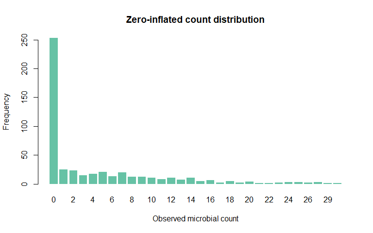
<p class="caption">

A simulated microbial-abundance variable contains a large spike at zero
and a right-skewed positive component.
</p>

</div>

The zeros should not be changed to missing values without understanding
what they represent.

# 6. Censoring, Truncation and Detection Limits

## 6.1 Censoring

A value is **censored** when we know it lies beyond a limit but do not
know its exact value.

Example: an assay reports “below 0.2 ng/mL.” The true value is not
necessarily zero; it is somewhere below 0.2.

## 6.2 Truncation

Data are **truncated** when observations outside a range cannot enter
the dataset at all.

Example: a study enrolling only adults aged 18–65 has a truncated age
distribution relative to all adults.

## 6.3 Ceiling and floor effects

A **ceiling effect** occurs when many observations accumulate at the
maximum measurable score. A **floor effect** occurs at the minimum.

Replacing all below-detection values with zero or half the detection
limit is a modeling decision, not neutral data cleaning. The appropriate
approach depends on the amount and mechanism of censoring.

# 7. Histograms: Shape Depends on Bins

A histogram is often the first tool for examining continuous data.
However, its appearance depends on class width and boundary placement.

``` r
set.seed(303)
biomarker_example <- c(
  rlnorm(180, meanlog = log(4), sdlog = 0.45),
  rlnorm(20, meanlog = log(12), sdlog = 0.25)
)

par(mfrow = c(1, 3), mar = c(4, 4, 3, 1))

hist(biomarker_example, breaks = 6, col = "#B3CDE3", border = "white",
     main = "6 bins", xlab = "Biomarker")
hist(biomarker_example, breaks = 18, col = "#80B1D3", border = "white",
     main = "18 bins", xlab = "Biomarker")
hist(biomarker_example, breaks = "FD", col = "#377EB8", border = "white",
     main = "Freedman-Diaconis", xlab = "Biomarker")
```

<div class="figure" style="text-align: center">

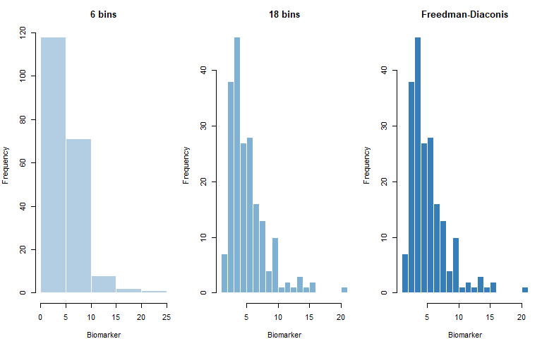
<p class="caption">

The same biomarker data can look different under different histogram bin
choices.
</p>

</div>

``` r
par(mfrow = c(1, 1))
```

During exploration, inspect multiple reasonable bin widths. Do not
choose bins solely because they support a preferred story.

# 8. Density Plots

A kernel density plot gives a smoothed representation of a continuous
distribution.

``` r
d_default <- density(biomarker_example)
d_narrow <- density(biomarker_example, adjust = 0.5)
d_wide <- density(biomarker_example, adjust = 2)

plot(d_default, lwd = 3, col = "#377EB8",
     xlab = "Biomarker", main = "Effect of density bandwidth")
lines(d_narrow, lwd = 2, col = "#D95F02", lty = 2)
lines(d_wide, lwd = 2, col = "#1B9E77", lty = 3)
legend(
  "topright",
  legend = c("Default", "Narrower", "Wider"),
  col = c("#377EB8", "#D95F02", "#1B9E77"),
  lwd = c(3, 2, 2),
  lty = c(1, 2, 3),
  bty = "n"
)
```

<div class="figure" style="text-align: center">

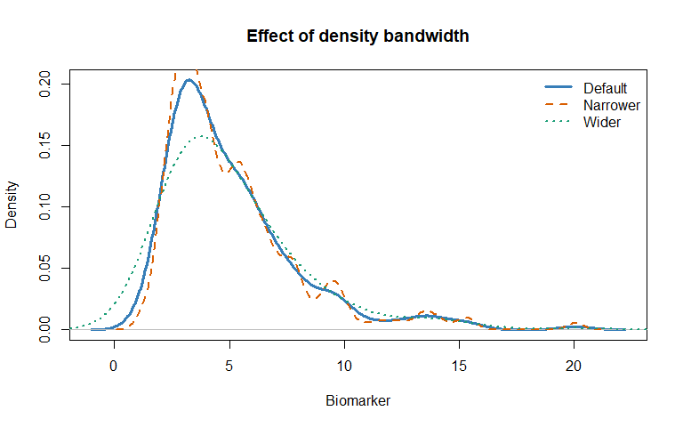
<p class="caption">

Density estimates depend on the smoothing bandwidth.
</p>

</div>

Too little smoothing creates artificial bumps. Too much smoothing can
hide real subgroups. A density plot is an estimate, not the raw data.

For small samples, show individual points rather than relying on a
smooth curve.

# 9. ECDFs: Shape Without Bins

The empirical cumulative distribution function, or ECDF, shows the
proportion of observations less than or equal to each value.

``` r
plot(
  ecdf(biomarker_example),
  col = "#7570B3",
  lwd = 2,
  xlab = "Biomarker",
  ylab = "Cumulative proportion",
  main = "Empirical cumulative distribution"
)
```

<div class="figure" style="text-align: center">

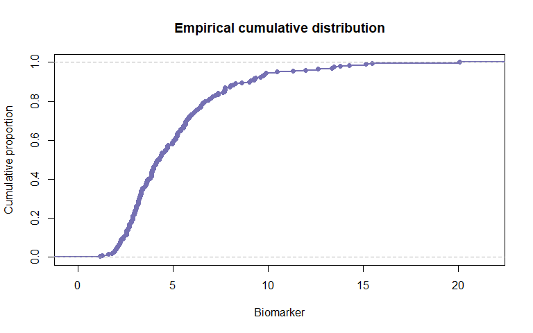
<p class="caption">

An ECDF shows every observed step and requires no bin or bandwidth.
</p>

</div>

ECDFs are useful for comparing groups, reading medians and percentiles,
and detecting shifts or tail differences.

# 10. Boxplots and Individual Points

Boxplots compactly display median, IQR, whiskers and potential outliers.
They can hide sample size, multiple modes and raw-value clustering.

``` r
set.seed(404)

box_data <- data.frame(
  Group = rep(c("Control", "Case"), each = 50),
  Value = c(
    rnorm(50, mean = 5, sd = 1),
    c(rnorm(45, mean = 6, sd = 1.2),
      rnorm(5, mean = 12, sd = 0.5))
  ),
  stringsAsFactors = FALSE
)

boxplot(
  Value ~ Group,
  data = box_data,
  col = c("#66C2A5", "#FC8D62"),
  outline = FALSE,
  ylab = "Biomarker value",
  main = "Boxplot with observed values"
)

stripchart(
  Value ~ Group,
  data = box_data,
  vertical = TRUE,
  method = "jitter",
  pch = 19,
  col = rgb(0, 0, 0, 0.45),
  add = TRUE
)
```

<div class="figure" style="text-align: center">

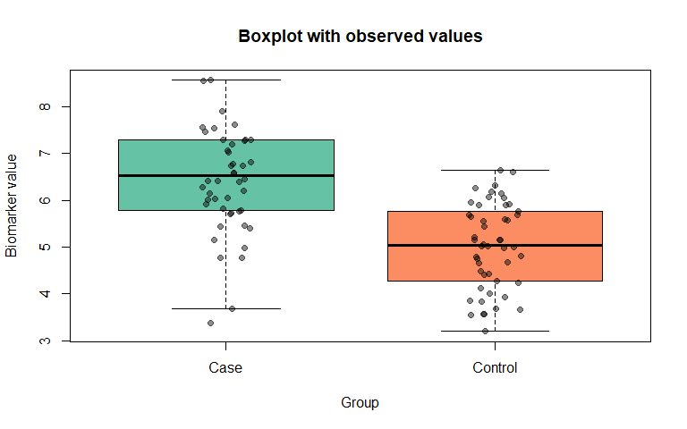
<p class="caption">

Overlaying points prevents a boxplot from hiding the sample
distribution.
</p>

</div>

No single plot is always sufficient. Histograms, ECDFs, boxplots and raw
points emphasize different features.

# 11. Symmetry and Skewness

**Skewness** quantifies asymmetry.

- Skewness near 0 suggests approximate symmetry.
- Positive skewness suggests a longer or heavier right tail.
- Negative skewness suggests a longer or heavier left tail.

A simple moment coefficient is:

$$g_1 = \frac{m_3}{m_2^{3/2}},$$

where:

$$m_k = \frac{1}{n}\sum_{i=1}^{n}(x_i-\bar{x})^k.$$

``` r
moment_skewness <- function(x, na.rm = TRUE) {
  if (na.rm) {
    x <- x[!is.na(x)]
  }

  if (length(x) < 3) {
    return(NA_real_)
  }

  centred <- x - mean(x)
  m2 <- mean(centred^2)
  m3 <- mean(centred^3)

  if (m2 == 0) {
    return(NA_real_)
  }

  m3 / m2^(3 / 2)
}
```

``` r
skewness_summary <- data.frame(
  Distribution = c("Symmetric", "Right-skewed", "Left-skewed"),
  Moment_skewness = round(c(
    moment_skewness(shape_data$Symmetric),
    moment_skewness(shape_data$`Right-skewed`),
    moment_skewness(shape_data$`Left-skewed`)
  ), 3),
  stringsAsFactors = FALSE
)

skewness_summary
```

<div class="kable-table">

| Distribution | Moment_skewness |
|:-------------|----------------:|
| Symmetric    |          -0.019 |
| Right-skewed |           2.680 |
| Left-skewed  |          -2.476 |

</div>

Different software packages use different small-sample corrections.
Always state the estimator or package when exact values matter.

## 11.1 Skewness is not a complete description

A skewness value near zero can occur in a symmetric normal distribution,
a symmetric bimodal distribution or a symmetric heavy-tailed
distribution. Always inspect a plot.

# 12. Kurtosis and Tail Weight

The fourth standardized moment is:

$$\frac{m_4}{m_2^2}.$$

The normal distribution has a value of 3. **Excess kurtosis** subtracts
3:

$$g_2 = \frac{m_4}{m_2^2} - 3.$$

``` r
moment_excess_kurtosis <- function(x, na.rm = TRUE) {
  if (na.rm) {
    x <- x[!is.na(x)]
  }

  if (length(x) < 4) {
    return(NA_real_)
  }

  centred <- x - mean(x)
  m2 <- mean(centred^2)
  m4 <- mean(centred^4)

  if (m2 == 0) {
    return(NA_real_)
  }

  m4 / m2^2 - 3
}
```

``` r
set.seed(505)
normal_tail <- rnorm(5000)
heavy_tail <- rt(5000, df = 4)
light_tail <- runif(5000, min = -sqrt(3), max = sqrt(3))

data.frame(
  Distribution = c("Normal", "Heavy-tailed t", "Uniform"),
  Excess_kurtosis = round(c(
    moment_excess_kurtosis(normal_tail),
    moment_excess_kurtosis(heavy_tail),
    moment_excess_kurtosis(light_tail)
  ), 3),
  stringsAsFactors = FALSE
)
```

<div class="kable-table">

| Distribution   | Excess_kurtosis |
|:---------------|----------------:|
| Normal         |           0.008 |
| Heavy-tailed t |          15.299 |
| Uniform        |          -1.163 |

</div>

High kurtosis mainly indicates greater tail extremity and outlier
propensity relative to a normal distribution. Describing kurtosis only
as “peakedness” is incomplete and can be misleading.

Like skewness, kurtosis is unstable in small samples and can be
dominated by a few observations.

# 13. Modality and Mixtures

A mode is a peak in a distribution. Multiple peaks may arise from a
mixture of groups.

``` r
set.seed(606)

mixture_data <- data.frame(
  Group = rep(c("Subgroup 1", "Subgroup 2"), each = 150),
  Measurement = c(
    rnorm(150, mean = 5, sd = 0.8),
    rnorm(150, mean = 9, sd = 0.8)
  ),
  stringsAsFactors = FALSE
)

hist(
  mixture_data$Measurement,
  breaks = 25,
  probability = TRUE,
  col = "grey85",
  border = "white",
  xlab = "Measurement",
  main = "A pooled mixture"
)

for (g in unique(mixture_data$Group)) {
  values <- mixture_data$Measurement[mixture_data$Group == g]
  lines(
    density(values),
    col = if (g == "Subgroup 1") "#1B9E77" else "#D95F02",
    lwd = 3
  )
}

legend(
  "topright",
  legend = c("Subgroup 1", "Subgroup 2"),
  col = c("#1B9E77", "#D95F02"),
  lwd = 3,
  bty = "n"
)
```

<div class="figure" style="text-align: center">

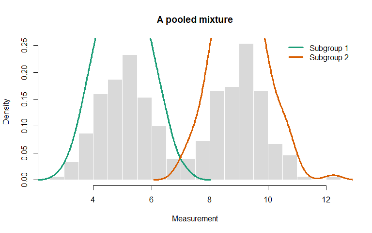
<p class="caption">

Pooling two subgroups can create a bimodal distribution that neither
subgroup has alone.
</p>

</div>

Do not summarize an unexplained bimodal distribution with only one mean
and SD. First ask what creates the subgroups.

# 14. Heavy Tails Versus Individual Outliers

A heavy-tailed distribution naturally produces more extreme observations
than a normal distribution. A point that appears unusual under a normal
model may be expected under a heavy-tailed model.

``` r
set.seed(707)

normal_sample <- rnorm(1000)
t_sample <- rt(1000, df = 3)

normal_z <- as.numeric(scale(normal_sample))
t_z <- as.numeric(scale(t_sample))

extreme_counts <- data.frame(
  Distribution = c("Normal", "Heavy-tailed t"),
  Absolute_z_over_3 = c(sum(abs(normal_z) > 3),
                        sum(abs(t_z) > 3)),
  stringsAsFactors = FALSE
)

extreme_counts
```

<div class="kable-table">

| Distribution   | Absolute_z_over_3 |
|:---------------|------------------:|
| Normal         |                 3 |
| Heavy-tailed t |                19 |

</div>

``` r
boxplot(
  list(Normal = normal_z, `Heavy-tailed t` = t_z),
  col = c("#80B1D3", "#FC8D62"),
  ylab = "Standardized value",
  main = "Tail behavior after standardization",
  outline = TRUE
)
```

<div class="figure" style="text-align: center">

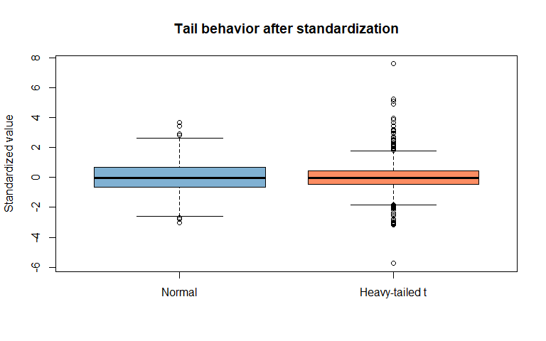
<p class="caption">

Heavy-tailed data produce more extreme standardized observations than
normal data.
</p>

</div>

Outlier rules are always relative to a reference distribution, group or
scientific expectation.

# 15. Q–Q Plots

A quantile–quantile plot compares sample quantiles with theoretical
quantiles from a reference distribution, commonly the normal
distribution.

If data are approximately normal, points in a normal Q–Q plot should lie
near a straight line.

``` r
set.seed(808)

qq_normal <- rnorm(200)
qq_skewed <- rlnorm(200, sdlog = 0.7)
qq_heavy <- rt(200, df = 3)

par(mfrow = c(1, 3), mar = c(4, 4, 3, 1))

qqnorm(qq_normal, main = "Approximately normal",
       pch = 19, col = rgb(0.12, 0.47, 0.71, 0.55))
qqline(qq_normal, col = "#D95F02", lwd = 2)

qqnorm(qq_skewed, main = "Right-skewed",
       pch = 19, col = rgb(0.10, 0.60, 0.35, 0.55))
qqline(qq_skewed, col = "#D95F02", lwd = 2)

qqnorm(qq_heavy, main = "Heavy-tailed",
       pch = 19, col = rgb(0.84, 0.15, 0.16, 0.50))
qqline(qq_heavy, col = "#D95F02", lwd = 2)
```

<div class="figure" style="text-align: center">

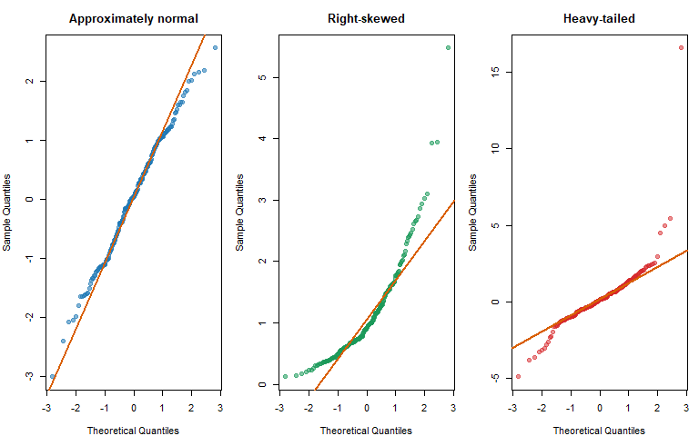
<p class="caption">

Normal, skewed and heavy-tailed data create different patterns in normal
Q–Q plots.
</p>

</div>

``` r
par(mfrow = c(1, 1))
```

Interpret common patterns cautiously:

- systematic curvature suggests skewness;
- strong tail departures suggest tail differences;
- a few isolated tail points may be unusual observations;
- step patterns can occur with rounded or discrete values.

A Q–Q plot does not require that every point sit perfectly on the line.

# 16. Normality Tests

The Shapiro–Wilk test evaluates the null hypothesis that data are
normally distributed.

``` r
set.seed(909)

normal_test_data <- rnorm(100)
skewed_test_data <- rlnorm(100, sdlog = 0.8)

shapiro_normal <- shapiro.test(normal_test_data)
shapiro_skewed <- shapiro.test(skewed_test_data)

data.frame(
  Dataset = c("Simulated normal", "Simulated skewed"),
  W = round(c(unname(shapiro_normal$statistic),
              unname(shapiro_skewed$statistic)), 4),
  P_value = c(shapiro_normal$p.value,
              shapiro_skewed$p.value),
  stringsAsFactors = FALSE
)
```

<div class="kable-table">

| Dataset          |      W |   P_value |
|:-----------------|-------:|----------:|
| Simulated normal | 0.9850 | 0.3199884 |
| Simulated skewed | 0.7202 | 0.0000000 |

</div>

## 16.1 Why p-values are not enough

- In small samples, the test may miss important non-normality.
- In large samples, it may detect tiny, scientifically unimportant
  departures.
- Many statistical methods require approximately normal **residuals**,
  not a normally distributed raw outcome.
- Some methods are robust to moderate departures.
- Count, binary and survival outcomes are not expected to be normally
  distributed.

R’s `shapiro.test()` accepts 3 to 5,000 non-missing observations. Use
plots, study design and model context together with any formal test.

# 17. What Is an Outlier?

An **outlier** is an observation that is unusually distant from a
reference pattern.

That definition requires three questions:

1.  Unusual relative to what group or model?
2.  Unusual on which variable or combination of variables?
3.  Unusual for what scientific purpose?

An adult height of 120 cm may be unusual in a general adult sample but
expected in a study of a particular skeletal dysplasia. A
sequencing-depth value may be acceptable for variant calling but
inadequate for rare-variant detection.

# 18. Types of Unusual Observations

| Type | Example | Possible action |
|----|----|----|
| Data-entry error | Decimal point entered incorrectly | Verify and correct from source |
| Unit error | mg/L mixed with µg/L | Harmonize units if recoverable |
| Impossible value | Negative age | Correct or set missing with documentation |
| Sample misidentification | Sex-check or genotype mismatch | Investigate identity and chain of custody |
| Technical failure | Low mapping rate from degraded RNA | Apply prespecified QC rule |
| Valid biological extreme | Very high cytokine in severe inflammation | Usually retain and model appropriately |
| Different population | Ancestry cluster outside target population | Revisit target population and analysis plan |
| Influential design point | Rare exposure combination | Diagnose influence; do not delete automatically |

The correct response depends on cause, not merely numerical distance.

# 19. Global, Group-Specific and Conditional Outliers

## 19.1 Global outlier

A value is unusual relative to the entire dataset.

## 19.2 Group-specific outlier

A value may be ordinary globally but unusual within its biological
group.

## 19.3 Conditional outlier

A value may be unusual after accounting for another variable. A heart
rate of 160 may be expected during intense exercise but unusual at rest.

``` r
set.seed(1001)

conditional_data <- data.frame(
  Group = rep(c("Low-dose", "High-dose"), each = 50),
  Response = c(
    c(rnorm(49, mean = 5, sd = 0.5), 8),
    rnorm(50, mean = 10, sd = 0.8)
  ),
  stringsAsFactors = FALSE
)

boxplot(
  Response ~ Group,
  data = conditional_data,
  col = c("#66C2A5", "#FC8D62"),
  ylab = "Response",
  main = "Outlier status depends on the reference group"
)
```

<div class="figure" style="text-align: center">

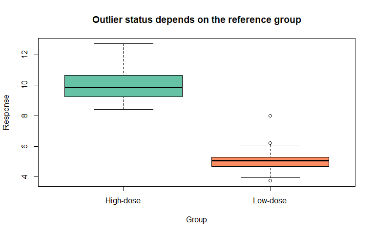
<p class="caption">

A value may look ordinary globally but unusual within its own group.
</p>

</div>

The value 8 is not extreme relative to all observations, but it is high
relative to the low-dose group.

# 20. The IQR Outlier Rule

A common descriptive rule flags values below:

$$Q_1 - 1.5(IQR)$$

or above:

$$Q_3 + 1.5(IQR).$$

``` r
iqr_outlier_flags <- function(x, multiplier = 1.5, na.rm = TRUE) {
  observed <- if (na.rm) x[!is.na(x)] else x
  q1 <- quantile(observed, 0.25, names = FALSE)
  q3 <- quantile(observed, 0.75, names = FALSE)
  iqr_value <- q3 - q1

  lower <- q1 - multiplier * iqr_value
  upper <- q3 + multiplier * iqr_value

  flags <- x < lower | x > upper

  list(
    lower_fence = lower,
    upper_fence = upper,
    flag = flags
  )
}
```

``` r
outlier_values <- c(10, 11, 11, 12, 12, 13, 13, 14, 35)
iqr_result <- iqr_outlier_flags(outlier_values)

data.frame(
  Value = outlier_values,
  IQR_flag = iqr_result$flag
)
```

<div class="kable-table">

| Value | IQR_flag |
|------:|:---------|
|    10 | FALSE    |
|    11 | FALSE    |
|    11 | FALSE    |
|    12 | FALSE    |
|    12 | FALSE    |
|    13 | FALSE    |
|    13 | FALSE    |
|    14 | FALSE    |
|    35 | TRUE     |

</div>

``` r
data.frame(
  Lower_fence = iqr_result$lower_fence,
  Upper_fence = iqr_result$upper_fence
)
```

<div class="kable-table">

| Lower_fence | Upper_fence |
|------------:|------------:|
|           8 |          16 |

</div>

The 1.5-IQR rule is a screening convention. It is not a biological law
or formal proof of contamination.

# 21. Z-Score Rule

A z-score is:

$$z_i = \frac{x_i-\bar{x}}{s}.$$

A common rule flags $|z|>3$.

``` r
z_values <- as.numeric(scale(outlier_values))

data.frame(
  Value = outlier_values,
  Z_score = round(z_values, 3),
  Z_over_3 = abs(z_values) > 3
)
```

<div class="kable-table">

| Value | Z_score | Z_over_3 |
|------:|--------:|:---------|
|    10 |  -0.587 | FALSE    |
|    11 |  -0.458 | FALSE    |
|    11 |  -0.458 | FALSE    |
|    12 |  -0.329 | FALSE    |
|    12 |  -0.329 | FALSE    |
|    13 |  -0.200 | FALSE    |
|    13 |  -0.200 | FALSE    |
|    14 |  -0.072 | FALSE    |
|    35 |   2.633 | FALSE    |

</div>

The mean and SD are themselves sensitive to outliers. An extreme value
can pull the mean and inflate the SD, making its own z-score less
extreme. This is one form of **masking**.

The $|z|>3$ rule is most interpretable for approximately normal data. It
is inappropriate as a universal filter for skewed counts or bounded
variables.

# 22. Robust Z-Scores Using the MAD

A robust standardized score can use the median and raw MAD:

$$z_i^{*} = 0.6745\frac{x_i-\operatorname{median}(x)}{MAD_{raw}}.$$

The constant makes the scale approximately comparable to an ordinary
z-score for normal data.

``` r
robust_z_score <- function(x, na.rm = TRUE) {
  observed <- if (na.rm) x[!is.na(x)] else x
  centre <- median(observed)
  raw_mad <- mad(observed, constant = 1)

  if (raw_mad == 0) {
    return(rep(NA_real_, length(x)))
  }

  0.67448975 * (x - centre) / raw_mad
}
```

``` r
robust_z <- robust_z_score(outlier_values)

data.frame(
  Value = outlier_values,
  Ordinary_z = round(z_values, 3),
  Robust_z = round(robust_z, 3),
  Absolute_robust_z_over_3_5 = abs(robust_z) > 3.5
)
```

<div class="kable-table">

| Value | Ordinary_z | Robust_z | Absolute_robust_z_over_3_5 |
|------:|-----------:|---------:|:---------------------------|
|    10 |     -0.587 |   -1.349 | FALSE                      |
|    11 |     -0.458 |   -0.674 | FALSE                      |
|    11 |     -0.458 |   -0.674 | FALSE                      |
|    12 |     -0.329 |    0.000 | FALSE                      |
|    12 |     -0.329 |    0.000 | FALSE                      |
|    13 |     -0.200 |    0.674 | FALSE                      |
|    13 |     -0.200 |    0.674 | FALSE                      |
|    14 |     -0.072 |    1.349 | FALSE                      |
|    35 |      2.633 |   15.513 | TRUE                       |

</div>

The commonly cited $|z^*|>3.5$ threshold is another screening rule, not
an automatic exclusion rule.

If more than half the observations equal the same value, raw MAD may be
zero. A different method or direct understanding of the discrete
distribution is then needed.

# 23. Comparing Detection Rules

``` r
comparison_data <- c(8, 9, 10, 10, 10, 11, 11, 12, 18, 35)

iqr_check <- iqr_outlier_flags(comparison_data)
ordinary_z <- as.numeric(scale(comparison_data))
robust_z <- robust_z_score(comparison_data)

detection_table <- data.frame(
  Value = comparison_data,
  IQR_flag = iqr_check$flag,
  Z_over_3 = abs(ordinary_z) > 3,
  Robust_z_over_3_5 = abs(robust_z) > 3.5
)

detection_table
```

<div class="kable-table">

| Value | IQR_flag | Z_over_3 | Robust_z_over_3_5 |
|------:|:---------|:---------|:------------------|
|     8 | FALSE    | FALSE    | FALSE             |
|     9 | FALSE    | FALSE    | FALSE             |
|    10 | FALSE    | FALSE    | FALSE             |
|    10 | FALSE    | FALSE    | FALSE             |
|    10 | FALSE    | FALSE    | FALSE             |
|    11 | FALSE    | FALSE    | FALSE             |
|    11 | FALSE    | FALSE    | FALSE             |
|    12 | FALSE    | FALSE    | FALSE             |
|    18 | TRUE     | FALSE    | TRUE              |
|    35 | TRUE     | FALSE    | TRUE              |

</div>

Different rules can flag different observations because they make
different assumptions and use different centres and scales. Agreement
does not prove an error; disagreement does not mean one rule failed.

# 24. Masking and Swamping

**Masking** occurs when multiple extreme observations influence the
centre and spread enough that they fail to flag one another.

**Swamping** occurs when non-outlying observations are incorrectly
flagged because estimates are distorted by other unusual points or the
assumed model is wrong.

``` r
core_values <- c(9, 10, 10, 10, 11, 11, 12)
masked_values <- c(core_values, 30, 32, 34)

data.frame(
  Value = masked_values,
  Ordinary_z = round(as.numeric(scale(masked_values)), 2),
  Robust_z = round(robust_z_score(masked_values), 2)
)
```

<div class="kable-table">

| Value | Ordinary_z | Robust_z |
|------:|-----------:|---------:|
|     9 |      -0.75 |    -1.35 |
|    10 |      -0.66 |    -0.67 |
|    10 |      -0.66 |    -0.67 |
|    10 |      -0.66 |    -0.67 |
|    11 |      -0.56 |     0.00 |
|    11 |      -0.56 |     0.00 |
|    12 |      -0.47 |     0.67 |
|    30 |       1.25 |    12.82 |
|    32 |       1.44 |    14.16 |
|    34 |       1.63 |    15.51 |

</div>

Sequentially deleting the most extreme value and recomputing rules can
inflate false exclusions unless the procedure is formally defined.
Investigation and robust modeling are safer than repeated ad hoc
trimming.

# 25. Outlier Versus Influential Observation

An outlier is unusual in an outcome or data space. An **influential
observation** changes an estimate or model substantially when included.

An observation can be:

- unusual but not influential;
- influential without being far from the main outcome distribution; or
- both unusual and influential.

## 25.1 Leave-one-out influence on a mean

``` r
influence_values <- c(9, 10, 10, 11, 12, 40)
full_mean <- mean(influence_values)

leave_one_out_mean <- sapply(seq_along(influence_values), function(i) {
  mean(influence_values[-i])
})

data.frame(
  Observation = seq_along(influence_values),
  Value = influence_values,
  Full_mean = full_mean,
  Mean_without_observation = round(leave_one_out_mean, 2),
  Absolute_change = round(abs(leave_one_out_mean - full_mean), 2)
)
```

<div class="kable-table">

| Observation | Value | Full_mean | Mean_without_observation | Absolute_change |
|------------:|------:|----------:|-------------------------:|----------------:|
|           1 |     9 |  15.33333 |                     16.6 |            1.27 |
|           2 |    10 |  15.33333 |                     16.4 |            1.07 |
|           3 |    10 |  15.33333 |                     16.4 |            1.07 |
|           4 |    11 |  15.33333 |                     16.2 |            0.87 |
|           5 |    12 |  15.33333 |                     16.0 |            0.67 |
|           6 |    40 |  15.33333 |                     10.4 |            4.93 |

</div>

The value 40 has much greater influence on the mean than the other
observations. Regression influence diagnostics such as leverage,
standardized residuals and Cook’s distance will be covered later.

# 26. Multivariate Outliers

A sample may look ordinary on every single variable but unusual in
combination.

Example: a person may have individually plausible height and weight but
an unusual height–weight combination. A sequencing sample may have
acceptable depth and mapping rate separately but an unusual joint QC
profile.

``` r
set.seed(1101)

x_multi <- rnorm(120)
y_multi <- 0.9 * x_multi + rnorm(120, sd = 0.3)
x_multi <- c(x_multi, 1.8)
y_multi <- c(y_multi, -1.8)

point_colours <- c(rep(rgb(0.12, 0.47, 0.71, 0.55), 120), "#D95F02")

plot(
  x_multi,
  y_multi,
  pch = 19,
  col = point_colours,
  xlab = "QC metric 1",
  ylab = "QC metric 2",
  main = "A multivariate outlier"
)
```

<div class="figure" style="text-align: center">

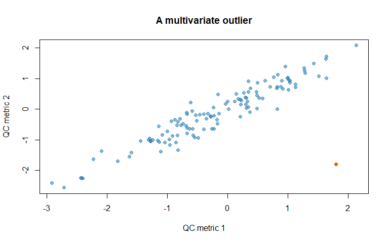
<p class="caption">

The highlighted sample is not extreme on either coordinate alone but is
unusual relative to their joint relationship.
</p>

</div>

Multivariate detection requires methods that account for covariance,
scale and dimension. Ordinary Euclidean distance can be misleading when
variables are correlated or have different units. Mahalanobis distance
and robust multivariate methods will be introduced later.

# 27. Transformations and Distribution Shape

Transformations can:

- reduce right skew;
- stabilize variance;
- make multiplicative relationships additive;
- improve visualization; and
- better match a statistical model.

They do not correct incorrect values or poor study design.

## 27.1 Log transformation

``` r
set.seed(1201)
positive_biomarker <- rlnorm(500, meanlog = log(5), sdlog = 0.85)

par(mfrow = c(1, 2), mar = c(4, 4, 3, 1))

hist(positive_biomarker, breaks = "FD", col = "#FC8D62",
     border = "white", main = "Original scale",
     xlab = "Biomarker")

hist(log(positive_biomarker), breaks = "FD", col = "#66C2A5",
     border = "white", main = "Natural-log scale",
     xlab = "log(Biomarker)")
```

<div class="figure" style="text-align: center">

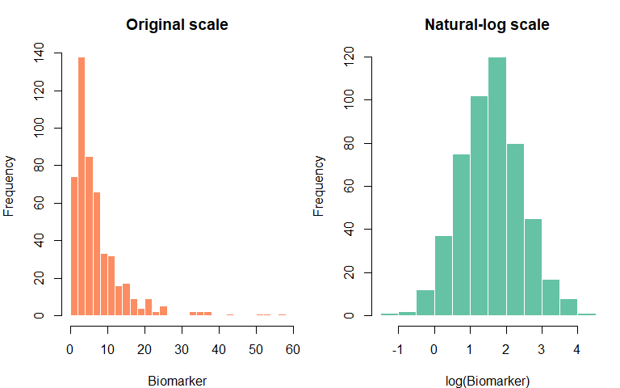
<p class="caption">

A log transformation makes the simulated positive biomarker more
symmetric.
</p>

</div>

``` r
par(mfrow = c(1, 1))
```

Log transformations require positive values. `log1p(x)` calculates
$\log(1+x)$ and is numerically stable near zero, but adding 1 changes
the scale and may be inappropriate for arbitrary units.

## 27.2 Square-root transformation

A square-root transformation can be useful for non-negative counts or
variance patterns, especially at modest counts.

``` r
count_values <- rpois(100, lambda = 9)

data.frame(
  Scale = c("Original counts", "Square-root counts"),
  Skewness = round(c(
    moment_skewness(count_values),
    moment_skewness(sqrt(count_values))
  ), 3),
  stringsAsFactors = FALSE
)
```

<div class="kable-table">

| Scale              | Skewness |
|:-------------------|---------:|
| Original counts    |    0.443 |
| Square-root counts |    0.112 |

</div>

## 27.3 Rank transformation

Ranks retain order but discard original distances. They may be useful in
some nonparametric analyses but change the estimand and biological
interpretation.

## 27.4 Box–Cox and Yeo–Johnson families

Box–Cox transformations select from a family of powers for positive
data. Yeo–Johnson transformations can accommodate zero and negative
values. These are more advanced tools; transformation choice should be
made within a complete modeling strategy, not as an automatic normality
repair.

# 28. Transforming Outliers Does Not Decide Their Validity

A log transformation can visually compress a large valid observation. It
can also compress a data-entry error. The transformed plot does not
reveal which is which.

Always investigate:

- original value;
- original unit;
- specimen identity;
- assay flags;
- batch and plate position;
- raw data or source record; and
- biological context.

# 29. Outliers in Genome-Wide Association Study QC

Sample-level GWAS QC commonly examines:

- genotype missingness;
- autosomal heterozygosity;
- reported-versus-genetic sex checks;
- relatedness;
- ancestry principal components; and
- batch or array effects.

## 29.1 Heterozygosity outliers

Extreme heterozygosity may reflect contamination, inbreeding, technical
problems or true population structure. Detection should usually account
for ancestry and missingness.

``` r
set.seed(1301)

het_data <- data.frame(
  Sample = sprintf("G%03d", 1:200),
  Heterozygosity = rnorm(200, mean = 0.235, sd = 0.008),
  stringsAsFactors = FALSE
)

het_data$Heterozygosity[c(44, 173)] <- c(0.185, 0.285)
het_data$Z <- as.numeric(scale(het_data$Heterozygosity))
het_data$Flag <- abs(het_data$Z) > 3

plot(
  seq_len(nrow(het_data)),
  het_data$Heterozygosity,
  pch = 19,
  col = ifelse(het_data$Flag, "#D95F02", rgb(0.12, 0.47, 0.71, 0.50)),
  xlab = "Sample index",
  ylab = "Autosomal heterozygosity",
  main = "Heterozygosity screening"
)
abline(h = mean(het_data$Heterozygosity) + c(-3, 3) *
         sd(het_data$Heterozygosity),
       lty = 2, col = "grey35")
```

<div class="figure" style="text-align: center">

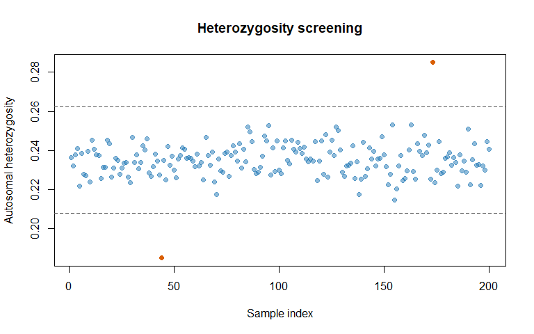
<p class="caption">

Simulated heterozygosity QC values with two samples requiring
investigation.
</p>

</div>

A universal $\pm 3$ SD threshold is not sufficient for every cohort.
Population structure can broaden or split the distribution, and robust
or ancestry-stratified approaches may be needed.

## 29.2 Principal-component ancestry context

A sample separated on genetic principal components may be a valid person
from a different ancestry, not a poor-quality genotype. Whether to
exclude, stratify, adjust or broaden the target population is a
scientific design decision.

``` r
set.seed(1302)

pca_data <- data.frame(
  Population = rep(c("Reference A", "Reference B", "Study"),
                   c(80, 80, 60)),
  PC1 = c(rnorm(80, -3, 0.5), rnorm(80, 3, 0.5),
          c(rnorm(50, -2.7, 0.6), rnorm(10, 2.7, 0.6))),
  PC2 = c(rnorm(80, 0, 0.6), rnorm(80, 1.5, 0.6),
          c(rnorm(50, 0.1, 0.7), rnorm(10, 1.4, 0.7))),
  stringsAsFactors = FALSE
)

population_colours <- c(
  `Reference A` = "#1B9E77",
  `Reference B` = "#7570B3",
  Study = "#D95F02"
)

plot(
  pca_data$PC1,
  pca_data$PC2,
  pch = 19,
  col = population_colours[pca_data$Population],
  xlab = "Genetic PC1",
  ylab = "Genetic PC2",
  main = "Ancestry structure in principal components"
)
legend(
  "topleft",
  legend = names(population_colours),
  col = population_colours,
  pch = 19,
  bty = "n"
)
```

<div class="figure" style="text-align: center">

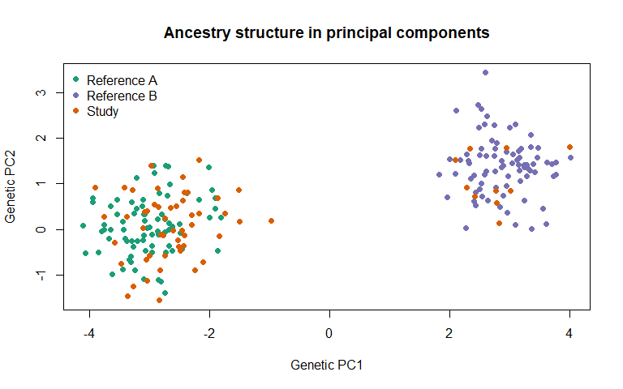
<p class="caption">

Separate PCA clusters can represent population structure rather than
erroneous samples.
</p>

</div>

# 30. Outliers in RNA-seq and Other Omics Data

Useful sample-level checks include:

- total library size;
- mapping percentage;
- duplication rate;
- RNA integrity;
- detected genes;
- mitochondrial-read percentage;
- sample–sample correlation;
- PCA or multidimensional scaling; and
- known batch and clinical variables.

A PCA-separated RNA-seq sample may reflect:

- sample swap;
- degraded RNA;
- batch effect;
- tissue mixture;
- strong biological response;
- rare cell composition; or
- incorrect metadata.

No single QC metric should be interpreted without the others.

# 31. An Outlier Investigation Workflow

For each flagged observation:

1.  **Confirm identity.** Check sample ID, participant ID and metadata
    joins.
2.  **Check units and data entry.** Compare source records and
    laboratory files.
3.  **Inspect raw and processed data.** Review chromatograms, read
    metrics, genotype calls or assay flags.
4.  **Check design context.** Examine batch, plate, centre, tissue,
    ancestry and group.
5.  **Assess multivariate pattern.** Determine whether several QC
    metrics agree.
6.  **Classify the issue.** Error, technical failure, valid extreme,
    subgroup or unresolved.
7.  **Apply prespecified rules.** Use protocol thresholds when
    available.
8.  **Choose an analysis response.** Correct, exclude, retain,
    transform, stratify or use a robust model.
9.  **Run sensitivity analysis.** Compare conclusions with justified
    alternatives.
10. **Document everything.** Preserve original value, flag, evidence,
    decision and responsible reviewer.

# 32. What Should We Do With an Outlier?

| Finding | Defensible response |
|----|----|
| Verified entry error with source value | Correct it and keep an audit trail |
| Impossible value without recoverable source | Set missing or exclude that measurement with reason |
| Prespecified assay failure | Exclude according to the QC protocol |
| Valid rare biological value | Retain; use suitable summaries or models |
| Different but valid target subgroup | Stratify, adjust, redefine scope or report separately |
| Uncertain cause | Retain in primary analysis when appropriate and perform sensitivity analysis |
| Strong influence on result | Report influence and compare justified analyses |

## 32.1 Practices to avoid

- deleting values only because they reduce statistical significance;
- selecting a threshold after viewing the desired result;
- silently replacing extreme values;
- calling every boxplot point erroneous;
- running repeated exclusion until assumptions pass; and
- reporting only the analysis that supports the hypothesis.

# 33. Sensitivity Analysis

A **sensitivity analysis** evaluates whether a conclusion changes under
reasonable alternative decisions.

``` r
sensitivity_values <- c(9.2, 9.8, 10.1, 10.3, 10.5, 10.7, 11.0, 35.0)

iqr_sensitivity <- iqr_outlier_flags(sensitivity_values)
retained_values <- sensitivity_values[!iqr_sensitivity$flag]

sensitivity_summary <- data.frame(
  Analysis = c("All observations",
               "Exclude IQR-flagged observation",
               "All observations: median",
               "All observations: 10% trimmed mean"),
  Estimate = round(c(
    mean(sensitivity_values),
    mean(retained_values),
    median(sensitivity_values),
    mean(sensitivity_values, trim = 0.10)
  ), 2),
  stringsAsFactors = FALSE
)

sensitivity_summary
```

<div class="kable-table">

| Analysis                           | Estimate |
|:-----------------------------------|---------:|
| All observations                   |    13.32 |
| Exclude IQR-flagged observation    |    10.23 |
| All observations: median           |    10.40 |
| All observations: 10% trimmed mean |    13.32 |

</div>

The excluded analysis is not automatically better. Its scientific
legitimacy depends on why the observation was excluded. A sensitivity
table makes the dependence of conclusions transparent.

# 34. Winsorization and Trimming

**Trimming** removes a prespecified fraction from both tails before
estimating a centre.

**Winsorization** replaces tail values with chosen boundary values.

These can be useful robust procedures, but they are not data correction.
Keep the original data unchanged, document the rule and distinguish an
analysis transformation from a verified correction.

``` r
winsorize_values <- function(x, proportion = 0.05) {
  limits <- quantile(
    x,
    probs = c(proportion, 1 - proportion),
    names = FALSE
  )

  pmin(pmax(x, limits[1]), limits[2])
}

winsorized_sensitivity <- winsorize_values(
  sensitivity_values,
  proportion = 0.10
)

data.frame(
  Original = sensitivity_values,
  Winsorized = round(winsorized_sensitivity, 2)
)
```

<div class="kable-table">

| Original | Winsorized |
|---------:|-----------:|
|      9.2 |       9.62 |
|      9.8 |       9.80 |
|     10.1 |      10.10 |
|     10.3 |      10.30 |
|     10.5 |      10.50 |
|     10.7 |      10.70 |
|     11.0 |      11.00 |
|     35.0 |      18.20 |

</div>

# 35. Integrated Case Study: Multi-Metric Sequencing QC

## 35.1 Scientific setting

We simulate 180 germline sequencing samples with read depth, mapping
rate and heterozygosity. Four unusual observations are inserted
deliberately for teaching:

- very low depth;
- very low mapping rate;
- unusually high heterozygosity; and
- high but potentially valid read depth.

``` r
set.seed(1401)

n_qc <- 180

qc_data <- data.frame(
  Sample_ID = sprintf("SEQ%03d", 1:n_qc),
  Disease_group = sample(c("Control", "Case"), n_qc,
                         replace = TRUE),
  Batch = sample(paste0("Batch_", 1:4), n_qc,
                 replace = TRUE),
  Read_depth_millions = rlnorm(n_qc, meanlog = log(42), sdlog = 0.22),
  Mapping_percent = rnorm(n_qc, mean = 96.2, sd = 1.1),
  Heterozygosity = rnorm(n_qc, mean = 0.235, sd = 0.008),
  stringsAsFactors = FALSE
)

qc_data$Read_depth_millions[37] <- 2.5
qc_data$Mapping_percent[142] <- 45
qc_data$Heterozygosity[88] <- 0.31
qc_data$Read_depth_millions[175] <- 145

head(qc_data)
```

<div class="kable-table">

| Sample_ID | Disease_group | Batch | Read_depth_millions | Mapping_percent | Heterozygosity |
|:---|:---|:---|---:|---:|---:|
| SEQ001 | Case | Batch_4 | 46.69759 | 94.53943 | 0.2411351 |
| SEQ002 | Control | Batch_4 | 28.38414 | 98.01250 | 0.2392436 |
| SEQ003 | Case | Batch_1 | 34.85615 | 94.10864 | 0.2442599 |
| SEQ004 | Case | Batch_4 | 34.25374 | 96.09065 | 0.2336727 |
| SEQ005 | Control | Batch_2 | 28.00460 | 97.09502 | 0.2285451 |
| SEQ006 | Case | Batch_4 | 58.99614 | 94.50617 | 0.2446395 |

</div>

## 35.2 Examine each distribution

``` r
par(mfrow = c(1, 3), mar = c(4, 4, 3, 1))

hist(qc_data$Read_depth_millions, breaks = "FD",
     col = "#80B1D3", border = "white",
     xlab = "Millions of reads", main = "Read depth")

hist(qc_data$Mapping_percent, breaks = "FD",
     col = "#66C2A5", border = "white",
     xlab = "Mapping percentage", main = "Mapping rate")

hist(qc_data$Heterozygosity, breaks = "FD",
     col = "#FDB462", border = "white",
     xlab = "Heterozygosity", main = "Heterozygosity")
```

<div class="figure" style="text-align: center">

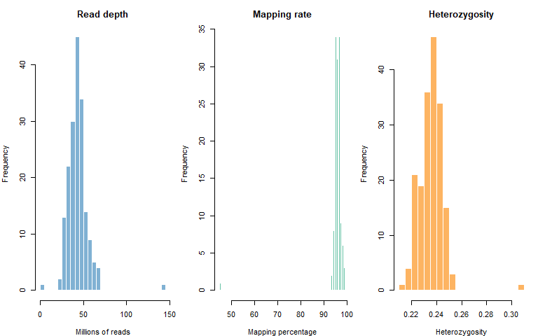
<p class="caption">

Each sequencing QC metric has a different scale and shape.
</p>

</div>

``` r
par(mfrow = c(1, 1))
```

## 35.3 Create an auditable flag table

``` r
depth_flag <- iqr_outlier_flags(qc_data$Read_depth_millions)$flag
mapping_flag <- iqr_outlier_flags(qc_data$Mapping_percent)$flag
heterozygosity_flag <- iqr_outlier_flags(qc_data$Heterozygosity)$flag

qc_data$Depth_IQR_flag <- depth_flag
qc_data$Mapping_IQR_flag <- mapping_flag
qc_data$Heterozygosity_IQR_flag <- heterozygosity_flag
qc_data$Any_IQR_flag <- depth_flag | mapping_flag | heterozygosity_flag

flagged_samples <- qc_data[
  qc_data$Any_IQR_flag,
  c("Sample_ID", "Disease_group", "Batch",
    "Read_depth_millions", "Mapping_percent", "Heterozygosity",
    "Depth_IQR_flag", "Mapping_IQR_flag", "Heterozygosity_IQR_flag")
]

flagged_samples$Read_depth_millions <- round(
  flagged_samples$Read_depth_millions, 2
)
flagged_samples$Mapping_percent <- round(
  flagged_samples$Mapping_percent, 2
)
flagged_samples$Heterozygosity <- round(
  flagged_samples$Heterozygosity, 4
)

flagged_samples
```

<div class="kable-table">

|  | Sample_ID | Disease_group | Batch | Read_depth_millions | Mapping_percent | Heterozygosity | Depth_IQR_flag | Mapping_IQR_flag | Heterozygosity_IQR_flag |
|:---|:---|:---|:---|---:|---:|---:|:---|:---|:---|
| 37 | SEQ037 | Case | Batch_3 | 2.50 | 96.52 | 0.2300 | TRUE | FALSE | FALSE |
| 60 | SEQ060 | Case | Batch_4 | 65.21 | 97.80 | 0.2400 | TRUE | FALSE | FALSE |
| 61 | SEQ061 | Control | Batch_1 | 66.95 | 95.35 | 0.2423 | TRUE | FALSE | FALSE |
| 88 | SEQ088 | Case | Batch_3 | 52.21 | 96.64 | 0.3100 | FALSE | FALSE | TRUE |
| 122 | SEQ122 | Control | Batch_4 | 66.88 | 97.45 | 0.2394 | TRUE | FALSE | FALSE |
| 126 | SEQ126 | Control | Batch_3 | 64.67 | 97.52 | 0.2337 | TRUE | FALSE | FALSE |
| 142 | SEQ142 | Control | Batch_3 | 31.07 | 45.00 | 0.2496 | FALSE | TRUE | FALSE |
| 164 | SEQ164 | Case | Batch_3 | 67.77 | 94.37 | 0.2316 | TRUE | FALSE | FALSE |
| 175 | SEQ175 | Case | Batch_2 | 145.00 | 95.38 | 0.2247 | TRUE | FALSE | FALSE |

</div>

Random simulation may flag additional ordinary tail observations. That
illustrates an important fact: a rule has false positives and does not
know which values were deliberately inserted.

## 35.4 Compare IQR and robust z-score flags

``` r
qc_data$Depth_robust_z <- robust_z_score(qc_data$Read_depth_millions)
qc_data$Mapping_robust_z <- robust_z_score(qc_data$Mapping_percent)
qc_data$Het_robust_z <- robust_z_score(qc_data$Heterozygosity)

method_summary <- data.frame(
  Metric = c("Read depth", "Mapping percent", "Heterozygosity"),
  IQR_flags = c(sum(depth_flag),
                sum(mapping_flag),
                sum(heterozygosity_flag)),
  Robust_z_flags = c(
    sum(abs(qc_data$Depth_robust_z) > 3.5, na.rm = TRUE),
    sum(abs(qc_data$Mapping_robust_z) > 3.5, na.rm = TRUE),
    sum(abs(qc_data$Het_robust_z) > 3.5, na.rm = TRUE)
  ),
  stringsAsFactors = FALSE
)

method_summary
```

<div class="kable-table">

| Metric          | IQR_flags | Robust_z_flags |
|:----------------|----------:|---------------:|
| Read depth      |         7 |              2 |
| Mapping percent |         1 |              1 |
| Heterozygosity  |         1 |              1 |

</div>

## 35.5 Add investigation decisions without changing raw data

``` r
investigation_log <- data.frame(
  Sample_ID = c("SEQ037", "SEQ088", "SEQ142", "SEQ175"),
  Issue = c("Very low read depth",
            "High heterozygosity",
            "Very low mapping percentage",
            "High read depth"),
  Evidence_to_check = c(
    "Library yield, sequencing run and target coverage",
    "Contamination, ancestry, inbreeding metric and sample identity",
    "Read quality, reference build, contamination and sample type",
    "Duplicate sequencing, design intent and library metadata"
  ),
  Decision = c("Pending", "Pending", "Pending", "Pending"),
  stringsAsFactors = FALSE
)

investigation_log
```

<div class="kable-table">

| Sample_ID | Issue | Evidence_to_check | Decision |
|:---|:---|:---|:---|
| SEQ037 | Very low read depth | Library yield, sequencing run and target coverage | Pending |
| SEQ088 | High heterozygosity | Contamination, ancestry, inbreeding metric and sample identity | Pending |
| SEQ142 | Very low mapping percentage | Read quality, reference build, contamination and sample type | Pending |
| SEQ175 | High read depth | Duplicate sequencing, design intent and library metadata | Pending |

</div>

The log separates statistical flagging from scientific decision-making.
A final analysis should update `Decision` with evidence and preserve the
reason.

## 35.6 Sensitivity analysis for mean read depth

``` r
all_depth <- qc_data$Read_depth_millions
depth_without_iqr_flags <- all_depth[!depth_flag]

data.frame(
  Analysis = c("Mean: all samples",
               "Median: all samples",
               "Mean: excluding IQR-flagged depth values",
               "10% trimmed mean: all samples"),
  Read_depth_millions = round(c(
    mean(all_depth),
    median(all_depth),
    mean(depth_without_iqr_flags),
    mean(all_depth, trim = 0.10)
  ), 2),
  stringsAsFactors = FALSE
)
```

<div class="kable-table">

| Analysis                                 | Read_depth_millions |
|:-----------------------------------------|--------------------:|
| Mean: all samples                        |               42.99 |
| Median: all samples                      |               41.40 |
| Mean: excluding IQR-flagged depth values |               41.96 |
| 10% trimmed mean: all samples            |               42.11 |

</div>

This table shows sensitivity of a summary, but exclusion still requires
a QC justification.

# 36. A Reusable Shape Summary Function

``` r
shape_summary <- function(x, na.rm = TRUE) {
  if (na.rm) {
    x <- x[!is.na(x)]
  }

  if (length(x) < 4) {
    return(data.frame(
      N = length(x), Mean = NA_real_, Median = NA_real_,
      SD = NA_real_, IQR = NA_real_, Skewness = NA_real_,
      Excess_kurtosis = NA_real_
    ))
  }

  data.frame(
    N = length(x),
    Mean = mean(x),
    Median = median(x),
    SD = sd(x),
    IQR = IQR(x),
    Skewness = moment_skewness(x),
    Excess_kurtosis = moment_excess_kurtosis(x)
  )
}

qc_shape <- rbind(
  cbind(Metric = "Read depth",
        shape_summary(qc_data$Read_depth_millions)),
  cbind(Metric = "Mapping percent",
        shape_summary(qc_data$Mapping_percent)),
  cbind(Metric = "Heterozygosity",
        shape_summary(qc_data$Heterozygosity))
)

numeric_columns <- c("Mean", "Median", "SD", "IQR",
                     "Skewness", "Excess_kurtosis")
qc_shape[numeric_columns] <- round(qc_shape[numeric_columns], 3)

qc_shape
```

<div class="kable-table">

| Metric          |   N |   Mean | Median |     SD |    IQR | Skewness | Excess_kurtosis |
|:----------------|----:|-------:|-------:|-------:|-------:|---------:|----------------:|
| Read depth      | 180 | 42.988 | 41.399 | 12.293 | 11.461 |    3.177 |          25.244 |
| Mapping percent | 180 | 95.645 | 95.873 |  3.946 |  1.487 |  -11.820 |         149.402 |
| Heterozygosity  | 180 |  0.236 |  0.236 |  0.010 |  0.011 |    2.237 |          16.661 |

</div>

This numerical table supplements, but does not replace, the plots and
audit trail.

# 37. Reproducible Outlier Reporting

A reproducible outlier report should include:

- dataset and version;
- date of assessment;
- analysis unit;
- variables screened;
- transformation and grouping;
- numerical rule and threshold;
- number flagged;
- sample identifiers;
- raw and processed values;
- laboratory or metadata evidence;
- classification of each issue;
- final decision and responsible reviewer;
- number excluded from each analysis; and
- sensitivity-analysis results.

Never overwrite raw values. Store corrections in a new version or new
variable with provenance.

# 38. Common Mistakes

## Mistake 1: Defining normality by histogram appearance alone

Histograms depend on bins. Use Q–Q plots and contextual reasoning as
well.

## Mistake 2: Treating skewness near zero as proof of normality

Symmetric bimodal and heavy-tailed distributions can also have near-zero
skewness.

## Mistake 3: Describing kurtosis only as peakedness

Kurtosis is strongly related to tail extremity and outlier propensity.

## Mistake 4: Applying a three-SD rule to every variable

Counts, proportions and skewed biomarkers may not follow a normal model.

## Mistake 5: Using one global threshold across biological subgroups

Group structure can create false flags or hide within-group outliers.

## Mistake 6: Deleting every boxplot point

The IQR fence is a descriptive screening rule.

## Mistake 7: Assuming a PCA-separated sample is poor quality

It may represent ancestry, tissue, batch or strong biology.

## Mistake 8: Transforming data without reporting the scale

Interpretation changes after transformation.

## Mistake 9: Choosing exclusions after seeing p-values

This creates researcher degrees of freedom and biased evidence.

## Mistake 10: Reporting only the cleaned analysis

Document exclusion counts, reasons and sensitivity results.

# 39. Practical Shape-and-Outlier Checklist

Before analysis, ask:

- What does one observation represent?
- Is the variable continuous, discrete, bounded or censored?
- Is the plotted scale original or transformed?
- Does the distribution have one peak or several?
- Is skewness caused by a natural boundary or mixture?
- Are tails heavier than the intended model expects?
- Is a flagged point unusual globally, within group or conditionally?
- Could batch, centre, tissue, ancestry or time explain it?
- Is the value possible in the stated unit?
- Do raw data and metadata support a technical problem?
- Does the point influence the scientific conclusion?
- Was the exclusion rule prespecified?
- Are results robust to defensible alternatives?
- Is every decision documented without altering raw data?

# 40. Chapter Summary

- Distribution shape includes symmetry, modality, tails, boundaries,
  gaps and unusual observations.
- A symmetric distribution is not necessarily normal.
- Right skew has a long right tail; left skew has a long left tail.
- Multiple peaks may signal biological subgroups, batches or mixtures.
- Discrete, bounded, censored and zero-inflated data require appropriate
  descriptions and models.
- Histogram shape depends on bins; density shape depends on bandwidth.
- ECDFs avoid bin and bandwidth choices.
- Q–Q plots compare observed with theoretical quantiles.
- Skewness measures asymmetry but cannot completely describe shape.
- Excess kurtosis reflects tail extremity relative to normality.
- Normality-test p-values depend strongly on sample size.
- An outlier is unusual relative to a defined reference pattern.
- Numerical outliers may be errors, failures, valid extremes or
  different subgroups.
- IQR, ordinary z-score and robust z-score rules make different
  assumptions.
- Masking can hide extreme values; swamping can incorrectly flag
  ordinary values.
- Outliers and influential observations are related but not identical.
- Multivariate outliers may appear ordinary on each variable separately.
- Transformations change scale but do not determine whether a value is
  valid.
- Genomics QC outliers require ancestry, batch, identity and assay
  context.
- Exclusion decisions require evidence, documentation and sensitivity
  analysis.

# 41. Check Your Understanding

1.  Why is a symmetric distribution not necessarily normal?
2.  What can create a bimodal biological distribution?
3.  How do censoring and truncation differ?
4.  Why can histogram appearance change with the number of bins?
5.  What does positive skewness generally indicate?
6.  Why can a skewness of zero fail to prove normality?
7.  What does positive excess kurtosis suggest?
8.  How does a normal Q–Q plot reveal right skew or heavy tails?
9.  Why is a Shapiro–Wilk p-value insufficient by itself?
10. What reference information is needed before calling a value an
    outlier?
11. Why can an ordinary z-score mask an extreme observation?
12. How does a robust z-score reduce outlier influence?
13. What are masking and swamping?
14. How does an influential observation differ from an outlier?
15. Why might a PCA-separated genetic sample be biologically valid?
16. What evidence should be checked before excluding an RNA-seq sample?
17. Why does a sensitivity analysis not automatically justify exclusion?

# 42. R Exercises

## Exercise 1: Distribution gallery

Simulate symmetric, right-skewed, left-skewed, uniform and bimodal data.
Create histograms, density plots and ECDFs for each.

## Exercise 2: Bin and bandwidth choices

Plot one dataset using multiple histogram bin widths and density
bandwidths. Explain which apparent features remain stable.

## Exercise 3: Skewness and kurtosis

Use the chapter functions to summarize normal, log-normal, uniform and
t-distributed samples of several sizes.

## Exercise 4: Q–Q plots

Create Q–Q plots for normal, skewed, heavy-tailed and rounded data.
Describe each pattern without relying on a formal test.

## Exercise 5: Normality-test sample size

Apply `shapiro.test()` to mildly non-normal samples with $n=20$, 100 and
2,000. Compare plots and p-values.

## Exercise 6: Outlier rules

Create a dataset with two extreme values. Compare IQR, ordinary z-score
and robust-z flags.

## Exercise 7: Group-specific detection

Simulate two groups with different means and SDs. Compare global outlier
flags with flags calculated independently within each group.

## Exercise 8: Influence

Calculate leave-one-out means and medians. Identify which observations
influence each centre most strongly.

## Exercise 9: Transformation

Simulate a positive right-skewed biomarker. Compare original, log and
square-root scales using histograms and skewness.

## Exercise 10: QC audit trail

Create a table containing sample ID, metric, flagging rule, raw value,
evidence checked, classification, decision and reason.

# 43. Mini-Project: Outlier Assessment in Multi-Omics QC

Create or simulate a dataset containing at least 200 samples with:

- sample ID and donor ID;
- disease group;
- ancestry or population group;
- laboratory batch;
- sequencing depth;
- mapping percentage;
- duplication rate;
- heterozygosity or another genotype-QC metric;
- a positive molecular phenotype; and
- several missing values, technical failures and valid biological
  extremes.

Your report should:

1.  define every analysis and biological unit;
2.  classify each variable as continuous, discrete, bounded or censored;
3.  examine histograms, density plots, ECDFs, boxplots and Q–Q plots;
4.  calculate skewness and excess kurtosis;
5.  compare IQR, z-score and robust-z flags;
6.  repeat detection within relevant biological groups;
7.  inspect multivariate relationships and PCA-like structure;
8.  create an outlier investigation log;
9.  distinguish errors, technical failures, population structure and
    valid biology;
10. compare original and transformed analyses;
11. perform and report sensitivity analyses; and
12. provide a transparent final inclusion/exclusion table.

# 44. Glossary

| Term | Plain-language definition |
|----|----|
| Distribution shape | Pattern formed by values and their frequencies |
| Symmetry | Similar shape on both sides of a centre |
| Skewness | Numerical description of asymmetry |
| Right skew | Distribution with a long right tail |
| Left skew | Distribution with a long left tail |
| Modality | Number of peaks in a distribution |
| Bimodal | Having two peaks |
| Heavy tail | Tail containing more extreme values than a reference model |
| Kurtosis | Standardized fourth moment associated with tail extremity |
| Excess kurtosis | Kurtosis relative to the normal-distribution value |
| Bounded data | Values restricted by natural lower or upper limits |
| Zero inflation | More zeros than expected under a simple count model |
| Censoring | Exact value unknown beyond a measurement or observation limit |
| Truncation | Observations outside a range cannot enter the dataset |
| Q–Q plot | Plot comparing sample and theoretical quantiles |
| Outlier | Observation unusual relative to a stated reference pattern |
| Conditional outlier | Observation unusual after accounting for other information |
| Multivariate outlier | Observation unusual in a combination of variables |
| Influential observation | Observation that substantially changes an estimate or model |
| IQR fence | Outlier-screening boundary based on quartiles and IQR |
| Robust z-score | Median- and MAD-based standardized score |
| Masking | Outliers hide one another by distorting location or spread |
| Swamping | Ordinary observations are incorrectly flagged |
| Sensitivity analysis | Comparison under reasonable alternative analysis decisions |
| Winsorization | Replacement of tail values with selected boundary values |
| Audit trail | Documented record of data checks, changes and decisions |

# 45. References

1.  Tukey, J. W. (1977). *Exploratory Data Analysis*. Addison-Wesley.

2.  Hoaglin, D. C., Mosteller, F., & Tukey, J. W. (Eds.). (1983).
    *Understanding Robust and Exploratory Data Analysis*. Wiley.

3.  Barnett, V., & Lewis, T. (1994). *Outliers in Statistical Data* (3rd
    ed.). Wiley.

4.  Hawkins, D. M. (1980). *Identification of Outliers*. Chapman and
    Hall.

5.  Huber, P. J., & Ronchetti, E. M. (2009). *Robust Statistics* (2nd
    ed.). Wiley.

6.  Rousseeuw, P. J., & Hubert, M. (2011). Robust statistics for outlier
    detection. *Wiley Interdisciplinary Reviews: Data Mining and
    Knowledge Discovery*, 1(1), 73–79.

7.  Leys, C., Ley, C., Klein, O., Bernard, P., & Licata, L. (2013).
    Detecting outliers: do not use standard deviation around the mean,
    use absolute deviation around the median. *Journal of Experimental
    Social Psychology*, 49(4), 764–766.

8.  Kim, H.-Y. (2013). Statistical notes for clinical researchers:
    assessing normal distribution using skewness and kurtosis.
    *Restorative Dentistry & Endodontics*, 38(1), 52–54.

9.  Ghasemi, A., & Zahediasl, S. (2012). Normality tests for statistical
    analysis: a guide for non-statisticians. *International Journal of
    Endocrinology and Metabolism*, 10(2), 486–489.

10. Anderson, C. A., Pettersson, F. H., Clarke, G. M., Cardon, L. R.,
    Morris, A. P., & Zondervan, K. T. (2010). Data quality control in
    genetic case-control association studies. *Nature Protocols*, 5,
    1564–1573.

11. Conesa, A., Madrigal, P., Tarazona, S., et al. (2016). A survey of
    best practices for RNA-seq data analysis. *Genome Biology*, 17, 13.

12. R Core Team. *R: A Language and Environment for Statistical
    Computing*. R Foundation for Statistical Computing, Vienna, Austria.

------------------------------------------------------------------------

# 46. Reproducibility Information

``` r
sessionInfo()
```

    ## R version 4.5.3 (2026-03-11 ucrt)
    ## Platform: x86_64-w64-mingw32/x64
    ## Running under: Windows 11 x64 (build 26200)
    ## 
    ## Matrix products: default
    ##   LAPACK version 3.12.1
    ## 
    ## locale:
    ## [1] LC_COLLATE=English_United States.utf8 
    ## [2] LC_CTYPE=English_United States.utf8   
    ## [3] LC_MONETARY=English_United States.utf8
    ## [4] LC_NUMERIC=C                          
    ## [5] LC_TIME=English_United States.utf8    
    ## 
    ## time zone: Asia/Calcutta
    ## tzcode source: internal
    ## 
    ## attached base packages:
    ## [1] stats     graphics  grDevices utils     datasets  methods   base     
    ## 
    ## loaded via a namespace (and not attached):
    ##  [1] compiler_4.5.3    fastmap_1.2.0     cli_3.6.6         tools_4.5.3      
    ##  [5] htmltools_0.5.9   rstudioapi_0.19.0 yaml_2.3.12       rmarkdown_2.31   
    ##  [9] knitr_1.51        xfun_0.57         digest_0.6.39     rlang_1.2.0      
    ## [13] evaluate_1.0.5

> **Next chapter:** Data Visualization with R
