Chapter 11: Data Visualization with R
================
Sandeep Singh

- [1. Introduction](#1-introduction)
- [2. Learning Objectives](#2-learning-objectives)
- [3. A Visualization Workflow](#3-a-visualization-workflow)
  - [3.1 What is the scientific
    question?](#31-what-is-the-scientific-question)
  - [3.2 What variables are involved?](#32-what-variables-are-involved)
  - [3.3 What is the observational
    unit?](#33-what-is-the-observational-unit)
  - [3.4 Is the graph exploratory or
    explanatory?](#34-is-the-graph-exploratory-or-explanatory)
  - [3.5 What must the reader learn?](#35-what-must-the-reader-learn)
- [4. Choosing a Graph](#4-choosing-a-graph)
- [5. Create an Example Biological
  Dataset](#5-create-an-example-biological-dataset)
- [6. Base R Graphics: The Basic
  Pattern](#6-base-r-graphics-the-basic-pattern)
- [7. The Grammar of Graphics and
  ggplot2](#7-the-grammar-of-graphics-and-ggplot2)
  - [7.1 Mapping versus setting an
    aesthetic](#71-mapping-versus-setting-an-aesthetic)
- [8. Bar Charts for Categorical
  Counts](#8-bar-charts-for-categorical-counts)
- [9. Grouped and Stacked Bar Charts](#9-grouped-and-stacked-bar-charts)
- [10. Why Pie Charts Are Usually a Weak
  Default](#10-why-pie-charts-are-usually-a-weak-default)
- [11. Histograms](#11-histograms)
- [12. Density Plots and Frequency
  Polygons](#12-density-plots-and-frequency-polygons)
- [13. ECDFs](#13-ecdfs)
- [14. Boxplots, Raw Points and Violin
  Plots](#14-boxplots-raw-points-and-violin-plots)
- [15. Scatterplots for Two Numerical
  Variables](#15-scatterplots-for-two-numerical-variables)
  - [15.1 Add a fitted line carefully](#151-add-a-fitted-line-carefully)
- [16. Logarithmic Axes](#16-logarithmic-axes)
- [17. Longitudinal and Repeated-Measures
  Data](#17-longitudinal-and-repeated-measures-data)
  - [17.1 Spaghetti plot](#171-spaghetti-plot)
  - [17.2 Group means over time](#172-group-means-over-time)
- [18. Error Bars: SD, SE or Confidence
  Interval?](#18-error-bars-sd-se-or-confidence-interval)
  - [18.1 Avoid summary-only bar charts for continuous
    data](#181-avoid-summary-only-bar-charts-for-continuous-data)
- [19. Faceting and Small Multiples](#19-faceting-and-small-multiples)
- [20. Heatmaps for Matrix Data](#20-heatmaps-for-matrix-data)
  - [20.1 Row standardization](#201-row-standardization)
- [21. PCA Plots](#21-pca-plots)
- [22. Correlation Heatmaps](#22-correlation-heatmaps)
- [23. Volcano Plots](#23-volcano-plots)
- [24. Manhattan Plots](#24-manhattan-plots)
- [25. Forest Plots](#25-forest-plots)
- [26. Colour as Data Encoding](#26-colour-as-data-encoding)
  - [26.1 Qualitative palette](#261-qualitative-palette)
  - [26.2 Sequential palette](#262-sequential-palette)
  - [26.3 Diverging palette](#263-diverging-palette)
  - [26.4 Colour-blind-accessible
    palette](#264-colour-blind-accessible-palette)
- [27. Visual Encodings: Accuracy
  Matters](#27-visual-encodings-accuracy-matters)
- [28. Misleading Axes and Scales](#28-misleading-axes-and-scales)
  - [28.1 Truncated bar axes](#281-truncated-bar-axes)
  - [28.2 Reversed or irregular axes](#282-reversed-or-irregular-axes)
  - [28.3 Dual y-axes](#283-dual-y-axes)
- [29. Ordering Categories](#29-ordering-categories)
- [30. Labels and Annotations](#30-labels-and-annotations)
- [31. Titles, Captions and Legends](#31-titles-captions-and-legends)
- [32. Themes and Visual Hierarchy](#32-themes-and-visual-hierarchy)
- [33. Multi-Panel Figures in Base R](#33-multi-panel-figures-in-base-r)
- [34. Raster and Vector Graphics](#34-raster-and-vector-graphics)
  - [34.1 Raster formats](#341-raster-formats)
  - [34.2 Vector formats](#342-vector-formats)
- [35. Figure Size, Resolution and
  DPI](#35-figure-size-resolution-and-dpi)
  - [35.1 Export base R graphics](#351-export-base-r-graphics)
  - [35.2 Export a vector PDF](#352-export-a-vector-pdf)
  - [35.3 Export ggplot2 graphics](#353-export-ggplot2-graphics)
- [36. R Markdown Figure Options](#36-r-markdown-figure-options)
- [37. Accessibility](#37-accessibility)
- [38. Ethical Visualization](#38-ethical-visualization)
- [39. Integrated Case Study: A Reproducible Omics Figure
  Set](#39-integrated-case-study-a-reproducible-omics-figure-set)
  - [39.1 Scientific question](#391-scientific-question)
  - [39.2 Define consistent visual
    choices](#392-define-consistent-visual-choices)
  - [39.3 Panel A: show distributions and
    observations](#393-panel-a-show-distributions-and-observations)
  - [39.4 Panel B: show association and group
    encoding](#394-panel-b-show-association-and-group-encoding)
  - [39.5 Panel C: show multivariate sample
    structure](#395-panel-c-show-multivariate-sample-structure)
  - [39.6 Interpretation checklist](#396-interpretation-checklist)
- [40. A Figure Review Checklist](#40-a-figure-review-checklist)
  - [Scientific content](#scientific-content)
  - [Visual design](#visual-design)
  - [Reproducibility](#reproducibility)
- [41. Common Mistakes](#41-common-mistakes)
  - [Mistake 1: Selecting a chart before defining the
    question](#mistake-1-selecting-a-chart-before-defining-the-question)
  - [Mistake 2: Plotting only means for continuous
    data](#mistake-2-plotting-only-means-for-continuous-data)
  - [Mistake 3: Using a line for unordered
    categories](#mistake-3-using-a-line-for-unordered-categories)
  - [Mistake 4: Confusing `geom_bar()` and
    `geom_col()`](#mistake-4-confusing-geom_bar-and-geom_col)
  - [Mistake 5: Mapping a fixed colour inside
    `aes()`](#mistake-5-mapping-a-fixed-colour-inside-aes)
  - [Mistake 6: Leaving error bars
    undefined](#mistake-6-leaving-error-bars-undefined)
  - [Mistake 7: Using a rainbow palette for ordered
    values](#mistake-7-using-a-rainbow-palette-for-ordered-values)
  - [Mistake 8: Using colour as the only
    distinction](#mistake-8-using-colour-as-the-only-distinction)
  - [Mistake 9: Exporting at the wrong physical
    size](#mistake-9-exporting-at-the-wrong-physical-size)
  - [Mistake 10: Editing the final figure
    manually](#mistake-10-editing-the-final-figure-manually)
- [42. Chapter Summary](#42-chapter-summary)
- [43. Check Your Understanding](#43-check-your-understanding)
- [44. R Exercises](#44-r-exercises)
  - [Exercise 1: Chart selection](#exercise-1-chart-selection)
  - [Exercise 2: Base and ggplot2](#exercise-2-base-and-ggplot2)
  - [Exercise 3: Categorical data](#exercise-3-categorical-data)
  - [Exercise 4: Numerical
    distribution](#exercise-4-numerical-distribution)
  - [Exercise 5: Overplotting](#exercise-5-overplotting)
  - [Exercise 6: Repeated
    measurements](#exercise-6-repeated-measurements)
  - [Exercise 7: Heatmap](#exercise-7-heatmap)
  - [Exercise 8: Omics plots](#exercise-8-omics-plots)
  - [Exercise 9: Accessibility](#exercise-9-accessibility)
  - [Exercise 10: Export](#exercise-10-export)
- [45. Mini-Project: Publication-Ready Multi-Omics
  Figure](#45-mini-project-publication-ready-multi-omics-figure)
- [46. Glossary](#46-glossary)
- [47. References](#47-references)
- [48. Reproducibility Information](#48-reproducibility-information)

# 1. Introduction

A statistical figure is not decoration added after analysis. It is a
tool for thinking, checking and communicating.

A well-designed figure can reveal:

- skewness and outliers hidden by a mean;
- unequal variability between treatment groups;
- nonlinear relationships;
- batch effects in sequencing data;
- clusters in principal-component space;
- genes with large and statistically supported changes; and
- uncertainty around an estimated effect.

A poor figure can hide the same information through unsuitable chart
choice, distorted axes, overlapping points or confusing colours.

This chapter teaches two major R graphics approaches:

1.  **base R graphics**, available without additional packages; and
2.  **`ggplot2`**, a layered system based on the grammar of graphics.

The aim is not to memorize every plotting function. It is to learn how
to select, construct, evaluate and export a figure that answers a
scientific question honestly.

> **Start with the question and data type. Choose the graph only after
> those are clear.**

------------------------------------------------------------------------

# 2. Learning Objectives

After completing this chapter, you should be able to:

1.  define the scientific purpose and audience of a figure;
2.  select a graph based on variable type and analytical question;
3.  create clear base R graphics;
4.  explain the data–aesthetic–geometry structure of `ggplot2`;
5.  construct bar charts, histograms, density plots, ECDFs and boxplots;
6.  show raw observations instead of hiding them behind summary bars;
7.  create scatterplots and distinguish association from causation;
8.  visualize longitudinal and repeated-measures data;
9.  display SD, SE and confidence intervals without confusing them;
10. create heatmaps, PCA plots, volcano plots, Manhattan plots and
    forest plots;
11. use qualitative, sequential and diverging colour scales
    appropriately;
12. design figures accessible to colour-vision-deficient readers;
13. recognize misleading axes, area encodings and dual-axis plots;
14. use facets and annotations without creating clutter;
15. export raster and vector graphics at appropriate dimensions; and
16. create reproducible publication-quality figures from R Markdown.

------------------------------------------------------------------------

# 3. A Visualization Workflow

Before writing plotting code, answer five questions.

## 3.1 What is the scientific question?

Examples:

- What is the distribution of a biomarker?
- Does expression differ across disease groups?
- Is sequencing depth associated with the number of detected genes?
- How does blood pressure change over time within individuals?
- Which genes show the strongest differential-expression evidence?

## 3.2 What variables are involved?

Identify whether each variable is:

- categorical;
- ordinal;
- discrete numerical;
- continuous numerical;
- time-to-event;
- genomic position; or
- high-dimensional.

## 3.3 What is the observational unit?

One point could represent a participant, donor, cell, sample, gene or
variant. State this explicitly.

## 3.4 Is the graph exploratory or explanatory?

- **Exploratory figures** help the analyst discover patterns and
  diagnose problems.
- **Explanatory figures** communicate a focused result to an audience.

Exploratory graphics may be numerous and detailed. A final explanatory
graphic should remove distractions while retaining necessary evidence.

## 3.5 What must the reader learn?

A figure should have one primary message. If the reader must decode many
unrelated messages, use panels or separate figures.

# 4. Choosing a Graph

| Scientific task | Variable structure | Useful starting graph |
|----|----|----|
| Compare category counts | One categorical variable | Bar chart |
| Examine one numerical distribution | One continuous variable | Histogram, density plot, ECDF |
| Compare numerical distributions | Numerical + categorical | Boxplot with points, violin plot, ECDF |
| Examine two numerical variables | Numerical + numerical | Scatterplot |
| Show change over ordered time | Time + numerical | Line plot |
| Show repeated measurements | Subject + time + numerical | Spaghetti plot plus summary |
| Compare composition | Two categorical variables | Grouped or 100% stacked bar chart |
| Display matrix patterns | Features × samples | Heatmap |
| Display sample structure | PC scores + metadata | PCA scatterplot |
| Display omics significance | Effect + p-value | Volcano plot |
| Display genome-wide evidence | Position + p-value | Manhattan plot |
| Display estimates and uncertainty | Estimate + interval | Forest plot |

This table gives starting points. The best choice also depends on sample
size, distribution and audience.

# 5. Create an Example Biological Dataset

Each row in the main dataset represents one independent participant.

``` r
set.seed(123)

n <- 180

clinical_viz <- data.frame(
  Participant = sprintf("P%03d", seq_len(n)),
  Group = sample(c("Control", "Treatment_A", "Treatment_B"),
                 n, replace = TRUE, prob = c(0.35, 0.33, 0.32)),
  Recorded_sex = sample(c("Female", "Male"),
                        n, replace = TRUE, prob = c(0.52, 0.48)),
  Age = round(rnorm(n, mean = 52, sd = 13)),
  Sequencing_depth = round(rlnorm(n, meanlog = log(35), sdlog = 0.35), 1),
  Batch = sample(paste0("Batch_", 1:4), n, replace = TRUE),
  stringsAsFactors = FALSE
)

group_effect <- c(Control = 0, Treatment_A = 1.0, Treatment_B = 2.0)

clinical_viz$Biomarker <- round(
  rlnorm(
    n,
    meanlog = log(4.5) + 0.10 * group_effect[clinical_viz$Group],
    sdlog = 0.48
  ),
  2
)

clinical_viz$Detected_genes <- round(
  9000 + 75 * clinical_viz$Sequencing_depth +
    rnorm(n, mean = 0, sd = 700)
)

clinical_viz$Group <- factor(
  clinical_viz$Group,
  levels = c("Control", "Treatment_A", "Treatment_B")
)

head(clinical_viz)
```

<div class="kable-table">

| Participant | Group | Recorded_sex | Age | Sequencing_depth | Batch | Biomarker | Detected_genes |
|:---|:---|:---|---:|---:|:---|---:|---:|
| P001 | Control | Male | 38 | 32.6 | Batch_4 | 3.25 | 9689 |
| P002 | Treatment_B | Female | 68 | 44.0 | Batch_1 | 2.26 | 11204 |
| P003 | Treatment_A | Male | 47 | 38.5 | Batch_1 | 6.42 | 11833 |
| P004 | Treatment_B | Female | 41 | 50.1 | Batch_3 | 6.38 | 12902 |
| P005 | Treatment_B | Male | 49 | 46.6 | Batch_4 | 2.87 | 12689 |
| P006 | Control | Female | 49 | 32.5 | Batch_3 | 1.77 | 12013 |

</div>

These are simulated educational data and have no clinical
interpretation.

# 6. Base R Graphics: The Basic Pattern

Base R provides high-level plotting functions such as:

- `plot()`;
- `hist()`;
- `boxplot()`;
- `barplot()`; and
- `heatmap()`.

Low-level functions add information to an existing plot:

- `points()`;
- `lines()`;
- `abline()`;
- `text()`;
- `legend()`; and
- `axis()`.

``` r
plot(
  clinical_viz$Sequencing_depth,
  clinical_viz$Detected_genes,
  pch = 19,
  col = rgb(0.12, 0.47, 0.71, 0.45),
  xlab = "Sequencing depth (millions of reads)",
  ylab = "Number of detected genes",
  main = "Detected genes increase with sequencing depth"
)
```

<div class="figure" style="text-align: center">

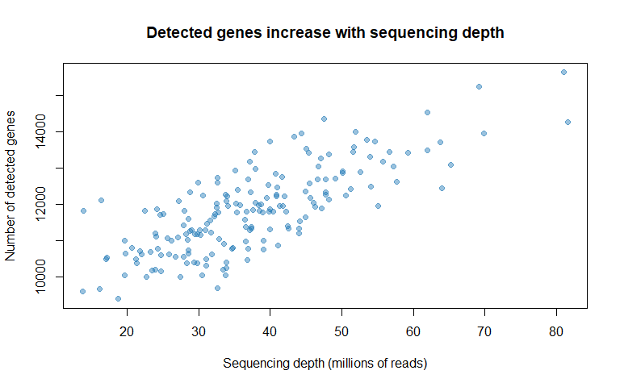
<p class="caption">

A basic base R scatterplot with informative labels.
</p>

</div>

The axis labels contain variable names and units. The title states the
pattern rather than saying only “Scatterplot.”

# 7. The Grammar of Graphics and ggplot2

In `ggplot2`, a graph is built from layers.

Core components are:

- **data:** the data frame;
- **aesthetic mapping:** variables mapped to x, y, colour, fill, size or
  shape;
- **geometry:** points, bars, lines, boxes and other marks;
- **statistical transformation:** counts, smoothers or summaries;
- **scale:** how data values map to visual values;
- **coordinate system:** Cartesian, flipped or transformed coordinates;
- **facets:** small panels based on groups; and
- **theme:** non-data appearance.

Install `ggplot2` once if necessary:

``` r
install.packages("ggplot2")
```

The chapter continues to knit when `ggplot2` is absent. Its code is
shown, but `ggplot2` figures are evaluated only when the package is
installed.

``` r
ggplot2::ggplot(
  clinical_viz,
  ggplot2::aes(x = Sequencing_depth, y = Detected_genes)
) +
  ggplot2::geom_point(
    colour = "#0072B2",
    alpha = 0.55,
    size = 2
  ) +
  ggplot2::labs(
    x = "Sequencing depth (millions of reads)",
    y = "Number of detected genes",
    title = "Detected genes increase with sequencing depth"
  ) +
  ggplot2::theme_classic(base_size = 12)
```

<div class="figure" style="text-align: center">

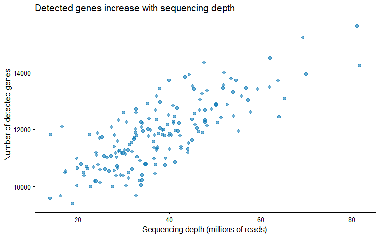
<p class="caption">

The same relationship expressed with ggplot2 layers.
</p>

</div>

## 7.1 Mapping versus setting an aesthetic

Inside `aes()`, a variable is **mapped**:

``` r
ggplot2::ggplot(
  clinical_viz,
  ggplot2::aes(
    x = Sequencing_depth,
    y = Detected_genes,
    colour = Group
  )
) +
  ggplot2::geom_point(alpha = 0.6) +
  ggplot2::theme_classic()
```

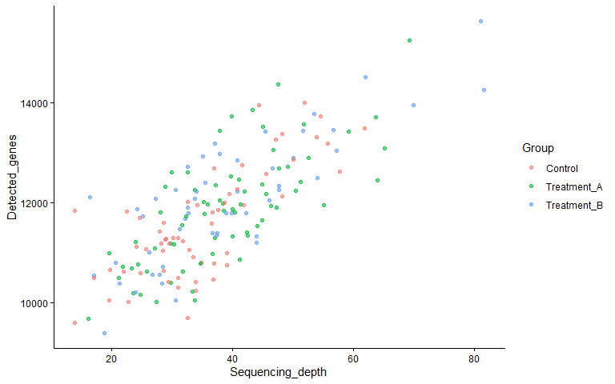

Outside `aes()`, a fixed visual property is **set**:

``` r
ggplot2::ggplot(
  clinical_viz,
  ggplot2::aes(x = Sequencing_depth, y = Detected_genes)
) +
  ggplot2::geom_point(colour = "#0072B2", alpha = 0.6) +
  ggplot2::theme_classic()
```

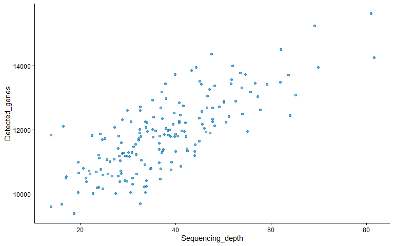

If `colour = "blue"` is placed inside `aes()`, `ggplot2` treats the text
as a category and may create an unwanted legend.

# 8. Bar Charts for Categorical Counts

Bar length should begin at zero because length encodes magnitude.

``` r
group_counts <- table(clinical_viz$Group)

barplot(
  group_counts,
  col = c("#0072B2", "#E69F00", "#009E73"),
  border = NA,
  ylab = "Number of participants",
  xlab = "Study group",
  main = "Study-group sample sizes",
  ylim = c(0, max(group_counts) * 1.18)
)
```

<div class="figure" style="text-align: center">

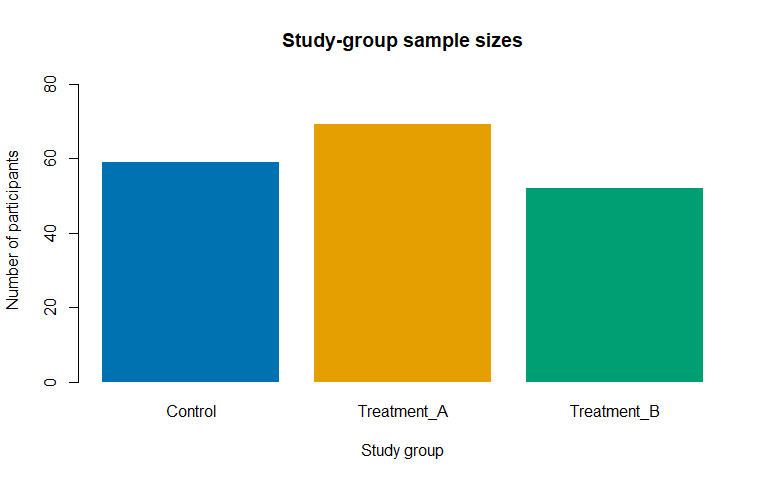
<p class="caption">

Participant counts in each simulated study group.
</p>

</div>

``` r
ggplot2::ggplot(
  clinical_viz,
  ggplot2::aes(x = Group, fill = Group)
) +
  ggplot2::geom_bar(width = 0.7, show.legend = FALSE) +
  ggplot2::scale_fill_manual(
    values = c("#0072B2", "#E69F00", "#009E73")
  ) +
  ggplot2::labs(
    x = "Study group",
    y = "Number of participants",
    title = "Study-group sample sizes"
  ) +
  ggplot2::theme_classic(base_size = 12)
```

<div class="figure" style="text-align: center">

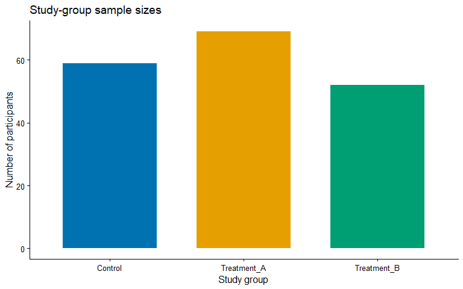
<p class="caption">

ggplot2 counts rows automatically with geom_bar().
</p>

</div>

Use `geom_bar()` when `ggplot2` should count rows. Use `geom_col()` when
the data already contain bar heights.

``` r
group_summary <- data.frame(
  Group = names(group_counts),
  N = as.vector(group_counts),
  stringsAsFactors = FALSE
)

ggplot2::ggplot(group_summary, ggplot2::aes(x = Group, y = N)) +
  ggplot2::geom_col(fill = "#0072B2", width = 0.7) +
  ggplot2::theme_classic()
```

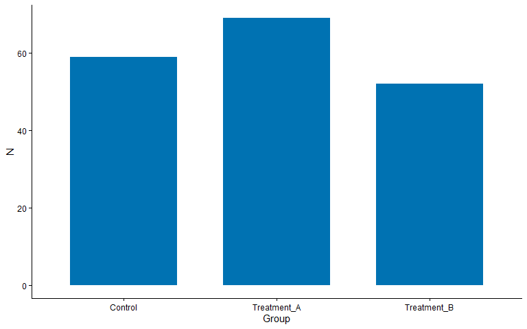

# 9. Grouped and Stacked Bar Charts

Two categorical variables can be shown with grouped bars.

``` r
sex_group_table <- table(
  Recorded_sex = clinical_viz$Recorded_sex,
  Group = clinical_viz$Group
)

barplot(
  sex_group_table,
  beside = TRUE,
  col = c("#CC79A7", "#56B4E9"),
  border = NA,
  xlab = "Study group",
  ylab = "Number of participants",
  main = "Recorded-sex distribution by group"
)
legend(
  "topright",
  legend = rownames(sex_group_table),
  fill = c("#CC79A7", "#56B4E9"),
  bty = "n"
)
```

<div class="figure" style="text-align: center">

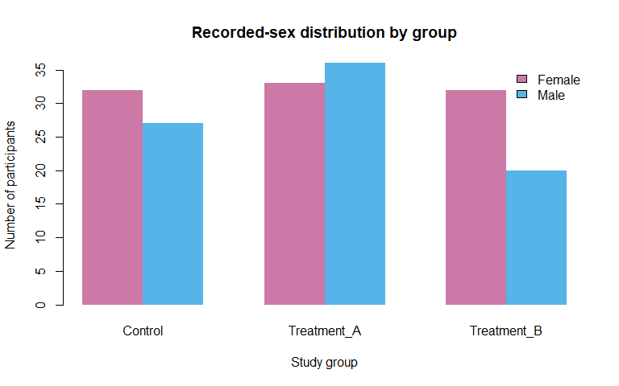
<p class="caption">

Recorded-sex counts within each study group.
</p>

</div>

A 100% stacked bar chart compares composition when group sizes differ.

``` r
sex_group_percent <- 100 * prop.table(sex_group_table, margin = 2)

barplot(
  sex_group_percent,
  col = c("#CC79A7", "#56B4E9"),
  border = NA,
  xlab = "Study group",
  ylab = "Percentage within group",
  main = "Recorded-sex composition",
  ylim = c(0, 100)
)
legend(
  "topright",
  legend = rownames(sex_group_percent),
  fill = c("#CC79A7", "#56B4E9"),
  bty = "n"
)
```

<div class="figure" style="text-align: center">

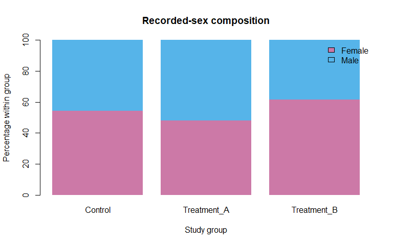
<p class="caption">

Each group column sums to 100%; absolute sample size is no longer
visible.
</p>

</div>

Stacked bars make internal segment comparisons difficult unless segments
share a baseline. Show counts or a table when exact comparison matters.

# 10. Why Pie Charts Are Usually a Weak Default

People compare position and length more accurately than angles and
areas. A bar chart usually makes category differences easier to judge
than a pie chart.

A pie chart may be acceptable for a small number of simple parts that
sum to a meaningful whole, but avoid:

- many slices;
- three-dimensional effects;
- exploded slices;
- similar colours; and
- missing denominators.

``` r
consequence_counts <- c(
  Intronic = 420,
  Intergenic = 260,
  Missense = 140,
  Synonymous = 110,
  `Stop gained` = 20
)

par(mfrow = c(1, 2), mar = c(4, 4, 3, 1))

pie(
  consequence_counts,
  col = c("#0072B2", "#56B4E9", "#009E73", "#E69F00", "#D55E00"),
  main = "Pie chart"
)

barplot(
  sort(consequence_counts),
  horiz = TRUE,
  las = 1,
  col = "#0072B2",
  border = NA,
  xlab = "Variant count",
  main = "Horizontal bar chart"
)
```

<div class="figure" style="text-align: center">

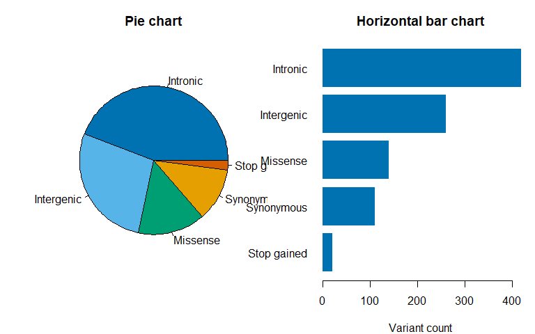
<p class="caption">

The same category composition is easier to compare with aligned bar
lengths.
</p>

</div>

``` r
par(mfrow = c(1, 1))
```

# 11. Histograms

Histograms show the distribution of continuous data. Adjacent bars
represent numerical intervals.

``` r
hist(
  clinical_viz$Biomarker,
  breaks = "FD",
  col = "#56B4E9",
  border = "white",
  xlab = "Biomarker concentration",
  ylab = "Frequency",
  main = "Biomarker distribution"
)
```

<div class="figure" style="text-align: center">

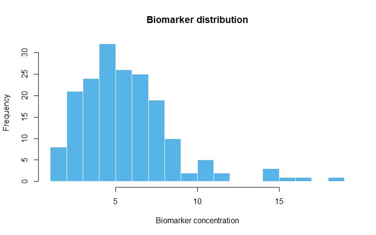
<p class="caption">

The simulated biomarker is positive and right-skewed.
</p>

</div>

``` r
ggplot2::ggplot(
  clinical_viz,
  ggplot2::aes(x = Biomarker)
) +
  ggplot2::geom_histogram(
    binwidth = 1,
    boundary = 0,
    fill = "#56B4E9",
    colour = "white"
  ) +
  ggplot2::labs(
    x = "Biomarker concentration",
    y = "Number of participants",
    title = "Biomarker distribution"
  ) +
  ggplot2::theme_classic()
```

<div class="figure" style="text-align: center">

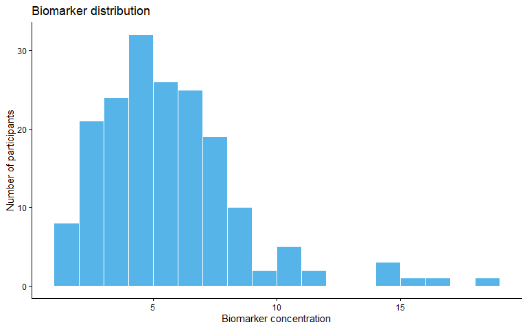
<p class="caption">

Histogram with an explicitly stated bin width.
</p>

</div>

Inspect several reasonable bin widths during exploration. State a
clinically meaningful threshold with a vertical line only when it is
externally justified.

# 12. Density Plots and Frequency Polygons

Density curves are smoothed estimates and depend on bandwidth. They are
helpful for comparing shapes but can suggest detail unsupported by a
small sample.

``` r
group_colours <- c(
  Control = "#0072B2",
  Treatment_A = "#E69F00",
  Treatment_B = "#009E73"
)

plot(
  density(clinical_viz$Biomarker[clinical_viz$Group == "Control"]),
  col = group_colours["Control"],
  lwd = 3,
  xlim = range(clinical_viz$Biomarker),
  xlab = "Biomarker concentration",
  main = "Group-specific biomarker densities"
)

for (g in c("Treatment_A", "Treatment_B")) {
  lines(
    density(clinical_viz$Biomarker[clinical_viz$Group == g]),
    col = group_colours[g],
    lwd = 3
  )
}

legend(
  "topright",
  legend = names(group_colours),
  col = group_colours,
  lwd = 3,
  bty = "n"
)
```

<div class="figure" style="text-align: center">

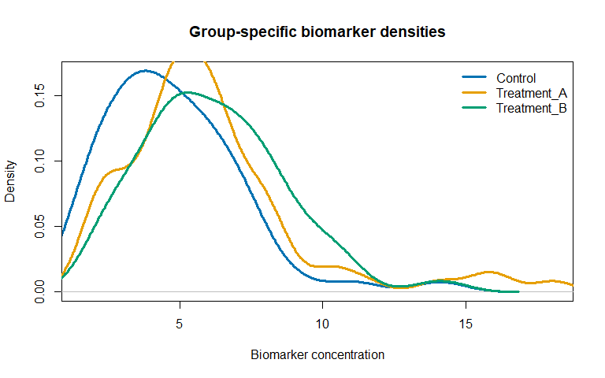
<p class="caption">

Density curves compare biomarker shape across groups; each curve has
total area one.
</p>

</div>

Overlapping filled density plots can obscure one another. Lines, facets
or ECDFs are often clearer.

# 13. ECDFs

An ECDF shows the proportion of observations at or below each value. It
uses every observation and requires no bin width or smoothing bandwidth.

``` r
plot(
  ecdf(clinical_viz$Biomarker[clinical_viz$Group == "Control"]),
  col = group_colours["Control"],
  lwd = 2,
  xlim = range(clinical_viz$Biomarker),
  xlab = "Biomarker concentration",
  ylab = "Cumulative proportion",
  main = "Group-specific ECDFs"
)

for (g in c("Treatment_A", "Treatment_B")) {
  lines(
    ecdf(clinical_viz$Biomarker[clinical_viz$Group == g]),
    col = group_colours[g],
    lwd = 2
  )
}

legend(
  "bottomright",
  legend = names(group_colours),
  col = group_colours,
  lwd = 2,
  bty = "n"
)
```

<div class="figure" style="text-align: center">

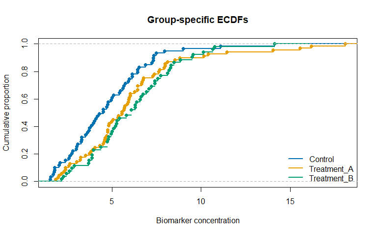
<p class="caption">

ECDFs compare the entire biomarker distribution across groups.
</p>

</div>

# 14. Boxplots, Raw Points and Violin Plots

A boxplot is compact but hides raw sample size and possible
multimodality. For modest datasets, overlay individual observations.

``` r
boxplot(
  Biomarker ~ Group,
  data = clinical_viz,
  col = unname(group_colours),
  outline = FALSE,
  ylab = "Biomarker concentration",
  xlab = "Study group",
  main = "Biomarker by study group"
)

stripchart(
  Biomarker ~ Group,
  data = clinical_viz,
  vertical = TRUE,
  method = "jitter",
  jitter = 0.15,
  pch = 19,
  col = rgb(0, 0, 0, 0.35),
  add = TRUE
)
```

<div class="figure" style="text-align: center">

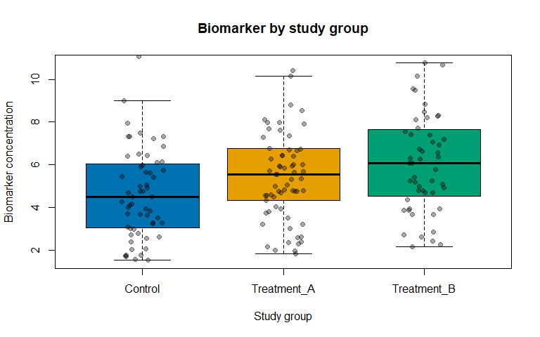
<p class="caption">

Boxplots summarize groups while jittered points preserve
participant-level observations.
</p>

</div>

``` r
ggplot2::ggplot(
  clinical_viz,
  ggplot2::aes(x = Group, y = Biomarker, fill = Group)
) +
  ggplot2::geom_violin(alpha = 0.45, trim = FALSE,
                       colour = NA, show.legend = FALSE) +
  ggplot2::geom_boxplot(width = 0.14, outlier.shape = NA,
                        fill = "white", show.legend = FALSE) +
  ggplot2::geom_jitter(width = 0.10, alpha = 0.35, size = 1.3,
                       show.legend = FALSE) +
  ggplot2::scale_fill_manual(values = group_colours) +
  ggplot2::labs(
    x = "Study group",
    y = "Biomarker concentration",
    title = "Biomarker distributions by group"
  ) +
  ggplot2::theme_classic()
```

<div class="figure" style="text-align: center">

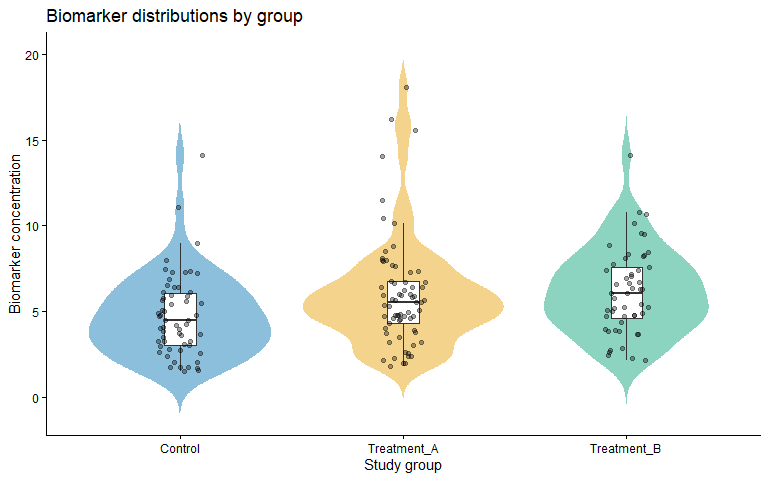
<p class="caption">

A violin shows smoothed density; points prevent the smoothing from
replacing the observations.
</p>

</div>

A violin can be misleading with very small samples because its shape is
smoothed. Always consider the observed points and sample size.

# 15. Scatterplots for Two Numerical Variables

``` r
point_colours <- group_colours[as.character(clinical_viz$Group)]

plot(
  clinical_viz$Sequencing_depth,
  clinical_viz$Detected_genes,
  pch = 19,
  col = grDevices::adjustcolor(point_colours, alpha.f = 0.55),
  xlab = "Sequencing depth (millions of reads)",
  ylab = "Number of detected genes",
  main = "Sequencing depth and detected genes"
)

legend(
  "bottomright",
  legend = names(group_colours),
  col = group_colours,
  pch = 19,
  bty = "n"
)
```

<div class="figure" style="text-align: center">

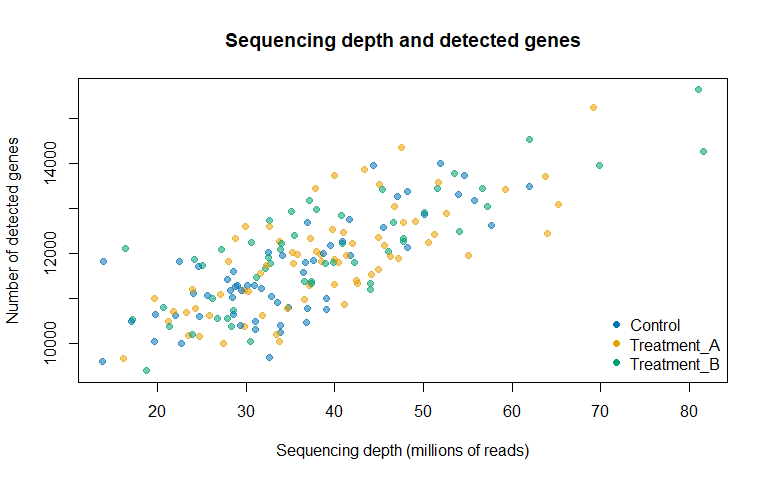
<p class="caption">

Colour identifies group, while transparency reduces overplotting.
</p>

</div>

Use transparency, smaller points or hexagonal binning when points
overlap heavily.

## 15.1 Add a fitted line carefully

``` r
plot(
  clinical_viz$Sequencing_depth,
  clinical_viz$Detected_genes,
  pch = 19,
  col = rgb(0.12, 0.47, 0.71, 0.40),
  xlab = "Sequencing depth (millions of reads)",
  ylab = "Number of detected genes",
  main = "Linear summary of an observed association"
)

depth_model <- lm(Detected_genes ~ Sequencing_depth, data = clinical_viz)
abline(depth_model, col = "#D55E00", lwd = 3)
```

<div class="figure" style="text-align: center">

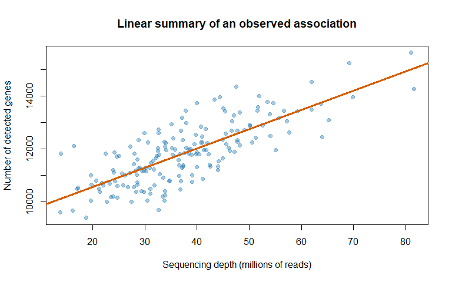
<p class="caption">

A fitted line summarizes an association but does not establish
causality.
</p>

</div>

A line can hide nonlinearity, subgroup differences and
heteroscedasticity. Correlation or regression describes association; it
does not prove that increasing sequencing depth biologically causes
every observed difference.

``` r
ggplot2::ggplot(
  clinical_viz,
  ggplot2::aes(x = Sequencing_depth, y = Detected_genes)
) +
  ggplot2::geom_point(alpha = 0.45, colour = "#0072B2") +
  ggplot2::geom_smooth(method = "lm", formula = y ~ x,
                       colour = "#D55E00", fill = "#E69F00") +
  ggplot2::theme_classic()
```

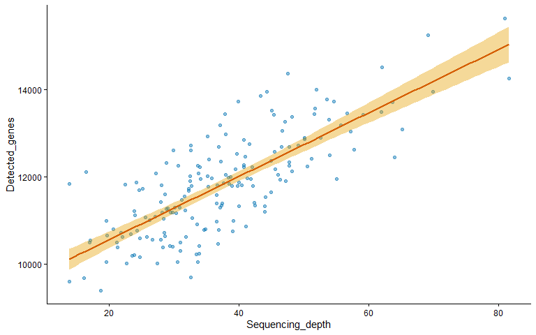

The shaded region is uncertainty around the fitted mean relationship,
not a region containing 95% of future observations.

# 16. Logarithmic Axes

Positive variables spanning orders of magnitude are often clearer on a
log scale.

``` r
set.seed(234)
wide_depth <- rlnorm(200, meanlog = log(30), sdlog = 1)
wide_genes <- 6000 + 1700 * log10(wide_depth) + rnorm(200, sd = 500)

par(mfrow = c(1, 2), mar = c(4, 4, 3, 1))

plot(wide_depth, wide_genes, pch = 19,
     col = rgb(0.12, 0.47, 0.71, 0.45),
     xlab = "Depth", ylab = "Detected genes",
     main = "Linear x-axis")

plot(wide_depth, wide_genes, log = "x", pch = 19,
     col = rgb(0.10, 0.60, 0.35, 0.45),
     xlab = "Depth (log axis)", ylab = "Detected genes",
     main = "Logarithmic x-axis")
```

<div class="figure" style="text-align: center">

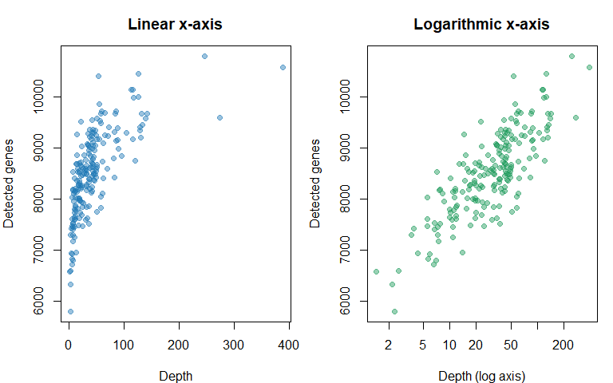
<p class="caption">

A logarithmic x-axis spreads small sequencing-depth values and
compresses large values.
</p>

</div>

``` r
par(mfrow = c(1, 1))
```

A log axis changes visual spacing, not the stored data. Label the scale
clearly. Values of zero or below cannot appear on an ordinary
logarithmic axis.

# 17. Longitudinal and Repeated-Measures Data

A line implies ordered connection. Use lines for time or another
meaningful sequence, not simply to connect unrelated categories.

``` r
set.seed(345)

longitudinal <- expand.grid(
  Participant = sprintf("D%02d", 1:24),
  Week = c(0, 4, 8, 12),
  KEEP.OUT.ATTRS = FALSE,
  stringsAsFactors = FALSE
)

longitudinal$Treatment <- ifelse(
  as.integer(sub("D", "", longitudinal$Participant)) <= 12,
  "Control", "Treatment"
)

participant_intercept <- rnorm(24, mean = 120, sd = 8)
participant_index <- match(
  longitudinal$Participant,
  sprintf("D%02d", 1:24)
)

longitudinal$Blood_pressure <-
  participant_intercept[participant_index] -
  0.10 * longitudinal$Week -
  0.45 * longitudinal$Week *
    (longitudinal$Treatment == "Treatment") +
  rnorm(nrow(longitudinal), sd = 3)

head(longitudinal)
```

<div class="kable-table">

| Participant | Week | Treatment | Blood_pressure |
|:------------|-----:|:----------|---------------:|
| D01         |    0 | Control   |       114.0170 |
| D02         |    0 | Control   |       120.3946 |
| D03         |    0 | Control   |       116.7717 |
| D04         |    0 | Control   |       114.5601 |
| D05         |    0 | Control   |       117.7216 |
| D06         |    0 | Control   |       113.1798 |

</div>

## 17.1 Spaghetti plot

``` r
treatment_colours <- c(Control = "#0072B2", Treatment = "#D55E00")

plot(
  range(longitudinal$Week),
  range(longitudinal$Blood_pressure),
  type = "n",
  xlab = "Week",
  ylab = "Systolic blood pressure (mmHg)",
  main = "Participant-level trajectories"
)

for (id in unique(longitudinal$Participant)) {
  person <- longitudinal[longitudinal$Participant == id, ]
  lines(
    person$Week,
    person$Blood_pressure,
    col = grDevices::adjustcolor(
      treatment_colours[person$Treatment[1]],
      alpha.f = 0.35
    ),
    lwd = 1.5
  )
}

legend(
  "topright",
  legend = names(treatment_colours),
  col = treatment_colours,
  lwd = 2,
  bty = "n"
)
```

<div class="figure" style="text-align: center">

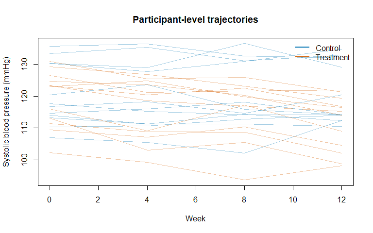
<p class="caption">

Each line represents one participant; repeated observations are not
independent.
</p>

</div>

Spaghetti plots become crowded with many participants. Use transparency,
a random subset for visual illustration, small multiples, or group
summaries while retaining an appropriate repeated-measures analysis.

## 17.2 Group means over time

``` r
summary_parts <- split(
  longitudinal,
  interaction(longitudinal$Treatment, longitudinal$Week, drop = TRUE)
)

longitudinal_summary <- do.call(rbind, lapply(summary_parts, function(d) {
  data.frame(
    Treatment = d$Treatment[1],
    Week = d$Week[1],
    N = nrow(d),
    Mean = mean(d$Blood_pressure),
    SD = sd(d$Blood_pressure),
    SE = sd(d$Blood_pressure) / sqrt(nrow(d)),
    stringsAsFactors = FALSE
  )
}))

rownames(longitudinal_summary) <- NULL
longitudinal_summary <- longitudinal_summary[
  order(longitudinal_summary$Treatment, longitudinal_summary$Week),
]

head(longitudinal_summary)
```

<div class="kable-table">

|     | Treatment | Week |   N |     Mean |        SD |       SE |
|:----|:----------|-----:|----:|---------:|----------:|---------:|
| 1   | Control   |    0 |  12 | 120.3200 |  9.689428 | 2.797097 |
| 3   | Control   |    4 |  12 | 120.0236 | 10.242449 | 2.956740 |
| 5   | Control   |    8 |  12 | 119.5143 | 10.612283 | 3.063502 |
| 7   | Control   |   12 |  12 | 120.0754 |  9.339702 | 2.696140 |
| 2   | Treatment |    0 |  12 | 119.4170 |  8.854202 | 2.555988 |
| 4   | Treatment |    4 |  12 | 115.6786 |  9.670470 | 2.791624 |

</div>

``` r
plot(
  range(longitudinal_summary$Week),
  range(c(
    longitudinal_summary$Mean - 1.96 * longitudinal_summary$SE,
    longitudinal_summary$Mean + 1.96 * longitudinal_summary$SE
  )),
  type = "n",
  xlab = "Week",
  ylab = "Mean systolic blood pressure (mmHg)",
  main = "Mean trajectories with 95% CI error bars"
)

for (trt in names(treatment_colours)) {
  d <- longitudinal_summary[longitudinal_summary$Treatment == trt, ]
  lines(d$Week, d$Mean, type = "o", pch = 19,
        col = treatment_colours[trt], lwd = 2)
  arrows(
    d$Week,
    d$Mean - 1.96 * d$SE,
    d$Week,
    d$Mean + 1.96 * d$SE,
    angle = 90,
    code = 3,
    length = 0.05,
    col = treatment_colours[trt]
  )
}

legend("topright", legend = names(treatment_colours),
       col = treatment_colours, pch = 19, lwd = 2, bty = "n")
```

<div class="figure" style="text-align: center">

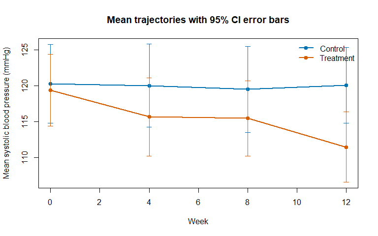
<p class="caption">

Group means with 95% normal-approximation error bars; a
repeated-measures model is still needed for inference.
</p>

</div>

These simple CIs treat each time-specific mean separately. They do not
encode covariance among repeated measurements.

# 18. Error Bars: SD, SE or Confidence Interval?

Error bars are meaningful only when their definition is stated.

| Error bar | Meaning |
|----|----|
| SD | Variation among observed individuals |
| SE | Estimated precision of a sample mean |
| 95% CI | Range of parameter values compatible with the estimate under a model |
| IQR | Middle 50% of observed values |
| Range | Observed minimum to maximum |

Do not infer statistical significance from whether two separate 95%
confidence intervals overlap. The relevant uncertainty concerns the
**difference** between estimates.

## 18.1 Avoid summary-only bar charts for continuous data

A mean bar with an error bar can hide skewness, outliers, sample size
and multimodality.

``` r
par(mfrow = c(1, 2), mar = c(5, 4, 3, 1))

group_means <- tapply(clinical_viz$Biomarker, clinical_viz$Group, mean)
group_se <- tapply(
  clinical_viz$Biomarker,
  clinical_viz$Group,
  function(x) sd(x) / sqrt(length(x))
)

bar_mid <- barplot(
  group_means,
  col = unname(group_colours),
  border = NA,
  ylim = c(0, max(group_means + group_se) * 1.25),
  ylab = "Mean biomarker",
  main = "Mean +/- SE"
)
arrows(bar_mid, group_means - group_se,
       bar_mid, group_means + group_se,
       angle = 90, code = 3, length = 0.06)

boxplot(
  Biomarker ~ Group,
  data = clinical_viz,
  col = unname(group_colours),
  outline = FALSE,
  ylab = "Biomarker",
  main = "Distributions and points"
)
stripchart(Biomarker ~ Group, data = clinical_viz,
           vertical = TRUE, method = "jitter", jitter = 0.12,
           pch = 19, col = rgb(0, 0, 0, 0.28), add = TRUE)
```

<div class="figure" style="text-align: center">

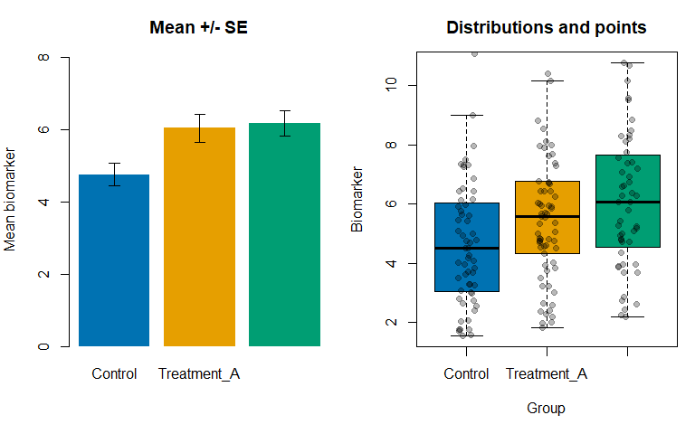
<p class="caption">

Raw points and distribution summaries reveal information hidden by
mean-only bars.
</p>

</div>

``` r
par(mfrow = c(1, 1))
```

# 19. Faceting and Small Multiples

Facets create aligned panels using the same visual structure. They are
useful for comparing batches, tissues or subgroups.

``` r
ggplot2::ggplot(
  clinical_viz,
  ggplot2::aes(x = Sequencing_depth, y = Detected_genes)
) +
  ggplot2::geom_point(alpha = 0.5, colour = "#0072B2") +
  ggplot2::geom_smooth(method = "lm", formula = y ~ x,
                       se = FALSE, colour = "#D55E00") +
  ggplot2::facet_wrap(~ Batch, ncol = 2) +
  ggplot2::labs(
    x = "Sequencing depth (millions)",
    y = "Detected genes",
    title = "Sequencing relationship within each batch"
  ) +
  ggplot2::theme_classic()
```

<div class="figure" style="text-align: center">

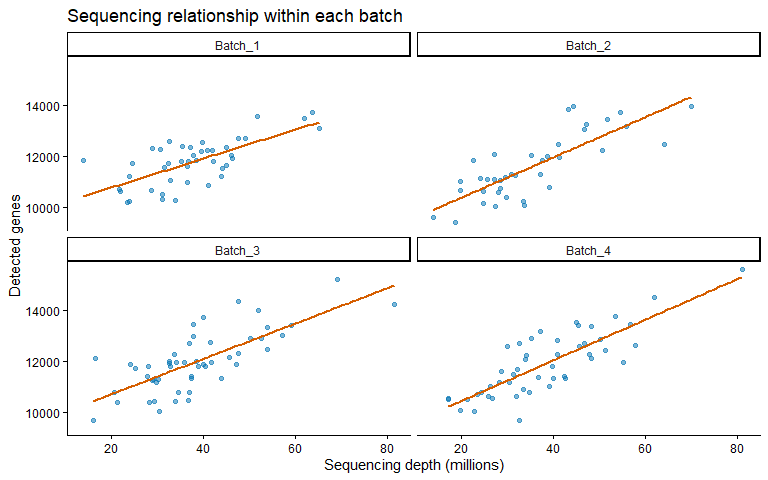
<p class="caption">

Faceting exposes batch-specific depth relationships without mixing all
points.
</p>

</div>

Use a common scale when direct comparison matters. Free scales can
reveal within-panel structure but hide absolute differences.

# 20. Heatmaps for Matrix Data

Heatmaps are useful for gene-expression matrices, correlations and other
feature-by-sample data.

``` r
set.seed(456)

expression_matrix <- matrix(
  rnorm(15 * 18, mean = 8, sd = 1),
  nrow = 15,
  dimnames = list(
    paste0("Gene_", sprintf("%02d", 1:15)),
    paste0("Sample_", sprintf("%02d", 1:18))
  )
)

# Add a group-related expression pattern to the final six samples
expression_matrix[1:5, 13:18] <-
  expression_matrix[1:5, 13:18] + 2
```

## 20.1 Row standardization

Genes can have very different expression levels. Row z-scores emphasize
relative high and low expression within each gene.

``` r
row_z <- t(scale(t(expression_matrix)))

data.frame(
  Gene = rownames(row_z)[1:5],
  Row_mean_after_scaling = round(rowMeans(row_z)[1:5], 5),
  Row_SD_after_scaling = round(apply(row_z, 1, sd)[1:5], 5),
  stringsAsFactors = FALSE
)
```

<div class="kable-table">

|         | Gene    | Row_mean_after_scaling | Row_SD_after_scaling |
|:--------|:--------|-----------------------:|---------------------:|
| Gene_01 | Gene_01 |                      0 |                    1 |
| Gene_02 | Gene_02 |                      0 |                    1 |
| Gene_03 | Gene_03 |                      0 |                    1 |
| Gene_04 | Gene_04 |                      0 |                    1 |
| Gene_05 | Gene_05 |                      0 |                    1 |

</div>

``` r
heatmap(
  row_z,
  scale = "none",
  col = colorRampPalette(c("#2166AC", "white", "#B2182B"))(101),
  margins = c(7, 7),
  main = "Gene-wise standardized expression"
)
```

<div class="figure" style="text-align: center">

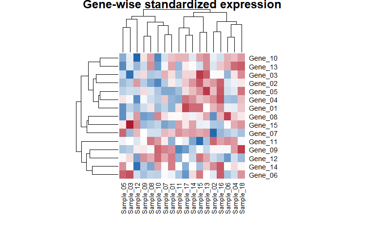
<p class="caption">

Heatmap of gene-wise z-scores; colours show relative expression within
genes, not absolute expression between genes.
</p>

</div>

Always state whether rows or columns were scaled and which distance and
clustering methods were used. A red cell here means high relative
expression for that gene, not necessarily high absolute expression
across all genes.

# 21. PCA Plots

Principal component analysis reduces high-dimensional variation to
orthogonal axes. A PCA plot can reveal sample structure, batch effects
and unusual samples.

``` r
pca_result <- prcomp(t(expression_matrix), scale. = TRUE)

pca_scores <- data.frame(
  Sample = rownames(pca_result$x),
  PC1 = pca_result$x[, 1],
  PC2 = pca_result$x[, 2],
  Group = rep(c("Group_1", "Group_2", "Group_3"), each = 6),
  stringsAsFactors = FALSE
)

variance_explained <- 100 * pca_result$sdev^2 /
  sum(pca_result$sdev^2)

pca_colours <- c(Group_1 = "#0072B2",
                 Group_2 = "#E69F00",
                 Group_3 = "#009E73")

plot(
  pca_scores$PC1,
  pca_scores$PC2,
  pch = 19,
  col = pca_colours[pca_scores$Group],
  xlab = paste0("PC1 (", round(variance_explained[1], 1), "%)"),
  ylab = paste0("PC2 (", round(variance_explained[2], 1), "%)"),
  main = "PCA of simulated expression profiles"
)
text(pca_scores$PC1, pca_scores$PC2,
     labels = pca_scores$Sample, pos = 3, cex = 0.65)
legend("topright", legend = names(pca_colours),
       col = pca_colours, pch = 19, bty = "n")
```

<div class="figure" style="text-align: center">

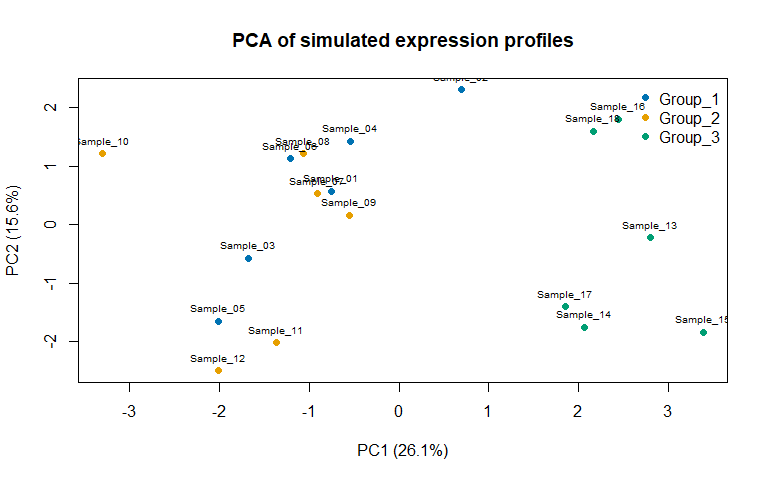
<p class="caption">

PCA of the simulated expression matrix; labels identify samples for QC.
</p>

</div>

A PCA plot is descriptive. Separation can reflect biology, batch, tissue
composition, ancestry or technical quality. Inspect loadings and
metadata before interpreting a cluster.

# 22. Correlation Heatmaps

``` r
sample_correlations <- cor(expression_matrix)

heatmap(
  sample_correlations,
  symm = TRUE,
  scale = "none",
  col = colorRampPalette(c("#F7FBFF", "#6BAED6", "#08306B"))(100),
  margins = c(7, 7),
  main = "Sample-to-sample correlation"
)
```

<div class="figure" style="text-align: center">

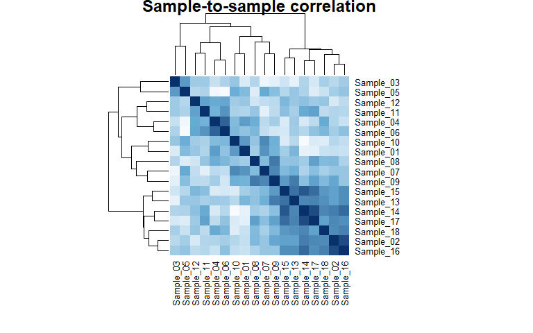
<p class="caption">

Sample-correlation heatmap for exploratory quality control.
</p>

</div>

Correlation heatmaps can reveal clusters and low-correlation samples. Do
not confuse correlation with agreement or causal similarity.

# 23. Volcano Plots

A volcano plot displays:

- effect size, often log2 fold change, on the x-axis; and
- $-\log_{10}(p)$ or adjusted p-value on the y-axis.

``` r
set.seed(567)

n_genes <- 1500
volcano_data <- data.frame(
  Gene = paste0("Gene_", seq_len(n_genes)),
  Log2_fold_change = rnorm(n_genes, mean = 0, sd = 0.65),
  P_value = runif(n_genes),
  stringsAsFactors = FALSE
)

signal_genes <- sample(seq_len(n_genes), 35)
volcano_data$Log2_fold_change[signal_genes] <-
  rnorm(35, mean = rep(c(-2, 2), length.out = 35), sd = 0.35)
volcano_data$P_value[signal_genes] <- 10^runif(35, min = -10, max = -4)

volcano_data$Adjusted_p <- p.adjust(
  volcano_data$P_value,
  method = "BH"
)

volcano_data$Category <- "Not selected"
volcano_data$Category[
  volcano_data$Adjusted_p < 0.05 &
    volcano_data$Log2_fold_change >= 1
] <- "Higher"
volcano_data$Category[
  volcano_data$Adjusted_p < 0.05 &
    volcano_data$Log2_fold_change <= -1
] <- "Lower"
```

``` r
volcano_colours <- c(
  Lower = "#0072B2",
  `Not selected` = "grey70",
  Higher = "#D55E00"
)

plot(
  volcano_data$Log2_fold_change,
  -log10(volcano_data$Adjusted_p),
  pch = 19,
  cex = 0.65,
  col = grDevices::adjustcolor(
    volcano_colours[volcano_data$Category],
    alpha.f = 0.65
  ),
  xlab = "Log2 fold change",
  ylab = expression(-log[10](adjusted~p)),
  main = "Differential-expression volcano plot"
)
abline(v = c(-1, 1), lty = 2, col = "grey40")
abline(h = -log10(0.05), lty = 2, col = "grey40")
legend("topright", legend = names(volcano_colours),
       col = volcano_colours, pch = 19, bty = "n")
```

<div class="figure" style="text-align: center">

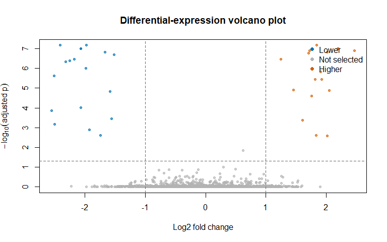
<p class="caption">

A volcano plot combines effect magnitude and statistical evidence;
thresholds are explicitly stated.
</p>

</div>

Avoid labelling every gene. Label a prespecified set, the most relevant
hits or genes meeting transparent criteria. A volcano plot does not show
expression abundance, uncertainty in fold change or genomic location.

# 24. Manhattan Plots

A Manhattan plot displays genomic position against $-\log_{10}(p)$.

``` r
set.seed(678)

variants_per_chr <- 250
chromosomes <- 1:6

gwas_data <- do.call(rbind, lapply(chromosomes, function(chr) {
  data.frame(
    Chromosome = chr,
    Position = sort(sample(1:100000000, variants_per_chr)),
    P_value = runif(variants_per_chr),
    stringsAsFactors = FALSE
  )
}))

gwas_data$P_value[c(330, 331, 910)] <- c(2e-9, 8e-10, 3e-8)

chromosome_lengths <- tapply(
  gwas_data$Position,
  gwas_data$Chromosome,
  max
)

offsets <- c(
  0,
  cumsum(as.numeric(head(chromosome_lengths, -1)))
)
names(offsets) <- names(chromosome_lengths)
gwas_data$Cumulative_position <- gwas_data$Position +
  offsets[as.character(gwas_data$Chromosome)]

axis_centres <- tapply(
  gwas_data$Cumulative_position,
  gwas_data$Chromosome,
  function(x) mean(range(x))
)
```

``` r
manhattan_colours <- c("#0072B2", "#56B4E9")

plot(
  gwas_data$Cumulative_position,
  -log10(gwas_data$P_value),
  pch = 19,
  cex = 0.55,
  col = manhattan_colours[(gwas_data$Chromosome %% 2) + 1],
  xaxt = "n",
  xlab = "Chromosome",
  ylab = expression(-log[10](p)),
  main = "Simulated genome-wide association results"
)
axis(1, at = axis_centres, labels = chromosomes)
abline(h = -log10(5e-8), col = "#D55E00", lty = 2, lwd = 2)
```

<div class="figure" style="text-align: center">

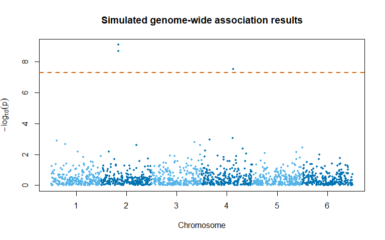
<p class="caption">

A simplified Manhattan plot with alternating chromosome colours and a
genome-wide threshold.
</p>

</div>

State the genome build, tested variants, p-value definition and
significance threshold. Dense points in a locus may reflect linkage
disequilibrium rather than many independent discoveries.

# 25. Forest Plots

A forest plot displays effect estimates with confidence intervals.

``` r
forest_data <- data.frame(
  Study = c("Study A", "Study B", "Study C", "Study D", "Pooled"),
  Estimate = c(1.18, 0.95, 1.32, 1.10, 1.15),
  Lower = c(1.02, 0.78, 1.05, 0.91, 1.05),
  Upper = c(1.37, 1.16, 1.66, 1.33, 1.26),
  stringsAsFactors = FALSE
)
```

``` r
y_position <- rev(seq_len(nrow(forest_data)))

plot(
  forest_data$Estimate,
  y_position,
  log = "x",
  xlim = c(0.7, 1.9),
  pch = c(rep(19, 4), 18),
  cex = c(rep(1.1, 4), 1.5),
  yaxt = "n",
  xlab = "Ratio estimate (log scale)",
  ylab = "",
  main = "Effect estimates with 95% confidence intervals"
)
axis(2, at = y_position, labels = forest_data$Study, las = 1)
arrows(
  forest_data$Lower,
  y_position,
  forest_data$Upper,
  y_position,
  angle = 90,
  code = 3,
  length = 0.05
)
abline(v = 1, lty = 2, col = "grey40")
```

<div class="figure" style="text-align: center">

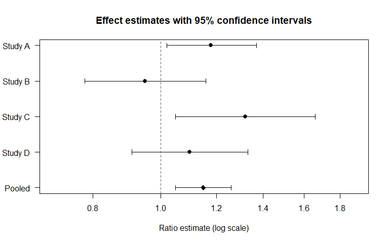
<p class="caption">

Forest plot of ratio estimates; the null value is one.
</p>

</div>

For ratios such as odds ratios or hazard ratios, a log x-axis gives
equal visual distance to reciprocal effects. The null is 1. For
differences, the null is usually 0.

# 26. Colour as Data Encoding

Use colour according to variable meaning.

## 26.1 Qualitative palette

For unordered categories, use distinct colours without an implied
ranking.

## 26.2 Sequential palette

For low-to-high numerical values, use gradually changing lightness.

## 26.3 Diverging palette

For values around a meaningful midpoint, use two directions from a
neutral centre. Gene-wise z-scores around zero are a common example.

## 26.4 Colour-blind-accessible palette

The Okabe–Ito palette is a useful qualitative starting point:

``` r
okabe_ito <- c(
  black = "#000000",
  orange = "#E69F00",
  sky_blue = "#56B4E9",
  bluish_green = "#009E73",
  yellow = "#F0E442",
  blue = "#0072B2",
  vermillion = "#D55E00",
  reddish_purple = "#CC79A7"
)

barplot(
  rep(1, length(okabe_ito)),
  col = okabe_ito,
  border = NA,
  names.arg = names(okabe_ito),
  las = 2,
  axes = FALSE,
  main = "Okabe-Ito qualitative palette"
)
```

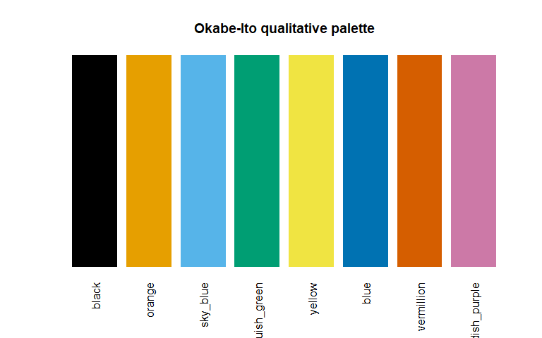

Colour should not be the only distinction. Combine colour with shape,
line type, labels or facets when accessibility matters.

Avoid rainbow palettes for ordered numerical data: hue order is not
perceptually uniform, and bright boundaries can create artificial
patterns.

# 27. Visual Encodings: Accuracy Matters

Readers generally compare these encodings with different accuracy:

1.  position on a common scale;
2.  position on non-aligned scales;
3.  length;
4.  angle or slope;
5.  area;
6.  volume; and
7.  colour hue or saturation.

This is why aligned dot plots and bars often support more accurate
comparison than bubbles, pies or three-dimensional objects.

Avoid using circle area without a clear scale. Doubling a circle’s
radius quadruples its area and exaggerates magnitude.

# 28. Misleading Axes and Scales

## 28.1 Truncated bar axes

Bars encode magnitude by length and should usually start at zero.

``` r
small_difference <- c(Group_A = 98, Group_B = 102)

par(mfrow = c(1, 2), mar = c(4, 4, 3, 1))

barplot(small_difference, ylim = c(0, 110),
        col = c("#0072B2", "#E69F00"), border = NA,
        ylab = "Mean value", main = "Zero baseline")

barplot(small_difference, ylim = c(95, 104),
        col = c("#0072B2", "#E69F00"), border = NA,
        ylab = "Mean value", main = "Truncated baseline")
```

<div class="figure" style="text-align: center">

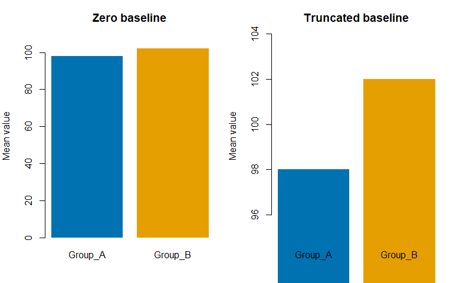
<p class="caption">

A truncated bar axis exaggerates a small difference in group means.
</p>

</div>

``` r
par(mfrow = c(1, 1))
```

For points and lines, zero is not always necessary, but the range must
not distort interpretation.

## 28.2 Reversed or irregular axes

If an axis is reversed or transformed, label it explicitly. Preserve
ordered intervals honestly.

## 28.3 Dual y-axes

Two y-axes can create an arbitrary visual correlation because each scale
can be adjusted independently. Prefer:

- aligned panels with a shared x-axis;
- standardized values when scientifically meaningful; or
- direct annotation of two separate plots.

# 29. Ordering Categories

Alphabetical order is rarely the only option. Categories can be ordered
by:

- natural sequence;
- clinical severity;
- genomic position;
- time;
- frequency; or
- effect estimate.

``` r
ordered_consequences <- sort(consequence_counts)

barplot(
  ordered_consequences,
  horiz = TRUE,
  las = 1,
  col = "#0072B2",
  border = NA,
  xlab = "Variant count",
  main = "Variant consequences ordered by count"
)
```

<div class="figure" style="text-align: center">

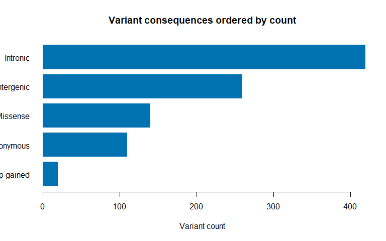
<p class="caption">

Ordering variant consequences by count improves comparison.
</p>

</div>

Do not reorder ordinal categories such as mild, moderate and severe by
count if doing so destroys their meaningful sequence.

# 30. Labels and Annotations

Annotations should guide attention to scientifically important features.

Useful annotations include:

- prespecified thresholds;
- treatment start;
- reference values;
- selected genes or variants;
- sample size; and
- clearly defined uncertainty.

Avoid labelling every point. It creates clutter and makes important
labels harder to find.

``` r
top_gene_rows <- order(volcano_data$Adjusted_p)[1:3]

plot(
  volcano_data$Log2_fold_change,
  -log10(volcano_data$Adjusted_p),
  pch = 19,
  cex = 0.55,
  col = "grey70",
  xlab = "Log2 fold change",
  ylab = expression(-log[10](adjusted~p)),
  main = "Selective annotation"
)
points(
  volcano_data$Log2_fold_change[top_gene_rows],
  -log10(volcano_data$Adjusted_p[top_gene_rows]),
  pch = 19,
  col = "#D55E00",
  cex = 1.1
)
text(
  volcano_data$Log2_fold_change[top_gene_rows],
  -log10(volcano_data$Adjusted_p[top_gene_rows]),
  labels = volcano_data$Gene[top_gene_rows],
  pos = 3,
  cex = 0.75
)
```

<div class="figure" style="text-align: center">

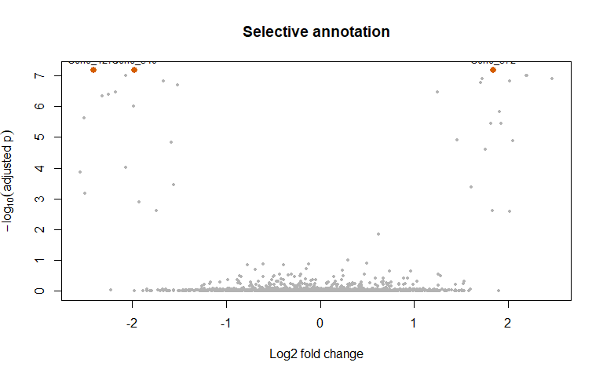
<p class="caption">

Only the three highest-evidence genes are labelled.
</p>

</div>

# 31. Titles, Captions and Legends

A complete scientific figure needs:

- a message-oriented title when appropriate;
- axis labels with units;
- a legend only when visual encodings require it;
- a caption defining data, sample size and uncertainty; and
- methods details sufficient for interpretation.

Do not repeat information. If groups are directly labelled, a legend may
be unnecessary.

A figure caption should explain the figure without forcing the reader to
search the main text for basic definitions.

# 32. Themes and Visual Hierarchy

Data should dominate the figure. Grid lines, borders and backgrounds
should support reading rather than compete with it.

``` r
theme_biostatistics <- function(base_size = 12) {
  ggplot2::theme_classic(base_size = base_size) +
    ggplot2::theme(
      plot.title = ggplot2::element_text(face = "bold"),
      plot.subtitle = ggplot2::element_text(colour = "grey30"),
      axis.title = ggplot2::element_text(face = "bold"),
      legend.position = "top",
      strip.background = ggplot2::element_rect(
        fill = "grey92",
        colour = NA
      ),
      strip.text = ggplot2::element_text(face = "bold")
    )
}

ggplot2::ggplot(
  clinical_viz,
  ggplot2::aes(x = Group, y = Biomarker, colour = Group)
) +
  ggplot2::geom_jitter(width = 0.12, alpha = 0.5) +
  ggplot2::scale_colour_manual(values = group_colours) +
  ggplot2::labs(
    x = "Study group",
    y = "Biomarker concentration",
    title = "Biomarker values vary within every group"
  ) +
  theme_biostatistics()
```

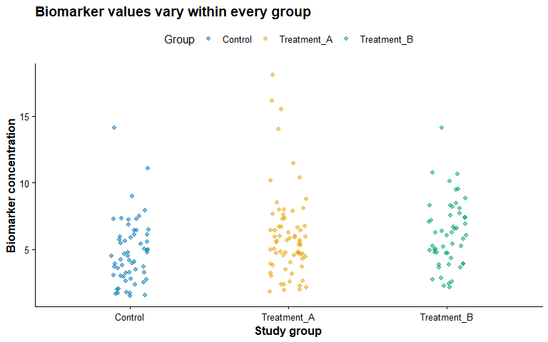

A reusable theme improves consistency, but it should not force every
figure into the same layout regardless of purpose.

# 33. Multi-Panel Figures in Base R

Use `par(mfrow = ...)` for simple base R layouts. Save and restore
graphical parameters when writing reusable code.

``` r
old_par <- par(no.readonly = TRUE)
par(mfrow = c(1, 3), mar = c(4, 4, 3, 1))

hist(clinical_viz$Biomarker, breaks = "FD",
     col = "#56B4E9", border = "white",
     xlab = "Biomarker", main = "Distribution")

boxplot(Biomarker ~ Group, data = clinical_viz,
        col = unname(group_colours), outline = FALSE,
        xlab = "Group", ylab = "Biomarker",
        main = "Group comparison")

plot(clinical_viz$Age, clinical_viz$Biomarker,
     pch = 19, col = rgb(0.12, 0.47, 0.71, 0.4),
     xlab = "Age (years)", ylab = "Biomarker",
     main = "Age relationship")
```

<div class="figure" style="text-align: center">

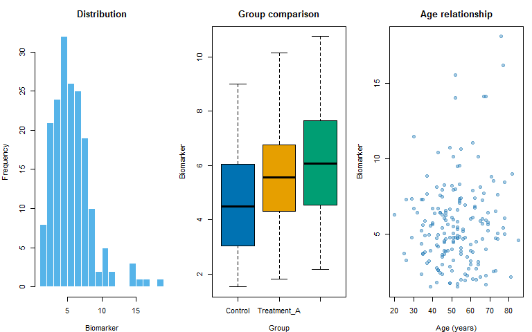
<p class="caption">

Three complementary views of the same biomarker data.
</p>

</div>

``` r
par(old_par)
```

Panels should use aligned sizing, readable labels and consistent colour
meaning. Label panels A, B and C when referenced separately in text.

# 34. Raster and Vector Graphics

## 34.1 Raster formats

Raster images store pixels.

- PNG: excellent for web, screenshots and plots with many points.
- TIFF: common in journal workflows.
- JPEG: lossy compression; usually poor for line art and text.

Raster quality depends on pixel dimensions and intended physical size.

## 34.2 Vector formats

Vector files store lines, shapes and text mathematically.

- PDF: common for manuscripts and printing.
- SVG: useful for web and editable vector workflows.

Vector graphics scale without pixelation, but millions of scatterplot
points can create enormous files. Rasterization may be more practical
for dense layers.

# 35. Figure Size, Resolution and DPI

Pixels, physical dimensions and DPI are related:

$$\text{pixels} = \text{inches} \times \text{DPI}.$$

A 6-inch-wide figure at 300 DPI requires 1,800 pixels. At 600 DPI it
requires 3,600 pixels.

High DPI cannot repair a plot originally created with unreadable labels
or poor design. Plan the final physical dimensions first.

## 35.1 Export base R graphics

``` r
png(
  filename = "biomarker_by_group.png",
  width = 7,
  height = 5,
  units = "in",
  res = 300,
  bg = "white"
)

boxplot(
  Biomarker ~ Group,
  data = clinical_viz,
  col = unname(group_colours),
  ylab = "Biomarker concentration",
  xlab = "Study group"
)

dev.off()
```

Every opened graphics device must be closed with `dev.off()`.

## 35.2 Export a vector PDF

``` r
pdf(
  file = "biomarker_by_group.pdf",
  width = 7,
  height = 5,
  useDingbats = FALSE
)

boxplot(
  Biomarker ~ Group,
  data = clinical_viz,
  col = unname(group_colours)
)

dev.off()
```

## 35.3 Export ggplot2 graphics

``` r
final_plot <- ggplot2::ggplot(
  clinical_viz,
  ggplot2::aes(x = Group, y = Biomarker, colour = Group)
) +
  ggplot2::geom_jitter(width = 0.12, alpha = 0.5) +
  ggplot2::scale_colour_manual(values = group_colours) +
  ggplot2::theme_classic()

ggplot2::ggsave(
  filename = "biomarker_by_group.png",
  plot = final_plot,
  width = 7,
  height = 5,
  units = "in",
  dpi = 300,
  bg = "white"
)

ggplot2::ggsave(
  filename = "biomarker_by_group.pdf",
  plot = final_plot,
  width = 7,
  height = 5,
  units = "in"
)
```

# 36. R Markdown Figure Options

Important chunk options include:

``` r
# ```{r figure-name,
#      fig.width=7,
#      fig.height=5,
#      fig.cap="A complete and informative caption.",
#      out.width="85%",
#      fig.align="center",
#      dpi=300}
# plotting code
# ```
```

- `fig.width` and `fig.height` control the graphics device in inches.
- `dpi` affects raster resolution.
- `out.width` controls displayed width in the rendered document.
- `fig.cap` adds a caption.
- unique chunk labels create predictable figure filenames.

Do not manually copy figures into the generated `figure-gfm` folder. Let
R Markdown create them reproducibly from code.

# 37. Accessibility

An accessible figure should:

- use sufficiently large text;
- maintain strong foreground–background contrast;
- avoid colour as the only carrier of meaning;
- use readable line widths and point sizes;
- avoid red–green-only contrasts;
- label important features directly when possible;
- explain abbreviations in the caption; and
- include alternative text when published on the web.

Test the figure at its final display size. A label readable on a large
monitor may become illegible in a two-column paper.

# 38. Ethical Visualization

Scientific visualization must not exaggerate evidence.

Avoid:

- truncated bar axes that inflate small differences;
- selective removal of inconvenient observations;
- hidden denominators;
- undisclosed transformations;
- area or volume encodings that exaggerate magnitude;
- cherry-picked time windows;
- unequal panel scales without warning;
- p-value-only emphasis without effect sizes; and
- plots that imply causality from observational association.

Show uncertainty and raw data where practical. Preserve unexpected
results rather than designing them away.

# 39. Integrated Case Study: A Reproducible Omics Figure Set

## 39.1 Scientific question

We want to communicate three aspects of a simulated omics study:

1.  participant-level biomarker distributions by group;
2.  the relationship between sequencing depth and detected genes; and
3.  sample structure in expression PCA.

## 39.2 Define consistent visual choices

``` r
figure_colours <- c(
  Control = "#0072B2",
  Treatment_A = "#E69F00",
  Treatment_B = "#009E73"
)

figure_point_size <- 1.8
figure_alpha <- 0.55
```

## 39.3 Panel A: show distributions and observations

``` r
boxplot(
  Biomarker ~ Group,
  data = clinical_viz,
  col = unname(figure_colours),
  outline = FALSE,
  xlab = "Study group",
  ylab = "Biomarker concentration",
  main = "A. Biomarker distributions"
)
stripchart(
  Biomarker ~ Group,
  data = clinical_viz,
  vertical = TRUE,
  method = "jitter",
  jitter = 0.12,
  pch = 19,
  cex = 0.7,
  col = rgb(0, 0, 0, 0.3),
  add = TRUE
)
```

<div class="figure" style="text-align: center">


<p class="caption">

Panel A: participant-level biomarker distributions.
</p>

</div>

## 39.4 Panel B: show association and group encoding

``` r
plot(
  clinical_viz$Sequencing_depth,
  clinical_viz$Detected_genes,
  pch = 19,
  cex = figure_point_size / 2,
  col = grDevices::adjustcolor(
    figure_colours[as.character(clinical_viz$Group)],
    alpha.f = figure_alpha
  ),
  xlab = "Sequencing depth (millions of reads)",
  ylab = "Detected genes",
  main = "B. Sequencing yield"
)
abline(depth_model, col = "grey20", lwd = 2)
legend("bottomright", legend = names(figure_colours),
       col = figure_colours, pch = 19, bty = "n")
```

<div class="figure" style="text-align: center">

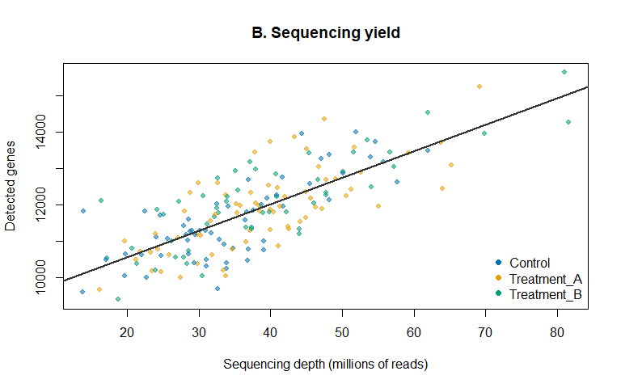
<p class="caption">

Panel B: sequencing depth and detected genes.
</p>

</div>

## 39.5 Panel C: show multivariate sample structure

``` r
plot(
  pca_scores$PC1,
  pca_scores$PC2,
  pch = 19,
  col = pca_colours[pca_scores$Group],
  xlab = paste0("PC1 (", round(variance_explained[1], 1), "%)"),
  ylab = paste0("PC2 (", round(variance_explained[2], 1), "%)"),
  main = "C. Expression PCA"
)
legend("topright", legend = names(pca_colours),
       col = pca_colours, pch = 19, bty = "n")
```

<div class="figure" style="text-align: center">

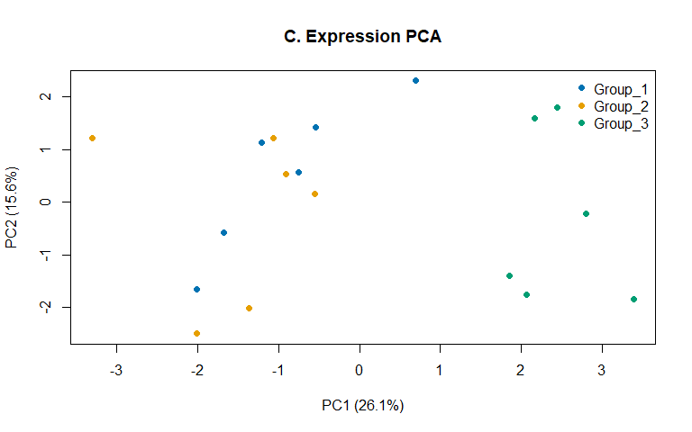
<p class="caption">

Panel C: PCA of expression profiles.
</p>

</div>

## 39.6 Interpretation checklist

- Panel A preserves participant-level variation.
- Panel B shows association without claiming causality.
- Panel C reports variance explained on each axis.
- Colour meaning is consistent within each analytical context.
- Every axis contains a meaningful label.
- Captions define the observational unit and visual summaries.

For a manuscript, assemble panels only after each one is correct at its
final dimensions. Do not stretch panels independently in a word
processor.

# 40. A Figure Review Checklist

## Scientific content

- Does the graph answer one defined question?
- Is the observational unit clear?
- Are groups and denominators correct?
- Are uncertainty and repeated measurements represented properly?
- Are transformations and thresholds justified?

## Visual design

- Is the chart type appropriate?
- Are axes honest and labelled with units?
- Are categories ordered meaningfully?
- Is text readable at final size?
- Is colour accessible and consistent?
- Can unnecessary legend, border, grid or decoration be removed?

## Reproducibility

- Is the figure generated entirely from code?
- Is the random seed stored for simulated or jittered elements?
- Are package versions recorded?
- Are dimensions and export formats specified?
- Does the caption explain methods needed for interpretation?

# 41. Common Mistakes

## Mistake 1: Selecting a chart before defining the question

Start with variables, units and the intended comparison.

## Mistake 2: Plotting only means for continuous data

Show distributions or participant-level points when feasible.

## Mistake 3: Using a line for unordered categories

Lines imply an ordered connection.

## Mistake 4: Confusing `geom_bar()` and `geom_col()`

The first counts rows; the second uses supplied heights.

## Mistake 5: Mapping a fixed colour inside `aes()`

This can create an unwanted legend and categorical mapping.

## Mistake 6: Leaving error bars undefined

State SD, SE, CI, IQR or another exact quantity.

## Mistake 7: Using a rainbow palette for ordered values

Use a perceptually ordered sequential or diverging palette.

## Mistake 8: Using colour as the only distinction

Add shape, line type, labels or facets.

## Mistake 9: Exporting at the wrong physical size

Design at final width and test readability.

## Mistake 10: Editing the final figure manually

Put titles, colours, labels and annotations in reproducible code.

# 42. Chapter Summary

- A scientific figure is an analytical and communication tool.
- Chart selection follows the scientific question and variable types.
- Base R graphics use high-level plots and low-level annotation
  functions.
- `ggplot2` combines data, aesthetic mappings, geometries, scales,
  facets and themes.
- Mapping inside `aes()` differs from setting a fixed visual property.
- Bar charts show categories; histograms show continuous intervals.
- ECDFs avoid bin and bandwidth choices.
- Boxplots should often be supplemented by raw observations.
- Scatterplots reveal relationships but do not prove causality.
- Lines should connect meaningful ordered observations.
- SD, SE and confidence intervals answer different questions.
- Heatmap scaling determines what colour represents.
- PCA plots require metadata and loading context.
- Volcano, Manhattan and forest plots each encode different scientific
  quantities.
- Qualitative, sequential and diverging palettes serve different data
  types.
- Accessible figures do not rely on colour alone.
- Bar axes should generally begin at zero.
- Vector formats suit line art; raster formats suit pixel images and
  dense plots.
- Final physical dimensions determine readable font and point sizes.
- Reproducible code should generate the complete figure and caption
  information.

# 43. Check Your Understanding

1.  What five questions should be answered before plotting?
2.  How does an exploratory figure differ from an explanatory figure?
3.  When should `geom_bar()` be used instead of `geom_col()`?
4.  What is the difference between mapping and setting colour in
    `ggplot2`?
5.  Why should continuous data not be summarized only by a mean bar?
6.  How does an ECDF differ from a density plot?
7.  When does a line plot imply a valid connection?
8.  What do SD, SE and 95% CI error bars communicate?
9.  Why can overlapping group CIs not directly test a group difference?
10. What does row scaling mean in an expression heatmap?
11. What information should appear on PCA axis labels?
12. Why does a volcano plot not replace an MA plot or abundance plot?
13. Why should Manhattan-plot peaks not be counted as independent
    variants?
14. Which colour scale suits values above and below zero?
15. Why should a bar chart usually begin at zero?
16. When is PDF preferable to PNG?
17. How many pixels wide is a 6-inch figure at 600 DPI?

# 44. R Exercises

## Exercise 1: Chart selection

For ten biological questions, identify the variable types and choose a
graph. Explain each choice.

## Exercise 2: Base and ggplot2

Create the same scatterplot in base R and `ggplot2`. Match colours, axis
labels and title.

## Exercise 3: Categorical data

Create count, grouped and 100% stacked bar charts for treatment and
response. Explain each denominator.

## Exercise 4: Numerical distribution

Plot one biomarker using a histogram, density curve, ECDF, boxplot and
raw points. State what each view reveals or hides.

## Exercise 5: Overplotting

Simulate 10,000 points. Compare opaque points, transparent points,
smaller points and two-dimensional binning.

## Exercise 6: Repeated measurements

Create a spaghetti plot and group mean plot for 30 participants at five
visits. Label the uncertainty correctly.

## Exercise 7: Heatmap

Simulate a 20-gene by 12-sample matrix. Compare unscaled values, row
z-scores and column z-scores.

## Exercise 8: Omics plots

Create volcano and Manhattan plots with explicit thresholds and
selective labels.

## Exercise 9: Accessibility

Redesign a red–green figure using the Okabe–Ito palette plus shapes or
line types.

## Exercise 10: Export

Export the same figure as 300-DPI PNG, 600-DPI TIFF and vector PDF.
Compare file size and appearance at final width.

# 45. Mini-Project: Publication-Ready Multi-Omics Figure

Create or simulate a study with phenotype, RNA-seq and genotype-summary
data. Produce a four-panel figure containing:

1.  a participant-level phenotype comparison;
2.  a sequencing-QC relationship;
3.  an expression PCA plot; and
4.  either a volcano or Manhattan plot.

Your workflow should:

- define the purpose of every panel;
- state the observational unit;
- use a consistent accessible palette;
- show raw data where practical;
- label units and uncertainty;
- avoid unnecessary legends and decoration;
- include panel-specific captions;
- export at a prespecified physical size;
- produce both PNG and PDF versions;
- record the software environment; and
- include a final review using the chapter checklist.

# 46. Glossary

| Term | Plain-language definition |
|----|----|
| Aesthetic mapping | Connection between a data variable and a visual property |
| Geometry | Visual mark such as point, line, bar or box |
| Scale | Rule mapping data values to visual values |
| Facet | Repeated panel showing subsets with a common design |
| Theme | Non-data styling of a `ggplot2` figure |
| Histogram | Binned display of a continuous distribution |
| Density plot | Smoothed estimate of a continuous distribution |
| ECDF | Cumulative proportion at or below every observed value |
| Boxplot | Compact display of median, IQR, whiskers and potential outliers |
| Violin plot | Mirrored smoothed-density display |
| Overplotting | Points hide one another because they overlap |
| Spaghetti plot | Individual trajectories connected across time |
| Error bar | Graphical interval whose statistical meaning must be defined |
| Heatmap | Matrix represented through coloured cells |
| PCA plot | Low-dimensional view of major variance directions |
| Volcano plot | Effect size versus negative log p-value plot |
| Manhattan plot | Genomic position versus negative log p-value plot |
| Forest plot | Estimates with confidence intervals |
| Qualitative palette | Distinct colours for unordered groups |
| Sequential palette | Ordered colours for low-to-high values |
| Diverging palette | Two colour directions around a meaningful midpoint |
| Raster graphic | Pixel-based image |
| Vector graphic | Shape-based image scalable without pixelation |
| DPI | Dots or pixels per inch for raster output |
| Visual hierarchy | Use of emphasis to direct reader attention |

# 47. References

1.  Cleveland, W. S. (1993). *Visualizing Data*. Hobart Press.

2.  Cleveland, W. S. (1994). *The Elements of Graphing Data* (2nd ed.).
    Hobart Press.

3.  Tufte, E. R. (2001). *The Visual Display of Quantitative
    Information* (2nd ed.). Graphics Press.

4.  Wilkinson, L. (2005). *The Grammar of Graphics* (2nd ed.). Springer.

5.  Wickham, H. (2016). *ggplot2: Elegant Graphics for Data Analysis*.
    Springer.

6.  Wilke, C. O. (2019). *Fundamentals of Data Visualization*. O’Reilly
    Media.

7.  Healy, K. (2018). *Data Visualization: A Practical Introduction*.
    Princeton University Press.

8.  Munzner, T. (2014). *Visualization Analysis and Design*. CRC Press.

9.  Brewer, C. A. (1994). Color use guidelines for mapping and
    visualization. In A. M. MacEachren & D. R. F. Taylor (Eds.),
    *Visualization in Modern Cartography*. Pergamon.

10. Weissgerber, T. L., Milic, N. M., Winham, S. J., & Garovic, V. D.
    (2015). Beyond bar and line graphs: time for a new data presentation
    paradigm. *PLoS Biology*, 13(4), e1002128.

11. Rougier, N. P., Droettboom, M., & Bourne, P. E. (2014). Ten simple
    rules for better figures. *PLoS Computational Biology*, 10(9),
    e1003833.

12. R Core Team. *R: A Language and Environment for Statistical
    Computing*. R Foundation for Statistical Computing, Vienna, Austria.

------------------------------------------------------------------------

# 48. Reproducibility Information

``` r
sessionInfo()
```

    ## R version 4.5.3 (2026-03-11 ucrt)
    ## Platform: x86_64-w64-mingw32/x64
    ## Running under: Windows 11 x64 (build 26200)
    ## 
    ## Matrix products: default
    ##   LAPACK version 3.12.1
    ## 
    ## locale:
    ## [1] LC_COLLATE=English_United States.utf8 
    ## [2] LC_CTYPE=English_United States.utf8   
    ## [3] LC_MONETARY=English_United States.utf8
    ## [4] LC_NUMERIC=C                          
    ## [5] LC_TIME=English_United States.utf8    
    ## 
    ## time zone: Asia/Calcutta
    ## tzcode source: internal
    ## 
    ## attached base packages:
    ## [1] stats     graphics  grDevices utils     datasets  methods   base     
    ## 
    ## loaded via a namespace (and not attached):
    ##  [1] vctrs_0.7.3        nlme_3.1-168       cli_3.6.6          knitr_1.51        
    ##  [5] rlang_1.2.0        xfun_0.57          generics_0.1.4     S7_0.2.2          
    ##  [9] labeling_0.4.3     glue_1.8.1         htmltools_0.5.9    scales_1.4.0      
    ## [13] rmarkdown_2.31     grid_4.5.3         evaluate_1.0.5     tibble_3.3.1      
    ## [17] fastmap_1.2.0      yaml_2.3.12        lifecycle_1.0.5    compiler_4.5.3    
    ## [21] dplyr_1.2.1        RColorBrewer_1.1-3 pkgconfig_2.0.3    mgcv_1.9-4        
    ## [25] rstudioapi_0.19.0  lattice_0.22-9     farver_2.1.2       digest_0.6.39     
    ## [29] R6_2.6.1           tidyselect_1.2.1   dichromat_2.0-1    splines_4.5.3     
    ## [33] pillar_1.11.1      magrittr_2.0.5     Matrix_1.7-4       withr_3.0.3       
    ## [37] tools_4.5.3        gtable_0.3.6       ggplot2_4.0.3

> **Next chapter:** Probability: Foundations for Statistical Inference
