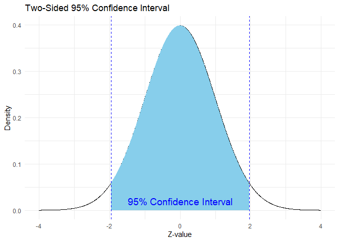

# Confidence Interval

A **confidence interval (CI)** gives a **range of values** likely to
contain the **true population parameter** (like the mean), based on
sample data.

> **Explanation**: Suppose you’re trying to guess the average height of
> all people in your city by measuring only 100 people. A CI says, “I’m
> fairly confident the real average height lies **between X and Y**.”

## Point Estimate vs Confidence Interval

<table>
<colgroup>
<col style="width: 19%" />
<col style="width: 80%" />
</colgroup>
<thead>
<tr>
<th>Concept</th>
<th>Description</th>
</tr>
</thead>
<tbody>
<tr>
<td><strong>Point Estimate</strong></td>
<td>A single best guess of the population parameter (e.g., sample
mean).</td>
</tr>
<tr>
<td><strong>CI</strong></td>
<td>A <strong>range</strong> around the point estimate that likely
contains the true value.</td>
</tr>
</tbody>
</table>

#### Example:

> Point estimate: Average height = 170 cm

> 95% CI = \[168 cm, 172 cm\]

### One-Sided vs Two-Sided Confidence Intervals

<table>
<colgroup>
<col style="width: 17%" />
<col style="width: 82%" />
</colgroup>
<thead>
<tr>
<th>Type</th>
<th>Description</th>
</tr>
</thead>
<tbody>
<tr>
<td><strong>Two-Sided CI</strong></td>
<td>Accounts for uncertainty <strong>both above and below</strong> the
estimate (e.g., 95%).</td>
</tr>
<tr>
<td><strong>One-Sided CI</strong></td>
<td>Only looks in <strong>one direction</strong> (e.g., “greater than”
or “less than”).</td>
</tr>
</tbody>
</table>

#### Example:

-   **Two-sided 95% CI: \[168, 172\] → “The mean is likely between these
    values.”**
-   **One-sided 95% CI: “Mean is greater than 169” or “Mean is less than
    171”.**

### Common Confidence Levels

<table>
<colgroup>
<col style="width: 19%" />
<col style="width: 80%" />
</colgroup>
<thead>
<tr>
<th>Confidence Level</th>
<th>Meaning</th>
</tr>
</thead>
<tbody>
<tr>
<td><strong>90%</strong></td>
<td>You’re 90% sure the interval contains the true value.</td>
</tr>
<tr>
<td><strong>95%</strong></td>
<td>You’re 95% confident — most commonly used.</td>
</tr>
<tr>
<td><strong>99%</strong></td>
<td>Very confident, but wider interval (more margin for
uncertainty).</td>
</tr>
</tbody>
</table>

> Higher confidence = **wider interval** (more cautious) Lower
> confidence = **narrower interval** (more precise but less confident)

#### CI Formula for Sample Mean

$$
\large CI = \bar{x} \pm  Z \cdot \frac{s}{\sqrt n}
$$

Where:

-   *x̄*: Sample mean
-   *Z*: Z-score based on confidence level (1.96 for 95%)
-   *s*: Sample standard deviation
-   *n*: Sample Size

### How std, n, and Confidence Level Affect CI

<table>
<colgroup>
<col style="width: 33%" />
<col style="width: 66%" />
</colgroup>
<thead>
<tr>
<th>Parameter</th>
<th>Impact on CI</th>
</tr>
</thead>
<tbody>
<tr>
<td><strong>Standard Deviation (s)</strong></td>
<td>Higher s ⇒ <strong>wider</strong> CI (more variability in data)</td>
</tr>
<tr>
<td><strong>Sample Size (n)</strong></td>
<td>Larger n ⇒ <strong>narrower</strong> CI (more reliable
estimate)</td>
</tr>
<tr>
<td><strong>Confidence Level</strong></td>
<td>Higher confidence ⇒ <strong>wider</strong> CI (more
conservative)</td>
</tr>
</tbody>
</table>

#### Summary

-   CI provides a range, not just a guess.

-   Point estimate is precise but risky; CI is safer and more
    informative.

-   Choose 95% CI for standard work; 99% for critical decisions.

-   More data (higher **n**) or lower spread (low s) leads to better
    estimates.
