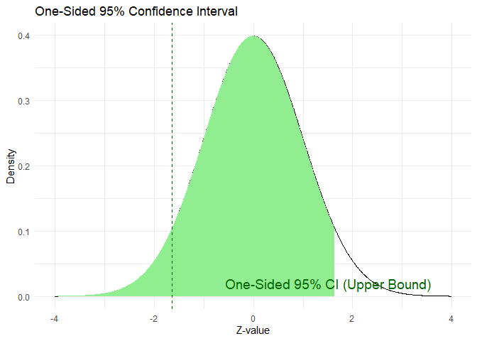
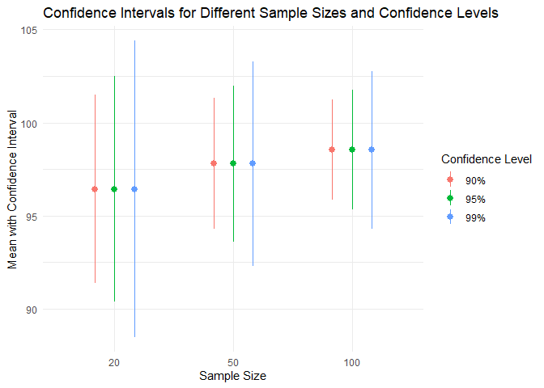

# Confidence Interval

A **confidence interval (CI)** gives a **range of values** likely to
contain the **true population parameter** (like the mean), based on
sample data.

> **Explanation**: Suppose you’re trying to guess the average height of
> all people in your city by measuring only 100 people. A CI says, “I’m
> fairly confident the real average height lies **between X and Y**.”

## Point Estimate vs Confidence Interval

<table>
<colgroup>
<col style="width: 19%" />
<col style="width: 80%" />
</colgroup>
<thead>
<tr>
<th>Concept</th>
<th>Description</th>
</tr>
</thead>
<tbody>
<tr>
<td><strong>Point Estimate</strong></td>
<td>A single best guess of the population parameter (e.g., sample
mean).</td>
</tr>
<tr>
<td><strong>CI</strong></td>
<td>A <strong>range</strong> around the point estimate that likely
contains the true value.</td>
</tr>
</tbody>
</table>

#### Example:

> Point estimate: Average height = 170 cm

> 95% CI = \[168 cm, 172 cm\]

## One-Sided vs Two-Sided Confidence Intervals

### Two-Sided Confidence Interval

-   It captures uncertainty **both above and below** the estimate.
-   **Used when we are unsure of the direction** of the effect or
    change.

#### Example (Two-sided):

> You’re measuring the average height of a group. You don’t know if it’s
> taller or shorter than the national average.

> So you check **both sides**: “We are 95% confident the true average
> lies **between** 168 cm and 172 cm.”

#### Two-Sided Confidence Interval (95%)

### One-Sided Confidence Interval

-   It checks uncertainty in **only one direction**.

-   **Used when you care only if it’s higher or lower** than a value.

#### Example (One-sided):

> You want to **prove a medicine increases blood pressure**. You don’t
> care if it lowers it. → You use a **one-sided test**: “We are 95%
> confident the average pressure is **greater than 130 mmHg.**”

#### One-Sided Confidence Interval (Lower Bound)

#### One-Sided Confidence Interval (Upper Bound)

### Mathematical Formula

For a sample mean *x̄*, standard deviation *s*, and sample size *n*:

#### CI Formula for Sample Mean

#### Standard Error

$$
\large SE = \frac{s}{\sqrt n}
$$

$$
\large CI = \bar{x} \pm  Z \cdot \frac{s}{\sqrt n}
$$

Where:

-   *x̄*: Sample mean
-   *Z*: Z-score based on confidence level (1.96 for 95%)
-   *s*: Sample standard deviation
-   *n*: Sample Size

#### Two sided CI (e.g. 95%)

*x̄* ± *Z* ⋅ SE

Where:

*Z* = 1.96 for 95%

#### One Sided CI (Upper or Lower)

-   **Lower Bound** (for testing if it’s **greater** than)

*x̄* − *Z* ⋅ SE, ∞

-   **Upper Bound** (for testing if it’s **lesser** than)

∞, *x̄* + *Z* ⋅ SE

> For **one-sided 95%, Z = 1.645** (less extreme than two sided 1.96)

<table>
<colgroup>
<col style="width: 17%" />
<col style="width: 82%" />
</colgroup>
<thead>
<tr>
<th>Type</th>
<th>Description</th>
</tr>
</thead>
<tbody>
<tr>
<td><strong>Two-Sided CI</strong></td>
<td>Accounts for uncertainty <strong>both above and below</strong> the
estimate (e.g., 95%).</td>
</tr>
<tr>
<td><strong>One-Sided CI</strong></td>
<td>Only looks in <strong>one direction</strong> (e.g., “greater than”
or “less than”).</td>
</tr>
</tbody>
</table>

    ## Two-sided 95% CI: 98.7 103.31

    ## One-sided 95% CI (Lower Bound Only): 99.07 to ∞

    ## One-sided 95% CI (Upper Bound Only): -∞ to 102.94

### Common Confidence Levels

<table>
<colgroup>
<col style="width: 19%" />
<col style="width: 80%" />
</colgroup>
<thead>
<tr>
<th>Confidence Level</th>
<th>Meaning</th>
</tr>
</thead>
<tbody>
<tr>
<td><strong>90%</strong></td>
<td>You’re 90% sure the interval contains the true value.</td>
</tr>
<tr>
<td><strong>95%</strong></td>
<td>You’re 95% confident — most commonly used.</td>
</tr>
<tr>
<td><strong>99%</strong></td>
<td>Very confident, but wider interval (more margin for
uncertainty).</td>
</tr>
</tbody>
</table>

### Effect of Confidence level on confidence interval

-   The **confidence level** tells you **how sure you want to be** that
    your CI includes the true value.

-   **Higher confidence = wider interval** (You’re being more cautious
    by allowing a bigger range to ensure you capture the truth.)

> Think of throwing darts blindfolded:

> -   **90% confident → narrower area, you take more risk.**
> -   **99% confident → very wide area, but you’re more sure the dart
>     lands there.**

-   *Z* increases as confidence increases:
    -   90% CI → *Z* = 1.645
    -   95% CI → *Z* = 1.96
    -   99% CI → *Z* = 2.576

-   The **curve shapes are the same** (same mean and SD).
-   CI width increases as confidence increases:
    -   **90% CI** is the narrowest.
    -   **99% CI** is the widest.

> Higher confidence = **wider interval** (more cautious) Lower
> confidence = **narrower interval** (more precise but less confident)

### Effect of Standard deviation on confidence interval

-   **Standard deviation (SD)** measures how spread out the data is.
-   **Larger SD** ⇒ **more uncertainty** ⇒ wider CI
-   Even if two groups have the **same sample size and mean**, the one
    with a higher SD will have a **wider confidence interval**.

> Think of trying to measure the average height of a group. If people’s
> heights vary a lot (high SD), you’ll be **less certain** about the
> average — so the CI will be wider.

-   **Narrowest bell curve** (smallest SD) will have the **tightest
    CI**.
-   **Widest bell curve** (largest SD) will have the **widest CI**.
-   All distributions are centered at the same mean.

### Effect of Sample size (n) on confidence interval

-   **Larger sample size ⇒ more information ⇒ narrower CI**
-   The more people you survey, the more accurate your estimate becomes.

> If you measure the height of only 5 people, your estimate is
> uncertain. Measure 500 people? Your estimate is much more precise, and
> the confidence interval is tighter.

-   $\frac {s}{\sqrt n}$ = Standard error
-   A n **increases**, **SE decreases**, so CI becomes **narrower**

-   All curves look the **same shape** (because SD is fixed).
-   CI width is:
    -   **Widest for n = 10**
    -   **Narrower for n = 30**
    -   **Narrowest for n = 100**

### How standard deviation, sample size, and Confidence Level Affect CI

<table>
<colgroup>
<col style="width: 33%" />
<col style="width: 66%" />
</colgroup>
<thead>
<tr>
<th>Parameter</th>
<th>Impact on CI</th>
</tr>
</thead>
<tbody>
<tr>
<td><strong>Standard Deviation (s)</strong></td>
<td>Higher s ⇒ <strong>wider</strong> CI (more variability in data)</td>
</tr>
<tr>
<td><strong>Sample Size (n)</strong></td>
<td>Larger n ⇒ <strong>narrower</strong> CI (more reliable
estimate)</td>
</tr>
<tr>
<td><strong>Confidence Level</strong></td>
<td>Higher confidence ⇒ <strong>wider</strong> CI (more
conservative)</td>
</tr>
</tbody>
</table>

#### Summary

-   CI provides a range, not just a guess.

-   Point estimate is precise but risky; CI is safer and more
    informative.

-   Choose 95% CI for standard work; 99% for critical decisions.

-   More data (higher **n**) or lower spread (low s) leads to better
    estimates.
