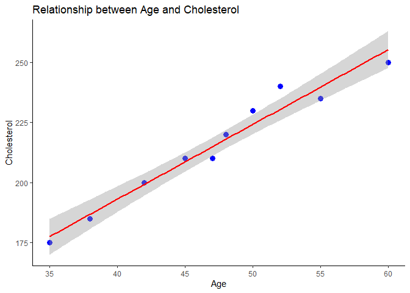
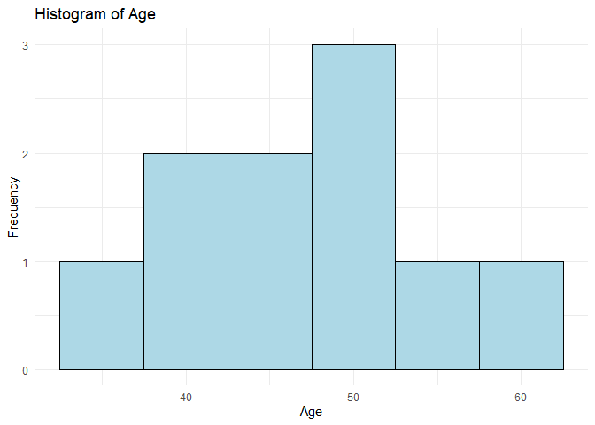
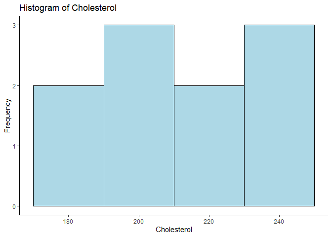
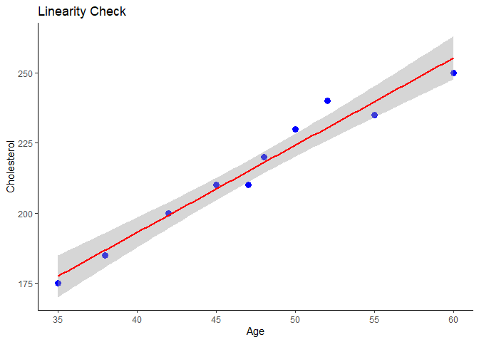

# Correlation Analysis

## Introduction

A *correlation analysis* is a statistical method used to examine the
strength and direction of the relationship between two continuous
variables.

### Pearson Correlation Calculation

The Pearson correlation coefficient is calculated using:

$$
\large r = \frac{\sum (x\_i - \bar{x}) (y\_i - \bar{y})}{\sqrt{\sum (x\_i - \bar{x})^2 \sum (y\_i - \bar{y})^2}}
$$

where:

-   *x**i* and *y**i* are the individual sample
    points.
-   *x̄* and *ȳ* are means of *x* and *y*.
-   ∑(*x**i* − *x̄*) ∑(*y**i* − *ȳ*) is the
    cross-product of deviations.
-   ∑(*x**i* − *x̄*)2 and (y\_i - {y})^2 are the
    sum of of squared deviations.

The most commonly used correlation coefficient is **Pearson’s
correlation coefficient**, which measures the linear relationship
between two variables. Pearson’s correlation coefficient, denoted by
“r,” takes on values between -1 and 1, where a value of -1 indicates a
perfect negative correlation, a value of 0 indicates no correlation, and
a value of 1 indicates a perfect positive correlation.

$$
\large -1 \leq r \leq 1
$$

where:

-   *r* = −1 indicates a perfect negative correlation,
-   *r* = 0 indicates no correlation,
-   *r* = 1 indicates a perfect positive correlation.

To perform a correlation analysis, we first must collect data on the two
variables of interest. Once we have the data, we can calculate the
correlation coefficient using R.

For example, suppose we want to examine the relationship between a
person’s age and their cholesterol level. We collect data on 100
individuals and obtained the following data:

## Example Dataset

We will examine the relationship between a person’s age and their
cholesterol level using sample data:

    # Load necessary libraries
    library(ggplot2)

    # Create age and cholesterol vectors
    age <- c(45, 38, 52, 60, 35, 42, 48, 55, 50, 47)
    cholesterol <- c(210, 185, 240, 250, 175, 200, 220, 235, 230, 210)

    # Combine the vectors into a dataframe
    mydata <- data.frame(age = age, cholesterol = cholesterol)

### Data Representation

<table>
<thead>
<tr class="header">
<th style="text-align: right;">age</th>
<th style="text-align: right;">cholesterol</th>
</tr>
</thead>
<tbody>
<tr class="odd">
<td style="text-align: right;">45</td>
<td style="text-align: right;">210</td>
</tr>
<tr class="even">
<td style="text-align: right;">38</td>
<td style="text-align: right;">185</td>
</tr>
<tr class="odd">
<td style="text-align: right;">52</td>
<td style="text-align: right;">240</td>
</tr>
<tr class="even">
<td style="text-align: right;">60</td>
<td style="text-align: right;">250</td>
</tr>
<tr class="odd">
<td style="text-align: right;">35</td>
<td style="text-align: right;">175</td>
</tr>
<tr class="even">
<td style="text-align: right;">42</td>
<td style="text-align: right;">200</td>
</tr>
<tr class="odd">
<td style="text-align: right;">48</td>
<td style="text-align: right;">220</td>
</tr>
<tr class="even">
<td style="text-align: right;">55</td>
<td style="text-align: right;">235</td>
</tr>
<tr class="odd">
<td style="text-align: right;">50</td>
<td style="text-align: right;">230</td>
</tr>
<tr class="even">
<td style="text-align: right;">47</td>
<td style="text-align: right;">210</td>
</tr>
</tbody>
</table>

## Scatter Plot

    ggplot(mydata, aes(x = age, y = cholesterol)) + 
      geom_point(color = "blue", size = 3) + 
      geom_smooth(method = "lm", col = "red") +
      labs(title = "Relationship between Age and Cholesterol", x = "Age", y = "Cholesterol") +
      theme_classic()

    ## `geom_smooth()` using formula = 'y ~ x'

## Assumptions of Pearson Correlation

### 1. Normality Check

#### Histogram of Age

    ggplot(mydata, aes(x = age)) +
      geom_histogram(binwidth = 5, fill = "lightblue", color = "black") +
      labs(title = "Histogram of Age", x = "Age", y = "Frequency") +
      theme_classic()

#### Histogram of Cholesterol

    ggplot(mydata, aes(x = cholesterol)) +
      geom_histogram(binwidth = 20, fill = "lightblue", color = "black") +
      labs(title = "Histogram of Cholesterol", x = "Cholesterol", y = "Frequency") +
      theme_classic()

### Shapiro-Wilk Test

The Shapiro-Wilk test is a statistical test used to check the normality
assumption of a population or a sample. It was developed by Samuel
Shapiro and Martin Wilk in 1965.

The null hypothesis of the Shapiro-Wilk test is that the population is
normally distributed. The alternative hypothesis is that the population
is not normally distributed.

The test is based on the correlation between the data and the normal
probability plot (also known as the normal quantile plot). The normal
probability plot is a graphical method to check the normality
assumption. It plots the observed data against the expected values from
a normal distribution. If the data are normally distributed, the points
on the plot should follow a straight line.

The Shapiro-Wilk test is widely used in many fields, such as psychology,
biology, economics, and finance, to check the normality assumption
before applying parametric statistical methods that assume normality,
such as t-tests and ANOVA.

There are several alternative tests that can be used to assess normality
assumptions, depending on the type of data and the research question.
Here are a few examples: Anderson-Darling test, Kolmogorov-Smirnov test,
Normal probability plots, etc

#### Shapiro-Wilk Test for Normality

    shapiro.test(mydata$age) 

    ## 
    ##  Shapiro-Wilk normality test
    ## 
    ## data:  mydata$age
    ## W = 0.99077, p-value = 0.9977

    shapiro.test(mydata$cholesterol)

    ## 
    ##  Shapiro-Wilk normality test
    ## 
    ## data:  mydata$cholesterol
    ## W = 0.96909, p-value = 0.8823

### 2. Linearity Check

    ggplot(mydata, aes(x = age, y = cholesterol)) + 
      geom_point(color = "blue", size = 3) + 
      geom_smooth(method = "lm", col = "red") +
      labs(title = "Linearity Check", x = "Age", y = "Cholesterol") +
      theme_classic()

    ## `geom_smooth()` using formula = 'y ~ x'

<table>
<thead>
<tr class="header">
<th style="text-align: right;">age</th>
<th style="text-align: right;">cholesterol</th>
</tr>
</thead>
<tbody>
<tr class="odd">
<td style="text-align: right;">45</td>
<td style="text-align: right;">210</td>
</tr>
<tr class="even">
<td style="text-align: right;">38</td>
<td style="text-align: right;">185</td>
</tr>
<tr class="odd">
<td style="text-align: right;">52</td>
<td style="text-align: right;">240</td>
</tr>
<tr class="even">
<td style="text-align: right;">60</td>
<td style="text-align: right;">250</td>
</tr>
<tr class="odd">
<td style="text-align: right;">35</td>
<td style="text-align: right;">175</td>
</tr>
<tr class="even">
<td style="text-align: right;">42</td>
<td style="text-align: right;">200</td>
</tr>
<tr class="odd">
<td style="text-align: right;">48</td>
<td style="text-align: right;">220</td>
</tr>
<tr class="even">
<td style="text-align: right;">55</td>
<td style="text-align: right;">235</td>
</tr>
<tr class="odd">
<td style="text-align: right;">50</td>
<td style="text-align: right;">230</td>
</tr>
<tr class="even">
<td style="text-align: right;">47</td>
<td style="text-align: right;">210</td>
</tr>
</tbody>
</table>

**Step 1: Compute the Means**

The mean of a dataset is calculated as:

$$
\bar{x} = \frac{\sum x\_i}{n}, \quad \bar{y} = \frac{\sum y\_i}{n}
$$

For our dataset:

$$
\bar{x} = \frac{45+38+52+60+35+42+48+55+50+47}{10} = \frac{472}{10} = 47.2
$$

$$
\bar{y} = \frac{210+185+240+250+175+200+220+235+230+210}{10} = \frac{2155}{10} = 215.5
$$

**Step 2: Compute Deviations and Squared Deviations**

<table>
<colgroup>
<col style="width: 16%" />
<col style="width: 19%" />
<col style="width: 19%" />
<col style="width: 19%" />
<col style="width: 26%" />
</colgroup>
<thead>
<tr class="header">
<th>Age (<em>X</em><em>i</em>)</th>
<th>Cholesterol (<em>Y</em><em>i</em>)</th>
<th><em>X</em><em>i</em> − <em>X̄</em></th>
<th><em>Y</em><em>i</em> − <em>Ȳ</em></th>
<th>(<em>X</em><em>i</em> − <em>X̄</em>)(<em>Y</em><em>i</em> − <em>Ȳ</em>)</th>
</tr>
</thead>
<tbody>
<tr class="odd">
<td>45</td>
<td>210</td>
<td>-2.2</td>
<td>-5.5</td>
<td>12.1</td>
</tr>
<tr class="even">
<td>38</td>
<td>185</td>
<td>-9.2</td>
<td>-30.5</td>
<td>280.6</td>
</tr>
<tr class="odd">
<td>52</td>
<td>240</td>
<td>4.8</td>
<td>24.5</td>
<td>117.6</td>
</tr>
<tr class="even">
<td>60</td>
<td>250</td>
<td>12.8</td>
<td>34.5</td>
<td>441.6</td>
</tr>
<tr class="odd">
<td>35</td>
<td>175</td>
<td>-12.2</td>
<td>-40.5</td>
<td>494.1</td>
</tr>
<tr class="even">
<td>42</td>
<td>200</td>
<td>-5.2</td>
<td>-15.5</td>
<td>80.6</td>
</tr>
<tr class="odd">
<td>48</td>
<td>220</td>
<td>0.8</td>
<td>4.5</td>
<td>3.6</td>
</tr>
<tr class="even">
<td>55</td>
<td>235</td>
<td>7.8</td>
<td>19.5</td>
<td>152.1</td>
</tr>
<tr class="odd">
<td>50</td>
<td>230</td>
<td>2.8</td>
<td>14.5</td>
<td>40.6</td>
</tr>
<tr class="even">
<td>47</td>
<td>210</td>
<td>-0.2</td>
<td>-5.5</td>
<td>1.1</td>
</tr>
</tbody>
</table>

The deviation from the mean is given by:

*x*′*i* = (*x**i* − *x̄*),  *y*′*i* = (*y**i* − *ȳ*)

The squared deviations are:

(*x*′*i*)2 = (*x**i* − *x̄*)2,  (*y*′*i*)2 = (*y**i* − *ȳ*)2

The cross-product of deviations:

(*x*′*i**y*′*i*) = (*x**i* − *x̄*)(*y**i* − *ȳ*)

------------------------------------------------------------------------

**Step 3: Compute Summations**

∑(*x*′*i**y*′*i*),  ∑(*x*′*i*)2,  ∑(*y*′*i*)2

∑(*X*′*i**Y*′*i*) = 1624.3

∑(*X*′*i*)2 = 521.76

∑(*Y*′*i*)2 = 5272.5

------------------------------------------------------------------------

**Step 4: Compute Pearson Correlation Coefficient**

The Pearson correlation coefficient is calculated as:

$$
r = \frac{\sum (X\_i - \bar{X}) (Y\_i - \bar{Y})}{\sqrt{\sum (X\_i - \bar{X})^2 \sum (Y\_i - \bar{Y})^2}}
$$

Substituting values:

$$
r = \frac{1624.3}{\sqrt{521.76 \times 5272.5}}
$$

$$
r = \frac{1624.3}{\sqrt{2751143.6}}
$$

$$
r = \frac{1624.3}{1658.6}
$$

*r* = 0.98

------------------------------------------------------------------------

**Step 5: Statistical Significance Test**

We test the null hypothesis:

*H*0 : There is no correlation  (*r* = 0)

The test statistic is calculated using:

$$
t = \frac{r \sqrt{n-2}}{\sqrt{1 - r^2}}
$$

Substituting values:

$$
t = \frac{0.98 \times \sqrt{10-2}}{\sqrt{1 - 0.98^2}}
$$

$$
t = \frac{0.98 \times \sqrt{8}}{\sqrt{1 - 0.9604}}
$$

$$
t = \frac{0.98 \times 2.83}{\sqrt{0.0396}}
$$

$$
t = \frac{2.77}{0.199}
$$

*t* = 13.94

Using a **t-distribution table for 8 degrees of freedom** at *α* = 0.05:

*t**c**r**i**t**i**c**a**l* = 2.306

Since *t* = 13.94 &gt; 2.306, we **reject** *H*0 and conclude
that the correlation is **statistically significant**.

    cor(mydata$age, mydata$cholesterol)

    ## [1] 0.9792846

### Statistical Significance Test

    cor.test(mydata$age, mydata$cholesterol)

    ## 
    ##  Pearson's product-moment correlation
    ## 
    ## data:  mydata$age and mydata$cholesterol
    ## t = 13.679, df = 8, p-value = 7.858e-07
    ## alternative hypothesis: true correlation is not equal to 0
    ## 95 percent confidence interval:
    ##  0.9119540 0.9952539
    ## sample estimates:
    ##       cor 
    ## 0.9792846

## Spearman Rank Correlation

The spearman rank correlation is a non-parametric statistical method
used to measure the strength and direction of the association between
two variables. It is calculated by ranking the values of each variable
and calculating the correlation coefficient between their ranks. It is
robust to outliers and can be used with ordinal or non-normally
distributed data.

Let’s say we want to investigate the relationship between the amount of
hours that students spend studying for a test and their corresponding
test scores. We collect data from 10 students and get the following
results:

$$
\large \rho = 1 - \frac{6 \sum d\_i^2}{n(n^2 - 1)}
$$

where *d**i* is the difference between ranks.

### Example Data

    # Creating two vectors
    Hr_St <- c(2, 3, 5, 6, 7, 8, 9, 10, 12, 14)
    Test_score <- c(60, 70, 80, 85, 90, 95, 98, 100, 99, 95)

    # Combine the vectors into a dataframe
    mydata_spearman <- data.frame(Hr_St = Hr_St, Test_score = Test_score)

### Spearman Correlation Calculation

    cor.test(mydata_spearman$Hr_St, mydata_spearman$Test_score, method = "spearman")

    ## Warning in cor.test.default(mydata_spearman$Hr_St, mydata_spearman$Test_score,
    ## : Cannot compute exact p-value with ties

    ## 
    ##  Spearman's rank correlation rho
    ## 
    ## data:  mydata_spearman$Hr_St and mydata_spearman$Test_score
    ## S = 17.553, p-value = 0.0004919
    ## alternative hypothesis: true rho is not equal to 0
    ## sample estimates:
    ##       rho 
    ## 0.8936211

## Conclusion

-   Pearson’s correlation coefficient is used for linear relationships
    assuming normality.
-   Spearman’s correlation is robust to non-normal distributions and
    outliers.
-   The results indicate a **strong positive correlation** in both
    cases, implying a significant association between the variables.

#### References

1.  Pearson, K. (1895). “Notes on Regression and Inheritance in the Case
    of Two Parents.” *Proceedings of the Royal Society of London*,
    58(1), 240–242.
2.  Spearman, C. (1904). “The Proof and Measurement of Association
    between Two Things.” *The American Journal of Psychology*, 15(1),
    72–101.
3.  Shapiro, S. S., & Wilk, M. B. (1965). “An Analysis of Variance Test
    for Normality (Complete Samples).” *Biometrika*, 52(3-4), 591–611.
4.  Cohen, J. (1988). *Statistical Power Analysis for the Behavioral
    Sciences*. Routledge.

[⬅ Back to Home](../index.md)
