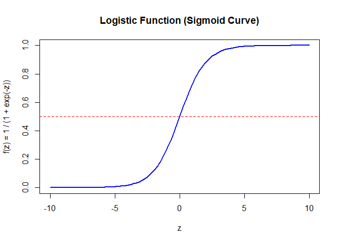

## 1. Introduction

Logistic regression is a statistical technique used to predict the
probability of a binary outcome. Unlike linear regression, which
estimates a continuous outcome, logistic regression is focused on
classification problems where the goal is to categorize outcomes into
distinct classes. The most common form of logistic regression is binary
logistic regression, used for outcomes that fall into two categories,
like predicting whether a patient has a disease (yes/no) or whether a
customer will purchase a product (buy/not buy).

Here’s how it works in simple terms:

-   Input Information: First, you gather information (data) about things
    that might affect the outcome. For instance, to predict rain, you’d
    consider factors like humidity, temperature, and maybe even wind
    speed.

-   Calculate Probability: Logistic regression uses this data to
    estimate the probability of a certain event happening. Instead of
    giving a precise “yes” or “no” right away, it calculates a
    probability between 0 and 1. For example, based on today’s humidity
    and temperature, there might be a 70% chance it will rain tomorrow.

-   Convert Probability to Decision: Once it has a probability, logistic
    regression converts this into a category. If the probability is over
    a certain threshold (like 50%), we could say, “Yes, it will rain.”
    If it’s below 50%, we’d say, “No, it won’t rain.”

In technical terms, logistic regression works by finding a best-fit line
(or curve) that separates different categories. So, instead of a
straight line, it creates an S-shaped curve that can classify data
points into one of the two categories based on probability.

## 2. The Logistic Function and the Sigmoid Curve

The heart of logistic regression is the logistic (sigmoid) function,
which maps any input to a value between 0 and 1. The logistic function
is given by:

$$
f(z) = \frac{1}{1 + e^{-z}}
$$

where: - *z* is a linear combination of predictor variables (i.e.,
*z* = *β*0 + *β*1*x*1 + *β*2*x*2 + … + *β**n**x**n*)

Here:

-   x1,x2,…,Xn are the predictor variables.

-   *β*0 is the intercept term,

-   *β*1, …, *β**n* are the coefficients for each
    predictor variable.

-   *f*(*z*) gives the probability of the outcome being in one of the
    binary classes.

Let’s define and plot the logistic function in R.

    # Define the logistic (sigmoid) function
    logistic_function <- function(z) {
      1 / (1 + exp(-z))
    }

    # Create a sequence of values for z to plot the curve
    z_values <- seq(-10, 10, length.out = 100)
    sigmoid_values <- logistic_function(z_values)

    # Plot the sigmoid curve
    plot(z_values, sigmoid_values, type = "l", lwd = 2, col = "blue",
         main = "Logistic Function (Sigmoid Curve)",
         xlab = "z", ylab = "f(z) = 1 / (1 + exp(-z))")
    abline(h = 0.5, col = "red", lty = 2)  # Add a horizontal line at 0.5

## 3. Probability Interpretation

In logistic regression, the probability that the dependent variable *y*
belongs to the class 1 (e.g., success) given the predictors *x* is
calculated using the logistic function:

$$
P(y=1 | x) = \frac{1}{1 + e^{-(\beta\_0 + \beta\_1 x\_1 + \beta\_2 x\_2 + \ldots + \beta\_n x\_n)}}
$$

-   *β*0 is the intercept,
-   *β*1, *β*2, …, *β**n* are the
    coefficients of the predictors
    *x*1, *x*2, …, *x**n*.

This formula gives the probability of the positive class (e.g., *y* = 1)
for a given set of predictor values.

### Classification Rule

In logistic regression, we classify the outcome based on the predicted
probability *P*(*y* = 1|*x*):

-   If *P*(*y* = 1|*x*) ≥ 0.5, we classify the outcome as *y* = 1 (e.g.,
    “positive”).
-   If *P*(*y* = 1|*x*) &lt; 0.5, we classify the outcome as *y* = 0
    (e.g., “negative”).

This threshold of 0.5 is standard, but it can be adjusted depending on
the context and the desired sensitivity of the classification.

## 4. Maximum Likelihood Estimation (MLE)

The coefficients *β* logistic regression are estimated using **Maximum
Likelihood Estimation (MLE)**. This method finds the values of *β* that
make the observed outcomes most probable under the logistic model.

### 1. Likelihood Function:

The likelihood function for logistic regression is used to estimate the
model coefficients by maximizing the probability of observing the given
outcomes. For a dataset with *n* observations, the likelihood function
*L*(*β*) is given by:

$$
L(\beta) = \prod\_{i=1}^n P(y\_i | x\_i)^{y\_i} \cdot (1 - P(y\_i | x\_i))^{1 - y\_i}
$$

where: - *y**i* represents the observed outcome for the
*i*-th observation, - *P*(*y**i*|*x**i*) is the
probability of *y**i* = 1 given predictors
*x**i*, - *β* represents the model coefficients.

Taking the log of the likelihood function, we obtain the log-likelihood
function, which is easier to maximize:

$$
\text{log } L(\beta) = \sum\_{i=1}^n \left( y\_i \cdot \log(P(y\_i | x\_i)) + (1 - y\_i) \cdot \log(1 - P(y\_i | x\_i)) \right)
$$

This log-likelihood function is maximized to find the optimal values of
the coefficients *β* in logistic regression.

### 3. Log-likelihood Function

In logistic regression, we use the log-likelihood function, which is the
logarithm of the likelihood function. This function is maximized to
estimate the model coefficients *β*. The log-likelihood function is
given by:

$$
\text{log } L(\beta) = \sum\_{i=1}^n \left( y\_i \cdot \log(P(y\_i | x\_i)) + (1 - y\_i) \cdot \log(1 - P(y\_i | x\_i)) \right)
$$

where: - *y**i* is the observed outcome for the *i*-th
observation, - *P*(*y**i*|*x**i*) is the
probability of *y**i* = 1 given predictors
*x**i*, - *β* represents the coefficients of the model.

The goal in logistic regression is to find the values of *β* that
maximize this log-likelihood, thereby making the observed outcomes most
probable under the model.

MLE aims to maximize this log-likelihood, often done using iterative
algorithms like **Gradient Descent** or **Newton-Raphson**.

### 5. Interpreting Coefficients and Odds Ratios

In logistic regression, each coefficient *β**j* represents
the change in the **log odds** of the outcome for a one-unit increase in
the predictor *x**j*, while keeping other predictors
constant. Specifically:

-   The **log odds** of the outcome is the natural logarithm of the
    odds. For a predictor *x**j*, the coefficient
    *β**j* represents the effect of a one-unit increase in
    *x**j* on the log odds of *y* = 1.

To interpret these coefficients in terms of **odds ratios**, we use the
following formula:

Odds Ratio = *e**β**j*

where: - *e**β**j* gives the odds ratio for
predictor *x**j*.

-   If *e**β**j* &gt; 1, an increase in
    *x**j* increases the odds of the outcome.

-   If *e**β**j* &lt; 1, an increase in
    *x**j* decreases the odds of the outcome.

-   If *e**β**j* = 1, *x**j* has no
    effect on the odds.

### 6. Model Evaluation: Wald Test, Likelihood Ratio Test, and Pseudo-R²

Evaluating the effectiveness and significance of predictors in a
logistic regression model involves several key metrics and tests.

#### 1. Wald Test

The **Wald Test** assesses the significance of individual predictors in
the model by testing whether each coefficient *β**j* is
significantly different from zero. The Wald test statistic for each
predictor *x**j* is calculated as:

$$
W\_j = \frac{\hat{\beta}\_j}{\text{SE}(\hat{\beta}\_j)}
$$

where: - *β̂**j* is the estimated coefficient for
*x**j*,

-   SE(*β̂**j*) is the standard error of *β̂**j*.

A large Wald statistic (or a small p-value) suggests that the predictor
*x**j* has a significant effect on the outcome.

#### 2. Likelihood Ratio Test

The **Likelihood Ratio Test** (LRT) is used to compare the
goodness-of-fit between two nested logistic regression models: a **full
model** with all predictors and a **reduced model** that excludes
certain predictors. This test helps determine if the excluded predictors
significantly improve the model’s fit.

The likelihood ratio test statistic is calculated as:

LR = −2(log *L*reduced − log *L*full)

where: - log *L*reduced is the log-likelihood of the reduced
model,

-   log *L*full is the log-likelihood of the full model.

A higher LR statistic (or a small p-value) indicates that the additional
predictors in the full model significantly improve its fit.

The output provides the LR statistic and p-value, indicating whether the
full model fits the data significantly better than the null model.

##### Interpretation

If the p-value is small (typically &lt; 0.05), we conclude that the
predictors in the full model significantly improve the model fit
compared to the null model.

#### 4. Pseudo-R²

In logistic regression, there is no direct equivalent to the R² metric
from linear regression, so we use **Pseudo-R²** to assess the model’s
explanatory power. One of the most commonly used metrics is **McFadden’s
Pseudo-R²**, which is calculated as:

$$
R^2\_{\text{McFadden}} = 1 - \frac{\text{log } L\_{\text{full}}}{\text{log } L\_{\text{null}}}
$$

where: - log *L*full is the log-likelihood of the full model
(with predictors),

-   log *L*null is the log-likelihood of the null model (a
    model with no predictors).

The Pseudo-R² value ranges from 0 to 1, where higher values indicate
better model fit, though values are typically lower than traditional R²
values in linear regression.

### 7. Assumptions of Logistic Regression

Logistic regression relies on several key assumptions:

**Linear Relationship**: The log-odds of the outcome are linearly
related to the predictors. **Independent Observations**: Each
observation should be independent of the others. **No
Multicollinearity**: Predictors should not be highly correlated with
each other. **Large Sample Size**: Logistic regression performs best
with large sample sizes, which provide stable coefficient estimates.

### 8. Importance of the Wald Test in Logistic Regression

The Wald Test is crucial for identifying which predictors significantly
impact the model. If a predictor’s Wald statistic is high, it suggests
that the predictor contributes valuable information. The Wald test
provides both a test statistic and a p-value for each predictor, helping
to determine whether each coefficient differs significantly from zero.
However, for smaller samples, the likelihood ratio test may be
preferred, as the Wald test can sometimes yield inaccurate results in
such cases.

### Summary

Logistic regression is a foundational tool for binary classification
problems, helping us predict the likelihood of a particular outcome.
Using concepts like maximum likelihood estimation, odds ratios, and the
Wald test, logistic regression offers a comprehensive framework to make
decisions and assess predictors’ impact on binary outcomes.
Understanding these key components provides a solid basis for applying
logistic regression in diverse fields.

#### Example

Suppose *β*1 = 0.5 for a predictor *x*1. The odds
ratio for *x*1 is:

*e*0.5 ≈ 1.65

This implies that a one-unit increase in *x*1 is associated
with a 65% increase in the odds of the outcome, holding other predictors
constant.

#### Interpreting Odds Ratios in Context

Odds ratios allow us to understand the magnitude and direction of the
effect of each predictor. They are particularly useful in fields like
healthcare and finance, where understanding the impact of each factor on
the likelihood of an outcome is critical.

## Example:

We will create a small dataset with two predictor variables (`age` and
`income`) and a binary outcome (`purchase`, 1 if the purchase was made,
0 otherwise).

#### Creating dataset

    # Set seed for reproducibility
    set.seed(123)

    # Generate a sample dataset
    data <- data.frame(
      age = sample(20:60, 50, replace = TRUE),
      income = sample(20000:80000, 50, replace = TRUE)
    )

    # Simulate a binary outcome based on age and income
    data$purchase <- with(data, ifelse(age + 0.0001 * income + rnorm(50, sd = 5) > 45, 1, 0))

    # View the dataset
    head(data)

    ##   age income purchase
    ## 1  50  20040        1
    ## 2  34  34425        0
    ## 3  33  60158        0
    ## 4  22  27283        0
    ## 5  56  63781        1
    ## 6  33  71655        0

#### Fitting the logistic regression model

    # Fit the logistic regression model
    model <- glm(purchase ~ age + income, data = data, family = binomial)

    # Display the model summary
    summary(model)

    ## 
    ## Call:
    ## glm(formula = purchase ~ age + income, family = binomial, data = data)
    ## 
    ## Coefficients:
    ##               Estimate Std. Error z value Pr(>|z|)  
    ## (Intercept) -2.780e+01  1.127e+01  -2.466   0.0137 *
    ## age          7.065e-01  2.965e-01   2.383   0.0172 *
    ## income      -1.761e-05  6.788e-05  -0.259   0.7953  
    ## ---
    ## Signif. codes:  0 '***' 0.001 '**' 0.01 '*' 0.05 '.' 0.1 ' ' 1
    ## 
    ## (Dispersion parameter for binomial family taken to be 1)
    ## 
    ##     Null deviance: 69.2347  on 49  degrees of freedom
    ## Residual deviance:  8.7707  on 47  degrees of freedom
    ## AIC: 14.771
    ## 
    ## Number of Fisher Scoring iterations: 8

-   **Interpretation**: age has statistically significant coefficients
    (p-values &lt; 0.05), meaning age is significant predictors of
    purchase. The intercept and both predictors are significantly
    associated with the likelihood of making a purchase.

### Interpreting the coefficients as Odds ratio

    # Calculating Odds Ratios
    exp(coef(model))

    ##  (Intercept)          age       income 
    ## 8.438556e-13 2.026974e+00 9.999824e-01

-   **Interpretation**:
    -   For age, the odds ratio of 2.03 indicates that each additional
        year of age increases the odds of making a purchase by
        approximately 103%, holding income constant.

    -   For income, the odds ratio of 0.9999824 suggests that each
        additional unit of income (dollar) slightly decreases the odds
        of making a purchase. However, the effect size is very small,
        given the scaling of income.

### Wald test

    # Wald Test for individual predictors
    summary(model)$coefficients[, "Estimate"] / summary(model)$coefficients[, "Std. Error"]

    ## (Intercept)         age      income 
    ##  -2.4663242   2.3826883  -0.2594391

-   **Interpretation**: The Wald Test values indicate that age is
    significant predictor, consistent with the summary output. These
    z-values confirm that age coefficient is non-zero, supporting their
    inclusion in the model. The Wald test statistic for income is close
    to zero and negative, suggesting that income may have a very small,
    possibly non-significant effect on the outcome as p value is not
    significant.

### Model evaluation

    # Calculate McFadden's Pseudo-R²
    logLik_full <- logLik(model)
    logLik_null <- logLik(glm(purchase ~ 1, data = data, family = binomial))

    pseudo_r2 <- 1 - as.numeric(logLik_full / logLik_null)
    pseudo_r2

    ## [1] 0.8733194

-   **Interpretation**: A Pseudo-R² value of 0.8733 (or approximately
    87.33%) suggests that the logistic regression model provides a very
    good fit to the data. This high Pseudo-R² value indicates that the
    predictors in the model explain a substantial portion of the
    variability in the outcome (e.g., making a purchase).

### Likelihood ratio test

    # Likelihood Ratio Test
    anova(glm(purchase ~ 1, data = data, family = binomial), model, test = "LRT")

    ## Analysis of Deviance Table
    ## 
    ## Model 1: purchase ~ 1
    ## Model 2: purchase ~ age + income
    ##   Resid. Df Resid. Dev Df Deviance Pr(>Chi)    
    ## 1        49     69.235                         
    ## 2        47      8.771  2   60.464 7.42e-14 ***
    ## ---
    ## Signif. codes:  0 '***' 0.001 '**' 0.01 '*' 0.05 '.' 0.1 ' ' 1

-   **Interpretation**: The Likelihood Ratio Test shows a significant
    result (p = 7.42e-14), suggesting that the predictor (age) improve
    the model fit significantly over the null model. This means that
    adding these predictors provides valuable information for predicting
    `purchase`.
