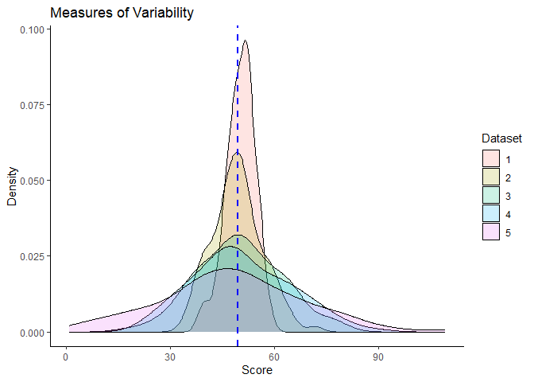
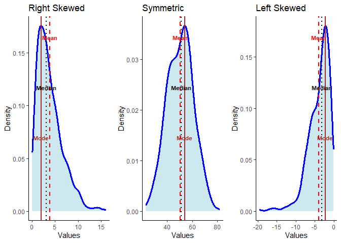
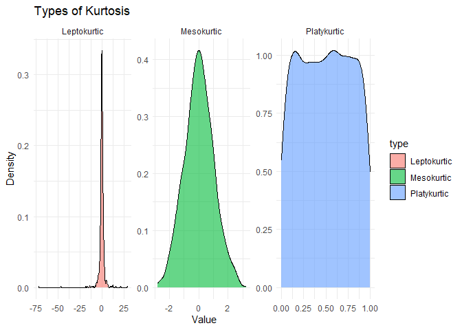

# Numerical measures

Numerical measures are summary statistics that are used to describe the
characteristics of a dataset. They provide information about the central
tendency, variability, and distribution of the data.

## Measures of Central Tendency

Measures of central tendency are numerical measures that describe the
center of a dataset. The three commonly used measures of central
tendency are:

### Mean

-   The mean is the arithmetic average of a dataset.
-   It is calculated by summing all the values in the dataset and
    dividing by the number of observations.
-   The mean is a good measure of central tendency for datasets that are
    **normally distributed or approximately symmetric**.
-   However, the **mean can be influenced by outliers and extreme
    values**, which can skew the results.

**Sample mean calculation**

$$ \large \overline{x} = \frac{1}{n} \sum\\x{\scriptstyle i} $$

-   ∑ = Summation (Adding all observations)
-   n = Number of observations
-   xi = Individual observation
-   *x̄* = sample mean

**Population mean calculation**

$$ \large \mu = \frac{1}{N} \sum\\x{\scriptstyle i} $$

-   ∑ = Summation (Adding all observations)
-   n = Number of observations
-   xi = Individual observation
-   *μ* = Population mean

Example: Find the mean of the set {5, 1, 3, 7, 9}.

-   Total number of observation is 5. Hence, n is 5
-   Summation of all observation is (5 + 1 + 3 + 7 + 9) = 25
-   Mean = 25/5 = 5

**Hands-On in R**

Suppose we have a vector of numbers representing the test scores of a
group of students:

    test_scores <- c(85, 72, 90, 68, 93, 80, 77, 88)

To calculate the mean of these test scores in R, we can use the `mean()`
function:

-Syntax: `mean(x, na.rm = FALSE)`

na.rm is used to remove the missing values from the input vector.

    mean_score <- mean(test_scores)
    print(mean_score)

    ## [1] 81.625

Therefore, the mean test score of these students is 81.625.

### Median

-   The median is the middle value in a dataset when the values are
    arranged in order.
-   It is **less sensitive to outliers than the mean** and is a good
    measure of central tendency for datasets that are skewed or have
    outliers.
-   The median divides the dataset into two equal parts, with 50% of the
    observations above and 50% below the median.
-   Calculation of median also depends on if the observations are odd or
    even.

**ODD number of observations**: - Arrange the observations from smallest
to largest number. - To calculate median value for odd number of
observation, we have to identify middle location. - Observation located
at middle location is will be considered as median value.

$$\large observations = \frac{n + 1}{2} $$
 - n = Number of observations

Example: Find the median of the set {5, 1, 3, 7, 9}.

1.  Arrange the numbers in order: {1, 3, 5, 7, 9}.
2.  Identify the middle number: Total number of observation is 5. Hence,
    (5+1)/2 is 3. It means value located at 3rd observation is median
    value.
3.  Hence, 5 is the median value. Therefore, the median of the set {5,
    1, 3, 7, 9} is 5.

**Even number of observations**: - Arrange the observations from
smallest to largest number. - To calculate median value for even number
of observation, we have to identify middle location, here two middle
locations. - Then, we take the average of both values located at the
middle.

$$\large observations =  average\left(\frac{n}{2}, \frac{n}{2}+{1}\right) $$
 - n = Number of observations

Example: Find the median of the set {5, 1, 3, 7, 9, 11}.

1.  Arrange the numbers in order: {1, 3, 5, 7, 9, 11}.
2.  Identify the middle number: Total number of observation is 6. Hence,
    6/2 & (6/2) + 1 location. Here, it average of values located at 3rd
    and 4th number.
3.  Third value is 5 and fourth is 7. So, (5+7)/2 = 6
4.  Hence, 6 is the median value. Therefore, the median of the set {5,
    1, 3, 7, 9, 11} is 6.

**Hands-On in R**

Suppose we have a vector of numbers representing the ages of a group of
individuals:

    ages <- c(25, 30, 35, 40, 45, 50, 55)

To calculate the median of these ages in R, you can use the `median()`
function as follows:

-Syntax: `median(x, na.rm = FALSE)`

na.rm is used to remove the missing values from the input vector.

    median_age <- median(ages)
    print(median_age)

    ## [1] 40

Therefore, the median age of this group of individuals is 40.

### Mode

-   The mode is the value that occurs most frequently in a dataset.
-   It is a good measure of central tendency for datasets with a single
    peak or mode.
-   However, it is not always meaningful for datasets with multiple
    modes or no clear mode.

Example: Find the mode of the set {5, 1, 3, 5, 9}.

1.  Identify the most frequent number.
2.  Here, 5 is present twice in the given set. Hence, mode is 5

**Hands-On in R**

Suppose we have a vector of numbers representing the test scores of a
group of students:

    test_scores <- c(85, 72, 90, 68, 93, 80, 77, 88, 85)

    score_table <- table(test_scores)
    mode <- as.numeric(names(score_table)[score_table == max(score_table)])
    print(mode)

    ## [1] 85

Let’s break down this code:

1- table(test\_scores) generates a frequency table for the test\_scores
vector, which counts the occurrences of each unique value.

2- max(score\_table) finds the maximum frequency in the table.

3- names(score\_table)\[score\_table == max(score\_table)\] extracts the
value(s) with the maximum frequency from the frequency table.

4- as.numeric(…) converts the result to a numeric value.

The variable mode will store the mode(s) of the test scores. Note that
there can be multiple modes if multiple values have the same highest
frequency.

## Measures of Dispersion

Measures of dispersion, also known as measures of variability or
measures of spread, are statistical measures that provide information
about the spread or distribution of a dataset. They quantify how much
individual data points deviate from the central tendency of the dataset,
such as the mean or median.

<figure>

<figcaption aria-hidden="true">Figure 4.1: Measures of variability in
five data sets having same mean</figcaption>
</figure>

### Range

The range refers to the difference between the maximum and minimum
values in a dataset. It provides a simple measure of the spread or
variability of the data. To calculate the range, you subtract the
minimum value from the maximum value.

$$\large Range = Maximum - Minimum$$

Here’s an example to illustrate the concept of range:

Let’s say you have a dataset representing the scores of 10 students on a
mathematics test:

82, 78, 90, 65, 72, 88, 92, 76, 80, 85

To find the range, you first identify the maximum and minimum values in
the dataset. In this case, the maximum value is 92 and the minimum value
is 65.

Range = Maximum value - Minimum value = 92 - 65 = 27

**Hands-On in R**

    # Example dataset
    scores <- c(82, 78, 90, 65, 72, 88, 92, 76, 80, 85)

    # Calculate the range
    range_scores <- range(scores)

    # Print the range
    range_scores

    ## [1] 65 92

The output indicates that the minimum value is 65 and the maximum value
is 92. To calculate the range, you can subtract the minimum value from
the maximum value:

    range <- range_scores[2] - range_scores[1]
    range

    ## [1] 27

So, the range of the scores in this dataset is 27, just as calculated
earlier.

Before moving to interquartile range, it is important to understand
**quartile**.

### Quartile

Quartiles are statistical measures that divide a dataset into four equal
parts. These parts are known as quartiles. The quartiles provide
information about the distribution and spread of the data, particularly
in terms of how it is divided into lower and upper halves.

There are three quartiles: the first quartile (Q1), the second quartile
(Q2), and the third quartile (Q3). The second quartile, Q2, is also
known as the median and divides the dataset into two equal halves.

To calculate the quartiles, you typically arrange the dataset in
ascending order and identify the values that divide it into four equal
parts. The formula to calculate the position of each quartile is:

$$\large Q1 = \frac{n + 1}{4}$$

$$\large Q2 = 2 \times (\frac{n + 1}{4})$$

$$\large Q3 = 3 \times (\frac{n + 1}{4})$$

where n is the total number of observations in the dataset.

### Interquartile Range

The interquartile range (IQR) is a statistical measure used to describe
the spread or variability of a dataset. It specifically focuses on the
middle 50% of the data and is calculated as the difference between the
third quartile (Q3) and the first quartile (Q1).

Here’s an example to illustrate how to calculate the interquartile
range:

Let’s consider a dataset representing the scores of 12 students on a
physics exam:

76, 80, 72, 85, 90, 65, 88, 82, 78, 70, 92, 76

To calculate the interquartile range, you need to find the first
quartile (Q1) and the third quartile (Q3) of the dataset. The first
quartile represents the 25th percentile, and the third quartile
represents the 75th percentile.

Hands-On in R:

    # Example dataset
    scores <- c(76, 80, 72, 85, 90, 65, 88, 82, 78, 70, 92, 76)

    # Calculate the interquartile range
    iqr_scores <- IQR(scores, type = 2)

    # Print the interquartile range
    iqr_scores

    ## [1] 12.5

In this example, the interquartile range is 12.5. This means that the
middle 50% of the scores in the dataset is spread over a range of 12.5.
The interquartile range is useful in describing the spread of data,
especially when the dataset contains outliers or is not symmetrically
distributed.

### Variance

Variance is a statistical measure that quantifies the dispersion or
spread of a set of data points around their mean (average). It provides
insight into how much the individual data points deviate from the
average value.

Here are some additional things to keep in mind about variance:

-   Variance is a measure of variability, but it does not take into
    account the shape of the distribution. For example, a bimodal
    distribution (two distinct peaks) with the same variance as a
    unimodal distribution (one peak) will have a different shape.
-   Variance is sensitive to outliers. An outlier is a data point that
    is very different from the rest of the data. Outliers can have a
    large impact on the variance, so it is important to remove them
    before calculating the variance.
-   Variance is a sample statistic, which means that it is only an
    estimate of the population variance. The population variance is the
    variance of all the data in a population, not just a sample.

**Sample variance**

$$
\large s^2 = \frac{1}{n-1} \underset{i=1}{\sum}^{n} (x{\scriptstyle i} - \bar{x})^2
$$

Where:

-   *s*2 represents the sample variance.
-   *n* is the number of data points in the sample.
-   *x**i* denotes each data point.
-   *x̄* is the sample mean.

**Population variance**

$$\large \sigma^2 = \frac{1}{N} \underset{i=1}{\sum}^{N}  (x{\scriptstyle i} - \mu)^2$$

Where:

-   *σ*2 represents the population variance.
-   *n* is the number of data points in the sample.
-   *x**i* denotes each data point.
-   *μ* is the population mean.

**Bessel’s correction**

The reason why the sample variance is divided by n−1 instead of just n
is due to a statistical concept called Bessel’s correction.

When calculating the variance, we are estimating the population variance
based on a sample of data. In this case, using the sample mean to
estimate the population mean (μ) introduces some bias. Dividing by n
instead of n−1 would underestimate the true variance.

By dividing the sum of squared deviations by n−1 instead of n, we
account for the fact that we are using the sample mean in our
calculations, which introduces some uncertainty. This adjustment helps
to provide an unbiased estimate of the population variance.

The reasoning behind using n−1 is rooted in the **degrees of freedom**
concept. In simple terms, degrees of freedom represent the number of
independent pieces of information available for estimating a parameter.
When estimating the population variance, one degree of freedom is used
to calculate the sample mean, leaving n−1 degrees of freedom remaining
for estimating the variance.

Dividing by n−1 instead of n is a common practice in statistics when
dealing with sample data. This adjustment helps to provide a more
accurate estimate of the population variance, particularly when the
sample size is small.

**Sample variance calculation**

Data = (6, 9, 14, 10, 5, 8, 11)

<table>
<colgroup>
<col style="width: 33%" />
<col style="width: 33%" />
<col style="width: 33%" />
</colgroup>
<thead>
<tr>
<th style="text-align: left;">Data</th>
<th style="text-align: left;">Deviation from mean (<em>x</em><em>i</em> − <em>x̄</em>)</th>
<th style="text-align: left;">Squared deviation from mean (<em>x</em><em>i</em> − <em>x̄</em>)2</th>
</tr>
</thead>
<tbody>
<tr>
<td style="text-align: left;">6</td>
<td style="text-align: left;">-3</td>
<td style="text-align: left;">9</td>
</tr>
<tr>
<td style="text-align: left;">9</td>
<td style="text-align: left;">0</td>
<td style="text-align: left;">0</td>
</tr>
<tr>
<td style="text-align: left;">14</td>
<td style="text-align: left;">5</td>
<td style="text-align: left;">25</td>
</tr>
<tr>
<td style="text-align: left;">10</td>
<td style="text-align: left;">1</td>
<td style="text-align: left;">1</td>
</tr>
<tr>
<td style="text-align: left;">5</td>
<td style="text-align: left;">-4</td>
<td style="text-align: left;">16</td>
</tr>
<tr>
<td style="text-align: left;">8</td>
<td style="text-align: left;">-1</td>
<td style="text-align: left;">1</td>
</tr>
<tr>
<td style="text-align: left;">11</td>
<td style="text-align: left;">2</td>
<td style="text-align: left;">4</td>
</tr>
<tr>
<td style="text-align: left;"><em>x̄</em> = 9</td>
<td style="text-align: left;">∑ (<em>x</em><em>i</em> − <em>x̄</em>)
= 0</td>
<td style="text-align: left;">∑ (<em>x</em><em>i</em> − <em>x̄</em>)2
= 56</td>
</tr>
</tbody>
</table>

$$
\large s^2 = \frac{1}{n-1} \underset{i=1}{\sum}^{n} (x{\scriptstyle i} - \bar{x})^2
$$

$$\large s^2 = \frac{1}{7-1} \underset{i=1}{\sum}^{n} 56$$

$$\large s^2 = \frac{56}{6}$$

$$\large s^2 = 9.33$$

**Hands-on in R**

    # Sample dataset
    data <- c(6, 9, 14, 10, 5, 8, 11)

    var(data)

    ## [1] 9.333333

### Standard deviation

The standard deviation is a measure of the dispersion or spread of a set
of data points. It quantifies the average distance between each data
point and the mean. The standard deviation is commonly used to
understand the variability or volatility of a dataset.

The standard deviation is calculated by taking the square root of the
variance. Here’s the formula for calculating the standard deviation:

**Standard deviation for sample**

$$\large s = \sqrt{\frac{1}{n-1} \underset{i=1}{\sum}^{n} (x{\scriptstyle i} - \bar{x})^2}$$

$$\large s = \sqrt{({s})^2}$$

**Standard deviation for population**

$$\large \sigma = \sqrt{\frac{1}{N} \underset{i=1}{\sum}^{N} (x{\scriptstyle i} - \mu)^2}$$

$$\large \sigma = \sqrt{\sigma^2}$$
**Standard deviation calculation**

$$\large s = \sqrt{({s})^2}$$

$$\large s = \sqrt{9.33}$$

$$\large s = 3.055$$

**Hand-on in R**

    sd(data)

    ## [1] 3.05505

### Coefficient of variation

The coefficient of variation (CV) is a statistical measure used to
assess the relative variability of a dataset. It is expressed as a
percentage and is calculated as the ratio of the standard deviation (SD)
to the mean (μ), multiplied by 100:

$$\large CV = \frac{\sigma}{\mu} \times 100$$

The coefficient of variation is commonly used in situations where you
want to compare the variability of two or more datasets that have
different units or scales. It allows you to determine which dataset has
a higher relative variability, regardless of the magnitude of the
values.

A lower coefficient of variation indicates less relative variability,
while a higher coefficient of variation indicates greater relative
variability. It is particularly useful when comparing datasets with
different means. For example, if you have two datasets with similar
standard deviations but different means, the coefficient of variation
can help you determine which dataset has a higher relative variability.

**Hands-on in R**

Suppose we have a dataset representing the expression levels of a
particular gene in a population of cells under different experimental
conditions. The expression levels (in arbitrary units) for three
conditions, labeled Condition A, Condition B, and Condition C, are as
follows:

    # Gene expression data for three conditions
    condition_A <- c(10, 12, 14, 16, 18)
    condition_B <- c(8, 9, 12, 15, 20)
    condition_C <- c(7, 10, 11, 15, 16)

    # Calculate the mean of each condition
    mean_A <- mean(condition_A)
    mean_B <- mean(condition_B)
    mean_C <- mean(condition_C)

    # Calculate the standard deviation of each condition
    sd_A <- sd(condition_A)
    sd_B <- sd(condition_B)
    sd_C <- sd(condition_C)

    # Calculate the coefficient of variation for each condition
    cv_A <- (sd_A / mean_A) * 100
    cv_B <- (sd_B / mean_B) * 100
    cv_C <- (sd_C / mean_C) * 100

    # Print the results
    cat("Condition A - CV:", cv_A, "%\n")

    ## Condition A - CV: 22.5877 %

    cat("Condition B - CV:", cv_B, "%\n")

    ## Condition B - CV: 38.03332 %

    cat("Condition C - CV:", cv_C, "%\n")

    ## Condition C - CV: 31.36738 %

The coefficient of variation allows us to compare the variability of
gene expression levels between different conditions. In this example,
Condition B has the highest CV value (38.03%), indicating a higher
relative variability in gene expression compared to its mean expression
level. This suggests that Condition B may exhibit more diverse or
inconsistent gene expression patterns compared to the other conditions.

On the other hand, Condition A and Condition C have lower CV values
(22.59% and 31.37%, respectively), suggesting relatively less
variability in gene expression compared to their respective mean
expression levels.

It’s important to note that the interpretation of the CV values depends
on the context and the specific biological system under investigation.
The CV can help researchers assess the consistency or variability of
gene expression levels, which can provide insights into the regulatory
mechanisms, cellular responses, or potential experimental artifacts in
the study.

By calculating and analyzing the coefficient of variation, researchers
can gain a better understanding of the relative variability within
datasets, including biological data, facilitating comparisons and
drawing meaningful conclusions.

## Measures of Shape

### Skewness

Skewness is a statistical measure that describes the asymmetry or lack
of symmetry in a distribution of data. It indicates the extent to which
the data deviates from a symmetrical or bell-shaped distribution.
Skewness can be positive, negative, or zero, indicating different types
of asymmetry.

<figure>

<figcaption aria-hidden="true">Figure 4.2: Left, Right and Symmetric
Distribution</figcaption>
</figure>

**Positive skewness:** If the distribution has a long tail on the right
side and the majority of the data is concentrated on the left side, it
is said to have positive skewness. In a positively skewed distribution,
the mean is typically greater than the median.

**Negative skewness:** If the distribution has a long tail on the left
side and the majority of the data is concentrated on the right side, it
is said to have negative skewness. In a negatively skewed distribution,
the mean is typically less than the median.

**Zero skewness:** If the distribution is symmetric and evenly
distributed around the mean, it has zero skewness. In this case, the
mean and median are approximately equal.

Skewness can be calculated using different formulas, but one commonly
used formula is based on the third standardized moment. Here’s the
**Pearson’s second skewness coefficient (median skewness)** formula to
calculate skewness for a data set:

$$\large Skewness = \frac{3 \times (Mean - Median)}{Standard Deviation}$$

It is a simple multiple of the nonparametric skew.

It’s important to note that skewness is just one measure of the shape of
a distribution and should be interpreted in conjunction with other
descriptive statistics and visualizations to gain a comprehensive
understanding of the data distribution.

### Interpreting skewness

Skewness is a measure of the asymmetry of a distribution. It provides
information about the shape of the distribution and the direction of its
tail. The interpretation of skewness values depends on the sign and
magnitude of the value:

1.  **Skewness = 0**: A skewness value of 0 indicates a perfectly
    symmetrical distribution. The distribution is balanced, and the left
    and right tails are equal in length.

2.  **Skewness &gt; 0**: A positive skewness value indicates a
    right-skewed or positively skewed distribution. The tail of the
    distribution extends towards the right, and the majority of the data
    is concentrated on the left side. The mean is usually greater than
    the median and the mode.

3.  **Skewness &lt; 0**: A negative skewness value indicates a
    left-skewed or negatively skewed distribution. The tail of the
    distribution extends towards the left, and the majority of the data
    is concentrated on the right side. The mean is usually less than the
    median and the mode.

The magnitude of the skewness value also provides information about the
degree of skewness:

-   A skewness value close to **0 (between -0.5 and 0.5)** suggests a
    relatively small deviation from a perfectly **symmetrical
    distribution**.
-   A skewness value between **-1 and -0.5 or between 0.5 and 1**
    indicates a moderate skewness.
-   A skewness value **less than -1 or greater than 1** represents a
    substantial skewness and indicates a highly skewed distribution.

It’s important to note that the interpretation of skewness should be
considered in conjunction with other measures of central tendency (such
as mean, median) and visual examination of the distribution (such as
histograms or density plots) to have a comprehensive understanding of
the data’s distributional characteristics.

**Hands-on in R**

    library(e1071) # library

    # Height data of 20 people
    height <- c(165, 170, 168, 172, 175, 180, 169, 173, 168, 166, 172, 174, 177, 171, 170, 168, 165, 172, 174, 169)

    # Calculate skewness
    skewness_value <- skewness(height)

    # Print the skewness value
    print(skewness_value)

    ## [1] 0.419996

As skewness value is 0.42 suggests that data is symmetrically
distributed.

### Kurtosis

**Kurtosis** is a way to describe the **shape of the tails** of a
distribution — in other words, how **peaked or flat** the data is and
how heavy or light the tails are compared to a normal distribution.

-   **Mean** tells us the **center**.
-   **Variance** or **Standard Deviation** tells us the spread.
-   **Kurtosis** tells us about the **shape of the tails and peak**.

In simple terms:

-   High kurtosis: more data in the tails, sharper peak.
-   Low kurtosis: less data in the tails, flatter peak.

Kurtosis measures the **4th standardized** moment about the mean.

The **population kurtosis** is defined as:

$$
\Large Kurtosis = \frac{E{\[(X - \mu)^4\]}{\sigma^4}
$$

where:

-   *E* means **Expected value** (average for population)
-   *X* is each data point
-   *μ* is the **mean**
-   *σ* is the **standard deviation**

So it’s the **4th moment** divided by the **square of the variance
squared** — which measures how fat the tails are.

#### Sample Kurtosis

In practice, we usually work with sample data, not population. So, the
**sample kurtosis** is:

$$
\Large g\_2 = \frac{n(n+1)}{(n-1)(n-2)(n-3)} \sum(\frac{X\_i - \bar X}{s})^4 - \frac{3(n-1)^2}{(n-2) (n-3)}
$$

where:

-   *n* = number of data points
-   *X̄* = sample mean
-   *s* = sample standard deviation

#### Types of Kurtosis

#### 1. Mesokurtic

-   Kurtosis ≈ 3 (Excess Kurtosis = 0)
-   Like a normal distribution (bell curve).
-   Moderate tails, moderate peak.

#### 2. Leptokurtic

-   Kurtosis &gt; 3 (Excess Kurtosis &gt; 0)
-   More peaked, fatter tails.
-   More extreme values.

#### 3. Platykurtic

-   Kurtosis &lt; 3 (Excess Kurtosis &lt; 0)
-   Flatter peak, thinner tails.
-   Fewer extreme values.

<!-- -->

    # 📦 Load required libraries
    library(moments)  # for kurtosis

    ## 
    ## Attaching package: 'moments'

    ## The following objects are masked from 'package:e1071':
    ## 
    ##     kurtosis, moment, skewness

    library(ggplot2)  # for plotting

    # 📊 1️⃣ Generate dummy datasets
    set.seed(123)

    # Mesokurtic: Normal distribution
    meso <- rnorm(1000)

    # Leptokurtic: t-distribution with low df (heavy tails)
    lepto <- rt(1000, df = 2)

    # Platykurtic: Uniform distribution (flat)
    platy <- runif(1000)

    # 📏 2️⃣ Calculate kurtosis
    meso_kurt <- kurtosis(meso)
    lepto_kurt <- kurtosis(lepto)
    platy_kurt <- kurtosis(platy)

    cat("Mesokurtic (Normal):", meso_kurt, "\n")

    ## Mesokurtic (Normal): 2.925747

    cat("Leptokurtic (t-dist):", lepto_kurt, "\n")

    ## Leptokurtic (t-dist): 164.8149

    cat("Platykurtic (Uniform):", platy_kurt, "\n")

    ## Platykurtic (Uniform): 1.7865

    # 📈 3️⃣ Combine and plot
    data <- data.frame(
      value = c(meso, lepto, platy),
      type = rep(c("Mesokurtic", "Leptokurtic", "Platykurtic"), each = 1000)
    )

    ggplot(data, aes(x = value, fill = type)) +
      geom_density(alpha = 0.6) +
      facet_wrap(~type, scales = "free") +
      labs(title = "Types of Kurtosis",
           x = "Value",
           y = "Density") +
      theme_minimal()

#### Plots the shapes side-by-side so you can see the difference:

-   **Leptokurtic**: taller peak, fatter tails
-   **Mesokurtic**: normal bell curve
-   **Platykurtic**: flatter and wider

#### Key takeaway

-   Kurtosis helps you understand the risk of outliers.
-   Useful in finance, quality control, machine learning.

#### Excess Kurtosis

By default, **kurtosis for a normal distribution is 3**. So we often
report **Excess Kurtosis**:

$$
\large \text {Excess Kurtosis} = Kurtosis - 3
$$

-   **&gt; 0**: Leptokurtic (heavy tails)
-   **= 0**: Mesokurtic (normal)
-   **&lt; 0**: Platykurtic (light tails)

#### Key Formula

$$
\Large Kurtosis = \frac{1}{n} \sum (\frac {X\_i - {\bar X}} {s})^4
$$

[⬅ Back to Home](../index.md)
