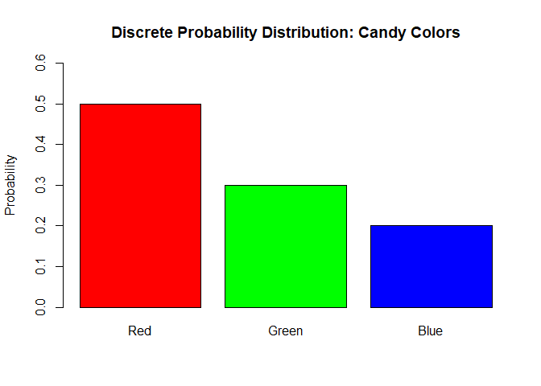
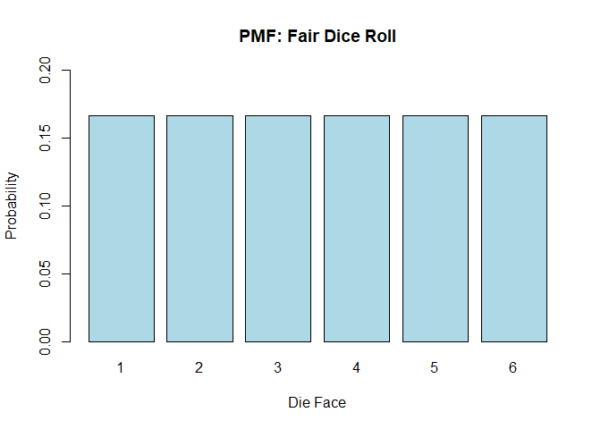

# Probability Distributions

A **probability distribution** is like a rulebook that tells us how
likely each possible outcome of an experiment is.

Think of it like this: - You roll a die → you want to know how likely
each number is (1 to 6) - You measure height → you want to know how
likely different height ranges are

A probability distribution helps us **map out those chances**.

------------------------------------------------------------------------

## Types of Probability Distributions

## 1. Discrete Probability Distribution

-   Used when outcomes are **countable** (like number of people, dice
    rolls, coin flips).
-   We can list out all the possible outcomes.
-   Each outcome has a specific probability.

### Example: Rolling a Die

-   Outcomes: 1, 2, 3, 4, 5, 6
-   Each has a probability of 1/6

This is a **discrete distribution** because we can count the possible
outcomes.

#### Example 1: Picking a Candy from a Jar (Discrete Distribution)

Imagine we have a jar with:

-   5 red candies  
-   3 green candies  
-   2 blue candies

Total candies = 10

The probability of picking each color:

<table>
<thead>
<tr>
<th>Candy Color</th>
<th>Count</th>
<th>Probability</th>
</tr>
</thead>
<tbody>
<tr>
<td>Red</td>
<td>5</td>
<td>5/10 = <strong>0.5</strong></td>
</tr>
<tr>
<td>Green</td>
<td>3</td>
<td>3/10 = <strong>0.3</strong></td>
</tr>
<tr>
<td>Blue</td>
<td>2</td>
<td>2/10 = <strong>0.2</strong></td>
</tr>
</tbody>
</table>

This is a **discrete probability distribution** — because the outcomes
(red, green, blue) are **countable and distinct**.

    ##   Color Count Probability
    ## 1   Red     5         0.5
    ## 2 Green     3         0.3
    ## 3  Blue     2         0.2

------------------------------------------------------------------------

#### Example 2: Rolling a Die (Discrete Distribution)

When we roll a fair 6-sided die, the outcomes are: {1, 2, 3, 4, 5, 6}

Each number has an equal chance:

$$
P(1) = P(2) = \dots = P(6) = \frac{1}{6}
$$

<table>
<thead>
<tr>
<th>Outcome</th>
<th>Probability</th>
</tr>
</thead>
<tbody>
<tr>
<td>1</td>
<td>1/6 ≈ 0.167</td>
</tr>
<tr>
<td>2</td>
<td>1/6 ≈ 0.167</td>
</tr>
<tr>
<td>3</td>
<td>1/6 ≈ 0.167</td>
</tr>
<tr>
<td>4</td>
<td>1/6 ≈ 0.167</td>
</tr>
<tr>
<td>5</td>
<td>1/6 ≈ 0.167</td>
</tr>
<tr>
<td>6</td>
<td>1/6 ≈ 0.167</td>
</tr>
</tbody>
</table>

This is a classic **discrete distribution** because:

-   You can **count** the outcomes.

-   Each value has a **specific probability**.

This is another **discrete** probability distribution.

------------------------------------------------------------------------

------------------------------------------------------------------------

### Function: PMF (Probability Mass Function)

PMF tells you the **probability of each exact value**.

------------------------------------------------------------------------

## 2. Continuous Probability Distribution

-   Used when outcomes can be **any value within a range**.
-   You can’t list them all because there are **infinitely many** (like
    1.2, 1.23, 1.234…).
-   Think of things like **height, weight, or temperature**.

### Example: Measuring Height

-   A person’s height could be 160.2 cm or 160.23 cm or 160.234 cm, etc.
-   You can’t give a probability to **one exact value**.
-   Instead, you find the probability **within a range**, like 160–170
    cm.

#### Example 3: Measuring Height (Continuous Distribution)

Now, let’s say you measure people’s **heights**.  
You might get values like:

-   160.1 cm  
-   160.15 cm  
-   160.152 cm  
-   … and so on.

Here, the possible values are **infinite** — you can’t count them.

Instead of exact values, we ask:

> “What’s the probability that a person’s height is **between 160 cm and
> 170 cm**?”

This is a **continuous probability distribution** — used when outcomes
can take **any value in a range**.

-   The histogram shows how many students fall in each height range

-   The smooth curve is a probability density function (PDF)

------------------------------------------------------------------------

#### Example 4: Time Until Ice Cream Melts (Continuous Distribution)

Suppose we want to know how long it takes for ice cream to melt in the
sun.

Possible values could be:

-   5.1 minutes  
-   5.15 minutes  
-   5.152 minutes  
-   etc.

We don’t ask for the probability it melts **exactly** in 5.152 minutes
(because it’s almost 0).  
Instead, we ask:

> “What’s the chance it melts **between 5 and 6 minutes**?”

That’s a **continuous** probability again!

### Function: PDF (Probability Density Function)

PDF tells you the **density of probability** across a range of values.

------------------------------------------------------------------------

#### Summary Table

<table>
<colgroup>
<col style="width: 14%" />
<col style="width: 35%" />
<col style="width: 50%" />
</colgroup>
<thead>
<tr>
<th>Type</th>
<th>Real-Life Example</th>
<th>Key Idea</th>
</tr>
</thead>
<tbody>
<tr>
<td>Discrete</td>
<td>Dice roll, candy color</td>
<td>Outcomes are <strong>countable</strong></td>
</tr>
<tr>
<td>Continuous</td>
<td>Height, time, temperature</td>
<td>Outcomes are <strong>infinite within a range</strong></td>
</tr>
</tbody>
</table>

[⬅ Back to Home](../index.md)
