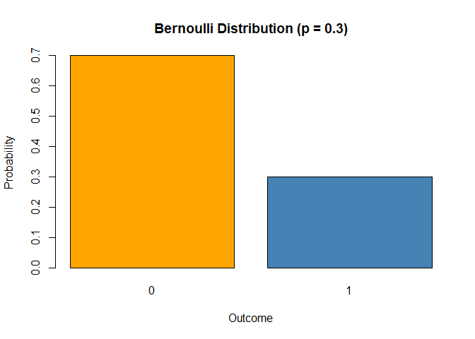
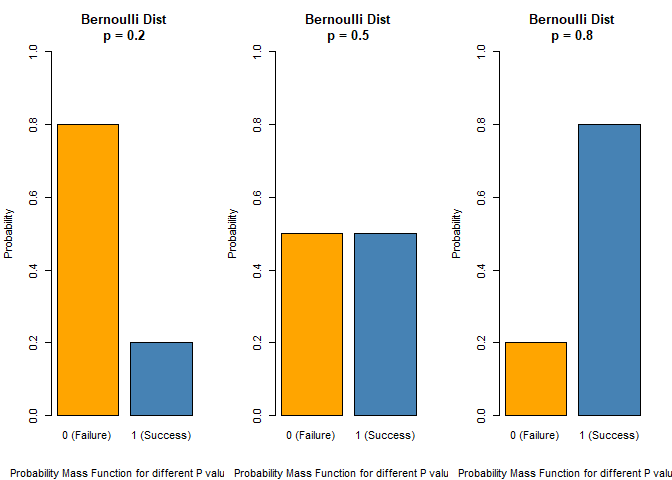
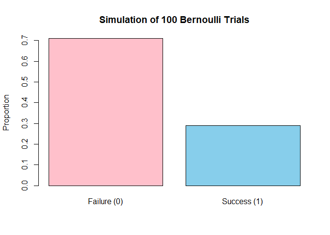
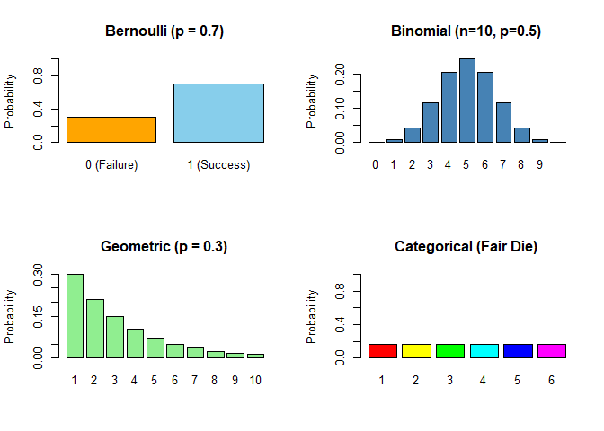
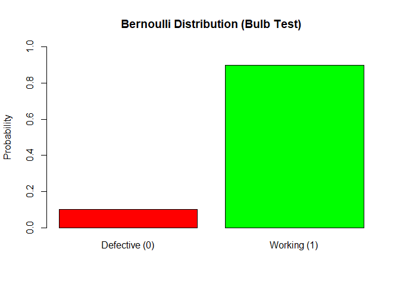

# Bernoulli Distribution

The **Bernoulli Distribution** is one of the **simplest discrete
probability distributions**. It models a random variable where there are
only **two possible outcomes** — typically called “success” and
“failure”.

------------------------------------------------------------------------

#### Real-Life Examples

-   Tossing a coin (Heads = 1, Tails = 0)  
-   Checking if a light bulb is working (Yes = 1, No = 0)  
-   A customer buying a product (Buys = 1, Doesn’t buy = 0)

------------------------------------------------------------------------

### Bernoulli trials

A **Bernoulli trial** is a **single experiment** or action that:

-   Has exactly **two possible outcomes** (usually labeled as
    **“success”** and **“failure”**)

-   The **probability of success is fixed**

-   Each trial is **independent** of the others

#### Explanation

Imagine flipping a coin:

-   We either get **Heads (success)** or **Tails (failure)**

-   Each flip is **independent** of the others

-   Probability of success (e.g., Heads) is constant (0.5)

That’s a **Bernoulli trial**.

------------------------------------------------------------------------

## Definition

A random variable *X* follows a **Bernoulli distribution** if it takes
only two values:

$$
X = 
\begin{cases} 
1 & \text{with probability } p \\
0 & \text{with probability } 1 - p 
\end{cases}
$$

Where:

-   *P*(*X* = 1) = *p* is the **probability of success** (i.e., getting
    a 1)  
-   *P*(*X* = 1) = 1 − *p* is the **probability of failure** (i.e.,
    getting a 0)

------------------------------------------------------------------------

### Properties

#### Mean

The **mean (or expected value)** is the **average outcome we’d** expect
over many repeated trials.

#### Example (Coin Toss):

If you toss a fair coin:

-   Heads = 1 (Success)
-   Tails = 0 (Failure)
-   *p* = 0.5

Then over 100 tosses, we’d expect **about 50 heads**, so the **mean =
0.5**

#### Mean formula for Bernoulli Distribution:

$$
\large \mu = E(X) = p
$$

#### Variance

Variance tells us **how spread out** the outcomes are — how much they
**vary** from the mean.

-   Low variance = outcomes are consistent
-   High variance = outcomes fluctuate more

#### Variance formula for Bernoulli Distribution:

$$
\large \sigma^2 = \text Var(X) = p(1 - p)
$$

-   If *p* = 0 or *p* = 1: the outcome is **always the same**, so
    variance = 0
-   If *p* = 0.5: equal chance of 0 and 1 → **Maximum
    unpredictability**, so variance = 0.25

#### Table: Mean and Variance for Different *p*

<table>
<thead>
<tr>
<th><em>p</em></th>
<th>Mean (<em>μ</em>)</th>
<th>Variance (<em>σ</em>2)</th>
</tr>
</thead>
<tbody>
<tr>
<td>0.2</td>
<td>0.2</td>
<td>0.16</td>
</tr>
<tr>
<td>0.5</td>
<td>0.5</td>
<td>0.25</td>
</tr>
<tr>
<td>0.8</td>
<td>0.8</td>
<td>0.16</td>
</tr>
<tr>
<td>1.0</td>
<td>1.0</td>
<td>0.00</td>
</tr>
</tbody>
</table>

<table>
<colgroup>
<col style="width: 12%" />
<col style="width: 56%" />
<col style="width: 31%" />
</colgroup>
<thead>
<tr>
<th>Term</th>
<th>Meaning</th>
<th>Formula</th>
</tr>
</thead>
<tbody>
<tr>
<td>Mean</td>
<td>Long-run average outcome</td>
<td><em>μ</em> = <em>p</em></td>
</tr>
<tr>
<td>Variance</td>
<td>How much the outcome varies from mean</td>
<td><em>σ</em>2 = <em>p</em>(1 − <em>p</em>)</td>
</tr>
</tbody>
</table>

------------------------------------------------------------------------

## Bernoulli Distribution Plot

    # Probability of success
    p <- 0.3

    # Possible outcomes and their probabilities
    x <- c(0, 1)
    prob <- c(1 - p, p)

    # Plot
    barplot(prob, names.arg = x,
            col = c("orange", "steelblue"),
            main = "Bernoulli Distribution (p = 0.3)",
            xlab = "Outcome", ylab = "Probability")

    # Set up layout for 3 plots side-by-side
    par(mfrow = c(1, 3))

    # Define values of p
    p_values <- c(0.2, 0.5, 0.8)

    # Generate and plot for each p
    for (p in p_values) {
      barplot(c(1 - p, p),
              names.arg = c("0 (Failure)", "1 (Success)"),
              col = c("orange", "steelblue"),
              main = paste("Bernoulli Distribution\np =", p),
              sub = "Probability Mass Function for different P values",
              ylim = c(0, 1),
              ylab = "Probability")
    }

Here, each graph shows a different Bernoulli distribution.

-   Left: p = 0.2 (20% chance of success)
-   Center: p = 0.5 (50% chance of success)
-   Right: p = 0.8 (80% chance of success)

#### Key Characteristics

-   **Single trial** with two possible outcomes: 0 and 1
-   Controlled by a **single parameter:*p***
-   Used to model **binary events**
-   Simple and forms the basis for other distributions like Binomial
-   When *p* = 0.5, the distribution is **symmetric**, as **success and
    failure are equal**
-   When *P* ≠ 0.5, the distribution is asymmetric.

#### Simulation of Multiple Bernoulli Trials

    # Simulate 100 Bernoulli trials with p = 0.3
    set.seed(123)
    sim_data <- rbinom(n = 100, size = 1, prob = 0.3)

    # Frequency table
    table(sim_data)

    ## sim_data
    ##  0  1 
    ## 71 29

    # Plot the proportion of outcomes
    barplot(table(sim_data)/length(sim_data),
            names.arg = c("Failure (0)", "Success (1)"),
            col = c("pink", "skyblue"),
            main = "Simulation of 100 Bernoulli Trials",
            ylab = "Proportion")

### Connection to Hypothesis Testing

In hypothesis testing, we often test whether the probability of success
equals a specific value:

-   Null Hypothesis *H**o* : *p* = 0.5

-   Alternative Hypothesis *H*1 : *p* ≠ 0.5

We use test statistics and p-values to decide whether to reject
*H**o*.

#### Applications in Real Life

<table>
<thead>
<tr>
<th>Situation</th>
<th>Bernoulli Outcome</th>
</tr>
</thead>
<tbody>
<tr>
<td>Toss a coin</td>
<td>1 (Heads), 0 (Tails)</td>
</tr>
<tr>
<td>Pass/fail a test</td>
<td>1 (Pass), 0 (Fail)</td>
</tr>
<tr>
<td>Email is spam or not</td>
<td>1 (Spam), 0 (Not spam)</td>
</tr>
<tr>
<td>Customer buys a product or not</td>
<td>1 (Buy), 0 (No buy)</td>
</tr>
</tbody>
</table>

------------------------------------------------------------------------

#### Use in Machine Learning

Bernoulli distribution is used to **model binary data** and
**classification tasks**. Here’s how it fits into ML:

#### 1. Binary Classification

In ML, many problems involve predicting **yes/no, spam/not spam,
clicked/not clicked**, etc.

Bernoulli distribution provides the foundation for:

-   **Target variable** (label) in binary classification is modeled as
    *y* ∼ *B**e**r**n**o**u**l**l**i*(*p*)
-   **Predicted probabilities** (from models like logistic regression)
    estimate the success probability *p*

#### Example:

Predicting if an email is spam: \* *y* = 1 → spam \* *y* = 0 → not spam

The outcome follows:

*P*(*y* = 1) = *p*, *P*(*y* = 0) = 1 − *p*

#### 2. Bernoulli Naive Bayes Classifier

This ML algorithm **assumes features are binary**, and each follows a
Bernoulli distribution.

Used when:

-   Features are presence/absence (e.g., word present in a document = 1,
    absent = 0)
-   Especially common in **text classification** (e.g., spam detection)

#### 3. Simulating Binary Labels in ML

If we’re simulating binary outcomes in ML (for testing or synthetic
data), we can use:

    ## y
    ##  0  1 
    ## 74 26

#### 4. Logistic Regression and Bernoulli

In **logistic regression**, the likelihood of the response variable is
modeled using the Bernoulli distribution.

The output is:

-   A probability is:
-   p between 0 and 1
-   Then interpreted as a **Bernoulli trial**

------------------------------------------------------------------------

#### Relation to Binomial Distribution

The **Binomial Distribution** is simply the sum of multiple independent
**Bernoulli trials**.

> Example: Tossing a coin 10 times is a Binomial trial with *n* = 10.
> But each individual toss follows a **Bernoulli distribution**.

------------------------------------------------------------------------

### Limitations & Issues of Bernoulli Distribution

#### 1. Binary Outcomes Only

The Bernoulli distribution **can only handle two outcomes** (0 or 1,
success/failure).

-   Cannot be used for multiclass classification or multi-category data.

-   Use a **multinomial** or **categorical distribution** instead for
    &gt;2 classes.

#### 2. Assumes Fixed Probability

-   The probability of success *p* is assumed to be **constant** across
    trials.

-   In real-life applications, probabilities may change due to:

    -   Time

    -   Context

    -   User behavior

    -   Environment

> In such cases, use models with **varying probabilities**, like
> logistic regression.

#### 4. Not Suitable for Continuous Variables

-   Bernoulli only models **discrete binary data**.

-   It cannot be used for modeling continuous measurements like height,
    weight, or temperature.

> Use distributions like **Normal, Exponential**, etc., for continuous
> data.

#### 5. Limited Information in Single Trial

-   A single Bernoulli trial gives very little data (just 0 or 1).

-   We need many repetitions to estimate meaningful statistics like mean
    or variance.

> Often extended to **Binomial distribution** (sum of multiple Bernoulli
> trials).

#### 6. High Variance for Mid-range p

-   When *p* is near 0.5, the variance *p*(1 − *p*) is highest.

-   This introduces **greater uncertainty** in modeling outcomes, making
    estimation less reliable without large sample sizes.

#### 7. Cannot Capture Feature Interactions

-   In Bernoulli Naive Bayes:

    -   Assumes features are independent given the class label.

    -   Ignores feature interactions.

> Leads to oversimplified models in complex ML tasks.

#### 8. Not Robust to Noise or Outliers

-   Since it only accepts 0 or 1:

    -   Noisy labels (e.g., mislabeled examples) can strongly affect
        model performance.

    -   It’s not flexible enough to accommodate uncertain or fuzzy
        outcomes.

------------------------------------------------------------------------

#### Comparison of Common Discrete Distributions

<table>
<colgroup>
<col style="width: 7%" />
<col style="width: 30%" />
<col style="width: 8%" />
<col style="width: 24%" />
<col style="width: 28%" />
</colgroup>
<thead>
<tr>
<th>Distribution</th>
<th>Definition</th>
<th>Possible Outcomes</th>
<th>Parameters</th>
<th>Real-Life Example</th>
</tr>
</thead>
<tbody>
<tr>
<td><strong>Bernoulli</strong></td>
<td>Single trial with two outcomes</td>
<td>0 or 1</td>
<td><em>p</em>: probability of
success</td>
<td>Tossing a coin once (Heads = 1, Tails = 0)</td>
</tr>
<tr>
<td><strong>Binomial</strong></td>
<td>Number of successes in <strong>n</strong> independent Bernoulli
trials</td>
<td>0 to <em>n</em></td>
<td><em>n</em>: number of trials, <em>p</em>: success probability</td>
<td>Tossing a coin 10 times: how many heads?</td>
</tr>
<tr>
<td><strong>Geometric</strong></td>
<td>Number of trials <strong>until first success</strong></td>
<td>1, 2, 3, …</td>
<td><em>p</em>: probability of
success</td>
<td>How many times do you flip a coin until you get Heads?</td>
</tr>
<tr>
<td><strong>Categorical</strong></td>
<td>One trial with <strong>more than two possible outcomes</strong></td>
<td>1, 2, …, k</td>
<td>Vector of probabilities (<em>p</em>1, <em>p</em>2, …, <em>p</em><em>k</em>)</td>
<td>Rolling a dice (1–6) once</td>
</tr>
</tbody>
</table>

------------------------------------------------------------------------

#### Intuitions

🔹 Bernoulli (binary decision) &gt; Are you **present (1)** or **absent
(0)** in class today?

    # One Bernoulli trial with p = 0.7
    rbinom(n = 1, size = 1, prob = 0.7)

    ## [1] 1

🔹 Binomial (repeat Bernoulli) &gt; In **5 coin tosses**, how many times
do you get **Heads**?

    # 10 coin tosses (p = 0.5), how many heads?
    rbinom(n = 1, size = 10, prob = 0.5)

    ## [1] 8

🔹 Geometric (wait for success) &gt; **How many attempts** until you
pass a driving test?

    # Number of tosses until first head (p = 0.3)
    rgeom(n = 1, prob = 0.3) + 1  # R counts failures before success, so +1 for trials

    ## [1] 1

🔹 Categorical (multi-choice) &gt; Which **color** is picked from a bag:
**Red**, **Green**, or **Blue**?

    # Roll a fair 6-sided die
    sample(1:6, size = 1, prob = rep(1/6, 6))

    ## [1] 4

#### Visualization of different distributions

    # Set up a 2x2 plotting grid
    par(mfrow = c(2, 2))

    # 1. Bernoulli Distribution
    p <- 0.7
    barplot(c(1 - p, p),
            names.arg = c("0 (Failure)", "1 (Success)"),
            col = c("orange", "skyblue"),
            main = "Bernoulli (p = 0.7)",
            ylab = "Probability",
            ylim = c(0, 1))

    # 2. Binomial Distribution (n = 10, p = 0.5)
    x_binom <- 0:10
    y_binom <- dbinom(x_binom, size = 10, prob = 0.5)
    barplot(y_binom,
            names.arg = x_binom,
            col = "steelblue",
            main = "Binomial (n=10, p=0.5)",
            ylab = "Probability",
            ylim = c(0, max(y_binom)))

    # 3. Geometric Distribution (p = 0.3)
    x_geom <- 1:10
    y_geom <- dgeom(x_geom - 1, prob = 0.3)
    barplot(y_geom,
            names.arg = x_geom,
            col = "lightgreen",
            main = "Geometric (p = 0.3)",
            ylab = "Probability",
            ylim = c(0, max(y_geom)))

    # 4. Categorical Distribution (Fair die)
    x_cat <- 1:6
    y_cat <- rep(1/6, 6)
    barplot(y_cat,
            names.arg = x_cat,
            col = rainbow(6),
            main = "Categorical (Fair Die)",
            ylab = "Probability",
            ylim = c(0, 1))

    # Reset plotting layout
    #par(mfrow = c(1, 1))

#### Explanation

-   **Bernoulli Distribution** models a single trial with two possible
    outcomes, success (p = 0.7) and failure.A taller bar at 1 (success)
    → indicating success is more likely. **Binomial Distribution** (n =
    10, p = 0.5). represents the number of successes (e.g., heads) in 10
    independent trials (e.g., coin tosses), each with success
    probability 0.5.The bars show the probability of getting 0 to 10
    successes. The distribution is symmetric, peaking at 5 successes.
    **Geometric Distribution** (p = 0.3). shows the probability that the
    first success occurs on the k-th trial. Bar heights decrease as
    trial number increases — the more you wait, the less likely the
    first success. Most of the mass is in early values (trial 1, 2, 3).
    **Categorical Distribution** (Fair Die). Models outcomes with more
    than two categories (e.g., 6 outcomes from a die). Each outcome is
    equally likely with a probability of 1/6. All bars are same height,
    indicating uniform probability.

------------------------------------------------------------------------

### Real Life Scenario

Suppose you’re a quality control inspector in a light bulb factory. Each
bulb has a 90% chance of working (success), and a 10% chance of being
defective (failure).

You want to model whether a single bulb works or not. Here we are
looking for single bulb,hence we will use Bernoulli Distribution.

#### Bernoulli Distribution Basics

Let:

-   *X* = 1 if the bulb **works** (success)
-   *X* = 0 if the bulb is **defective** (failure)
-   *p* = 0.9: probability that a bulb works

So

*P*(*X* = 1) = 0.9, *P*(*X* = 0) = 1 − 0.9 = 0.1

    # Probability of a working bulb
    p <- 0.9

    # Possible outcomes: 0 = failure, 1 = success
    x <- c(0, 1)

    # Corresponding probabilities
    prob <- c(1 - p, p)

    # View the probability
    prob

    ## [1] 0.1 0.9

    # Plot the distribution
    barplot(prob,
            names.arg = c("Defective (0)", "Working (1)"),
            col = c("red", "green"),
            ylim = c(0, 1),
            main = "Bernoulli Distribution (Bulb Test)",
            ylab = "Probability")

#### Interpretation

-   This tells us there’s a 90% chance a randomly selected bulb will
    work.
-   It’s a single trial, so the Bernoulli distribution is ideal.

#### Simulate Many Bulbs

    set.seed(42)
    sim_bulbs <- rbinom(n = 1000, size = 1, prob = p)
    table(sim_bulbs)

    ## sim_bulbs
    ##   0   1 
    ## 111 889

    mean(sim_bulbs)

    ## [1] 0.889

------------------------------------------------------------------------

#### Summary

<table>
<colgroup>
<col style="width: 41%" />
<col style="width: 58%" />
</colgroup>
<thead>
<tr>
<th>Limitation</th>
<th>Why It Matters</th>
</tr>
</thead>
<tbody>
<tr>
<td>Only binary outcomes</td>
<td>Can’t handle multiclass problems</td>
</tr>
<tr>
<td>Fixed success probability</td>
<td>May not reflect real-world variability</td>
</tr>
<tr>
<td>Assumes independent trials</td>
<td>Doesn’t fit time-dependent data</td>
</tr>
<tr>
<td>Not for continuous data</td>
<td>Unsuitable for real-valued features</td>
</tr>
<tr>
<td>Limited info from one trial</td>
<td>Needs many repetitions to be informative</td>
</tr>
<tr>
<td>High variance near <em>p</em> = 0.5</td>
<td>Outcomes more uncertain</td>
</tr>
<tr>
<td>Ignores feature interactions</td>
<td>Less accurate ML predictions</td>
</tr>
<tr>
<td>Sensitive to label noise</td>
<td>Errors can distort results significantly</td>
</tr>
</tbody>
</table>

------------------------------------------------------------------------
