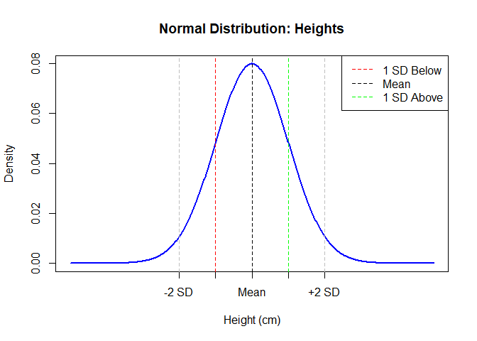
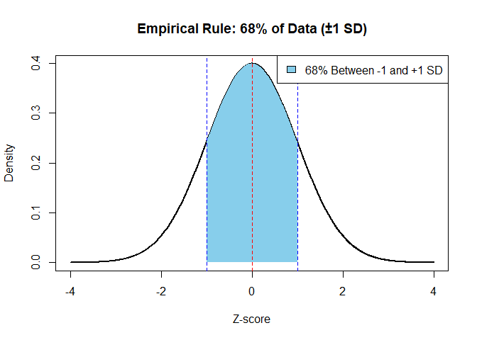
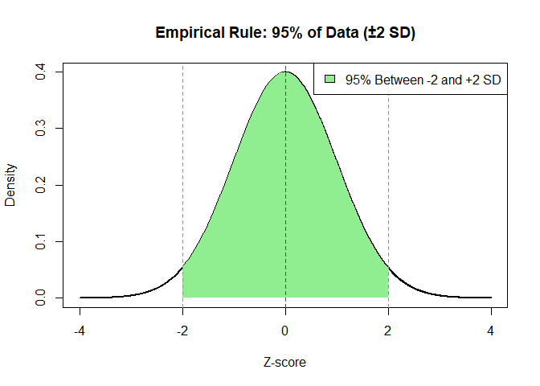
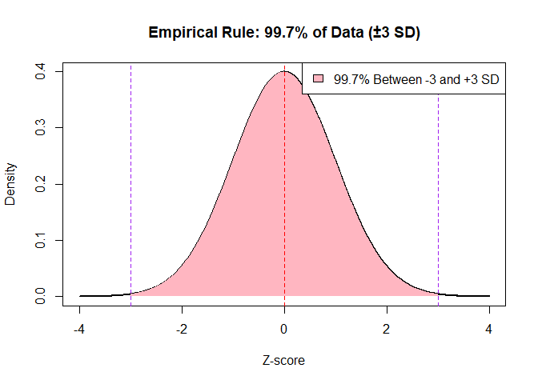
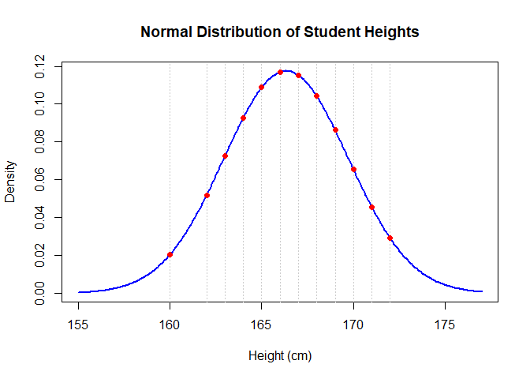

# Normal Distribution

The **Normal Distribution** is a **bell-shaped** curve that shows how
values in a dataset are **evenly spread** around a central average
(mean). Most values are close to the average, and fewer values appear as
you move further away.

### Normal Distribution Plot

------------------------------------------------------------------------

<table>
<colgroup>
<col style="width: 34%" />
<col style="width: 65%" />
</colgroup>
<thead>
<tr>
<th>Name</th>
<th>Why It’s Called That</th>
</tr>
</thead>
<tbody>
<tr>
<td><strong>Bell Curve</strong></td>
<td>Because the shape looks like a bell</td>
</tr>
<tr>
<td><strong>Gaussian Distribution</strong></td>
<td>Named after Carl Friedrich Gauss, who studied it</td>
</tr>
<tr>
<td><strong>Normal Curve</strong></td>
<td>Because it often appears in real-life data</td>
</tr>
</tbody>
</table>

------------------------------------------------------------------------

### Why Is It Called “Normal”?

It’s called **“normal”** because:

-   Many natural things **normally** follow this pattern (e.g., heights,
    IQ scores)

-   It was observed as a **common, regular** pattern in populations

-   Statisticians saw it as the **default or standard shape** in
    statistics

------------------------------------------------------------------------

### Key Properties of Normal Distribution

#### 1. Symmetrical

-   Left and right sides of the curve are mirror images

-   Values are equally distributed around the center

#### 2. Mean = Median = Mode

-   All three are at the center of the distribution

-   This happens only in a perfectly normal distribution

#### 3. Unimodal

There’s only one peak (most common value)

#### 5. Asymptotic

-   The curve never touches the x-axis, it stretches to infinity on both
    sides

#### 6. Empirical Rule

This rule helps understand how values fall within standard deviations:

-   **68%** of data falls within **±1 standard deviation** of the mean

-   **95%** within **±2 SD**

-   **99.7%** within **±3 SD**

This is very helpful for quickly estimating spread.

------------------------------------------------------------------------

### What Does “Normal Distribution” Mean?

-   It represents the **ideal pattern** for naturally varying data

-   It helps **predict probabilities**, compare scores, and model
    real-world behavior

-   It serves as the **foundation for many statistical techniques**
    (like t-tests, confidence intervals, and regression)

------------------------------------------------------------------------

# Example

Imagine we collect the heights of thousands of people. Most people will
have **average height**, fewer will be **tall** or **short**, and very
few will be **extremely tall** or **extremely short**. If we plot this,
it forms a **bell-shaped curve** — this is a normal distribution.

------------------------------------------------------------------------

#### Mathematical Formula

The formula for the normal distribution is:

$$
\Large f(x) = \frac{1}{\sqrt{2\pi\sigma^2}} e^{-\frac{(x - \mu)^2}{2\sigma^2}}
$$

Where:

-   *μ*: mean (center of the curve)
-   *σ*: standard deviation (spread of the curve)
-   *x*: value of the variable
-   *f*(*x*): probability density

------------------------------------------------------------------------

#### Example

Let’s say heights are normally distributed with:

-   Mean *μ* = 165 cm  
-   Standard deviation *σ* = 5 cm

We want to find how likely someone is **around 170 cm** tall.  
Since 170 is just 1 standard deviation above the mean:

$$
Z = \frac{170 - 165}{5} = 1
$$

We’ll use this Z-score in a standard normal table or R to get the
probability.

------------------------------------------------------------------------

Real-Life Scenario: Student Heights

You measured the heights of **15 students** in cm:

    heights <- c(160, 162, 164, 165, 166, 167, 165, 163, 168, 169, 170, 171, 172, 168, 165)
    n <- length(heights)

------------------------------------------------------------------------

### Step 1: Mean and Standard Deviation

We calculate:

$$ \large \bar{x} = \frac{1}{n} \underset{i=1}{\sum}^{n} x{\scriptstyle i}  $$

$$
\large s^2 = \frac{1}{n-1} \underset{i=1}{\sum}^{n} (x{\scriptstyle i} - \bar{x})^2
$$

    mu <- mean(heights)
    sigma <- sd(heights)

    print(mu)

    ## [1] 166.3333

    print(sigma)

    ## [1] 3.394674

-   Mean *x̄* = 166.33
-   Std *s* ≈ 3.39

We want to find density at height *x* = 170

------------------------------------------------------------------------

### Step 2: Normal Distribution Formula

The general formula for the **normal distribution** for sample is:

$$
f(x) = \frac{1}{\sqrt{2\pi s^2}} \cdot e^{-\frac{(x - \bar{x})^2}{2s^2}}
$$

We apply this manually to **each height value** to compute the
probability density:

#### Compute denominator:

$$
\sqrt{2\pi s^2} = \sqrt{2 \cdot 3.1416 \cdot (3.39)^2} = \sqrt{2 \cdot 3.1416 \cdot 11.4921} = \sqrt{72.20716} = 8.49748
$$

#### Compute exponent:

$$
-\frac{(x - \bar{x})^2}{2s^2} = -\frac{(170 - 166.33)^2}{2 \cdot 3.39^2} = -\frac{(3.67)^2}{2 \cdot 11.4921} = -\frac{13.4689}{22.9842} = -0.586
$$

#### Apply expnentiation

*e*−0.586 = 0.5565

#### Final Density

$$
f(170) = \frac{0.5565}{8.49748} = 0.06549
$$

    manual_density <- function(x, mu, sigma) {
      num <- exp(-((x - mu)^2) / (2 * sigma^2))
      den <- sqrt(2 * pi * sigma^2)
      num / den
    }

    density_values <- sapply(heights, manual_density, mu = mu, sigma = sigma)

    # Combine for table view
    density_table <- data.frame(
      Height = heights,
      Density = round(density_values, 5)
    )
    density_table

    ##    Height Density
    ## 1     160 0.02062
    ## 2     162 0.05203
    ## 3     164 0.09279
    ## 4     165 0.10880
    ## 5     166 0.11695
    ## 6     167 0.11528
    ## 7     165 0.10880
    ## 8     163 0.07257
    ## 9     168 0.10418
    ## 10    169 0.08632
    ## 11    170 0.06558
    ## 12    171 0.04568
    ## 13    172 0.02918
    ## 14    168 0.10418
    ## 15    165 0.10880

------------------------------------------------------------------------

### Step 3: Verify with `dnorm()`

    dnorm_values <- dnorm(heights, mean = mu, sd = sigma)

    # Compare manual vs built-in
    comparison_table <- data.frame(
      Height = heights,
      Manual = round(density_values, 5),
      dnorm = round(dnorm_values, 5)
    )
    comparison_table

    ##    Height  Manual   dnorm
    ## 1     160 0.02062 0.02062
    ## 2     162 0.05203 0.05203
    ## 3     164 0.09279 0.09279
    ## 4     165 0.10880 0.10880
    ## 5     166 0.11695 0.11695
    ## 6     167 0.11528 0.11528
    ## 7     165 0.10880 0.10880
    ## 8     163 0.07257 0.07257
    ## 9     168 0.10418 0.10418
    ## 10    169 0.08632 0.08632
    ## 11    170 0.06558 0.06558
    ## 12    171 0.04568 0.04568
    ## 13    172 0.02918 0.02918
    ## 14    168 0.10418 0.10418
    ## 15    165 0.10880 0.10880

------------------------------------------------------------------------

### Step 4: Visualize the Curve and Data Points

    x_vals <- seq(min(heights)-5, max(heights)+5, length.out = 300)
    y_vals <- dnorm(x_vals, mean = mu, sd = sigma)

    plot(x_vals, y_vals, type = "l", lwd = 2, col = "blue",
         main = "Normal Distribution of Student Heights",
         xlab = "Height (cm)", ylab = "Density")

    # Add vertical lines for each observed value
    abline(v = heights, col = "gray80", lty = 3)
    points(heights, dnorm_values, col = "red", pch = 19)

------------------------------------------------------------------------

### Interpretation

-   Each value’s density reflects how **common or likely** that value is
    under a normal distribution.

-   For instance, values near the mean (~166.33 cm) have **higher
    densities**.

-   Extremes (e.g., 160 or 172) are **less likely** and have **lower
    densities**.

-   We used the normal distribution formula manually for each student
    height

-   We verified using R’s built-in `dnorm()` function

-   Plotted the full normal curve and overlaid student data

-   You now know how to compute and interpret probability **density**,
    not direct probability, for continuous distributions

------------------------------------------------------------------------

There are 4 built-in functions in R — `dnorm()`, `pnorm()`, `qnorm()`,
and `rnorm()` — are part of R’s consistent naming convention for working
with probability distributions.

### Density Function `dnorm(x, mean, sd)`

This returns the **height of the normal curve** at a specific value *x*.

#### Purpose:

Used to **get the probability density** — not actual probability — at a
given value.

    dnorm(170, mean = 166.6, sd = 3.39)

    ## [1] 0.07116724

-   This means **170 cm** is a reasonably likely height, with a moderate
    density.

### Cumulative Distribution Function (CDF) `pnorm(q, mean, sd)`

This gives the **probability that a value is less than or equal** to *q*

#### Purpose:

Used to calculate **area under the curve**, or “less than”
probabilities.

    pnorm(170, mean = 166.33, sd = 3.39)

    ## [1] 0.8605061

-   This means **~82.7% of students are shorter than or equal to 170
    cm**.

### Quantile Function (Inverse of pnorm) `qnorm(p, mean, sd)`

This gives the **value (x)** below which a proportion `p` of the data
falls.

#### Purpose:

Used to find **cutoff scores** or **percentile thresholds**.

    qnorm(0.827, mean = 166.6, sd = 3.45)

    ## [1] 169.8512

-   So, if we want the height at the 82.7th percentile, it’s 170 cm.

### Random Number Generator `rnorm(n, mean, sd)`

This generates **n random values** that follow a normal distribution.

#### Purpose:

Used to **simulate data, bootstrap**, or generate **synthetic
datasets**.

    set.seed(123)
    rnorm(5, mean = 166.6, sd = 3.45)

    ## [1] 164.6664 165.8059 171.9775 166.8433 167.0460

-   Great for **simulation, sampling**, or **model testing**.

#### Summary Table

<table>
<colgroup>
<col style="width: 9%" />
<col style="width: 27%" />
<col style="width: 10%" />
<col style="width: 16%" />
<col style="width: 36%" />
</colgroup>
<thead>
<tr>
<th>Function</th>
<th>Purpose</th>
<th>Input</th>
<th>Output</th>
<th>Example Use</th>
</tr>
</thead>
<tbody>
<tr>
<td><code>dnorm()</code></td>
<td>Density (height of curve)</td>
<td>x value</td>
<td>Density value</td>
<td>How likely is exactly 170 cm?</td>
</tr>
<tr>
<td><code>pnorm()</code></td>
<td>Cumulative probability</td>
<td>x value</td>
<td>Prob(≤ x)</td>
<td>What’s the % shorter than 170 cm?</td>
</tr>
<tr>
<td><code>qnorm()</code></td>
<td>Quantile (inverse of pnorm)</td>
<td>Prob value</td>
<td>x value (cutoff)</td>
<td>What height is the 90th percentile?</td>
</tr>
<tr>
<td><code>rnorm()</code></td>
<td>Random sampling</td>
<td>n values</td>
<td>Simulated data</td>
<td>Generate 1000 random student heights</td>
</tr>
</tbody>
</table>

------------------------------------------------------------------------

### Importance of Normal Distribution

-   Many natural measurements (height, weight, IQ) follow it

-   Forms the basis of many statistical methods (t-tests, regression)

-   Helps calculate **probabilities**, **percentiles**, and **z-scores**

## Standard Normal Distribution?

A **standard normal distribution** is a special case of the normal
distribution with:

-   Mean = 0

-   Standard deviation = 1

-   It allows us to use the Z-score formula:

$$
\large Z = \frac{X - \mu}{\sigma}
$$

#### Standard Normal Curve

### Real-Life Uses

-   Standardized test scores (SAT, GRE)

-   Blood pressure levels

-   Measurement errors

-   Predicting probabilities in finance, science, and social studies

### Limitations of Normal Distribution

<table>
<colgroup>
<col style="width: 42%" />
<col style="width: 57%" />
</colgroup>
<thead>
<tr>
<th>Limitation</th>
<th>Why It Matters</th>
</tr>
</thead>
<tbody>
<tr>
<td>Assumes perfect symmetry</td>
<td>Many real datasets are <strong>skewed</strong> or uneven</td>
</tr>
<tr>
<td>Sensitive to outliers</td>
<td>Outliers can distort the mean and SD</td>
</tr>
<tr>
<td>Not always a good fit for real data</td>
<td>Many real-world distributions are <strong>non-normal</strong></td>
</tr>
<tr>
<td>Requires continuous data</td>
<td>It doesn’t work for <strong>categorical</strong> variables</td>
</tr>
</tbody>
</table>
