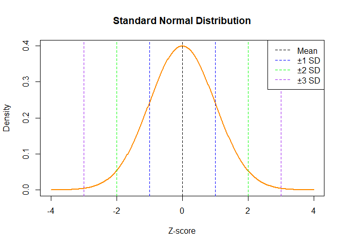

# Normal Distribution?

The **Normal Distribution** is a **bell-shaped** curve that shows how
values in a dataset are **evenly spread** around a central average
(mean). Most values are close to the average, and fewer values appear as
you move further away.

### Normal Distribution Plot

------------------------------------------------------------------------

<table>
<colgroup>
<col style="width: 34%" />
<col style="width: 65%" />
</colgroup>
<thead>
<tr>
<th>Name</th>
<th>Why It’s Called That</th>
</tr>
</thead>
<tbody>
<tr>
<td><strong>Bell Curve</strong></td>
<td>Because the shape looks like a bell</td>
</tr>
<tr>
<td><strong>Gaussian Distribution</strong></td>
<td>Named after Carl Friedrich Gauss, who studied it</td>
</tr>
<tr>
<td><strong>Normal Curve</strong></td>
<td>Because it often appears in real-life data</td>
</tr>
</tbody>
</table>

------------------------------------------------------------------------

### Why Is It Called “Normal”?

It’s called **“normal”** because:

-   Many natural things **normally** follow this pattern (e.g., heights,
    IQ scores)

-   It was observed as a **common, regular** pattern in populations

-   Statisticians saw it as the **default or standard shape** in
    statistics

------------------------------------------------------------------------

### Key Properties of Normal Distribution

#### 1. Symmetrical

-   Left and right sides of the curve are mirror images

-   Values are equally distributed around the center

#### 2. Mean = Median = Mode

-   All three are at the center of the distribution

-   This happens only in a perfectly normal distribution

#### 3. Unimodal

There’s only one peak (most common value)

#### 5. Asymptotic

-   The curve never touches the x-axis, it stretches to infinity on both
    sides

#### 6. Empirical Rule

This rule helps understand how values fall within standard deviations:

-   **68%** of data falls within **±1 standard deviation** of the mean

-   **95%** within **±2 SD**

-   **99.7%** within **±3 SD**

This is very helpful for quickly estimating spread.

------------------------------------------------------------------------

### What Does “Normal Distribution” Mean?

-   It represents the **ideal pattern** for naturally varying data

-   It helps **predict probabilities**, compare scores, and model
    real-world behavior

-   It serves as the **foundation for many statistical techniques**
    (like t-tests, confidence intervals, and regression)

------------------------------------------------------------------------

# Example

Imagine we collect the heights of thousands of people. Most people will
have **average height**, fewer will be **tall** or **short**, and very
few will be **extremely tall** or **extremely short**. If we plot this,
it forms a **bell-shaped curve** — this is a normal distribution.

------------------------------------------------------------------------

#### Mathematical Formula

The formula for the normal distribution is:

$$
\Large f(x) = \frac{1}{\sqrt{2\pi\sigma^2}} e^{-\frac{(x - \mu)^2}{2\sigma^2}}
$$

Where:

-   *μ*: mean (center of the curve)
-   *σ*: standard deviation (spread of the curve)
-   *x*: value of the variable
-   *f*(*x*): probability density

------------------------------------------------------------------------

#### Example

Let’s say heights are normally distributed with:

-   Mean *μ* = 165 cm  
-   Standard deviation *σ* = 5 cm

We want to find how likely someone is **around 170 cm** tall.  
Since 170 is just 1 standard deviation above the mean:

$$
Z = \frac{170 - 165}{5} = 1
$$

We’ll use this Z-score in a standard normal table or R to get the
probability.

------------------------------------------------------------------------

### Importance of Normal Distribution

-   Many natural measurements (height, weight, IQ) follow it

-   Forms the basis of many statistical methods (t-tests, regression)

-   Helps calculate **probabilities**, **percentiles**, and **z-scores**

## Standard Normal Distribution?

A **standard normal distribution** is a special case of the normal
distribution with:

-   Mean = 0

-   Standard deviation = 1

-   It allows us to use the Z-score formula:

$$
\large Z = \frac{X - \mu}{\sigma}
$$

#### Standard Normal Curve

### Real-Life Uses

-   Standardized test scores (SAT, GRE)

-   Blood pressure levels

-   Measurement errors

-   Predicting probabilities in finance, science, and social studies

### Limitations of Normal Distribution

<table>
<colgroup>
<col style="width: 42%" />
<col style="width: 57%" />
</colgroup>
<thead>
<tr>
<th>Limitation</th>
<th>Why It Matters</th>
</tr>
</thead>
<tbody>
<tr>
<td>Assumes perfect symmetry</td>
<td>Many real datasets are <strong>skewed</strong> or uneven</td>
</tr>
<tr>
<td>Sensitive to outliers</td>
<td>Outliers can distort the mean and SD</td>
</tr>
<tr>
<td>Not always a good fit for real data</td>
<td>Many real-world distributions are <strong>non-normal</strong></td>
</tr>
<tr>
<td>Requires continuous data</td>
<td>It doesn’t work for <strong>categorical</strong> variables</td>
</tr>
</tbody>
</table>
