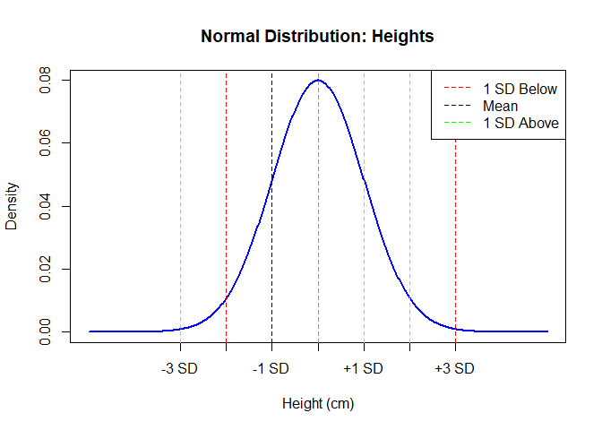

# Normal Distribution?

The **Normal Distribution**, also called the **Bell Curve**, is one of
the most important distributions in statistics. It describes how data
values are **spread out** or **clustered** around a central value
(mean).

------------------------------------------------------------------------

# Example

Imagine we collect the heights of thousands of people. Most people will
have **average height**, fewer will be **tall** or **short**, and very
few will be **extremely tall** or **extremely short**. If we plot this,
it forms a **bell-shaped curve** — this is a normal distribution.

------------------------------------------------------------------------

#### Mathematical Formula

The formula for the normal distribution is:

$$
\large f(x) = \frac{1}{\sqrt{2\pi\sigma^2}} e^{-\frac{(x - \mu)^2}{2\sigma^2}}
$$

Where: - $ $: mean (center of the curve) - $ $: standard deviation
(spread of the curve) - $ x $: value of the variable - $ f(x) $:
probability density

------------------------------------------------------------------------

#### Example

Let’s say heights are normally distributed with:

-   Mean *μ* = 165 cm  
-   Standard deviation *σ* = 5 cm

We want to find how likely someone is **around 170 cm** tall.  
Since 170 is just 1 standard deviation above the mean:

$$
Z = \frac{170 - 165}{5} = 1
$$

We’ll use this Z-score in a standard normal table or R to get the
probability.

------------------------------------------------------------------------

### Normal Distribution Plot

## Empirical Rule (68–95–99.7 Rule)

This rule helps understand how values fall within standard deviations:

-   **68%** of data falls within **±1 standard deviation** of the mean

-   **95%** within **±2 SD**

-   **99.7%** within **±3 SD**

This is very helpful for quickly estimating spread.

### Importance of Normal Distribution

-   Many natural measurements (height, weight, IQ) follow it

-   Forms the basis of many statistical methods (t-tests, regression)

-   Helps calculate **probabilities**, **percentiles**, and **z-scores**

## Standard Normal Distribution?

A **standard normal distribution** is a special case of the normal
distribution with:

-   Mean = 0

-   Standard deviation = 1

-   It allows us to use the Z-score formula:

$$
\large Z = \frac{X - \mu}{\sigma}
$$

#### Standard Normal Curve

### Real-Life Uses

-   Standardized test scores (SAT, GRE)

-   Blood pressure levels

-   Measurement errors

-   Predicting probabilities in finance, science, and social studies
