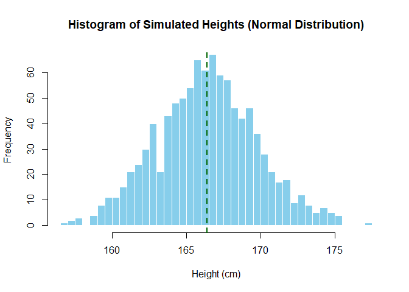

# Normal Distribution

The **Normal Distribution** is a **bell-shaped** curve that shows how
values in a dataset are **evenly spread** around a central average
(mean). Most values are close to the average, and fewer values appear as
you move further away.

### Normal Distribution Plot

------------------------------------------------------------------------

<table>
<colgroup>
<col style="width: 34%" />
<col style="width: 65%" />
</colgroup>
<thead>
<tr>
<th>Name</th>
<th>Why It’s Called That</th>
</tr>
</thead>
<tbody>
<tr>
<td><strong>Bell Curve</strong></td>
<td>Because the shape looks like a bell</td>
</tr>
<tr>
<td><strong>Gaussian Distribution</strong></td>
<td>Named after Carl Friedrich Gauss, who studied it</td>
</tr>
<tr>
<td><strong>Normal Curve</strong></td>
<td>Because it often appears in real-life data</td>
</tr>
</tbody>
</table>

------------------------------------------------------------------------

### Why Is It Called “Normal”?

It’s called **“normal”** because:

-   Many natural things **normally** follow this pattern (e.g., heights,
    IQ scores)

-   It was observed as a **common, regular** pattern in populations

-   Statisticians saw it as the **default or standard shape** in
    statistics

------------------------------------------------------------------------

### Key Properties of Normal Distribution

#### 1. Symmetrical

-   Left and right sides of the curve are mirror images

-   Values are equally distributed around the center

#### 2. Mean = Median = Mode

-   All three are at the center of the distribution

-   This happens only in a perfectly normal distribution

#### 3. Unimodal

There’s only one peak (most common value)

#### 5. Asymptotic

-   The curve never touches the x-axis, it stretches to infinity on both
    sides

#### 6. Empirical Rule

This rule helps understand how values fall within standard deviations:

-   **68%** of data falls within **±1 standard deviation** of the mean

-   **95%** within **±2 SD**

-   **99.7%** within **±3 SD**

This is very helpful for quickly estimating spread.

------------------------------------------------------------------------

### What Does “Normal Distribution” Mean?

-   It represents the **ideal pattern** for naturally varying data

-   It helps **predict probabilities**, compare scores, and model
    real-world behavior

-   It serves as the **foundation for many statistical techniques**
    (like t-tests, confidence intervals, and regression)

------------------------------------------------------------------------

# Example

Imagine we collect the heights of thousands of people. Most people will
have **average height**, fewer will be **tall** or **short**, and very
few will be **extremely tall** or **extremely short**. If we plot this,
it forms a **bell-shaped curve** — this is a normal distribution.

------------------------------------------------------------------------

#### Mathematical Formula

The formula for the normal distribution is:

$$
\Large f(x) = \frac{1}{\sqrt{2\pi\sigma^2}} e^{-\frac{(x - \mu)^2}{2\sigma^2}}
$$

Where:

-   *μ*: mean (center of the curve)
-   *σ*: standard deviation (spread of the curve)
-   *x*: value of the variable
-   *f*(*x*): probability density

------------------------------------------------------------------------

#### Example

Let’s say heights are normally distributed with:

-   Mean *μ* = 165 cm  
-   Standard deviation *σ* = 5 cm

We want to find how likely someone is **around 170 cm** tall.  
Since 170 is just 1 standard deviation above the mean:

$$
Z = \frac{170 - 165}{5} = 1
$$

We’ll use this Z-score in a standard normal table or R to get the
probability.

------------------------------------------------------------------------

Real-Life Scenario: Student Heights

You measured the heights of **15 students** in cm:

    heights <- c(160, 162, 164, 165, 166, 167, 165, 163, 168, 169, 170, 171, 172, 168, 165)
    n <- length(heights)

------------------------------------------------------------------------

### Step 1: Mean and Standard Deviation

We calculate:

$$ \large \bar{x} = \frac{1}{n} \underset{i=1}{\sum}^{n} x{\scriptstyle i}  $$

$$
\large s^2 = \frac{1}{n-1} \underset{i=1}{\sum}^{n} (x{\scriptstyle i} - \bar{x})^2
$$

    mu <- mean(heights)
    sigma <- sd(heights)

    print(mu)

    ## [1] 166.3333

    print(sigma)

    ## [1] 3.394674

-   Mean *x̄* = 166.33
-   Std *s* ≈ 3.39

We want to find density at height *x* = 170

------------------------------------------------------------------------

### Step 2: Normal Distribution Formula

The general formula for the **normal distribution** for sample is:

$$
f(x) = \frac{1}{\sqrt{2\pi s^2}} \cdot e^{-\frac{(x - \bar{x})^2}{2s^2}}
$$

We apply this manually to **each height value** to compute the
probability density:

#### Compute denominator:

$$
\sqrt{2\pi s^2} = \sqrt{2 \cdot 3.1416 \cdot (3.39)^2} = \sqrt{2 \cdot 3.1416 \cdot 11.4921} = \sqrt{72.20716} = 8.49748
$$

#### Compute exponent:

$$
-\frac{(x - \bar{x})^2}{2s^2} = -\frac{(170 - 166.33)^2}{2 \cdot 3.39^2} = -\frac{(3.67)^2}{2 \cdot 11.4921} = -\frac{13.4689}{22.9842} = -0.586
$$

#### Apply expnentiation

*e*−0.586 = 0.5565

#### Final Density

$$
f(170) = \frac{0.5565}{8.49748} = 0.06549
$$

    manual_density <- function(x, mu, sigma) {
      num <- exp(-((x - mu)^2) / (2 * sigma^2))
      den <- sqrt(2 * pi * sigma^2)
      num / den
    }

    density_values <- sapply(heights, manual_density, mu = mu, sigma = sigma)

    # Combine for table view
    density_table <- data.frame(
      Height = heights,
      Density = round(density_values, 5)
    )
    density_table

    ##    Height Density
    ## 1     160 0.02062
    ## 2     162 0.05203
    ## 3     164 0.09279
    ## 4     165 0.10880
    ## 5     166 0.11695
    ## 6     167 0.11528
    ## 7     165 0.10880
    ## 8     163 0.07257
    ## 9     168 0.10418
    ## 10    169 0.08632
    ## 11    170 0.06558
    ## 12    171 0.04568
    ## 13    172 0.02918
    ## 14    168 0.10418
    ## 15    165 0.10880

------------------------------------------------------------------------

### Step 3: Verify with `dnorm()`

    dnorm_values <- dnorm(heights, mean = mu, sd = sigma)

    # Compare manual vs built-in
    comparison_table <- data.frame(
      Height = heights,
      Manual = round(density_values, 5),
      dnorm = round(dnorm_values, 5)
    )
    comparison_table

    ##    Height  Manual   dnorm
    ## 1     160 0.02062 0.02062
    ## 2     162 0.05203 0.05203
    ## 3     164 0.09279 0.09279
    ## 4     165 0.10880 0.10880
    ## 5     166 0.11695 0.11695
    ## 6     167 0.11528 0.11528
    ## 7     165 0.10880 0.10880
    ## 8     163 0.07257 0.07257
    ## 9     168 0.10418 0.10418
    ## 10    169 0.08632 0.08632
    ## 11    170 0.06558 0.06558
    ## 12    171 0.04568 0.04568
    ## 13    172 0.02918 0.02918
    ## 14    168 0.10418 0.10418
    ## 15    165 0.10880 0.10880

------------------------------------------------------------------------

### Step 4: Visualize the Curve and Data Points

    x_vals <- seq(min(heights)-5, max(heights)+5, length.out = 300)
    y_vals <- dnorm(x_vals, mean = mu, sd = sigma)

    plot(x_vals, y_vals, type = "l", lwd = 2, col = "blue",
         main = "Normal Distribution of Student Heights",
         xlab = "Height (cm)", ylab = "Density")

    # Add vertical lines for each observed value
    abline(v = heights, col = "gray80", lty = 3)
    points(heights, dnorm_values, col = "red", pch = 19)

------------------------------------------------------------------------

### Interpretation

-   Each value’s density reflects how **common or likely** that value is
    under a normal distribution.

-   For instance, values near the mean (~166.33 cm) have **higher
    densities**.

-   Extremes (e.g., 160 or 172) are **less likely** and have **lower
    densities**.

-   We used the normal distribution formula manually for each student
    height

-   We verified using R’s built-in `dnorm()` function

-   Plotted the full normal curve and overlaid student data

-   You now know how to compute and interpret probability **density**,
    not direct probability, for continuous distributions

------------------------------------------------------------------------

There are 4 built-in functions in R — `dnorm()`, `pnorm()`, `qnorm()`,
and `rnorm()` — are part of R’s consistent naming convention for working
with probability distributions.

### Density Function `dnorm(x, mean, sd)`

This returns the **height of the normal curve** at a specific value *x*.

#### Purpose:

Used to **get the probability density** — not actual probability — at a
given value.

    dnorm(170, mean = 166.6, sd = 3.39)

    ## [1] 0.07116724

-   The **blue curve** is the normal distribution of student height.
-   The **red vertical dashed line** shows where 170 cm falls.
-   The **red point** marks the **density value** computed by
    `dnorm(170, 166.6, 3.39)`.

This makes it easy to interpret how common or rare a value like 170 cm
is in that distribution.

-   This means **170 cm** is a reasonably likely height, with a moderate
    density.

### Cumulative Distribution Function (CDF) `pnorm(q, mean, sd)`

This gives the **probability that a value is less than or equal** to *q*

#### Purpose:

Used to calculate **area under the curve**, or “less than”
probabilities.

    pnorm(170, mean = 166.33, sd = 3.39)

    ## [1] 0.8605061

-   The **blue curve** is the normal distribution of student height.

-   The **red vertical dashed line** shows where 170 cm falls.

-   The **red point** marks the **density value** computed by dnorm(170,
    166.6, 3.39).

-   This means **~82.7% of students are shorter than or equal to 170
    cm**.

### Quantile Function (Inverse of pnorm) `qnorm(p, mean, sd)`

This gives the **value (x)** below which a proportion `p` of the data
falls.

#### Purpose:

Used to find **cutoff scores** or **percentile thresholds**.

    qnorm(0.827, mean = 166.6, sd = 3.45)

    ## [1] 169.8512

-   The **green curve** is the normal distribution.
-   The **shaded region** shows the area under the curve from the far
    left up to the **82.7th percentile**.
-   The **red vertical** line marks the **quantile value (~170 cm)**,
    which means:

> About **82.7% of students** have heights **less than or equal to 170
> cm**.

-   So, if we want the height at the 82.7th percentile, it’s 170 cm.

### Random Number Generator `rnorm(n, mean, sd)`

This generates **n random values** that follow a normal distribution.

#### Purpose:

Used to **simulate data, bootstrap**, or generate **synthetic
datasets**.

    set.seed(123)
    rnorm(1000, mean = 166.33, sd = 3.39)

    ##    [1] 164.4300 165.5497 171.6140 166.5690 166.7683 172.1441 167.8925 162.0414
    ##    [9] 164.0016 164.8192 170.4796 167.5498 167.6886 166.7052 164.4457 172.3876
    ##   [17] 168.0177 159.6632 168.7076 164.7272 162.7101 165.5911 162.8518 163.8591
    ##   [25] 164.2111 160.6121 169.1701 166.8499 162.4717 170.5804 167.7757 165.3297
    ##   [33] 169.3645 169.3069 169.1152 168.6645 168.2078 166.1201 165.2928 165.0402
    ##   [41] 163.9749 165.6252 162.0403 173.6828 170.4250 162.5227 164.9642 164.7480
    ##   [49] 168.9741 166.0474 167.1887 166.2332 166.1847 170.9696 165.5646 171.4708
    ##   [57] 161.0797 168.3118 166.7499 167.0620 167.6170 164.6271 165.2004 162.8770
    ##   [65] 162.6966 167.3590 167.8494 166.5097 169.4565 173.2798 164.6654 158.5019
    ##   [73] 169.7395 163.9258 163.9977 169.8067 165.3646 162.1918 166.9446 165.8592
    ##   [81] 166.3495 167.6361 165.0735 168.5144 165.5826 167.4547 170.0483 167.8053
    ##   [89] 165.2251 170.2245 169.6980 168.1891 167.1393 164.2014 170.9426 164.2951
    ##   [97] 173.7451 171.5256 165.5310 162.8504 163.9217 167.2008 165.4937 165.1518
    ##  [105] 163.1040 166.1774 163.6692 160.6757 165.0410 169.4454 164.3796 168.3910
    ##  [113] 160.8454 166.1416 168.0908 167.3509 166.6882 164.1580 163.4495 162.8582
    ##  [121] 166.7288 163.1181 164.6670 165.4618 172.5807 164.1199 167.1280 166.5943
    ##  [129] 163.0693 166.0883 171.2270 167.8606 166.4698 164.8977 159.3695 170.1652
    ##  [137] 161.3784 168.8384 172.8019 161.4352 168.7090 165.4412 161.0004 161.1953
    ##  [145] 160.9008 164.5302 161.3746 168.6620 173.4494 161.9670 169.0004 168.9371
    ##  [153] 167.4562 162.9116 165.9251 165.3795 168.2385 165.0674 169.6419 165.0602
    ##  [161] 169.8987 162.7733 162.0581 177.3171 164.9169 167.3410 168.4880 164.6900
    ##  [169] 168.0822 167.5808 165.5999 166.5513 166.2145 173.5455 163.8169 162.6146
    ##  [177] 166.4581 167.3825 167.8098 164.7761 162.7253 170.6122 165.1447 163.3959
    ##  [185] 165.5290 165.6616 170.0926 166.6173 168.8862 164.6374 167.0570 165.2293
    ##  [193] 166.6506 163.2947 161.8864 173.1006 168.3664 162.0882 164.2581 162.3112
    ##  [201] 173.7840 170.7791 165.4312 168.1714 164.9254 164.7155 163.6566 164.3142
    ##  [209] 171.9266 166.1468 166.7342 167.1561 170.5081 164.5805 162.9654 172.0106
    ##  [217] 164.8345 163.8788 162.1390 161.9748 164.3842 168.4250 170.0924 168.7287
    ##  [225] 165.0972 166.5326 163.9414 163.8986 169.3290 162.8871 172.9584 166.0238
    ##  [233] 167.0573 163.8264 164.3828 161.8653 165.7099 167.7504 167.4294 163.6806
    ##  [241] 163.6566 164.6275 171.4016 162.4745 165.7230 172.7790 165.9877 161.7201
    ##  [249] 164.0764 167.9757 165.0567 164.4252 165.1641 166.6368 171.7489 166.0298
    ##  [257] 169.9939 168.4683 165.9448 161.1335 164.5634 164.6693 166.4899 170.7377
    ##  [265] 174.1035 171.5763 165.8786 160.3754 165.0120 166.6324 169.1946 169.5930
    ##  [273] 168.6498 161.6000 169.2103 164.8162 166.9226 166.5827 167.7815 166.4136
    ##  [281] 160.6773 168.8267 167.6386 165.4294 166.7305 166.7844 167.0793 171.8925
    ##  [289] 165.5874 166.8997 170.2908 169.9037 170.2124 164.3724 173.1184 166.5561
    ##  [297] 172.6586 161.7504 166.4011 170.5672 163.9053 163.7784 163.1484 162.7620
    ##  [305] 164.8480 167.4527 159.5018 167.0486 170.5223 173.2374 170.7410 168.8955
    ##  [313] 160.4764 164.2909 165.1366 168.7149 165.9718 162.0632 172.0402 169.4196
    ##  [321] 167.1349 170.4594 161.7916 168.5702 164.5573 168.6479 166.1238 168.4757
    ##  [329] 170.8574 166.3547 169.7795 162.3012 163.8838 171.4801 167.6093 159.3730
    ##  [337] 161.7059 165.6494 169.2650 165.9846 168.4460 169.5810 171.9949 166.5199
    ##  [345] 166.1538 160.3865 166.6667 164.3914 163.0281 165.7201 169.7707 159.5746
    ##  [353] 164.8815 166.7254 163.3020 167.4619 167.7247 166.2180 157.9706 175.0472
    ##  [361] 165.6340 168.5375 167.2581 169.8036 169.1019 165.6188 167.6120 163.1251
    ##  [369] 169.2350 164.7671 174.5229 160.7329 164.7571 169.1280 168.0593 164.3317
    ##  [377] 162.9509 166.8198 166.2815 160.2609 166.4471 166.9749 166.9223 162.7535
    ##  [385] 167.9441 171.0034 167.8766 162.4804 164.8532 167.5033 164.1365 159.0156
    ##  [393] 169.3276 163.5181 164.3856 171.4282 163.7056 169.1970 162.0563 165.1281
    ##  [401] 166.0806 162.3683 164.1782 166.2322 168.6037 160.7346 165.1443 168.8942
    ##  [409] 164.5034 167.1005 167.9987 167.2380 168.5445 165.9140 164.9276 157.3697
    ##  [417] 166.0149 167.7887 168.1450 164.4476 172.3625 167.3010 166.7582 170.6430
    ##  [425] 163.8944 164.8034 174.4574 166.3677 171.8678 161.4535 165.6841 167.6129
    ##  [433] 167.3471 162.9209 166.3953 162.6775 168.7461 170.0074 158.7873 170.5190
    ##  [441] 162.1229 167.8717 168.5671 165.6524 164.1431 166.8904 167.8176 169.3244
    ##  [449] 159.3726 160.7827 171.1791 169.8781 167.8056 168.7545 169.4392 157.3095
    ##  [457] 170.0938 164.6859 167.1118 165.3294 169.2860 165.1487 168.0877 165.0056
    ##  [465] 162.6255 170.4319 168.8417 172.1752 166.5509 170.1438 173.0267 165.3758
    ##  [473] 161.8452 165.5186 165.6044 166.8442 172.1347 165.2244 167.5945 165.5582
    ##  [481] 166.3993 167.3947 170.8326 166.7413 168.7465 168.9703 169.4311 164.3828
    ##  [489] 171.8451 165.0386 165.9714 171.0897 170.7169 162.6349 163.3703 161.7261
    ##  [497] 166.9465 166.8888 167.5643 168.2018 164.2896 162.9614 169.8108 168.8761
    ##  [505] 161.2139 166.0075 163.2927 159.3102 166.8389 166.0615 165.9999 167.0628
    ##  [513] 169.3216 167.0270 164.2403 163.8390 165.8832 167.3810 162.8055 165.7052
    ##  [521] 169.6090 165.9629 163.9624 165.3945 170.1087 168.1946 170.5223 166.8015
    ##  [529] 167.7208 164.4368 168.3822 164.6135 161.5143 166.7639 172.9264 169.0451
    ##  [537] 170.2802 167.5465 164.2670 165.6444 165.4037 164.7411 168.7171 162.2709
    ##  [545] 169.2670 169.2595 162.2667 168.4979 174.5685 164.4410 169.1942 163.6783
    ##  [553] 170.0953 167.1769 171.9300 161.3841 166.1561 164.5437 165.6613 164.1957
    ##  [561] 163.5033 168.2919 162.6431 171.3609 162.3088 166.6727 168.1368 168.3190
    ##  [569] 165.3071 166.5995 169.5887 161.3926 163.6799 167.4162 164.8222 170.9743
    ##  [577] 168.6123 166.5746 161.2187 166.4185 165.2574 165.9830 162.3245 168.0205
    ##  [585] 162.8079 165.5631 167.6230 163.6739 168.3063 161.8670 156.8049 167.9062
    ##  [593] 169.1794 165.3610 168.0390 162.4114 165.8990 159.7483 170.3342 172.6351
    ##  [601] 169.9709 166.2373 166.2170 161.1905 169.0094 165.6156 164.1036 161.5432
    ##  [609] 165.3138 163.4517 164.9841 162.2023 172.0509 166.2758 169.9741 157.5102
    ##  [617] 164.7937 164.0401 162.1843 171.5730 161.5322 167.4093 169.1994 166.9341
    ##  [625] 163.3629 169.5206 166.9083 162.7247 161.6245 173.4040 164.0299 160.0396
    ##  [633] 168.1377 167.3817 161.7405 159.7434 165.9357 170.1926 168.4865 164.6589
    ##  [641] 163.5021 167.2489 166.8634 168.4647 164.9882 169.3788 163.5135 165.2095
    ##  [649] 168.8414 169.6860 159.7585 166.6934 168.3938 161.4117 167.9593 163.5225
    ##  [657] 169.7887 168.1555 168.9371 166.7392 169.2578 171.0099 172.9956 166.2337
    ##  [665] 158.7057 166.4369 167.0269 165.8034 168.2565 169.7562 164.5740 165.3330
    ##  [673] 167.6787 164.4647 166.6394 159.6798 162.5335 161.8289 163.4362 163.9797
    ##  [681] 167.6260 169.6594 163.8642 162.9507 162.7987 164.9245 165.5197 167.9695
    ##  [689] 165.2407 159.2839 166.0200 170.3546 170.3695 163.6554 161.0830 174.6628
    ##  [697] 165.7794 165.9996 167.7557 160.8584 163.8613 161.1079 163.9804 166.7329
    ##  [705] 161.7036 168.3300 167.3109 163.2647 167.0972 168.8660 169.9271 165.6084
    ##  [713] 166.0126 166.0360 171.2166 170.1440 169.1586 165.3559 167.5953 167.6972
    ##  [721] 162.7987 160.4710 168.5058 161.1456 166.3357 167.1783 168.2415 166.9722
    ##  [729] 163.8456 169.6738 172.2240 169.3172 159.7410 171.0746 166.1400 168.1095
    ##  [737] 168.4387 166.0022 166.0749 169.7849 168.7423 169.6870 174.4081 168.5824
    ##  [745] 167.0330 158.8360 175.4549 164.6937 174.3804 167.6000 171.5453 165.9581
    ##  [753] 168.0639 167.0553 165.6991 165.9219 169.7635 165.6471 159.4223 165.6659
    ##  [761] 168.1599 168.4198 168.4202 160.5938 167.5800 169.6110 170.6576 165.5674
    ##  [769] 165.2388 171.3738 160.6757 164.8491 167.8808 160.8457 167.2779 172.6960
    ##  [777] 166.3162 165.3860 167.9400 165.3839 169.0874 169.3960 166.3391 162.3410
    ##  [785] 161.8612 164.3197 169.0331 159.6917 159.9354 164.1137 167.6670 163.2330
    ##  [793] 169.3361 167.4601 165.7515 169.1058 167.6466 164.8183 167.1135 168.5251
    ##  [801] 167.5378 164.0993 169.2291 170.2385 167.2666 166.8185 166.0736 173.6572
    ##  [809] 167.2667 165.7934 157.8282 161.0237 166.0667 167.0293 167.2686 169.1149
    ##  [817] 165.6718 170.4475 163.2061 162.2334 162.1637 168.8464 166.0489 169.0075
    ##  [825] 165.4225 164.3235 165.0813 160.0496 162.3650 161.4415 169.9042 164.3051
    ##  [833] 169.0063 171.4709 165.6799 167.2923 160.3939 163.5547 166.5206 167.3439
    ##  [841] 163.7556 175.4317 164.7761 166.5478 168.5328 166.2418 164.1483 169.8736
    ##  [849] 171.8067 166.2293 168.2361 165.9998 169.7758 162.4106 174.1977 164.2840
    ##  [857] 161.3845 165.1404 166.8273 171.8341 169.4190 166.8129 161.6197 163.3941
    ##  [865] 165.7765 174.9848 160.0238 170.1643 164.5427 171.9777 162.4681 166.8169
    ##  [873] 162.6025 169.3929 171.3600 172.9429 169.0339 172.5787 170.5554 165.8829
    ##  [881] 167.9472 163.0349 165.7022 170.4691 168.1650 167.8804 162.8107 164.2807
    ##  [889] 163.7380 167.6701 162.9722 168.2353 162.5453 172.5287 167.8914 163.9536
    ##  [897] 167.1471 165.1352 167.5882 167.1556 162.8922 163.6474 167.3456 171.8864
    ##  [905] 170.0069 164.2127 169.1299 166.1654 167.3515 167.2126 175.0608 162.3119
    ##  [913] 166.6721 160.2959 168.3295 170.0475 171.2308 159.8038 167.7293 171.7315
    ##  [921] 164.9265 165.6108 166.2061 167.5674 168.5849 170.7974 166.0063 166.9954
    ##  [929] 174.7643 167.7914 166.9699 161.7798 166.3397 165.5797 166.2926 164.3793
    ##  [937] 164.0017 163.8866 165.6028 170.9680 169.8864 165.1097 160.6147 163.4669
    ##  [945] 164.7782 166.6813 164.0838 173.1326 165.4070 162.2147 165.8511 162.9218
    ##  [953] 166.8594 167.1220 167.5354 160.8319 167.0782 167.3824 161.5124 169.5687
    ##  [961] 168.9883 174.1257 166.8612 166.4884 166.6574 166.5665 160.0637 160.6649
    ##  [969] 166.0671 164.3602 166.5156 159.1730 161.2494 162.5960 169.6727 162.6061
    ##  [977] 163.6196 166.6008 165.2359 166.8264 174.1442 162.5176 165.2945 164.5782
    ##  [985] 171.4570 163.7214 166.0517 168.9984 162.7414 171.9410 168.6208 162.6884
    ##  [993] 167.8710 165.6069 167.3918 166.0250 169.9590 161.7498 164.5583 165.4852

-   Great for **simulation, sampling**, or **model testing**.

#### Summary Table

<table>
<colgroup>
<col style="width: 9%" />
<col style="width: 27%" />
<col style="width: 10%" />
<col style="width: 16%" />
<col style="width: 36%" />
</colgroup>
<thead>
<tr>
<th>Function</th>
<th>Purpose</th>
<th>Input</th>
<th>Output</th>
<th>Example Use</th>
</tr>
</thead>
<tbody>
<tr>
<td><code>dnorm()</code></td>
<td>Density (height of curve)</td>
<td>x value</td>
<td>Density value</td>
<td>How likely is exactly 170 cm?</td>
</tr>
<tr>
<td><code>pnorm()</code></td>
<td>Cumulative probability</td>
<td>x value</td>
<td>Prob(≤ x)</td>
<td>What’s the % shorter than 170 cm?</td>
</tr>
<tr>
<td><code>qnorm()</code></td>
<td>Quantile (inverse of pnorm)</td>
<td>Prob value</td>
<td>x value (cutoff)</td>
<td>What height is the 90th percentile?</td>
</tr>
<tr>
<td><code>rnorm()</code></td>
<td>Random sampling</td>
<td>n values</td>
<td>Simulated data</td>
<td>Generate 1000 random student heights</td>
</tr>
</tbody>
</table>

------------------------------------------------------------------------

### Importance of Normal Distribution

-   Many natural measurements (height, weight, IQ) follow it

-   Forms the basis of many statistical methods (t-tests, regression)

-   Helps calculate **probabilities**, **percentiles**, and **z-scores**

## Standard Normal Distribution?

A **standard normal distribution** is a special case of the normal
distribution with:

-   Mean = 0

-   Standard deviation = 1

-   It allows us to use the Z-score formula:

$$
\large Z = \frac{X - \mu}{\sigma}
$$

#### Standard Normal Curve

### Real-Life Uses

-   Standardized test scores (SAT, GRE)

-   Blood pressure levels

-   Measurement errors

-   Predicting probabilities in finance, science, and social studies

### Limitations of Normal Distribution

<table>
<colgroup>
<col style="width: 42%" />
<col style="width: 57%" />
</colgroup>
<thead>
<tr>
<th>Limitation</th>
<th>Why It Matters</th>
</tr>
</thead>
<tbody>
<tr>
<td>Assumes perfect symmetry</td>
<td>Many real datasets are <strong>skewed</strong> or uneven</td>
</tr>
<tr>
<td>Sensitive to outliers</td>
<td>Outliers can distort the mean and SD</td>
</tr>
<tr>
<td>Not always a good fit for real data</td>
<td>Many real-world distributions are <strong>non-normal</strong></td>
</tr>
<tr>
<td>Requires continuous data</td>
<td>It doesn’t work for <strong>categorical</strong> variables</td>
</tr>
</tbody>
</table>
