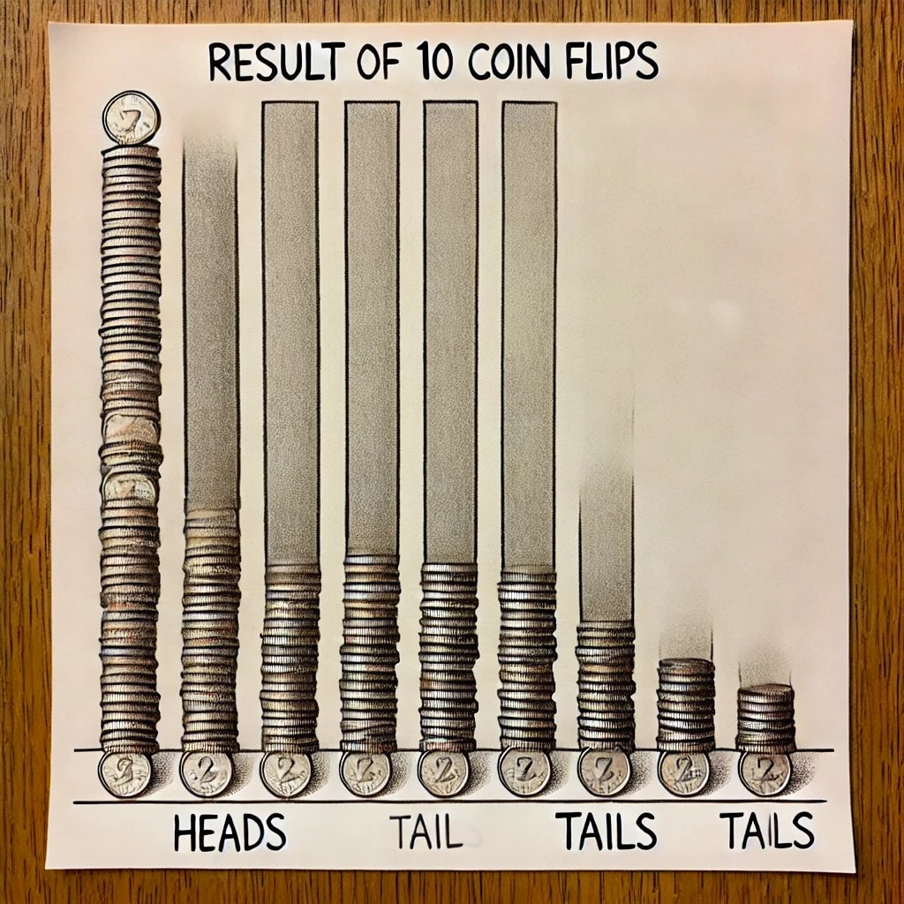

# Probability

The foundation of statistical inference is the theory of probability. It
tells the likelihood of an event occurring. Probability measures the
likelihood that a specific event will occur, expressed as a number
between 0 (impossible) and 1 (certain). An event is likely of unlikely.

## Frequentist definition

If an experiment is repeated n times under essential identical
conditions, and if the event A occurs m times, then as n grows large,
the **ratio of m/n** approaches to a fixed limit that is probability of
A:

The probability of event A is given by:

$$\huge P(A) = \frac{m}{n}$$

-   P(A) = Probability of event A

## Law of large numbers

The Law of Large Numbers is a fundamental concept in probability that
states that as the number of trials or observations increases, the
average of the results obtained from these trials will converge to the
expected value.     Imagine flipping a fair coin multiple times.
The expected probability of getting heads is 0.5. According to the Law
of Large Numbers, as you flip the coin more and more times, the
proportion of heads (or tails) should get closer and closer to 0.5.  
  Let’s start with 10 flips of a coin.

Figure 6.1: 10 coin flips

Here is the bar chart illustrating the result of 10 coin flips, with a
noticeable deviation from the expected probability of 0.5.

Now 50 flips of a coin.

Figure 6.2: 50 coin flips

Here is the bar chart illustrating the result of 50 coin flips, where
the proportions are closer to the expected 0.5.     Now 1000 flips
of a coin.

Figure 6.3: 1000 coin flips

Here is the bar chart illustrating the result of 1000 coin flips,
showing how the proportions of heads and tails converge closely to 0.5.

## Important concepts used in probability

### Event

### Complement

### Sample space

### Disjoint event

### Non-Disjoint event

### Indepenet

### Dependent

[⬅ Back to Home](../index.md)
