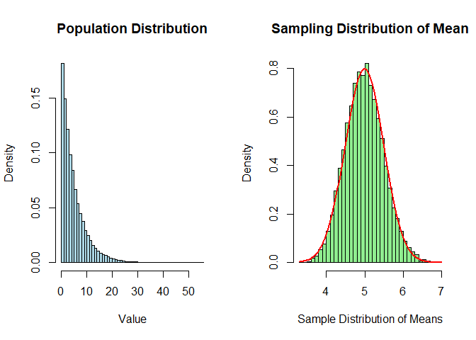
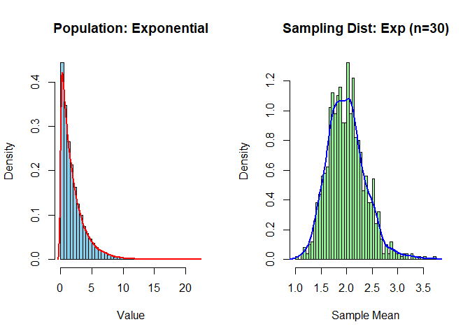
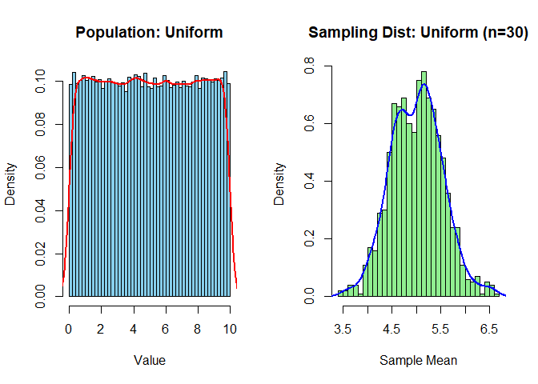
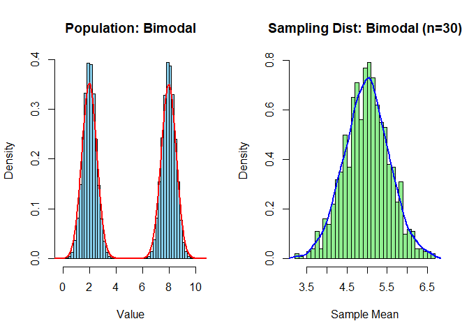

# Sampling Distribution of Mean

## Statistical Inference

**Statistical inference** is the process of drawing conclusions about a
**population** based on information from a **sample**.

> Since studying an entire population is often impractical or
> impossible, we collect data from a sample and use statistical methods
> to make educated guesses about the whole population.

Example: You want to know the **average height** of adults in India, but
you can’t measure everyone. Instead, you:

-   Measure 1000 randomly selected adults (sample),
-   Calculate their average height,
-   Use statistical inference to **estimate the average height** of all
    adults in India (population).

### Why Is Statistical Inference Required?

<table>
<colgroup>
<col style="width: 29%" />
<col style="width: 70%" />
</colgroup>
<thead>
<tr>
<th>Reason</th>
<th>Explanation</th>
</tr>
</thead>
<tbody>
<tr>
<td><strong>1. Population is too large</strong></td>
<td>We can’t collect data from every individual. Inference helps
generalize.</td>
</tr>
<tr>
<td><strong>2. Saves time and cost</strong></td>
<td>Working with samples is faster and cheaper than a full census.</td>
</tr>
<tr>
<td><strong>3. Allows decision making</strong></td>
<td>Enables predictions, testing of hypotheses, and drawing
conclusions.</td>
</tr>
<tr>
<td><strong>4. Manages uncertainty</strong></td>
<td>Uses probability to quantify how reliable the conclusions are.</td>
</tr>
</tbody>
</table>

### Basic Components

#### Population:

The entire group you want to study (e.g., all Indian adults).

#### Sample:

A smaller group selected from the population (e.g., 1000 adults).

#### Parameter:

A numerical summary of the population (e.g., true average height μ).

#### Statistic:

A numerical summary of the sample (e.g., sample mean x̄).

#### Inference:

Using the statistic to estimate the parameter.

#### Types of Statistical Inference

<table>
<colgroup>
<col style="width: 22%" />
<col style="width: 49%" />
<col style="width: 28%" />
</colgroup>
<thead>
<tr>
<th>Type</th>
<th>Description</th>
<th>Examples</th>
</tr>
</thead>
<tbody>
<tr>
<td><strong>1. Estimation</strong></td>
<td>Estimating population parameters using sample data</td>
<td>Confidence intervals</td>
</tr>
<tr>
<td><strong>2. Hypothesis Testing</strong></td>
<td>Testing assumptions or claims about the population</td>
<td>Z-test, t-test</td>
</tr>
<tr>
<td><strong>3. Prediction</strong></td>
<td>Predicting future outcomes based on current data</td>
<td>Regression models</td>
</tr>
<tr>
<td><strong>4. Bayesian Inference</strong></td>
<td>Updating beliefs based on new data using Bayes’ theorem</td>
<td>Posterior probability estimation</td>
</tr>
</tbody>
</table>

### Estimation in Detail

#### Point Estimation:

Provides a single best guess (e.g., sample mean *x̄* estimates population
mean *μ*).

#### Interval Estimation:

Provides a range of values within which the parameter likely falls,
along with confidence level (e.g., “The average height is between
165–170 cm with 95% confidence”).

### Hypothesis Testing

-   To test a claim or belief about a population parameter.

### Confidence Intervals

-   A confidence interval gives a range of plausible values for a
    population parameter.

#### Importance of Probability

-   Probability theory is the backbone of statistical inference.
-   It quantifies **uncertainty** in decision-making.
-   Helps interpret **confidence**, **p-values**, and **risk**.

#### Summary Table

<table>
<colgroup>
<col style="width: 30%" />
<col style="width: 69%" />
</colgroup>
<thead>
<tr>
<th>Concept</th>
<th>Description</th>
</tr>
</thead>
<tbody>
<tr>
<td><strong>Inference</strong></td>
<td>Drawing conclusions about population from sample</td>
</tr>
<tr>
<td><strong>Estimation</strong></td>
<td>Finding approximate value of population parameter</td>
</tr>
<tr>
<td><strong>Hypothesis testing</strong></td>
<td>Testing claims with sample data</td>
</tr>
<tr>
<td><strong>Standard error</strong></td>
<td>Measures variability of sample statistic</td>
</tr>
<tr>
<td><strong>Confidence level</strong></td>
<td>Probability that interval contains true parameter</td>
</tr>
</tbody>
</table>

------------------------------------------------------------------------

## Sampling Distribution?

A **sampling distribution** is the probability distribution of a given
statistic (like the mean) based on a **random sample**.

> In simpler terms: Imagine we repeatedly take samples from a population
> and compute the sample mean each time. The distribution of all those
> sample means is called the **sampling distribution of the mean**.

#### Example:

Suppose a population has 10,000 students with an average height of 160
cm. If we randomly **select samples of 50 students** and calculate their
mean height every time, you get many different means. The **distribution
of those sample means** is the **sampling distribution of the mean**.

-   The above figure shows exponential distribution (left plot) for
    population.  

-   Here, we selected multiple samples (n = 100) randomly from the
    population of 10,000 and calculated mean for each sample.

    -   Sample 1 (n = 100) → mean(Sample 1)
    -   Sample 2 (n = 100) → mean(Sample 2)
    -   Sample 3 (n = 100) → mean(Sample 3)
    -   Sample 4 (n = 100) → mean(Sample 4)
    -   Sample n (n = 100) → mean(Sample n)

-   The right plot shows Sampling distribution of sample means. It looks
    like a bell curve due to the **Central Limit Theorem**.

-   It helps us **estimate population parameters** using sample
    statistics.

-   Forms the basis of **confidence intervals** and **hypothesis
    testing**.

### Characteristics of the Sampling Distribution of the Mean

Assume:

-   Population mean = μ
-   Population standard deviation = σ
-   Sample size = n

Then:

<table>
<colgroup>
<col style="width: 37%" />
<col style="width: 62%" />
</colgroup>
<thead>
<tr>
<th>Property</th>
<th>Description</th>
</tr>
</thead>
<tbody>
<tr>
<td><strong>Mean of sampling distribution</strong></td>
<td>Equal to population mean: <strong>E(X̄) = μ</strong></td>
</tr>
<tr>
<td><strong>Standard deviation</strong></td>
<td>Called the <strong>Standard Error (SE)</strong>: <strong>SE = σ /
√n</strong></td>
</tr>
<tr>
<td><strong>Shape</strong></td>
<td>Approaches normal as n increases (Central Limit Theorem)</td>
</tr>
</tbody>
</table>

------------------------------------------------------------------------

## Standard Error (SE)?

The **Standard Error** is the **standard deviation of the sampling
distribution of the mean**.

Formula:

$$
\large SE = \frac {\sigma}{\sqrt n}
$$

Where:

-   *σ*: Standard deviation of the population
-   *n*: Sample size

#### Explanation:

Imagine we’re trying to find the average income of all families in our
city. We can’t ask everyone — so we take a sample (say, 100 families),
calculate the average, and repeat this sampling many times.

Each time, our average is a little different. These differences are
natural and expected due to sample-to-sample variability.

> The **SE** measures **how much your sample means tend to vary** from
> one sample to another.

You own a bakery, and you bake cookies every day. You want to estimate
the average weight of your cookies.

#### Scenario A – Small Sample:

You randomly pick **4 cookies**, weigh them, and compute the average.

-   It might be 52g, but tomorrow, another sample of 4 might give 49g.

-   There’s more **variation** (less reliable).

So here, your **Standard Error is large**.

#### Scenario B – Large Sample:

You now pick **100 cookies** each day to compute the average weight.

-   Today it’s 50.5g, tomorrow 50.7g — not much change.

-   The averages are **more stable**.

Here, your **Standard Error is small**.

> **Larger sample size (n) ⇒ Lower SE ⇒ More reliable estimate of true
> mean.**

#### Calculate Standard Error in R

We collect a sample of 10 students’ test scores from a class and want to
estimate how precise our sample mean is using Standard Error.

    # Sample test scores of 10 students
    scores <- c(78, 85, 90, 72, 88, 84, 79, 91, 73, 87)
    # Calculate sample mean
    mean_score <- mean(scores)

    # Calculate sample standard deviation (s)
    sd_score <- sd(scores)

    # Sample size
    n <- length(scores)

    # Standard Error
    SE <- sd_score / sqrt(n)

    cat("Sample Mean:", mean_score, "\n")

    ## Sample Mean: 82.7

    cat("Sample Standard Deviation:", sd_score, "\n")

    ## Sample Standard Deviation: 6.832114

    cat("Standard Error of the Mean:", SE, "\n")

    ## Standard Error of the Mean: 2.160504

#### Interpretation:

-   Our **sample mean** is 82.7
-   Our **standard error** is **2.056**, which means:

> If we took many samples of 10 students each, the average of each
> sample would typically deviate from the true class average by around
> 2.056 points.

#### Importance:

-   Smaller SE → more precise estimate of the population mean.
-   As **sample size increases**, SE **decreases** (more reliable
    estimate).

#### Why Does Standard Error Matter?

<table>
<colgroup>
<col style="width: 28%" />
<col style="width: 71%" />
</colgroup>
<thead>
<tr>
<th>Purpose</th>
<th>Explanation</th>
</tr>
</thead>
<tbody>
<tr>
<td><strong>Measures precision</strong></td>
<td>Lower SE means your sample mean is likely closer to the true
population mean</td>
</tr>
<tr>
<td><strong>Builds confidence intervals</strong></td>
<td>SE helps calculate how much “wiggle room” we have in our
estimate</td>
</tr>
<tr>
<td><strong>Used in hypothesis testing</strong></td>
<td>Affects how we calculate test statistics and p-values</td>
</tr>
</tbody>
</table>

#### Impact of Sample Size on SE:

Let’s say population standard deviation *σ* = 10

<table>
<thead>
<tr>
<th>Sample Size (n)</th>
<th>Standard Error $\frac{10}{\sqrt{n}}$</th>
</tr>
</thead>
<tbody>
<tr>
<td>4</td>
<td>5.00</td>
</tr>
<tr>
<td>25</td>
<td>2.00</td>
</tr>
<tr>
<td>100</td>
<td>1.00</td>
</tr>
<tr>
<td>400</td>
<td>0.50</td>
</tr>
</tbody>
</table>

As sample size increases, **SE shrinks** — meaning your estimate becomes
**more precise**.

#### Standard deviation vs Standard error

<table>
<colgroup>
<col style="width: 23%" />
<col style="width: 34%" />
<col style="width: 41%" />
</colgroup>
<thead>
<tr>
<th>Concept</th>
<th>Measures what?</th>
<th>Applies to what?</th>
</tr>
</thead>
<tbody>
<tr>
<td><strong>Standard Deviation</strong></td>
<td>Spread of individual data points</td>
<td>Original dataset (population or sample)</td>
</tr>
<tr>
<td><strong>Standard Error</strong></td>
<td>Spread of sample means</td>
<td>Sampling distribution of means</td>
</tr>
</tbody>
</table>

#### Summary:

-   **SE tells** us how much we expect the sample mean to deviate from
    the true population mean.

-   **Larger samples** → More stable estimates → Smaller SE.

-   Used in almost every confidence interval, hypothesis test, and
    regression model in statistics

------------------------------------------------------------------------

## Central Limit Theorem (CLT)

The **Central Limit Theorem** states that:

> Regardless of the population’s distribution, the sampling distribution
> of the mean **approaches a normal distribution** as the sample size
> becomes large (typically **n ≥ 30**).

-   **Population**: Could be skewed, uniform, etc.
-   **Sample means**: As we take more and more samples, their
    distribution starts to look like a bell curve.

#### Exponentail Distribution

#### Negative Exponentail Distribution

#### Uniform Distribution

#### Bimodal Distribution

#### Key Points

<table>
<colgroup>
<col style="width: 18%" />
<col style="width: 81%" />
</colgroup>
<thead>
<tr>
<th>Term</th>
<th>Explanation</th>
</tr>
</thead>
<tbody>
<tr>
<td><strong>n ≥ 30</strong></td>
<td>Sample size is large enough → CLT applies</td>
</tr>
<tr>
<td><strong>μ</strong></td>
<td>Mean of sampling distribution = Mean of population</td>
</tr>
<tr>
<td><strong>SE = σ/√n</strong></td>
<td>Standard deviation of the sampling distribution</td>
</tr>
<tr>
<td><strong>Shape</strong></td>
<td>Becomes normal even if original population is not normal</td>
</tr>
</tbody>
</table>

### Applications of CLT:

-   Construction of **confidence intervals**
-   **Hypothesis testing** (Z-tests, t-tests)
-   Simplifies complex population distributions

### Applications of Sampling Distribution of Mean

<table>
<colgroup>
<col style="width: 26%" />
<col style="width: 73%" />
</colgroup>
<thead>
<tr>
<th>Use Case</th>
<th>Description</th>
</tr>
</thead>
<tbody>
<tr>
<td><strong>Confidence Intervals</strong></td>
<td>Estimate population mean using sample mean ± margin of error</td>
</tr>
<tr>
<td><strong>Hypothesis Testing</strong></td>
<td>Test claims about the population mean using sampling
distribution</td>
</tr>
<tr>
<td><strong>Quality Control</strong></td>
<td>Identify whether production means vary significantly from
standard</td>
</tr>
<tr>
<td><strong>Polling &amp; Surveys</strong></td>
<td>Generalize results from samples to entire population</td>
</tr>
</tbody>
</table>

## Real-Life Example:

#### Scenario:

A coffee company wants to ensure that the **average caffeine content**
in its drinks is 95mg.

### Steps:

1.  They take **samples of 40 bottles** from each batch.

2.  Calculate the **sample mean caffeine**.

3.  Repeat this process for **many batches**.

4.  The distribution of those means is the **sampling distribution**.

#### Why?

Helps determine if any batch **deviates significantly** from the target.

They apply the **CLT** to assume normality and perform **Z-tests** for
quality control.
