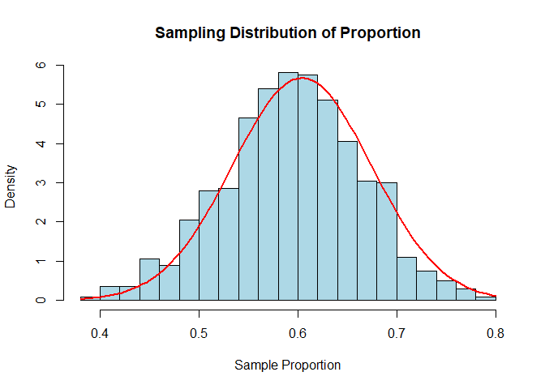

# Sampling Distribution of Proportion

## What is a Sampling Distribution ?

When we calculate a sample proportion (*p̂*) from one sample, it may
differ from the true population proportion (*p*) because of **random
chance**.

If we:

-   Take many random samples of the same size,
-   Calculate the **proportion of “successes”** (like defective items or
    yes votes) in each,
-   Then plot all these sample proportions…

We get a **sampling distribution of the proportion**.

> When we repeat a survey or experiment many times and record the
> proportion of successes each time, the distribution of those sample
> proportions is called the **sampling distribution of the sample
> proportion** (*p̂*).

-   Here, we selected multiple samples (n = 100) randomly from the
    population of 10,000 and calculated proportion for each sample.
    -   Sample 1 (n = 100) → proportion(Sample 1)
    -   Sample 2 (n = 100) → proportion(Sample 2)
    -   Sample 3 (n = 100) → proportion(Sample 3)
    -   Sample 4 (n = 100) → proportion(Sample 4)
    -   Sample n (n = 100) → proportion(Sample n)

------------------------------------------------------------------------

### Key characteristics of the Sampling Distribution of Proportion

Let:

-   *p*: true population proportion
-   *p̂*
-   *n*: sample size

Then: | Quantity | Formula | | ———————– | ——————————————- | | **Mean** |
*E*(*p̂*) = *p* | | **Standard Error (SE)** |
$SE\_{\hat{p}} = \sqrt{\frac{p(1 - p)}{n}}$ | | **Shape (CLT)** |
Approximately normal if CLT conditions hold |

------------------------------------------------------------------------

## What is the Central Limit Theorem (CLT)?

The **Central Limit Theorem** is one of the most powerful concepts in
statistics. It says:

> If you repeatedly take random samples of size *n* from a population
> and calculate a statistic (like the mean or proportion), then the
> distribution of those statistics will tend to be **normal
> (bell-shaped)** as *n* becomes large — **no matter what the shape of
> the original population**.

<table style="width:6%;">
<colgroup>
<col style="width: 5%" />
</colgroup>
<tbody>
<tr>
<td>## Example: You want to estimate the proportion of people in a city
who support a policy. - The true proportion in the population is $ p =
0.6$. - You take <strong>100 different random samples</strong>, each of
size <em>n</em> = 50. - In each sample,
you calculate the proportion of people who support the policy. - The
distribution of those 100 sample proportions <em>p̂</em> forms the <strong>sampling
distribution of the proportion</strong>.</td>
</tr>
</tbody>
</table>

### CLT Conditions for Proportions

The sampling distribution of *p̂* is approximately normal if:

$$
\large \text {np} \geq= 10 \space and \space n(1 - p) \geq 10
$$

<table>
<thead>
<tr>
<th style="text-align: left;">Condition</th>
<th style="text-align: left;">Why it matters</th>
</tr>
</thead>
<tbody>
<tr>
<td style="text-align: left;"><em>n</em><em>p</em> ≥ 10</td>
<td style="text-align: left;">Enough expected successes</td>
</tr>
<tr>
<td style="text-align: left;"><em>n</em>(1 − <em>p</em>) ≥ 10</td>
<td style="text-align: left;">Enough expected failure</td>
</tr>
</tbody>
</table>

### Z-score formula for proportion

$$
\large Z = \frac{\hat{p} - p}{\sqrt \frac {p(1 - p)}{n}}
$$

Used for testing if a sample proportion is significantly different from
the population proportion.

#### Example:

Claim: 60% support a new policy. Sample of 100 shows 54% support
(*p̂* = 0.54). Is it significantly lower?

$$
\large Z = \frac{0.54 - 0.6}{\sqrt \frac {(0.6)(0.4)}{100}} = \frac{-0.06}{0.049} = -1.22
$$

Check standard normal table:
*Z* = −1.22 ⇒ *p* − *v**a**l**u**e* &gt; 0.05 → **Fail to reject null**.

#### Applications of Sampling Distribution of Proportion

<table>
<colgroup>
<col style="width: 29%" />
<col style="width: 70%" />
</colgroup>
<thead>
<tr>
<th>Use Case</th>
<th>Description</th>
</tr>
</thead>
<tbody>
<tr>
<td><strong>Polls and Surveys</strong></td>
<td>Estimating % of population with certain opinion</td>
</tr>
<tr>
<td><strong>Medical Studies</strong></td>
<td>Proportion of patients recovering under a treatment</td>
</tr>
<tr>
<td><strong>Quality Control</strong></td>
<td>Proportion of defective items in a batch</td>
</tr>
<tr>
<td><strong>Elections</strong></td>
<td>Predicting candidate’s support in the population</td>
</tr>
</tbody>
</table>

#### Example

A company claims that **5% of its products are defective**. As a quality
inspector, you want to verify this by taking random samples of products
and checking the **proportion of defective items**.

You decide to:

-   Take a **sample of 100 items** each time.
-   Repeat this sampling **1000 times**.
-   Analyze the **sampling distribution** of observed defective
    proportions (*p̂*).

<!-- -->

    # Set seed for reproducibility
    set.seed(123)

    # Population defect rate
    p <- 0.05

    # Sample size per inspection
    n <- 100

    # Number of samples (inspections)
    num_samples <- 1000

    # Generate 1000 sample proportions from binomial trials
    sample_props <- replicate(num_samples, {
      sample_data <- rbinom(n, size = 1, prob = p)  # 1 = defective, 0 = fine
      mean(sample_data)
    })

    # Plot the sampling distribution
    hist(sample_props, breaks = 30, probability = TRUE,
         main = "Sampling Distribution of Defective Proportions",
         xlab = "Sample Proportion of Defective Items", col = "lightblue")

    # Add normal curve for comparison
    mean_p <- mean(sample_props)
    se_p <- sd(sample_props)

    curve(dnorm(x, mean = mean_p, sd = se_p), col = "red", lwd = 2, add = TRUE)

    # Print summary statistics
    cat("Mean of sample proportions:", round(mean_p, 4), "\n")

    ## Mean of sample proportions: 0.0501

    cat("Standard error of proportions:", round(se_p, 4), "\n")

    ## Standard error of proportions: 0.022

#### Interpretation

-   The histogram shows how sample proportions of defective items vary
    from inspection to inspection.

-   The **red curve** shows the **normal approximation** to the
    distribution.

-   You can **compare the mean of observed proportions** to the claimed
    defect rate (5%).

#### Insight from Simulation

If the sample mean is close to 0.05 and follows the expected bell shape,
the company’s claim appears valid.

> If many samples give much higher than 0.05, it could signal higher
> true defect rates.

#### Summary Table

<table>
<thead>
<tr>
<th>Concept</th>
<th>Description</th>
</tr>
</thead>
<tbody>
<tr>
<td><em>p̂</em></td>
<td>Sample proportion</td>
</tr>
<tr>
<td><em>p</em></td>
<td>Population proportion</td>
</tr>
<tr>
<td><em>E</em>(<em>p̂</em>)</td>
<td>Mean of sampling distribution (equals <em>p</em>)</td>
</tr>
<tr>
<td><em>S</em><em>E</em><em>p̂</em></td>
<td>Standard error of sample proportion</td>
</tr>
<tr>
<td>Normal approximation</td>
<td>Valid if <em>n</em><em>p</em> ≥ 10
and <em>n</em>(1 − <em>p</em>) ≥ 10</td>
</tr>
</tbody>
</table>
