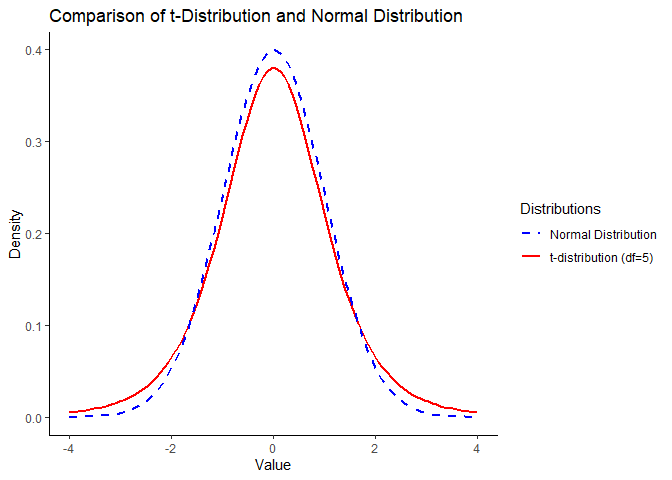

# T-test

A **T-test** is a statistical test used to compare the means of one or
two groups to determine if there is a significant difference between
them. It is based on **Student’s t-distribution** and is particularly
useful when the sample size is small (**n &lt; 30**) or when the
population standard deviation is unknown.

### Why is T-Test Important?

#### 1. Small Sample Size:

When the sample size is small, the Central Limit Theorem does not
necessarily apply, so we cannot assume that the sample mean follows a
normal distribution. The t-test helps in such cases.

#### 2. Unknown Population Variance:

Unlike the Z-test, which requires a known population variance, the
t-test estimates the variance from the sample.

#### 3. Hypothesis Testing:

It helps determine if differences between sample means are statistically
significant or due to random chance.

#### 4. Widely Used in Research:

Common in medical studies, psychology, and social sciences for comparing
two groups.

#### Difference Between T-Test and Z-Test

<table>
<colgroup>
<col style="width: 33%" />
<col style="width: 33%" />
<col style="width: 33%" />
</colgroup>
<thead>
<tr class="header">
<th style="text-align: left;">Feature</th>
<th style="text-align: left;">T-Test</th>
<th style="text-align: left;">Z-Test</th>
</tr>
</thead>
<tbody>
<tr class="odd">
<td style="text-align: left;">Sample Size</td>
<td style="text-align: left;">Small (n &lt; 30)</td>
<td style="text-align: left;">Large (n ≥ 30)</td>
</tr>
<tr class="even">
<td style="text-align: left;">Population Variance</td>
<td style="text-align: left;">Unknown</td>
<td style="text-align: left;">Known</td>
</tr>
<tr class="odd">
<td style="text-align: left;">Distribution Used</td>
<td style="text-align: left;">Student’s t-distribution</td>
<td style="text-align: left;">Normal Distribution</td>
</tr>
<tr class="even">
<td style="text-align: left;">Applicability</td>
<td style="text-align: left;">Compares means when variance is estimated
from the sample</td>
<td style="text-align: left;">Compares means when variance is known</td>
</tr>
</tbody>
</table>

-   T-test is more commonly used than Z-test
-   In real-world scenarios, population standard deviation is rarely
    known, making t-test more practical.
-   Many studies work with small sample sizes, requiring the use of the
    t-test.

### Distribution of T-Test

The t-distribution:

-   **Bell-shaped and symmetric**, similar to the normal distribution.
-   **Heavier tails** than normal distribution, meaning it accounts for
    more variability when sample size is small.
-   As **sample size increases, the t-distribution approaches the normal
    distribution**.

<!-- -->

    ## Warning: Using `size` aesthetic for lines was deprecated in ggplot2 3.4.0.
    ## ℹ Please use `linewidth` instead.
    ## This warning is displayed once every 8 hours.
    ## Call `lifecycle::last_lifecycle_warnings()` to see where this warning was
    ## generated.

#### Graph Interpretation

-   The **dashed red line** represents the **normal distribution**.
-   The **solid blue line** represents the **t-distribution (df=5)**.
-   The **t-distribution has heavier tails**, indicating higher
    variability when degrees of freedom are small.
-   As **df increases**, the t-distribution converges to the normal
    distribution.

#### Graph Interpretation:

-   The **red line (df=2)** has the heaviest tails, meaning more spread.
    The **blue line (df=5)** still has noticeable heavy tails. The
    **green line (df=10)** starts to resemble the normal distribution.
    The **purple line (df=30)** is very close to the normal
    distribution. The **black dashed line represents the standard normal
    distribution.**

As **df increases**, the **t-distribution becomes narrower and converges
to the normal distribution**, demonstrating how with **large sample
sizes**, the t-test behaves like a Z-test.

## Types of T-test

### 1. One Sample T-Test:

Compare the sample mean to a known population mean.

### 2. Independent (Unpaired) T-Test:

Compare means of two independent groups.

### 3. Paired T-Test:

Compare means of the same group before and after an intervention.

[⬅ Back to Home](../index.md)
