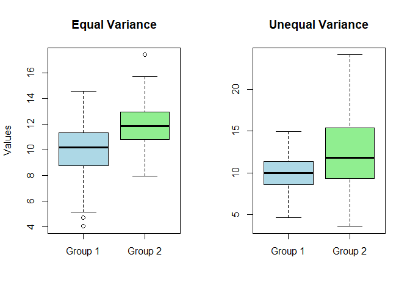
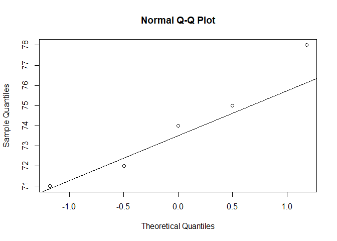
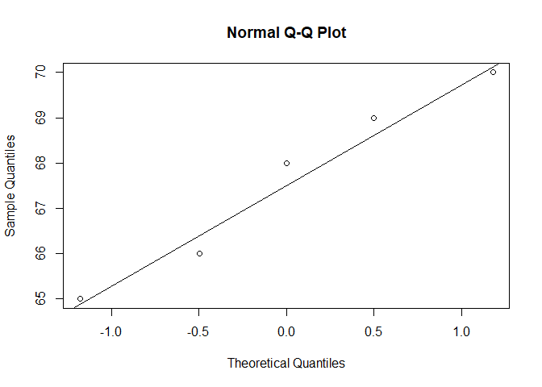

# Independent Sample T-test

The **Independent Two-Sample T-Test** (also known as the unpaired
t-test) is used to determine whether the **means of two independent
groups** are statistically significantly different.

It is commonly applied in cases such as: - Comparing test scores between
two different classes - Comparing the effectiveness of two treatments on
separate patient group

## Hypotheses

### Null Hypothesis (*H*0)

$$
\large H{\scriptstyle 0}: \mu{\scriptstyle 1} = \mu{\scriptstyle 2}
$$

### Alternative Hypothesis (*H*1)

$$
\large H{\scriptstyle 1}: \mu{\scriptstyle 1} \ne \mu{\scriptstyle 2}
$$

## Formulas

### Pooled T-Test

The **Pooled T-Test** is a version of the **Independent Two-Sample
T-Test** used when you assume that the variances of both groups are
equal.

It uses a **pooled estimate** of the variance, which combines the
variability from both groups into a single estimate.

-   We used it when the assumption of equal variances holds (i.e., the
    spread of values is similar in both groups).

#### Equal variance assumed

It means the two populations you’re comparing are believed to have
**similar spread (variability)**. If this assumption is violated, it can
affect the **validity** of the pooled t-test.

$$
\Large t = \frac{\bar{X{\scriptstyle 1}} - \bar{X{\scriptstyle 2}}}{s{\scriptstyle p} \sqrt{\frac{1}{n{\scriptstyle 1}} + \frac{1}{n{\scriptstyle 2}}}}
$$

Where:

$$S{\scriptstyle p} = \sqrt{\frac{(n{\scriptstyle 1} - 1)s{\scriptstyle 1^2} + (n{\scriptstyle 2} - 1)s{\scriptstyle 2^2}}{n{\scriptstyle 1} + n{\scriptstyle 2} - 2}}$$

-   is the pooled standard deviation

-   *X̄*1, *X̄*2: Sample means

-   *s*12, *s*22: Sample variance

-   *n*1, *n*2: Sample sizes

### Unequal Variances (Welch’s T-Test)

Welch’s T-Test is an **adjusted form** of the t-test that **does not
assume equal variances**. It is more robust and conservative than the
pooled version.

-   When variances are unequal
-   Sample sizes are unequal

$$
\Large t = \frac{\bar{X{\scriptstyle 1}} - \bar{X{\scriptstyle 2}}}{\sqrt{\frac{s{\scriptstyle 1^2}}{n{\scriptstyle 1}} + \frac{s{\scriptstyle 2^2}}{n{\scriptstyle 2}}}}
$$

### Equal vs. Unequal Variance Visualization

    # Set seed for reproducibility
    set.seed(42)

    # Simulate data
    group1_equal <- rnorm(100, mean = 10, sd = 2)
    group2_equal <- rnorm(100, mean = 12, sd = 2)

    group1_unequal <- rnorm(100, mean = 10, sd = 2)
    group2_unequal <- rnorm(100, mean = 12, sd = 5)

    # Create plots
    par(mfrow = c(1, 2))  # Side-by-side plots

    # Plot 1: Equal Variance
    boxplot(group1_equal, group2_equal,
            names = c("Group 1", "Group 2"),
            main = "Equal Variance",
            col = c("lightblue", "lightgreen"),
            ylab = "Values")

    # Plot 2: Unequal Variance
    boxplot(group1_unequal, group2_unequal,
            names = c("Group 1", "Group 2"),
            main = "Unequal Variance",
            col = c("lightblue", "lightgreen"))

    #mtext("Visual Comparison: Equal vs Unequal Variance", outer = TRUE, line = 0, cex = 1.2)

#### Degrees of Freedom (Welch–Satterthwaite approximation):

$$
\Large df = \frac{\left(\frac{s{\scriptstyle 1^2}}{n{\scriptstyle 1}} + \frac{s{\scriptstyle 2^2}}{n{\scriptstyle 2}}\right)^2}{\frac{(s{\scriptstyle 1^2}/n{\scriptstyle 1})^2}{n{\scriptstyle 1} - 1} + \frac{(s{\scriptstyle 2^2}/n{\scriptstyle 2})^2}{n{\scriptstyle 2} - 1}}
$$

-   Can be two-tailed (default) or one-tailed.

## Assumptions

-   Both groups are **independent**
-   Data is **normally distributed** within each group
-   Variances are **equal** (for pooled t-test), or Welch’s test used
    when they are not
-   Data is on **interval/ratio** scale

## Example

### Scenario:

You want to test whether men and women differ in protein intake.

#### Data:

<table>
<thead>
<tr class="header">
<th style="text-align: left;">Men</th>
<th style="text-align: left;">Women</th>
</tr>
</thead>
<tbody>
<tr class="odd">
<td style="text-align: left;">72</td>
<td style="text-align: left;">68</td>
</tr>
<tr class="even">
<td style="text-align: left;">75</td>
<td style="text-align: left;">66</td>
</tr>
<tr class="odd">
<td style="text-align: left;">78</td>
<td style="text-align: left;">70</td>
</tr>
<tr class="even">
<td style="text-align: left;">71</td>
<td style="text-align: left;">65</td>
</tr>
<tr class="odd">
<td style="text-align: left;">74</td>
<td style="text-align: left;">69</td>
</tr>
</tbody>
</table>

$$\large \bar{X{\scriptstyle 1}} = 74,\\s{\scriptstyle 1^2} = 6.5,\\n{\scriptstyle 1} = 5$$

$$\large \bar{X{\scriptstyle 2}} = 67.6,\\s{\scriptstyle 2^2} = 3.3,\\n{\scriptstyle 2} = 5$$

### Step-by-step (Welch’s T-Test):

**1. Compute t-statistic**

$$
\large t = \frac{74 - 67.6}{\sqrt{\frac{6.5}{5} + \frac{3.3}{5}}} = \frac{6.4}{\sqrt{1.3 + 0.66}} = \frac{6.4}{1.4} \approx 4.57
$$

**2. Compute degrees of freedom**

$$
\large df = \frac{1.96^2}{\frac{(1.3)^2}{4} + \frac{(0.66)^2}{4}} = \frac{3.84}{0.5314} \approx 7.23 \Rightarrow df \approx 7
$$

**3. Critical value**

$$ \large \alpha = 0.05, two-tailed: t{\scriptstyle critical} = \pm 2.365$$

**4. Decision**:

Since-

4.57 &gt; 2.365, reject null hypothesis hence significant difference

    # Data
    men <- c(72, 75, 78, 71, 74)
    women <- c(68, 66, 70, 65, 69)

    # Welch's t-test (unequal variances)
    t.test(men, women, var.equal = FALSE)

    ## 
    ##  Welch Two Sample t-test
    ## 
    ## data:  men and women
    ## t = 4.166, df = 7.452, p-value = 0.003669
    ## alternative hypothesis: true difference in means is not equal to 0
    ## 95 percent confidence interval:
    ##  2.811585 9.988415
    ## sample estimates:
    ## mean of x mean of y 
    ##      74.0      67.6

## Assumption Checks in R

### Normality

    shapiro.test(men)

    ## 
    ##  Shapiro-Wilk normality test
    ## 
    ## data:  men
    ## W = 0.96358, p-value = 0.8327

    shapiro.test(women)

    ## 
    ##  Shapiro-Wilk normality test
    ## 
    ## data:  women
    ## W = 0.95235, p-value = 0.754

    qqnorm(men); qqline(men)

    qqnorm(women); qqline(women)

### Equal Variance (Levene’s Test)

Levene’s Test checks the assumption of **equal variances** between two
or more groups. It is a **pre-test** to help you decide whether to use
the **pooled t-test** or **Welch’s t-test**.

*N**u**l**l* *h**y**p**o**t**h**e**s**i**s* (*H*0)

-   Variances are equal

*A**l**t**e**r**n**a**t**i**v**e* *h**y**p**o**t**h**e**s**i**s* (*H*1)

-   Variances are not equal

#### Interpretation:

-   **p &gt; 0.05**: Fail to reject H₀ → **Use pooled t-test**

-   **p ≤ 0.05**: Reject H₀ → **Use Welch’s t-test**

<!-- -->

    library(car)

    ## Loading required package: carData

    data <- data.frame(group = factor(rep(c("Men", "Women"), each = 5)),
                       value = c(men, women))
    leveneTest(value ~ group, data)

    ## Levene's Test for Homogeneity of Variance (center = median)
    ##       Df F value Pr(>F)
    ## group  1  0.2105 0.6586
    ##        8

## Effect Size (Cohen’s d) for independent sample T test

Cohen’s d quantifies the standardized difference between two group
means.

$$
\Large d = \frac {\bar X{\scriptstyle 1}  - \bar X{\scriptstyle 2}} {s{\scriptstyle p}}
$$

Where:

*s**p* = pooled standard deviation as defined earlier

    library(effsize)

    ## Warning: package 'effsize' was built under R version 4.4.3

    cohen.d(men, women)

    ## 
    ## Cohen's d
    ## 
    ## d estimate: 2.634838 (large)
    ## 95 percent confidence interval:
    ##    lower    upper 
    ## 0.641620 4.628057

## Non-parametric Alternative

Use when data is not normal:

    wilcox.test(men, women)

    ## 
    ##  Wilcoxon rank sum exact test
    ## 
    ## data:  men and women
    ## W = 25, p-value = 0.007937
    ## alternative hypothesis: true location shift is not equal to 0

### Interpretation

-   **t = 4.57**, **p &lt; 0.01** → statistically significant
-   **Cohen’s d** indicates effect size
-   Confirm assumptions to validate inference

#### References

-   Casella & Berger (2002), *Statistical Inference*
-   Montgomery & Runger (2018), *Applied Statistics and Probability for
    Engineers*
-   R Documentation:
    <https://www.rdocumentation.org/packages/stats/topics/t.test>
-   NIST Handbook: <https://www.itl.nist.gov/div898/handbook/>
