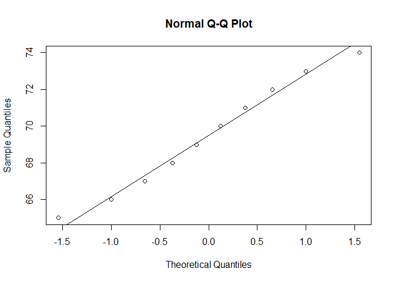

# One Sample T-test

A **One-Sample T-Test** is used to determine whether the mean of a
single sample is significantly different from a known or hypothesized
population mean (*μ*0).

### Hypotheses

#### Null:

*H*0 : *μ* = *μ*0

#### Alternative:

*H*1 : *μ* ≠ *μ*0

-   Two-tailed by default, but can be one-tailed depending on context.

### Formula

$$
\Large t = \frac{\bar{X} - \mu{\scriptstyle 0}}{s / \sqrt{n}}
$$

Where:

-   *X̄*: sample mean
-   *μ*0: hypothesized population mean
-   *s*: sample standard deviation
-   *n*: sample size

### Assumptions

-   Data is continuous and interval/ratio scale
-   Sample is random and independent
-   Sample differences are normally distributed

## Example: Calculation

-   Sample: `x = c(68, 72, 65, 70, 71, 69, 74, 73, 66, 67)`
-   Hypothesized mean *μ*0 = 70

**Step 1: Sample Mean**

*X̄* = 69.5

**Step 2: Sample Standard Deviation**

*s* = 3.03

**Step 3: Compute t-statistic**

$$ t = \frac{69.5 - 70}{3.03 / \sqrt{10}} = \frac{-0.5}{0.958} \approx -0.522 $$

**Step 4: Degrees of Freedom**

*d**f* = 10 - 1 = 9

    x <- c(68, 72, 65, 70, 71, 69, 74, 73, 66, 67)
    t.test(x, mu = 70)

    ## 
    ##  One Sample t-test
    ## 
    ## data:  x
    ## t = -0.52223, df = 9, p-value = 0.6141
    ## alternative hypothesis: true mean is not equal to 70
    ## 95 percent confidence interval:
    ##  67.33415 71.66585
    ## sample estimates:
    ## mean of x 
    ##      69.5

**Step 5: Decision**

Critical t-value at *α* = 0.05 (two-tailed, df = 9): ±2.262 Since
−0.522 &lt; 2.262, we fail to reject *H*0. Results from R
also showed p value is &gt; 0.05. Confidence interval (67.33 - 71.67)
also contains hypothesized mean *μ*0 = 70.

### Normality Test

    shapiro.test(x)

    ## 
    ##  Shapiro-Wilk normality test
    ## 
    ## data:  x
    ## W = 0.97016, p-value = 0.8924

    qqnorm(x)
    qqline(x)

-   p value for Shapiro wilk test is &gt; 0.05. Hence, data is normally
    distributed.
-   Q-Q plot also suggests data is normally distributed.

### Effect Size (Cohen’s d)

Cohen’s d measures the standardized difference between the sample mean
and the hypothesized population mean. It tells us how large that
difference is in units of standard deviation.

For a One-Sample T-Test, **Cohen’s d** is defined as:

$$
\Large d = \frac {\bar X - \mu{\scriptstyle 0}} {s}
$$

Where:

-   *X̄*: Sample mean
-   *μ*0: Hypothesized mean
-   *s*: Sample standard deviation

<!-- -->

    # Compute sample mean and standard deviation
    x_bar <- mean(x)
    s <- sd(x)
    mu_0 <- 70

    # Compute Cohen's d
    cohen_d <- (x_bar - mu_0) / s
    cohen_d

    ## [1] -0.1651446

Interpretation:

-   d &lt; 0.2 → very small

-   0.2–0.5 → small

-   0.5–0.8 → medium

-   0.8 → large

-   The **effect size is very small or negligible**. This means the
    difference between the sample mean and the hypothesized value (70)
    is small and likely not practically significant — even if it were
    statistically significant (which it’s not in this case either).

### Non-parametric Alternative

    wilcox.test(x, mu = 70)

    ## Warning in wilcox.test.default(x, mu = 70): cannot compute exact p-value with
    ## ties

    ## Warning in wilcox.test.default(x, mu = 70): cannot compute exact p-value with
    ## zeroes

    ## 
    ##  Wilcoxon signed rank test with continuity correction
    ## 
    ## data:  x
    ## V = 18, p-value = 0.6344
    ## alternative hypothesis: true location is not equal to 70

-   Used when the normality assumption is violated.
-   p value is &gt; 0.05. Hence, null hypothesis is accepted.
-   We will see in detail in nonparametric section.

## Conclusion

In this example, we do **not** find a significant difference between the
sample mean and hypothesized mean. Always combine statistical
significance with effect size and assumptions check.

------------------------------------------------------------------------

#### References

-   Casella & Berger (2002), *Statistical Inference*
-   Montgomery & Runger (2018), *Applied Statistics and Probability for
    Engineers*
-   R Documentation:
    <https://www.rdocumentation.org/packages/stats/topics/t.test>
-   NIST Handbook: <https://www.itl.nist.gov/div898/handbook/>

[⬅ Back to Home](../T-test.md)
